# C11 Middlewares 思维导图与可视化

> **文档定位**: Rust 1.90 中间件技术可视化学习  
> **创建日期**: 2025-10-20  
> **适用版本**: Rust 1.90+ | Edition 2024  
> **文档类型**: 思维导图 + 流程图 + 架构图

---

## 📊 目录

- [C11 Middlewares 思维导图与可视化](#c11-middlewares-思维导图与可视化)
  - [📊 目录](#-目录)
  - [1. 中间件全景思维导图](#1-中间件全景思维导图)
    - [技术栈总览](#技术栈总览)
  - [2. 消息队列架构图](#2-消息队列架构图)
    - [Kafka架构](#kafka架构)
    - [消息流转流程](#消息流转流程)
  - [3. 数据库中间件架构](#3-数据库中间件架构)
    - [连接池架构](#连接池架构)
    - [查询执行流程](#查询执行流程)
  - [4. 代理服务器架构](#4-代理服务器架构)
    - [Pingora请求处理](#pingora请求处理)
    - [负载均衡决策流程](#负载均衡决策流程)
  - [5. 缓存架构图](#5-缓存架构图)
    - [多级缓存架构](#多级缓存架构)
    - [缓存更新策略](#缓存更新策略)
  - [6. 监控与可观测性](#6-监控与可观测性)
    - [全链路追踪](#全链路追踪)
  - [7. 部署架构](#7-部署架构)
    - [微服务部署](#微服务部署)
  - [相关文档](#相关文档)
  - [返回导航](#返回导航)

---

## 1. 中间件全景思维导图

### 技术栈总览

```mermaid
mindmap
  root((中间件技术栈))
    消息队列
      Kafka
        高吞吐
        事件流
        日志聚合
      RabbitMQ
        任务队列
        RPC
        微服务
      Pulsar
        多租户
        统一平台
        地理复制
      NATS
        IoT
        边缘计算
        极低延迟
    数据库中间件
      ORM框架
        SQLx
          原生SQL
          类型安全
          异步优先
        Diesel
          强类型DSL
          编译时检查
          迁移工具
        SeaORM
          易学易用
          完整异步
          ActiveRecord
      连接池
        连接复用
        健康检查
        负载均衡
      缓存层
        查询缓存
        分布式缓存
        本地缓存
    网络代理
      Pingora
        内存安全
        零停机重载
        HTTP/3
      负载均衡
        轮询
        最少连接
        一致性哈希
      TLS终止
        证书管理
        SNI
        ALPN
      限流熔断
        令牌桶
        漏桶
        熔断器
    缓存中间件
      Redis
        数据结构
        持久化
        集群模式
      Memcached
        简单K-V
        高性能
        分布式
      本地缓存
        零延迟
        内存限制
        LRU淘汰
    可观测性
      日志
        结构化日志
        集中式收集
        查询分析
      指标
        Prometheus
        自定义指标
        告警
      追踪
        分布式追踪
        Span关联
        性能分析
    高性能技术
      IO运行时
        Tokio
          epoll模型
          成熟生态
          通用场景
        io_uring
          tokio-uring
            零拷贝
            批量操作
          Monoio
            字节跳动
            极致性能
          Glommio
            线程亲和
            NUMA感知
      数据格式
        传统格式
          JSON
            人类可读
            通用兼容
          Protobuf
            类型安全
            RPC优化
        现代格式
          Arrow
            列式存储
            零拷贝
            SIMD加速
            Flight RPC
          Parquet
            压缩存储
            分析查询
```

---

## 2. 消息队列架构图

### Kafka架构

```mermaid
graph TB
    subgraph Producer [生产者集群]
        P1[Producer 1]
        P2[Producer 2]
        P3[Producer 3]
    end
    
    subgraph Kafka [Kafka集群]
        subgraph Broker1 [Broker 1 - Leader]
            T1P0[Topic1-P0<br/>Leader]
            T1P1[Topic1-P1<br/>Follower]
        end
        
        subgraph Broker2 [Broker 2]
            T1P1L[Topic1-P1<br/>Leader]
            T1P0F[Topic1-P0<br/>Follower]
        end
        
        subgraph Broker3 [Broker 3]
            T1P0F2[Topic1-P0<br/>Follower]
            T1P1F2[Topic1-P1<br/>Follower]
        end
        
        ZK[ZooKeeper/KRaft<br/>元数据管理]
    end
    
    subgraph Consumer [消费者组]
        CG1[Consumer Group 1]
        C1[Consumer 1<br/>P0]
        C2[Consumer 2<br/>P1]
        
        CG2[Consumer Group 2]
        C3[Consumer 3<br/>P0,P1]
    end
    
    P1 -->|发送| T1P0
    P2 -->|发送| T1P1L
    P3 -->|发送| T1P0
    
    T1P0 -.->|复制| T1P0F
    T1P0 -.->|复制| T1P0F2
    T1P1L -.->|复制| T1P1
    T1P1L -.->|复制| T1P1F2
    
    T1P0 -->|消费| C1
    T1P1L -->|消费| C2
    T1P0 -->|消费| C3
    T1P1L -->|消费| C3
    
    ZK -.->|协调| Broker1
    ZK -.->|协调| Broker2
    ZK -.->|协调| Broker3
    
    style Producer fill:#e3f2fd
    style Kafka fill:#fff3e0
    style Consumer fill:#e8f5e9
    style ZK fill:#f3e5f5
```

### 消息流转流程

```mermaid
sequenceDiagram
    participant P as Producer
    participant B as Broker-Leader
    participant F1 as Follower-1
    participant F2 as Follower-2
    participant C as Consumer
    
    Note over P,C: 消息发送流程
    P->>B: 1. 发送消息
    B->>B: 2. 写入本地日志
    
    par 并行复制
        B->>F1: 3a. 复制消息
        B->>F2: 3b. 复制消息
    end
    
    F1->>B: 4a. 确认复制
    F2->>B: 4b. 确认复制
    
    B->>P: 5. 返回ACK
    
    Note over P,C: 消息消费流程
    C->>B: 6. 拉取消息
    B->>C: 7. 返回消息批次
    C->>C: 8. 处理消息
    C->>B: 9. 提交offset
```

---

## 3. 数据库中间件架构

### 连接池架构

```mermaid
graph TB
    subgraph App [应用层]
        T1[线程1]
        T2[线程2]
        T3[线程3]
        T4[线程4]
    end
    
    subgraph Pool [连接池 - SQLx]
        Manager[连接管理器]
        
        subgraph Active [活跃连接]
            C1[Conn 1<br/>使用中]
            C2[Conn 2<br/>使用中]
        end
        
        subgraph Idle [空闲连接]
            C3[Conn 3<br/>空闲]
            C4[Conn 4<br/>空闲]
            C5[Conn 5<br/>空闲]
        end
        
        Health[健康检查器]
        Metrics[指标收集]
    end
    
    subgraph DB [数据库集群]
        Primary[主库<br/>读写]
        Replica1[从库1<br/>只读]
        Replica2[从库2<br/>只读]
    end
    
    T1 -->|请求连接| Manager
    T2 -->|请求连接| Manager
    T3 -.->|等待队列| Manager
    T4 -.->|等待队列| Manager
    
    Manager -->|分配| C1
    Manager -->|分配| C2
    Manager -->|从池获取| C3
    
    C1 -->|写操作| Primary
    C2 -->|读操作| Replica1
    C3 -.->|健康检查| Replica2
    
    Health -.->|定期检查| Active
    Health -.->|定期检查| Idle
    
    Metrics -.->|监控| Manager
    
    Primary -.->|主从复制| Replica1
    Primary -.->|主从复制| Replica2
    
    style App fill:#e3f2fd
    style Pool fill:#fff3e0
    style DB fill:#e8f5e9
```

### 查询执行流程

```mermaid
flowchart TD
    Start[开始查询] --> Parse[解析SQL]
    Parse --> Compile[编译检查]
    Compile -->|类型安全| Valid{验证通过?}
    
    Valid -->|是| Cache{缓存检查}
    Valid -->|否| Error[编译错误]
    
    Cache -->|命中| Return[返回缓存]
    Cache -->|未命中| Acquire[获取连接]
    
    Acquire --> PrepStmt[预编译语句]
    PrepStmt --> Bind[绑定参数]
    Bind --> Execute[执行查询]
    
    Execute --> Fetch[获取结果]
    Fetch --> Deserialize[反序列化]
    Deserialize --> CacheSet[更新缓存]
    
    CacheSet --> Release[释放连接]
    Release --> ReturnResult[返回结果]
    Return --> End[结束]
    ReturnResult --> End
    Error --> End
    
    style Start fill:#e3f2fd
    style Execute fill:#fff3e0
    style End fill:#e8f5e9
    style Error fill:#ffcdd2
```

---

## 4. 代理服务器架构

### Pingora请求处理

```mermaid
graph TB
    subgraph Client [客户端层]
        Browser[浏览器]
        Mobile[移动应用]
        API[API客户端]
    end
    
    subgraph Pingora [Pingora代理]
        Listener[监听器<br/>:80, :443]
        
        subgraph Processing [请求处理]
            Parse[请求解析]
            Auth[认证鉴权]
            RateLimit[限流检查]
            Cache[缓存检查]
            Route[路由选择]
        end
        
        subgraph Features [核心功能]
            TLS[TLS终止]
            Compress[压缩]
            Filter[请求过滤]
        end
        
        LB[负载均衡器]
        HealthChk[健康检查]
    end
    
    subgraph Backend [后端服务]
        Service1[服务1<br/>健康]
        Service2[服务2<br/>健康]
        Service3[服务3<br/>不健康]
    end
    
    subgraph Monitoring [监控]
        Metrics[指标收集]
        Logs[日志记录]
        Tracing[链路追踪]
    end
    
    Browser --> Listener
    Mobile --> Listener
    API --> Listener
    
    Listener --> Parse
    Parse --> TLS
    TLS --> Auth
    Auth --> RateLimit
    RateLimit --> Cache
    Cache --> Filter
    Filter --> Route
    Route --> LB
    
    HealthChk -.->|监控| Service1
    HealthChk -.->|监控| Service2
    HealthChk -.->|监控| Service3
    
    LB -->|转发| Service1
    LB -->|转发| Service2
    LB -.->|排除| Service3
    
    Processing -.->|上报| Metrics
    Processing -.->|记录| Logs
    Processing -.->|追踪| Tracing
    
    style Client fill:#e3f2fd
    style Pingora fill:#fff3e0
    style Backend fill:#e8f5e9
    style Monitoring fill:#f3e5f5
```

### 负载均衡决策流程

```mermaid
flowchart TD
    Start[接收请求] --> Extract[提取路由信息]
    Extract --> Strategy{选择策略}
    
    Strategy -->|轮询| RR[Round Robin]
    Strategy -->|最少连接| LC[Least Connections]
    Strategy -->|一致性哈希| CH[Consistent Hash]
    Strategy -->|IP哈希| IPH[IP Hash]
    
    RR --> Select1[选择下一个]
    LC --> Select2[选择最少连接]
    CH --> Select3[哈希计算]
    IPH --> Select4[IP哈希]
    
    Select1 --> Health{健康检查}
    Select2 --> Health
    Select3 --> Health
    Select4 --> Health
    
    Health -->|健康| Forward[转发请求]
    Health -->|不健康| Retry{重试?}
    
    Retry -->|是| Strategy
    Retry -->|否| Error[返回错误]
    
    Forward --> Monitor[监控记录]
    Monitor --> Response[返回响应]
    
    Error --> End[结束]
    Response --> End
    
    style Start fill:#e3f2fd
    style Forward fill:#c8e6c9
    style Error fill:#ffcdd2
    style End fill:#e8f5e9
```

---

## 5. 缓存架构图

### 多级缓存架构

```mermaid
graph TB
    subgraph App [应用层]
        Request[用户请求]
    end
    
    subgraph L1 [一级缓存 - 本地]
        LocalCache[内存缓存<br/>LRU]
        Hot[热数据<br/>命中率: 80%]
    end
    
    subgraph L2 [二级缓存 - Redis]
        Redis[Redis集群]
        Warm[温数据<br/>命中率: 15%]
    end
    
    subgraph L3 [三级缓存 - CDN]
        CDN[CDN边缘]
        Static[静态资源<br/>命中率: 95%]
    end
    
    subgraph DB [数据源]
        Database[(数据库)]
        Cold[冷数据<br/>命中率: 5%]
    end
    
    Request --> LocalCache
    LocalCache -->|未命中| Redis
    Redis -->|未命中| Database
    
    Database -->|回填| Redis
    Redis -->|回填| LocalCache
    
    Request -.->|静态资源| CDN
    CDN -.->|未命中| Database
    
    LocalCache -.->|TTL: 60s| Hot
    Redis -.->|TTL: 3600s| Warm
    CDN -.->|TTL: 86400s| Static
    
    style L1 fill:#e3f2fd
    style L2 fill:#fff3e0
    style L3 fill:#f3e5f5
    style DB fill:#e8f5e9
```

### 缓存更新策略

```mermaid
stateDiagram-v2
    [*] --> CacheEmpty: 初始状态
    
    CacheEmpty --> CacheMiss: 读请求
    CacheMiss --> LoadFromDB: 查询数据库
    LoadFromDB --> CacheLoaded: 数据加载
    CacheLoaded --> CacheHit: 缓存就绪
    
    CacheHit --> CacheHit: 读请求(命中)
    CacheHit --> UpdateCache: 写请求
    
    UpdateCache --> UpdateDB: 更新数据库
    UpdateDB --> InvalidateCache: 使缓存失效
    InvalidateCache --> CacheMiss: 下次读取
    
    CacheHit --> CacheExpired: TTL过期
    CacheExpired --> CacheMiss: 重新加载
    
    note right of CacheHit
        命中率: 85-95%
        响应时间: <1ms
    end note
    
    note right of UpdateDB
        Write-Through模式
        保证数据一致性
    end note
```

---

## 6. 监控与可观测性

### 全链路追踪

```mermaid
sequenceDiagram
    participant U as 用户
    participant G as 网关<br/>(Pingora)
    participant A as 服务A
    participant MQ as 消息队列<br/>(Kafka)
    participant B as 服务B
    participant DB as 数据库<br/>(PostgreSQL)
    participant C as 缓存<br/>(Redis)
    
    Note over U,C: TraceID: abc123
    
    U->>G: HTTP请求<br/>SpanID: span-1
    activate G
    
    G->>G: 认证鉴权<br/>100μs
    G->>C: 缓存查询<br/>SpanID: span-2
    activate C
    C-->>G: 缓存未命中<br/>1ms
    deactivate C
    
    G->>A: 转发请求<br/>SpanID: span-3
    activate A
    
    A->>DB: SQL查询<br/>SpanID: span-4
    activate DB
    DB-->>A: 返回数据<br/>5ms
    deactivate DB
    
    A->>MQ: 发送事件<br/>SpanID: span-5
    activate MQ
    MQ-->>A: ACK<br/>2ms
    deactivate MQ
    
    A->>C: 更新缓存<br/>SpanID: span-6
    activate C
    C-->>A: OK<br/>1ms
    deactivate C
    
    A-->>G: 业务响应<br/>10ms
    deactivate A
    
    G-->>U: HTTP响应<br/>总计: 20ms
    deactivate G
    
    Note over MQ,B: 异步处理
    MQ->>B: 消费消息<br/>SpanID: span-7
    activate B
    B->>DB: 写入日志
    deactivate B
```

---

## 7. 部署架构

### 微服务部署

```mermaid
graph TB
    subgraph Internet [互联网]
        Users[用户]
    end
    
    subgraph Edge [边缘层]
        CDN[CDN]
        WAF[WAF防火墙]
    end
    
    subgraph Gateway [网关层]
        LB1[负载均衡]
        Pingora1[Pingora实例1]
        Pingora2[Pingora实例2]
        Pingora3[Pingora实例3]
    end
    
    subgraph Services [服务层]
        subgraph API [API服务]
            API1[API-1]
            API2[API-2]
        end
        
        subgraph Business [业务服务]
            User1[User服务]
            Order1[Order服务]
            Pay1[Payment服务]
        end
    end
    
    subgraph Data [数据层]
        subgraph MQ [消息队列]
            Kafka1[Kafka集群]
        end
        
        subgraph DB [数据库]
            PostgreSQL[PostgreSQL主从]
            MySQL[MySQL集群]
        end
        
        subgraph Cache [缓存]
            Redis1[Redis集群]
        end
    end
    
    subgraph Monitor [监控层]
        Prom[Prometheus]
        Grafana[Grafana]
        Jaeger[Jaeger追踪]
    end
    
    Users --> CDN
    CDN --> WAF
    WAF --> LB1
    
    LB1 --> Pingora1
    LB1 --> Pingora2
    LB1 --> Pingora3
    
    Pingora1 --> API1
    Pingora2 --> API2
    Pingora3 --> API1
    
    API1 --> User1
    API1 --> Order1
    API2 --> Pay1
    
    User1 --> PostgreSQL
    Order1 --> MySQL
    Pay1 --> PostgreSQL
    
    User1 --> Redis1
    Order1 --> Redis1
    
    Order1 --> Kafka1
    Pay1 --> Kafka1
    
    Services -.->|指标| Prom
    Prom -.->|可视化| Grafana
    Services -.->|追踪| Jaeger
    
    style Internet fill:#e3f2fd
    style Gateway fill:#fff3e0
    style Services fill:#e8f5e9
    style Data fill:#f3e5f5
    style Monitor fill:#fce4ec
```

---

## 相关文档

- [知识图谱](./KNOWLEDGE_GRAPH_AND_CONCEPT_RELATIONS.md)
- [多维矩阵](./MULTI_DIMENSIONAL_COMPARISON_MATRIX.md)
- [性能分析](../analysis/rust190_ecosystem/03_performance_benchmarks/)
- [FAQ](../FAQ.md)

---

**文档版本**: v1.0  
**最后更新**: 2025-10-20  
**维护者**: Rust-lang项目组

---

## 返回导航

- [返回主索引](../00_MASTER_INDEX.md)
- [返回README](../README.md)
- [查看教程](../tutorials/)
