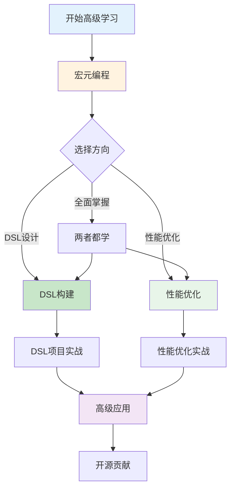

# 04_advanced - 宏系统高级主题

> **目录定位**: C11宏系统高级主题与深度探讨  
> **适用人群**: 有宏基础的开发者、库作者、DSL设计者  
> **相关文档**: [主索引](../00_MASTER_INDEX.md) | [过程宏](../03_procedural/)

**最后更新**: 2025-10-20  
**文档类型**: 🔬 高级文档

---

## 📋 目录

- [04\_advanced - 宏系统高级主题](#04_advanced---宏系统高级主题)
  - [📋 目录](#-目录)
  - [📚 高级主题列表](#-高级主题列表)
    - [🎨 宏元编程深度解析](#-宏元编程深度解析)
    - [🏗️ DSL构建实战](#️-dsl构建实战)
    - [⚡ 宏性能优化](#-宏性能优化)
    - [🔍 宏调试技术](#-宏调试技术)
    - [🧪 宏测试策略](#-宏测试策略)
    - [🚀 代码生成模式](#-代码生成模式)
  - [🎯 学习路径](#-学习路径)
    - [路径一：DSL设计者](#路径一dsl设计者)
    - [路径二：库作者](#路径二库作者)
    - [路径三：性能专家](#路径三性能专家)
  - [📖 推荐阅读顺序](#-推荐阅读顺序)
  - [🔗 相关资源](#-相关资源)
    - [前置知识](#前置知识)
    - [实战资源](#实战资源)
    - [工具链](#工具链)
    - [社区资源](#社区资源)
  - [返回导航](#返回导航)

---

## 📚 高级主题列表

### 🎨 宏元编程深度解析

深入探讨Rust宏的元编程能力：

- **[宏元编程](./macro_metaprogramming.md)** ⭐ 新增完整
  - TokenStream内部机制
  - AST操作与转换
  - 编译时计算
  - 类型级编程
  - 宏组合模式
  - 高级语法操作

**预计时间**: 6小时  
**难度**: ⭐⭐⭐⭐⭐

---

### 🏗️ DSL构建实战

从零构建领域特定语言：

- **[DSL构建指南](./dsl_construction.md)** ⭐ 新增完整
  - DSL设计原则
  - 语法设计
  - 解析器实现
  - SQL-like DSL案例
  - HTML模板DSL
  - 配置文件DSL
  - 测试DSL框架

**预计时间**: 8小时  
**难度**: ⭐⭐⭐⭐⭐

---

### ⚡ 宏性能优化

提升宏的编译性能：

- **[性能优化](./macro_optimization.md)** ⭐ 新增完整
  - 编译时性能分析
  - TokenStream优化
  - 增量编译优化
  - 宏展开缓存
  - 依赖最小化
  - 性能基准测试

**预计时间**: 4小时  
**难度**: ⭐⭐⭐⭐

---

### 🔍 宏调试技术

已有文档（计划中）:

- **[宏调试](./03_macro_debugging.md)** - 计划中
  - cargo-expand使用
  - trace_macros调试
  - 编译器诊断
  - 错误信息优化

**预计时间**: 4小时  
**难度**: ⭐⭐⭐

---

### 🧪 宏测试策略

已有文档（计划中）:

- **[宏测试](./05_macro_testing.md)** - 计划中
  - 单元测试
  - 集成测试
  - trybuild测试
  - 错误案例测试

**预计时间**: 4小时  
**难度**: ⭐⭐⭐

---

### 🚀 代码生成模式

已有文档（计划中）:

- **[代码生成](./02_code_generation.md)** - 计划中
  - 静态代码生成
  - 动态代码生成
  - Build scripts集成
  - 模板引擎

**预计时间**: 6小时  
**难度**: ⭐⭐⭐⭐

---

## 🎯 学习路径

### 路径一：DSL设计者

**目标**: 设计和实现领域特定语言

1. [宏元编程深度](./macro_metaprogramming.md) - 6小时
2. [DSL构建实战](./dsl_construction.md) - 8小时
3. [性能优化](./macro_optimization.md) - 4小时
4. 实践项目：构建自己的DSL

**总计**: 18小时 + 实践

---

### 路径二：库作者

**目标**: 为开源库设计高质量宏API

1. [宏元编程深度](./macro_metaprogramming.md) - 6小时
2. [DSL构建实战](./dsl_construction.md) - 4小时（选择性阅读）
3. [性能优化](./macro_optimization.md) - 4小时
4. [最佳实践](../05_practice/02_best_practices.md) - 3小时

**总计**: 17小时

---

### 路径三：性能专家

**目标**: 优化宏的编译性能

1. [宏元编程深度](./macro_metaprogramming.md) - 第3-4节
2. [性能优化](./macro_optimization.md) - 完整阅读
3. [TokenStream深度](../03_procedural/05_token_streams.md)
4. 性能基准测试实战

**总计**: 8小时

---

## 📖 推荐阅读顺序

**完整学习路径**:

---

## 🔗 相关资源

### 前置知识

- [过程宏基础](../03_procedural/01_proc_macro_basics.md)
- [TokenStream详解](../03_procedural/05_token_streams.md)
- [最佳实践](../05_practice/02_best_practices.md)

### 实战资源

- [真实案例分析](../05_practice/04_real_world_examples.md)
- [常见模式](../05_practice/01_common_patterns.md)
- [反模式避免](../05_practice/03_anti_patterns.md)

### 工具链

- cargo-expand - 宏展开查看
- syn - 语法解析
- quote - 代码生成
- proc-macro2 - 过程宏工具

### 社区资源

- [The Little Book of Rust Macros](https://danielkeep.github.io/tlborm/book/)
- [Procedural Macros Workshop](https://github.com/dtolnay/proc-macro-workshop)
- [syn文档](https://docs.rs/syn/)
- [quote文档](https://docs.rs/quote/)

---

**文档版本**: v1.0  
**最后更新**: 2025-10-20  
**维护者**: Rust-lang项目组

---

## 返回导航

- [返回主索引](../00_MASTER_INDEX.md)
- [返回模块README](../../README.md)
- [查看理论基础](../01_theory/)
- [查看过程宏](../03_procedural/)
