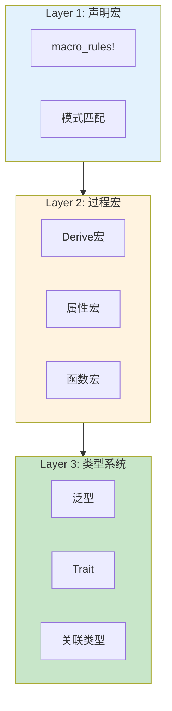

# 宏元编程深度解析

> **文档定位**: Rust宏元编程完整技术指南  
> **创建日期**: 2025-10-20  
> **适用版本**: Rust 1.90+ | Edition 2024  
> **文档类型**: 高级主题 + 深度解析

---

## 📊 目录

- [宏元编程深度解析](#宏元编程深度解析)
  - [📊 目录](#-目录)
  - [1. 元编程基础](#1-元编程基础)
    - [1.1 什么是元编程](#11-什么是元编程)
    - [1.2 Rust宏的三个层次](#12-rust宏的三个层次)
  - [2. TokenStream内部机制](#2-tokenstream内部机制)
    - [2.1 Token结构](#21-token结构)
    - [2.2 手动构建TokenStream](#22-手动构建tokenstream)
  - [3. AST操作与转换](#3-ast操作与转换)
    - [3.1 使用syn解析AST](#31-使用syn解析ast)
    - [3.2 AST访问器模式](#32-ast访问器模式)
  - [4. 编译时计算](#4-编译时计算)
    - [4.1 const宏](#41-const宏)
    - [4.2 编译时字符串处理](#42-编译时字符串处理)
  - [5. 类型级编程](#5-类型级编程)
    - [5.1 类型级列表](#51-类型级列表)
    - [5.2 类型级函数](#52-类型级函数)
  - [6. 宏组合模式](#6-宏组合模式)
    - [6.1 宏调用宏](#61-宏调用宏)
    - [6.2 过程宏调用声明宏](#62-过程宏调用声明宏)
  - [7. 高级语法操作](#7-高级语法操作)
    - [7.1 属性操作](#71-属性操作)
    - [7.2 泛型操作](#72-泛型操作)
  - [8. 实战案例](#8-实战案例)
    - [8.1 SQL查询生成器](#81-sql查询生成器)
    - [8.2 编译时JSON验证](#82-编译时json验证)
  - [总结](#总结)
  - [相关文档](#相关文档)
  - [返回导航](#返回导航)

---

## 1. 元编程基础

### 1.1 什么是元编程

**定义**: 编写生成或操作代码的代码。

```rust
/// 元编程的本质：代码即数据，数据即代码
///
/// Level 0: 运行时 - 执行代码
/// Level 1: 编译时 - 生成代码（宏）
/// Level 2: 类型系统 - 约束代码（泛型+trait）
```

### 1.2 Rust宏的三个层次



---

## 2. TokenStream内部机制

### 2.1 Token结构

```rust
use proc_macro2::{TokenStream, TokenTree, Spacing, Span};

/// Token的完整结构
pub enum TokenTree {
    /// 标识符或关键字
    Ident(Ident),
    
    /// 字面量
    Literal(Literal),
    
    /// 标点符号
    Punct(Punct),
    
    /// 分组 (括号包裹的内容)
    Group(Group),
}

/// Punct: 标点符号
pub struct Punct {
    ch: char,               // 字符: +, -, *, ...
    spacing: Spacing,       // Alone or Joint
    span: Span,             // 源代码位置
}

/// 示例：解析 `a + b`
fn parse_addition(tokens: TokenStream) {
    let mut iter = tokens.into_iter();
    
    // Token 1: Ident("a")
    let a = iter.next().unwrap();
    
    // Token 2: Punct('+', Alone)
    let plus = iter.next().unwrap();
    
    // Token 3: Ident("b")
    let b = iter.next().unwrap();
}
```

---

### 2.2 手动构建TokenStream

```rust
use quote::quote;
use syn::Ident;
use proc_macro2::{TokenStream, Span};

/// 方法1: 使用quote宏
fn build_with_quote() -> TokenStream {
    let name = Ident::new("MyStruct", Span::call_site());
    
    quote! {
        struct #name {
            field: i32,
        }
    }
}

/// 方法2: 手动构建
fn build_manually() -> TokenStream {
    use proc_macro2::{TokenTree, Group, Delimiter};
    
    let mut tokens = TokenStream::new();
    
    // struct
    tokens.extend([
        TokenTree::Ident(Ident::new("struct", Span::call_site())),
    ]);
    
    // MyStruct
    tokens.extend([
        TokenTree::Ident(Ident::new("MyStruct", Span::call_site())),
    ]);
    
    // { field: i32 }
    let mut body = TokenStream::new();
    body.extend([
        TokenTree::Ident(Ident::new("field", Span::call_site())),
        TokenTree::Punct(Punct::new(':', Spacing::Alone)),
        TokenTree::Ident(Ident::new("i32", Span::call_site())),
    ]);
    
    tokens.extend([
        TokenTree::Group(Group::new(Delimiter::Brace, body)),
    ]);
    
    tokens
}
```

---

## 3. AST操作与转换

### 3.1 使用syn解析AST

```rust
use syn::{parse_macro_input, DeriveInput, Data, Fields};
use quote::quote;

#[proc_macro_derive(MyDebug)]
pub fn my_debug(input: TokenStream) -> TokenStream {
    // 1. 解析为AST
    let input = parse_macro_input!(input as DeriveInput);
    
    let name = &input.ident;
    let generics = &input.generics;
    let (impl_generics, ty_generics, where_clause) = generics.split_for_impl();
    
    // 2. 分析结构
    let debug_fields = match &input.data {
        Data::Struct(data) => {
            match &data.fields {
                Fields::Named(fields) => {
                    let field_names: Vec<_> = fields.named
                        .iter()
                        .map(|f| &f.ident)
                        .collect();
                    
                    quote! {
                        #(
                            .field(stringify!(#field_names), &self.#field_names)
                        )*
                    }
                }
                _ => panic!("Only named fields supported"),
            }
        }
        _ => panic!("Only structs supported"),
    };
    
    // 3. 生成代码
    let expanded = quote! {
        impl #impl_generics std::fmt::Debug for #name #ty_generics #where_clause {
            fn fmt(&self, f: &mut std::fmt::Formatter) -> std::fmt::Result {
                f.debug_struct(stringify!(#name))
                    #debug_fields
                    .finish()
            }
        }
    };
    
    TokenStream::from(expanded)
}
```

---

### 3.2 AST访问器模式

```rust
use syn::visit::{self, Visit};
use syn::{ItemFn, Expr};

/// 访问器：统计函数中的表达式数量
struct ExprCounter {
    count: usize,
}

impl<'ast> Visit<'ast> for ExprCounter {
    fn visit_expr(&mut self, expr: &'ast Expr) {
        self.count += 1;
        // 递归访问子表达式
        visit::visit_expr(self, expr);
    }
}

// 使用
fn count_expressions(func: &ItemFn) -> usize {
    let mut counter = ExprCounter { count: 0 };
    counter.visit_item_fn(func);
    counter.count
}
```

---

## 4. 编译时计算

### 4.1 const宏

```rust
/// 编译时计算斐波那契数
macro_rules! fib {
    (0) => { 0 };
    (1) => { 1 };
    ($n:expr) => {
        fib!($n - 1) + fib!($n - 2)
    };
}

// 编译时计算
const FIB_10: u64 = fib!(10); // 55

/// 编译时类型级计算
trait Nat {
    const VALUE: usize;
}

struct Zero;
struct Succ<N: Nat>(N);

impl Nat for Zero {
    const VALUE: usize = 0;
}

impl<N: Nat> Nat for Succ<N> {
    const VALUE: usize = N::VALUE + 1;
}

// 类型级自然数
type One = Succ<Zero>;
type Two = Succ<One>;
type Three = Succ<Two>;

assert_eq!(Three::VALUE, 3);
```

---

### 4.2 编译时字符串处理

```rust
/// 编译时拼接字符串
macro_rules! concat_idents {
    ($a:ident, $b:ident) => {
        paste::paste! {
            [<$a $b>]
        }
    };
}

// 使用paste crate
use paste::paste;

paste! {
    fn [<make_ foo>]() -> i32 { 42 }
}

assert_eq!(make_foo(), 42);
```

---

## 5. 类型级编程

### 5.1 类型级列表

```rust
/// HList: 异构列表
trait HList {}

struct HNil;
struct HCons<H, T: HList>(H, T);

impl HList for HNil {}
impl<H, T: HList> HList for HCons<H, T> {}

/// 使用
type MyList = HCons<i32, HCons<String, HCons<bool, HNil>>>;

/// 宏简化构造
macro_rules! hlist {
    () => { HNil };
    ($head:expr) => { HCons($head, HNil) };
    ($head:expr, $($tail:expr),+) => {
        HCons($head, hlist!($($tail),+))
    };
}

let list = hlist!(42, "hello".to_string(), true);
```

---

### 5.2 类型级函数

```rust
/// 类型级函数：Length
trait Length {
    const LEN: usize;
}

impl Length for HNil {
    const LEN: usize = 0;
}

impl<H, T: HList + Length> Length for HCons<H, T> {
    const LEN: usize = 1 + T::LEN;
}

/// 类型级映射
trait Map<F> {
    type Output: HList;
}

impl<F> Map<F> for HNil {
    type Output = HNil;
}

impl<F, H, T> Map<F> for HCons<H, T>
where
    F: TypeFn<H>,
    T: HList + Map<F>,
{
    type Output = HCons<F::Output, T::Map<F>>;
}
```

---

## 6. 宏组合模式

### 6.1 宏调用宏

```rust
/// 构建器模式生成器
macro_rules! builder_pattern {
    (
        $name:ident {
            $($field:ident: $ty:ty),* $(,)?
        }
    ) => {
        // 生成主结构
        pub struct $name {
            $(pub $field: $ty),*
        }
        
        // 生成Builder
        paste::paste! {
            pub struct [<$name Builder>] {
                $($field: Option<$ty>),*
            }
            
            impl [<$name Builder>] {
                pub fn new() -> Self {
                    Self {
                        $($field: None),*
                    }
                }
                
                $(
                    pub fn $field(mut self, value: $ty) -> Self {
                        self.$field = Some(value);
                        self
                    }
                )*
                
                pub fn build(self) -> Result<$name, String> {
                    Ok($name {
                        $(
                            $field: self.$field
                                .ok_or(concat!("Missing field: ", stringify!($field)))?,
                        )*
                    })
                }
            }
        }
    };
}

// 使用
builder_pattern! {
    User {
        id: u64,
        name: String,
        email: String,
    }
}

let user = UserBuilder::new()
    .id(1)
    .name("Alice".to_string())
    .email("alice@example.com".to_string())
    .build()
    .unwrap();
```

---

### 6.2 过程宏调用声明宏

```rust
#[proc_macro]
pub fn generate_tests(input: TokenStream) -> TokenStream {
    let cases: Vec<(String, i32)> = parse_test_cases(input);
    
    let tests = cases.iter().map(|(name, input)| {
        let test_name = format_ident!("test_{}", name);
        quote! {
            #[test]
            fn #test_name() {
                assert_eq!(function_under_test(#input), expected_output(#input));
            }
        }
    });
    
    quote! {
        #(#tests)*
    }.into()
}
```

---

## 7. 高级语法操作

### 7.1 属性操作

```rust
use syn::{Attribute, Meta, NestedMeta, Lit};

/// 解析 #[my_macro(key = "value")]
fn parse_attributes(attrs: &[Attribute]) -> HashMap<String, String> {
    let mut map = HashMap::new();
    
    for attr in attrs {
        if attr.path.is_ident("my_macro") {
            if let Ok(Meta::List(meta_list)) = attr.parse_meta() {
                for nested in meta_list.nested {
                    if let NestedMeta::Meta(Meta::NameValue(nv)) = nested {
                        if let Lit::Str(lit_str) = &nv.lit {
                            let key = nv.path.get_ident().unwrap().to_string();
                            map.insert(key, lit_str.value());
                        }
                    }
                }
            }
        }
    }
    
    map
}
```

---

### 7.2 泛型操作

```rust
use syn::{Generics, GenericParam, TypeParam};

/// 为泛型添加trait约束
fn add_trait_bounds(generics: &mut Generics, trait_path: syn::Path) {
    for param in &mut generics.params {
        if let GenericParam::Type(type_param) = param {
            type_param.bounds.push(syn::TypeParamBound::Trait(
                syn::TraitBound {
                    paren_token: None,
                    modifier: syn::TraitBoundModifier::None,
                    lifetimes: None,
                    path: trait_path.clone(),
                }
            ));
        }
    }
}

// 使用
let mut generics = /* ... */;
let trait_path = syn::parse_quote!(std::fmt::Debug);
add_trait_bounds(&mut generics, trait_path);
```

---

## 8. 实战案例

### 8.1 SQL查询生成器

```rust
/// SQL DSL宏
macro_rules! sql {
    (SELECT $($col:ident),+ FROM $table:ident WHERE $field:ident = $value:expr) => {
        {
            let mut query = String::from("SELECT ");
            $(
                query.push_str(stringify!($col));
                query.push_str(", ");
            )+
            query.truncate(query.len() - 2);
            
            query.push_str(" FROM ");
            query.push_str(stringify!($table));
            query.push_str(" WHERE ");
            query.push_str(stringify!($field));
            query.push_str(" = ");
            query.push_str(&format!("{:?}", $value));
            
            query
        }
    };
}

// 使用
let query = sql!(SELECT id, name FROM users WHERE age = 25);
assert_eq!(query, "SELECT id, name FROM users WHERE age = 25");
```

---

### 8.2 编译时JSON验证

```rust
use proc_macro::TokenStream;
use syn::{parse_macro_input, LitStr};
use serde_json::Value;

#[proc_macro]
pub fn json_schema(input: TokenStream) -> TokenStream {
    let json_str = parse_macro_input!(input as LitStr);
    
    // 编译时验证JSON
    match serde_json::from_str::<Value>(&json_str.value()) {
        Ok(_) => {
            // 生成静态字符串
            quote! {
                #json_str
            }.into()
        }
        Err(e) => {
            let error_msg = format!("Invalid JSON: {}", e);
            quote! {
                compile_error!(#error_msg);
            }.into()
        }
    }
}
```

---

## 总结

宏元编程是Rust最强大的特性之一：

- ✅ **TokenStream**: 理解Token结构和操作
- ✅ **AST操作**: 使用syn解析和转换
- ✅ **编译时计算**: const和类型级计算
- ✅ **类型级编程**: HList和类型函数
- ✅ **宏组合**: 构建复杂的元编程系统

---

## 相关文档

- [过程宏基础](../03_procedural/01_proc_macro_basics.md)
- [TokenStream详解](../03_procedural/05_token_streams.md)
- [DSL构建](./dsl_construction.md)
- [性能优化](./macro_optimization.md)

---

**文档版本**: v1.0  
**最后更新**: 2025-10-20

## 返回导航

- [返回高级主题](README.md)
- [返回主索引](../00_MASTER_INDEX.md)
