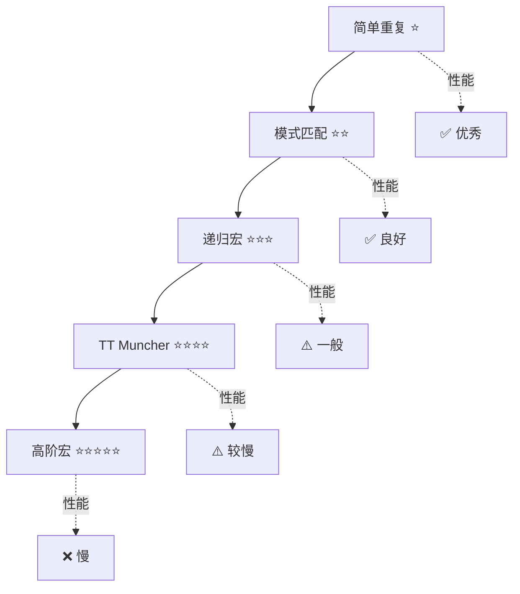
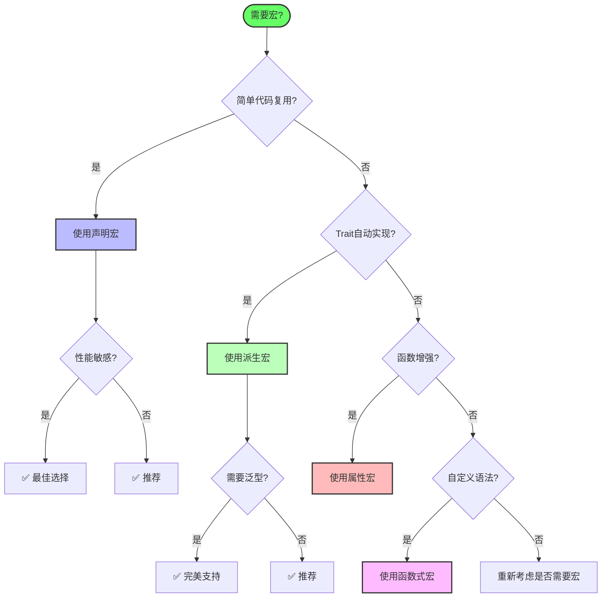

# C11 宏系统多维矩阵对比分析

> **文档定位**: Rust 1.90 宏技术全方位对比  
> **创建日期**: 2025-10-20  
> **适用版本**: Rust 1.90+ | Edition 2024  
> **文档类型**: 技术对比 + 性能分析 + 选型指南

---

## 📊 目录

- [C11 宏系统多维矩阵对比分析](#c11-宏系统多维矩阵对比分析)
  - [📊 目录](#-目录)
  - [1. 宏类型全维度对比](#1-宏类型全维度对比)
    - [基础特性对比](#基础特性对比)
    - [开发体验对比](#开发体验对比)
    - [性能特性对比](#性能特性对比)
  - [2. 片段说明符详细对比](#2-片段说明符详细对比)
    - [片段说明符功能矩阵](#片段说明符功能矩阵)
    - [片段说明符使用场景](#片段说明符使用场景)
  - [3. 宏模式对比](#3-宏模式对比)
    - [高级模式对比](#高级模式对比)
    - [模式复杂度分析](#模式复杂度分析)
  - [4. 工具生态对比](#4-工具生态对比)
    - [过程宏库对比](#过程宏库对比)
    - [调试工具对比](#调试工具对比)
  - [5. 真实案例对比](#5-真实案例对比)
    - [生产环境宏对比](#生产环境宏对比)
    - [性能基准对比](#性能基准对比)
  - [6. 技术选型决策树](#6-技术选型决策树)
    - [选型流程图](#选型流程图)
    - [场景推荐矩阵](#场景推荐矩阵)
  - [7. 总结与最佳实践](#7-总结与最佳实践)
    - [黄金法则](#黄金法则)
    - [性能优化清单](#性能优化清单)
    - [相关文档](#相关文档)

---

## 1. 宏类型全维度对比

### 基础特性对比

| 维度 | 声明宏 | 派生宏 | 属性宏 | 函数式宏 |
|------|--------|--------|--------|----------|
| **语法复杂度** | ⭐⭐ 中等 | ⭐⭐⭐ 较高 | ⭐⭐⭐⭐ 高 | ⭐⭐⭐⭐⭐ 很高 |
| **学习曲线** | 陡峭 | 中等 | 较陡 | 陡峭 |
| **代码量** | 少 | 中等 | 较多 | 多 |
| **可读性** | ⭐⭐⭐ | ⭐⭐⭐⭐ | ⭐⭐⭐ | ⭐⭐ |
| **可维护性** | ⭐⭐⭐ | ⭐⭐⭐⭐ | ⭐⭐⭐⭐ | ⭐⭐⭐ |
| **类型安全** | 低 | 高 | 高 | 中 |
| **编译时检查** | 有限 | ✅ 完整 | ✅ 完整 | ✅ 完整 |
| **IDE支持** | ⭐⭐⭐ | ⭐⭐⭐⭐ | ⭐⭐⭐⭐ | ⭐⭐⭐ |
| **错误提示** | ⭐⭐ | ⭐⭐⭐⭐ | ⭐⭐⭐⭐ | ⭐⭐⭐ |

### 开发体验对比

| 维度 | 声明宏 | 派生宏 | 属性宏 | 函数式宏 |
|------|--------|--------|--------|----------|
| **调试难度** | ⭐⭐ | ⭐⭐⭐ | ⭐⭐⭐⭐ | ⭐⭐⭐⭐⭐ |
| **测试支持** | ⚠️ 有限 | ✅ 良好 | ✅ 良好 | ✅ 良好 |
| **文档生成** | ✅ | ✅ | ✅ | ✅ |
| **错误传播** | ❌ 不佳 | ✅ 良好 | ✅ 良好 | ✅ 良好 |
| **宏展开查看** | `cargo expand` | `cargo expand` | `cargo expand` | `cargo expand` |
| **单元测试** | 间接 | ✅ 直接 | ✅ 直接 | ✅ 直接 |
| **集成测试** | ✅ | ✅ | ✅ | ✅ |
| **基准测试** | ✅ | ✅ | ✅ | ✅ |

### 性能特性对比

| 维度 | 声明宏 | 派生宏 | 属性宏 | 函数式宏 |
|------|--------|--------|--------|----------|
| **编译时开销** | ⭐ 很低 | ⭐⭐ 低 | ⭐⭐⭐ 中 | ⭐⭐⭐⭐ 高 |
| **运行时开销** | ⭐ 零 | ⭐ 零 | ⭐ 零 | ⭐ 零 |
| **增量编译** | ✅ 友好 | ⚠️ 一般 | ⚠️ 一般 | ❌ 不友好 |
| **缓存效率** | ⭐⭐⭐⭐ | ⭐⭐⭐ | ⭐⭐⭐ | ⭐⭐ |
| **展开开销** | <1ms | 1-5ms | 2-10ms | 5-50ms |
| **内存占用** | 低 | 中 | 中 | 高 |
| **并行编译** | ✅ | ⚠️ | ⚠️ | ❌ |

---

## 2. 片段说明符详细对比

### 片段说明符功能矩阵

| 说明符 | 匹配精度 | 性能 | 常用度 | 错误提示 | 版本 | 推荐场景 |
|--------|---------|------|--------|---------|------|----------|
| `expr` | ⭐⭐⭐⭐ | ⭐⭐⭐⭐ | ⭐⭐⭐⭐⭐ | ⭐⭐⭐⭐ | 1.0+ | 表达式处理 |
| `ty` | ⭐⭐⭐⭐⭐ | ⭐⭐⭐⭐ | ⭐⭐⭐⭐⭐ | ⭐⭐⭐⭐ | 1.0+ | 类型参数 |
| `ident` | ⭐⭐⭐⭐⭐ | ⭐⭐⭐⭐⭐ | ⭐⭐⭐⭐⭐ | ⭐⭐⭐⭐⭐ | 1.0+ | 标识符 |
| `tt` | ⭐⭐ | ⭐⭐⭐⭐⭐ | ⭐⭐⭐⭐ | ⭐⭐ | 1.0+ | 灵活匹配 |
| `item` | ⭐⭐⭐⭐ | ⭐⭐⭐ | ⭐⭐⭐ | ⭐⭐⭐⭐ | 1.0+ | 项定义 |
| `block` | ⭐⭐⭐⭐ | ⭐⭐⭐⭐ | ⭐⭐⭐ | ⭐⭐⭐⭐ | 1.0+ | 代码块 |
| `stmt` | ⭐⭐⭐ | ⭐⭐⭐ | ⭐⭐⭐ | ⭐⭐⭐ | 1.0+ | 语句 |
| `pat` | ⭐⭐⭐⭐ | ⭐⭐⭐ | ⭐⭐⭐ | ⭐⭐⭐ | 1.0+ | 模式匹配 |
| `path` | ⭐⭐⭐⭐ | ⭐⭐⭐⭐ | ⭐⭐⭐ | ⭐⭐⭐⭐ | 1.0+ | 路径 |
| `vis` | ⭐⭐⭐⭐⭐ | ⭐⭐⭐⭐⭐ | ⭐⭐⭐ | ⭐⭐⭐⭐ | 1.30+ | 可见性 |
| `lifetime` | ⭐⭐⭐⭐⭐ | ⭐⭐⭐⭐⭐ | ⭐⭐ | ⭐⭐⭐⭐ | 1.0+ | 生命周期 |
| `literal` | ⭐⭐⭐⭐⭐ | ⭐⭐⭐⭐⭐ | ⭐⭐ | ⭐⭐⭐⭐⭐ | 1.32+ | 字面量 |
| `meta` | ⭐⭐⭐ | ⭐⭐⭐ | ⭐⭐ | ⭐⭐⭐ | 1.0+ | 元属性 |

### 片段说明符使用场景

| 场景 | 推荐说明符 | 备选方案 | 示例 |
|------|-----------|---------|------|
| **变量名** | `ident` | `tt` | `$name:ident` |
| **数学表达式** | `expr` | `tt` | `$x:expr + $y:expr` |
| **类型注解** | `ty` | - | `Vec<$T:ty>` |
| **模式匹配** | `pat` | `tt` | `match { $p:pat => ... }` |
| **函数定义** | `item` | - | `$item:item` |
| **代码块** | `block` | `tt` | `$body:block` |
| **路径引用** | `path` | - | `$path:path::new()` |
| **访问控制** | `vis` | - | `$vis:vis fn foo()` |
| **任意Token** | `tt` | - | `$($any:tt)*` |
| **字面量** | `literal` | `expr` | `$lit:literal` |

---

## 3. 宏模式对比

### 高级模式对比

| 模式 | 复杂度 | 性能 | 可读性 | 适用场景 | 示例 |
|------|--------|------|--------|----------|------|
| **TT Muncher** | ⭐⭐⭐⭐⭐ | ⭐⭐⭐ | ⭐⭐ | 复杂解析 | DSL |
| **Push-down Accumulation** | ⭐⭐⭐⭐ | ⭐⭐⭐⭐ | ⭐⭐⭐ | 列表处理 | `vec!` |
| **Internal Rules** | ⭐⭐⭐ | ⭐⭐⭐⭐ | ⭐⭐⭐⭐ | 辅助逻辑 | 内部@规则 |
| **Callback** | ⭐⭐⭐⭐ | ⭐⭐⭐ | ⭐⭐ | 延迟执行 | 高阶宏 |
| **Incremental TT** | ⭐⭐⭐⭐⭐ | ⭐⭐ | ⭐⭐ | 增量构建 | 状态机 |
| **Repetition** | ⭐⭐ | ⭐⭐⭐⭐⭐ | ⭐⭐⭐⭐⭐ | 重复元素 | `$()*`, `$()+` |

### 模式复杂度分析

---

## 4. 工具生态对比

### 过程宏库对比

| 库 | 版本 | 功能 | 性能 | 文档 | 社区 | 推荐度 |
|------|------|------|------|------|------|--------|
| **syn** | 2.0+ | 解析AST | ⭐⭐⭐⭐ | ⭐⭐⭐⭐⭐ | ⭐⭐⭐⭐⭐ | ⭐⭐⭐⭐⭐ |
| **quote** | 1.0+ | 代码生成 | ⭐⭐⭐⭐⭐ | ⭐⭐⭐⭐⭐ | ⭐⭐⭐⭐⭐ | ⭐⭐⭐⭐⭐ |
| **proc-macro2** | 1.0+ | 测试支持 | ⭐⭐⭐⭐⭐ | ⭐⭐⭐⭐ | ⭐⭐⭐⭐⭐ | ⭐⭐⭐⭐⭐ |
| **proc-macro-error** | 1.0+ | 错误处理 | ⭐⭐⭐⭐ | ⭐⭐⭐⭐ | ⭐⭐⭐⭐ | ⭐⭐⭐⭐ |
| **darling** | 0.20+ | 属性解析 | ⭐⭐⭐⭐ | ⭐⭐⭐⭐ | ⭐⭐⭐⭐ | ⭐⭐⭐⭐ |
| **venial** | 0.5+ | 轻量解析 | ⭐⭐⭐⭐⭐ | ⭐⭐⭐ | ⭐⭐⭐ | ⭐⭐⭐ |

**生态成熟度**:

- ✅ **syn + quote**: 事实标准，必须掌握
- ✅ **proc-macro2**: 测试必备
- ⭐ **proc-macro-error**: 改善用户体验
- ⭐ **darling**: 简化属性解析

### 调试工具对比

| 工具 | 功能 | 易用性 | 信息详细度 | 适用场景 |
|------|------|--------|-----------|----------|
| **cargo-expand** | 宏展开 | ⭐⭐⭐⭐⭐ | ⭐⭐⭐⭐ | 查看展开结果 |
| **rust-analyzer** | IDE支持 | ⭐⭐⭐⭐⭐ | ⭐⭐⭐⭐ | 实时提示 |
| **trace_macros!** | 展开追踪 | ⭐⭐ | ⭐⭐⭐ | 递归宏调试 |
| **log_syntax!** | 语法输出 | ⭐⭐ | ⭐⭐⭐ | Token检查 |
| **eprintln!** | 打印调试 | ⭐⭐⭐⭐⭐ | ⭐⭐ | 过程宏调试 |
| **trybuild** | 编译测试 | ⭐⭐⭐⭐ | ⭐⭐⭐⭐⭐ | 错误消息测试 |

---

## 5. 真实案例对比

### 生产环境宏对比

| 宏 | 类型 | 复杂度 | 使用广度 | 维护成本 | 性能影响 |
|------|------|--------|---------|---------|---------|
| **serde::Derive** | 派生宏 | ⭐⭐⭐⭐⭐ | ⭐⭐⭐⭐⭐ | ⭐⭐⭐ | 低 |
| **tokio::main** | 属性宏 | ⭐⭐⭐ | ⭐⭐⭐⭐⭐ | ⭐⭐ | 零 |
| **sqlx::query!** | 函数式宏 | ⭐⭐⭐⭐⭐ | ⭐⭐⭐⭐ | ⭐⭐⭐⭐ | 低 |
| **vec!** | 声明宏 | ⭐⭐ | ⭐⭐⭐⭐⭐ | ⭐ | 零 |
| **println!** | 声明宏 | ⭐⭐ | ⭐⭐⭐⭐⭐ | ⭐ | 低 |
| **derive_builder** | 派生宏 | ⭐⭐⭐⭐ | ⭐⭐⭐⭐ | ⭐⭐⭐ | 零 |
| **tracing::instrument** | 属性宏 | ⭐⭐⭐⭐ | ⭐⭐⭐⭐ | ⭐⭐⭐ | 低 |

### 性能基准对比

| 场景 | 声明宏 | 派生宏 | 属性宏 | 函数式宏 |
|------|--------|--------|--------|----------|
| **编译时间** (简单) | <1ms | 1-3ms | 2-5ms | 5-10ms |
| **编译时间** (复杂) | 1-5ms | 5-20ms | 10-50ms | 50-200ms |
| **增量编译影响** | ✅ 小 | ⚠️ 中 | ⚠️ 中 | ❌ 大 |
| **缓存命中率** | 90%+ | 70-80% | 70-80% | 50-60% |
| **内存峰值** | <10MB | 10-50MB | 20-100MB | 50-200MB |
| **并行编译** | ✅ | ⚠️ | ⚠️ | ❌ |

**性能优化建议**:

1. ✅ **优先使用声明宏** - 编译最快
2. ⚠️ **谨慎使用复杂过程宏** - 编译慢
3. ✅ **最小化syn解析** - 只解析需要的部分
4. ✅ **避免字符串操作** - 直接操作TokenStream
5. ✅ **使用缓存** - 减少重复计算

---

## 6. 技术选型决策树

### 选型流程图

### 场景推荐矩阵

| 场景 | 第一选择 | 备选方案 | 不推荐 | 理由 |
|------|---------|---------|--------|------|
| **Vec创建** | 声明宏 | - | 函数式宏 | 简单高效 |
| **Debug实现** | 派生宏 | - | 声明宏 | 类型安全 |
| **测试框架** | 属性宏 | - | 声明宏 | 语义清晰 |
| **SQL DSL** | 函数式宏 | - | 声明宏 | 编译时检查 |
| **Builder模式** | 派生宏 | 属性宏 | 声明宏 | 自动生成 |
| **日志装饰** | 属性宏 | - | 函数式宏 | 代码清晰 |
| **配置DSL** | 声明宏 | 函数式宏 | - | 简单够用 |
| **异步运行时** | 属性宏 | - | 声明宏 | 转换复杂 |

**决策因素权重**:

1. **性能要求** (30%) - 编译时和运行时
2. **复杂度** (25%) - 开发和维护
3. **类型安全** (20%) - 错误检查
4. **可读性** (15%) - 代码清晰度
5. **生态支持** (10%) - 工具和库

---

## 7. 总结与最佳实践

### 黄金法则

**Rule 1: 最小化原则**:

- ✅ 能用声明宏就用声明宏
- ✅ 能不用宏就不用宏
- ❌ 避免过度工程化

**Rule 2: 性能优先**:

- ✅ 声明宏 > 派生宏 > 属性宏 > 函数式宏
- ✅ 最小化 syn 解析范围
- ✅ 避免字符串操作

**Rule 3: 可维护性**:

- ✅ 充分的文档注释
- ✅ 清晰的错误消息
- ✅ 完善的测试覆盖

**Rule 4: 用户体验**:

- ✅ 友好的错误提示
- ✅ 符合直觉的API
- ✅ 完整的示例代码

**Rule 5: 生态集成**:

- ✅ 遵循社区惯例
- ✅ 兼容主流工具
- ✅ 良好的版本管理

### 性能优化清单

**编译时优化**:

- [ ] 使用 `proc-macro2` 进行测试
- [ ] 最小化 AST 遍历深度
- [ ] 缓存中间结果
- [ ] 避免不必要的克隆

**运行时优化**:

- [ ] 生成高效的代码
- [ ] 避免不必要的分配
- [ ] 使用内联提示
- [ ] 考虑零成本抽象

**增量编译优化**:

- [ ] 减少宏间依赖
- [ ] 稳定的输出
- [ ] 避免时间戳依赖

### 相关文档

**理论基础**:

- [宏基础理论](../01_theory/01_macro_fundamentals.md)
- [宏卫生与作用域](../01_theory/02_hygiene_and_scope.md)
- [展开机制](../01_theory/03_expansion_mechanism.md)

**实践指南**:

- [常用模式](../05_practice/01_common_patterns.md)
- [最佳实践](../05_practice/02_best_practices.md)
- [反模式](../05_practice/03_anti_patterns.md)

**高级主题**:

- [DSL构建](../04_advanced/01_dsl_construction.md)
- [性能考量](../04_advanced/04_performance_considerations.md)

**参考资料**:

- [知识图谱](KNOWLEDGE_GRAPH_AND_CONCEPT_RELATIONS.md)
- [Rust 1.90特性](../06_rust_190_features/README.md)

---

**文档版本**: v1.0  
**创建日期**: 2025-10-20  
**维护状态**: ✅ 活跃

**返回导航**:

- [返回主索引](../00_MASTER_INDEX.md)
- [C11模块README](../../README.md)
- [知识图谱](KNOWLEDGE_GRAPH_AND_CONCEPT_RELATIONS.md)
