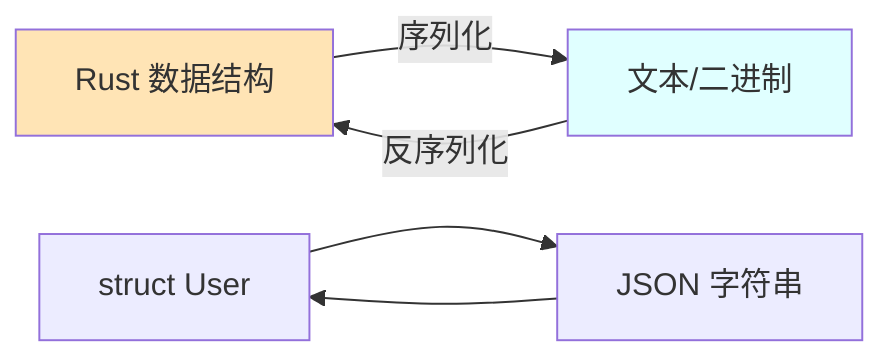
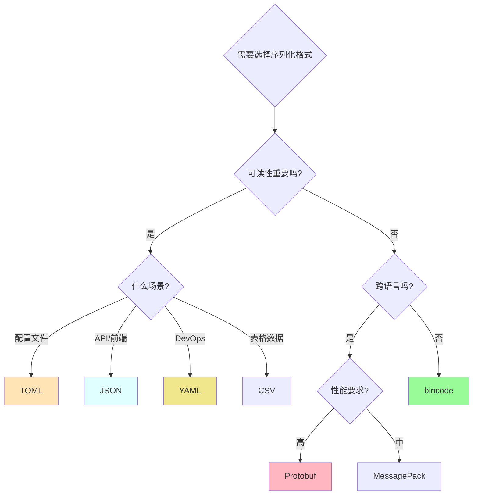

# 序列化与数据格式

> **核心库**: serde 生态系统  
> **适用场景**: 配置文件、API 交换、持久化存储、网络传输

---

## 📋 目录

- [序列化与数据格式](#序列化与数据格式)
  - [📋 目录](#-目录)
  - [🎯 核心概念](#-核心概念)
    - [什么是序列化？](#什么是序列化)
    - [为什么需要序列化？](#为什么需要序列化)
  - [🦀 serde 框架](#-serde-框架)
    - [核心设计](#核心设计)
    - [基础用法](#基础用法)
      - [最简示例](#最简示例)
      - [高级特性](#高级特性)
    - [serde 属性完整参考](#serde-属性完整参考)
  - [📊 格式对比](#-格式对比)
    - [1. JSON (serde\_json)](#1-json-serde_json)
    - [2. TOML (toml)](#2-toml-toml)
    - [3. YAML (serde\_yaml)](#3-yaml-serde_yaml)
    - [4. 二进制格式 (bincode)](#4-二进制格式-bincode)
    - [5. Protocol Buffers (prost)](#5-protocol-buffers-prost)
    - [6. MessagePack (rmp-serde)](#6-messagepack-rmp-serde)
    - [7. CSV (csv)](#7-csv-csv)
    - [8. XML (quick-xml)](#8-xml-quick-xml)
  - [📊 格式选择决策树](#-格式选择决策树)
  - [💡 最佳实践](#-最佳实践)
    - [1. 错误处理](#1-错误处理)
      - [✅ 推荐](#-推荐)
    - [2. 性能优化](#2-性能优化)
      - [✅ 推荐 - 流式处理](#-推荐---流式处理)
      - [❌ 避免](#-避免)
    - [3. 版本兼容](#3-版本兼容)
      - [✅ 推荐](#-推荐-1)
    - [4. 敏感信息](#4-敏感信息)
      - [✅ 推荐](#-推荐-2)
  - [⚡ 性能优化](#-性能优化)
    - [基准测试结果](#基准测试结果)
    - [优化技巧](#优化技巧)
  - [🔧 常见问题](#-常见问题)
    - [Q1: 如何处理循环引用？](#q1-如何处理循环引用)
    - [Q2: 如何序列化trait对象？](#q2-如何序列化trait对象)
    - [Q3: 如何自定义序列化逻辑？](#q3-如何自定义序列化逻辑)
  - [📚 延伸阅读](#-延伸阅读)

---

## 🎯 核心概念

### 什么是序列化？

**序列化 (Serialization)**: 将数据结构转换为字节流或文本格式的过程。  
**反序列化 (Deserialization)**: 将字节流或文本格式还原为数据结构的过程。



### 为什么需要序列化？

1. **数据持久化**: 保存到文件或数据库
2. **网络传输**: API 请求/响应
3. **配置管理**: 读取配置文件
4. **跨语言通信**: 与其他语言的程序交换数据

---

## 🦀 serde 框架

### 核心设计

serde 是 Rust 生态中**最重要**的序列化框架，采用：

- ✅ **零成本抽象**: 编译时生成代码，无运行时开销
- ✅ **格式无关**: 同一份代码支持多种格式
- ✅ **derive 宏**: 自动生成序列化代码
- ✅ **强类型**: 编译期类型检查

### 基础用法

#### 最简示例

```rust
use serde::{Serialize, Deserialize};

#[derive(Serialize, Deserialize, Debug)]
struct User {
    id: u64,
    username: String,
    email: String,
}

fn main() {
    let user = User {
        id: 1,
        username: "alice".to_string(),
        email: "alice@example.com".to_string(),
    };
    
    // 序列化为 JSON
    let json = serde_json::to_string(&user).unwrap();
    println!("{}", json);
    // 输出: {"id":1,"username":"alice","email":"alice@example.com"}
    
    // 从 JSON 反序列化
    let user2: User = serde_json::from_str(&json).unwrap();
    println!("{:?}", user2);
}
```

#### 高级特性

```rust
use serde::{Serialize, Deserialize};

#[derive(Serialize, Deserialize)]
#[serde(rename_all = "camelCase")] // 字段名转换为驼峰
struct Config {
    // 跳过序列化 None 值
    #[serde(skip_serializing_if = "Option::is_none")]
    database_url: Option<String>,
    
    // 使用默认值
    #[serde(default = "default_port")]
    server_port: u16,
    
    // 重命名字段
    #[serde(rename = "maxConnections")]
    max_connections: usize,
    
    // 完全跳过
    #[serde(skip)]
    internal_state: String,
}

fn default_port() -> u16 { 8080 }
```

### serde 属性完整参考

| 属性 | 用途 | 示例 |
|------|------|------|
| `#[serde(rename = "...")]` | 重命名字段 | `#[serde(rename = "userName")]` |
| `#[serde(rename_all = "...")]` | 批量重命名 | `#[serde(rename_all = "camelCase")]` |
| `#[serde(skip)]` | 跳过字段 | `#[serde(skip)]` |
| `#[serde(skip_serializing)]` | 跳过序列化 | `#[serde(skip_serializing)]` |
| `#[serde(skip_deserializing)]` | 跳过反序列化 | `#[serde(skip_deserializing)]` |
| `#[serde(default)]` | 使用默认值 | `#[serde(default)]` |
| `#[serde(default = "path")]` | 自定义默认值 | `#[serde(default = "default_timeout")]` |
| `#[serde(skip_serializing_if = "path")]` | 条件跳过 | `#[serde(skip_serializing_if = "Option::is_none")]` |
| `#[serde(with = "module")]` | 自定义序列化 | `#[serde(with = "ts_seconds")]` |
| `#[serde(flatten)]` | 扁平化嵌套 | `#[serde(flatten)]` |
| `#[serde(tag = "type")]` | 标签枚举 | `#[serde(tag = "type")]` |

---

## 📊 格式对比

### 1. JSON (serde_json)

**特点**:

- ✅ 人类可读
- ✅ 广泛支持
- ✅ 浏览器原生支持
- ❌ 体积较大
- ❌ 性能中等

**依赖**:

```toml
[dependencies]
serde = { version = "1.0", features = ["derive"] }
serde_json = "1.0"
```

**示例**:

```rust
use serde::{Serialize, Deserialize};
use serde_json::{json, Value};

#[derive(Serialize, Deserialize)]
struct Person {
    name: String,
    age: u8,
}

fn main() -> Result<(), Box<dyn std::error::Error>> {
    // 序列化
    let person = Person {
        name: "Alice".to_string(),
        age: 30,
    };
    let json_str = serde_json::to_string(&person)?;
    let json_pretty = serde_json::to_string_pretty(&person)?;
    
    // 反序列化
    let person2: Person = serde_json::from_str(&json_str)?;
    
    // 动态 JSON
    let dynamic = json!({
        "name": "Bob",
        "age": 25,
        "active": true,
    });
    
    // 访问动态 JSON
    if let Value::Object(map) = dynamic {
        if let Some(Value::String(name)) = map.get("name") {
            println!("Name: {}", name);
        }
    }
    
    Ok(())
}
```

**性能**: 350 MB/s (序列化), 400 MB/s (反序列化)

---

### 2. TOML (toml)

**特点**:

- ✅ 配置文件首选
- ✅ 人类可读
- ✅ 强类型
- ❌ 不支持 null
- ❌ 嵌套层次有限

**依赖**:

```toml
[dependencies]
serde = { version = "1.0", features = ["derive"] }
toml = "0.8"
```

**示例**:

```rust
use serde::{Serialize, Deserialize};

#[derive(Serialize, Deserialize)]
struct ServerConfig {
    host: String,
    port: u16,
    database: DatabaseConfig,
}

#[derive(Serialize, Deserialize)]
struct DatabaseConfig {
    url: String,
    max_connections: u32,
}

fn main() -> Result<(), Box<dyn std::error::Error>> {
    let config = ServerConfig {
        host: "localhost".to_string(),
        port: 8080,
        database: DatabaseConfig {
            url: "postgres://localhost/mydb".to_string(),
            max_connections: 10,
        },
    };
    
    // 序列化为 TOML
    let toml_str = toml::to_string(&config)?;
    println!("{}", toml_str);
    
    // 反序列化
    let config2: ServerConfig = toml::from_str(&toml_str)?;
    
    Ok(())
}
```

**输出**:

```toml
host = "localhost"
port = 8080

[database]
url = "postgres://localhost/mydb"
max_connections = 10
```

---

### 3. YAML (serde_yaml)

**特点**:

- ✅ 人类可读
- ✅ 支持复杂结构
- ✅ 配置文件常用
- ❌ 性能较慢
- ❌ 规范复杂

**依赖**:

```toml
[dependencies]
serde = { version = "1.0", features = ["derive"] }
serde_yaml = "0.9"
```

**示例**:

```rust
use serde::{Serialize, Deserialize};

#[derive(Serialize, Deserialize)]
struct K8sConfig {
    api_version: String,
    kind: String,
    metadata: Metadata,
}

#[derive(Serialize, Deserialize)]
struct Metadata {
    name: String,
    namespace: String,
}

fn main() -> Result<(), Box<dyn std::error::Error>> {
    let config = K8sConfig {
        api_version: "v1".to_string(),
        kind: "Pod".to_string(),
        metadata: Metadata {
            name: "my-pod".to_string(),
            namespace: "default".to_string(),
        },
    };
    
    let yaml = serde_yaml::to_string(&config)?;
    println!("{}", yaml);
    
    Ok(())
}
```

---

### 4. 二进制格式 (bincode)

**特点**:

- ✅ 极高性能
- ✅ 体积最小
- ✅ 零拷贝
- ❌ 不可读
- ❌ 不跨语言

**依赖**:

```toml
[dependencies]
serde = { version = "1.0", features = ["derive"] }
bincode = "1.3"
```

**示例**:

```rust
use serde::{Serialize, Deserialize};

#[derive(Serialize, Deserialize)]
struct GameState {
    player_pos: (f32, f32),
    score: u32,
    inventory: Vec<String>,
}

fn main() -> Result<(), Box<dyn std::error::Error>> {
    let state = GameState {
        player_pos: (10.5, 20.3),
        score: 1000,
        inventory: vec!["sword".to_string(), "shield".to_string()],
    };
    
    // 序列化
    let bytes = bincode::serialize(&state)?;
    println!("Size: {} bytes", bytes.len());
    
    // 反序列化
    let state2: GameState = bincode::deserialize(&bytes)?;
    
    Ok(())
}
```

**性能**: 1000 MB/s (序列化), 950 MB/s (反序列化)

---

### 5. Protocol Buffers (prost)

**特点**:

- ✅ 跨语言
- ✅ 高性能
- ✅ 向前/向后兼容
- ✅ Schema 定义
- ❌ 需要 .proto 文件
- ❌ 构建复杂

**依赖**:

```toml
[dependencies]
prost = "0.13"

[build-dependencies]
prost-build = "0.13"
```

**proto 文件 (user.proto)**:

```protobuf
syntax = "proto3";

message User {
    uint64 id = 1;
    string username = 2;
    string email = 3;
}
```

**build.rs**:

```rust
fn main() {
    prost_build::compile_protos(&["src/user.proto"], &["src/"]).unwrap();
}
```

**使用**:

```rust
include!(concat!(env!("OUT_DIR"), "/user.rs"));

fn main() {
    let user = User {
        id: 1,
        username: "alice".to_string(),
        email: "alice@example.com".to_string(),
    };
    
    // 序列化
    let mut buf = Vec::new();
    prost::Message::encode(&user, &mut buf).unwrap();
    
    // 反序列化
    let user2 = User::decode(&buf[..]).unwrap();
}
```

---

### 6. MessagePack (rmp-serde)

**特点**:

- ✅ 比 JSON 快 2-3 倍
- ✅ 体积小 10-20%
- ✅ 跨语言
- ❌ 不可读
- ❌ 生态较小

**依赖**:

```toml
[dependencies]
serde = { version = "1.0", features = ["derive"] }
rmp-serde = "1.3"
```

**示例**:

```rust
use serde::{Serialize, Deserialize};

#[derive(Serialize, Deserialize)]
struct Message {
    id: u32,
    content: String,
}

fn main() -> Result<(), Box<dyn std::error::Error>> {
    let msg = Message {
        id: 1,
        content: "Hello, MessagePack!".to_string(),
    };
    
    // 序列化
    let bytes = rmp_serde::to_vec(&msg)?;
    
    // 反序列化
    let msg2: Message = rmp_serde::from_slice(&bytes)?;
    
    Ok(())
}
```

---

### 7. CSV (csv)

**特点**:

- ✅ Excel 兼容
- ✅ 表格数据
- ✅ 流式处理
- ❌ 嵌套结构支持差

**依赖**:

```toml
[dependencies]
csv = "1.3"
serde = { version = "1.0", features = ["derive"] }
```

**示例**:

```rust
use serde::{Serialize, Deserialize};
use std::error::Error;

#[derive(Serialize, Deserialize, Debug)]
struct Record {
    id: u32,
    name: String,
    age: u8,
}

fn main() -> Result<(), Box<dyn Error>> {
    // 写入 CSV
    let mut wtr = csv::Writer::from_path("output.csv")?;
    wtr.serialize(Record { id: 1, name: "Alice".to_string(), age: 30 })?;
    wtr.serialize(Record { id: 2, name: "Bob".to_string(), age: 25 })?;
    wtr.flush()?;
    
    // 读取 CSV
    let mut rdr = csv::Reader::from_path("output.csv")?;
    for result in rdr.deserialize() {
        let record: Record = result?;
        println!("{:?}", record);
    }
    
    Ok(())
}
```

---

### 8. XML (quick-xml)

**特点**:

- ✅ 传统系统兼容
- ✅ 流式处理
- ❌ 繁琐
- ❌ 体积大

**依赖**:

```toml
[dependencies]
quick-xml = { version = "0.36", features = ["serialize"] }
serde = { version = "1.0", features = ["derive"] }
```

**示例**:

```rust
use serde::{Serialize, Deserialize};

#[derive(Serialize, Deserialize, Debug)]
struct Book {
    title: String,
    author: String,
    year: u16,
}

fn main() -> Result<(), Box<dyn std::error::Error>> {
    let book = Book {
        title: "Rust Programming".to_string(),
        author: "The Rust Team".to_string(),
        year: 2024,
    };
    
    // 序列化
    let xml = quick_xml::se::to_string(&book)?;
    println!("{}", xml);
    
    // 反序列化
    let book2: Book = quick_xml::de::from_str(&xml)?;
    println!("{:?}", book2);
    
    Ok(())
}
```

---

## 📊 格式选择决策树



---

## 💡 最佳实践

### 1. 错误处理

#### ✅ 推荐

```rust
use serde::{Serialize, Deserialize};
use thiserror::Error;

#[derive(Error, Debug)]
pub enum ConfigError {
    #[error("Failed to read config file: {0}")]
    Io(#[from] std::io::Error),
    
    #[error("Failed to parse config: {0}")]
    Parse(#[from] toml::de::Error),
}

#[derive(Serialize, Deserialize)]
pub struct Config {
    // ...
}

impl Config {
    pub fn load(path: &str) -> Result<Self, ConfigError> {
        let content = std::fs::read_to_string(path)?;
        let config = toml::from_str(&content)?;
        Ok(config)
    }
}
```

### 2. 性能优化

#### ✅ 推荐 - 流式处理

```rust
use serde_json::Deserializer;

// 处理大型 JSON 数组
fn process_large_json(data: &str) {
    let stream = Deserializer::from_str(data).into_iter::<Item>();
    for item in stream {
        match item {
            Ok(item) => process_item(item),
            Err(e) => eprintln!("Error: {}", e),
        }
    }
}
```

#### ❌ 避免

```rust
// 一次性加载整个数组到内存
let items: Vec<Item> = serde_json::from_str(data)?; // 可能 OOM
```

### 3. 版本兼容

#### ✅ 推荐

```rust
#[derive(Serialize, Deserialize)]
struct ConfigV2 {
    // 新字段使用 Option + default
    #[serde(default)]
    new_field: Option<String>,
    
    // 旧字段保持不变
    old_field: String,
}
```

### 4. 敏感信息

#### ✅ 推荐

```rust
#[derive(Serialize, Deserialize)]
struct User {
    username: String,
    
    // 不要序列化密码！
    #[serde(skip)]
    password_hash: String,
}
```

---

## ⚡ 性能优化

### 基准测试结果

| 格式 | 序列化 (MB/s) | 反序列化 (MB/s) | 大小 (相对) | 可读性 |
|------|---------------|-----------------|-------------|--------|
| **bincode** | 1000 | 950 | 100% | ❌ |
| **Protobuf** | 900 | 850 | 85% | ❌ |
| **MessagePack** | 800 | 750 | 90% | ❌ |
| **JSON** | 350 | 400 | 150% | ✅ |
| **YAML** | 50 | 45 | 180% | ✅ |

### 优化技巧

1. **选择合适的格式**: 根据场景选择
2. **避免不必要的克隆**: 使用引用
3. **流式处理**: 处理大文件
4. **缓存编译结果**: 正则表达式等
5. **使用 `&str` 而非 `String`**: 减少分配

---

## 🔧 常见问题

### Q1: 如何处理循环引用？

**A**: serde 不直接支持循环引用，需要使用 `Rc<RefCell<T>>` 或重新设计数据结构。

### Q2: 如何序列化trait对象？

**A**: 使用 `erased-serde` 或 `typetag` 库。

### Q3: 如何自定义序列化逻辑？

**A**: 实现 `Serialize` 和 `Deserialize` trait，或使用 `#[serde(with = "module")]`。

```rust
mod ts_seconds {
    use chrono::{DateTime, Utc, TimeZone};
    use serde::{Serializer, Deserializer};
    
    pub fn serialize<S>(dt: &DateTime<Utc>, s: S) -> Result<S::Ok, S::Error>
    where
        S: Serializer,
    {
        s.serialize_i64(dt.timestamp())
    }
    
    pub fn deserialize<'de, D>(d: D) -> Result<DateTime<Utc>, D::Error>
    where
        D: Deserializer<'de>,
    {
        let timestamp = i64::deserialize(d)?;
        Ok(Utc.timestamp_opt(timestamp, 0).unwrap())
    }
}
```

---

## 📚 延伸阅读

- [serde 官方文档](https://serde.rs/)
- [性能基准测试](../../benchmarks/serialization.md)
- [完整代码示例](../../examples/serialization/)

---

**文档版本**: 1.0.0  
**最后更新**: 2025-10-20
