# Rust 必备开源库完整知识体系 (2025)

> **版本**: Rust 1.90  
> **更新日期**: 2025-10-20  
> **目标**: 全面、深入、系统化梳理 Rust 必备开源库

---

## 📋 目录导航

- [Rust 必备开源库完整知识体系 (2025)](#rust-必备开源库完整知识体系-2025)
  - [📋 目录导航](#-目录导航)
  - [🎯 知识体系概览](#-知识体系概览)
    - [分类方法论](#分类方法论)
    - [统计数据](#统计数据)
  - [🏗️ 五层架构分类](#️-五层架构分类)
    - [第1层：基础设施层 (Infrastructure)](#第1层基础设施层-infrastructure)
      - [核心类别 (10+)](#核心类别-10)
    - [第2层：系统编程层 (System Programming)](#第2层系统编程层-system-programming)
      - [核心类别 (8+)](#核心类别-8)
    - [第3层：应用开发层 (Application Development)](#第3层应用开发层-application-development)
      - [核心类别 (12+)](#核心类别-12)
    - [第4层：领域特定层 (Domain Specific)](#第4层领域特定层-domain-specific)
      - [核心类别 (8+)](#核心类别-8-1)
    - [第5层：工具链层 (Toolchain)](#第5层工具链层-toolchain)
      - [核心类别 (10+)](#核心类别-10-1)
  - [🔄 横切关注点](#-横切关注点)
    - [核心领域 (6+)](#核心领域-6)
  - [📚 学习路径](#-学习路径)
    - [🎯 路径 1: 快速入门 (1周)](#-路径-1-快速入门-1周)
    - [🎓 路径 2: 系统学习 (4周)](#-路径-2-系统学习-4周)
    - [🏆 路径 3: 深度精通 (3个月)](#-路径-3-深度精通-3个月)
    - [🎯 路径 4: 场景驱动 (按需学习)](#-路径-4-场景驱动-按需学习)
  - [🔍 快速索引](#-快速索引)
    - [按字母索引](#按字母索引)
    - [A](#a)
    - [B](#b)
    - [C](#c)
    - [...省略其他字母](#省略其他字母)
  - [📖 使用指南](#-使用指南)
    - [对于开发者](#对于开发者)
      - [我是 Rust 新手](#我是-rust-新手)
      - [我需要技术选型](#我需要技术选型)
      - [我要深入学习某个库](#我要深入学习某个库)
    - [对于团队](#对于团队)
      - [技术选型决策](#技术选型决策)
      - [团队培训](#团队培训)
  - [🎯 文档特色](#-文档特色)
    - [深度](#深度)
    - [广度](#广度)
    - [实用性](#实用性)
  - [🔗 相关资源](#-相关资源)
    - [本项目文档](#本项目文档)
    - [外部资源](#外部资源)
  - [📊 文档统计](#-文档统计)
  - [🤝 贡献指南](#-贡献指南)
  - [📝 更新日志](#-更新日志)

---

## 🎯 知识体系概览

### 分类方法论

本知识体系采用 **多维分类法**，从以下维度组织 Rust 必备开源库：

```mermaid
graph TD
    A[Rust 必备库知识体系] --> B[功能维度<br/>5层架构]
    A --> C[场景维度<br/>应用领域]
    A --> D[成熟度维度<br/>生产就绪度]
    A --> E[横切维度<br/>通用能力]
    
    B --> B1[01_基础设施层]
    B --> B2[02_系统编程层]
    B --> B3[03_应用开发层]
    B --> B4[04_领域特定层]
    B --> B5[05_工具链层]
    
    E --> E1[错误处理]
    E --> E2[密码学]
    E --> E3[可观测性]
    
    style A fill:#FFD700
    style B fill:#87CEEB
    style E fill:#98FB98
```

### 统计数据

| 维度 | 数量 | 说明 |
|------|------|------|
| **总库数** | 107+ | 涵盖 18 大类别 |
| **S级库** | 42 | 生产就绪，强烈推荐 |
| **A级库** | 35 | 稳定可用，推荐使用 |
| **代码示例** | 200+ | 可直接运行的示例 |
| **文档页数** | 50+ | 深度文档说明 |

---

## 🏗️ 五层架构分类

### 第1层：基础设施层 (Infrastructure)

> **定义**: 几乎所有 Rust 项目都会使用的核心基础库

**📁 目录**: [`01_infrastructure/`](./01_infrastructure/)

#### 核心类别 (10+)

| 类别 | 关键库 | 必选度 | 文档 |
|------|--------|--------|------|
| **序列化** | serde, serde_json, toml, bincode | ⭐⭐⭐⭐⭐ | [详细文档](./01_infrastructure/serialization/) |
| **文本处理** | regex, unicode-normalization | ⭐⭐⭐⭐⭐ | [详细文档](./01_infrastructure/text_processing/) |
| **时间日期** | chrono, time | ⭐⭐⭐⭐⭐ | [详细文档](./01_infrastructure/datetime/) |
| **随机数** | rand, uuid | ⭐⭐⭐⭐⭐ | [详细文档](./01_infrastructure/random/) |
| **数学计算** | num, ndarray | ⭐⭐⭐⭐ | [详细文档](./01_infrastructure/math/) |

**快速跳转**: [查看完整第1层文档 →](./01_infrastructure/)

---

### 第2层：系统编程层 (System Programming)

> **定义**: 系统级编程所需的并发、内存、I/O 等核心能力

**📁 目录**: [`02_system_programming/`](./02_system_programming/)

#### 核心类别 (8+)

| 类别 | 关键库 | 必选度 | 文档 |
|------|--------|--------|------|
| **异步运行时** | tokio, async-std, smol | ⭐⭐⭐⭐⭐ | [详细文档](./02_system_programming/async_runtime/) |
| **并发原语** | rayon, crossbeam, parking_lot | ⭐⭐⭐⭐⭐ | [详细文档](./02_system_programming/concurrency/) |
| **内存管理** | bytes, bumpalo | ⭐⭐⭐⭐ | [详细文档](./02_system_programming/memory/) |
| **网络协议** | socket2, mio | ⭐⭐⭐⭐ | [详细文档](./02_system_programming/networking/) |
| **文件I/O** | tokio::fs, async-std::fs | ⭐⭐⭐⭐⭐ | [详细文档](./02_system_programming/io/) |

**快速跳转**: [查看完整第2层文档 →](./02_system_programming/)

---

### 第3层：应用开发层 (Application Development)

> **定义**: 构建生产级应用所需的 Web、数据库、消息队列等核心组件

**📁 目录**: [`03_application_dev/`](./03_application_dev/)

#### 核心类别 (12+)

| 类别 | 关键库 | 必选度 | 文档 |
|------|--------|--------|------|
| **Web 框架** | axum, actix-web, rocket | ⭐⭐⭐⭐⭐ | [详细文档](./03_application_dev/web_frameworks/) |
| **HTTP 客户端** | reqwest, hyper | ⭐⭐⭐⭐⭐ | [详细文档](./03_application_dev/http_clients/) |
| **数据库 ORM** | sqlx, diesel, sea-orm | ⭐⭐⭐⭐⭐ | [详细文档](./03_application_dev/databases/) |
| **消息队列** | rdkafka, lapin, async-nats | ⭐⭐⭐⭐ | [详细文档](./03_application_dev/message_queues/) |
| **缓存** | redis, bb8 | ⭐⭐⭐⭐ | [详细文档](./03_application_dev/caching/) |
| **gRPC** | tonic, prost | ⭐⭐⭐⭐⭐ | [详细文档](./03_application_dev/grpc/) |

**快速跳转**: [查看完整第3层文档 →](./03_application_dev/)

---

### 第4层：领域特定层 (Domain Specific)

> **定义**: 特定领域应用开发所需的专业库

**📁 目录**: [`04_domain_specific/`](./04_domain_specific/)

#### 核心类别 (8+)

| 类别 | 关键库 | 必选度 | 文档 |
|------|--------|--------|------|
| **GUI** | egui, iced, tauri | ⭐⭐⭐⭐ | [详细文档](./04_domain_specific/gui/) |
| **游戏开发** | bevy, wgpu | ⭐⭐⭐⭐ | [详细文档](./04_domain_specific/game_dev/) |
| **WebAssembly** | wasm-bindgen, yew, leptos | ⭐⭐⭐⭐ | [详细文档](./04_domain_specific/wasm/) |
| **嵌入式** | embedded-hal, embassy | ⭐⭐⭐⭐ | [详细文档](./04_domain_specific/embedded/) |
| **科学计算** | ndarray, polars | ⭐⭐⭐ | [详细文档](./04_domain_specific/scientific/) |
| **机器学习** | candle, burn | ⭐⭐⭐ | [详细文档](./04_domain_specific/ml/) |

**快速跳转**: [查看完整第4层文档 →](./04_domain_specific/)

---

### 第5层：工具链层 (Toolchain)

> **定义**: 开发、测试、部署全流程所需的工具库

**📁 目录**: [`05_toolchain/`](./05_toolchain/)

#### 核心类别 (10+)

| 类别 | 关键库 | 必选度 | 文档 |
|------|--------|--------|------|
| **CLI 工具** | clap, indicatif, colored | ⭐⭐⭐⭐⭐ | [详细文档](./05_toolchain/cli/) |
| **日志系统** | tracing, log, env_logger | ⭐⭐⭐⭐⭐ | [详细文档](./05_toolchain/logging/) |
| **测试框架** | criterion, proptest, mockall | ⭐⭐⭐⭐⭐ | [详细文档](./05_toolchain/testing/) |
| **性能分析** | flamegraph, pprof | ⭐⭐⭐⭐ | [详细文档](./05_toolchain/profiling/) |
| **文档生成** | mdbook, rustdoc | ⭐⭐⭐⭐ | [详细文档](./05_toolchain/documentation/) |
| **构建工具** | cargo-make, cargo-release | ⭐⭐⭐ | [详细文档](./05_toolchain/build_tools/) |

**快速跳转**: [查看完整第5层文档 →](./05_toolchain/)

---

## 🔄 横切关注点

> **定义**: 跨越所有层次的通用能力和最佳实践

**📁 目录**: [`cross_cutting/`](./cross_cutting/)

### 核心领域 (6+)

| 领域 | 关键库 | 文档 |
|------|--------|------|
| **错误处理** | anyhow, thiserror, eyre | [详细文档](./cross_cutting/error_handling/) |
| **密码学与安全** | ring, rustls, argon2 | [详细文档](./cross_cutting/cryptography/) |
| **可观测性** | opentelemetry, prometheus, tracing | [详细文档](./cross_cutting/observability/) |
| **配置管理** | config, figment, dotenv | [详细文档](./cross_cutting/configuration/) |
| **验证** | validator, garde | [详细文档](./cross_cutting/validation/) |
| **国际化** | fluent, rust-i18n | [详细文档](./cross_cutting/i18n/) |

**快速跳转**: [查看完整横切文档 →](./cross_cutting/)

---

## 📚 学习路径

### 🎯 路径 1: 快速入门 (1周)

适合 Rust 初学者，快速掌握必备库的基础使用。

```mermaid
graph LR
    A[第1天<br/>基础设施] --> B[第2-3天<br/>异步编程]
    B --> C[第4-5天<br/>Web开发]
    C --> D[第6-7天<br/>综合项目]
    
    style A fill:#FFE4B5
    style B fill:#E0FFFF
    style C fill:#F0E68C
    style D fill:#98FB98
```

**详细计划**:

1. **第1天**: serde, regex, chrono (基础数据处理)
2. **第2-3天**: tokio, futures (异步编程基础)
3. **第4-5天**: axum, sqlx (构建简单 API)
4. **第6-7天**: 完整的 CRUD 应用

**资源**: [快速入门教程 →](./learning_paths/quick_start.md)

---

### 🎓 路径 2: 系统学习 (4周)

适合有一定基础的开发者，系统掌握 Rust 生态。

| 周次 | 主题 | 关键库 | 学习时间 |
|------|------|--------|----------|
| **第1周** | 基础设施层 | serde, regex, chrono, rand | 10-15小时 |
| **第2周** | 系统编程层 | tokio, rayon, crossbeam | 15-20小时 |
| **第3周** | 应用开发层 | axum, sqlx, reqwest, rdkafka | 20-25小时 |
| **第4周** | 工具链+横切 | clap, tracing, anyhow, criterion | 15-20小时 |

**资源**: [系统学习教程 →](./learning_paths/systematic_learning.md)

---

### 🏆 路径 3: 深度精通 (3个月)

适合高级开发者，深入掌握源码和高级特性。

**阶段规划**:

- **月1**: 源码阅读（serde, tokio, axum）
- **月2**: 性能优化实践（criterion, flamegraph）
- **月3**: 生产级项目开发

**资源**: [深度精通教程 →](./learning_paths/expert_mastery.md)

---

### 🎯 路径 4: 场景驱动 (按需学习)

适合有明确目标的开发者，按场景快速上手。

**场景列表**:

- [构建 RESTful API](./learning_paths/scenarios/rest_api.md)
- [构建 CLI 工具](./learning_paths/scenarios/cli_tool.md)
- [构建微服务](./learning_paths/scenarios/microservices.md)
- [构建数据处理管道](./learning_paths/scenarios/data_pipeline.md)
- [构建 WebAssembly 应用](./learning_paths/scenarios/wasm_app.md)

---

## 🔍 快速索引

### 按字母索引

[A](#a) | [B](#b) | [C](#c) | [D](#d) | [E](#e) | [F](#f) | [H](#h) | [I](#i) | [L](#l) | [M](#m) | [O](#o) | [P](#p) | [R](#r) | [S](#s) | [T](#t) | [U](#u) | [W](#w) | [Y](#y)

### A

- [anyhow](./cross_cutting/error_handling/anyhow.md) - 应用错误处理 ⭐⭐⭐⭐⭐
- [argon2](./cross_cutting/cryptography/argon2.md) - 密码哈希 ⭐⭐⭐⭐
- [async-std](./02_system_programming/async_runtime/async_std.md) - 异步运行时 ⭐⭐⭐⭐
- [async-trait](./02_system_programming/async_runtime/async_trait.md) - 异步 trait ⭐⭐⭐⭐⭐
- [axum](./03_application_dev/web_frameworks/axum.md) - Web 框架 ⭐⭐⭐⭐⭐

### B

- [bevy](./04_domain_specific/game_dev/bevy.md) - 游戏引擎 ⭐⭐⭐⭐
- [bincode](./01_infrastructure/serialization/bincode.md) - 二进制序列化 ⭐⭐⭐⭐
- [bytes](./02_system_programming/memory/bytes.md) - 字节缓冲区 ⭐⭐⭐⭐⭐

### C

- [chrono](./01_infrastructure/datetime/chrono.md) - 时间日期 ⭐⭐⭐⭐⭐
- [clap](./05_toolchain/cli/clap.md) - CLI 参数解析 ⭐⭐⭐⭐⭐
- [criterion](./05_toolchain/testing/criterion.md) - 基准测试 ⭐⭐⭐⭐⭐
- [crossbeam](./02_system_programming/concurrency/crossbeam.md) - 并发数据结构 ⭐⭐⭐⭐⭐

### ...省略其他字母

---

## 📖 使用指南

### 对于开发者

#### 我是 Rust 新手

1. 从 [快速入门路径](#-路径-1-快速入门-1周) 开始
2. 阅读 [基础设施层文档](./01_infrastructure/)
3. 跟随 [代码示例](./examples/) 实践

#### 我需要技术选型

1. 查看 [成熟度评估矩阵](../RUST_CRATES_MATURITY_MATRIX_2025.md)
2. 阅读对应层次的 [对比文档](./comparison/)
3. 参考 [生产案例](./production_cases/)

#### 我要深入学习某个库

1. 在 [快速索引](#快速索引) 中找到该库
2. 阅读详细文档和源码分析
3. 运行 [完整示例](./examples/)

### 对于团队

#### 技术选型决策

- [技术选型指南](./guides/tech_selection.md)
- [架构设计模式](./guides/architecture_patterns.md)
- [最佳实践合集](./guides/best_practices.md)

#### 团队培训

- [培训材料](./training/)
- [内部分享模板](./training/templates/)
- [考核标准](./training/assessment.md)

---

## 🎯 文档特色

### 深度

- ✅ **源码级分析**: 关键库的源码解读和设计模式
- ✅ **性能优化**: 每个库的性能特点和优化建议
- ✅ **生产实践**: 真实生产环境的使用经验

### 广度

- ✅ **107+ 核心库**: 覆盖 18 大类别
- ✅ **200+ 代码示例**: 从基础到高级的完整示例
- ✅ **50+ 页深度文档**: 每个重要库都有详细文档

### 实用性

- ✅ **可运行代码**: 所有示例都可直接运行
- ✅ **场景模板**: 常见场景的完整 Cargo.toml 和代码模板
- ✅ **问题解决**: 常见问题和解决方案

---

## 🔗 相关资源

### 本项目文档

- [必备库指南](../RUST_ESSENTIAL_CRATES_GUIDE_2025.md) - 快速参考
- [分类体系](../RUST_CRATES_CLASSIFICATION_2025.md) - 多维分类
- [成熟度矩阵](../RUST_CRATES_MATURITY_MATRIX_2025.md) - 评估选型
- [生态索引](../RUST_CRATES_ECOSYSTEM_INDEX_2025.md) - 快速查找

### 外部资源

- [Awesome Rust](https://github.com/rust-unofficial/awesome-rust)
- [crates.io](https://crates.io/)
- [This Week in Rust](https://this-week-in-rust.org/)
- [Rust by Example](https://doc.rust-lang.org/rust-by-example/)
- [The Rust Book](https://doc.rust-lang.org/book/)

---

## 📊 文档统计

| 指标 | 数量 |
|------|------|
| 总文档数 | 50+ 页 |
| 代码示例 | 200+ 个 |
| 涵盖库数 | 107+ 个 |
| 学习路径 | 4 条完整路径 |
| 场景模板 | 5+ 个生产场景 |

---

## 🤝 贡献指南

欢迎贡献新的库文档、代码示例或改进建议！

详见: [CONTRIBUTING.md](./CONTRIBUTING.md)

---

## 📝 更新日志

- **2025-10-20**: 初始版本，完整的 5 层架构 + 横切关注点
- 持续更新中...

---

**文档版本**: 1.0.0  
**最后更新**: 2025-10-20  
**维护者**: C11 Middlewares Team  
**License**: MIT
