# C11 Middlewares 知识图谱与概念关系（增强版）

> **文档定位**: Rust 1.90 中间件技术的完整知识体系  
> **创建日期**: 2025-10-20  
> **适用版本**: Rust 1.90+ | Edition 2024  
> **文档类型**: 理论知识图谱 + 概念关系 + 可视化

---

## 📊 目录

- [C11 Middlewares 知识图谱与概念关系（增强版）](#c11-middlewares-知识图谱与概念关系增强版)
  - [📊 目录](#-目录)
  - [1. 核心概念知识图谱](#1-核心概念知识图谱)
    - [中间件体系总览](#中间件体系总览)
    - [消息队列生态](#消息队列生态)
    - [数据库中间件](#数据库中间件)
    - [网络代理中间件](#网络代理中间件)
    - [高性能 I/O 与数据技术](#高性能-io-与数据技术)
  - [2. 概念属性矩阵](#2-概念属性矩阵)
    - [消息队列对比](#消息队列对比)
    - [数据库中间件对比](#数据库中间件对比)
    - [代理服务器对比](#代理服务器对比)
  - [3. 技术演化与学习路径](#3-技术演化与学习路径)
    - [中间件技术演化](#中间件技术演化)
    - [学习路径](#学习路径)
  - [4. 总结与索引](#4-总结与索引)
    - [快速查找](#快速查找)
    - [相关文档](#相关文档)
  - [返回导航](#返回导航)

---

## 1. 核心概念知识图谱

### 中间件体系总览

```mermaid
graph TB
    Middleware[中间件体系]
    
    Middleware --> MQ[消息队列]
    Middleware --> DB[数据库中间件]
    Middleware --> Proxy[网络代理]
    Middleware --> Cache[缓存中间件]
    
    MQ --> Kafka[Apache Kafka]
    MQ --> RabbitMQ[RabbitMQ]
    MQ --> Pulsar[Apache Pulsar]
    MQ --> NATS[NATS]
    
    DB --> MySQL[MySQL客户端]
    DB --> PostgreSQL[PostgreSQL客户端]
    DB --> Redis_Client[Redis客户端]
    DB --> ClickHouse[ClickHouse]
    
    Proxy --> Pingora[Cloudflare Pingora]
    Proxy --> Nginx[Nginx替代]
    Proxy --> Envoy[Envoy集成]
    
    Cache --> Redis_Cache[Redis缓存]
    Cache --> Memcached[Memcached]
    Cache --> LocalCache[本地缓存]
    
    Kafka --> KafkaProducer[Producer API]
    Kafka --> KafkaConsumer[Consumer API]
    Kafka --> KafkaStreams[Streams API]
    
    Redis_Client --> RedisAsync[异步Redis]
    Redis_Client --> RedisCluster[集群模式]
    Redis_Client --> RedisPipeline[管道优化]
    
    Pingora --> PingoraHTTP[HTTP代理]
    Pingora --> PingoraLB[负载均衡]
    Pingora --> PingoraTLS[TLS终止]
    
    style Middleware fill:#e1f5ff
    style MQ fill:#fff3e0
    style DB fill:#f3e5f5
    style Proxy fill:#e8f5e9
    style Cache fill:#fce4ec
```

### 消息队列生态

```mermaid
graph LR
    Producer[生产者] -->|发送消息| Broker[消息代理]
    Broker -->|分发消息| Consumer[消费者]
    
    Broker --> Topic[Topic]
    Topic --> Partition1[Partition 0]
    Topic --> Partition2[Partition 1]
    Topic --> PartitionN[Partition N]
    
    Partition1 --> Replica1A[Replica 1]
    Partition1 --> Replica1B[Replica 2]
    
    Consumer --> ConsumerGroup[Consumer Group]
    ConsumerGroup --> Consumer1[Consumer 1]
    ConsumerGroup --> Consumer2[Consumer 2]
    
    Broker --> ZK[ZooKeeper/KRaft]
    ZK --> Metadata[元数据管理]
    ZK --> Leader[Leader选举]
    
    style Producer fill:#bbdefb
    style Consumer fill:#c8e6c9
    style Broker fill:#ffccbc
    style ZK fill:#f8bbd0
```

### 数据库中间件

```mermaid
graph TB
    App[应用层]
    
    App --> Pool[连接池]
    Pool --> Primary[主库]
    Pool --> Replica1[从库1]
    Pool --> Replica2[从库2]
    
    App --> ORM[ORM层]
    ORM --> SQLx[SQLx]
    ORM --> Diesel[Diesel]
    ORM --> SeaORM[SeaORM]
    
    App --> Cache_Layer[缓存层]
    Cache_Layer --> LocalCache_DB[本地缓存]
    Cache_Layer --> Redis_DB[Redis缓存]
    
    Primary --> Replication[主从复制]
    Replication --> Replica1
    Replication --> Replica2
    
    SQLx --> AsyncRuntime[异步运行时]
    AsyncRuntime --> Tokio_DB[Tokio]
    AsyncRuntime --> AsyncStd[async-std]
    
    style App fill:#e3f2fd
    style Pool fill:#fff3e0
    style ORM fill:#f3e5f5
    style Cache_Layer fill:#fce4ec
```

### 网络代理中间件

```mermaid
graph TB
    Client[客户端请求]
    
    Client --> LB[负载均衡器]
    LB --> Pingora_Proxy[Pingora代理]
    
    Pingora_Proxy --> HealthCheck[健康检查]
    Pingora_Proxy --> RateLimiter[限流器]
    Pingora_Proxy --> TLS_Handler[TLS处理]
    Pingora_Proxy --> Cache_Proxy[缓存层]
    
    HealthCheck --> Backend1[后端服务1]
    HealthCheck --> Backend2[后端服务2]
    HealthCheck --> Backend3[后端服务3]
    
    RateLimiter --> TokenBucket[令牌桶]
    RateLimiter --> LeakyBucket[漏桶]
    
    TLS_Handler --> Cert[证书管理]
    TLS_Handler --> ALPN[ALPN协议]
    
    Cache_Proxy --> CDN[CDN缓存]
    Cache_Proxy --> EdgeCache[边缘缓存]
    
    style Client fill:#e1f5ff
    style Pingora_Proxy fill:#fff3e0
    style HealthCheck fill:#e8f5e9
    style RateLimiter fill:#f3e5f5
```

### 高性能 I/O 与数据技术

```mermaid
graph TB
    HighPerf[高性能技术]
    
    HighPerf --> IOModels[I/O模型]
    HighPerf --> DataFormats[数据格式]
    
    IOModels --> Traditional[传统I/O]
    IOModels --> Modern[现代I/O]
    
    Traditional --> Blocking[阻塞I/O]
    Traditional --> Epoll[epoll/kqueue]
    
    Modern --> IoUring[io_uring]
    IoUring --> TokioUring[tokio-uring]
    IoUring --> Monoio[Monoio]
    IoUring --> Glommio[Glommio]
    
    IoUring --> Features[核心特性]
    Features --> ZeroCopy[零拷贝]
    Features --> Batch[批量操作]
    Features --> DirectIO[直接I/O]
    Features --> RegBuffers[注册缓冲区]
    
    DataFormats --> Traditional_Data[传统格式]
    DataFormats --> Modern_Data[现代格式]
    
    Traditional_Data --> JSON_Format[JSON]
    Traditional_Data --> Protobuf[Protocol Buffers]
    Traditional_Data --> MessagePack[MessagePack]
    
    Modern_Data --> Arrow[Apache Arrow]
    Arrow --> Columnar[列式存储]
    Arrow --> ArrowFlight[Arrow Flight]
    Arrow --> SIMD[SIMD支持]
    Arrow --> IPC[零拷贝IPC]
    
    Arrow --> Integration[中间件集成]
    Integration --> KafkaArrow[Kafka + Arrow]
    Integration --> DBArrow[数据库 + Arrow]
    Integration --> CacheArrow[缓存 + Arrow]
    
    style HighPerf fill:#e1f5ff
    style IOModels fill:#fff3e0
    style DataFormats fill:#f3e5f5
    style IoUring fill:#e8f5e9
    style Arrow fill:#fce4ec
```

---

## 2. 概念属性矩阵

### 消息队列对比

| 特性 | Kafka | RabbitMQ | Pulsar | NATS |
|------|-------|----------|--------|------|
| **吞吐量** | 极高 (MB/s) | 中等 | 极高 | 高 |
| **延迟** | 低 (ms) | 低 (ms) | 低 (ms) | 极低 (μs) |
| **持久化** | ✅ 强 | ✅ 可选 | ✅ 多层 | ⚠️ 可选 |
| **顺序保证** | ✅ 分区内 | ✅ 队列内 | ✅ 分区内 | ⚠️ 受限 |
| **消息回溯** | ✅ 完整 | ❌ 不支持 | ✅ 完整 | ⚠️ 有限 |
| **多租户** | ⚠️ 弱 | ⚠️ 中等 | ✅ 强 | ⚠️ 弱 |
| **操作复杂度** | 高 | 中 | 高 | 低 |
| **Rust客户端** | ✅ rdkafka | ✅ lapin | ✅ pulsar-rs | ✅ nats.rs |
| **生态成熟度** | ⭐⭐⭐⭐⭐ | ⭐⭐⭐⭐ | ⭐⭐⭐⭐ | ⭐⭐⭐ |

**适用场景**:

- **Kafka**: 大数据流处理、事件溯源、日志聚合
- **RabbitMQ**: 任务队列、RPC、微服务通信
- **Pulsar**: 多租户消息系统、统一消息平台
- **NATS**: IoT、边缘计算、实时通信

### 数据库中间件对比

| 特性 | SQLx | Diesel | SeaORM | sqlparser |
|------|------|--------|--------|-----------|
| **类型安全** | ✅ 编译时 | ✅ 强类型 | ✅ 完整 | ❌ 解析器 |
| **异步支持** | ✅ 原生 | ⚠️ 实验性 | ✅ 完整 | N/A |
| **查询构建** | SQL宏 | DSL | DSL | AST |
| **数据库支持** | 4+ | 3+ | 4+ | 解析通用SQL |
| **迁移工具** | ✅ | ✅ | ✅ | ❌ |
| **性能** | 极高 | 高 | 高 | N/A |
| **学习曲线** | 低 | 中 | 低 | 低 |
| **连接池** | ✅ 内置 | ✅ r2d2 | ✅ 内置 | N/A |
| **生态成熟度** | ⭐⭐⭐⭐⭐ | ⭐⭐⭐⭐⭐ | ⭐⭐⭐⭐ | ⭐⭐⭐ |

**适用场景**:

- **SQLx**: 微服务、高性能应用、需要灵活SQL
- **Diesel**: 传统应用、类型安全优先、复杂查询
- **SeaORM**: 快速开发、易学易用、全异步
- **sqlparser**: SQL分析、查询优化、数据库工具

### 代理服务器对比

| 特性 | Pingora | Nginx | Envoy | HAProxy |
|------|---------|-------|-------|---------|
| **语言** | Rust | C | C++ | C |
| **内存安全** | ✅ | ❌ | ❌ | ❌ |
| **性能** | 极高 | 极高 | 高 | 极高 |
| **并发模型** | async/await | 事件驱动 | 事件驱动 | 事件驱动 |
| **热重载** | ✅ 零停机 | ✅ | ✅ | ✅ |
| **可扩展性** | ✅ Rust生态 | Lua模块 | C++扩展 | 有限 |
| **HTTP/3** | ✅ | ⚠️ 实验 | ✅ | ❌ |
| **TLS性能** | ✅ BoringSSL | ✅ OpenSSL | ✅ | ✅ |
| **可观测性** | ✅ 内置 | ⚠️ 插件 | ✅ 强大 | ✅ |
| **配置复杂度** | 低 (代码) | 中 (配置) | 高 (YAML) | 中 |

**适用场景**:

- **Pingora**: CDN、边缘计算、高性能代理
- **Nginx**: 通用Web服务、反向代理、负载均衡
- **Envoy**: 服务网格、微服务代理、API网关
- **HAProxy**: TCP/HTTP负载均衡、高可用

---

## 3. 技术演化与学习路径

### 中间件技术演化

```mermaid
timeline
    title 中间件技术演化历程
    
    2005-2010 : 传统消息队列
              : RabbitMQ诞生
              : ActiveMQ主导
    
    2011-2015 : 大数据时代
              : Apache Kafka发布
              : Redis流行
              : Nginx主导
    
    2016-2020 : 云原生时代
              : Pulsar发布
              : Envoy服务网格
              : gRPC崛起
    
    2021-2024 : Rust生态爆发
              : SQLx成熟
              : Pingora开源
              : async生态完善
    
    2024+ : 现代化重构
          : Pingora替代Nginx
          : Rust中间件生态
          : 内存安全优先
```

### 学习路径

```mermaid
graph TD
    Start[开始学习]
    
    Start --> Basic[基础知识]
    Basic --> Tokio[异步运行时]
    Basic --> Protocols[网络协议]
    Basic --> Concurrency[并发模型]
    
    Tokio --> MQ_Learn[消息队列]
    MQ_Learn --> Kafka_Learn[Kafka实践]
    MQ_Learn --> RabbitMQ_Learn[RabbitMQ实践]
    
    Protocols --> DB_Learn[数据库中间件]
    DB_Learn --> SQLx_Learn[SQLx实践]
    DB_Learn --> Redis_Learn[Redis实践]
    
    Concurrency --> Proxy_Learn[代理服务器]
    Proxy_Learn --> Pingora_Learn[Pingora实践]
    Proxy_Learn --> LoadBalancer[负载均衡]
    
    Kafka_Learn --> Advanced[高级主题]
    SQLx_Learn --> Advanced
    Pingora_Learn --> Advanced
    
    Advanced --> Distributed[分布式系统]
    Advanced --> Performance[性能优化]
    Advanced --> Production[生产部署]
    
    style Start fill:#e1f5ff
    style Advanced fill:#fff3e0
    style Production fill:#c8e6c9
```

**推荐学习顺序**:

1. **第1-2周**: 异步基础
   - Tokio运行时
   - async/await语法
   - Future trait

2. **第3-4周**: 消息队列
   - Kafka生产者/消费者
   - RabbitMQ基础
   - 消息可靠性

3. **第5-6周**: 数据库中间件
   - SQLx查询
   - 连接池管理
   - Redis缓存

4. **第7-8周**: 代理服务器
   - Pingora架构
   - HTTP代理
   - 负载均衡

5. **第9-12周**: 高级实践
   - 分布式追踪
   - 性能调优
   - 生产部署

---

## 4. 总结与索引

### 快速查找

**按中间件类型**:

- 消息队列 → [Kafka](../guides/kafka_pingora.md) | [RabbitMQ](../guides/mq.md)
- 数据库 → [SQL](../guides/sql.md) | [Redis](../guides/redis.md)
- 代理 → [Pingora](../guides/pingora.md)

**按技术栈**:

- Rust 1.90特性 → [Rust 190指南](../references/RUST_190_FEATURES_GUIDE.md)
- 异步编程 → [Tokio文档](../tutorials/)
- 性能优化 → [性能分析](../analysis/rust190_ecosystem/03_performance_benchmarks/)

**按场景**:

- 高吞吐量 → Kafka + SQLx + Pingora
- 低延迟 → NATS + Redis + 本地缓存
- 易用性 → RabbitMQ + SeaORM + Nginx
- 企业级 → Pulsar + Diesel + Envoy

### 相关文档

- [多维矩阵对比](./MULTI_DIMENSIONAL_COMPARISON_MATRIX.md)
- [思维导图](./MINDMAP_VISUALIZATION.md)
- [FAQ](../FAQ.md)
- [术语表](../Glossary.md)

---

**文档版本**: v1.0  
**最后更新**: 2025-10-20  
**维护者**: Rust-lang项目组  
**反馈**: 欢迎通过Issue提供建议

---

## 返回导航

- [返回主索引](../00_MASTER_INDEX.md)
- [返回README](../README.md)
- [查看分析报告](../reports/)
