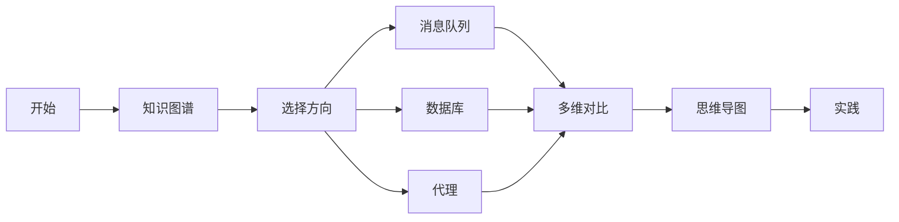
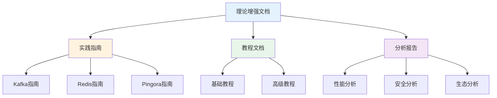

# C11 Middlewares 理论增强文档

> **文档定位**: Rust 1.90 中间件技术的高级理论体系  
> **创建日期**: 2025-10-20  
> **适用版本**: Rust 1.90+ | Edition 2024  
> **文档类型**: 理论增强 + 可视化 + 深度对比

---

## 📚 文档列表

### 1. [知识图谱与概念关系](./KNOWLEDGE_GRAPH_AND_CONCEPT_RELATIONS.md) ⭐ 推荐起点

**内容概述**:

- 中间件体系知识图谱
- 概念关系可视化
- 技术演化路径
- 学习路径规划

**适合人群**:

- 系统架构师
- 技术决策者
- 学习者初学者

**预计时间**: 30分钟

---

### 2. [多维矩阵对比分析](./MULTI_DIMENSIONAL_COMPARISON_MATRIX.md)

**内容概述**:

- 消息队列深度对比
- 数据库客户端对比
- 网络代理对比
- 缓存中间件对比
- 技术选型决策

**适合人群**:

- 技术选型人员
- 性能优化工程师
- 解决方案架构师

**预计时间**: 45分钟

---

### 3. [思维导图与可视化](./MINDMAP_VISUALIZATION.md)

**内容概述**:

- 中间件全景思维导图
- 架构图与流程图
- 监控与可观测性
- 部署架构

**适合人群**:

- 可视化学习者
- 运维工程师
- DevOps团队

**预计时间**: 40分钟

---

## 🎯 学习路径

### 快速入门路径

### 深度学习路径

1. **第1周**: 阅读知识图谱
   - 理解中间件体系
   - 掌握核心概念
   - 了解技术演化

2. **第2周**: 研究多维对比
   - 对比技术方案
   - 学习选型决策
   - 理解性能差异

3. **第3周**: 学习可视化
   - 理解架构设计
   - 掌握流程原理
   - 学习监控方案

4. **第4周**: 综合实践
   - 应用所学知识
   - 构建实际系统
   - 性能优化

---

## 📊 内容矩阵

| 文档 | 理论深度 | 实用性 | 可视化 | 推荐度 |
|------|---------|--------|--------|--------|
| 知识图谱 | ⭐⭐⭐⭐⭐ | ⭐⭐⭐ | ⭐⭐⭐⭐⭐ | ⭐⭐⭐⭐⭐ |
| 多维对比 | ⭐⭐⭐⭐ | ⭐⭐⭐⭐⭐ | ⭐⭐⭐ | ⭐⭐⭐⭐⭐ |
| 思维导图 | ⭐⭐⭐ | ⭐⭐⭐⭐ | ⭐⭐⭐⭐⭐ | ⭐⭐⭐⭐ |

---

## 🔍 按主题查找

### 消息队列

- 知识图谱 → [消息队列生态](./KNOWLEDGE_GRAPH_AND_CONCEPT_RELATIONS.md#消息队列生态)
- 多维对比 → [消息队列深度对比](./MULTI_DIMENSIONAL_COMPARISON_MATRIX.md#1-消息队列深度对比)
- 思维导图 → [Kafka架构](./MINDMAP_VISUALIZATION.md#kafka架构)

### 数据库中间件

- 知识图谱 → [数据库中间件](./KNOWLEDGE_GRAPH_AND_CONCEPT_RELATIONS.md#数据库中间件)
- 多维对比 → [数据库客户端对比](./MULTI_DIMENSIONAL_COMPARISON_MATRIX.md#2-数据库客户端对比)
- 思维导图 → [连接池架构](./MINDMAP_VISUALIZATION.md#连接池架构)

### 网络代理

- 知识图谱 → [网络代理中间件](./KNOWLEDGE_GRAPH_AND_CONCEPT_RELATIONS.md#网络代理中间件)
- 多维对比 → [网络代理对比](./MULTI_DIMENSIONAL_COMPARISON_MATRIX.md#3-网络代理对比)
- 思维导图 → [Pingora请求处理](./MINDMAP_VISUALIZATION.md#pingora请求处理)

### 缓存中间件

- 知识图谱 → [缓存架构](./KNOWLEDGE_GRAPH_AND_CONCEPT_RELATIONS.md#中间件体系总览)
- 多维对比 → [缓存中间件对比](./MULTI_DIMENSIONAL_COMPARISON_MATRIX.md#4-缓存中间件对比)
- 思维导图 → [多级缓存架构](./MINDMAP_VISUALIZATION.md#多级缓存架构)

---

## 💡 文档特色

### 1. 系统性

✅ **完整的知识体系**: 从概念到实践，从理论到应用  
✅ **结构化组织**: 清晰的层次和逻辑关系  
✅ **交叉引用**: 文档之间相互关联

### 2. 可视化

✅ **Mermaid图表**: 丰富的可视化内容  
✅ **思维导图**: 直观的知识结构  
✅ **流程图**: 清晰的处理流程

### 3. 实用性

✅ **技术对比**: 详尽的多维度对比  
✅ **选型指南**: 实用的决策建议  
✅ **最佳实践**: 生产级经验总结

---

## 📈 与其他文档的关系

---

## 🎓 适用场景

### 场景1: 技术选型

**阅读顺序**:

1. [知识图谱](./KNOWLEDGE_GRAPH_AND_CONCEPT_RELATIONS.md) - 了解全貌
2. [多维对比](./MULTI_DIMENSIONAL_COMPARISON_MATRIX.md) - 深度对比
3. [技术选型决策](./MULTI_DIMENSIONAL_COMPARISON_MATRIX.md#5-技术选型决策)

### 场景2: 架构设计

**阅读顺序**:

1. [思维导图](./MINDMAP_VISUALIZATION.md) - 理解架构
2. [部署架构](./MINDMAP_VISUALIZATION.md#7-部署架构)
3. [监控与可观测性](./MINDMAP_VISUALIZATION.md#6-监控与可观测性)

### 场景3: 学习提升

**阅读顺序**:

1. [知识图谱](./KNOWLEDGE_GRAPH_AND_CONCEPT_RELATIONS.md) - 建立体系
2. [学习路径](./KNOWLEDGE_GRAPH_AND_CONCEPT_RELATIONS.md#学习路径)
3. [思维导图](./MINDMAP_VISUALIZATION.md) - 可视化学习

### 场景4: 性能优化

**阅读顺序**:

1. [性能指标对比](./MULTI_DIMENSIONAL_COMPARISON_MATRIX.md#性能指标对比)
2. [性能优化清单](./MULTI_DIMENSIONAL_COMPARISON_MATRIX.md#性能优化清单)
3. [最佳实践](./MULTI_DIMENSIONAL_COMPARISON_MATRIX.md#黄金法则)

---

## 📚 相关资源

### 模块内文档

- [主索引](../00_MASTER_INDEX.md)
- [README](../README.md)
- [FAQ](../FAQ.md)
- [术语表](../Glossary.md)

### 实践指南

- [Kafka & Pingora](../guides/kafka_pingora.md)
- [消息队列](../guides/mq.md)
- [SQL数据库](../guides/sql.md)
- [Redis缓存](../guides/redis.md)

### 分析报告

- [性能分析](../analysis/rust190_ecosystem/03_performance_benchmarks/)
- [安全分析](../analysis/rust190_ecosystem/04_security_analysis/)
- [生态成熟度](../analysis/rust190_ecosystem/05_ecosystem_maturity/)

---

## ✅ 文档状态

| 文档 | 状态 | 完成度 | 最后更新 |
|------|------|--------|----------|
| 知识图谱 | ✅ 完成 | 100% | 2025-10-20 |
| 多维对比 | ✅ 完成 | 100% | 2025-10-20 |
| 思维导图 | ✅ 完成 | 100% | 2025-10-20 |
| README | ✅ 完成 | 100% | 2025-10-20 |

---

## 🤝 贡献指南

### 文档改进

欢迎提交：

- 内容补充
- 错误修正
- 图表优化
- 示例添加

### 反馈渠道

- Issue反馈
- Pull Request
- 邮件联系

---

**文档版本**: v1.0  
**总文档数**: 4篇  
**总图表数**: 15+个  
**最后更新**: 2025-10-20  
**维护者**: Rust-lang项目组

---

## 返回导航

- [返回主索引](../00_MASTER_INDEX.md)
- [返回模块README](../README.md)
- [查看教程](../tutorials/)
- [查看指南](../guides/)
