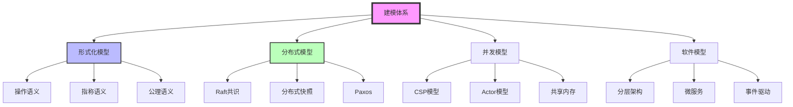
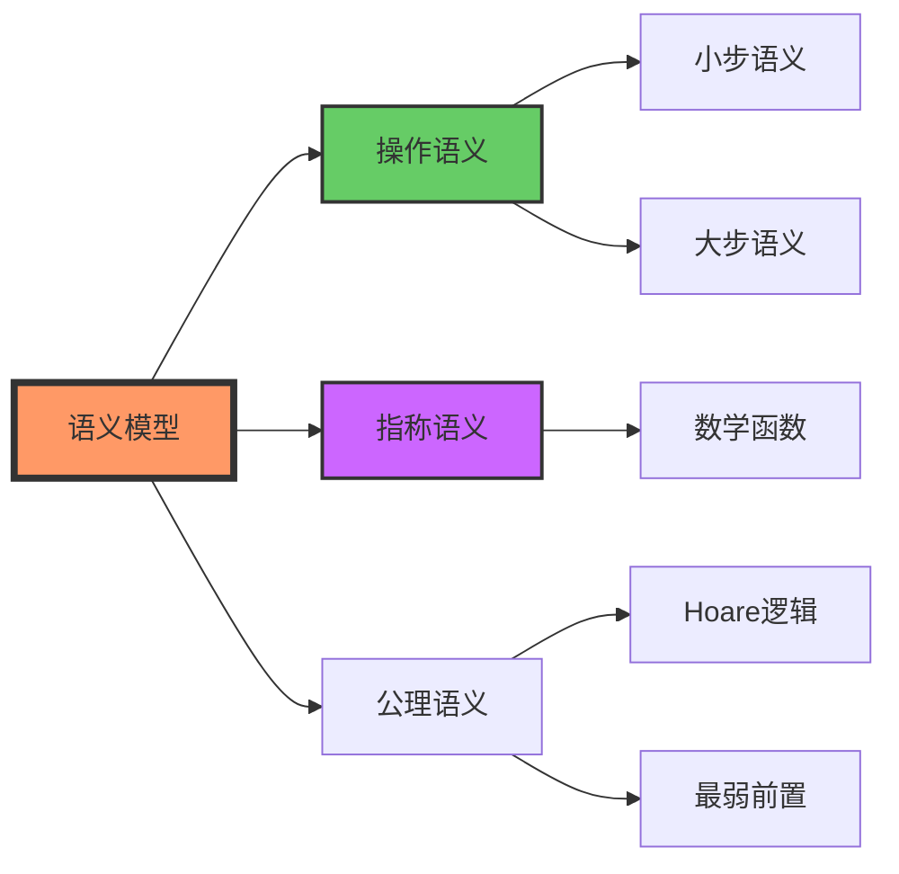
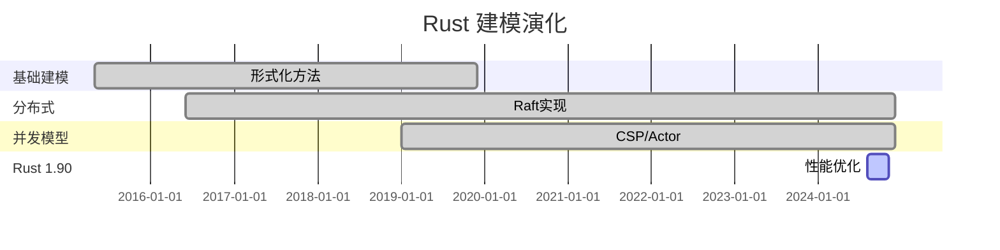

# C12 Model 知识图谱与概念关系（增强版）

> **文档定位**: Rust 1.90 建模与形式方法的完整知识体系  
> **创建日期**: 2025-10-20  
> **适用版本**: Rust 1.90+ | Edition 2024  
> **文档类型**: 理论知识图谱 + 概念关系 + 可视化

---

## 📊 目录

- [C12 Model 知识图谱与概念关系（增强版）](#c12-model-知识图谱与概念关系增强版)
  - [📊 目录](#-目录)
  - [1. 核心概念知识图谱](#1-核心概念知识图谱)
    - [建模体系总览](#建模体系总览)
    - [形式化语义模型](#形式化语义模型)
  - [2. 概念属性矩阵](#2-概念属性矩阵)
    - [模型类型对比](#模型类型对比)
    - [形式化方法对比](#形式化方法对比)
  - [3. 技术演化与学习路径](#3-技术演化与学习路径)
    - [Rust建模演化](#rust建模演化)
    - [学习路径](#学习路径)
  - [4. 总结与索引](#4-总结与索引)
    - [快速查找](#快速查找)

---

## 1. 核心概念知识图谱

### 建模体系总览

### 形式化语义模型

---

## 2. 概念属性矩阵

### 模型类型对比

| 模型 | 形式化 | 复杂度 | 适用场景 |
|------|--------|--------|---------|
| **形式化语义** | ⭐⭐⭐⭐⭐ | ⭐⭐⭐⭐⭐ | 程序验证 |
| **分布式共识** | ⭐⭐⭐⭐ | ⭐⭐⭐⭐⭐ | 分布式系统 |
| **并发模型** | ⭐⭐⭐⭐ | ⭐⭐⭐⭐ | 并发编程 |
| **软件架构** | ⭐⭐⭐ | ⭐⭐⭐ | 系统设计 |

### 形式化方法对比

| 方法 | 严格性 | 可用性 | 适用 |
|------|--------|--------|------|
| **操作语义** | ⭐⭐⭐⭐⭐ | ⭐⭐⭐ | 程序执行 |
| **指称语义** | ⭐⭐⭐⭐⭐ | ⭐⭐ | 数学证明 |
| **公理语义** | ⭐⭐⭐⭐⭐ | ⭐⭐⭐⭐ | 程序正确性 |

---

## 3. 技术演化与学习路径

### Rust建模演化

### 学习路径

**初学者 (2-3周)**:

- Week 1: 基础建模概念
- Week 2: 简单语义模型
- Week 3: 软件架构模型

**中级 (3-4周)**:

- Week 4: 形式化语义
- Week 5: 分布式模型（Raft）
- Week 6: 并发模型（CSP/Actor）
- Week 7: 模型验证

**高级 (持续)**:

- 高级形式化验证
- 复杂分布式系统
- 生产级模型设计

---

## 4. 总结与索引

### 快速查找

**按问题查找**:

- 形式化方法 → 2节对比
- 分布式模型 → 相关文档
- 并发模型 → 相关文档

**相关文档**:

- [多维矩阵对比](MULTI_DIMENSIONAL_COMPARISON_MATRIX.md)
- [README](../../README.md)
- [语义模型](../formal/semantic-models-comprehensive.md)

---

**文档版本**: v1.0  
**最后更新**: 2025-10-20

---

*本知识图谱整合 C12 Model 完整知识体系！*
