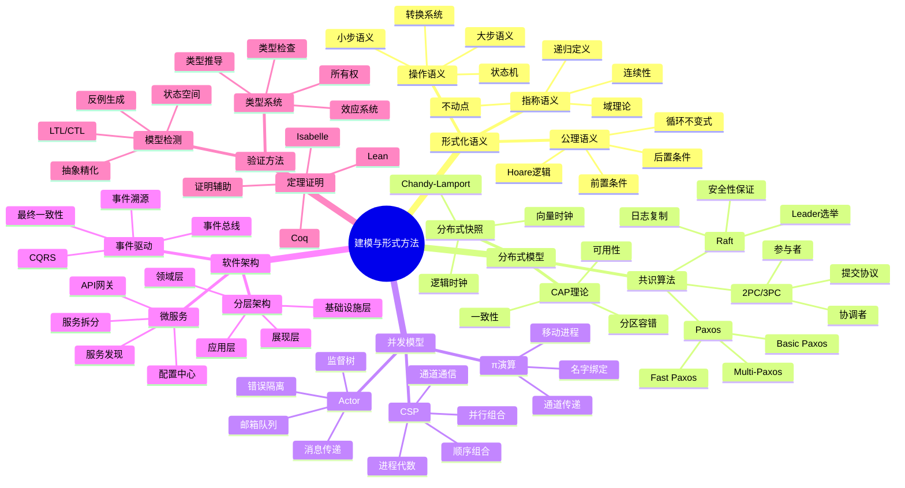
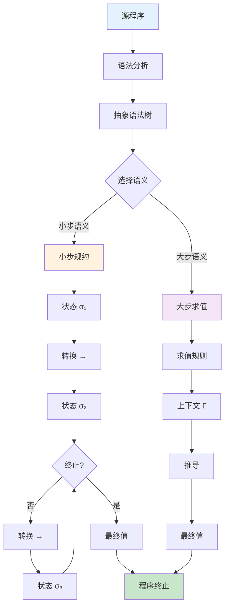
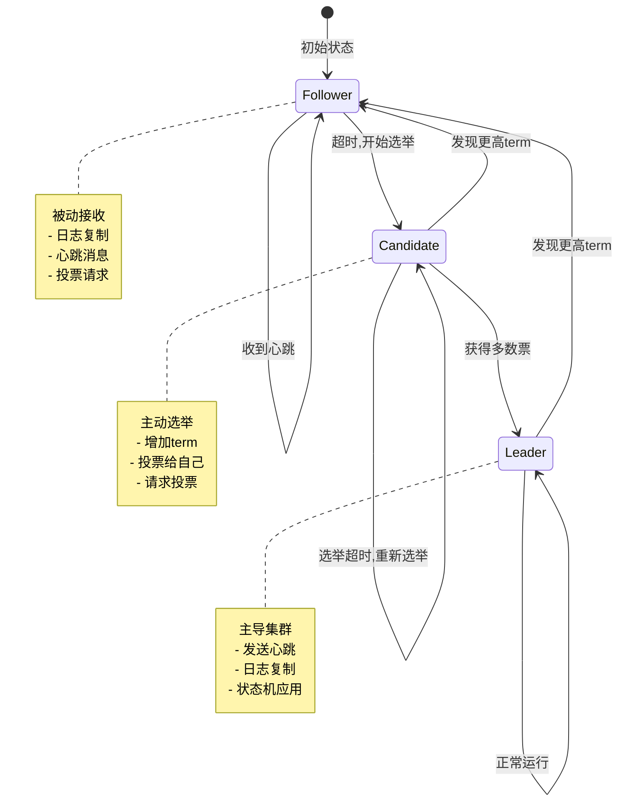
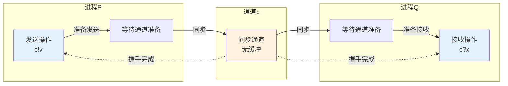
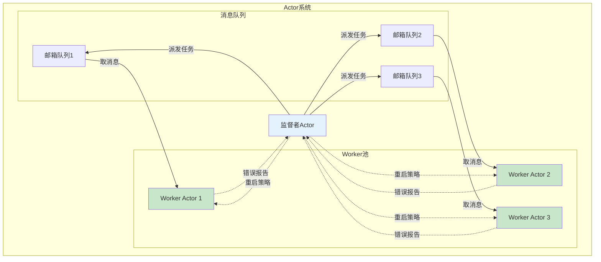
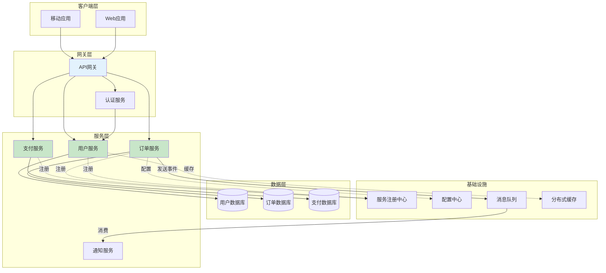
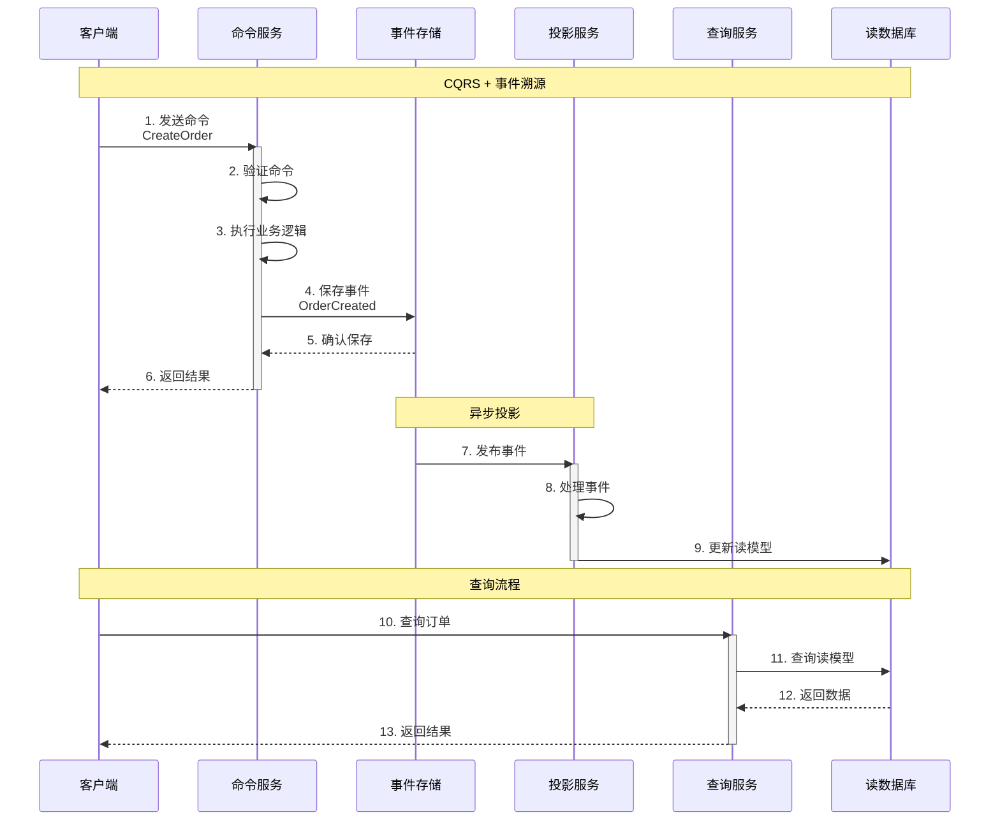
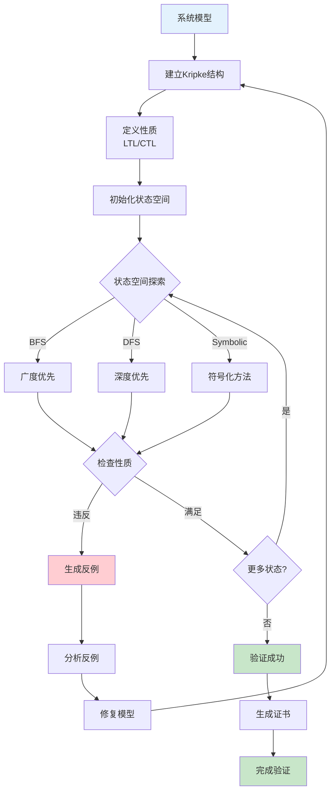
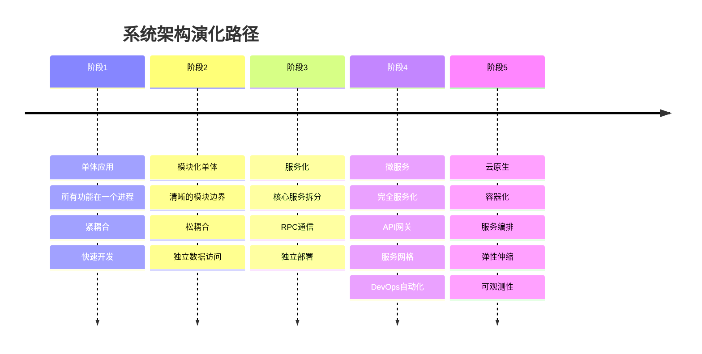

# C12 Model 思维导图与可视化

> **文档定位**: Rust 1.90 建模与形式方法可视化学习  
> **创建日期**: 2025-10-20  
> **适用版本**: Rust 1.90+ | Edition 2024  
> **文档类型**: 思维导图 + 流程图 + 架构图

---

## 📊 目录

- [C12 Model 思维导图与可视化](#c12-model-思维导图与可视化)
  - [📊 目录](#-目录)
  - [1. 建模体系全景思维导图](#1-建模体系全景思维导图)
    - [形式化方法体系](#形式化方法体系)
  - [2. 形式化语义架构](#2-形式化语义架构)
    - [操作语义执行流程](#操作语义执行流程)
    - [公理语义验证流程](#公理语义验证流程)
  - [3. 分布式系统建模](#3-分布式系统建模)
    - [Raft共识算法](#raft共识算法)
    - [分布式快照算法](#分布式快照算法)
  - [4. 并发模型架构](#4-并发模型架构)
    - [CSP通信模型](#csp通信模型)
    - [Actor消息传递](#actor消息传递)
  - [5. 软件架构模式](#5-软件架构模式)
    - [微服务架构](#微服务架构)
    - [CQRS架构流程](#cqrs架构流程)
  - [6. 形式化验证流程](#6-形式化验证流程)
    - [模型检测流程](#模型检测流程)
  - [7. 系统演化与迁移](#7-系统演化与迁移)
    - [单体到微服务演化](#单体到微服务演化)
  - [相关文档](#相关文档)
  - [返回导航](#返回导航)

---

## 1. 建模体系全景思维导图

### 形式化方法体系



---

## 2. 形式化语义架构

### 操作语义执行流程



### 公理语义验证流程

```mermaid
sequenceDiagram
    participant P as 程序
    participant Pre as 前置条件 {P}
    participant S as 语句 S
    participant Post as 后置条件 {Q}
    participant V as 验证器
    
    Note over P,V: Hoare三元组: {P} S {Q}
    
    V->>Pre: 1. 检查前置条件
    activate Pre
    Pre-->>V: 条件成立
    deactivate Pre
    
    V->>S: 2. 执行程序语句
    activate S
    
    alt 赋值语句
        S->>S: x := E
        S->>V: 应用赋值公理
    else 顺序组合
        S->>S: S1; S2
        S->>V: 应用组合规则
    else 条件语句
        S->>S: if B then S1 else S2
        S->>V: 应用条件规则
    else 循环语句
        S->>S: while B do S
        S->>V: 需要循环不变式
    end
    
    deactivate S
    
    V->>Post: 3. 验证后置条件
    activate Post
    Post-->>V: 条件成立
    deactivate Post
    
    V->>V: 4. 生成验证证明
    V->>V: 5. 输出结果
    
    Note over V: 验证成功 ✓
```

---

## 3. 分布式系统建模

### Raft共识算法



### 分布式快照算法

```mermaid
graph TB
    subgraph "Chandy-Lamport算法"
        Init[启动快照] --> Marker1[发送marker]
        
        subgraph "进程P1"
            P1_State[记录本地状态]
            P1_Record[记录通道消息]
        end
        
        subgraph "进程P2"
            P2_Receive[收到marker]
            P2_State[记录本地状态]
            P2_Forward[转发marker]
        end
        
        subgraph "进程P3"
            P3_Receive[收到marker]
            P3_State[记录本地状态]
            P3_Complete[完成快照]
        end
        
        Marker1 --> P1_State
        P1_State --> P1_Record
        P1_Record --> P2_Receive
        
        P2_Receive --> P2_State
        P2_State --> P2_Forward
        P2_Forward --> P3_Receive
        
        P3_Receive --> P3_State
        P3_State --> P3_Complete
        
        P3_Complete --> Collect[收集快照]
        Collect --> GlobalState[全局一致状态]
    end
    
    style Init fill:#e3f2fd
    style GlobalState fill:#c8e6c9
    style P1_State fill:#fff3e0
    style P2_State fill:#fff3e0
    style P3_State fill:#fff3e0
```



---

## 4. 并发模型架构

### CSP通信模型



### Actor消息传递



---

## 5. 软件架构模式

### 微服务架构



### CQRS架构流程



---

## 6. 形式化验证流程

### 模型检测流程



---

## 7. 系统演化与迁移

### 单体到微服务演化



---

## 相关文档

- [知识图谱](./KNOWLEDGE_GRAPH_AND_CONCEPT_RELATIONS.md)
- [多维对比](./MULTI_DIMENSIONAL_COMPARISON_MATRIX.md)
- [FAQ](../FAQ.md)
- [术语表](../Glossary.md)

---

**文档版本**: v1.0  
**最后更新**: 2025-10-20  
**维护者**: Rust-lang项目组

---

## 返回导航

- [返回主索引](../00_MASTER_INDEX.md)
- [返回README](../README.md)
- [查看教程](../tutorials/)
