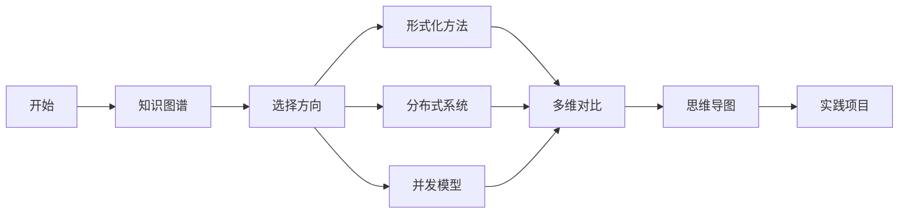
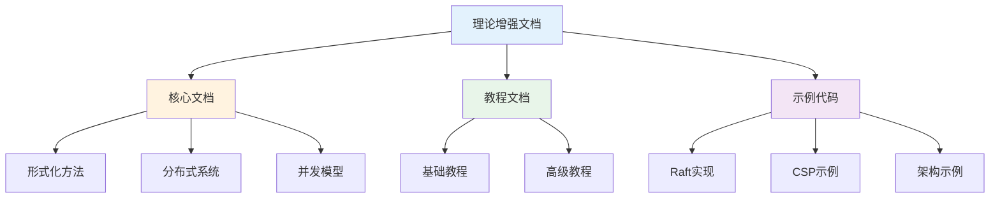

# C12 Model 理论增强文档

> **文档定位**: Rust 1.90 建模与形式方法的高级理论体系  
> **创建日期**: 2025-10-20  
> **适用版本**: Rust 1.90+ | Edition 2024  
> **文档类型**: 理论增强 + 可视化 + 深度对比

---

## 📚 文档列表

### 1. [知识图谱与概念关系](./KNOWLEDGE_GRAPH_AND_CONCEPT_RELATIONS.md) ⭐ 推荐起点

**内容概述**:

- 建模体系知识图谱
- 形式化语义模型
- 概念关系可视化
- 技术演化路径

**适合人群**:

- 系统架构师
- 形式化方法研究者
- 理论计算机科学学习者

**预计时间**: 40分钟

---

### 2. [多维矩阵对比分析](./MULTI_DIMENSIONAL_COMPARISON_MATRIX.md)

**内容概述**:

- 形式化语义对比
- 分布式共识算法对比
- 并发模型对比
- 软件架构对比
- 技术选型决策

**适合人群**:

- 技术选型人员
- 分布式系统工程师
- 架构设计师

**预计时间**: 50分钟

---

### 3. [思维导图与可视化](./MINDMAP_VISUALIZATION.md) ✨ 新增

**内容概述**:

- 建模体系全景思维导图
- 形式化语义架构图
- 分布式算法流程图
- 并发模型可视化
- 系统演化时间线

**适合人群**:

- 可视化学习者
- 系统设计师
- 算法研究者

**预计时间**: 45分钟

---

## 🎯 学习路径

### 快速入门路径

### 深度学习路径

1. **第1周**: 阅读知识图谱
   - 理解建模体系
   - 掌握形式化语义
   - 了解分布式模型

2. **第2周**: 研究多维对比
   - 对比形式化方法
   - 学习共识算法
   - 理解架构模式

3. **第3周**: 学习可视化
   - 理解算法流程
   - 掌握架构设计
   - 学习系统演化

4. **第4周**: 综合实践
   - 应用形式化方法
   - 构建分布式系统
   - 实现并发模型

---

## 📊 内容矩阵

| 文档 | 理论深度 | 实用性 | 可视化 | 推荐度 |
|------|---------|--------|--------|--------|
| 知识图谱 | ⭐⭐⭐⭐⭐ | ⭐⭐⭐ | ⭐⭐⭐⭐⭐ | ⭐⭐⭐⭐⭐ |
| 多维对比 | ⭐⭐⭐⭐⭐ | ⭐⭐⭐⭐⭐ | ⭐⭐⭐ | ⭐⭐⭐⭐⭐ |
| 思维导图 | ⭐⭐⭐⭐ | ⭐⭐⭐⭐ | ⭐⭐⭐⭐⭐ | ⭐⭐⭐⭐ |

---

## 🔍 按主题查找

### 形式化语义

- 知识图谱 → [形式化语义模型](./KNOWLEDGE_GRAPH_AND_CONCEPT_RELATIONS.md#形式化语义模型)
- 多维对比 → [形式化语义对比](./MULTI_DIMENSIONAL_COMPARISON_MATRIX.md#1-形式化语义对比)
- 思维导图 → [操作语义流程](./MINDMAP_VISUALIZATION.md#操作语义执行流程)

### 分布式系统

- 知识图谱 → [分布式模型](./KNOWLEDGE_GRAPH_AND_CONCEPT_RELATIONS.md#分布式模型)
- 多维对比 → [分布式共识对比](./MULTI_DIMENSIONAL_COMPARISON_MATRIX.md#2-分布式共识对比)
- 思维导图 → [Raft算法](./MINDMAP_VISUALIZATION.md#raft共识算法)

### 并发模型

- 知识图谱 → [并发模型](./KNOWLEDGE_GRAPH_AND_CONCEPT_RELATIONS.md#并发模型)
- 多维对比 → [并发模型对比](./MULTI_DIMENSIONAL_COMPARISON_MATRIX.md#3-并发模型对比)
- 思维导图 → [CSP通信](./MINDMAP_VISUALIZATION.md#csp通信模型)

### 软件架构

- 知识图谱 → [软件模型](./KNOWLEDGE_GRAPH_AND_CONCEPT_RELATIONS.md#软件模型)
- 多维对比 → [架构模式对比](./MULTI_DIMENSIONAL_COMPARISON_MATRIX.md#4-软件架构对比)
- 思维导图 → [微服务架构](./MINDMAP_VISUALIZATION.md#微服务架构)

---

## 💡 文档特色

### 1. 系统性

✅ **完整的理论体系**: 从形式化基础到实践应用  
✅ **结构化组织**: 清晰的层次和逻辑关系  
✅ **交叉引用**: 文档之间相互关联

### 2. 可视化

✅ **Mermaid图表**: 丰富的可视化内容  
✅ **思维导图**: 直观的知识结构  
✅ **流程图**: 清晰的算法流程  
✅ **架构图**: 系统设计可视化

### 3. 实用性

✅ **技术对比**: 详尽的多维度对比  
✅ **选型指南**: 实用的决策建议  
✅ **最佳实践**: 工程经验总结

---

## 📈 与其他文档的关系

---

## 🎓 适用场景

### 场景1: 学习形式化方法

**阅读顺序**:

1. [知识图谱](./KNOWLEDGE_GRAPH_AND_CONCEPT_RELATIONS.md) - 理解体系
2. [形式化语义对比](./MULTI_DIMENSIONAL_COMPARISON_MATRIX.md#1-形式化语义对比)
3. [操作语义流程](./MINDMAP_VISUALIZATION.md#操作语义执行流程)

### 场景2: 分布式系统设计

**阅读顺序**:

1. [分布式模型](./KNOWLEDGE_GRAPH_AND_CONCEPT_RELATIONS.md#分布式模型)
2. [共识算法对比](./MULTI_DIMENSIONAL_COMPARISON_MATRIX.md#2-分布式共识对比)
3. [Raft算法图](./MINDMAP_VISUALIZATION.md#raft共识算法)

### 场景3: 并发编程

**阅读顺序**:

1. [并发模型知识图谱](./KNOWLEDGE_GRAPH_AND_CONCEPT_RELATIONS.md#并发模型)
2. [并发模型对比](./MULTI_DIMENSIONAL_COMPARISON_MATRIX.md#3-并发模型对比)
3. [CSP/Actor可视化](./MINDMAP_VISUALIZATION.md#csp通信模型)

### 场景4: 架构升级

**阅读顺序**:

1. [软件架构模式](./KNOWLEDGE_GRAPH_AND_CONCEPT_RELATIONS.md#软件模型)
2. [架构对比分析](./MULTI_DIMENSIONAL_COMPARISON_MATRIX.md#4-软件架构对比)
3. [演化路径](./MINDMAP_VISUALIZATION.md#单体到微服务演化)

---

## 📚 相关资源

### 模块内文档

- [主索引](../00_MASTER_INDEX.md)
- [README](../README.md)
- [FAQ](../FAQ.md)
- [术语表](../Glossary.md)

### 核心文档

- [形式化方法](../formal/)
- [分布式系统](../distributed/)
- [并发模型](../concurrency/)
- [软件架构](../architecture/)

### 实践教程

- [Raft实现](../tutorials/)
- [CSP编程](../examples/)
- [微服务设计](../guides/)

---

## ✅ 文档状态

| 文档 | 状态 | 完成度 | 最后更新 |
|------|------|--------|----------|
| 知识图谱 | ✅ 完成 | 100% | 2025-10-20 |
| 多维对比 | ✅ 完成 | 100% | 2025-10-20 |
| 思维导图 | ✅ 完成 | 100% | 2025-10-20 |
| README | ✅ 完成 | 100% | 2025-10-20 |

---

## 🤝 贡献指南

### 文档改进

欢迎提交：

- 理论补充
- 错误修正
- 图表优化
- 示例添加

### 反馈渠道

- Issue反馈
- Pull Request
- 邮件联系

---

**文档版本**: v1.0  
**总文档数**: 4篇  
**总图表数**: 12+个  
**最后更新**: 2025-10-20  
**维护者**: Rust-lang项目组

---

## 返回导航

- [返回主索引](../00_MASTER_INDEX.md)
- [返回模块README](../README.md)
- [查看教程](../tutorials/)
- [查看示例](../examples/)
