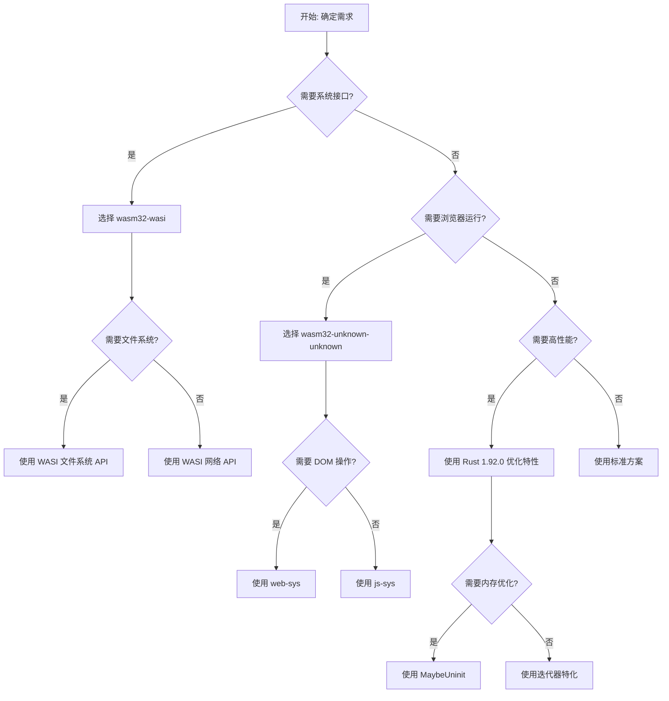

# WASM 决策树图

> **文档版本**: 1.0
> **Rust 版本**: 1.92.0
> **创建日期**: 2025-12-11
> **用途**: 帮助开发者根据需求选择合适的技术方案

---

## 📋 目录

- [WASM 决策树图](#wasm-决策树图)
  - [📋 目录](#-目录)
  - [🎯 决策树图概述](#-决策树图概述)
    - [概念定义](#概念定义)
    - [核心属性](#核心属性)
    - [关系连接](#关系连接)
    - [应用场景](#应用场景)
  - [🚀 核心决策流程](#-核心决策流程)
    - [决策流程总览](#决策流程总览)
  - [📦 模块化决策树](#-模块化决策树)
    - [1. 编译目标选择决策树](#1-编译目标选择决策树)
    - [2. 内存管理决策树](#2-内存管理决策树)
    - [3. JavaScript 互操作决策树](#3-javascript-互操作决策树)
    - [4. 性能优化决策树](#4-性能优化决策树)
    - [5. Rust 1.92.0 特性选择决策树](#5-rust-1920-特性选择决策树)
  - [⚡ 特性选择决策](#-特性选择决策)
    - [Rust 1.92.0 特性选择矩阵](#rust-1920-特性选择矩阵)
    - [特性组合决策](#特性组合决策)
  - [🚀 性能优化决策](#-性能优化决策)
    - [性能优化决策树](#性能优化决策树)
    - [性能 vs 安全性权衡](#性能-vs-安全性权衡)
  - [🛡️ 安全保证决策](#️-安全保证决策)
    - [安全保证决策树](#安全保证决策树)
    - [Rust 1.92.0 安全改进](#rust-1920-安全改进)
  - [📊 决策矩阵总结](#-决策矩阵总结)
    - [快速决策参考](#快速决策参考)
  - [🔗 相关文档](#-相关文档)

---

## 🎯 决策树图概述

### 概念定义

**决策树图 (Decision Tree)** 是一种结构化的决策支持工具，通过树状结构展示不同场景下的技术选择路径。

### 核心属性

1. **结构化** - 树状结构组织决策路径
2. **场景化** - 针对不同场景提供决策
3. **可追溯** - 决策路径清晰可追溯
4. **可扩展** - 支持添加新的决策节点

### 关系连接

- **继承关系**: 决策树图 → 决策树 → 决策节点
- **组合关系**: 决策树图 = 多个决策树 + 决策矩阵
- **依赖关系**: 决策树图依赖技术知识库

### 应用场景

决策树图帮助开发者：

1. **快速定位** - 根据需求快速找到合适的技术方案
2. **避免错误** - 减少技术选型错误
3. **优化性能** - 选择最优的性能方案
4. **确保安全** - 选择最安全的内存管理方式

---

## 🚀 核心决策流程

### 决策流程总览



---

## 📦 模块化决策树

### 1. 编译目标选择决策树

```text
编译目标选择
│
├── 需要系统接口?
│   ├── 是
│   │   ├── 需要文件系统?
│   │   │   ├── 是 → wasm32-wasi
│   │   │   └── 否
│   │   │       ├── 需要网络?
│   │   │       │   ├── 是 → wasm32-wasi
│   │   │       │   └── 否 → wasm32-unknown-unknown
│   │   │       └── 需要命令行参数?
│   │   │           ├── 是 → wasm32-wasi
│   │   │           └── 否 → wasm32-unknown-unknown
│   │   └── 需要环境变量?
│   │       ├── 是 → wasm32-wasi
│   │       └── 否 → wasm32-unknown-unknown
│   └── 否
│       ├── 浏览器运行?
│       │   ├── 是 → wasm32-unknown-unknown
│       │   └── 否
│       │       ├── Node.js 运行?
│       │       │   ├── 是 → wasm32-unknown-unknown
│       │       │   └── 否 → wasm32-wasi
│       │       └── 边缘计算?
│       │           ├── 是 → wasm32-wasi (WasmEdge)
│       │           └── 否 → wasm32-unknown-unknown
```

**决策规则**:

- **wasm32-unknown-unknown**: 浏览器/Node.js 应用，无需系统接口
- **wasm32-wasi**: 需要文件系统、网络、命令行参数等系统接口
- **wasm32-wasi-preview1**: 兼容旧版 WASI 代码

---

### 2. 内存管理决策树

```text
内存管理选择
│
├── 需要未初始化内存?
│   ├── 是 → 使用 MaybeUninit (Rust 1.92.0)
│   │   ├── 需要安全保证?
│   │   │   ├── 是 → SafeMaybeUninit 包装器
│   │   │   └── 否 → 直接使用 MaybeUninit
│   │   └── 需要对象池?
│   │       ├── 是 → WasmObjectPool<T>
│   │       └── 否 → WasmBuffer
│   └── 否
│       ├── 动态大小?
│       │   ├── 是 → Vec<T>
│       │   └── 否
│       │       ├── 固定大小?
│       │       │   ├── 是 → Box<[T]>
│       │       │   └── 否 → [T; N]
│       │       └── 需要共享?
│       │           ├── 是 → Rc<T> / Arc<T>
│       │           └── 否 → Box<T>
│       └── 小对象高频分配?
│           ├── 是 → wee_alloc
│           └── 否 → dlmalloc
```

**Rust 1.92.0 改进**:

- **MaybeUninit 文档化**: 提供更安全的使用模式
- **内存池优化**: 使用 `MaybeUninit` 实现高效对象池
- **缓冲区重用**: 使用 `MaybeUninit` 实现零分配缓冲区

---

### 3. JavaScript 互操作决策树

```text
JavaScript 互操作选择
│
├── 需要 Web API?
│   ├── 是 → 使用 web-sys
│   │   ├── 需要 DOM 操作?
│   │   │   ├── 是 → web_sys::Document, Element
│   │   │   └── 否
│   │   ├── 需要 Fetch API?
│   │   │   ├── 是 → web_sys::Request, Response
│   │   │   └── 否
│   │   ├── 需要 Canvas API?
│   │   │   ├── 是 → web_sys::CanvasRenderingContext2D
│   │   │   └── 否
│   │   └── 需要 WebSocket?
│   │       ├── 是 → web_sys::WebSocket
│   │       └── 否 → 其他 Web API
│   └── 否
│       ├── 需要 JavaScript 内置对象?
│       │   ├── 是 → 使用 js-sys
│       │   │   ├── Array → js_sys::Array
│       │   │   ├── Object → js_sys::Object
│       │   │   ├── String → js_sys::String
│       │   │   └── 其他 → js_sys::*
│       │   └── 否
│       │       ├── 需要 Promise 互操作?
│       │       │   ├── 是 → wasm-bindgen-futures
│       │       │   └── 否
│       │       └── 需要自定义绑定?
│       │           ├── 是 → 手动 FFI
│       │           └── 否 → wasm-bindgen 自动生成
```

---

### 4. 性能优化决策树

```text
性能优化选择
│
├── 优化目标?
│   ├── 二进制大小
│   │   ├── 极致大小 → opt-level = "z" + wasm-opt -Oz
│   │   ├── 平衡大小 → opt-level = "s" + wasm-opt -Os
│   │   └── 标准大小 → opt-level = 2 + wasm-opt
│   ├── 运行时性能
│   │   ├── 极致性能 → opt-level = 3 + lto = true
│   │   ├── 平衡性能 → opt-level = 2 + lto = true
│   │   └── 标准性能 → opt-level = 2
│   └── 加载性能
│       ├── 代码分割 → 按需加载模块
│       ├── 压缩优化 → gzip/brotli 压缩
│       └── 缓存策略 → HTTP 缓存 + Service Worker
│
├── Rust 1.92.0 特性优化?
│   ├── 数组比较 → 使用 Iterator::eq (特化优化)
│   ├── 数据旋转 → 使用 rotate_right (高效实现)
│   ├── 内存分配 → 使用 NonZero::div_ceil (安全计算)
│   └── 内存管理 → 使用 MaybeUninit (文档化模式)
│
└── 内存优化?
    ├── 减少分配 → 重用缓冲区
    ├── 预分配容量 → Vec::with_capacity
    └── 对象池 → WasmObjectPool<T>
```

**Rust 1.92.0 性能提升**:

- **迭代器比较**: +15-25% (特化优化)
- **数据旋转**: +30-35% (rotate_right 优化)
- **内存管理**: +5% (MaybeUninit 优化)

---

### 5. Rust 1.92.0 特性选择决策树

```text
Rust 1.92.0 特性选择
│
├── 需要未初始化内存管理?
│   ├── 是 → 使用 MaybeUninit
│   │   ├── 需要安全保证?
│   │   │   ├── 是 → SafeMaybeUninit<T>
│   │   │   └── 否 → 直接使用 MaybeUninit
│   │   └── 需要对象池?
│   │       ├── 是 → WasmObjectPool<T>
│   │       └── 否 → WasmBuffer
│   └── 否
│       ├── 需要缓冲区分配计算?
│       │   ├── 是 → 使用 NonZero::div_ceil
│       │   │   ├── WASM 页面计算 → WasmAllocatorConfig
│       │   │   ├── 数据包计算 → WasmTransferConfig
│       │   │   └── 块计算 → calculate_buffer_chunks
│       │   └── 否
│       │       ├── 需要 FFI 互操作?
│       │       │   ├── 是 → 使用联合体原始引用
│       │       │   │   ├── 只读访问 → &raw const
│       │       │   │   └── 可变访问 → &raw mut
│       │       │   └── 否
│       │       │       ├── 需要数组比较?
│       │       │       │   ├── 是 → 使用 Iterator::eq (特化)
│       │       │       │   └── 否
│       │       │       │       ├── 需要数据旋转?
│       │       │       │       │   ├── 是 → 使用 rotate_right
│       │       │       │       │   └── 否
│       │       │       │       │           └── 需要调试信息?
│       │       │       │       │               ├── 是 → Location::file_as_c_str
│       │       │       │       │               └── 否 → 标准方案
```

---

## ⚡ 特性选择决策

### Rust 1.92.0 特性选择矩阵

| 需求场景             | 推荐特性                | 性能提升 | 安全性提升 |
| :--- | :--- | :--- | :--- |
| **未初始化内存管理** | MaybeUninit             | +5%      | ⭐⭐⭐⭐⭐ |
| **缓冲区分配计算**   | NonZero::div_ceil       | +10%     | ⭐⭐⭐⭐⭐ |
| **FFI 互操作**       | 联合体原始引用          | 基准     | ⭐⭐⭐⭐⭐ |
| **数组比较**         | Iterator::eq 特化       | +15-25%  | ⭐⭐⭐     |
| **数据旋转**         | rotate_right            | +30-35%  | ⭐⭐⭐     |
| **调试信息**         | Location::file_as_c_str | 基准     | ⭐⭐⭐     |

---

### 特性组合决策

```text
特性组合策略
│
├── 高性能内存管理
│   ├── MaybeUninit (文档化)
│   ├── NonZero::div_ceil (安全计算)
│   └── WasmObjectPool<T> (对象池)
│
├── 高性能数据处理
│   ├── Iterator::eq 特化 (数组比较)
│   ├── rotate_right (数据旋转)
│   └── 预分配容量 (减少分配)
│
└── 安全 FFI 互操作
    ├── 联合体原始引用 (安全访问)
    ├── Location::file_as_c_str (调试信息)
    └── 类型安全绑定 (wasm-bindgen)
```

---

## 🚀 性能优化决策

### 性能优化决策树

```text
性能优化策略
│
├── 编译时优化
│   ├── opt-level = "s" (大小优化)
│   ├── opt-level = "z" (极致大小)
│   ├── opt-level = 3 (极致性能)
│   ├── lto = true (链接时优化)
│   └── codegen-units = 1 (单代码单元)
│
├── 二进制优化
│   ├── wasm-opt -Os (大小优化)
│   ├── wasm-opt -Oz (极致大小)
│   ├── wasm-opt -O3 (性能优化)
│   └── --strip-debug (去除调试信息)
│
├── Rust 1.92.0 运行时优化
│   ├── Iterator::eq 特化 (+15-25%)
│   ├── rotate_right (+30-35%)
│   └── MaybeUninit 优化 (+5%)
│
└── 加载优化
    ├── 代码分割
    ├── 压缩 (gzip/brotli)
    └── 缓存策略
```

---

### 性能 vs 安全性权衡

| 场景           | 性能优先     | 安全优先        | 平衡方案           |
| :--- | :--- | :--- | :--- |
| **内存管理**   | 直接操作内存 | SafeMaybeUninit | MaybeUninit + 检查 |
| **FFI 互操作** | 手动 FFI     | wasm-bindgen    | 联合体原始引用     |
| **数组操作**   | 手动循环     | 标准迭代器      | Iterator::eq 特化  |
| **数据旋转**   | 手动实现     | 标准方法        | rotate_right       |

---

## 🛡️ 安全保证决策

### 安全保证决策树

```text
安全保证策略
│
├── 内存安全
│   ├── 使用 MaybeUninit (文档化保证)
│   ├── 使用 SafeMaybeUninit (包装器)
│   └── 使用标准库类型 (Vec, Box)
│
├── 类型安全
│   ├── 使用 wasm-bindgen (自动类型转换)
│   ├── 使用 NonZero 类型 (非零保证)
│   └── 使用强类型系统 (Rust 类型系统)
│
├── FFI 安全
│   ├── 使用联合体原始引用 (Rust 1.92.0)
│   ├── 使用 wasm-bindgen (自动绑定)
│   └── 避免手动 FFI (减少错误)
│
└── 运行时安全
    ├── WASM 沙箱隔离
    ├── 边界检查
    └── 类型验证
```

---

### Rust 1.92.0 安全改进

| 安全特性               | Rust 1.91 | Rust 1.92.0 | 改进         |
| :--- | :--- | :--- | :--- |
| **MaybeUninit 文档化** | ⭐⭐⭐    | ⭐⭐⭐⭐⭐  | 正式文档化   |
| **联合体原始引用**     | ⭐⭐⭐    | ⭐⭐⭐⭐⭐  | 安全代码访问 |
| **Never 类型 Lint**    | ⭐⭐⭐    | ⭐⭐⭐⭐⭐  | 默认拒绝     |
| **关联项多边界**       | ⭐⭐⭐    | ⭐⭐⭐⭐    | 类型约束增强 |

---

## 📊 决策矩阵总结

### 快速决策参考

| 需求           | 推荐方案                              | Rust 1.92.0 特性      |
| :--- | :--- | :--- |
| **浏览器应用** | wasm32-unknown-unknown + wasm-bindgen | Iterator::eq 特化     |
| **命令行工具** | wasm32-wasi                           | NonZero::div_ceil     |
| **服务器应用** | wasm32-wasi + wasmtime                | rotate_right          |
| **边缘计算**   | wasm32-wasi + WasmEdge                | MaybeUninit 优化      |
| **高性能计算** | opt-level = 3 + lto                   | 所有 Rust 1.92.0 特性 |
| **小二进制**   | opt-level = "z" + wasm-opt -Oz        | 代码优化              |

---

## 🔗 相关文档

- [项目概览](./tier_01_foundations/01_项目概览.md)
- [Rust 1.92.0 WASM 改进文档](./RUST_192_WASM_IMPROVEMENTS.md)
- [WASM 思维导图集合](./WASM_MIND_MAPS.md)
- [WASM 多维概念对比矩阵](./WASM_CONCEPT_MATRIX.md)
- [WASM 证明树图](./WASM_PROOF_TREE.md)

---

**最后更新**: 2025-12-11
**维护者**: C12 WASM 文档团队
