# 混沌工程实践指南

> **文档定位**: Rust 1.90 混沌工程完整实践方案  
> **创建日期**: 2025-10-20  
> **适用版本**: Rust 1.90+ | Edition 2024  
> **文档类型**: 高级主题 + 实践指南

---

## 📊 目录

- [混沌工程实践指南](#混沌工程实践指南)
  - [📊 目录](#-目录)
  - [1. 混沌工程概述](#1-混沌工程概述)
    - [1.1 什么是混沌工程](#11-什么是混沌工程)
    - [1.2 核心原则](#12-核心原则)
    - [1.3 实施流程](#13-实施流程)
  - [2. 故障注入类型](#2-故障注入类型)
    - [2.1 网络故障](#21-网络故障)
    - [2.2 资源故障](#22-资源故障)
    - [2.3 应用故障](#23-应用故障)
    - [2.4 依赖故障](#24-依赖故障)
  - [3. Rust混沌工程实现](#3-rust混沌工程实现)
    - [3.1 故障注入框架](#31-故障注入框架)
    - [3.2 网络延迟注入](#32-网络延迟注入)
    - [3.3 错误注入](#33-错误注入)
    - [3.4 资源限制](#34-资源限制)
  - [4. 混沌实验设计](#4-混沌实验设计)
    - [4.1 实验模板](#41-实验模板)
    - [4.2 稳态假设](#42-稳态假设)
    - [4.3 实验执行](#43-实验执行)
    - [4.4 结果分析](#44-结果分析)
  - [5. 实战案例](#5-实战案例)
    - [5.1 微服务故障注入](#51-微服务故障注入)
    - [5.2 数据库连接故障](#52-数据库连接故障)
    - [5.3 缓存失效测试](#53-缓存失效测试)
  - [6. 工具与平台](#6-工具与平台)
    - [6.1 Chaos Mesh](#61-chaos-mesh)
    - [6.2 Litmus](#62-litmus)
    - [6.3 Toxiproxy](#63-toxiproxy)
  - [7. 最佳实践](#7-最佳实践)
    - [7.1 实施策略](#71-实施策略)
    - [7.2 安全措施](#72-安全措施)
    - [7.3 团队协作](#73-团队协作)
  - [8. 可观测性集成](#8-可观测性集成)
  - [9. 总结与展望](#9-总结与展望)
    - [核心要点](#核心要点)
    - [未来方向](#未来方向)
  - [相关文档](#相关文档)
  - [返回导航](#返回导航)

---

## 1. 混沌工程概述

### 1.1 什么是混沌工程

**定义**:
混沌工程是在分布式系统上进行实验的学科，目的是建立对系统承受生产环境中动荡条件能力的信心。

**核心目标**:

- 🎯 发现系统弱点
- 🛡️ 提高系统韧性
- 📈 增强可靠性信心
- 🔧 验证容错机制

**发展历程**:

```mermaid
timeline
    title 混沌工程发展历程
    2010 : Netflix创建Chaos Monkey
         : 随机终止EC2实例
    2012 : Simian Army
         : 扩展故障类型
    2015 : Principles of Chaos Engineering
         : 理论体系建立
    2017 : Chaos Engineering Book
         : 系统化方法论
    2020 : Cloud Native Chaos
         : Kubernetes生态集成
    2024 : Rust Chaos Tools
         : 类型安全的混沌工程
```



---

### 1.2 核心原则

**原则1: 建立稳态假设**:

```rust
/// 稳态假设定义
#[derive(Debug, Clone)]
pub struct SteadyStateHypothesis {
    /// 假设名称
    pub name: String,
    
    /// 关键指标
    pub metrics: Vec<Metric>,
    
    /// 可接受阈值
    pub thresholds: HashMap<String, Threshold>,
}

#[derive(Debug, Clone)]
pub struct Metric {
    pub name: String,
    pub query: String,
    pub expected_value: f64,
    pub tolerance: f64, // ±5%
}

impl SteadyStateHypothesis {
    /// 验证稳态
    pub async fn verify(&self) -> Result<bool, Error> {
        for metric in &self.metrics {
            let actual = self.measure_metric(metric).await?;
            let threshold = self.thresholds.get(&metric.name)
                .ok_or(Error::ThresholdNotFound)?;
            
            if !threshold.is_within_bounds(actual) {
                return Ok(false);
            }
        }
        Ok(true)
    }
}
```

**原则2: 多样化现实世界事件**:

```rust
/// 故障类型
#[derive(Debug, Clone)]
pub enum FaultType {
    /// 网络故障
    Network(NetworkFault),
    
    /// 资源故障
    Resource(ResourceFault),
    
    /// 应用故障
    Application(ApplicationFault),
    
    /// 基础设施故障
    Infrastructure(InfraFault),
}

#[derive(Debug, Clone)]
pub enum NetworkFault {
    Latency { delay_ms: u64 },
    PacketLoss { percentage: f32 },
    Disconnect,
    PartitionNetwork { group_a: Vec<String>, group_b: Vec<String> },
}
```

**原则3: 在生产环境运行实验**:

```rust
/// 生产环境混沌实验配置
#[derive(Debug)]
pub struct ProductionChaosConfig {
    /// 安全保护
    pub safety_guards: SafetyGuards,
    
    /// 爆炸半径
    pub blast_radius: BlastRadius,
    
    /// 回滚策略
    pub rollback_strategy: RollbackStrategy,
}

#[derive(Debug)]
pub struct SafetyGuards {
    /// 最大影响用户数
    pub max_affected_users: usize,
    
    /// 自动停止条件
    pub auto_stop_conditions: Vec<StopCondition>,
    
    /// 观察员模式
    pub observer_mode: bool,
}
```

**原则4: 自动化持续运行**:

```rust
/// 混沌实验调度器
pub struct ChaosScheduler {
    experiments: Vec<ChaosExperiment>,
    schedule: Schedule,
}

impl ChaosScheduler {
    /// 持续运行实验
    pub async fn run_continuous(&self) -> Result<(), Error> {
        loop {
            for experiment in &self.experiments {
                if self.schedule.should_run(experiment)? {
                    self.execute_experiment(experiment).await?;
                }
            }
            
            tokio::time::sleep(self.schedule.interval()).await;
        }
    }
}
```

**原则5: 最小化爆炸半径**:

```rust
/// 爆炸半径控制
#[derive(Debug)]
pub struct BlastRadius {
    /// 影响范围
    pub scope: Scope,
    
    /// 流量百分比
    pub traffic_percentage: f32,
    
    /// 持续时间
    pub duration: Duration,
}

#[derive(Debug)]
pub enum Scope {
    SingleInstance,
    SingleAZ,
    MultiAZ { count: usize },
    Region { percentage: f32 },
}
```

---

### 1.3 实施流程

```mermaid
flowchart TD
    Start[开始] --> Define[定义稳态]
    Define --> Hypothesis[制定假设]
    Hypothesis --> Design[设计实验]
    
    Design --> Baseline[基线测试]
    Baseline --> Inject[注入故障]
    Inject --> Measure[测量影响]
    
    Measure --> Compare{比较结果}
    Compare -->|符合预期| Document[文档化]
    Compare -->|发现问题| Fix[修复问题]
    
    Fix --> Retest[重新测试]
    Retest --> Compare
    
    Document --> AutomAutomation[自动化]
    Automation --> Monitor[持续监控]
    Monitor --> Expand[扩大范围]
    
    Expand --> Define
    
    style Start fill:#e3f2fd
    style Define fill:#fff3e0
    style Inject fill:#ffcdd2
    style Fix fill:#c8e6c9
    style Automation fill:#e8f5e9
```



---

## 2. 故障注入类型

### 2.1 网络故障

**延迟注入**:

```rust
/// 网络延迟注入器
pub struct NetworkLatencyInjector {
    target: String,
    delay: Duration,
    jitter: Option<Duration>,
}

impl NetworkLatencyInjector {
    /// 注入延迟
    pub async fn inject<F, Fut>(&self, operation: F) -> Result<(), Error>
    where
        F: FnOnce() -> Fut,
        Fut: Future<Output = Result<(), Error>>,
    {
        // 计算实际延迟
        let actual_delay = if let Some(jitter) = self.jitter {
            self.delay + Self::random_jitter(jitter)
        } else {
            self.delay
        };
        
        // 延迟执行
        tokio::time::sleep(actual_delay).await;
        
        // 执行操作
        operation().await
    }
    
    fn random_jitter(max: Duration) -> Duration {
        use rand::Rng;
        let jitter_ms = rand::thread_rng().gen_range(0..max.as_millis());
        Duration::from_millis(jitter_ms as u64)
    }
}

// 使用示例
#[tokio::test]
async fn test_network_latency() {
    let injector = NetworkLatencyInjector {
        target: "api.example.com".to_string(),
        delay: Duration::from_millis(500),
        jitter: Some(Duration::from_millis(100)),
    };
    
    let result = injector.inject(|| async {
        // 模拟API调用
        Ok(())
    }).await;
    
    assert!(result.is_ok());
}
```

**丢包注入**:

```rust
/// 网络丢包注入器
pub struct PacketLossInjector {
    loss_rate: f32, // 0.0 - 1.0
}

impl PacketLossInjector {
    /// 模拟丢包
    pub fn should_drop_packet(&self) -> bool {
        use rand::Rng;
        rand::thread_rng().gen::<f32>() < self.loss_rate
    }
    
    /// 带丢包的操作
    pub async fn with_packet_loss<F, T>(&self, operation: F) -> Result<T, Error>
    where
        F: FnOnce() -> Result<T, Error>,
    {
        if self.should_drop_packet() {
            Err(Error::NetworkError("Packet dropped".to_string()))
        } else {
            operation()
        }
    }
}
```

**网络分区**:

```rust
/// 网络分区注入器
pub struct NetworkPartitionInjector {
    partitions: Vec<Partition>,
}

#[derive(Debug)]
pub struct Partition {
    pub group_a: Vec<String>,
    pub group_b: Vec<String>,
    pub isolated: bool,
}

impl NetworkPartitionInjector {
    /// 注入网络分区
    pub async fn inject_partition(&self, partition: &Partition) -> Result<(), Error> {
        // 模拟网络分区
        for node_a in &partition.group_a {
            for node_b in &partition.group_b {
                self.block_communication(node_a, node_b).await?;
            }
        }
        Ok(())
    }
    
    /// 恢复网络
    pub async fn heal_partition(&self, partition: &Partition) -> Result<(), Error> {
        for node_a in &partition.group_a {
            for node_b in &partition.group_b {
                self.restore_communication(node_a, node_b).await?;
            }
        }
        Ok(())
    }
}
```

---

### 2.2 资源故障

**CPU压力**:

```rust
/// CPU压力注入器
pub struct CpuStressInjector {
    /// 目标CPU使用率 (0-100)
    target_usage: u8,
    
    /// 持续时间
    duration: Duration,
}

impl CpuStressInjector {
    /// 注入CPU压力
    pub async fn inject(&self) -> Result<(), Error> {
        let start = Instant::now();
        
        while start.elapsed() < self.duration {
            // 计算密集型操作
            self.burn_cpu().await;
            
            // 根据目标使用率调整
            let sleep_time = self.calculate_sleep_time();
            tokio::time::sleep(sleep_time).await;
        }
        
        Ok(())
    }
    
    async fn burn_cpu(&self) {
        // 执行计算密集型任务
        let mut sum = 0u64;
        for i in 0..1_000_000 {
            sum = sum.wrapping_add(i);
        }
        
        // 防止编译器优化掉
        std::hint::black_box(sum);
    }
}
```

**内存压力**:

```rust
/// 内存压力注入器
pub struct MemoryStressInjector {
    /// 目标内存使用量(MB)
    target_mb: usize,
    
    /// 持续时间
    duration: Duration,
}

impl MemoryStressInjector {
    /// 注入内存压力
    pub async fn inject(&self) -> Result<(), Error> {
        let mut allocations = Vec::new();
        
        // 分配内存
        let chunk_size = 1024 * 1024; // 1MB
        for _ in 0..self.target_mb {
            let chunk = vec![0u8; chunk_size];
            allocations.push(chunk);
        }
        
        // 持续占用
        tokio::time::sleep(self.duration).await;
        
        // 释放内存
        drop(allocations);
        
        Ok(())
    }
}
```

**磁盘IO压力**:

```rust
/// 磁盘IO压力注入器
pub struct DiskStressInjector {
    /// 目标IOPS
    target_iops: usize,
    
    /// 持续时间
    duration: Duration,
}

impl DiskStressInjector {
    /// 注入磁盘压力
    pub async fn inject(&self) -> Result<(), Error> {
        use tokio::fs::File;
        use tokio::io::{AsyncWriteExt, AsyncReadExt};
        
        let start = Instant::now();
        let temp_file = "/tmp/chaos_stress_test";
        
        while start.elapsed() < self.duration {
            // 写操作
            let mut file = File::create(temp_file).await?;
            file.write_all(&vec![0u8; 4096]).await?;
            file.sync_all().await?;
            
            // 读操作
            let mut file = File::open(temp_file).await?;
            let mut buffer = vec![0u8; 4096];
            file.read_exact(&mut buffer).await?;
            
            // 控制IOPS
            let sleep_time = Duration::from_micros(1_000_000 / self.target_iops as u64);
            tokio::time::sleep(sleep_time).await;
        }
        
        // 清理
        tokio::fs::remove_file(temp_file).await?;
        
        Ok(())
    }
}
```

---

### 2.3 应用故障

**异常注入**:

```rust
/// 异常注入器
pub struct ExceptionInjector {
    /// 异常率 (0.0 - 1.0)
    exception_rate: f32,
    
    /// 异常类型
    exception_type: ExceptionType,
}

#[derive(Debug, Clone)]
pub enum ExceptionType {
    Panic,
    Error(String),
    Timeout,
    Custom(String),
}

impl ExceptionInjector {
    /// 可能抛出异常的操作
    pub fn with_exception<F, T>(&self, operation: F) -> Result<T, Error>
    where
        F: FnOnce() -> Result<T, Error>,
    {
        use rand::Rng;
        
        if rand::thread_rng().gen::<f32>() < self.exception_rate {
            match &self.exception_type {
                ExceptionType::Panic => {
                    panic!("Chaos: Injected panic!");
                }
                ExceptionType::Error(msg) => {
                    Err(Error::ChaosInjected(msg.clone()))
                }
                ExceptionType::Timeout => {
                    Err(Error::Timeout)
                }
                ExceptionType::Custom(msg) => {
                    Err(Error::Custom(msg.clone()))
                }
            }
        } else {
            operation()
        }
    }
}
```

**慢调用注入**:

```rust
/// 慢调用注入器
pub struct SlowCallInjector {
    /// 慢调用率
    slow_call_rate: f32,
    
    /// 延迟时间
    delay: Duration,
}

impl SlowCallInjector {
    /// 可能变慢的操作
    pub async fn with_slowdown<F, Fut, T>(&self, operation: F) -> Result<T, Error>
    where
        F: FnOnce() -> Fut,
        Fut: Future<Output = Result<T, Error>>,
    {
        use rand::Rng;
        
        if rand::thread_rng().gen::<f32>() < self.slow_call_rate {
            tokio::time::sleep(self.delay).await;
        }
        
        operation().await
    }
}
```

---

### 2.4 依赖故障

**服务降级**:

```rust
/// 依赖服务故障注入器
pub struct DependencyFaultInjector {
    service_name: String,
    fault_scenarios: Vec<FaultScenario>,
}

#[derive(Debug, Clone)]
pub enum FaultScenario {
    /// 完全不可用
    Unavailable,
    
    /// 高延迟
    HighLatency { delay: Duration },
    
    /// 间歇性故障
    Intermittent { failure_rate: f32 },
    
    /// 返回错误数据
    CorruptedData,
}

impl DependencyFaultInjector {
    /// 模拟依赖故障
    pub async fn inject_fault<T>(&self, scenario: &FaultScenario) -> Result<T, Error> {
        match scenario {
            FaultScenario::Unavailable => {
                Err(Error::ServiceUnavailable(self.service_name.clone()))
            }
            
            FaultScenario::HighLatency { delay } => {
                tokio::time::sleep(*delay).await;
                Err(Error::Timeout)
            }
            
            FaultScenario::Intermittent { failure_rate } => {
                use rand::Rng;
                if rand::thread_rng().gen::<f32>() < *failure_rate {
                    Err(Error::ServiceError(self.service_name.clone()))
                } else {
                    // 正常返回需要实际调用
                    unimplemented!("需要实际服务调用")
                }
            }
            
            FaultScenario::CorruptedData => {
                Err(Error::DataCorruption)
            }
        }
    }
}
```

---

## 3. Rust混沌工程实现

### 3.1 故障注入框架

```rust
/// 混沌实验框架
pub struct ChaosFramework {
    experiments: HashMap<String, ChaosExperiment>,
    injectors: Vec<Box<dyn FaultInjector>>,
}

/// 故障注入器trait
#[async_trait::async_trait]
pub trait FaultInjector: Send + Sync {
    /// 注入故障
    async fn inject(&self) -> Result<(), Error>;
    
    /// 恢复正常
    async fn recover(&self) -> Result<(), Error>;
    
    /// 获取注入器名称
    fn name(&self) -> &str;
}

/// 混沌实验
pub struct ChaosExperiment {
    pub id: String,
    pub name: String,
    pub hypothesis: SteadyStateHypothesis,
    pub faults: Vec<FaultConfig>,
    pub duration: Duration,
    pub rollback_strategy: RollbackStrategy,
}

impl ChaosFramework {
    /// 执行实验
    pub async fn run_experiment(&self, experiment_id: &str) -> Result<ExperimentResult, Error> {
        let experiment = self.experiments.get(experiment_id)
            .ok_or(Error::ExperimentNotFound)?;
        
        // 1. 验证初始稳态
        if !experiment.hypothesis.verify().await? {
            return Err(Error::InitialStateInvalid);
        }
        
        // 2. 注入故障
        self.inject_faults(&experiment.faults).await?;
        
        // 3. 观察系统行为
        tokio::time::sleep(experiment.duration).await;
        
        // 4. 验证稳态
        let steady_state_maintained = experiment.hypothesis.verify().await?;
        
        // 5. 回滚
        self.recover_faults(&experiment.faults).await?;
        
        // 6. 返回结果
        Ok(ExperimentResult {
            experiment_id: experiment_id.to_string(),
            success: steady_state_maintained,
            duration: experiment.duration,
            timestamp: Utc::now(),
        })
    }
}
```

---

### 3.2 网络延迟注入

完整实现：

```rust
use std::sync::Arc;
use tokio::sync::RwLock;

/// 网络延迟中间件
pub struct NetworkDelayMiddleware {
    config: Arc<RwLock<DelayConfig>>,
}

#[derive(Debug, Clone)]
pub struct DelayConfig {
    pub enabled: bool,
    pub base_delay: Duration,
    pub jitter_percentage: f32,
    pub target_services: Vec<String>,
}

impl NetworkDelayMiddleware {
    pub fn new(config: DelayConfig) -> Self {
        Self {
            config: Arc::new(RwLock::new(config)),
        }
    }
    
    /// 应用延迟
    pub async fn apply_delay(&self, service: &str) -> Result<(), Error> {
        let config = self.config.read().await;
        
        if !config.enabled {
            return Ok(());
        }
        
        if !config.target_services.contains(&service.to_string()) {
            return Ok(());
        }
        
        let delay = self.calculate_delay(&config);
        tokio::time::sleep(delay).await;
        
        Ok(())
    }
    
    fn calculate_delay(&self, config: &DelayConfig) -> Duration {
        use rand::Rng;
        
        let jitter = config.base_delay.as_millis() as f32 
            * config.jitter_percentage 
            / 100.0;
        
        let jitter_ms = rand::thread_rng()
            .gen_range(-jitter..=jitter) as i64;
        
        let total_ms = config.base_delay.as_millis() as i64 + jitter_ms;
        Duration::from_millis(total_ms.max(0) as u64)
    }
}

// HTTP客户端集成示例
#[async_trait::async_trait]
impl<S> Layer<S> for NetworkDelayMiddleware
where
    S: Service<Request<Body>> + Clone + Send + 'static,
{
    type Service = DelayService<S>;
    
    fn layer(&self, inner: S) -> Self::Service {
        DelayService {
            inner,
            middleware: self.clone(),
        }
    }
}
```

---

### 3.3 错误注入

```rust
/// 错误注入中间件
pub struct ErrorInjectionMiddleware {
    error_rate: Arc<RwLock<f32>>,
    error_types: Arc<RwLock<Vec<ErrorType>>>,
}

#[derive(Debug, Clone)]
pub enum ErrorType {
    Http500,
    Http503,
    ConnectionReset,
    Timeout,
    Custom(String),
}

impl ErrorInjectionMiddleware {
    /// 检查是否应该注入错误
    pub async fn should_inject_error(&self) -> bool {
        use rand::Rng;
        let rate = *self.error_rate.read().await;
        rand::thread_rng().gen::<f32>() < rate
    }
    
    /// 选择错误类型
    pub async fn select_error_type(&self) -> ErrorType {
        use rand::seq::SliceRandom;
        let types = self.error_types.read().await;
        types.choose(&mut rand::thread_rng())
            .cloned()
            .unwrap_or(ErrorType::Http500)
    }
    
    /// 注入错误
    pub async fn inject(&self) -> Result<Response<Body>, Error> {
        if !self.should_inject_error().await {
            return Err(Error::NoInjection);
        }
        
        let error_type = self.select_error_type().await;
        
        match error_type {
            ErrorType::Http500 => {
                Ok(Response::builder()
                    .status(500)
                    .body(Body::from("Internal Server Error (Chaos Injected)"))
                    .unwrap())
            }
            
            ErrorType::Http503 => {
                Ok(Response::builder()
                    .status(503)
                    .body(Body::from("Service Unavailable (Chaos Injected)"))
                    .unwrap())
            }
            
            ErrorType::ConnectionReset => {
                Err(Error::ConnectionReset)
            }
            
            ErrorType::Timeout => {
                tokio::time::sleep(Duration::from_secs(30)).await;
                Err(Error::Timeout)
            }
            
            ErrorType::Custom(msg) => {
                Err(Error::Custom(msg))
            }
        }
    }
}
```

---

### 3.4 资源限制

```rust
/// 资源限制注入器
pub struct ResourceLimiter {
    cpu_limit: Option<f32>,      // CPU百分比
    memory_limit: Option<usize>,  // 字节
    io_limit: Option<usize>,      // IOPS
}

impl ResourceLimiter {
    /// 应用CPU限制
    pub async fn apply_cpu_limit(&self) -> Result<(), Error> {
        if let Some(limit) = self.cpu_limit {
            // 使用cgroups限制CPU
            #[cfg(target_os = "linux")]
            {
                use std::fs;
                let cgroup_path = "/sys/fs/cgroup/cpu/chaos/cpu.cfs_quota_us";
                let quota = (limit * 100000.0) as i64; // CFS period is 100ms
                fs::write(cgroup_path, quota.to_string())?;
            }
        }
        Ok(())
    }
    
    /// 应用内存限制
    pub async fn apply_memory_limit(&self) -> Result<(), Error> {
        if let Some(limit) = self.memory_limit {
            #[cfg(target_os = "linux")]
            {
                use std::fs;
                let cgroup_path = "/sys/fs/cgroup/memory/chaos/memory.limit_in_bytes";
                fs::write(cgroup_path, limit.to_string())?;
            }
        }
        Ok(())
    }
}
```

---

## 4. 混沌实验设计

### 4.1 实验模板

```rust
/// 实验构建器
pub struct ExperimentBuilder {
    name: String,
    hypothesis: Option<SteadyStateHypothesis>,
    faults: Vec<FaultConfig>,
    duration: Duration,
}

impl ExperimentBuilder {
    pub fn new(name: impl Into<String>) -> Self {
        Self {
            name: name.into(),
            hypothesis: None,
            faults: Vec::new(),
            duration: Duration::from_secs(60),
        }
    }
    
    /// 设置稳态假设
    pub fn with_hypothesis(mut self, hypothesis: SteadyStateHypothesis) -> Self {
        self.hypothesis = Some(hypothesis);
        self
    }
    
    /// 添加故障
    pub fn add_fault(mut self, fault: FaultConfig) -> Self {
        self.faults.push(fault);
        self
    }
    
    /// 设置持续时间
    pub fn duration(mut self, duration: Duration) -> Self {
        self.duration = duration;
        self
    }
    
    /// 构建实验
    pub fn build(self) -> Result<ChaosExperiment, Error> {
        let hypothesis = self.hypothesis
            .ok_or(Error::MissingHypothesis)?;
        
        Ok(ChaosExperiment {
            id: uuid::Uuid::new_v4().to_string(),
            name: self.name,
            hypothesis,
            faults: self.faults,
            duration: self.duration,
            rollback_strategy: RollbackStrategy::Automatic,
        })
    }
}

// 使用示例
#[tokio::test]
async fn test_experiment_builder() {
    let experiment = ExperimentBuilder::new("API Latency Test")
        .with_hypothesis(SteadyStateHypothesis {
            name: "API响应时间正常".to_string(),
            metrics: vec![
                Metric {
                    name: "response_time_p99".to_string(),
                    query: "http_request_duration_seconds{quantile=\"0.99\"}".to_string(),
                    expected_value: 1.0,
                    tolerance: 0.2,
                }
            ],
            thresholds: HashMap::new(),
        })
        .add_fault(FaultConfig::NetworkDelay {
            target: "api-service".to_string(),
            delay: Duration::from_millis(200),
            jitter: Some(Duration::from_millis(50)),
        })
        .duration(Duration::from_secs(120))
        .build()
        .unwrap();
    
    assert_eq!(experiment.name, "API Latency Test");
}
```

---

### 4.2 稳态假设

```rust
/// 稳态假设验证器
pub struct SteadyStateValidator {
    prometheus_client: PrometheusClient,
}

impl SteadyStateValidator {
    /// 验证所有指标
    pub async fn validate(&self, hypothesis: &SteadyStateHypothesis) -> Result<ValidationResult, Error> {
        let mut results = Vec::new();
        
        for metric in &hypothesis.metrics {
            let result = self.validate_metric(metric).await?;
            results.push(result);
        }
        
        let all_passed = results.iter().all(|r| r.passed);
        
        Ok(ValidationResult {
            hypothesis_name: hypothesis.name.clone(),
            metric_results: results,
            overall_passed: all_passed,
            timestamp: Utc::now(),
        })
    }
    
    async fn validate_metric(&self, metric: &Metric) -> Result<MetricValidationResult, Error> {
        // 查询Prometheus
        let actual_value = self.prometheus_client
            .query(&metric.query)
            .await?;
        
        let expected = metric.expected_value;
        let tolerance = metric.tolerance;
        
        let passed = (actual_value - expected).abs() <= tolerance;
        
        Ok(MetricValidationResult {
            metric_name: metric.name.clone(),
            expected_value: expected,
            actual_value,
            tolerance,
            passed,
        })
    }
}
```

---

### 4.3 实验执行

```rust
/// 实验执行器
pub struct ExperimentExecutor {
    framework: Arc<ChaosFramework>,
    validator: Arc<SteadyStateValidator>,
    reporter: Arc<ExperimentReporter>,
}

impl ExperimentExecutor {
    /// 执行完整实验流程
    pub async fn execute(&self, experiment: &ChaosExperiment) -> Result<ExecutionReport, Error> {
        let mut report = ExecutionReport::new(&experiment.id);
        
        // Phase 1: 基线验证
        tracing::info!("Phase 1: 验证基线稳态");
        let baseline = self.validator.validate(&experiment.hypothesis).await?;
        report.baseline = Some(baseline.clone());
        
        if !baseline.overall_passed {
            return Err(Error::BaselineCheckFailed);
        }
        
        // Phase 2: 故障注入
        tracing::info!("Phase 2: 注入故障");
        let injection_start = Instant::now();
        self.framework.inject_faults(&experiment.faults).await?;
        report.injection_duration = injection_start.elapsed();
        
        // Phase 3: 观察期
        tracing::info!("Phase 3: 观察系统行为 ({:?})", experiment.duration);
        let observations = self.observe_during_chaos(
            &experiment.hypothesis,
            experiment.duration
        ).await?;
        report.observations = observations;
        
        // Phase 4: 验证稳态
        tracing::info!("Phase 4: 验证稳态假设");
        let steady_state = self.validator.validate(&experiment.hypothesis).await?;
        report.steady_state = Some(steady_state.clone());
        
        // Phase 5: 回滚
        tracing::info!("Phase 5: 回滚故障");
        self.framework.recover_faults(&experiment.faults).await?;
        
        // Phase 6: 最终验证
        tracing::info!("Phase 6: 最终稳态验证");
        tokio::time::sleep(Duration::from_secs(10)).await;
        let final_state = self.validator.validate(&experiment.hypothesis).await?;
        report.final_state = Some(final_state);
        
        // 生成报告
        self.reporter.generate_report(&report).await?;
        
        Ok(report)
    }
    
    /// 观察期间持续监控
    async fn observe_during_chaos(
        &self,
        hypothesis: &SteadyStateHypothesis,
        duration: Duration,
    ) -> Result<Vec<ObservationPoint>, Error> {
        let mut observations = Vec::new();
        let start = Instant::now();
        let interval = Duration::from_secs(10);
        
        while start.elapsed() < duration {
            let validation = self.validator.validate(hypothesis).await?;
            observations.push(ObservationPoint {
                timestamp: Utc::now(),
                elapsed: start.elapsed(),
                validation,
            });
            
            tokio::time::sleep(interval).await;
        }
        
        Ok(observations)
    }
}
```

---

### 4.4 结果分析

```rust
/// 实验结果分析器
pub struct ResultAnalyzer;

impl ResultAnalyzer {
    /// 分析实验结果
    pub fn analyze(report: &ExecutionReport) -> AnalysisResult {
        let mut analysis = AnalysisResult::default();
        
        // 1. 基线分析
        if let Some(baseline) = &report.baseline {
            analysis.baseline_status = if baseline.overall_passed {
                Status::Passed
            } else {
                Status::Failed
            };
        }
        
        // 2. 稳态分析
        if let Some(steady_state) = &report.steady_state {
            analysis.chaos_impact = Self::calculate_impact(
                &report.baseline,
                steady_state
            );
        }
        
        // 3. 恢复分析
        if let Some(final_state) = &report.final_state {
            analysis.recovery_status = if final_state.overall_passed {
                Status::Recovered
            } else {
                Status::PartialRecovery
            };
        }
        
        // 4. 观察分析
        analysis.observations_analysis = Self::analyze_observations(&report.observations);
        
        // 5. 建议
        analysis.recommendations = Self::generate_recommendations(&analysis);
        
        analysis
    }
    
    fn calculate_impact(
        baseline: &Option<ValidationResult>,
        chaos_state: &ValidationResult
    ) -> ImpactLevel {
        // 计算指标变化
        if let Some(base) = baseline {
            let degradation = Self::calculate_degradation(base, chaos_state);
            
            if degradation < 0.1 {
                ImpactLevel::Low
            } else if degradation < 0.3 {
                ImpactLevel::Medium
            } else {
                ImpactLevel::High
            }
        } else {
            ImpactLevel::Unknown
        }
    }
}
```

---

## 5. 实战案例

### 5.1 微服务故障注入

完整案例：

```rust
/// 微服务混沌测试
#[tokio::test]
async fn test_microservice_resilience() {
    // 1. 设置测试环境
    let mut services = setup_test_services().await;
    
    // 2. 定义稳态假设
    let hypothesis = SteadyStateHypothesis {
        name: "订单服务可用性".to_string(),
        metrics: vec![
            Metric {
                name: "success_rate".to_string(),
                query: "rate(http_requests_total{status=~\"2..\"}[1m])".to_string(),
                expected_value: 0.99,
                tolerance: 0.05,
            },
            Metric {
                name: "p99_latency".to_string(),
                query: "histogram_quantile(0.99, http_request_duration_seconds)".to_string(),
                expected_value: 1.0,
                tolerance: 0.5,
            }
        ],
        thresholds: HashMap::new(),
    };
    
    // 3. 创建实验
    let experiment = ExperimentBuilder::new("支付服务故障测试")
        .with_hypothesis(hypothesis)
        .add_fault(FaultConfig::ServiceUnavailable {
            service: "payment-service".to_string(),
            percentage: 0.5, // 50%实例不可用
        })
        .duration(Duration::from_secs(180))
        .build()
        .unwrap();
    
    // 4. 执行实验
    let executor = ExperimentExecutor::new(/* ... */);
    let report = executor.execute(&experiment).await.unwrap();
    
    // 5. 验证结果
    assert!(report.steady_state.unwrap().overall_passed, 
        "系统应该在支付服务部分不可用时保持稳定");
    
    // 6. 清理
    cleanup_test_services(services).await;
}
```

---

### 5.2 数据库连接故障

```rust
/// 数据库连接池混沌测试
#[tokio::test]
async fn test_database_connection_chaos() {
    let db_pool = setup_test_db_pool().await;
    
    // 注入连接故障
    let injector = DatabaseFaultInjector {
        fault_rate: 0.3,
        fault_types: vec![
            DatabaseFault::ConnectionTimeout,
            DatabaseFault::ConnectionRefused,
            DatabaseFault::SlowQuery { delay: Duration::from_secs(5) },
        ],
    };
    
    // 包装数据库连接
    let chaotic_pool = ChaosPool::new(db_pool, injector);
    
    // 测试查询
    let mut success_count = 0;
    let mut error_count = 0;
    
    for _ in 0..100 {
        match chaotic_pool.get_connection().await {
            Ok(conn) => {
                match conn.query("SELECT 1").await {
                    Ok(_) => success_count += 1,
                    Err(_) => error_count += 1,
                }
            }
            Err(_) => error_count += 1,
        }
    }
    
    // 验证：即使有30%故障率，成功率应该通过重试机制保持在95%以上
    let success_rate = success_count as f32 / 100.0;
    assert!(success_rate >= 0.95, 
        "成功率: {}, 应该 >= 95% (通过重试机制)", success_rate);
}
```

---

### 5.3 缓存失效测试

```rust
/// 缓存失效混沌测试
#[tokio::test]
async fn test_cache_failure_resilience() {
    let app_state = setup_test_app().await;
    
    // 创建缓存故障注入器
    let cache_injector = CacheFaultInjector {
        scenarios: vec![
            CacheScenario::CacheMiss,
            CacheScenario::CacheTimeout,
            CacheScenario::CacheEviction,
        ],
    };
    
    // 定义稳态
    let hypothesis = SteadyStateHypothesis {
        name: "缓存失效时系统可用".to_string(),
        metrics: vec![
            Metric {
                name: "cache_hit_rate".to_string(),
                query: "cache_hits / (cache_hits + cache_misses)".to_string(),
                expected_value: 0.0, // 缓存完全失效
                tolerance: 0.1,
            },
            Metric {
                name: "api_success_rate".to_string(),
                query: "api_success / api_total".to_string(),
                expected_value: 0.99,
                tolerance: 0.05,
            }
        ],
        thresholds: HashMap::new(),
    };
    
    // 执行实验
    let experiment = ExperimentBuilder::new("缓存完全失效测试")
        .with_hypothesis(hypothesis)
        .add_fault(FaultConfig::CacheFailure {
            cache_name: "redis".to_string(),
            failure_mode: CacheFailureMode::CompleteFailure,
        })
        .duration(Duration::from_secs(120))
        .build()
        .unwrap();
    
    let report = execute_experiment(experiment).await.unwrap();
    
    // 验证：缓存失效时，应该降级到数据库查询
    assert!(report.steady_state.unwrap().overall_passed);
}
```

---

## 6. 工具与平台

### 6.1 Chaos Mesh

Kubernetes原生混沌工程平台：

```yaml
apiVersion: chaos-mesh.org/v1alpha1
kind: NetworkChaos
metadata:
  name: network-delay
  namespace: chaos-testing
spec:
  action: delay
  mode: one
  selector:
    namespaces:
      - production
    labelSelectors:
      app: my-service
  delay:
    latency: "10ms"
    correlation: "25"
    jitter: "0ms"
  duration: "30s"
  scheduler:
    cron: "@every 2m"
```

Rust客户端集成：

```rust
use k8s_openapi::api::core::v1::Pod;
use kube::{Api, Client};

/// Chaos Mesh客户端
pub struct ChaosMeshClient {
    kube_client: Client,
}

impl ChaosMeshClient {
    /// 创建网络延迟实验
    pub async fn create_network_delay(
        &self,
        namespace: &str,
        target_label: &str,
        delay_ms: u64,
    ) -> Result<(), Error> {
        let chaos_spec = serde_json::json!({
            "apiVersion": "chaos-mesh.org/v1alpha1",
            "kind": "NetworkChaos",
            "metadata": {
                "name": "network-delay-test",
                "namespace": namespace
            },
            "spec": {
                "action": "delay",
                "mode": "all",
                "selector": {
                    "labelSelectors": {
                        "app": target_label
                    }
                },
                "delay": {
                    "latency": format!("{}ms", delay_ms)
                },
                "duration": "60s"
            }
        });
        
        // 应用配置
        // ...
        
        Ok(())
    }
}
```

---

### 6.2 Litmus

```yaml
apiVersion: litmuschaos.io/v1alpha1
kind: ChaosEngine
metadata:
  name: nginx-chaos
  namespace: default
spec:
  appinfo:
    appns: 'default'
    applabel: 'app=nginx'
    appkind: 'deployment'
  chaosServiceAccount: litmus-admin
  experiments:
    - name: pod-delete
      spec:
        components:
          env:
            - name: TOTAL_CHAOS_DURATION
              value: '60'
            - name: CHAOS_INTERVAL
              value: '10'
            - name: FORCE
              value: 'false'
```

---

### 6.3 Toxiproxy

用于模拟网络条件的代理：

```rust
use toxiproxy::{Client, Toxic};

/// Toxiproxy集成
pub struct ToxiproxyIntegration {
    client: Client,
}

impl ToxiproxyIntegration {
    /// 添加延迟毒性
    pub async fn add_latency_toxic(
        &self,
        proxy_name: &str,
        latency_ms: u64,
    ) -> Result<(), Error> {
        let toxic = Toxic {
            name: "latency".to_string(),
            type_: "latency".to_string(),
            attributes: serde_json::json!({
                "latency": latency_ms,
                "jitter": 50
            }),
            toxicity: 1.0,
        };
        
        self.client.add_toxic(proxy_name, &toxic).await?;
        Ok(())
    }
    
    /// 添加丢包毒性
    pub async fn add_packet_loss(
        &self,
        proxy_name: &str,
        loss_rate: f32,
    ) -> Result<(), Error> {
        let toxic = Toxic {
            name: "packet_loss".to_string(),
            type_: "down".to_string(),
            attributes: serde_json::json!({
                "rate": loss_rate
            }),
            toxicity: 1.0,
        };
        
        self.client.add_toxic(proxy_name, &toxic).await?;
        Ok(())
    }
}
```

---

## 7. 最佳实践

### 7.1 实施策略

**渐进式实施**:

1. **阶段1: 非生产环境**
   - 开发环境验证
   - 测试环境完整测试
   - 预生产环境压测

2. **阶段2: 生产环境观察**
   - 观察模式运行
   - 不注入实际故障
   - 收集基线数据

3. **阶段3: 小范围实验**
   - 单个服务实例
   - 低流量时段
   - 短持续时间

4. **阶段4: 扩大范围**
   - 增加实例数量
   - 延长持续时间
   - 多种故障类型

---

### 7.2 安全措施

```rust
/// 安全保护措施
#[derive(Debug)]
pub struct SafetyMeasures {
    /// 自动停止条件
    pub auto_stop_conditions: Vec<StopCondition>,
    
    /// 手动停止开关
    pub manual_kill_switch: Arc<AtomicBool>,
    
    /// 爆炸半径限制
    pub blast_radius_limit: BlastRadiusLimit,
    
    /// 回滚策略
    pub rollback_plan: RollbackPlan,
}

#[derive(Debug, Clone)]
pub enum StopCondition {
    /// 错误率阈值
    ErrorRateExceeds { threshold: f32 },
    
    /// 响应时间阈值
    LatencyExceeds { p99_ms: u64 },
    
    /// 用户影响
    AffectedUsersExceeds { count: usize },
    
    /// 手动触发
    ManualTrigger,
}

impl SafetyMeasures {
    /// 检查是否应该停止实验
    pub async fn should_stop(&self) -> Result<bool, Error> {
        // 1. 检查手动停止开关
        if self.manual_kill_switch.load(Ordering::Relaxed) {
            return Ok(true);
        }
        
        // 2. 检查自动停止条件
        for condition in &self.auto_stop_conditions {
            if self.check_condition(condition).await? {
                tracing::warn!("自动停止条件触发: {:?}", condition);
                return Ok(true);
            }
        }
        
        Ok(false)
    }
}
```

---

### 7.3 团队协作

**GameDay实践**:

```rust
/// GameDay事件协调器
pub struct GameDayCoordinator {
    participants: Vec<Participant>,
    experiments: Vec<GameDayExperiment>,
    communication_channel: CommunicationChannel,
}

#[derive(Debug)]
pub struct GameDayExperiment {
    pub name: String,
    pub leader: String,
    pub participants: Vec<String>,
    pub duration: Duration,
    pub objectives: Vec<String>,
}

impl GameDayCoordinator {
    /// 开始GameDay活动
    pub async fn start_game_day(&self) -> Result<GameDayReport, Error> {
        // 1. 通知所有参与者
        self.notify_participants("GameDay开始").await?;
        
        // 2. 执行实验
        let mut results = Vec::new();
        for experiment in &self.experiments {
            let result = self.run_game_day_experiment(experiment).await?;
            results.push(result);
        }
        
        // 3. 总结会议
        let lessons_learned = self.conduct_retrospective(&results).await?;
        
        // 4. 生成报告
        Ok(GameDayReport {
            date: Utc::now(),
            participants: self.participants.clone(),
            experiments: results,
            lessons_learned,
        })
    }
}
```

---

## 8. 可观测性集成

```rust
/// 混沌实验可观测性
pub struct ChaosObservability {
    metrics_exporter: PrometheusExporter,
    tracer: JaegerTracer,
    logger: StructuredLogger,
}

impl ChaosObservability {
    /// 记录实验指标
    pub fn record_experiment_metric(&self, experiment_id: &str, metric: ExperimentMetric) {
        match metric {
            ExperimentMetric::Started => {
                self.metrics_exporter.increment_counter(
                    "chaos_experiments_started_total",
                    &[("experiment_id", experiment_id)]
                );
            }
            
            ExperimentMetric::Completed { success } => {
                let status = if success { "success" } else { "failure" };
                self.metrics_exporter.increment_counter(
                    "chaos_experiments_completed_total",
                    &[
                        ("experiment_id", experiment_id),
                        ("status", status)
                    ]
                );
            }
            
            ExperimentMetric::Duration { seconds } => {
                self.metrics_exporter.observe_histogram(
                    "chaos_experiment_duration_seconds",
                    seconds,
                    &[("experiment_id", experiment_id)]
                );
            }
        }
    }
    
    /// 追踪实验执行
    pub async fn trace_experiment<F, T>(&self, experiment_id: &str, operation: F) -> Result<T, Error>
    where
        F: Future<Output = Result<T, Error>>,
    {
        let span = self.tracer.start_span("chaos_experiment");
        span.set_tag("experiment.id", experiment_id);
        
        let result = operation.await;
        
        match &result {
            Ok(_) => span.set_tag("experiment.status", "success"),
            Err(e) => {
                span.set_tag("experiment.status", "failure");
                span.log_kv(&[("error", &format!("{:?}", e))]);
            }
        }
        
        span.finish();
        result
    }
}
```

---

## 9. 总结与展望

### 核心要点

1. **渐进式实施**: 从非生产到生产，从小范围到大范围
2. **安全第一**: 完善的保护措施和回滚机制
3. **持续学习**: 通过GameDay和实验不断提升系统韧性
4. **自动化**: 将混沌实验集成到CI/CD流程

### 未来方向

- 🤖 **AI驱动的混沌工程**: 智能故障注入和自动分析
- 🌐 **多云混沌测试**: 跨云平台的统一混沌框架
- 📊 **预测性混沌**: 基于历史数据预测潜在故障点
- 🔄 **自愈系统**: 结合混沌工程和自动修复

---

## 相关文档

- [容错机制](../features/fault-tolerance.md)
- [可观测性架构](./observability-deep-dive.md)
- [性能优化实践](./performance-optimization.md)
- [形式化验证](./formal-verification.md)

---

**文档版本**: v1.0  
**最后更新**: 2025-10-20  
**维护者**: Rust-lang项目组

---

## 返回导航

- [返回高级主题](README.md)
- [返回主索引](../00_MASTER_INDEX.md)
- [查看实践指南](../guides/)
