# 可观测性深度解析

> **文档定位**: Rust可靠性系统可观测性完整指南  
> **创建日期**: 2025-10-20  
> **适用版本**: Rust 1.90+ | Edition 2024  
> **文档类型**: 高级主题 + 架构设计

---

## 📊 目录

- [1. 可观测性概述](#1-可观测性概述)
- [2. 日志系统](#2-日志系统)
- [3. 指标系统](#3-指标系统)
- [4. 追踪系统](#4-追踪系统)
- [5. 告警系统](#5-告警系统)
- [6. 完整案例](#6-完整案例)

---

## 1. 可观测性概述

### 1.1 三大支柱

```mermaid
graph LR
    O[可观测性]
    
    O --> L[日志 Logs]
    O --> M[指标 Metrics]
    O --> T[追踪 Traces]
    
    L --> LS[结构化日志]
    L --> LA[日志聚合]
    L --> LQ[查询分析]
    
    M --> MR[RED指标]
    M --> MU[USE指标]
    M --> MC[自定义指标]
    
    T --> TD[分布式追踪]
    T --> TS[Span关联]
    T --> TP[性能分析]
```



---

### 1.2 完整架构

```rust
/// 可观测性SDK
pub struct ObservabilitySDK {
    logger: Arc<StructuredLogger>,
    metrics: Arc<MetricsRegistry>,
    tracer: Arc<DistributedTracer>,
}

impl ObservabilitySDK {
    /// 初始化
    pub fn init() -> Self {
        let logger = Arc::new(StructuredLogger::new());
        let metrics = Arc::new(MetricsRegistry::new());
        let tracer = Arc::new(DistributedTracer::new());
        
        Self { logger, metrics, tracer }
    }
    
    /// 记录操作
    pub async fn record_operation<F, T>(&self, name: &str, operation: F) -> Result<T, Error>
    where
        F: Future<Output = Result<T, Error>>,
    {
        // 1. 开始追踪
        let span = self.tracer.start_span(name);
        
        // 2. 记录开始日志
        self.logger.info("operation_start", json!({
            "operation": name,
            "trace_id": span.trace_id(),
            "span_id": span.span_id(),
        }));
        
        // 3. 记录指标
        let start = Instant::now();
        self.metrics.increment_counter(&format!("{}_total", name));
        
        // 4. 执行操作
        let result = operation.await;
        
        // 5. 记录结束
        let duration = start.elapsed();
        self.metrics.observe_histogram(&format!("{}_duration", name), duration);
        
        match &result {
            Ok(_) => {
                self.logger.info("operation_success", json!({
                    "operation": name,
                    "duration_ms": duration.as_millis(),
                }));
                self.metrics.increment_counter(&format!("{}_success", name));
            }
            Err(e) => {
                self.logger.error("operation_error", json!({
                    "operation": name,
                    "error": format!("{:?}", e),
                    "duration_ms": duration.as_millis(),
                }));
                self.metrics.increment_counter(&format!("{}_error", name));
                span.set_error(e);
            }
        }
        
        span.finish();
        result
    }
}
```

---

## 2. 日志系统

### 2.1 结构化日志

```rust
use tracing::{info, error, instrument};
use serde_json::json;

/// 结构化日志器
pub struct StructuredLogger {
    appender: Arc<dyn LogAppender>,
}

#[derive(Debug, Serialize)]
pub struct LogEntry {
    pub timestamp: DateTime<Utc>,
    pub level: LogLevel,
    pub message: String,
    pub fields: serde_json::Value,
    pub trace_id: Option<String>,
    pub span_id: Option<String>,
}

impl StructuredLogger {
    /// 记录info日志
    pub fn info(&self, message: &str, fields: serde_json::Value) {
        let entry = LogEntry {
            timestamp: Utc::now(),
            level: LogLevel::Info,
            message: message.to_string(),
            fields,
            trace_id: self.current_trace_id(),
            span_id: self.current_span_id(),
        };
        
        self.appender.append(entry);
    }
    
    /// 使用宏简化
    #[instrument(skip(self))]
    pub async fn with_context<F, T>(&self, operation: F) -> T
    where
        F: Future<Output = T>,
    {
        operation.await
    }
}

// 使用示例
#[instrument]
async fn process_request(request_id: &str) -> Result<Response, Error> {
    info!("处理请求开始", request_id = request_id);
    
    // ... 业务逻辑
    
    info!("处理请求完成", 
        request_id = request_id,
        duration_ms = 150
    );
    
    Ok(Response::new())
}
```

---

### 2.2 日志采样

```rust
/// 日志采样器
pub struct LogSampler {
    sample_rate: f32,
    always_sample_errors: bool,
}

impl LogSampler {
    /// 决定是否记录
    pub fn should_sample(&self, level: LogLevel) -> bool {
        // 错误总是记录
        if self.always_sample_errors && level == LogLevel::Error {
            return true;
        }
        
        // 按比例采样
        use rand::Rng;
        rand::thread_rng().gen::<f32>() < self.sample_rate
    }
}
```

---

## 3. 指标系统

### 3.1 指标类型

```rust
/// 指标注册表
pub struct MetricsRegistry {
    counters: Arc<DashMap<String, Counter>>,
    gauges: Arc<DashMap<String, Gauge>>,
    histograms: Arc<DashMap<String, Histogram>>,
}

impl MetricsRegistry {
    /// 计数器
    pub fn counter(&self, name: &str) -> Counter {
        self.counters.entry(name.to_string())
            .or_insert_with(|| Counter::new())
            .clone()
    }
    
    /// 直方图
    pub fn histogram(&self, name: &str, buckets: Vec<f64>) -> Histogram {
        self.histograms.entry(name.to_string())
            .or_insert_with(|| Histogram::new(buckets))
            .clone()
    }
    
    /// 暴露Prometheus格式
    pub fn prometheus_export(&self) -> String {
        let mut output = String::new();
        
        // 导出计数器
        for entry in self.counters.iter() {
            output.push_str(&format!(
                "# TYPE {} counter\n{} {}\n",
                entry.key(),
                entry.key(),
                entry.value().get()
            ));
        }
        
        // 导出直方图
        for entry in self.histograms.iter() {
            let hist = entry.value();
            output.push_str(&format!("# TYPE {} histogram\n", entry.key()));
            
            for (bucket, count) in hist.buckets() {
                output.push_str(&format!(
                    "{}{{le=\"{}\"}} {}\n",
                    entry.key(),
                    bucket,
                    count
                ));
            }
        }
        
        output
    }
}

/// 计数器实现
#[derive(Clone)]
pub struct Counter {
    value: Arc<AtomicU64>,
}

impl Counter {
    pub fn inc(&self) {
        self.value.fetch_add(1, Ordering::Relaxed);
    }
    
    pub fn inc_by(&self, n: u64) {
        self.value.fetch_add(n, Ordering::Relaxed);
    }
    
    pub fn get(&self) -> u64 {
        self.value.load(Ordering::Relaxed)
    }
}

/// 直方图实现
pub struct Histogram {
    buckets: Vec<(f64, AtomicU64)>,
    sum: AtomicU64,
    count: AtomicU64,
}

impl Histogram {
    pub fn observe(&self, value: f64) {
        // 找到合适的bucket
        for (bound, counter) in &self.buckets {
            if value <= *bound {
                counter.fetch_add(1, Ordering::Relaxed);
            }
        }
        
        // 更新sum和count
        self.sum.fetch_add((value * 1000.0) as u64, Ordering::Relaxed);
        self.count.fetch_add(1, Ordering::Relaxed);
    }
    
    pub fn quantile(&self, q: f64) -> f64 {
        let target_count = (self.count.load(Ordering::Relaxed) as f64 * q) as u64;
        
        for (bound, counter) in &self.buckets {
            if counter.load(Ordering::Relaxed) >= target_count {
                return *bound;
            }
        }
        
        f64::INFINITY
    }
}
```

---

### 3.2 RED指标

```rust
/// RED指标收集器 (Rate, Errors, Duration)
pub struct REDMetrics {
    registry: Arc<MetricsRegistry>,
    service_name: String,
}

impl REDMetrics {
    /// 记录请求
    pub async fn record_request<F, T>(&self, endpoint: &str, operation: F) -> Result<T, Error>
    where
        F: Future<Output = Result<T, Error>>,
    {
        let start = Instant::now();
        
        // Rate: 请求速率
        self.registry.counter(&format!("{}_requests_total", endpoint)).inc();
        
        // 执行请求
        let result = operation.await;
        
        let duration = start.elapsed();
        
        // Duration: 持续时间
        self.registry.histogram(
            &format!("{}_duration_seconds", endpoint),
            vec![0.001, 0.01, 0.1, 1.0, 10.0]
        ).observe(duration.as_secs_f64());
        
        // Errors: 错误率
        match &result {
            Ok(_) => {
                self.registry.counter(&format!("{}_requests_success", endpoint)).inc();
            }
            Err(_) => {
                self.registry.counter(&format!("{}_requests_error", endpoint)).inc();
            }
        }
        
        result
    }
}
```

---

## 4. 追踪系统

### 4.1 分布式追踪

```rust
use opentelemetry::{trace::Tracer, global};

/// 分布式追踪器
pub struct DistributedTracer {
    tracer: Box<dyn Tracer + Send + Sync>,
}

impl DistributedTracer {
    /// 开始Span
    pub fn start_span(&self, name: &str) -> Span {
        let mut span = self.tracer.start(name);
        
        // 添加默认属性
        span.set_attribute(KeyValue::new("service.name", "my-service"));
        span.set_attribute(KeyValue::new("service.version", "1.0.0"));
        
        Span { inner: span }
    }
    
    /// 跨服务传播
    pub fn inject_context(&self, headers: &mut HeaderMap) {
        let context = Context::current();
        global::get_text_map_propagator(|propagator| {
            propagator.inject_context(&context, &mut HeaderInjector(headers));
        });
    }
    
    /// 跨服务提取
    pub fn extract_context(&self, headers: &HeaderMap) -> Context {
        global::get_text_map_propagator(|propagator| {
            propagator.extract(&HeaderExtractor(headers))
        })
    }
}

/// Span包装
pub struct Span {
    inner: opentelemetry::trace::Span,
}

impl Span {
    /// 添加事件
    pub fn add_event(&mut self, name: &str, attributes: Vec<KeyValue>) {
        self.inner.add_event(name, attributes);
    }
    
    /// 设置错误
    pub fn set_error(&mut self, error: &Error) {
        self.inner.set_status(Status::error(format!("{:?}", error)));
    }
    
    /// 完成Span
    pub fn finish(self) {
        self.inner.end();
    }
}

// 使用示例
#[instrument]
async fn call_downstream_service() -> Result<Response, Error> {
    let tracer = DistributedTracer::new();
    let mut span = tracer.start_span("call_api");
    
    span.add_event("request_sent", vec![
        KeyValue::new("url", "http://api.example.com"),
    ]);
    
    let result = make_http_request().await;
    
    match &result {
        Ok(_) => span.add_event("response_received", vec![]),
        Err(e) => span.set_error(e),
    }
    
    span.finish();
    result
}
```

---

### 4.2 Span关联

```rust
/// Span上下文传播
pub struct SpanContext {
    trace_id: TraceId,
    span_id: SpanId,
    parent_span_id: Option<SpanId>,
}

impl SpanContext {
    /// 创建子Span
    pub fn create_child(&self, name: &str) -> Span {
        Span {
            name: name.to_string(),
            trace_id: self.trace_id,
            span_id: SpanId::new(),
            parent_span_id: Some(self.span_id),
            start_time: Utc::now(),
            attributes: HashMap::new(),
        }
    }
    
    /// 序列化为Header
    pub fn to_traceparent(&self) -> String {
        format!(
            "00-{}-{}-01",
            self.trace_id,
            self.span_id
        )
    }
    
    /// 从Header解析
    pub fn from_traceparent(header: &str) -> Option<Self> {
        let parts: Vec<&str> = header.split('-').collect();
        if parts.len() != 4 {
            return None;
        }
        
        Some(Self {
            trace_id: TraceId::from_hex(parts[1])?,
            span_id: SpanId::from_hex(parts[2])?,
            parent_span_id: None,
        })
    }
}
```

---

## 5. 告警系统

### 5.1 告警规则

```rust
/// 告警规则
pub struct AlertRule {
    pub name: String,
    pub condition: AlertCondition,
    pub severity: Severity,
    pub notification_channels: Vec<Channel>,
}

#[derive(Debug)]
pub enum AlertCondition {
    ThresholdExceeded {
        metric: String,
        operator: Operator,
        threshold: f64,
        duration: Duration,
    },
    AnomalyDetected {
        metric: String,
        sensitivity: f64,
    },
    ErrorRateHigh {
        service: String,
        threshold_percentage: f64,
    },
}

/// 告警引擎
pub struct AlertEngine {
    rules: Vec<AlertRule>,
    metrics: Arc<MetricsRegistry>,
    alertmanager: AlertManager,
}

impl AlertEngine {
    /// 评估规则
    pub async fn evaluate_rules(&self) {
        for rule in &self.rules {
            if let Some(alert) = self.evaluate_rule(rule).await {
                self.alertmanager.fire_alert(alert).await;
            }
        }
    }
    
    async fn evaluate_rule(&self, rule: &AlertRule) -> Option<Alert> {
        match &rule.condition {
            AlertCondition::ThresholdExceeded { metric, operator, threshold, duration } => {
                let current_value = self.metrics.get_metric_value(metric)?;
                
                if operator.evaluate(current_value, *threshold) {
                    Some(Alert {
                        rule_name: rule.name.clone(),
                        severity: rule.severity,
                        message: format!(
                            "{} {} {} (current: {})",
                            metric, operator, threshold, current_value
                        ),
                        timestamp: Utc::now(),
                    })
                } else {
                    None
                }
            }
            
            AlertCondition::ErrorRateHigh { service, threshold_percentage } => {
                let total = self.metrics.counter(&format!("{}_requests_total", service)).get();
                let errors = self.metrics.counter(&format!("{}_requests_error", service)).get();
                
                if total > 0 {
                    let error_rate = (errors as f64 / total as f64) * 100.0;
                    
                    if error_rate > *threshold_percentage {
                        return Some(Alert {
                            rule_name: rule.name.clone(),
                            severity: rule.severity,
                            message: format!(
                                "错误率过高: {}% (阈值: {}%)",
                                error_rate, threshold_percentage
                            ),
                            timestamp: Utc::now(),
                        });
                    }
                }
                
                None
            }
            
            _ => None,
        }
    }
}
```

---

### 5.2 通知渠道

```rust
/// 告警管理器
pub struct AlertManager {
    channels: Vec<Box<dyn NotificationChannel>>,
    deduplicator: AlertDeduplicator,
}

#[async_trait::async_trait]
pub trait NotificationChannel: Send + Sync {
    async fn send(&self, alert: &Alert) -> Result<(), Error>;
}

/// 邮件通知
pub struct EmailChannel {
    smtp_client: SmtpClient,
    recipients: Vec<String>,
}

#[async_trait::async_trait]
impl NotificationChannel for EmailChannel {
    async fn send(&self, alert: &Alert) -> Result<(), Error> {
        let email = Message::builder()
            .from("alerts@example.com".parse()?)
            .to(self.recipients.join(",").parse()?)
            .subject(format!("[{}] {}", alert.severity, alert.rule_name))
            .body(alert.message.clone())?;
        
        self.smtp_client.send(email).await?;
        Ok(())
    }
}

/// 钉钉通知
pub struct DingTalkChannel {
    webhook_url: String,
}

#[async_trait::async_trait]
impl NotificationChannel for DingTalkChannel {
    async fn send(&self, alert: &Alert) -> Result<(), Error> {
        let payload = json!({
            "msgtype": "markdown",
            "markdown": {
                "title": format!("告警: {}", alert.rule_name),
                "text": format!(
                    "## {}\n\n**级别**: {}\n\n**消息**: {}\n\n**时间**: {}",
                    alert.rule_name,
                    alert.severity,
                    alert.message,
                    alert.timestamp.format("%Y-%m-%d %H:%M:%S")
                )
            }
        });
        
        reqwest::Client::new()
            .post(&self.webhook_url)
            .json(&payload)
            .send()
            .await?;
        
        Ok(())
    }
}
```

---

## 6. 完整案例

### 6.1 微服务可观测性

```rust
/// 微服务可观测性集成
pub struct MicroserviceObservability {
    sdk: ObservabilitySDK,
    red_metrics: REDMetrics,
    alert_engine: AlertEngine,
}

impl MicroserviceObservability {
    /// 处理请求（完整可观测性）
    #[instrument(skip(self))]
    pub async fn handle_request(
        &self,
        req: Request,
    ) -> Result<Response, Error> {
        // 提取追踪上下文
        let parent_context = self.sdk.tracer.extract_context(req.headers());
        let _guard = parent_context.attach();
        
        // 记录请求开始
        self.sdk.logger.info("request_received", json!({
            "method": req.method().as_str(),
            "path": req.uri().path(),
            "client_ip": req.headers().get("x-forwarded-for"),
        }));
        
        // 使用RED指标
        self.red_metrics.record_request(req.uri().path(), async {
            // 业务逻辑
            self.process_business_logic(req).await
        }).await
    }
    
    #[instrument(skip(self))]
    async fn process_business_logic(&self, req: Request) -> Result<Response, Error> {
        // 子Span
        let mut span = self.sdk.tracer.start_span("process_business_logic");
        
        // 调用下游服务
        let downstream_result = self.call_downstream("user-service").await?;
        
        span.add_event("downstream_called", vec![
            KeyValue::new("service", "user-service"),
            KeyValue::new("result", "success"),
        ]);
        
        // 数据库操作
        let db_result = self.query_database().await?;
        
        span.add_event("database_queried", vec![
            KeyValue::new("rows", db_result.len() as i64),
        ]);
        
        span.finish();
        
        Ok(Response::new())
    }
}
```

---

## 总结

完整的可观测性系统需要：

1. **日志**: 详细的事件记录
2. **指标**: 量化的性能数据
3. **追踪**: 分布式请求链路
4. **告警**: 及时的问题通知

---

## 相关文档

- [混沌工程](./chaos-engineering.md)
- [性能优化](./performance-optimization.md)
- [监控架构](../../theory_enhanced/MINDMAP_VISUALIZATION.md#5-可观测性架构)

---

**文档版本**: v1.0  
**最后更新**: 2025-10-20

## 返回导航

- [返回高级主题](README.md)
- [返回主索引](../00_MASTER_INDEX.md)
