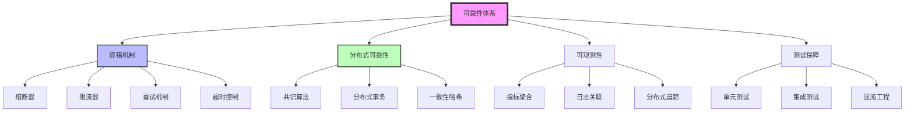
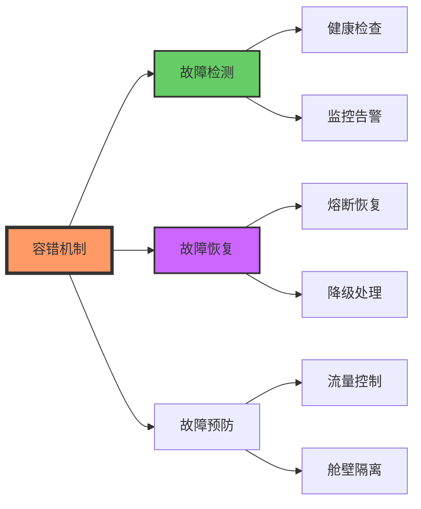
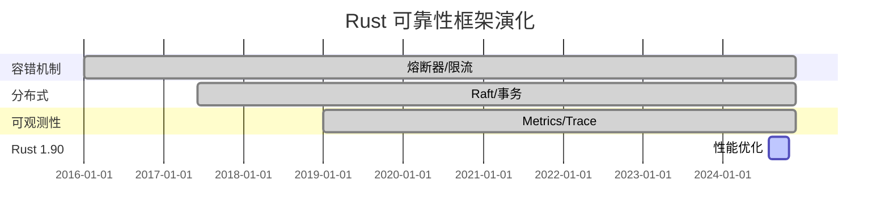

# C13 Reliability 知识图谱与概念关系（增强版）

> **文档定位**: Rust 1.90 可靠性与容错的完整知识体系  
> **创建日期**: 2025-10-20  
> **适用版本**: Rust 1.90+ | Edition 2024  
> **文档类型**: 理论知识图谱 + 概念关系 + 可视化

---

## 📊 目录

- [C13 Reliability 知识图谱与概念关系（增强版）](#c13-reliability-知识图谱与概念关系增强版)
  - [📊 目录](#-目录)
  - [1. 核心概念知识图谱](#1-核心概念知识图谱)
    - [可靠性体系总览](#可靠性体系总览)
    - [容错机制层次](#容错机制层次)
  - [2. 概念属性矩阵](#2-概念属性矩阵)
    - [容错策略对比](#容错策略对比)
    - [分布式可靠性对比](#分布式可靠性对比)
  - [3. 技术演化与学习路径](#3-技术演化与学习路径)
    - [Rust可靠性演化](#rust可靠性演化)
    - [学习路径](#学习路径)
  - [4. 总结与索引](#4-总结与索引)
    - [快速查找](#快速查找)

---

## 1. 核心概念知识图谱

### 可靠性体系总览

### 容错机制层次

---

## 2. 概念属性矩阵

### 容错策略对比

| 策略 | 复杂度 | 性能开销 | 适用场景 |
|------|--------|---------|---------|
| **熔断器** | ⭐⭐⭐ | 低 | 服务保护 |
| **限流器** | ⭐⭐ | 极低 | 流量控制 |
| **重试** | ⭐⭐ | 低 | 瞬时故障 |
| **超时** | ⭐ | 极低 | 响应控制 |
| **降级** | ⭐⭐⭐ | 中 | 服务可用 |

### 分布式可靠性对比

| 机制 | 一致性 | 性能 | 复杂度 | 适用 |
|------|--------|------|--------|------|
| **Raft** | 强 | ⭐⭐⭐⭐ | ⭐⭐⭐ | 共识 |
| **2PC** | 强 | ⭐⭐ | ⭐⭐ | 事务 |
| **Saga** | 最终 | ⭐⭐⭐⭐⭐ | ⭐⭐⭐ | 长事务 |
| **TCC** | 强 | ⭐⭐⭐ | ⭐⭐⭐⭐ | 补偿 |

---

## 3. 技术演化与学习路径

### Rust可靠性演化

### 学习路径

**初学者 (2-3周)**:

- Week 1: 容错基础（熔断器、限流器）
- Week 2: 重试、超时、降级
- Week 3: 健康检查、监控

**中级 (3-4周)**:

- Week 4: 分布式共识（Raft）
- Week 5: 分布式事务（Saga/2PC）
- Week 6: 可观测性（Metrics/Tracing）
- Week 7: 微服务架构

**高级 (持续)**:

- 混沌工程、高级容错
- 生产级可靠性保障
- 系统架构设计

---

## 4. 总结与索引

### 快速查找

**按问题查找**:

- 容错策略 → 2节对比
- 分布式可靠性 → 2节对比
- 可观测性 → 相关文档

**相关文档**:

- [多维矩阵对比](MULTI_DIMENSIONAL_COMPARISON_MATRIX.md)
- [README](../../README.md)
- [容错机制](../features/fault-tolerance.md)

---

**文档版本**: v1.0  
**最后更新**: 2025-10-20

---

*本知识图谱整合 C13 Reliability 完整知识体系！*
