# C13 Reliability 思维导图与可视化

> **文档定位**: Rust 1.90 可靠性技术可视化学习  
> **创建日期**: 2025-10-20  
> **适用版本**: Rust 1.90+ | Edition 2024  
> **文档类型**: 思维导图 + 流程图 + 架构图

---

## 📊 目录

- [C13 Reliability 思维导图与可视化](#c13-reliability-思维导图与可视化)
  - [📊 目录](#-目录)
  - [1. 可靠性全景思维导图](#1-可靠性全景思维导图)
    - [技术栈总览](#技术栈总览)
  - [2. 容错机制架构图](#2-容错机制架构图)
    - [熔断器状态机](#熔断器状态机)
    - [熔断器工作流程](#熔断器工作流程)
  - [3. 限流架构图](#3-限流架构图)
    - [令牌桶算法](#令牌桶算法)
    - [限流决策流程](#限流决策流程)
  - [4. 分布式事务架构](#4-分布式事务架构)
    - [Saga模式](#saga模式)
    - [2PC与3PC对比](#2pc与3pc对比)
  - [5. 可观测性架构](#5-可观测性架构)
    - [三大支柱](#三大支柱)
    - [监控告警流程](#监控告警流程)
  - [6. 测试金字塔](#6-测试金字塔)
    - [测试层次架构](#测试层次架构)
  - [7. 生产部署架构](#7-生产部署架构)
    - [高可用架构](#高可用架构)
  - [相关文档](#相关文档)
  - [返回导航](#返回导航)

---

## 1. 可靠性全景思维导图

### 技术栈总览

```mermaid
mindmap
  root((可靠性技术))
    容错机制
      熔断器
        状态机
          关闭
          打开
          半开
        自适应熔断
        快速失败
      限流器
        令牌桶
        漏桶
        固定窗口
        滑动窗口
      重试机制
        退避策略
          指数退避
          线性退避
        最大重试次数
        幂等性保证
      超时控制
        连接超时
        读写超时
        请求超时
        优雅降级
    分布式可靠性
      共识算法
        Raft
          Leader选举
          日志复制
        Paxos
          Basic Paxos
          Multi-Paxos
      分布式事务
        2PC
          准备阶段
          提交阶段
        3PC
          CanCommit
          PreCommit
          DoCommit
        Saga
          编排式
          编排式
        TCC
          Try
          Confirm
          Cancel
      一致性哈希
        虚拟节点
        数据迁移
        负载均衡
    可观测性
      日志
        结构化日志
        日志聚合
        全文搜索
      指标
        RED指标
          Rate
          Errors
          Duration
        USE指标
          Utilization
          Saturation
          Errors
        业务指标
      追踪
        分布式追踪
        Span关联
        性能分析
        依赖分析
    测试保障
      单元测试
        快速反馈
        高覆盖率
        Mock/Stub
      集成测试
        服务间测试
        数据库测试
        API测试
      混沌工程
        故障注入
        流量控制
        延迟注入
        资源限制
      性能测试
        压力测试
        负载测试
        容量规划
```

---

## 2. 容错机制架构图

### 熔断器状态机

```mermaid
stateDiagram-v2
    [*] --> Closed: 初始状态
    
    Closed --> Open: 错误率超阈值
    Open --> HalfOpen: 冷却时间到
    HalfOpen --> Closed: 探测成功
    HalfOpen --> Open: 探测失败
    
    note right of Closed
        状态: 关闭
        行为: 正常请求
        监控: 错误率
        阈值: 50% (可配置)
    end note
    
    note right of Open
        状态: 打开
        行为: 快速失败
        持续: 60s (可配置)
        返回: fallback响应
    end note
    
    note right of HalfOpen
        状态: 半开
        行为: 有限请求
        探测: 5次 (可配置)
        决策: 成功率>80%
    end note
```

### 熔断器工作流程

```mermaid
sequenceDiagram
    participant Client as 客户端
    participant CB as 熔断器
    participant Service as 服务
    participant Monitor as 监控
    
    Note over Client,Monitor: 正常状态 (Closed)
    Client->>CB: 请求1
    CB->>Service: 转发请求
    Service-->>CB: 成功响应
    CB-->>Client: 返回结果
    CB->>Monitor: 记录成功
    
    Note over Client,Monitor: 错误累积
    Client->>CB: 请求2
    CB->>Service: 转发请求
    Service--xCB: 失败
    CB-->>Client: 返回错误
    CB->>Monitor: 记录失败
    
    Client->>CB: 请求3
    CB->>Service: 转发请求
    Service--xCB: 失败
    CB->>Monitor: 错误率50%
    Monitor->>CB: 触发熔断
    
    Note over Client,Monitor: 熔断状态 (Open)
    CB->>CB: 状态 → Open
    Client->>CB: 请求4
    CB-->>Client: 快速失败 (fallback)
    
    Note over Client,Monitor: 冷却60s后
    CB->>CB: 状态 → HalfOpen
    
    Note over Client,Monitor: 探测恢复 (HalfOpen)
    Client->>CB: 请求5
    CB->>Service: 探测请求
    Service-->>CB: 成功
    CB-->>Client: 返回结果
    CB->>Monitor: 探测成功 1/5
    
    Note over CB: 5次探测成功
    CB->>CB: 状态 → Closed
```

---

## 3. 限流架构图

### 令牌桶算法

```mermaid
graph TB
    subgraph TokenBucket [令牌桶算法]
        Bucket[令牌桶<br/>容量: 100]
        Producer[令牌生产者<br/>速率: 10/s]
        
        Producer -->|定时添加| Bucket
        
        subgraph Requests [请求处理]
            R1[请求1<br/>需要: 1令牌]
            R2[请求2<br/>需要: 1令牌]
            R3[请求3<br/>需要: 1令牌]
            R4[请求N<br/>需要: 1令牌]
        end
        
        Bucket -->|获取令牌| R1
        Bucket -->|获取令牌| R2
        Bucket -->|获取令牌| R3
        Bucket -.->|令牌不足| R4
        
        R1 -->|通过| Success1[✅ 执行请求]
        R2 -->|通过| Success2[✅ 执行请求]
        R3 -->|通过| Success3[✅ 执行请求]
        R4 -->|拒绝| Reject[❌ 限流拒绝]
    end
    
    subgraph Metrics [监控指标]
        Rate[通过率: 90%]
        Rejected[拒绝数: 100/s]
        Tokens[可用令牌: 50]
    end
    
    Success1 -.->|上报| Rate
    Reject -.->|上报| Rejected
    Bucket -.->|监控| Tokens
    
    style Bucket fill:#fff3e0
    style Producer fill:#e8f5e9
    style Reject fill:#ffcdd2
    style Metrics fill:#e1f5ff
```

### 限流决策流程

```mermaid
flowchart TD
    Start[接收请求] --> Extract[提取标识]
    Extract --> GetLimiter{选择限流器}
    
    GetLimiter -->|全局限流| GlobalLimit[全局令牌桶]
    GetLimiter -->|用户限流| UserLimit[用户令牌桶]
    GetLimiter -->|IP限流| IPLimit[IP令牌桶]
    GetLimiter -->|API限流| APILimit[API令牌桶]
    
    GlobalLimit --> TryAcquire{尝试获取令牌}
    UserLimit --> TryAcquire
    IPLimit --> TryAcquire
    APILimit --> TryAcquire
    
    TryAcquire -->|成功| CheckQuota{检查配额}
    TryAcquire -->|失败| RateLimit[限流响应]
    
    CheckQuota -->|正常| Allow[允许请求]
    CheckQuota -->|超限| Throttle[降级服务]
    
    Allow --> Monitor[监控记录]
    Throttle --> Monitor
    RateLimit --> Alert[告警通知]
    
    Monitor --> Response[返回响应]
    Alert --> Response
    
    Response --> End[结束]
    
    style Start fill:#e3f2fd
    style Allow fill:#c8e6c9
    style RateLimit fill:#ffcdd2
    style Alert fill:#fff3e0
    style End fill:#e8f5e9
```

---

## 4. 分布式事务架构

### Saga模式

```mermaid
graph LR
    subgraph SagaOrchestrator [Saga编排器]
        Coordinator[协调器]
    end
    
    subgraph Step1 [步骤1: 订单服务]
        CreateOrder[创建订单]
        CancelOrder[取消订单<br/>补偿]
    end
    
    subgraph Step2 [步骤2: 支付服务]
        Payment[执行支付]
        Refund[退款<br/>补偿]
    end
    
    subgraph Step3 [步骤3: 库存服务]
        ReserveStock[预留库存]
        ReleaseStock[释放库存<br/>补偿]
    end
    
    subgraph Step4 [步骤4: 发货服务]
        Ship[发货]
        CancelShip[取消发货<br/>补偿]
    end
    
    Coordinator -->|1. 执行| CreateOrder
    CreateOrder -->|成功| Coordinator
    
    Coordinator -->|2. 执行| Payment
    Payment -->|成功| Coordinator
    
    Coordinator -->|3. 执行| ReserveStock
    ReserveStock -->|失败| Coordinator
    
    Coordinator -->|补偿| Refund
    Refund --> Coordinator
    Coordinator -->|补偿| CancelOrder
    
    style Coordinator fill:#e3f2fd
    style CreateOrder fill:#c8e6c9
    style Payment fill:#c8e6c9
    style ReserveStock fill:#ffcdd2
    style Refund fill:#fff3e0
    style CancelOrder fill:#fff3e0
```

### 2PC与3PC对比

---

## 5. 可观测性架构

### 三大支柱

```mermaid
graph TB
    subgraph Application [应用程序]
        Service1[服务A]
        Service2[服务B]
        Service3[服务C]
    end
    
    subgraph Logging [日志系统]
        LogAgent[日志代理]
        LogStore[日志存储<br/>Elasticsearch]
        LogUI[日志查询<br/>Kibana]
    end
    
    subgraph Metrics [指标系统]
        MetricAgent[指标采集<br/>Prometheus]
        MetricStore[时序数据库<br/>VictoriaMetrics]
        MetricUI[指标可视化<br/>Grafana]
    end
    
    subgraph Tracing [追踪系统]
        TraceAgent[追踪代理]
        TraceStore[追踪存储<br/>Jaeger]
        TraceUI[追踪查询<br/>Jaeger UI]
    end
    
    subgraph Alerting [告警系统]
        AlertManager[告警管理器]
        Notification[通知渠道]
    end
    
    Service1 -->|结构化日志| LogAgent
    Service2 -->|结构化日志| LogAgent
    Service3 -->|结构化日志| LogAgent
    
    Service1 -->|暴露指标| MetricAgent
    Service2 -->|暴露指标| MetricAgent
    Service3 -->|暴露指标| MetricAgent
    
    Service1 -->|Span| TraceAgent
    Service2 -->|Span| TraceAgent
    Service3 -->|Span| TraceAgent
    
    LogAgent --> LogStore
    LogStore --> LogUI
    
    MetricAgent --> MetricStore
    MetricStore --> MetricUI
    
    TraceAgent --> TraceStore
    TraceStore --> TraceUI
    
    MetricStore --> AlertManager
    AlertManager --> Notification
    
    style Application fill:#e3f2fd
    style Logging fill:#fff3e0
    style Metrics fill:#e8f5e9
    style Tracing fill:#f3e5f5
    style Alerting fill:#ffcdd2
```

### 监控告警流程

```mermaid
sequenceDiagram
    participant App as 应用
    participant Prom as Prometheus
    participant Alert as AlertManager
    participant OnCall as 值班人员
    
    Note over App,OnCall: 正常监控
    loop 每15s
        Prom->>App: 抓取指标
        App-->>Prom: /metrics数据
    end
    
    Note over App,OnCall: 异常检测
    Prom->>Prom: 评估告警规则
    Prom->>Prom: 错误率 > 5%
    
    Prom->>Alert: 触发告警<br/>severity: warning
    Alert->>Alert: 分组聚合<br/>等待30s
    
    Note over Prom: 错误率持续上升
    Prom->>Alert: 错误率 > 10%<br/>severity: critical
    
    Alert->>Alert: 路由规则匹配
    Alert->>Alert: 去重抑制
    
    par 多渠道通知
        Alert->>OnCall: 发送邮件
        Alert->>OnCall: 推送钉钉
        Alert->>OnCall: 短信告警
        Alert->>OnCall: 电话告警
    end
    
    OnCall->>Alert: 确认告警
    Alert->>Alert: 暂停通知
    
    Note over OnCall: 问题解决
    OnCall->>App: 修复问题
    
    Prom->>Prom: 错误率恢复
    Prom->>Alert: 恢复通知
    Alert->>OnCall: 告警解除
```

---

## 6. 测试金字塔

### 测试层次架构

```mermaid
graph TB
    subgraph Pyramid [测试金字塔]
        subgraph Manual [手动测试 5%]
            E2E[端到端测试]
            Exploratory[探索性测试]
        end
        
        subgraph UI [UI测试 10%]
            UIAuto[UI自动化]
            Visual[视觉回归]
        end
        
        subgraph Integration [集成测试 20%]
            API[API测试]
            Contract[契约测试]
            Component[组件测试]
        end
        
        subgraph Unit [单元测试 65%]
            UnitTest[单元测试]
            Mock[Mock测试]
            Property[属性测试]
        end
        
        subgraph Special [专项测试]
            Chaos[混沌工程]
            Perf[性能测试]
            Security[安全测试]
        end
    end
    
    Unit --> Integration
    Integration --> UI
    UI --> Manual
    
    Special -.->|横跨各层| Unit
    Special -.->|横跨各层| Integration
    
    style Manual fill:#ffcdd2
    style UI fill:#fff3e0
    style Integration fill:#c8e6c9
    style Unit fill:#e3f2fd
    style Special fill:#f3e5f5
```

---

## 7. 生产部署架构

### 高可用架构

```mermaid
graph TB
    subgraph Internet [互联网]
        Users[用户]
    end
    
    subgraph CDN [CDN层]
        CDNEdge[边缘节点]
    end
    
    subgraph Gateway [网关层]
        subgraph Region1 [区域1]
            LB1[负载均衡器]
            GW1[网关实例1]
            GW2[网关实例2]
        end
        
        subgraph Region2 [区域2 - 灾备]
            LB2[负载均衡器]
            GW3[网关实例3]
            GW4[网关实例4]
        end
    end
    
    subgraph Services [服务层]
        subgraph AZ1 [可用区1]
            Service1[服务A-1]
            Service2[服务B-1]
        end
        
        subgraph AZ2 [可用区2]
            Service3[服务A-2]
            Service4[服务B-2]
        end
        
        subgraph AZ3 [可用区3]
            Service5[服务A-3]
            Service6[服务B-3]
        end
    end
    
    subgraph Data [数据层]
        subgraph Primary [主库集群]
            DB1[主库]
            DB2[从库1]
            DB3[从库2]
        end
        
        subgraph Cache [缓存集群]
            Redis1[Redis主]
            Redis2[Redis从]
        end
        
        subgraph Backup [备份区域]
            DBBackup[异地备库]
        end
    end
    
    subgraph Monitor [监控层]
        Prometheus[Prometheus]
        Grafana[Grafana]
        AlertManager[AlertManager]
    end
    
    Users --> CDNEdge
    CDNEdge --> LB1
    CDNEdge -.->|故障切换| LB2
    
    LB1 --> GW1
    LB1 --> GW2
    LB2 --> GW3
    LB2 --> GW4
    
    GW1 --> Service1
    GW1 --> Service3
    GW1 --> Service5
    
    Service1 --> DB1
    Service3 --> DB2
    Service5 --> DB3
    
    Service1 --> Redis1
    Service3 --> Redis2
    
    DB1 -.->|主从复制| DB2
    DB1 -.->|主从复制| DB3
    DB1 -.->|异步复制| DBBackup
    
    Redis1 -.->|主从复制| Redis2
    
    Services -.->|指标| Prometheus
    Prometheus --> Grafana
    Prometheus --> AlertManager
    
    style Internet fill:#e3f2fd
    style CDN fill:#fff3e0
    style Gateway fill:#c8e6c9
    style Services fill:#e8f5e9
    style Data fill:#f3e5f5
    style Monitor fill:#ffcdd2
```

---

## 相关文档

- [知识图谱](./KNOWLEDGE_GRAPH_AND_CONCEPT_RELATIONS.md)
- [多维矩阵](./MULTI_DIMENSIONAL_COMPARISON_MATRIX.md)
- [FAQ](../FAQ.md)
- [架构指南](../architecture/)

---

**文档版本**: v1.0  
**最后更新**: 2025-10-20  
**维护者**: Rust-lang项目组

---

## 返回导航

- [返回主索引](../00_MASTER_INDEX.md)
- [返回README](../README.md)
- [查看指南](../guides/)
