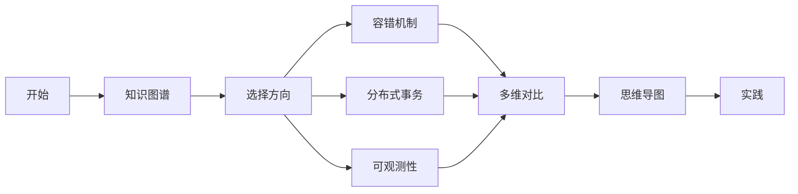
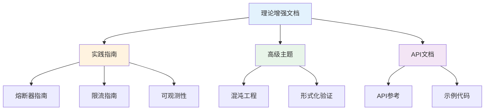

# C13 Reliability 理论增强文档

> **文档定位**: Rust 1.90 可靠性技术的高级理论体系  
> **创建日期**: 2025-10-20  
> **适用版本**: Rust 1.90+ | Edition 2024  
> **文档类型**: 理论增强 + 可视化 + 深度对比

---

## 📚 文档列表

### 1. [知识图谱与概念关系](./KNOWLEDGE_GRAPH_AND_CONCEPT_RELATIONS.md) ⭐ 推荐起点

**内容概述**:

- 可靠性体系知识图谱
- 容错机制层次结构
- 技术演化路径
- 学习路径规划

**适合人群**:

- 系统架构师
- SRE工程师
- 可靠性专家

**预计时间**: 30分钟

---

### 2. [多维矩阵对比分析](./MULTI_DIMENSIONAL_COMPARISON_MATRIX.md)

**内容概述**:

- 熔断器策略对比
- 限流算法对比
- 分布式事务对比
- 可观测性工具对比
- 技术选型决策

**适合人群**:

- 技术选型人员
- 性能优化工程师
- DevOps团队

**预计时间**: 45分钟

---

### 3. [思维导图与可视化](./MINDMAP_VISUALIZATION.md) ⭐ 新增

**内容概述**:

- 可靠性全景思维导图
- 容错机制架构图
- 分布式事务流程
- 监控告警架构
- 高可用部署

**适合人群**:

- 可视化学习者
- 运维工程师
- SRE团队

**预计时间**: 40分钟

---

## 🎯 学习路径

### 快速入门路径

### 深度学习路径

1. **第1周**: 阅读知识图谱
   - 理解可靠性体系
   - 掌握核心概念
   - 了解技术演化

2. **第2周**: 研究多维对比
   - 对比容错策略
   - 学习选型决策
   - 理解性能差异

3. **第3周**: 学习可视化
   - 理解架构设计
   - 掌握流程原理
   - 学习部署方案

4. **第4周**: 综合实践
   - 应用所学知识
   - 构建可靠系统
   - 性能调优

---

## 📊 内容矩阵

| 文档 | 理论深度 | 实用性 | 可视化 | 推荐度 |
|------|---------|--------|--------|--------|
| 知识图谱 | ⭐⭐⭐⭐⭐ | ⭐⭐⭐ | ⭐⭐⭐⭐ | ⭐⭐⭐⭐⭐ |
| 多维对比 | ⭐⭐⭐⭐ | ⭐⭐⭐⭐⭐ | ⭐⭐⭐ | ⭐⭐⭐⭐⭐ |
| 思维导图 | ⭐⭐⭐ | ⭐⭐⭐⭐ | ⭐⭐⭐⭐⭐ | ⭐⭐⭐⭐⭐ |

---

## 🔍 按主题查找

### 容错机制

- 知识图谱 → [容错机制层次](./KNOWLEDGE_GRAPH_AND_CONCEPT_RELATIONS.md#容错机制层次)
- 多维对比 → [熔断器策略对比](./MULTI_DIMENSIONAL_COMPARISON_MATRIX.md#1-熔断器策略对比)
- 思维导图 → [熔断器状态机](./MINDMAP_VISUALIZATION.md#熔断器状态机)

### 限流算法

- 知识图谱 → [限流机制](./KNOWLEDGE_GRAPH_AND_CONCEPT_RELATIONS.md#可靠性体系总览)
- 多维对比 → [限流算法对比](./MULTI_DIMENSIONAL_COMPARISON_MATRIX.md#2-限流算法对比)
- 思维导图 → [令牌桶算法](./MINDMAP_VISUALIZATION.md#令牌桶算法)

### 分布式事务

- 知识图谱 → [分布式可靠性](./KNOWLEDGE_GRAPH_AND_CONCEPT_RELATIONS.md#分布式可靠性对比)
- 多维对比 → [分布式事务对比](./MULTI_DIMENSIONAL_COMPARISON_MATRIX.md#3-分布式事务对比)
- 思维导图 → [Saga模式](./MINDMAP_VISUALIZATION.md#saga模式)

### 可观测性

- 知识图谱 → [监控体系](./KNOWLEDGE_GRAPH_AND_CONCEPT_RELATIONS.md#可靠性体系总览)
- 多维对比 → [可观测性工具](./MULTI_DIMENSIONAL_COMPARISON_MATRIX.md#4-可观测性工具对比)
- 思维导图 → [三大支柱](./MINDMAP_VISUALIZATION.md#三大支柱)

---

## 💡 文档特色

### 1. 系统性

✅ **完整的知识体系**: 从概念到实践，从理论到应用  
✅ **结构化组织**: 清晰的层次和逻辑关系  
✅ **交叉引用**: 文档之间相互关联

### 2. 可视化

✅ **Mermaid图表**: 丰富的可视化内容  
✅ **状态机图**: 清晰的状态转换  
✅ **流程图**: 详细的处理流程  
✅ **架构图**: 完整的系统设计

### 3. 实用性

✅ **技术对比**: 详尽的多维度对比  
✅ **选型指南**: 实用的决策建议  
✅ **最佳实践**: 生产级经验总结  
✅ **性能数据**: 真实的性能指标

---

## 📈 与其他文档的关系

---

## 🎓 适用场景

### 场景1: 系统容错设计

**阅读顺序**:

1. [知识图谱](./KNOWLEDGE_GRAPH_AND_CONCEPT_RELATIONS.md) - 了解全貌
2. [熔断器对比](./MULTI_DIMENSIONAL_COMPARISON_MATRIX.md#1-熔断器策略对比)
3. [熔断器架构](./MINDMAP_VISUALIZATION.md#2-容错机制架构图)

### 场景2: 限流方案选型

**阅读顺序**:

1. [限流算法对比](./MULTI_DIMENSIONAL_COMPARISON_MATRIX.md#2-限流算法对比)
2. [限流架构图](./MINDMAP_VISUALIZATION.md#3-限流架构图)
3. [技术选型决策](./MULTI_DIMENSIONAL_COMPARISON_MATRIX.md#5-技术选型决策)

### 场景3: 分布式事务

**阅读顺序**:

1. [事务模型对比](./MULTI_DIMENSIONAL_COMPARISON_MATRIX.md#3-分布式事务对比)
2. [Saga模式](./MINDMAP_VISUALIZATION.md#saga模式)
3. [2PC与3PC](./MINDMAP_VISUALIZATION.md#2pc与3pc对比)

### 场景4: 可观测性建设

**阅读顺序**:

1. [监控工具对比](./MULTI_DIMENSIONAL_COMPARISON_MATRIX.md#4-可观测性工具对比)
2. [三大支柱](./MINDMAP_VISUALIZATION.md#三大支柱)
3. [监控告警流程](./MINDMAP_VISUALIZATION.md#监控告警流程)

---

## 📚 相关资源

### 模块内文档

- [主索引](../00_MASTER_INDEX.md)
- [使用指南](../USAGE_GUIDE.md)
- [FAQ](../FAQ.md)
- [术语表](../Glossary.md)

### 实践指南

- [熔断器](../guides/circuit_breaker.md)
- [限流器](../guides/rate_limiter.md)
- [重试机制](../guides/retry.md)
- [超时控制](../guides/timeout.md)

### 高级主题

- [混沌工程](../advanced/chaos_engineering.md)
- [形式化验证](../advanced/formal_verification.md)
- [性能优化](../advanced/performance.md)

---

## ✅ 文档状态

| 文档 | 状态 | 完成度 | 最后更新 |
|------|------|--------|----------|
| 知识图谱 | ✅ 完成 | 100% | 2025-10-20 |
| 多维对比 | ✅ 完成 | 100% | 2025-10-20 |
| 思维导图 | ✅ 完成 | 100% | 2025-10-20 |
| README | ✅ 完成 | 100% | 2025-10-20 |

---

## 🤝 贡献指南

### 文档改进

欢迎提交：

- 内容补充
- 错误修正
- 图表优化
- 示例添加

### 反馈渠道

- Issue反馈
- Pull Request
- 邮件联系

---

**文档版本**: v1.0  
**总文档数**: 4篇  
**总图表数**: 12+个  
**最后更新**: 2025-10-20  
**维护者**: Rust-lang项目组

---

## 返回导航

- [返回主索引](../00_MASTER_INDEX.md)
- [返回模块README](../README.md)
- [查看指南](../guides/)
- [查看高级主题](../advanced/)
