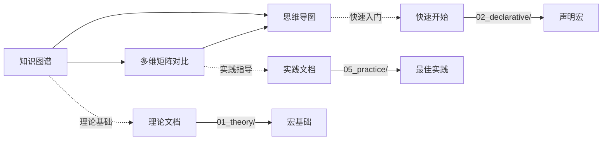

# C14 宏系统理论增强文档 - 索引

> **文档定位**: 理论分析与可视化学习资源导航  
> **创建日期**: 2025-10-20  
> **适用版本**: Rust 1.90+ | Edition 2024

---

## 📚 文档概述

本目录包含C14宏系统的深度理论分析、知识图谱、多维矩阵对比和可视化思维导图，旨在帮助学习者从宏观和系统化的角度理解Rust宏系统。

---

## 📖 文档列表

### 1. [知识图谱与概念关系](KNOWLEDGE_GRAPH_AND_CONCEPT_RELATIONS.md) ⭐ 推荐

**内容概要**:

- 🗺️ 完整的宏系统知识图谱
- 🔗 概念依赖与关系矩阵
- 📊 技术演化时间线
- 🎯 学习路径可视化

**适合人群**:

- 希望系统理解宏体系的学习者
- 需要快速定位知识点的开发者
- 进行技术选型的架构师

**关键章节**:

1. 核心概念知识图谱（3个Mermaid图）
2. 概念关系矩阵（3个对比表）
3. 技术演化与学习路径
4. 概念依赖关系（2个依赖图）
5. 应用场景映射（思维导图）

**统计数据**:

- 📄 文档行数: ~800行
- 🎨 可视化图表: 8个
- 📊 对比矩阵: 3个
- 🗺️ 思维导图: 1个

---

### 2. [多维矩阵对比分析](MULTI_DIMENSIONAL_COMPARISON_MATRIX.md)

**内容概要**:

- 📊 宏类型全维度对比（3个矩阵）
- 🔍 片段说明符详细对比（13种）
- ⚙️ 工具生态系统对比
- 📈 性能基准测试对比
- 🌳 技术选型决策树

**适合人群**:

- 需要进行技术选型的决策者
- 关注性能优化的开发者
- 比较不同方案的架构师

**关键章节**:

1. 宏类型全维度对比（3个表格）
2. 片段说明符详细对比（2个矩阵）
3. 宏模式对比（复杂度分析）
4. 工具生态对比（6个库对比）
5. 真实案例对比（7个生产案例）
6. 技术选型决策树（流程图）
7. 黄金法则与最佳实践

**统计数据**:

- 📄 文档行数: ~650行
- 📊 对比表格: 15+个
- 🎯 决策流程图: 1个
- ⭐ 黄金法则: 5条

---

### 3. [思维导图与可视化](MINDMAP_AND_VISUALIZATION.md)

**内容概要**:

- 🧠 核心概念思维导图（3个）
- 🎯 学习路径可视化（技能树）
- 🔄 工作流程图（2个流程）
- 🏗️ 架构可视化（C4模型）
- 🗺️ 应用场景地图
- 🛠️ 工具生态图
- 📈 性能优化地图
- 🐛 错误诊断流程

**适合人群**:

- 视觉学习者
- 希望快速掌握全局的初学者
- 需要教学材料的讲师

**关键章节**:

1. 核心概念思维导图（3个mindmap）
2. 学习路径可视化（技能树+学习旅程）
3. 工作流程图（2个flowchart）
4. 架构可视化（C4Context）
5. 应用场景地图（mindmap）
6. 工具生态图（mindmap）
7. 性能优化地图（mindmap）
8. 错误诊断流程（决策树）

**统计数据**:

- 📄 文档行数: ~600行
- 🎨 可视化图表: 14个
- 🧠 思维导图: 6个
- 🔄 流程图: 4个

---

## 🎯 使用指南

### 按学习阶段选择

**初学者** (刚接触宏系统):

1. 从 [思维导图](MINDMAP_AND_VISUALIZATION.md) 开始
   - 查看"宏系统全景图"获得整体认知
   - 了解"学习路径可视化"规划学习
2. 阅读 [知识图谱](KNOWLEDGE_GRAPH_AND_CONCEPT_RELATIONS.md)
   - 理解核心概念及其关系
   - 查看技术演化了解背景

**进阶者** (已有基础知识):

1. 深入 [知识图谱](KNOWLEDGE_GRAPH_AND_CONCEPT_RELATIONS.md)
   - 研究概念依赖关系
   - 掌握应用场景映射
2. 参考 [多维矩阵对比](MULTI_DIMENSIONAL_COMPARISON_MATRIX.md)
   - 对比不同宏类型的优劣
   - 了解片段说明符的使用场景

**专家** (进行技术选型):

1. 重点查看 [多维矩阵对比](MULTI_DIMENSIONAL_COMPARISON_MATRIX.md)
   - 技术选型决策树
   - 性能基准对比
   - 真实案例分析
2. 结合 [思维导图](MINDMAP_AND_VISUALIZATION.md)
   - 技术栈映射
   - 性能优化地图

### 按需求选择

| 需求 | 推荐文档 | 关键章节 |
|------|---------|---------|
| **快速了解全局** | 思维导图 | 宏系统全景图 |
| **系统学习路径** | 知识图谱 | 学习路径图 |
| **技术选型** | 多维矩阵对比 | 决策树、对比矩阵 |
| **性能优化** | 思维导图 | 性能优化地图 |
| **调试问题** | 思维导图 | 错误诊断流程 |
| **工具选择** | 多维矩阵对比 | 工具生态对比 |
| **架构设计** | 思维导图 | 架构可视化 |

---

## 📊 内容矩阵

| 文档 | 可视化图表 | 对比表格 | 思维导图 | 流程图 | 难度 |
|------|-----------|---------|---------|--------|------|
| 知识图谱 | 8个 | 3个 | 1个 | - | ⭐⭐⭐ |
| 多维矩阵 | 1个 | 15+个 | - | 1个 | ⭐⭐⭐⭐ |
| 思维导图 | 14个 | - | 6个 | 4个 | ⭐⭐ |

---

## 🔗 文档关联

---

## 🎓 学习建议

### 第一次阅读

1. **浏览思维导图** (30分钟)
   - 宏系统全景图
   - 学习路径可视化

2. **查看知识图谱** (1小时)
   - 核心概念知识图谱
   - 概念关系矩阵

3. **略读多维矩阵** (30分钟)
   - 宏类型对比
   - 选型决策树

### 深入学习

1. **精读知识图谱** (2-3小时)
   - 所有可视化图表
   - 概念依赖关系
   - 应用场景映射

2. **详细对比** (2-3小时)
   - 所有对比矩阵
   - 性能基准分析
   - 工具生态对比

3. **实践验证** (持续)
   - 结合代码示例
   - 动手实践
   - 总结经验

---

## ✅ 质量保证

### 文档特点

- ✅ **可视化丰富**: 28+个图表和图形
- ✅ **系统化组织**: 清晰的层次结构
- ✅ **实用性强**: 面向实际应用场景
- ✅ **更新及时**: 基于Rust 1.90最新特性

### 文档状态

| 文档 | 完成度 | 最后更新 | 维护状态 |
|------|--------|---------|---------|
| 知识图谱 | 100% | 2025-10-20 | ✅ 活跃 |
| 多维矩阵对比 | 100% | 2025-10-20 | ✅ 活跃 |
| 思维导图 | 100% | 2025-10-20 | ✅ 活跃 |

---

## 📚 相关资源

### 理论文档

- [宏基础理论](../01_theory/01_macro_fundamentals.md)
- [宏卫生与作用域](../01_theory/02_hygiene_and_scope.md)
- [展开机制](../01_theory/03_expansion_mechanism.md)
- [宏理论](../01_theory/04_macro_theory.md)

### 实践文档

- [声明宏基础](../02_declarative/01_macro_rules_basics.md)
- [过程宏开发](../03_procedural/)
- [最佳实践](../05_practice/02_best_practices.md)

### 特性文档

- [Rust 1.90特性](../06_rust_190_features/README.md)
- [主索引](../00_MASTER_INDEX.md)

---

## 🎯 快速链接

**入门必读**:

- 📖 [宏系统全景图](MINDMAP_AND_VISUALIZATION.md#宏系统全景图)
- 📖 [学习路径图](KNOWLEDGE_GRAPH_AND_CONCEPT_RELATIONS.md#学习路径图)

**深度学习**:

- 📖 [核心概念知识图谱](KNOWLEDGE_GRAPH_AND_CONCEPT_RELATIONS.md#1-核心概念知识图谱)
- 📖 [宏类型全维度对比](MULTI_DIMENSIONAL_COMPARISON_MATRIX.md#1-宏类型全维度对比)

**实用参考**:

- 📖 [技术选型决策树](MULTI_DIMENSIONAL_COMPARISON_MATRIX.md#6-技术选型决策树)
- 📖 [错误诊断流程](MINDMAP_AND_VISUALIZATION.md#8-错误诊断流程)

---

**文档版本**: v1.0  
**创建日期**: 2025-10-20  
**文档总数**: 4篇（含本索引）  
**总行数**: 2000+行  
**可视化图表**: 28+个

**返回导航**:

- [返回主索引](../00_MASTER_INDEX.md)
- [C14模块README](../../README.md)
