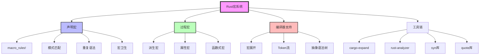
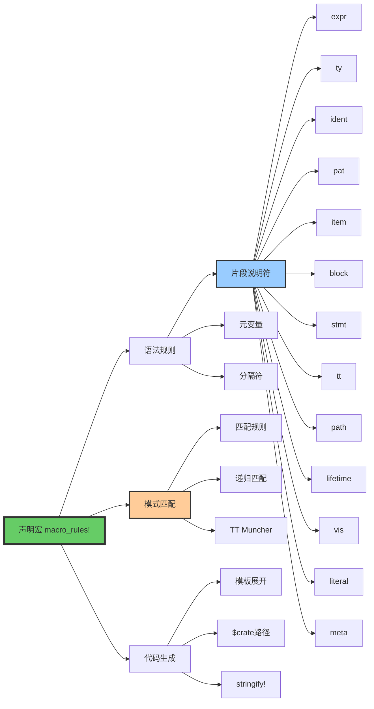
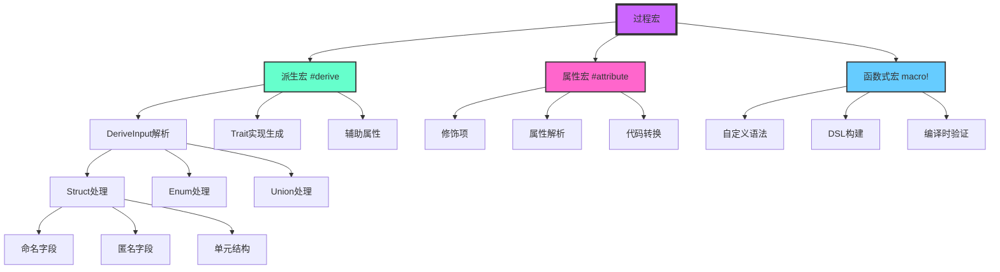
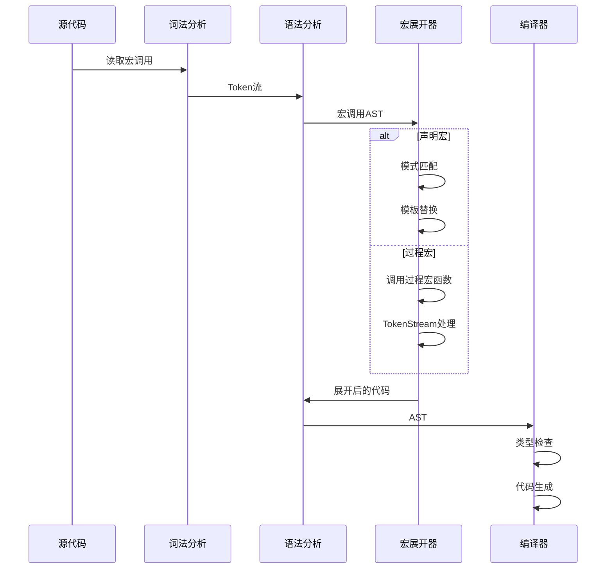
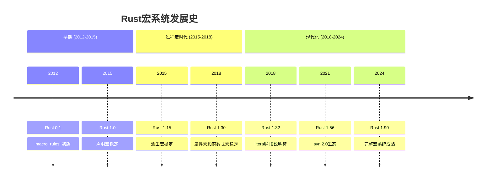
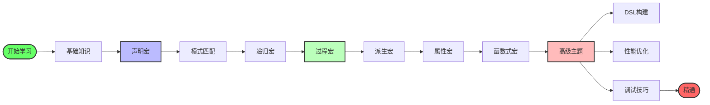
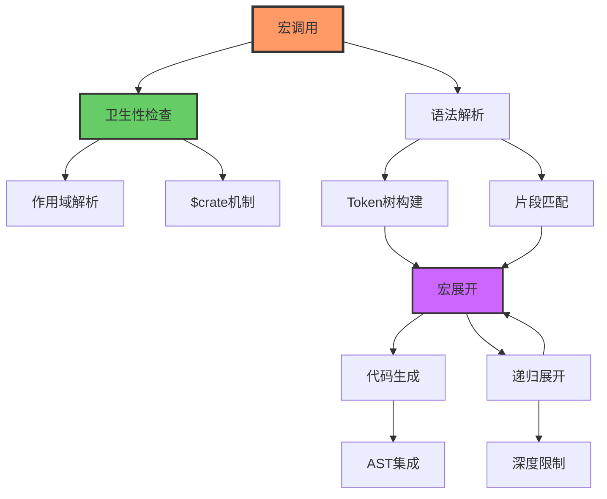
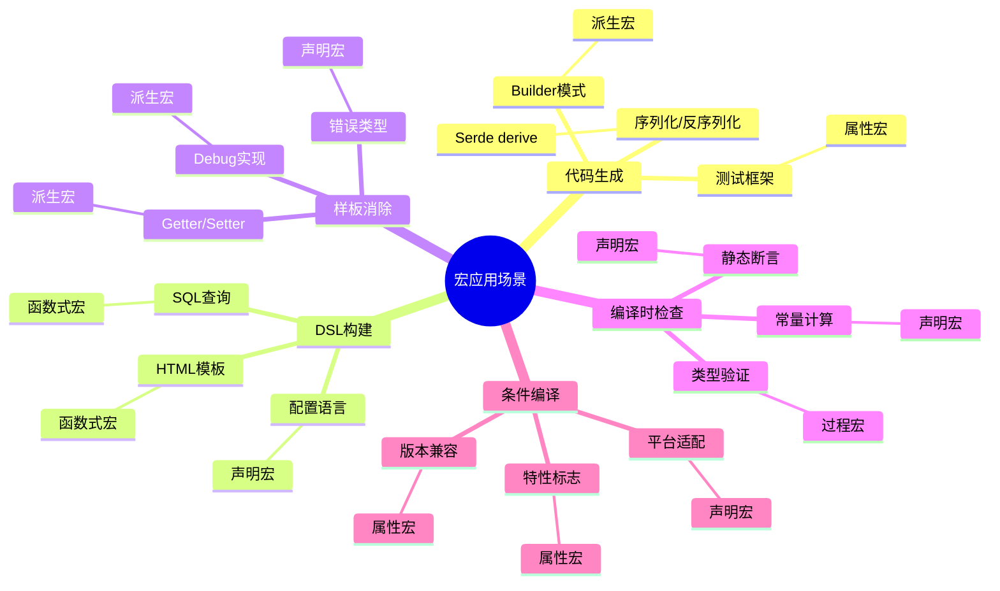

# C14 宏系统知识图谱与概念关系

> **文档定位**: Rust 1.90 宏系统的完整知识体系  
> **创建日期**: 2025-10-20  
> **适用版本**: Rust 1.90+ | Edition 2024  
> **文档类型**: 理论知识图谱 + 概念关系 + 可视化

---

## 📊 目录

- [C14 宏系统知识图谱与概念关系](#c14-宏系统知识图谱与概念关系)
  - [📊 目录](#-目录)
  - [1. 核心概念知识图谱](#1-核心概念知识图谱)
    - [宏系统总览](#宏系统总览)
    - [声明宏体系](#声明宏体系)
    - [过程宏体系](#过程宏体系)
    - [编译时处理流程](#编译时处理流程)
  - [2. 概念关系矩阵](#2-概念关系矩阵)
    - [宏类型对比](#宏类型对比)
    - [片段说明符对比](#片段说明符对比)
    - [Token处理对比](#token处理对比)
  - [3. 技术演化与学习路径](#3-技术演化与学习路径)
    - [Rust宏系统演化](#rust宏系统演化)
    - [学习路径图](#学习路径图)
  - [4. 概念依赖关系](#4-概念依赖关系)
    - [宏展开依赖](#宏展开依赖)
    - [过程宏工具链](#过程宏工具链)
  - [5. 应用场景映射](#5-应用场景映射)
    - [场景-技术映射](#场景-技术映射)
  - [6. 总结与索引](#6-总结与索引)
    - [快速查找](#快速查找)
    - [相关文档](#相关文档)

---

## 1. 核心概念知识图谱

### 宏系统总览

### 声明宏体系

### 过程宏体系

### 编译时处理流程

---

## 2. 概念关系矩阵

### 宏类型对比

| 特性 | 声明宏 | 派生宏 | 属性宏 | 函数式宏 |
|------|--------|--------|--------|----------|
| **定义方式** | `macro_rules!` | `#[proc_macro_derive]` | `#[proc_macro_attribute]` | `#[proc_macro]` |
| **输入形式** | Token树 | 结构体/枚举 | 装饰项+参数 | 任意Token流 |
| **输出形式** | Token树 | Trait实现 | 修改后的项 | 任意代码 |
| **作用位置** | 任意表达式 | 类型定义 | 项声明 | 宏调用位置 |
| **复杂度** | ⭐⭐ | ⭐⭐⭐ | ⭐⭐⭐⭐ | ⭐⭐⭐⭐⭐ |
| **性能开销** | 低 | 中 | 中 | 高 |
| **调试难度** | ⭐⭐ | ⭐⭐⭐ | ⭐⭐⭐⭐ | ⭐⭐⭐⭐⭐ |
| **卫生性** | ✅ | ⚠️ | ⚠️ | ⚠️ |
| **Rust版本** | 1.0+ | 1.15+ | 1.30+ | 1.30+ |

### 片段说明符对比

| 说明符 | 匹配内容 | 用途 | 示例 | 版本 |
|--------|---------|------|------|------|
| `item` | 项声明 | 函数、结构体等 | `fn foo() {}` | 1.0+ |
| `block` | 代码块 | `{ }` 内的语句序列 | `{ x + 1 }` | 1.0+ |
| `stmt` | 语句 | 单条语句 | `let x = 5;` | 1.0+ |
| `expr` | 表达式 | 任意表达式 | `x + 1` | 1.0+ |
| `pat` | 模式 | 模式匹配 | `Some(x)` | 1.0+ |
| `ty` | 类型 | 类型注解 | `Vec<i32>` | 1.0+ |
| `ident` | 标识符 | 变量名、函数名 | `my_var` | 1.0+ |
| `path` | 路径 | 模块路径 | `std::vec::Vec` | 1.0+ |
| `tt` | Token树 | 单个Token或组 | `(x, y)` | 1.0+ |
| `meta` | 元信息 | 属性内容 | `derive(Debug)` | 1.0+ |
| `lifetime` | 生命周期 | 生命周期参数 | `'a` | 1.0+ |
| `vis` | 可见性 | 访问修饰符 | `pub`, `pub(crate)` | 1.30+ |
| `literal` | 字面量 | 字面值 | `42`, `"hello"` | 1.32+ |

**使用频率**:

- ⭐⭐⭐⭐⭐ 高频: `expr`, `ident`, `ty`, `tt`
- ⭐⭐⭐⭐ 常用: `item`, `block`, `pat`
- ⭐⭐⭐ 中等: `stmt`, `path`, `vis`
- ⭐⭐ 低频: `meta`, `lifetime`, `literal`

### Token处理对比

| 操作 | proc_macro | proc_macro2 | syn | quote |
|------|-----------|------------|-----|-------|
| **创建Token流** | ✅ | ✅ | ❌ | ✅ |
| **解析Token流** | 基础 | 基础 | ✅ 强大 | ❌ |
| **生成代码** | 手动 | 手动 | ❌ | ✅ 方便 |
| **测试支持** | ❌ | ✅ | ✅ | ✅ |
| **Span处理** | ✅ | ✅ | ✅ | ✅ |
| **错误报告** | 基础 | 基础 | ✅ 详细 | ❌ |
| **类型安全** | 低 | 低 | ✅ 高 | 中 |

---

## 3. 技术演化与学习路径

### Rust宏系统演化

### 学习路径图

**学习时间估算**:

- 🌱 **基础** (1-2周): 宏概念、macro_rules!基础
- 🚀 **进阶** (2-3周): 过程宏三种类型、syn/quote
- 🎯 **高级** (3-4周): DSL、性能优化、复杂应用
- ⭐ **精通** (持续): 实战项目、开源贡献

---

## 4. 概念依赖关系

### 宏展开依赖

### 过程宏工具链

---

## 5. 应用场景映射

### 场景-技术映射

**场景推荐表**:

| 场景 | 推荐宏类型 | 复杂度 | 示例 |
|------|----------|--------|------|
| **简单代码复用** | 声明宏 | ⭐ | `vec!`, `println!` |
| **Trait自动实现** | 派生宏 | ⭐⭐⭐ | `#[derive(Debug)]` |
| **函数增强** | 属性宏 | ⭐⭐⭐⭐ | `#[test]`, `#[tokio::main]` |
| **DSL语法** | 函数式宏 | ⭐⭐⭐⭐⭐ | `html!`, `sql!` |
| **Builder模式** | 派生宏 | ⭐⭐⭐ | `#[derive(Builder)]` |
| **日志装饰** | 属性宏 | ⭐⭐⭐ | `#[instrument]` |
| **配置DSL** | 声明宏 | ⭐⭐ | `config!` |
| **编译时SQL** | 函数式宏 | ⭐⭐⭐⭐⭐ | `query!` |

---

## 6. 总结与索引

### 快速查找

**按特性查找**:

- 🔍 **基础语法** → [声明宏体系](#声明宏体系)
- 🔍 **高级功能** → [过程宏体系](#过程宏体系)
- 🔍 **对比分析** → [概念关系矩阵](#2-概念关系矩阵)
- 🔍 **学习路径** → [学习路径图](#学习路径图)

**按难度查找**:

- ⭐ **入门** → 声明宏基础、片段说明符
- ⭐⭐⭐ **中级** → 派生宏、属性宏
- ⭐⭐⭐⭐⭐ **高级** → 函数式宏、DSL构建

**按应用查找**:

- 📝 **代码生成** → 派生宏、Builder模式
- 🎨 **DSL** → 函数式宏、自定义语法
- 🔧 **工具** → syn/quote生态、cargo-expand
- 📊 **性能** → 编译时优化、Token处理

### 相关文档

**理论文档**:

- [宏基础理论](../01_theory/01_macro_fundamentals.md)
- [宏卫生与作用域](../01_theory/02_hygiene_and_scope.md)
- [展开机制](../01_theory/03_expansion_mechanism.md)
- [宏理论](../01_theory/04_macro_theory.md)

**实践文档**:

- [声明宏基础](../02_declarative/01_macro_rules_basics.md)
- [派生宏](../03_procedural/02_derive_macros.md)
- [属性宏](../03_procedural/03_attribute_macros.md)
- [函数式宏](../03_procedural/04_function_macros.md)

**高级主题**:

- [DSL构建](../04_advanced/01_dsl_construction.md)
- [代码生成](../04_advanced/02_code_generation.md)
- [性能考量](../04_advanced/04_performance_considerations.md)

**最佳实践**:

- [常用模式](../05_practice/01_common_patterns.md)
- [最佳实践](../05_practice/02_best_practices.md)
- [反模式](../05_practice/03_anti_patterns.md)
- [真实案例](../05_practice/04_real_world_examples.md)

**Rust 1.90特性**:

- [特性总览](../06_rust_190_features/README.md)
- [完整特性清单](../06_rust_190_features/COMPREHENSIVE_FEATURES.md)
- [示例集合](../06_rust_190_features/EXAMPLES.md)

---

**文档版本**: v1.0  
**创建日期**: 2025-10-20  
**维护状态**: ✅ 活跃

**返回导航**:

- [返回主索引](../00_MASTER_INDEX.md)
- [C14模块README](../../README.md)
- [多维矩阵对比](MULTI_DIMENSIONAL_COMPARISON_MATRIX.md)
