# C14 宏系统思维导图与可视化

> **文档定位**: Rust 1.90 宏系统的可视化学习地图  
> **创建日期**: 2025-10-20  
> **适用版本**: Rust 1.90+ | Edition 2024  
> **文档类型**: 思维导图 + 流程图 + 可视化工具

---

## 📊 目录

- [C14 宏系统思维导图与可视化](#c14-宏系统思维导图与可视化)
  - [📊 目录](#-目录)
  - [1. 核心概念思维导图](#1-核心概念思维导图)
    - [宏系统全景图](#宏系统全景图)
    - [声明宏思维导图](#声明宏思维导图)
    - [过程宏思维导图](#过程宏思维导图)
  - [2. 学习路径可视化](#2-学习路径可视化)
    - [技能树](#技能树)
    - [学习阶段](#学习阶段)
  - [3. 工作流程图](#3-工作流程图)
    - [宏展开流程](#宏展开流程)
    - [过程宏开发流程](#过程宏开发流程)
  - [4. 架构可视化](#4-架构可视化)
    - [宏系统架构](#宏系统架构)
    - [编译器集成](#编译器集成)
  - [5. 应用场景地图](#5-应用场景地图)
    - [场景分类](#场景分类)
    - [技术栈映射](#技术栈映射)
  - [6. 工具生态图](#6-工具生态图)
    - [开发工具链](#开发工具链)
  - [7. 性能优化地图](#7-性能优化地图)
    - [优化策略](#优化策略)
  - [8. 错误诊断流程](#8-错误诊断流程)
    - [调试决策树](#调试决策树)
  - [9. 相关资源](#9-相关资源)

---

## 1. 核心概念思维导图

### 宏系统全景图

```mermaid
mindmap
  root((Rust宏系统))
    声明宏
      macro_rules!
        基础语法
          片段说明符
          模式匹配
          重复语法
        高级特性
          递归宏
          TT Muncher
          内部规则
        应用
          vec!
          println!
          自定义宏
      宏卫生
        作用域隔离
        $crate路径
        变量捕获
    过程宏
      派生宏
        #[derive(...)]
        DeriveInput
        Trait实现
      属性宏
        #[attribute]
        项装饰
        代码转换
      函数式宏
        macro!(...)
        自定义语法
        DSL构建
    编译器支持
      TokenStream
        Token
        TokenTree
        Span
      AST
        syn解析
        语法树
        类型信息
      展开机制
        早期展开
        递归展开
        卫生性检查
    工具生态
      开发工具
        cargo-expand
        rust-analyzer
        trybuild
      库支持
        syn
        quote
        proc-macro2
      调试工具
        trace_macros
        log_syntax
        eprintln
```

### 声明宏思维导图

```mermaid
mindmap
  root((macro_rules!))
    语法结构
      匹配规则
        模式 => 展开
        多分支
        优先级
      片段说明符
        expr 表达式
        ty 类型
        ident 标识符
        pat 模式
        item 项
        block 块
        stmt 语句
        tt Token树
        path 路径
        lifetime 生命周期
        vis 可见性
        literal 字面量
        meta 元信息
      重复语法
        $(...)* 零或多次
        $(...)+ 一或多次
        $(...),* 带分隔符
        嵌套重复
    高级模式
      TT Muncher
        逐个处理Token
        状态机模式
        递归消费
      Push-down Accumulation
        累积结果
        逆序构建
        尾递归
      Internal Rules
        @前缀规则
        辅助逻辑
        模块化
      Callback
        宏回调宏
        高阶宏
        延迟展开
    卫生性
      作用域
        局部变量隔离
        宏内部作用域
        透明性
      $crate
        绝对路径
        跨crate调用
        避免歧义
      局限性
        标识符捕获
        路径解析
        生命周期
    实际应用
      标准库
        vec!
        println!
        format!
        assert!
      第三方
        lazy_static!
        matches!
        cfg_if!
      自定义
        Builder DSL
        测试宏
        日志宏
```

### 过程宏思维导图

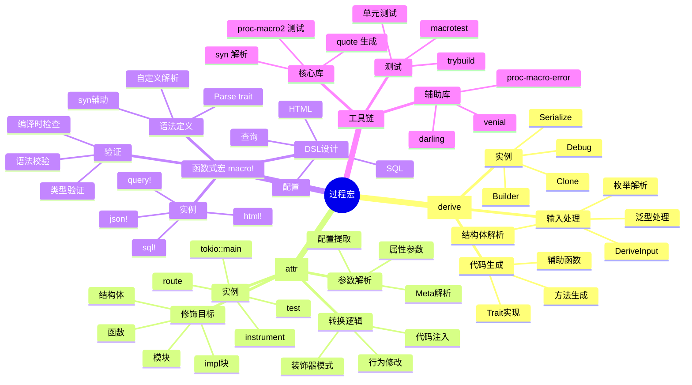

---

## 2. 学习路径可视化

### 技能树

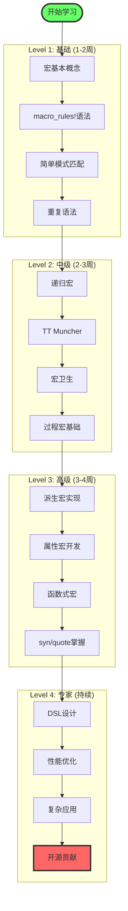

### 学习阶段

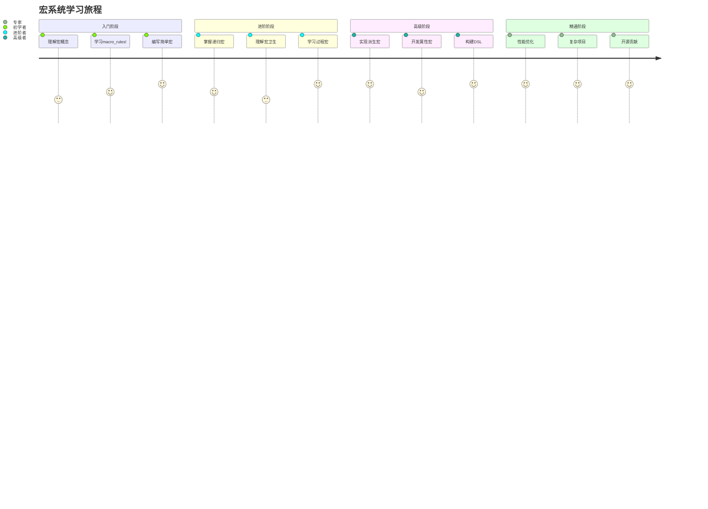

---

## 3. 工作流程图

### 宏展开流程

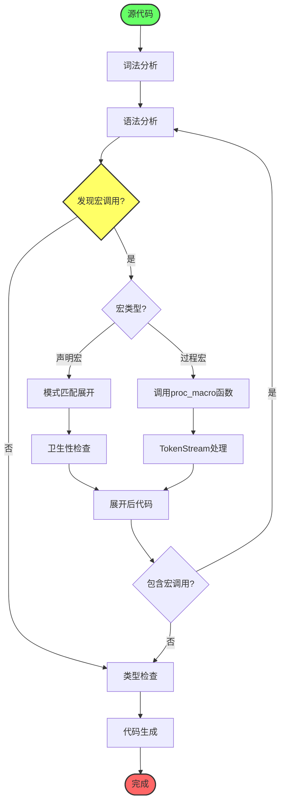

### 过程宏开发流程

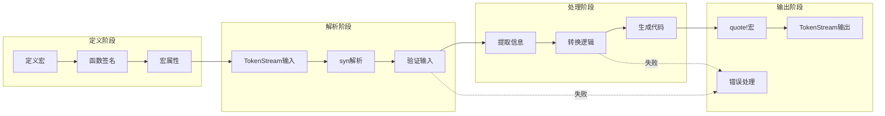

---

## 4. 架构可视化

### 宏系统架构

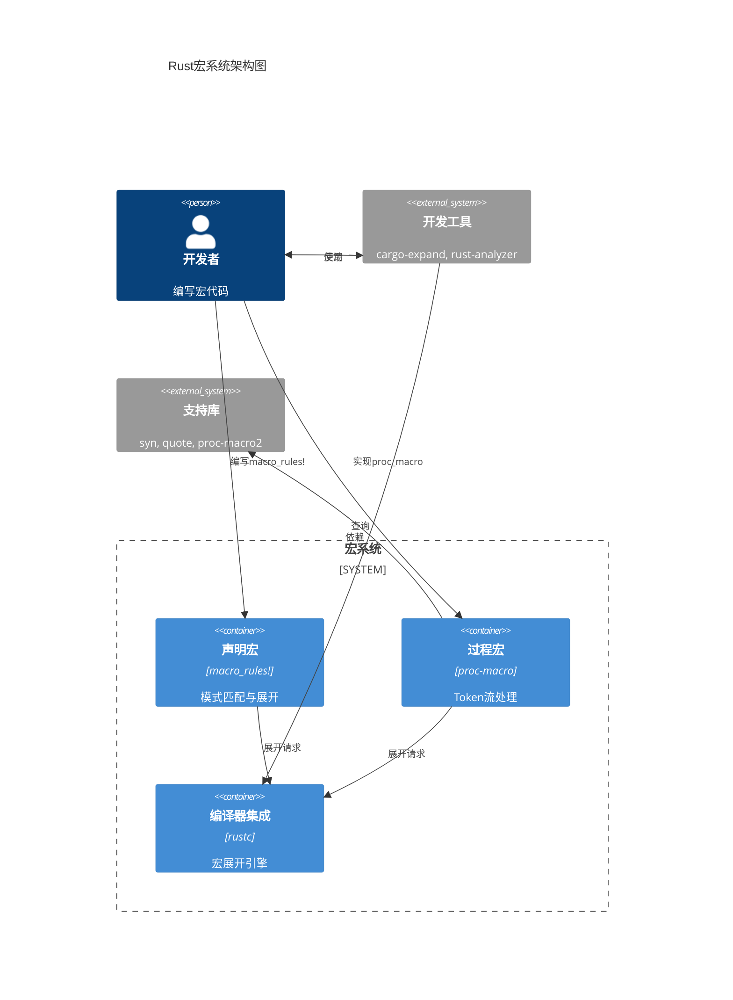

### 编译器集成

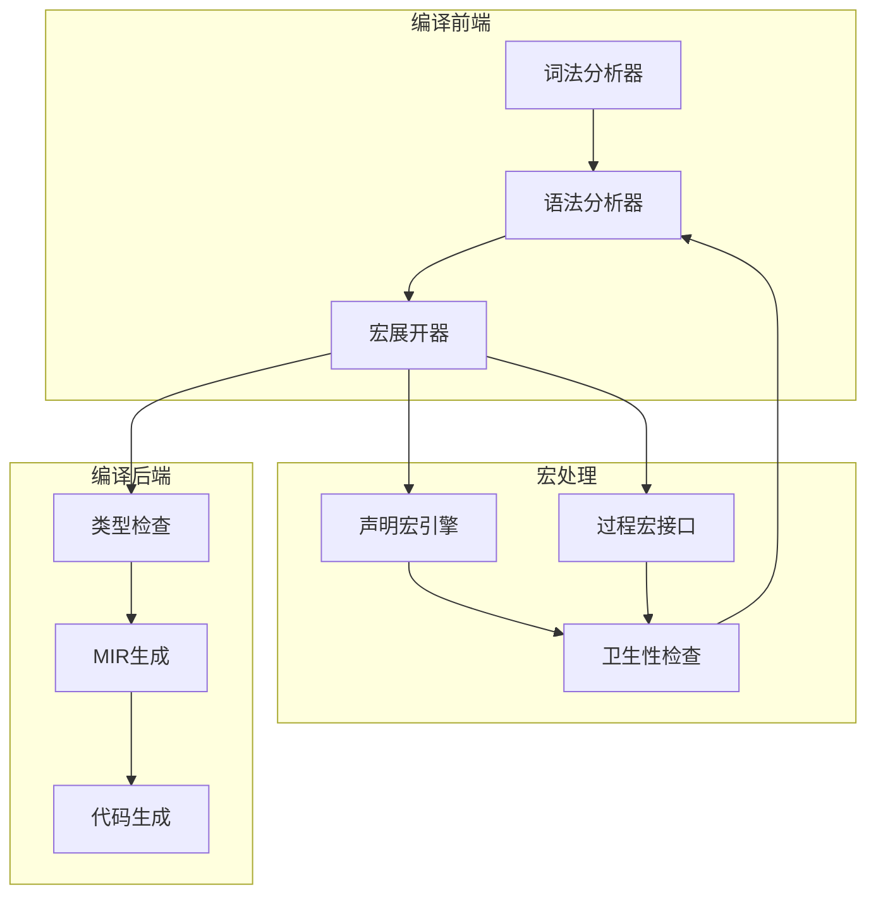

---

## 5. 应用场景地图

### 场景分类

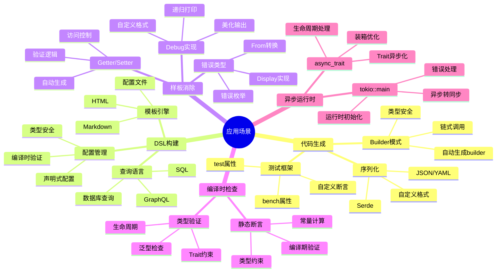

### 技术栈映射

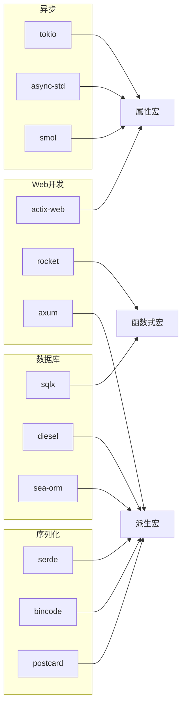

---

## 6. 工具生态图

### 开发工具链

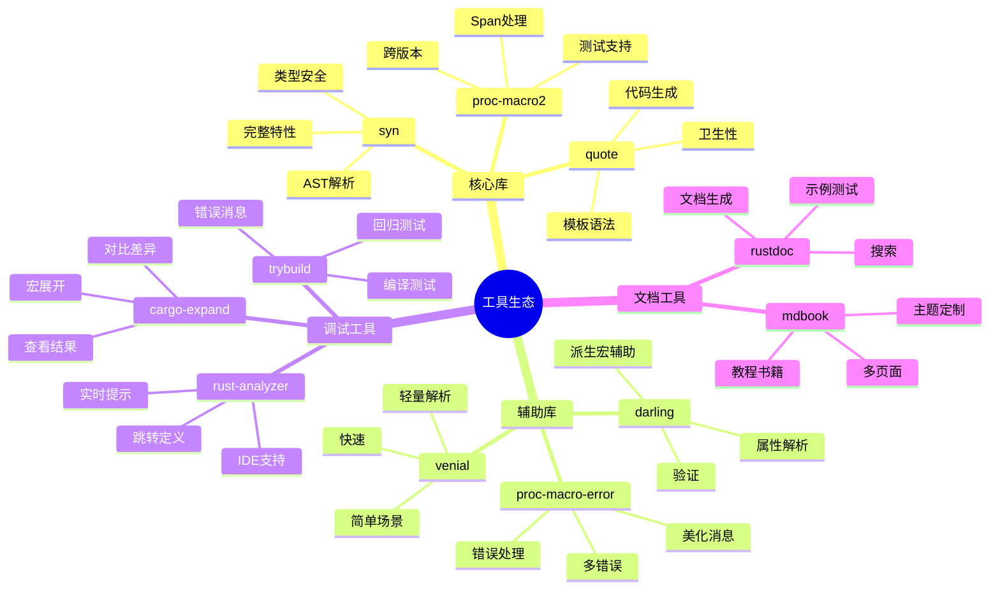

---

## 7. 性能优化地图

### 优化策略

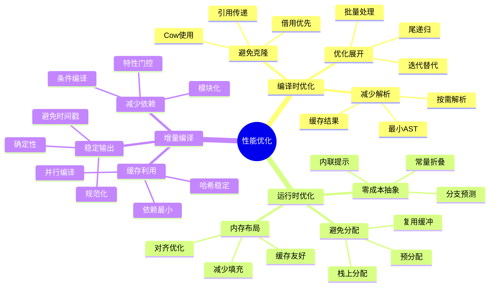

---

## 8. 错误诊断流程

### 调试决策树

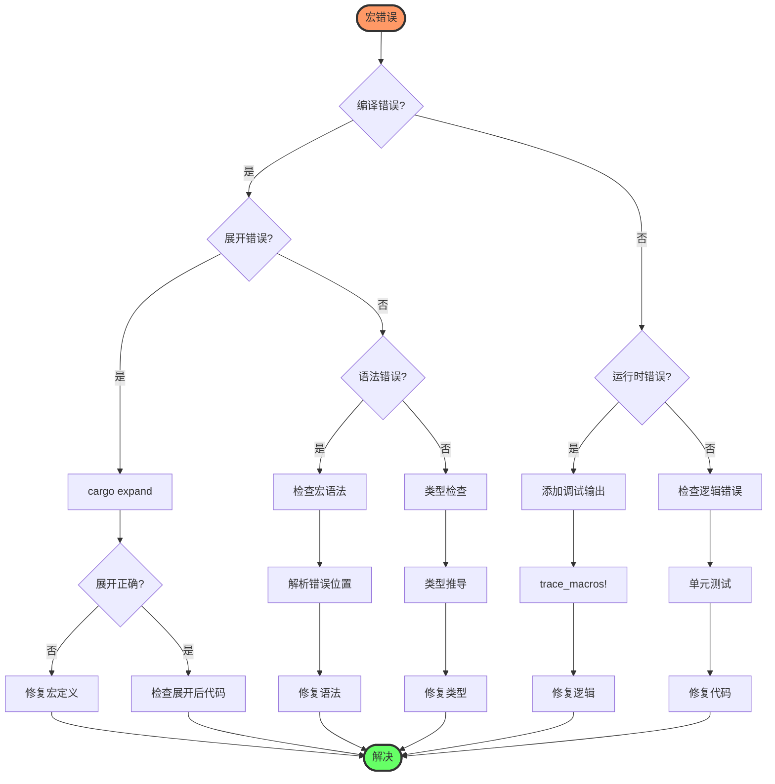

---

## 9. 相关资源

**理论文档**:

- [知识图谱](KNOWLEDGE_GRAPH_AND_CONCEPT_RELATIONS.md)
- [多维矩阵对比](MULTI_DIMENSIONAL_COMPARISON_MATRIX.md)
- [宏基础理论](../01_theory/01_macro_fundamentals.md)

**实践指南**:

- [声明宏基础](../02_declarative/01_macro_rules_basics.md)
- [过程宏开发](../03_procedural/)
- [最佳实践](../05_practice/02_best_practices.md)

**工具使用**:

- [Rust 1.90特性](../06_rust_190_features/README.md)
- [主索引](../00_MASTER_INDEX.md)

---

**文档版本**: v1.0  
**创建日期**: 2025-10-20  
**维护状态**: ✅ 活跃

**返回导航**:

- [返回主索引](../00_MASTER_INDEX.md)
- [C14模块README](../../README.md)
