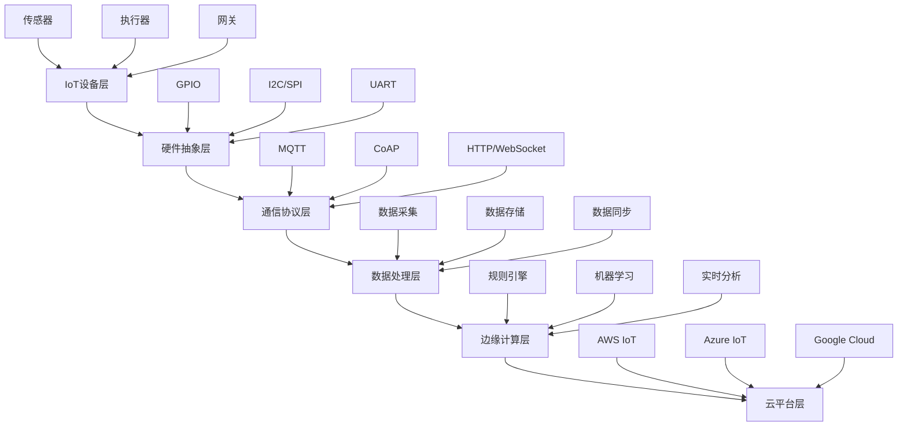

# IoT技术栈2024 - Rust 1.90完整指南

## 🎯 技术栈概览

本文档详细介绍了基于Rust 1.90的IoT技术栈，包括最新的开源库、最佳实践和性能优化建议。

## 📊 技术栈架构图



## 🔧 核心技术栈

### 1. 异步运行时层

```toml
[dependencies]
tokio = { version = "1.35", features = ["full"] }
tokio-util = "0.7"
futures = "0.3"
```

**关键特性**：

- 高性能异步I/O
- 任务调度优化
- 内存池管理
- 零成本抽象

### 2. 硬件抽象层

```toml
[dependencies]
embedded-hal = "1.0"
embedded-hal-async = "1.0"
linux-embedded-hal = "0.5"
rppal = "0.14"  # Raspberry Pi
```

**支持的硬件平台**：

- Raspberry Pi 4/5
- STM32系列
- Nordic nRF系列
- ESP32系列
- 通用Linux设备

### 3. 通信协议层

```toml
[dependencies]
# MQTT
rumqttc = "0.25"
rumqttd = "0.25"

# CoAP
coap-lite = "0.13"

# HTTP/WebSocket
hyper = { version = "0.14", features = ["full"] }
tokio-tungstenite = "0.21"

# 工业协议
tokio-modbus = "0.12"
opcua = "0.12"
```

### 4. 数据处理层

```toml
[dependencies]
# 序列化
serde = { version = "1.0", features = ["derive"] }
serde_json = "1.0"
bincode = "1.3"

# 时间处理
chrono = { version = "0.4", features = ["serde"] }

# 数据验证
validator = { version = "0.16", features = ["derive"] }
```

### 5. 数据存储层

```toml
[dependencies]
# 时间序列数据库
influxdb2 = "0.4"

# 关系型数据库
sqlx = { version = "0.7", features = ["runtime-tokio-rustls", "postgres"] }
diesel = { version = "2.1", features = ["postgres"] }

# NoSQL数据库
mongodb = "2.6"
redis = { version = "0.24", features = ["tokio-comp"] }

# 嵌入式数据库
sled = "0.34"
```

### 6. 安全层

```toml
[dependencies]
# 加密
ring = "0.17"
rustls = { version = "0.21", features = ["dangerous_configuration"] }

# 哈希
sha2 = "0.10"
blake3 = "1.5"

# 数字签名
ed25519-dalek = "2.0"
ecdsa = "0.16"

# JWT
jsonwebtoken = "9.2"
```

### 7. 监控可观测性层

```toml
[dependencies]
# 指标
prometheus = "0.13"
metrics = "0.22"

# 日志
tracing = "0.1"
tracing-subscriber = { version = "0.3", features = ["env-filter"] }

# 分布式追踪
opentelemetry = "0.21"
opentelemetry-jaeger = "0.20"

# 系统监控
sysinfo = "0.30"
```

## 🚀 性能优化配置

### 1. 编译优化

```toml
# Cargo.toml
[profile.release]
opt-level = 3
lto = true
codegen-units = 1
panic = "abort"
strip = true

[profile.dev]
opt-level = 1
debug = true
```

### 2. 异步配置

```rust
// 自定义Tokio运行时配置
use tokio::runtime::Runtime;

pub fn create_optimized_runtime() -> Runtime {
    tokio::runtime::Builder::new_multi_thread()
        .worker_threads(num_cpus::get())
        .max_blocking_threads(512)
        .thread_name("iot-worker")
        .thread_stack_size(3 * 1024 * 1024)
        .enable_all()
        .build()
        .unwrap()
}
```

### 3. 内存优化

```rust
// 使用内存池
use tokio::sync::Semaphore;

pub struct MemoryPool {
    semaphore: Semaphore,
    buffer_size: usize,
}

impl MemoryPool {
    pub fn new(max_buffers: usize, buffer_size: usize) -> Self {
        Self {
            semaphore: Semaphore::new(max_buffers),
            buffer_size,
        }
    }
    
    pub async fn acquire_buffer(&self) -> Vec<u8> {
        let _permit = self.semaphore.acquire().await.unwrap();
        vec![0u8; self.buffer_size]
    }
}
```

## 📈 性能基准测试

### 1. MQTT性能测试

```rust
use criterion::{black_box, criterion_group, criterion_main, Criterion};
use rumqttc::{Client, MqttOptions, QoS};

fn benchmark_mqtt_publish(c: &mut Criterion) {
    let rt = tokio::runtime::Runtime::new().unwrap();
    
    c.bench_function("mqtt_publish", |b| {
        b.iter(|| {
            rt.block_on(async {
                let mut mqttoptions = MqttOptions::new("test-client", "localhost", 1883);
                let (mut client, mut connection) = Client::new(mqttoptions, 10);
                
                let message = "test message".to_string();
                client.publish("test/topic", QoS::AtLeastOnce, false, message).await.unwrap();
            })
        })
    });
}

criterion_group!(benches, benchmark_mqtt_publish);
criterion_main!(benches);
```

### 2. 数据处理性能测试

```rust
use criterion::{black_box, criterion_group, criterion_main, Criterion};
use serde::{Deserialize, Serialize};

#[derive(Debug, Serialize, Deserialize)]
struct SensorData {
    device_id: String,
    timestamp: chrono::DateTime<chrono::Utc>,
    temperature: f64,
    humidity: f64,
}

fn benchmark_data_processing(c: &mut Criterion) {
    c.bench_function("serialize_deserialize", |b| {
        b.iter(|| {
            let data = SensorData {
                device_id: black_box("sensor_001".to_string()),
                timestamp: black_box(chrono::Utc::now()),
                temperature: black_box(25.5),
                humidity: black_box(60.0),
            };
            
            let json = serde_json::to_string(&data).unwrap();
            let _parsed: SensorData = serde_json::from_str(&json).unwrap();
        })
    });
}

criterion_group!(benches, benchmark_data_processing);
criterion_main!(benches);
```

## 🔧 开发工具配置

### 1. 开发环境设置

```bash
#!/bin/bash
# setup_dev_env.sh

# 安装Rust工具链
curl --proto '=https' --tlsv1.2 -sSf https://sh.rustup.rs | sh
source ~/.cargo/env

# 安装开发工具
cargo install cargo-edit cargo-outdated cargo-audit
cargo install cargo-tarpaulin cargo-criterion
cargo install cross cargo-xbuild

# 安装代码质量工具
rustup component add clippy rustfmt
rustup component add rust-src

# 安装嵌入式工具
cargo install cargo-binutils
rustup target add thumbv7em-none-eabihf
rustup target add riscv32imc-unknown-none-elf
```

### 2. CI/CD配置

```yaml
# .github/workflows/ci.yml
name: CI

on: [push, pull_request]

jobs:
  test:
    runs-on: ubuntu-latest
    strategy:
      matrix:
        rust: [stable, beta, nightly]
    
    steps:
    - uses: actions/checkout@v4
    
    - name: Install Rust
      uses: actions-rs/toolchain@v1
      with:
        toolchain: ${{ matrix.rust }}
        components: rustfmt, clippy
        override: true
    
    - name: Cache cargo registry
      uses: actions/cache@v3
      with:
        path: ~/.cargo/registry
        key: ${{ runner.os }}-cargo-registry-${{ hashFiles('**/Cargo.lock') }}
    
    - name: Cache cargo index
      uses: actions/cache@v3
      with:
        path: ~/.cargo/git
        key: ${{ runner.os }}-cargo-index-${{ hashFiles('**/Cargo.lock') }}
    
    - name: Cache cargo build
      uses: actions/cache@v3
      with:
        path: target
        key: ${{ runner.os }}-cargo-build-target-${{ hashFiles('**/Cargo.lock') }}
    
    - name: Run tests
      run: cargo test --verbose
    
    - name: Run clippy
      run: cargo clippy -- -D warnings
    
    - name: Run rustfmt
      run: cargo fmt -- --check
    
    - name: Run cargo audit
      run: cargo audit
    
    - name: Generate coverage report
      run: cargo tarpaulin --out Html --output-dir coverage
    
    - name: Upload coverage to Codecov
      uses: codecov/codecov-action@v3
      with:
        file: ./coverage/tarpaulin-report.html
```

## 📚 最佳实践指南

### 1. 错误处理

```rust
use thiserror::Error;

#[derive(Error, Debug)]
pub enum IoError {
    #[error("设备连接失败: {0}")]
    ConnectionFailed(String),
    
    #[error("数据解析错误: {0}")]
    ParseError(#[from] serde_json::Error),
    
    #[error("网络错误: {0}")]
    NetworkError(#[from] std::io::Error),
    
    #[error("设备超时: {device_id}")]
    DeviceTimeout { device_id: String },
}

// 使用示例
pub async fn read_sensor_data(device_id: &str) -> Result<SensorData, IoError> {
    let response = reqwest::get(&format!("http://device/{}/data", device_id))
        .await
        .map_err(|e| IoError::NetworkError(e.into()))?;
    
    let data: SensorData = response.json().await?;
    Ok(data)
}
```

### 2. 配置管理

```rust
use serde::{Deserialize, Serialize};
use std::fs;

#[derive(Debug, Serialize, Deserialize)]
pub struct Config {
    pub device: DeviceConfig,
    pub communication: CommunicationConfig,
    pub storage: StorageConfig,
}

#[derive(Debug, Serialize, Deserialize)]
pub struct DeviceConfig {
    pub id: String,
    pub location: String,
    pub sensors: Vec<SensorConfig>,
}

impl Config {
    pub fn load(path: &str) -> Result<Self, Box<dyn std::error::Error>> {
        let content = fs::read_to_string(path)?;
        let config: Config = toml::from_str(&content)?;
        Ok(config)
    }
    
    pub fn save(&self, path: &str) -> Result<(), Box<dyn std::error::Error>> {
        let content = toml::to_string_pretty(self)?;
        fs::write(path, content)?;
        Ok(())
    }
}
```

### 3. 资源管理

```rust
use tokio::sync::Semaphore;
use std::sync::Arc;

pub struct ResourceManager {
    semaphore: Arc<Semaphore>,
    max_connections: usize,
}

impl ResourceManager {
    pub fn new(max_connections: usize) -> Self {
        Self {
            semaphore: Arc::new(Semaphore::new(max_connections)),
            max_connections,
        }
    }
    
    pub async fn acquire_connection(&self) -> Result<ConnectionGuard, IoError> {
        let permit = self.semaphore.acquire().await
            .map_err(|_| IoError::ConnectionFailed("无法获取连接".to_string()))?;
        
        Ok(ConnectionGuard { permit })
    }
}

pub struct ConnectionGuard {
    permit: tokio::sync::SemaphorePermit<'static>,
}

impl Drop for ConnectionGuard {
    fn drop(&mut self) {
        // 自动释放连接
    }
}
```

## 🔄 持续集成和部署

### 1. Docker配置

```dockerfile
# Dockerfile
FROM rust:1.90-slim as builder

WORKDIR /app
COPY Cargo.toml Cargo.lock ./
COPY src ./src

RUN cargo build --release

FROM debian:bookworm-slim

RUN apt-get update && apt-get install -y \
    ca-certificates \
    && rm -rf /var/lib/apt/lists/*

COPY --from=builder /app/target/release/iot-app /usr/local/bin/iot-app

EXPOSE 8080

CMD ["iot-app"]
```

### 2. Kubernetes部署

```yaml
# k8s-deployment.yaml
apiVersion: apps/v1
kind: Deployment
metadata:
  name: iot-app
spec:
  replicas: 3
  selector:
    matchLabels:
      app: iot-app
  template:
    metadata:
      labels:
        app: iot-app
    spec:
      containers:
      - name: iot-app
        image: iot-app:latest
        ports:
        - containerPort: 8080
        env:
        - name: RUST_LOG
          value: "info"
        resources:
          requests:
            memory: "64Mi"
            cpu: "100m"
          limits:
            memory: "128Mi"
            cpu: "200m"
        livenessProbe:
          httpGet:
            path: /health
            port: 8080
          initialDelaySeconds: 30
          periodSeconds: 10
        readinessProbe:
          httpGet:
            path: /ready
            port: 8080
          initialDelaySeconds: 5
          periodSeconds: 5
---
apiVersion: v1
kind: Service
metadata:
  name: iot-app-service
spec:
  selector:
    app: iot-app
  ports:
  - port: 80
    targetPort: 8080
  type: LoadBalancer
```

## 📊 监控和告警

### 1. Prometheus指标

```rust
use prometheus::{Counter, Histogram, Registry, TextEncoder, Encoder};

lazy_static::lazy_static! {
    static ref REQUEST_COUNTER: Counter = Counter::new(
        "iot_requests_total",
        "Total number of IoT requests"
    ).unwrap();
    
    static ref REQUEST_DURATION: Histogram = Histogram::new(
        "iot_request_duration_seconds",
        "Request duration in seconds"
    ).unwrap();
}

pub async fn metrics_handler() -> Result<String, Box<dyn std::error::Error>> {
    let registry = Registry::new();
    registry.register(Box::new(REQUEST_COUNTER.clone()))?;
    registry.register(Box::new(REQUEST_DURATION.clone()))?;
    
    let metric_families = registry.gather();
    let encoder = TextEncoder::new();
    let metric_text = encoder.encode_to_string(&metric_families)?;
    
    Ok(metric_text)
}
```

### 2. 告警规则

```yaml
# prometheus-alerts.yml
groups:
- name: iot-alerts
  rules:
  - alert: HighTemperature
    expr: iot_temperature_celsius > 35
    for: 5m
    labels:
      severity: warning
    annotations:
      summary: "设备温度过高"
      description: "设备 {{ $labels.device_id }} 温度达到 {{ $value }}°C"
  
  - alert: DeviceOffline
    expr: up{job="iot-devices"} == 0
    for: 1m
    labels:
      severity: critical
    annotations:
      summary: "设备离线"
      description: "设备 {{ $labels.device_id }} 已离线超过1分钟"
  
  - alert: HighErrorRate
    expr: rate(iot_errors_total[5m]) > 0.1
    for: 2m
    labels:
      severity: warning
    annotations:
      summary: "错误率过高"
      description: "设备 {{ $labels.device_id }} 错误率达到 {{ $value }}"
```

## 🔄 持续更新计划

### 1. 技术栈更新

- **Q1 2024**: Rust 1.90稳定版发布
- **Q2 2024**: 新异步特性集成
- **Q3 2024**: 性能优化和内存管理改进
- **Q4 2024**: 新硬件平台支持

### 2. 生态系统发展

- 新开源库的集成
- 社区贡献的整合
- 最佳实践的更新
- 性能基准的维护

### 3. 文档维护

- 技术文档的持续更新
- 示例代码的完善
- 教程和指南的改进
- 问题解答和FAQ

---

**IoT技术栈2024** - 基于Rust 1.90的现代化IoT开发解决方案 🦀🌐
