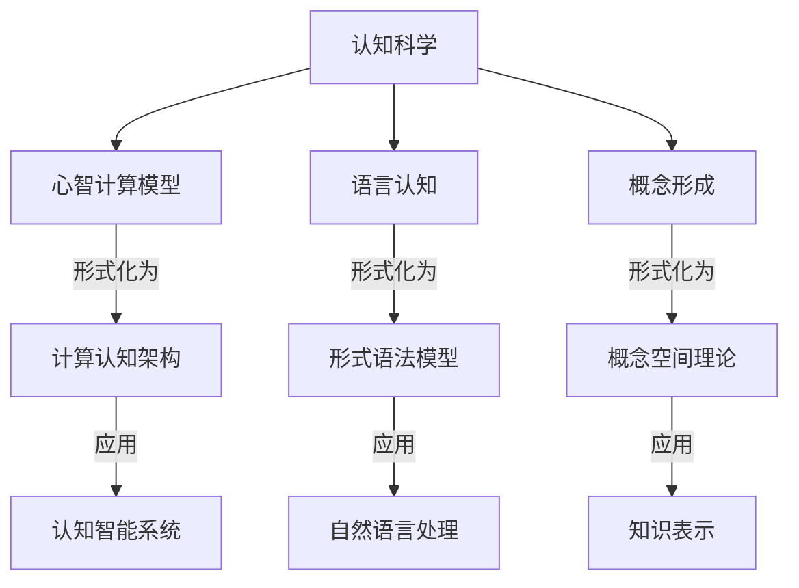
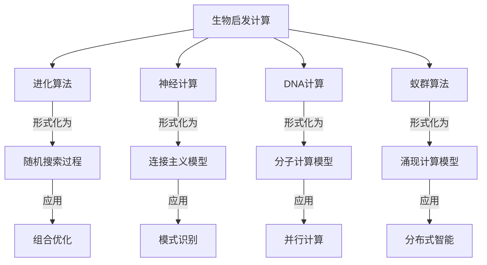
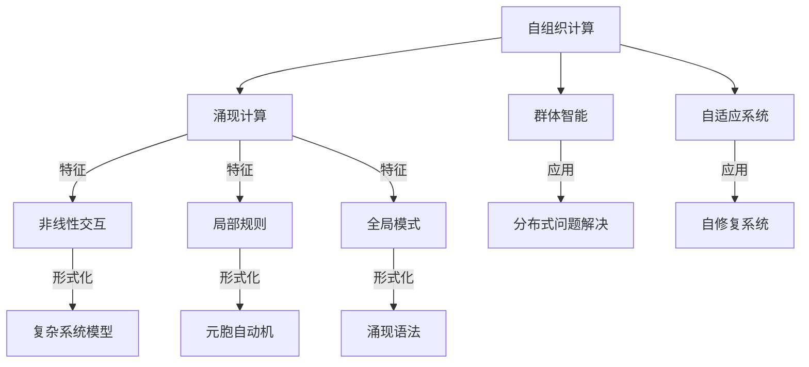

# 形式语言与认知科学的交叉

## 目录

- [形式语言与认知科学的交叉](#形式语言与认知科学的交叉)
  - [目录](#目录)
    - [计算认知模型与形式语言](#计算认知模型与形式语言)
      - [1. 认知架构的形式化表示](#1-认知架构的形式化表示)
      - [2. 语言认知的计算模型](#2-语言认知的计算模型)
    - [形式语言与人工智能](#形式语言与人工智能)
      - [1. 神经符号集成](#1-神经符号集成)
      - [2. 可解释AI与形式化保证](#2-可解释ai与形式化保证)
  - [形式语言与未来计算范式](#形式语言与未来计算范式)
    - [生物启发计算与形式语言](#生物启发计算与形式语言)
      - [1. DNA计算的形式语言](#1-dna计算的形式语言)
      - [2. 量子-生物混合计算](#2-量子-生物混合计算)
    - [自组织计算与涌现形式语言](#自组织计算与涌现形式语言)
      - [1. 元胞自动机的形式语言](#1-元胞自动机的形式语言)
      - [2. 涌现语法与自适应形式语言](#2-涌现语法与自适应形式语言)
    - [Query Language Parsing](#query-language-parsing)
  - [2. Type Systems and Formal Verification](#2-type-systems-and-formal-verification)
    - [Type Checking Systems](#type-checking-systems)
    - [Hoare Logic in Rust](#hoare-logic-in-rust)
  - [3. Abstract Syntax Trees and Intermediate Representations](#3-abstract-syntax-trees-and-intermediate-representations)
  - [4. Temporal Logic for Formal Verification](#4-temporal-logic-for-formal-verification)
  - [5. Proof Systems and Verification Techniques](#5-proof-systems-and-verification-techniques)
  - [6. Practical Formal Verification System](#6-practical-formal-verification-system)

### 计算认知模型与形式语言



#### 1. 认知架构的形式化表示

```rust
// 认知架构的形式化表示

// 1. 认知状态表示
struct CognitiveState {
    // 工作记忆
    working_memory: HashMap<Symbol, Value>,
    // 长期记忆
    long_term_memory: HashMap<Symbol, Value>,
    // 注意焦点
    attention: Option<Symbol>,
    // 目标栈
    goals: Vec<Goal>,
}

// 认知单元（块）
struct Chunk {
    // 类型
    chunk_type: ChunkType,
    // 属性
    slots: HashMap<SlotName, Value>,
}

// 2. 产生式规则系统
struct ProductionRule {
    // 条件部分
    condition: Box<dyn Fn(&CognitiveState) -> bool>,
    // 动作部分
    action: Box<dyn Fn(&mut CognitiveState)>,
    // 效用值
    utility: f64,
}

struct ProductionSystem {
    rules: Vec<ProductionRule>,
}

impl ProductionSystem {
    // 认知循环
    fn cognitive_cycle(&self, state: &mut CognitiveState) {
        // 1. 匹配阶段：找出所有条件满足的规则
        let matching_rules: Vec<&ProductionRule> = self.rules
            .iter()
            .filter(|rule| (rule.condition)(state))
            .collect();
        
        // 2. 选择阶段：根据效用值选择最佳规则
        if let Some(best_rule) = matching_rules
            .iter()
            .max_by(|a, b| a.utility.partial_cmp(&b.utility).unwrap())
        {
            // 3. 执行阶段：执行选中规则的动作
            (best_rule.action)(state);
        }
    }
}

// 3. 认知过程模拟
fn simulate_problem_solving() {
    // 初始认知状态
    let mut state = CognitiveState {
        working_memory: HashMap::new(),
        long_term_memory: HashMap::new(),
        attention: None,
        goals: vec![Goal::Solve("tower_of_hanoi")],
    };
    
    // 产生式规则系统
    let production_system = ProductionSystem {
        rules: vec![
            // 初始化规则
            ProductionRule {
                condition: Box::new(|state| {
                    state.goals.last() == Some(&Goal::Solve("tower_of_hanoi")) &&
                    !state.working_memory.contains_key(&Symbol::from("subgoal"))
                }),
                action: Box::new(|state| {
                    state.working_memory.insert(
                        Symbol::from("subgoal"),
                        Value::Goal(Goal::Move(3, "A", "C", "B"))
                    );
                }),
                utility: 1.0,
            },
            // 递归分解规则
            ProductionRule {
                condition: Box::new(|state| {
                    if let Some(Value::Goal(Goal::Move(n, src, dst, aux))) = 
                        state.working_memory.get(&Symbol::from("subgoal")) {
                        *n > 1
                    } else {
                        false
                    }
                }),
                action: Box::new(|state| {
                    if let Value::Goal(Goal::Move(n, src, dst, aux)) = 
                        state.working_memory.get(&Symbol::from("subgoal")).unwrap() {
                        let n = *n;
                        let src = src.clone();
                        let dst = dst.clone();
                        let aux = aux.clone();
                        
                        // 分解为三个子目标
                        state.working_memory.insert(
                            Symbol::from("subgoal"),
                            Value::GoalSequence(vec![
                                Goal::Move(n-1, &src, &aux, &dst),
                                Goal::Move(1, &src, &dst, &aux),
                                Goal::Move(n-1, &aux, &dst, &src)
                            ])
                        );
                    }
                }),
                utility: 0.9,
            },
            // 基本情况规则
            ProductionRule {
                condition: Box::new(|state| {
                    if let Some(Value::Goal(Goal::Move(n, _, _, _))) = 
                        state.working_memory.get(&Symbol::from("subgoal")) {
                        *n == 1
                    } else {
                        false
                    }
                }),
                action: Box::new(|state| {
                    if let Value::Goal(Goal::Move(_, src, dst, _)) = 
                        state.working_memory.get(&Symbol::from("subgoal")).unwrap() {
                        println!("Move disk from {} to {}", src, dst);
                        state.working_memory.remove(&Symbol::from("subgoal"));
                    }
                }),
                utility: 0.8,
            },
        ],
    };
    
    // 运行认知模拟
    for _ in 0..100 {  // 最多100个认知周期
        if state.goals.is_empty() {
            break;  // 所有目标完成
        }
        production_system.cognitive_cycle(&mut state);
    }
}
```

#### 2. 语言认知的计算模型

```rust
// 语言认知的计算模型

// 1. 语言处理的激活扩散网络
struct ConceptNode {
    // 概念标识符
    id: String,
    // 激活值
    activation: f64,
    // 连接的概念及其权重
    connections: HashMap<String, f64>,
}

struct ActivationNetwork {
    nodes: HashMap<String, ConceptNode>,
    decay_rate: f64,
}

impl ActivationNetwork {
    // 输入词汇激活网络
    fn activate(&mut self, input: &str, strength: f64) {
        if let Some(node) = self.nodes.get_mut(input) {
            node.activation += strength;
        }
    }
    
    // 激活扩散
    fn spread_activation(&mut self) {
        // 复制当前激活值
        let current_activations: HashMap<String, f64> = self.nodes
            .iter()
            .map(|(id, node)| (id.clone(), node.activation))
            .collect();
        
        // 扩散激活
        for (id, node) in &mut self.nodes {
            // 衰减当前激活
            node.activation *= self.decay_rate;
            
            // 从连接节点接收激活
            for (connected_id, weight) in &node.connections {
                if let Some(connected_activation) = current_activations.get(connected_id) {
                    node.activation += connected_activation * weight;
                }
            }
        }
    }
    
    // 获取最活跃的概念
    fn most_active(&self, n: usize) -> Vec<(&String, f64)> {
        let mut nodes: Vec<_> = self.nodes
            .iter()
            .map(|(id, node)| (id, node.activation))
            .collect();
        
        nodes.sort_by(|a, b| b.1.partial_cmp(&a.1).unwrap());
        nodes.truncate(n);
        nodes
    }
}

// 2. 句法分析的认知模型
enum ParseState {
    Initial,
    NounPhraseStarted,
    VerbPhraseStarted,
    Complete,
}

struct IncrementalParser {
    state: ParseState,
    working_memory: Vec<Word>,
    parse_tree: Option<SyntaxNode>,
}

impl IncrementalParser {
    fn new() -> Self {
        IncrementalParser {
            state: ParseState::Initial,
            working_memory: Vec::new(),
            parse_tree: None,
        }
    }
    
    // 增量处理输入词
    fn process_word(&mut self, word: Word) {
        self.working_memory.push(word.clone());
        
        match self.state {
            ParseState::Initial => {
                if word.pos == PartOfSpeech::Determiner || word.pos == PartOfSpeech::Noun {
                    self.state = ParseState::NounPhraseStarted;
                }
            },
            ParseState::NounPhraseStarted => {
                if word.pos == PartOfSpeech::Verb {
                    self.state = ParseState::VerbPhraseStarted;
                }
            },
            ParseState::VerbPhraseStarted => {
                if word.pos == PartOfSpeech::Noun {
                    self.state = ParseState::Complete;
                    self.build_parse_tree();
                }
            },
            ParseState::Complete => {
                // 句子已完成，可能开始新句子
            }
        }
    }
    
    fn build_parse_tree(&mut self) {
        // 构建简单的语法树
        // 在实际系统中，这会更复杂，考虑各种语法规则
        let subject = SyntaxNode::NounPhrase(
            self.working_memory[0..1].to_vec()
        );
        
        let verb = &self.working_memory[1];
        
        let object = SyntaxNode::NounPhrase(
            self.working_memory[2..].to_vec()
        );
        
        self.parse_tree = Some(SyntaxNode::Sentence(
            Box::new(subject),
            verb.clone(),
            Box::new(object)
        ));
    }
}
```

### 形式语言与人工智能

#### 1. 神经符号集成

```rust
// 神经符号集成系统

// 1. 神经网络组件
struct NeuralNetwork {
    // 简化的神经网络表示
    layers: Vec<Layer>,
    learning_rate: f64,
}

impl NeuralNetwork {
    // 前向传播
    fn forward(&self, input: &[f64]) -> Vec<f64> {
        let mut current = input.to_vec();
        
        for layer in &self.layers {
            current = layer.activate(&current);
        }
        
        current
    }
    
    // 从数据中学习
    fn learn(&mut self, examples: &[Example]) {
        // 简化的学习算法
        for example in examples {
            let prediction = self.forward(&example.input);
            let error: Vec<f64> = example.output.iter()
                .zip(prediction.iter())
                .map(|(target, pred)| target - pred)
                .collect();
            
            self.backpropagate(&error);
        }
    }
    
    // 反向传播
    fn backpropagate(&mut self, error: &[f64]) {
        // 简化的反向传播实现
        unimplemented!()
    }
}

// 2. 符号推理组件
struct SymbolicReasoner {
    knowledge_base: KnowledgeBase,
    inference_rules: Vec<InferenceRule>,
}

impl SymbolicReasoner {
    // 从事实和规则推导新知识
    fn infer(&self, query: &Formula) -> Option<Proof> {
        // 简化的推理算法
        unimplemented!()
    }
    
    // 添加新事实到知识库
    fn assert(&mut self, fact: Fact) {
        self.knowledge_base.add_fact(fact);
    }
}

// 3. 神经符号接口
struct NeuralSymbolicSystem {
    neural: NeuralNetwork,
    symbolic: SymbolicReasoner,
}

impl NeuralSymbolicSystem {
    // 神经→符号：将神经网络输出转换为符号表示
    fn neural_to_symbolic(&self, neural_output: &[f64]) -> Vec<Fact> {
        // 将连续值转换为离散符号
        let mut facts = Vec::new();
        
        // 例如，如果输出[0.1, 0.9, 0.2]，可能表示第二个属性为真
        let threshold = 0.5;
        for (i, &value) in neural_output.iter().enumerate() {
            if value > threshold {
                facts.push(Fact::new(format!("attribute_{}", i), true));
            }
        }
        
        facts
    }
    
    // 符号→神经：将符号知识转换为神经网络输入
    fn symbolic_to_neural(&self, facts: &[Fact]) -> Vec<f64> {
        // 将离散符号转换为连续值
        let mut input = vec![0.0; 100]; // 假设输入维度为100
        
        for fact in facts {
            if let Some(idx) = self.fact_to_index(fact) {
                input[idx] = 1.0;
            }
        }
        
        input
    }
    
    // 集成推理
    fn integrated_reasoning(&mut self, input: &[f64], query: &Formula) -> (Vec<f64>, Option<Proof>) {
        // 1. 神经网络处理输入
        let neural_output = self.neural.forward(input);
        
        // 2. 转换为符号表示
        let facts = self.neural_to_symbolic(&neural_output);
        
        // 3. 将事实添加到知识库
        for fact in &facts {
            self.symbolic.assert(fact.clone());
        }
        
        // 4. 符号推理
        let proof = self.symbolic.infer(query);
        
        // 5. 返回神经输出和符号推理结果
        (neural_output, proof)
    }
    
    // 集成学习
    fn integrated_learning(&mut self, examples: &[IntegratedExample]) {
        // 1. 从例子中提取神经学习数据
        let neural_examples: Vec<Example> = examples.iter()
            .map(|e| Example {
                input: e.input.clone(),
                output: e.expected_output.clone(),
            })
            .collect();
        
        // 2. 神经网络学习
        self.neural.learn(&neural_examples);
        
        // 3. 从例子中提取符号知识
        for example in examples {
            for fact in &example.symbolic_facts {
                self.symbolic.assert(fact.clone());
            }
        }
    }
    
    // 辅助方法：将事实映射到索引
    fn fact_to_index(&self, fact: &Fact) -> Option<usize> {
        // 简化的映射实现
        unimplemented!()
    }
}
```

#### 2. 可解释AI与形式化保证

```rust
// 可解释AI与形式化保证

// 1. 可解释决策树模型
struct ExplainableDecisionTree {
    root: TreeNode,
}

enum TreeNode {
    Leaf {
        prediction: String,
        confidence: f64,
        supporting_examples: Vec<Example>,
    },
    Internal {
        feature: String,
        threshold: f64,
        left: Box<TreeNode>,
        right: Box<TreeNode>,
    },
}

impl ExplainableDecisionTree {
    // 预测并生成解释
    fn predict_with_explanation(&self, input: &[f64]) -> (String, Explanation) {
        let mut current = &self.root;
        let mut path = Vec::new();
        
        // 遍历决策树
        loop {
            match current {
                TreeNode::Leaf { prediction, confidence, supporting_examples } => {
                    // 生成解释
                    let explanation = Explanation {
                        decision_path: path,
                        prediction: prediction.clone(),
                        confidence: *confidence,
                        similar_examples: supporting_examples.clone(),
                    };
                    
                    return (prediction.clone(), explanation);
                },
                TreeNode::Internal { feature, threshold, left, right } => {
                    let feature_idx = self.feature_to_index(feature);
                    let feature_value = input[feature_idx];
                    
                    // 记录决策路径
                    path.push(Decision {
                        feature: feature.clone(),
                        threshold: *threshold,
                        value: feature_value,
                        direction: if feature_value <= *threshold { "left" } else { "right" },
                    });
                    
                    // 继续遍历
                    current = if feature_value <= *threshold {
                        left
                    } else {
                        right
                    };
                }
            }
        }
    }
    
    // 辅助方法：特征名称到索引的映射
    fn feature_to_index(&self, feature: &str) -> usize {
        // 简化的映射实现
        match feature {
            "age" => 0,
            "income" => 1,
            "education" => 2,
            _ => panic!("Unknown feature: {}", feature),
        }
    }
}

// 解释结构
struct Explanation {
    // 决策路径
    decision_path: Vec<Decision>,
    // 预测结果
    prediction: String,
    // 置信度
    confidence: f64,
    // 支持该预测的相似例子
    similar_examples: Vec<Example>,
}

struct Decision {
    feature: String,
    threshold: f64,
    value: f64,
    direction: &'static str,
}

// 2. 形式化保证的机器学习
struct VerifiedModel<M, P> {
    // 机器学习模型
    model: M,
    // 形式化属性
    properties: Vec<P>,
    // 验证状态
    verification_status: VerificationStatus,
}

enum VerificationStatus {
    Verified,
    Falsified { counterexample: Vec<f64> },
    Unknown,
}

impl<M, P> VerifiedModel<M, P>
where
    M: Model,
    P: Property,
{
    // 验证模型是否满足所有属性
    fn verify(&mut self) {
        for property in &self.properties {
            match self.verify_property(property) {
                Ok(()) => {},
                Err(counterexample) => {
                    self.verification_status = VerificationStatus::Falsified {
                        counterexample,
                    };
                    return;
                }
            }
        }
        
        self.verification_status = VerificationStatus::Verified;
    }
    
    // 验证单个属性
    fn verify_property(&self, property: &P) -> Result<(), Vec<f64>> {
        // 使用形式化方法验证属性
        // 可能使用SMT求解器、抽象解释等技术
        unimplemented!()
    }
    
    // 安全预测：只有在满足验证条件时才进行预测
    fn safe_predict(&self, input: &[f64]) -> Result<Vec<f64>, &'static str> {
        match self.verification_status {
            VerificationStatus::Verified => {
                // 模型已验证，可以安全预测
                Ok(self.model.predict(input))
            },
            VerificationStatus::Falsified { .. } => {
                // 模型验证失败，拒绝预测
                Err("Model failed verification")
            },
            VerificationStatus::Unknown => {
                // 验证状态未知，谨慎预测
                if self.input_in_safe_domain(input) {
                    Ok(self.model.predict(input))
                } else {
                    Err("Input outside verified domain")
                }
            }
        }
    }
    
    // 检查输入是否在已验证的安全域内
    fn input_in_safe_domain(&self, input: &[f64]) -> bool {
        // 简化的安全域检查
        unimplemented!()
    }
}

// 形式化属性示例
trait Property {
    // 检查模型是否满足属性
    fn check<M: Model>(&self, model: &M) -> bool;
}

// 鲁棒性属性：小扰动不应显著改变输出
struct RobustnessProperty {
    epsilon: f64,
    delta: f64,
}

impl Property for RobustnessProperty {
    fn check<M: Model>(&self, model: &M) -> bool {
        // 检查模型是否满足鲁棒性属性
        // 对于任意输入x和扰动d（|d| < epsilon），
        // 确保|model(x) - model(x+d)| < delta
        unimplemented!()
    }
}

// 公平性属性：模型对不同群体应该公平
struct FairnessProperty {
    protected_attribute: usize,
    threshold: f64,
}

impl Property for FairnessProperty {
    fn check<M: Model>(&self, model: &M) -> bool {
        // 检查模型是否满足公平性属性
        // 确保不同群体的预测差异小于阈值
        unimplemented!()
    }
}
```

## 形式语言与未来计算范式

### 生物启发计算与形式语言



#### 1. DNA计算的形式语言

```rust
// DNA计算的形式语言模型

// 1. DNA序列表示
struct DNASequence {
    // 核苷酸序列
    nucleotides: Vec<Nucleotide>,
}

enum Nucleotide {
    A, // 腺嘌呤
    C, // 胞嘧啶
    G, // 鸟嘌呤
    T, // 胸腺嘧啶
}

impl DNASequence {
    // 创建互补序列
    fn complement(&self) -> Self {
        let complementary = self.nucleotides.iter().map(|n| {
            match n {
                Nucleotide::A => Nucleotide::T,
                Nucleotide::T => Nucleotide::A,
                Nucleotide::G => Nucleotide::C,
                Nucleotide::C => Nucleotide::G,
            }
        }).collect();
        
        DNASequence { nucleotides: complementary }
    }
    
    // 检查两个序列是否互补
    fn is_complementary(&self, other: &Self) -> bool {
        if self.nucleotides.len() != other.nucleotides.len() {
            return false;
        }
        
        self.nucleotides.iter().zip(other.nucleotides.iter()).all(|(a, b)| {
            matches!(
                (a, b),
                (Nucleotide::A, Nucleotide::T) |
                (Nucleotide::T, Nucleotide::A) |
                (Nucleotide::G, Nucleotide::C) |
                (Nucleotide::C, Nucleotide::G)
            )
        })
    }
}

// 2. DNA计算操作
trait DNAOperation {
    type Input;
    type Output;
    
    fn apply(&self, input: Self::Input) -> Self::Output;
}

// 杂交操作：混合DNA序列
struct Hybridization;

impl DNAOperation for Hybridization {
    type Input = (Vec<DNASequence>, Vec<DNASequence>);
    type Output = Vec<DNAPair>;
    
    fn apply(&self, input: Self::Input) -> Self::Output {
        let (seq1, seq2) = input;
        let mut pairs = Vec::new();
        
        // 寻找互补序列对
        for s1 in &seq1 {
            for s2 in &seq2 {
                if s1.is_complementary(s2) {
                    pairs.push(DNAPair(s1.clone(), s2.clone()));
                }
            }
        }
        
        pairs
    }
}

// 连接操作：将DNA序列连接起来
struct Ligation;

impl DNAOperation for Ligation {
    type Input = Vec<DNASequence>;
    type Output = Vec<DNASequence>;
    
    fn apply(&self, input: Self::Input) -> Self::Output {
        // 简化的连接实现
        if input.is_empty() {
            return Vec::new();
        }
        
        let mut result = Vec::new();
        let mut current = input[0].clone();
        
        for i in 1..input.len() {
            // 连接序列
            let mut combined = current.nucleotides.clone();
            combined.extend(input[i].nucleotides.clone());
            current = DNASequence { nucleotides: combined };
        }
        
        result.push(current);
        result
    }
}

// 3. DNA计算解决SAT问题
struct DNASatSolver {
    variables: usize,
    clauses: Vec<Vec<i32>>,
}

impl DNASatSolver {
    // 初始化求解器
    fn new(variables: usize, clauses: Vec<Vec<i32>>) -> Self {
        DNASatSolver { variables, clauses }
    }
    
    // 使用DNA计算求解SAT问题
    fn solve(&self) -> Option<Vec<bool>> {
        // 1. 生成所有可能的变量赋值（用DNA序列表示）
        let assignments = self.generate_assignments();
        
        // 2. 并行筛选满足每个子句的赋值
        let mut solutions = assignments;
        
        for clause in &self.clauses {
            solutions = self.filter_clause(solutions, clause);
            
            if solutions.is_empty() {
                return None; // 无解
            }
        }
        
        // 3. 从DNA序列解码出一个解
        if let Some(solution_dna) = solutions.first() {
            Some(self.decode_solution(solution_dna))
        } else {
            None
        }
    }
    
    // 生成所有可能的变量赋值
    fn generate_assignments(&self) -> Vec<DNASequence> {
        // 在实际DNA计算中，这一步通过并行合成实现
        // 这里使用模拟
        let mut assignments = Vec::new();
        let total = 1 << self.variables;
        
        for i in 0..total {
            let mut sequence = Vec::new();
            
            for j in 0..self.variables {
                if (i >> j) & 1 == 1 {
                    // 变量j为真
                    sequence.push(Nucleotide::A);
                    sequence.push(Nucleotide::T);
                } else {
                    // 变量j为假
                    sequence.push(Nucleotide::G);
                    sequence.push(Nucleotide::C);
                }
            }
            
            assignments.push(DNASequence { nucleotides: sequence });
        }
        
        assignments
    }
    
    // 筛选满足指定子句的赋值
    fn filter_clause(&self, assignments: Vec<DNASequence>, clause: &[i32]) -> Vec<DNASequence> {
        // 在实际DNA计算中，这一步通过生化反应并行实现
        // 这里使用模拟
        assignments.into_iter().filter(|assignment| {
            let solution = self.decode_solution(assignment);
            
            // 检查子句是否被满足
            clause.iter().any(|&lit| {
                let var = lit.abs() as usize - 1;
                let positive = lit > 0;
                solution[var] == positive
            })
        }).collect()
    }
    
    // 从DNA序列解码出布尔赋值
    fn decode_solution(&self, dna: &DNASequence) -> Vec<bool> {
        let mut solution = Vec::with_capacity(self.variables);
        
        for i in 0..self.variables {
            let base1 = dna.nucleotides[i * 2];
            let base2 = dna.nucleotides[i * 2 + 1];
            
            // 解码：AT表示真，GC表示假
            let value = matches!(
                (base1, base2),
                (Nucleotide::A, Nucleotide::T)
            );
            
            solution.push(value);
        }
        
        solution
    }
}

// DNA计算的形式语言表示
struct DNAComputationLanguage {
    // 字母表：核苷酸
    alphabet: Vec<Nucleotide>,
    // 语法规则：DNA配对规则
    pairing_rules: Vec<(Nucleotide, Nucleotide)>,
    // 计算操作
    operations: Vec<Box<dyn DNAOperation<Input=Vec<DNASequence>, Output=Vec<DNASequence>>>>,
}

impl DNAComputationLanguage {
    fn new() -> Self {
        DNAComputationLanguage {
            alphabet: vec![Nucleotide::A, Nucleotide::C, Nucleotide::G, Nucleotide::T],
            pairing_rules: vec![
                (Nucleotide::A, Nucleotide::T),
                (Nucleotide::T, Nucleotide::A),
                (Nucleotide::G, Nucleotide::C),
                (Nucleotide::C, Nucleotide::G),
            ],
            operations: Vec::new(),
        }
    }
    
    // 添加计算操作
    fn add_operation(&mut self, operation: Box<dyn DNAOperation<Input=Vec<DNASequence>, Output=Vec<DNASequence>>>) {
        self.operations.push(operation);
    }
    
    // 执行DNA计算
    fn compute(&self, input: Vec<DNASequence>) -> Vec<DNASequence> {
        let mut current = input;
        
        for operation in &self.operations {
            current = operation.apply(current);
        }
        
        current
    }
    
    // 检查DNA序列是否符合语言规则
    fn is_valid(&self, sequence: &DNASequence) -> bool {
        // 检查序列中的所有核苷酸是否在字母表中
        sequence.nucleotides.iter().all(|n| self.alphabet.contains(n))
    }
}
```

#### 2. 量子-生物混合计算

```rust
// 量子-生物混合计算模型

// 1. 量子DNA计算
struct QuantumDNAComputer {
    // 量子比特数量
    qubits: usize,
    // DNA分子数量
    dna_molecules: usize,
}

impl QuantumDNAComputer {
    // 初始化混合计算机
    fn new(qubits: usize, dna_molecules: usize) -> Self {
        QuantumDNAComputer { qubits, dna_molecules }
    }
    
    // 混合计算：量子部分处理搜索空间，DNA部分验证候选解
    fn solve_combinatorial_problem<P>(&self, problem: &P) -> Option<Solution>
    where
        P: Problem,
    {
        // 1. 量子部分：使用Grover算法搜索候选解
        let candidates = self.quantum_search(problem);
        
        // 2. DNA部分：并行验证候选解
        let verified_solutions = self.dna_verification(problem, &candidates);
        
        // 3. 返回最优解
        verified_solutions.into_iter().max_by_key(|s| s.fitness)
    }
    
    // 量子搜索部分
    fn quantum_search<P>(&self, problem: &P) -> Vec<Candidate>
    where
        P: Problem,
    {
        // 使用Grover量子搜索算法
        // 在N个可能解中，以√N的复杂度找到满足条件的解
        
        let mut candidates = Vec::new();
        let search_space_size = 1 << self.qubits;
        let iterations = (std::f64::consts::PI / 4.0 * (search_space_size as f64).sqrt()) as usize;
        
        // 初始化量子态为均匀叠加态
        let mut state = self.initialize_quantum_state();
        
        // 应用Grover迭代
        for _ in 0..iterations {
            // 1. 应用Oracle（标记满足问题条件的状态）
            self.apply_oracle(&mut state, problem);
            
            // 2. 应用扩散变换（放大标记状态的振幅）
            self.apply_diffusion(&mut state);
        }
        
        // 测量得到候选解
        for _ in 0..100 {  // 取样100个候选解
            let sample = self.measure_quantum_state(&state);
            candidates.push(Candidate { solution: sample });
        }
        
        candidates
    }
    
    // DNA验证部分
    fn dna_verification<P>(&self, problem: &P, candidates: &[Candidate]) -> Vec<Solution>
    where
        P: Problem,
    {
        // 使用DNA分子并行验证候选解
        
        // 1. 将候选解编码为DNA序列
        let dna_encodings = candidates.iter()
            .map(|c| self.encode_to_dna(&c.solution))
            .collect::<Vec<_>>();
        
        // 2. 准备问题约束的DNA表示
        let constraint_dna = self.encode_constraints(problem);
        
        // 3. 执行DNA杂交反应
        let hybridization = Hybridization;
        let hybrids = hybridization.apply((dna_encodings, vec![constraint_dna]));
        
        // 4. 从成功杂交的DNA中提取解
        hybrids.into_iter()
            .map(|pair| {
                let solution_data = self.decode_from_dna(&pair.0);
                let fitness = problem.evaluate(&solution_data);
                Solution { data: solution_data, fitness }
            })
            .collect()
    }
    
    // 辅助方法：初始化量子态
    fn initialize_quantum_state(&self) -> QuantumState {
        // 创建均匀叠加态
        unimplemented!()
    }
    
    // 辅助方法：应用Oracle
    fn apply_oracle<P>(&self, state: &mut QuantumState, problem: &P)
    where
        P: Problem,
    {
        // 应用问题特定的Oracle
        unimplemented!()
    }
    
    // 辅助方法：应用扩散变换
    fn apply_diffusion(&self, state: &mut QuantumState) {
        // 应用Grover扩散变换
        unimplemented!()
    }
    
    // 辅助方法：测量量子态
    fn measure_quantum_state(&self, state: &QuantumState) -> Vec<bool> {
        // 测量量子态，得到经典比特串
        unimplemented!()
    }
    
    // 辅助方法：将解编码为DNA
    fn encode_to_dna(&self, solution: &[bool]) -> DNASequence {
        // 将布尔值序列编码为DNA序列
        unimplemented!()
    }
    
    // 辅助方法：从DNA解码出解
    fn decode_from_dna(&self, dna: &DNASequence) -> Vec<bool> {
        // 从DNA序列解码出布尔值序列
        unimplemented!()
    }
    
    // 辅助方法：将问题约束编码为DNA
    fn encode_constraints<P>(&self, problem: &P) -> DNASequence
    where
        P: Problem,
    {
        // 将问题约束编码为DNA序列
        unimplemented!()
    }
}
```

### 自组织计算与涌现形式语言



#### 1. 元胞自动机的形式语言

```rust
// 元胞自动机的形式语言模型

// 1. 元胞自动机定义
struct CellularAutomaton<S, R> {
    // 状态空间
    state_space: Vec<S>,
    // 规则函数
    rule: R,
    // 当前配置
    configuration: Vec<S>,
    // 维度
    dimensions: Vec<usize>,
}

impl<S, R> CellularAutomaton<S, R>
where
    S: Clone + PartialEq,
    R: Fn(&[S]) -> S,
{
    // 创建新的元胞自动机
    fn new(state_space: Vec<S>, rule: R, initial_config: Vec<S>, dimensions: Vec<usize>) -> Self {
        CellularAutomaton {
            state_space,
            rule,
            configuration: initial_config,
            dimensions,
        }
    }
    
    // 计算下一代配置
    fn next_generation(&mut self) {
        let old_config = self.configuration.clone();
        let size = old_config.len();
        
        for i in 0..size {
            // 获取邻居状态
            let neighbors = self.get_neighbors(&old_config, i);
            
            // 应用规则函数
            self.configuration[i] = (self.rule)(&neighbors);
        }
    }
    
    // 运行多代
    fn run(&mut self, generations: usize) {
        for _ in 0..generations {
            self.next_generation();
        }
    }
    
    // 获取邻居状态
    fn get_neighbors(&self, config: &[S], index: usize) -> Vec<S> {
        // 简化：假设一维元胞自动机，摩尔邻域
        let size = config.len();
        let left = (index + size - 1) % size;
        let right = (index + 1) % size;
        
        vec![config[left].clone(), config[index].clone(), config[right].clone()]
    }
}

// 2. 元胞自动机语言
struct CALanguage<S> {
    // 字母表：可能的状态
    alphabet: Vec<S>,
    // 语法规则：局部更新规则
    rules: HashMap<Vec<S>, S>,
}

impl<S> CALanguage<S>
where
    S: Clone + PartialEq + Hash,
{
    fn new(alphabet: Vec<S>) -> Self {
        CALanguage {
            alphabet,
            rules: HashMap::new(),
        }
    }
    
    // 添加规则
    fn add_rule(&mut self, neighborhood: Vec<S>, next_state: S) {
        self.rules.insert(neighborhood, next_state);
    }
    
    // 获取规则函数
    fn get_rule_function(&self) -> impl Fn(&[S]) -> S + '_ {
        move |neighborhood: &[S]| {
            self.rules.get(neighborhood)
                .cloned()
                .unwrap_or_else(|| neighborhood[neighborhood.len() / 2].clone())
        }
    }
    
    // 检查配置是否属于语言
    fn is_valid_configuration(&self, config: &[S]) -> bool {
        config.iter().all(|state| self.alphabet.contains(state))
    }
    
    // 生成语言中的所有可能配置（有限长度）
    fn generate_all_configurations(&self, length: usize) -> Vec<Vec<S>> {
        if length == 0 {
            return vec![Vec::new()];
        }
        
        let mut configurations = Vec::new();
        let sub_configs = self.generate_all_configurations(length - 1);
        
        for state in &self.alphabet {
            for sub_config in &sub_configs {
                let mut config = sub_config.clone();
                config.push(state.clone());
                configurations.push(config);
            }
        }
        
        configurations
    }
}

// 3. 元胞自动机的形式语言分析
struct CALanguageAnalyzer<S> {
    ca_language: CALanguage<S>,
}

impl<S> CALanguageAnalyzer<S>
where
    S: Clone + PartialEq + Hash + Debug,
{
    fn new(ca_language: CALanguage<S>) -> Self {
        CALanguageAnalyzer { ca_language }
    }
    
    // 分析语言的复杂性
    fn analyze_complexity(&self, max_length: usize) -> LanguageComplexity {
        // 检查语言是否是正则的
        if self.is_regular(max_length) {
            return LanguageComplexity::Regular;
        }
        
        // 检查语言是否是上下文无关的
        if self.is_context_free(max_length) {
            return LanguageComplexity::ContextFree;
        }
        
        // 默认假设为递归可枚举
        LanguageComplexity::RecursivelyEnumerable
    }
    
    // 检查语言是否是正则的
    fn is_regular(&self, max_length: usize) -> bool {
        // 简化检查：如果规则只依赖于固定大小的邻域，则可能是正则的
        // 更严格的检查需要构造有限自动机
        
        // 检查所有规则的邻域大小是否一致
        let neighborhood_sizes: HashSet<usize> = self.ca_language.rules.keys()
            .map(|neighborhood| neighborhood.len())
            .collect();
        
        neighborhood_sizes.len() == 1
    }
    
    // 检查语言是否是上下文无关的
    fn is_context_free(&self, max_length: usize) -> bool {
        // 简化检查：如果规则表现出嵌套结构，可能是上下文无关的
        // 更严格的检查需要构造下推自动机
        
        // 生成一些配置并检查它们是否表现出嵌套平衡结构
        let configurations = self.ca_language.generate_all_configurations(max_length);
        
        // 这里只是一个占位实现
        false
    }
    
    // 分析语言的涌现属性
    fn analyze_emergence(&self, initial_config: Vec<S>, generations: usize) -> EmergenceProperties {
        // 创建元胞自动机
        let rule_function = self.ca_language.get_rule_function();
        let mut ca = CellularAutomaton::new(
            self.ca_language.alphabet.clone(),
            rule_function,
            initial_config,
            vec![generations], // 一维
        );
        
        // 运行自动机并收集统计数据
        let mut configurations = Vec::new();
        configurations.push(ca.configuration.clone());
        
        for _ in 0..generations {
            ca.next_generation();
            configurations.push(ca.configuration.clone());
        }
        
        // 分析涌现模式
        let complexity = self.measure_complexity(&configurations);
        let periodicity = self.detect_periodicity(&configurations);
        let structures = self.detect_structures(&configurations);
        
        EmergenceProperties {
            complexity,
            periodicity,
            structures,
        }
    }
    
    // 测量配置序列的复杂度
    fn measure_complexity(&self, configurations: &[Vec<S>]) -> f64 {
        // 使用压缩率作为复杂度度量的简化实现
        // 实际实现可能使用熵、Kolmogorov复杂度等
        
        // 这里只是一个占位实现
        0.5
    }
    
    // 检测周期性模式
    fn detect_periodicity(&self, configurations: &[Vec<S>]) -> Option<usize> {
        // 寻找重复的配置
        for period in 1..configurations.len() / 2 {
            let mut is_periodic = true;
            
            for i in 0..configurations.len() - period {
                if configurations[i] != configurations[i + period] {
                    is_periodic = false;
                    break;
                }
            }
            
            if is_periodic {
                return Some(period);
            }
        }
        
        None
    }
    
    // 检测稳定结构
    fn detect_structures(&self, configurations: &[Vec<S>]) -> Vec<Structure<S>> {
        // 寻找在多代中保持稳定的模式
        // 实际实现可能使用模式匹配、聚类等技术
        
        // 这里只是一个占位实现
        Vec::new()
    }
}

// 语言复杂性分类
enum LanguageComplexity {
    Regular,               // 正则语言
    ContextFree,           // 上下文无关语言
    ContextSensitive,      // 上下文相关语言
    RecursivelyEnumerable, // 递归可枚举语言
}

// 涌现属性
struct EmergenceProperties {
    // 复杂度度量
    complexity: f64,
    // 周期性（如果存在）
    periodicity: Option<usize>,
    // 稳定结构
    structures: Vec<Structure<S>>,
}

// 稳定结构
struct Structure<S> {
    // 结构模式
    pattern: Vec<S>,
    // 首次出现的代数
    first_appearance: usize,
    // 持续的代数
    duration: usize,
}
```

#### 2. 涌现语法与自适应形式语言

```rust
// 涌现语法与自适应形式语言

// 1. 涌现语法系统
struct EmergentGrammar<S, R> {
    // 初始符号集
    initial_symbols: Vec<S>,
    // 初始规则集
    initial_rules: Vec<R>,
    // 当前符号集
    symbols: Vec<S>,
    // 当前规则集
    rules: Vec<R>,
    // 语法演化历史
    evolution_history: Vec<GrammarState<S, R>>,
}

impl<S, R> EmergentGrammar<S, R>
where
    S: Clone + PartialEq + Hash,
    R: Clone + GrammarRule<S>,
{
    // 创建新的涌现语法系统
    fn new(initial_symbols: Vec<S>, initial_rules: Vec<R>) -> Self {
        EmergentGrammar {
            initial_symbols: initial_symbols.clone(),
            initial_rules: initial_rules.clone(),
            symbols: initial_symbols,
            rules: initial_rules,
            evolution_history: Vec::new(),
        }
    }
    
    // 从语料库中学习语法
    fn learn_from_corpus(&mut self, corpus: &[Vec<S>]) {
        // 保存当前语法状态
        self.save_state();
        
        // 从语料库中提取新符号
        self.extract_symbols(corpus);
        
        // 从语料库中归纳规则
        self.induce_rules(corpus);
        
        // 优化语法
        self.optimize_grammar();
    }
    
    // 保存当前语法状态
    fn save_state(&mut self) {
        let state = GrammarState {
            symbols: self.symbols.clone(),
            rules: self.rules.clone(),
        };
        
        self.evolution_history.push(state);
    }
    
    // 从语料库中提取新符号
    fn extract_symbols(&mut self, corpus: &[Vec<S>]) {
        // 使用频率分析、共现分析等技术提取新符号
        // 实际实现可能使用n-gram统计、信息增益等
        
        // 这里只是一个简化实现
        for sentence in corpus {
            for symbol in sentence {
                if !self.symbols.contains(symbol) {
                    self.symbols.push(symbol.clone());
                }
            }
        }
    }
    
    // 从语料库中归纳规则
    fn induce_rules(&mut self, corpus: &[Vec<S>]) {
        // 使用规则归纳算法从语料库中学习规则
        // 实际实现可能使用最小描述长度原则、贝叶斯推理等
        
        // 这里只是一个占位实现
    }
    
    // 优化语法
    fn optimize_grammar(&mut self) {
        // 移除冗余规则
        self.remove_redundant_rules();
        
        // 合并相似规则
        self.merge_similar_rules();
        
        // 泛化规则
        self.generalize_rules();
    }
    
    // 移除冗余规则
    fn remove_redundant_rules(&mut self) {
        // 移除从不使用或总是被其他规则覆盖的规则
        self.rules.retain(|rule| {
            // 检查规则是否有用
            true // 占位实现
        });
    }
    
    // 合并相似规则
    fn merge_similar_rules(&mut self) {
        // 合并具有相似左侧或右侧的规则
        // 这里只是一个占位实现
    }
    
    // 泛化规则
    fn generalize_rules(&mut self) {
        // 将特定规则泛化为更一般的形式
        // 这里只是一个占位实现
    }
    
    // 使用当前语法生成句子
    fn generate(&self, max_length: usize) -> Vec<S> {
        // 从起始符号开始，应用规则生成句子
        let mut sentence = vec![self.symbols[0].clone()]; // 假设第一个符号是起始符号
        let mut iterations = 0;
        let max_iterations = 100; // 防止无限循环
        
        while iterations < max_iterations && sentence.len() < max_length {
            let mut applied = false;
            
            // 尝试应用规则
            for rule in &self.rules {
                if rule.apply(&mut sentence) {
                    applied = true;
                    break;
                }
            }
            
            if !applied {
                break; // 没有规则可应用，停止生成
            }
            
            iterations += 1;
        }
        
        sentence
    }
    
    // 检查句子是否符合当前语法
    fn parse(&self, sentence: &[S]) -> bool {
        // 使用CYK算法或类似的解析算法
        // 这里只是一个占位实现
        true
    }
}

// 语法状态
struct GrammarState<S, R> {
    symbols: Vec<S>,
    rules: Vec<R>,
}

// 语法规则特质
trait GrammarRule<S> {
    // 尝试将规则应用于句子
    fn apply(&self, sentence: &mut Vec<S>) -> bool;
    
    // 规则的描述长度（用于MDL原则）
    fn description_length(&self) -> usize;
}

// 2. 自适应形式语言
struct AdaptiveLanguage<S, R> {
    // 基础语法
    base_grammar: EmergentGrammar<S, R>,
    // 语境适应规则
    context_adaptations: HashMap<LanguageContext, Vec<AdaptationRule<S, R>>>,
    // 当前语境
    current_context: LanguageContext,
}

impl<S, R> AdaptiveLanguage<S, R>
where
    S: Clone + PartialEq + Hash,
    R: Clone + GrammarRule<S>,
{
    // 创建新的自适应语言
    fn new(base_grammar: EmergentGrammar<S, R>) -> Self {
        AdaptiveLanguage {
            base_grammar,
            context_adaptations: HashMap::new(),
            current_context: LanguageContext::default(),
        }
    }
    
    // 添加语境适应规则
    fn add_adaptation_rule(&mut self, context: LanguageContext, rule: AdaptationRule<S, R>) {
        self.context_adaptations
            .entry(context)
            .or_insert_with(Vec::new)
            .push(rule);
    }
    
    // 设置当前语境
    fn set_context(&mut self, context: LanguageContext) {
        self.current_context = context;
    }
    
    // 在当前语境下生成句子
    fn generate_in_context(&self, max_length: usize) -> Vec<S> {
        // 1. 获取基础语法生成的句子
        let base_sentence = self.base_grammar.generate(max_length);
        
        // 2. 应用当前语境的适应规则
        if let Some(adaptations) = self.context_adaptations.get(&self.current_context) {
            let mut adapted_sentence = base_sentence;
            
            for rule in adaptations {
                rule.apply(&mut adapted_sentence);
            }
            
            adapted_sentence
        } else {
            // 没有适应规则，使用基础语法生成的句子
            base_sentence
        }
    }
    
    // 在当前语境下解析句子
    fn parse_in_context(&self, sentence: &[S]) -> bool {
        // 1. 检查是否符合基础语法
        let base_valid = self.base_grammar.parse(sentence);
        
        // 2. 检查是否符合当前语境的适应规则
        if let Some(adaptations) = self.context_adaptations.get(&self.current_context) {
            // 应用所有适应规则的逆操作，然后检查结果是否符合基础语法
            let mut unadapted_sentence = sentence.to_vec();
            
            for rule in adaptations.iter().rev() {
                rule.unapply(&mut unadapted_sentence);
            }
            
            self.base_grammar.parse(&unadapted_sentence)
        } else {
            // 没有适应规则，使用基础语法解析结果
            base_valid
        }
    }
    
    // 从多语境语料库学习
    fn learn_from_multi_context_corpus(&mut self, corpus: &HashMap<LanguageContext, Vec<Vec<S>>>) {
        // 1. 从所有语境的语料库中学习基础语法
        let all_sentences: Vec<Vec<S>> = corpus.values()
            .flat_map(|context_corpus| context_corpus.clone())
            .collect();
        
        self.base_grammar.learn_from_corpus(&all_sentences);
        
        // 2. 为每个语境学习特定的适应规则
        for (context, context_corpus) in corpus {
            // 比较该语境下的句子与基础语法生成的句子
            let adaptations = self.learn_adaptations(&context_corpus);
            
            // 添加学习到的适应规则
            for adaptation in adaptations {
                self.add_adaptation_rule(context.clone(), adaptation);
            }
        }
    }
    
    // 学习语境适应规则
    fn learn_adaptations(&self, context_corpus: &[Vec<S>]) -> Vec<AdaptationRule<S, R>> {
        // 比较语境语料库与基础语法的差异，提取适应规则
        // 实际实现可能使用差异分析、模式挖掘等技术
        
        // 这里只是一个占位实现
        Vec::new()
    }
}

// 语言语境
#[derive(Clone, PartialEq, Eq, Hash)]
struct LanguageContext {
    // 语境参数
    parameters: HashMap<String, String>,
}

impl LanguageContext {
    fn default() -> Self {
        LanguageContext {
            parameters: HashMap::new(),
        }
    }
}

// 适应规则
struct AdaptationRule<S, R> {
    // 规则类型
    rule_type: AdaptationRuleType,

Let me explore some key aspects of formal language theory as applied in Rust through these practical examples:

## 1. Parser Implementations and Grammar Representations

The Rust ecosystem shows several approaches to implementing parsers and representing formal grammars:

### Recursive Descent Parsing

As seen in the string parsing example:

```rust
// String parsing with escape character handling
fn parse_string(input: &str) -> Result<String, String> {
    if input.len() < 2 || !input.ends_with('"') {
        return Err("Unclosed string".to_string());
    }
    
    // Strip quotes
    let content = &input[1..input.len() - 1];
    
    // Handle escape sequences
    let mut result = String::new();
    let mut chars = content.chars().peekable();
    
    while let Some(c) = chars.next() {
        if c == '\\' {
            match chars.next() {
                Some('"') => result.push('"'),
                Some('\\') => result.push('\\'),
                // More escape sequences...
            }
        } else {
            result.push(c);
        }
    }
    
    Ok(result)
}
```

### Query Language Parsing

The codebase includes more sophisticated parser implementations for domain-specific languages:

```rust
trait ParserProvider: Send + Sync {
    // Parse a query
    fn parse_query(&self, query_string: &str, context: &QueryContext) -> Result<ParsedQuery, QueryParseError>;
    // Get the grammar
    fn get_grammar(&self) -> String;
    // Language provided
    fn language_provided(&self) -> QueryLanguage;
    // Supported dialects
    fn supported_dialects(&self) -> Vec<String>;
    // Validate query
    fn validate_query(&self, query_string: &str) -> Result<ValidationResult, QueryParseError>;
}
```

## 2. Type Systems and Formal Verification

Rust's powerful type system serves as a foundation for formal verification techniques:

### Type Checking Systems

```rust
/// Type checking context
struct Context {
    // Variables and their types
    variables: HashMap<String, Type>,
}

impl Context {
    /// Create new context
    fn new() -> Self {
        Self {
            variables: HashMap::new(),
        }
    }
    
    /// Add variable binding
    fn extend(&self, name: String, ty: Type) -> Self {
        let mut new_ctx = self.clone();
        new_ctx.variables.insert(name, ty);
        new_ctx
    }
    
    /// Look up variable type
    fn lookup(&self, name: &str) -> Option<&Type> {
        self.variables.get(name)
    }
}
```

### Hoare Logic in Rust

Hoare logic provides a formal system for reasoning about program correctness:

```rust
// Hoare triple can be represented as: {P} C {Q}
// Where P is precondition, C is command, Q is postcondition

// Example: binary search algorithm
// Precondition: array is sorted
// Postcondition: if Some(i) is returned, array[i] == target; if None, target is not in array
fn binary_search<T: Ord>(array: &[T], target: &T) -> Option<usize> {
    // Assert precondition: array is sorted (runtime check)
    debug_assert!(array.windows(2).all(|w| w[0] <= w[1]), "Array must be sorted");
    
    let mut low = 0;
    let mut high = array.len();
    
    // Loop invariant: if target is in array, its index is in [low, high)
    while low < high {
        let mid = low + (high - low) / 2;
        
        match array[mid].cmp(target) {
            std::cmp::Ordering::Equal => {
                // Satisfies postcondition: array[mid] == target
                return Some(mid);
            }
            std::cmp::Ordering::Less => {
                // Maintains loop invariant: target is not in [low, mid]
                low = mid + 1;
            }
            std::cmp::Ordering::Greater => {
                // Maintains loop invariant: target is not in [mid, high)
                high = mid;
            }
        }
    }
    
    // Postcondition: target is not in array
    None
}
```

## 3. Abstract Syntax Trees and Intermediate Representations

The conversion from source code to executable form involves several formal transformations:

```rust
enum ASTNode {
    Program(Vec<Box<ASTNode>>),
    VariableDeclaration {
        name: String,
        initial_value: Option<Box<ASTNode>>,
    },
    BinaryOperation {
        operator: String,
        left: Box<ASTNode>,
        right: Box<ASTNode>,
    },
    Literal(Value),
    Identifier(String),
}

impl AstToIRConverter {
    fn convert_expression(&mut self, expr: &TypedExpr) -> usize {
        match expr {
            TypedExpr::IntLiteral(value) => {
                let target = self.context.assign_register(Type::Int);
                self.instructions.push(IRInstruction::LoadConst(
                    target, Constant::Int(*value)
                ));
                target
            },
            // Other expression types...
        }
    }
}
```

## 4. Temporal Logic for Formal Verification

Temporal logic expressions can be used to specify and verify properties of systems:

```rust
enum TemporalLogicExpr {
    // Atomic propositions
    Atom(String),
    // Propositional combinations
    And(Box<TemporalLogicExpr>, Box<TemporalLogicExpr>),
    Or(Box<TemporalLogicExpr>, Box<TemporalLogicExpr>),
    Not(Box<TemporalLogicExpr>),
    Implies(Box<TemporalLogicExpr>, Box<TemporalLogicExpr>),
    // Temporal operators
    Always(Box<TemporalLogicExpr>),
    Eventually(Box<TemporalLogicExpr>),
    Until(Box<TemporalLogicExpr>, Box<TemporalLogicExpr>),
    Next(Box<TemporalLogicExpr>),
}
```

## 5. Proof Systems and Verification Techniques

Programmable proof systems can be conceptualized within Rust:

```rust
// Proof representation
enum Proof<P> {
    Axiom,
    Derived(Box<ProofStep<P>>),
}

enum ProofStep<P> {
    ModusPonens(Proof<Implies<P, P>>, Proof<P>),
    // More inference rules...
}

struct Implies<A, B>(PhantomData<(A, B)>);
```

## 6. Practical Formal Verification System

A formal verification system can be implemented to verify software properties:

```rust
impl FormalVerifier {
    // Verify system model statically
    fn verify_system_model(&self, system_model: &SystemModel) -> VerificationResult {
        let mut property_results = HashMap::new();
        
        // Use model checker to verify safety and liveness properties
        for (name, property) in &self.property_specifications {
            match property {
                FormalProperty::Safety(formula) | FormalProperty::Liveness(formula) => {
                    // Convert property to temporal logic expression
                    let expr = self.parse_formula(formula);
                    
                    // Use model checker for verification
                    let result = self.model_checker.check(system_model, &expr);
                    property_results.insert(name.clone(), result);
                },
                // Other property types...
            }
        }
        
        // Consolidate verification results
        let verified = property_results.values().all(|r| r.verified);
        
        VerificationResult {
            verified,
            property_results,
            counter_examples: if verified { None } else { 
                Some(self.extract_counter_examples(&property_results)) 
            },
        }
    }
}
```

These examples demonstrate how formal language theory concepts are applied in Rust to create robust, safe, and verifiable systems.
From parsers and type systems to formal verification and proof systems, these theoretical foundations provide the basis for advanced software engineering practices.
