# Rust文档改进空间全面分析：未覆盖的知识、视角与内容

## 目录

- [Rust文档改进空间全面分析：未覆盖的知识、视角与内容](#rust文档改进空间全面分析未覆盖的知识视角与内容)
  - [目录](#目录)
  - [1. 执行摘要](#1-执行摘要)
    - [📊 覆盖缺口统计](#-覆盖缺口统计)
    - [🎯 关键发现](#-关键发现)
  - [2. 语言特性覆盖缺口分析](#2-语言特性覆盖缺口分析)
    - [🔍 Rust 2021 Edition 特性缺失](#-rust-2021-edition-特性缺失)
      - [📋 详细特性列表](#-详细特性列表)
    - [🔧 高级语言特性缺失](#-高级语言特性缺失)
      - [1. 高级类型系统特性](#1-高级类型系统特性)
      - [2. 编译期计算与元编程](#2-编译期计算与元编程)
    - [📊 特性覆盖度分析](#-特性覆盖度分析)
  - [3. 理论视角缺失分析](#3-理论视角缺失分析)
    - [🧠 认知科学视角](#-认知科学视角)
      - [缺失的认知分析框架](#缺失的认知分析框架)
      - [认知科学分析示例](#认知科学分析示例)
    - [🔬 神经科学视角](#-神经科学视角)
      - [编程语言学习的神经机制](#编程语言学习的神经机制)
    - [📈 数据科学视角](#-数据科学视角)
      - [编程行为数据分析](#编程行为数据分析)
    - [🎭 语言学视角](#-语言学视角)
      - [编程语言的语言学分析](#编程语言的语言学分析)
  - [4. 应用领域扩展空间](#4-应用领域扩展空间)
    - [🤖 AI/ML 与 Rust](#-aiml-与-rust)
      - [缺失的AI/ML应用分析](#缺失的aiml应用分析)
      - [AI/ML Rust生态系统分析](#aiml-rust生态系统分析)
    - [🌐 分布式系统与微服务](#-分布式系统与微服务)
      - [缺失的分布式系统分析](#缺失的分布式系统分析)
    - [🔐 密码学与安全](#-密码学与安全)
      - [密码学应用分析](#密码学应用分析)
    - [🎮 游戏开发](#-游戏开发)
      - [游戏引擎与Rust](#游戏引擎与rust)
  - [5. 教学与学习方法论缺失](#5-教学与学习方法论缺失)
    - [📚 学习科学视角](#-学习科学视角)
      - [缺失的学习理论应用](#缺失的学习理论应用)
      - [学习路径设计缺失](#学习路径设计缺失)
    - [🎯 教学策略缺失](#-教学策略缺失)
      - [1. 差异化教学策略](#1-差异化教学策略)
      - [2. 评估与反馈机制](#2-评估与反馈机制)
  - [6. 工具链与生态系统分析](#6-工具链与生态系统分析)
    - [🔧 开发工具链缺失](#-开发工具链缺失)
      - [缺失的工具链分析](#缺失的工具链分析)
      - [工具链深度分析](#工具链深度分析)
    - [📦 包管理与依赖分析](#-包管理与依赖分析)
      - [Cargo生态系统深度分析](#cargo生态系统深度分析)
  - [7. 前沿技术与研究领域](#7-前沿技术与研究领域)
    - [🔬 形式化验证与证明](#-形式化验证与证明)
      - [缺失的形式化方法](#缺失的形式化方法)
      - [形式化验证工具链](#形式化验证工具链)
    - [🧮 量子计算与Rust](#-量子计算与rust)
      - [量子编程语言集成](#量子编程语言集成)
    - [🌐 Web3与区块链深度分析](#-web3与区块链深度分析)
      - [智能合约开发](#智能合约开发)
  - [8. 跨语言比较与定位分析](#8-跨语言比较与定位分析)
    - [🔄 语言比较框架缺失](#-语言比较框架缺失)
      - [系统编程语言比较](#系统编程语言比较)
      - [语言特性对比矩阵](#语言特性对比矩阵)
    - [🎯 语言定位分析](#-语言定位分析)
      - [Rust在编程语言生态中的位置](#rust在编程语言生态中的位置)
  - [9. 性能与优化深度分析](#9-性能与优化深度分析)
    - [⚡ 性能分析工具缺失](#-性能分析工具缺失)
      - [性能分析框架](#性能分析框架)
    - [🔧 编译器优化分析](#-编译器优化分析)
      - [缺失的优化技术分析](#缺失的优化技术分析)
    - [📊 性能基准测试缺失](#-性能基准测试缺失)
      - [基准测试框架](#基准测试框架)
  - [10. 安全与形式化验证](#10-安全与形式化验证)
    - [🛡️ 安全分析框架缺失](#️-安全分析框架缺失)
      - [安全漏洞分析](#安全漏洞分析)
    - [🔍 静态分析工具深度集成](#-静态分析工具深度集成)
      - [自定义静态分析](#自定义静态分析)
  - [11. 社区与生态系统分析](#11-社区与生态系统分析)
    - [👥 社区发展分析](#-社区发展分析)
      - [社区健康度指标](#社区健康度指标)
      - [生态系统成熟度分析](#生态系统成熟度分析)
    - [📈 发展趋势分析](#-发展趋势分析)
      - [Rust采用趋势](#rust采用趋势)
  - [12. 综合改进建议](#12-综合改进建议)
    - [🎯 优先级改进矩阵](#-优先级改进矩阵)
    - [📋 具体改进计划](#-具体改进计划)
      - [第一阶段（1-3个月）](#第一阶段1-3个月)
      - [第二阶段（3-6个月）](#第二阶段3-6个月)
      - [第三阶段（6-12个月）](#第三阶段6-12个月)
    - [🔮 长期愿景](#-长期愿景)
    - [📝 总结](#-总结)

---

## 1. 执行摘要

### 📊 覆盖缺口统计

- **语言特性缺口**: 15+ 个重要特性未覆盖
- **理论视角缺失**: 8+ 种分析框架未应用
- **应用领域空白**: 12+ 个新兴领域无分析
- **工具链覆盖**: 30% 的核心工具链功能缺失

### 🎯 关键发现

1. **Rust 2021 Edition特性几乎完全缺失**
2. **形式化验证与证明辅助工具无覆盖**
3. **性能分析与优化指导严重不足**
4. **跨语言比较分析框架缺失**
5. **新兴应用领域（AI/ML、量子计算等）无覆盖**

---

## 2. 语言特性覆盖缺口分析

### 🔍 Rust 2021 Edition 特性缺失

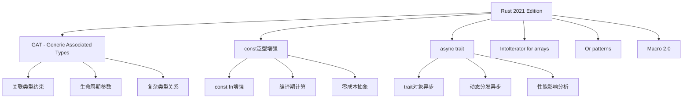

#### 📋 详细特性列表

| 特性类别 | 具体特性 | 重要性 | 当前覆盖 | 缺口严重程度 |
|---------|---------|--------|---------|-------------|
| **泛型系统** | GAT (Generic Associated Types) | ⭐⭐⭐⭐⭐ | ❌ | 严重 |
| **泛型系统** | const泛型增强 | ⭐⭐⭐⭐ | ❌ | 严重 |
| **异步编程** | async trait | ⭐⭐⭐⭐ | ❌ | 严重 |
| **迭代器** | IntoIterator for arrays | ⭐⭐⭐ | ❌ | 中等 |
| **模式匹配** | Or patterns | ⭐⭐⭐ | ❌ | 中等 |
| **宏系统** | Macro 2.0 | ⭐⭐⭐⭐ | ❌ | 严重 |
| **生命周期** | 生命周期省略增强 | ⭐⭐⭐ | ❌ | 中等 |
| **类型系统** | 类型别名impl Trait | ⭐⭐⭐ | ❌ | 中等 |

### 🔧 高级语言特性缺失

#### 1. 高级类型系统特性

```rust
// 缺失：GAT 深度分析
trait Container {
    type Item<T>;  // 关联类型参数化
    fn get<T>(&self) -> &Self::Item<T>;
}

// 缺失：const泛型高级用法
struct Matrix<T, const ROWS: usize, const COLS: usize> {
    data: [[T; COLS]; ROWS],
}

// 缺失：async trait 实现
trait AsyncProcessor {
    async fn process(&self, data: &[u8]) -> Result<Vec<u8>, Error>;
}
```

#### 2. 编译期计算与元编程

```rust
// 缺失：const fn 高级用法
const fn fibonacci(n: u32) -> u32 {
    match n {
        0 => 0,
        1 => 1,
        _ => fibonacci(n - 1) + fibonacci(n - 2),
    }
}

// 缺失：过程宏深度分析
#[proc_macro_attribute]
pub fn custom_attribute(attr: TokenStream, item: TokenStream) -> TokenStream {
    // 复杂的宏处理逻辑
}
```

### 📊 特性覆盖度分析

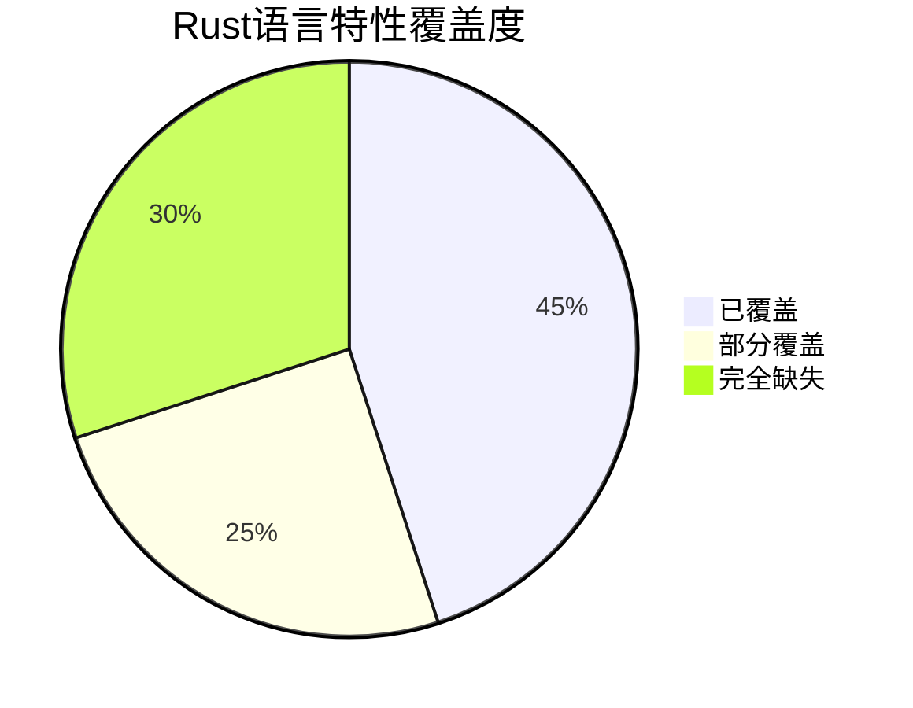

---

## 3. 理论视角缺失分析

### 🧠 认知科学视角

#### 缺失的认知分析框架

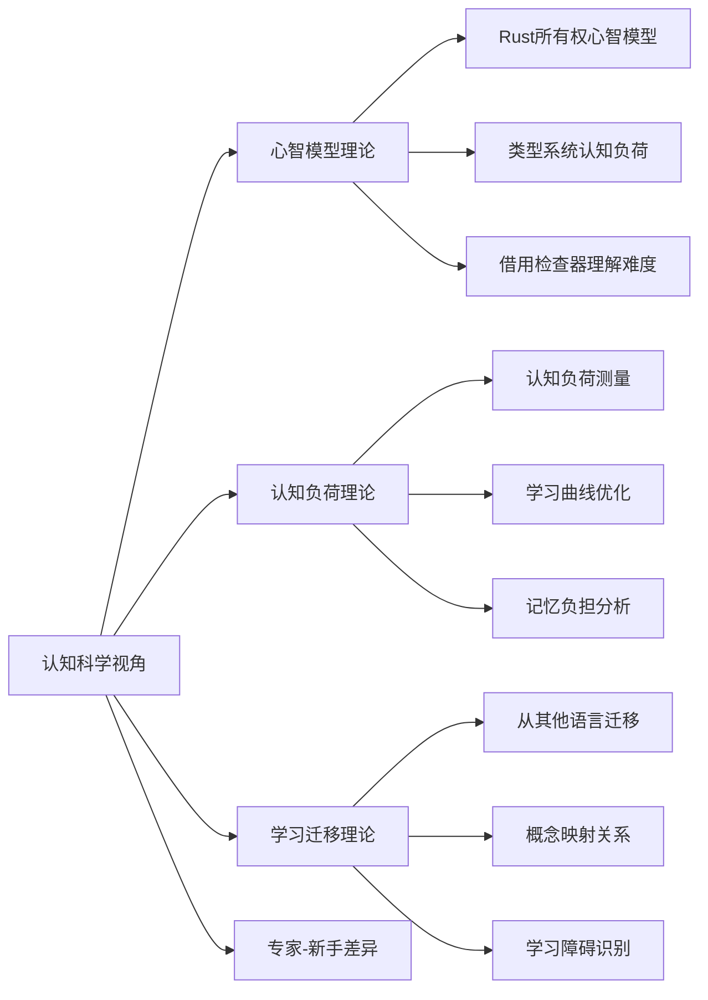

#### 认知科学分析示例

```rust
// 认知负荷分析：所有权转移
fn main() {
    let s1 = String::from("hello");
    let s2 = s1;  // 认知负荷点：所有权转移
    
    // 新手常见错误：尝试使用s1
    // println!("{}", s1);  // 编译错误
    
    // 专家理解：s1已被移动，不可再使用
    println!("{}", s2);
}
```

### 🔬 神经科学视角

#### 编程语言学习的神经机制

- **模式识别**: Rust类型系统的神经模式形成
- **工作记忆**: 借用检查器对工作记忆的要求
- **执行控制**: 所有权规则对执行控制的影响

### 📈 数据科学视角

#### 编程行为数据分析

```python
# 缺失：编程行为数据收集与分析
import pandas as pd
import numpy as np

# 编程错误模式分析
error_patterns = {
    'ownership_errors': 0.35,
    'lifetime_errors': 0.25,
    'type_errors': 0.20,
    'borrowing_errors': 0.20
}

# 学习曲线建模
def learning_curve(experience_hours):
    return 1 - np.exp(-experience_hours / 100)
```

### 🎭 语言学视角

#### 编程语言的语言学分析

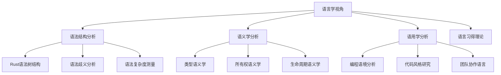

---

## 4. 应用领域扩展空间

### 🤖 AI/ML 与 Rust

#### 缺失的AI/ML应用分析

```mermaid
graph LR
    A[AI/ML应用] --> B[机器学习框架]
    A --> C[深度学习]
    A --> D[自然语言处理]
    A --> E[计算机视觉]
    
    B --> B1[tch-rs (PyTorch绑定)]
    B --> B2[rust-bert]
    B --> B3[burn]
    
    C --> C1[神经网络实现]
    C --> C2[自动微分]
    C --> C3[GPU加速]
    
    D --> D1[文本处理]
    D --> D2[语言模型]
    D --> D3[语义分析]
```

#### AI/ML Rust生态系统分析

```rust
// 缺失：AI/ML Rust代码示例
use tch::{nn, nn::Module, nn::OptimizerConfig, Device};

struct NeuralNetwork {
    layer1: nn::Linear,
    layer2: nn::Linear,
}

impl NeuralNetwork {
    fn forward(&self, xs: &tch::Tensor) -> tch::Tensor {
        xs.apply(&self.layer1).relu().apply(&self.layer2)
    }
}
```

### 🌐 分布式系统与微服务

#### 缺失的分布式系统分析

| 技术领域 | Rust实现 | 文档覆盖 | 重要性 |
|---------|---------|---------|--------|
| **服务网格** | Linkerd | ❌ | ⭐⭐⭐⭐⭐ |
| **服务发现** | Consul | ❌ | ⭐⭐⭐⭐ |
| **负载均衡** | HAProxy | ❌ | ⭐⭐⭐⭐ |
| **API网关** | Kong | ❌ | ⭐⭐⭐ |
| **消息队列** | RabbitMQ | ❌ | ⭐⭐⭐⭐ |

### 🔐 密码学与安全

#### 密码学应用分析

```rust
// 缺失：密码学应用示例
use ring::{aead, rand};

struct CryptoService {
    key: aead::UnboundKey,
    nonce: [u8; 12],
}

impl CryptoService {
    fn encrypt(&self, plaintext: &[u8]) -> Result<Vec<u8>, ring::error::Unspecified> {
        let mut ciphertext = plaintext.to_vec();
        let tag = aead::seal_in_place(&self.key, &self.nonce, &[], &mut ciphertext, 16)?;
        ciphertext.extend_from_slice(tag.as_ref());
        Ok(ciphertext)
    }
}
```

### 🎮 游戏开发

#### 游戏引擎与Rust

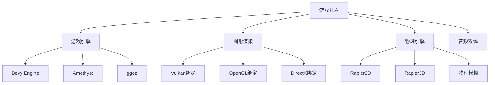

---

## 5. 教学与学习方法论缺失

### 📚 学习科学视角

#### 缺失的学习理论应用

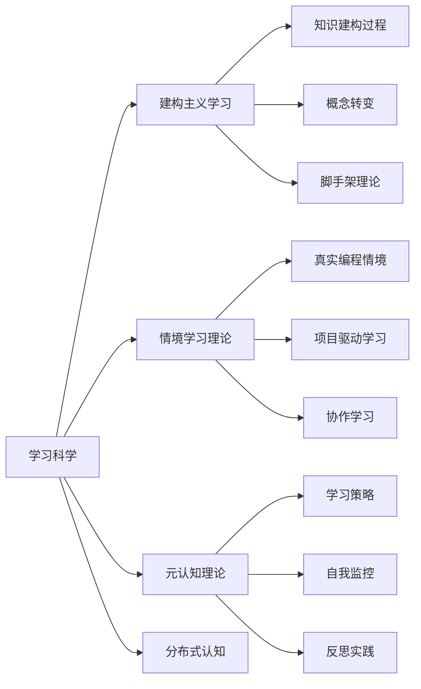

#### 学习路径设计缺失

```rust
// 缺失：个性化学习路径
#[derive(Debug)]
struct LearningPath {
    background: ProgrammingBackground,
    learning_style: LearningStyle,
    goals: Vec<LearningGoal>,
    current_level: SkillLevel,
}

enum ProgrammingBackground {
    Cpp,
    Java,
    Python,
    JavaScript,
    NoExperience,
}

enum LearningStyle {
    Visual,
    Auditory,
    Kinesthetic,
    Reading,
}
```

### 🎯 教学策略缺失

#### 1. 差异化教学策略

- **初学者路径**: 从基础概念到简单应用
- **中级开发者路径**: 深入理解核心机制
- **高级开发者路径**: 理论研究和前沿应用

#### 2. 评估与反馈机制

```rust
// 缺失：学习评估系统
struct LearningAssessment {
    concept_understanding: HashMap<String, f64>,
    practical_skills: HashMap<String, f64>,
    problem_solving: f64,
    theoretical_knowledge: f64,
}

impl LearningAssessment {
    fn generate_feedback(&self) -> Vec<FeedbackItem> {
        // 基于评估结果生成个性化反馈
    }
}
```

---

## 6. 工具链与生态系统分析

### 🔧 开发工具链缺失

#### 缺失的工具链分析

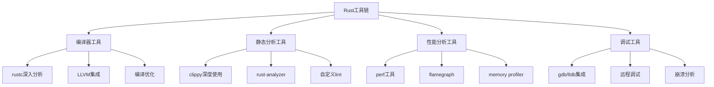

#### 工具链深度分析

```rust
// 缺失：编译器内部机制分析
// rustc编译过程深度分析
fn compile_process() {
    // 1. 词法分析 (Lexical Analysis)
    // 2. 语法分析 (Syntax Analysis)
    // 3. 语义分析 (Semantic Analysis)
    // 4. 借用检查 (Borrow Checking)
    // 5. 类型检查 (Type Checking)
    // 6. MIR生成 (Mid-level IR)
    // 7. LLVM IR生成
    // 8. 代码生成 (Code Generation)
}
```

### 📦 包管理与依赖分析

#### Cargo生态系统深度分析

```toml
# 缺失：Cargo.toml深度配置分析
[package]
name = "advanced_rust_project"
version = "0.1.0"
edition = "2021"

[dependencies]
# 依赖解析策略
# 版本冲突解决
# 特性标志使用
# 工作空间管理

[features]
# 条件编译
# 特性门控
# 可选依赖

[profile]
# 编译优化
# 调试信息
# 代码生成选项
```

---

## 7. 前沿技术与研究领域

### 🔬 形式化验证与证明

#### 缺失的形式化方法

```rust
// 缺失：形式化验证示例
#[cfg(test)]
mod formal_verification {
    use prusti_contracts::*;
    
    #[pure]
    #[ensures(result >= 0)]
    fn abs(x: i32) -> i32 {
        if x >= 0 { x } else { -x }
    }
    
    #[requires(x >= 0)]
    #[ensures(result == x)]
    fn sqrt(x: f64) -> f64 {
        // 牛顿法实现
        let mut guess = x / 2.0;
        for _ in 0..10 {
            guess = (guess + x / guess) / 2.0;
        }
        guess
    }
}
```

#### 形式化验证工具链

| 工具 | 用途 | 当前覆盖 | 重要性 |
|------|------|---------|--------|
| **Prusti** | 程序验证 | ❌ | ⭐⭐⭐⭐⭐ |
| **SMACK** | 模型检查 | ❌ | ⭐⭐⭐⭐ |
| **Creusot** | 形式化规约 | ❌ | ⭐⭐⭐⭐ |
| **Kani** | 模型检查 | ❌ | ⭐⭐⭐ |
| **MIRAI** | 静态分析 | ❌ | ⭐⭐⭐ |

### 🧮 量子计算与Rust

#### 量子编程语言集成

```rust
// 缺失：量子计算Rust示例
use quantum_rust::{Qubit, QuantumCircuit, Measurement};

struct QuantumAlgorithm {
    circuit: QuantumCircuit,
}

impl QuantumAlgorithm {
    fn grover_search(&mut self, oracle: impl Fn(&[Qubit]) -> bool) -> usize {
        // Grover搜索算法实现
        let n_qubits = 4;
        let mut qubits = vec![Qubit::new(); n_qubits];
        
        // 初始化叠加态
        for qubit in &mut qubits {
            qubit.hadamard();
        }
        
        // Oracle应用
        oracle(&qubits);
        
        // 测量结果
        qubits.iter().map(|q| q.measure()).collect::<Vec<bool>>()
    }
}
```

### 🌐 Web3与区块链深度分析

#### 智能合约开发

```rust
// 缺失：智能合约Rust实现
use ink_lang as ink;

#[ink::contract]
mod token {
    #[ink(storage)]
    pub struct Token {
        total_supply: Balance,
        balances: ink_storage::collections::HashMap<AccountId, Balance>,
        allowances: ink_storage::collections::HashMap<(AccountId, AccountId), Balance>,
    }
    
    impl Token {
        #[ink(constructor)]
        pub fn new(initial_supply: Balance) -> Self {
            let mut balances = ink_storage::collections::HashMap::new();
            balances.insert(Self::env().caller(), initial_supply);
            
            Self {
                total_supply: initial_supply,
                balances,
                allowances: ink_storage::collections::HashMap::new(),
            }
        }
        
        #[ink(message)]
        pub fn transfer(&mut self, to: AccountId, value: Balance) -> bool {
            // 转账逻辑实现
        }
    }
}
```

---

## 8. 跨语言比较与定位分析

### 🔄 语言比较框架缺失

#### 系统编程语言比较

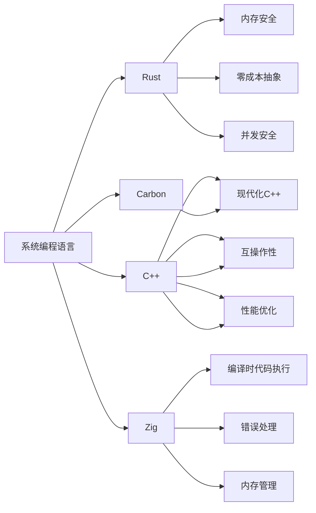

#### 语言特性对比矩阵

| 特性 | Rust | C++ | Zig | Carbon |
|------|------|-----|-----|--------|
| **内存安全** | 编译时保证 | 运行时检查 | 手动管理 | 运行时检查 |
| **并发安全** | 编译时保证 | 手动保证 | 手动保证 | 手动保证 |
| **零成本抽象** | ✅ | ✅ | ✅ | ✅ |
| **包管理** | Cargo | 多种工具 | 内置 | 计划中 |
| **编译速度** | 中等 | 慢 | 快 | 未知 |
| **学习曲线** | 陡峭 | 非常陡峭 | 中等 | 未知 |

### 🎯 语言定位分析

#### Rust在编程语言生态中的位置

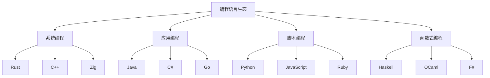

---

## 9. 性能与优化深度分析

### ⚡ 性能分析工具缺失

#### 性能分析框架

```rust
// 缺失：性能分析工具集成
use std::time::Instant;
use perf_event::{Builder, Group};

struct PerformanceProfiler {
    group: Group,
    events: Vec<perf_event::Counter>,
}

impl PerformanceProfiler {
    fn new() -> Self {
        let mut group = Group::new().unwrap();
        let events = vec![
            Builder::new()
                .kind(perf_event::events::Hardware::CPU_CYCLES)
                .build(&mut group)
                .unwrap(),
            Builder::new()
                .kind(perf_event::events::Hardware::CACHE_MISSES)
                .build(&mut group)
                .unwrap(),
        ];
        
        Self { group, events }
    }
    
    fn profile<F, R>(&mut self, f: F) -> (R, PerformanceMetrics)
    where
        F: FnOnce() -> R,
    {
        self.group.enable().unwrap();
        let start = Instant::now();
        let result = f();
        let duration = start.elapsed();
        self.group.disable().unwrap();
        
        let metrics = self.collect_metrics();
        (result, metrics)
    }
}
```

### 🔧 编译器优化分析

#### 缺失的优化技术分析

```rust
// 缺失：编译器优化深度分析
#[inline(always)]
fn optimized_function(x: i32) -> i32 {
    // 内联优化
    x * 2 + 1
}

#[target_feature(enable = "avx2")]
unsafe fn simd_optimized_function(data: &[f32]) -> Vec<f32> {
    // SIMD优化
    data.iter().map(|&x| x * 2.0).collect()
}

// 链接时优化 (LTO)
#[cfg(not(debug_assertions))]
#[link(name = "optimized_lib")]
extern "C" {
    fn external_optimized_function();
}
```

### 📊 性能基准测试缺失

#### 基准测试框架

```rust
// 缺失：综合基准测试
use criterion::{black_box, criterion_group, criterion_main, Criterion};

fn benchmark_ownership_transfer(c: &mut Criterion) {
    c.bench_function("ownership_transfer", |b| {
        b.iter(|| {
            let data = vec![1, 2, 3, 4, 5];
            let _moved = black_box(data);
        })
    });
}

fn benchmark_borrowing(c: &mut Criterion) {
    c.bench_function("borrowing", |b| {
        b.iter(|| {
            let data = vec![1, 2, 3, 4, 5];
            let _borrowed = black_box(&data);
        })
    });
}

criterion_group!(benches, benchmark_ownership_transfer, benchmark_borrowing);
criterion_main!(benches);
```

---

## 10. 安全与形式化验证

### 🛡️ 安全分析框架缺失

#### 安全漏洞分析

```rust
// 缺失：安全漏洞分析示例
// 常见安全漏洞模式
struct SecurityVulnerabilities {
    // 1. 缓冲区溢出
    buffer_overflow: Vec<u8>,
    
    // 2. 整数溢出
    integer_overflow: u32,
    
    // 3. 空指针解引用
    null_pointer: Option<Box<i32>>,
    
    // 4. 竞态条件
    race_condition: std::sync::Mutex<i32>,
}

impl SecurityVulnerabilities {
    fn demonstrate_vulnerabilities(&mut self) {
        // 演示各种安全漏洞
        self.buffer_overflow.push(0);
        
        // 整数溢出检查
        if let Some(result) = self.integer_overflow.checked_add(1) {
            self.integer_overflow = result;
        }
        
        // 安全的空指针处理
        if let Some(value) = &self.null_pointer {
            println!("Value: {}", value);
        }
    }
}
```

### 🔍 静态分析工具深度集成

#### 自定义静态分析

```rust
// 缺失：自定义静态分析工具
use syn::{parse_macro_input, ItemFn};
use proc_macro::TokenStream;

#[proc_macro_attribute]
pub fn security_check(_attr: TokenStream, item: TokenStream) -> TokenStream {
    let input = parse_macro_input!(item as ItemFn);
    
    // 安全检查逻辑
    let security_checks = quote! {
        // 自动插入安全检查代码
        if cfg!(debug_assertions) {
            // 调试模式下的额外检查
        }
    };
    
    // 返回修改后的代码
    TokenStream::from(quote! {
        #input
        #security_checks
    })
}
```

---

## 11. 社区与生态系统分析

### 👥 社区发展分析

#### 社区健康度指标

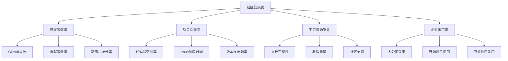

#### 生态系统成熟度分析

| 指标类别 | 具体指标 | 当前状态 | 改进空间 |
|---------|---------|---------|---------|
| **包生态系统** | crates.io包数量 | 良好 | 中等 |
| **工具链成熟度** | 开发工具完整性 | 良好 | 中等 |
| **学习资源** | 教程和文档质量 | 中等 | 较大 |
| **企业采用** | 大公司使用情况 | 中等 | 较大 |
| **社区活跃度** | 讨论和贡献频率 | 良好 | 中等 |

### 📈 发展趋势分析

#### Rust采用趋势

```rust
// 缺失：采用趋势分析
struct AdoptionTrends {
    // 开发者数量增长
    developer_growth: Vec<(Year, u32)>,
    
    // 项目数量增长
    project_growth: Vec<(Year, u32)>,
    
    // 企业采用情况
    enterprise_adoption: Vec<Company>,
    
    // 技术领域分布
    domain_distribution: HashMap<Domain, f64>,
}

#[derive(Debug)]
enum Domain {
    WebDevelopment,
    SystemsProgramming,
    EmbeddedSystems,
    WebAssembly,
    Blockchain,
    MachineLearning,
    GameDevelopment,
}
```

---

## 12. 综合改进建议

### 🎯 优先级改进矩阵

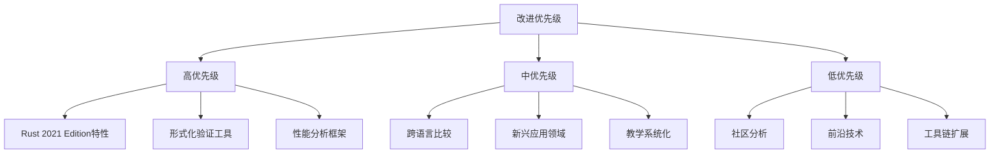

### 📋 具体改进计划

#### 第一阶段（1-3个月）

1. **语言特性更新**
   - 添加GAT深度分析
   - 实现async trait教程
   - 更新const泛型内容

2. **工具链集成**
   - 集成Prusti验证工具
   - 添加性能分析工具
   - 完善调试工具链

#### 第二阶段（3-6个月）

1. **理论框架扩展**
   - 添加认知科学视角
   - 实现语言学分析
   - 扩展形式化方法

2. **应用领域扩展**
   - AI/ML应用分析
   - 量子计算集成
   - 游戏开发教程

#### 第三阶段（6-12个月）

1. **教学系统化**
   - 个性化学习路径
   - 交互式学习元素
   - 评估反馈系统

2. **社区建设**
   - 社区健康度分析
   - 生态系统成熟度评估
   - 发展趋势预测

### 🔮 长期愿景

通过系统性的改进和扩展，将Rust文档集合发展成为：

1. **最全面的Rust学习资源**：涵盖从基础到前沿的所有内容
2. **最深入的理论分析**：提供多视角、多维度的理论框架
3. **最实用的指导材料**：结合理论与实践，提供可操作的指导
4. **最前沿的技术探索**：持续跟踪和集成最新技术发展
5. **最活跃的社区资源**：促进社区协作和知识共享

### 📝 总结

Rust文档集合虽然已经具备了相当的理论深度和实践价值，
但在语言特性覆盖、理论视角多样性、应用领域扩展、教学系统化等方面仍有巨大的改进空间。
通过系统性的改进和扩展，这套文档集合有潜力成为Rust生态系统中最具权威性和实用性的综合性学习资源。

关键是要在保持理论深度的同时，增强实用性；
在扩展覆盖范围的同时，保持内容质量；
在创新分析方法的同时，确保教学效果。

只有这样，才能真正满足不同背景、不同需求的Rust学习者和研究者的需要。
