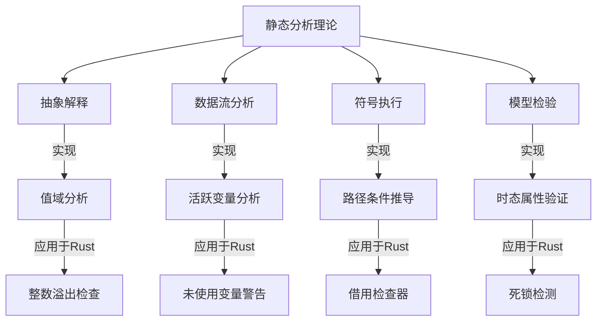
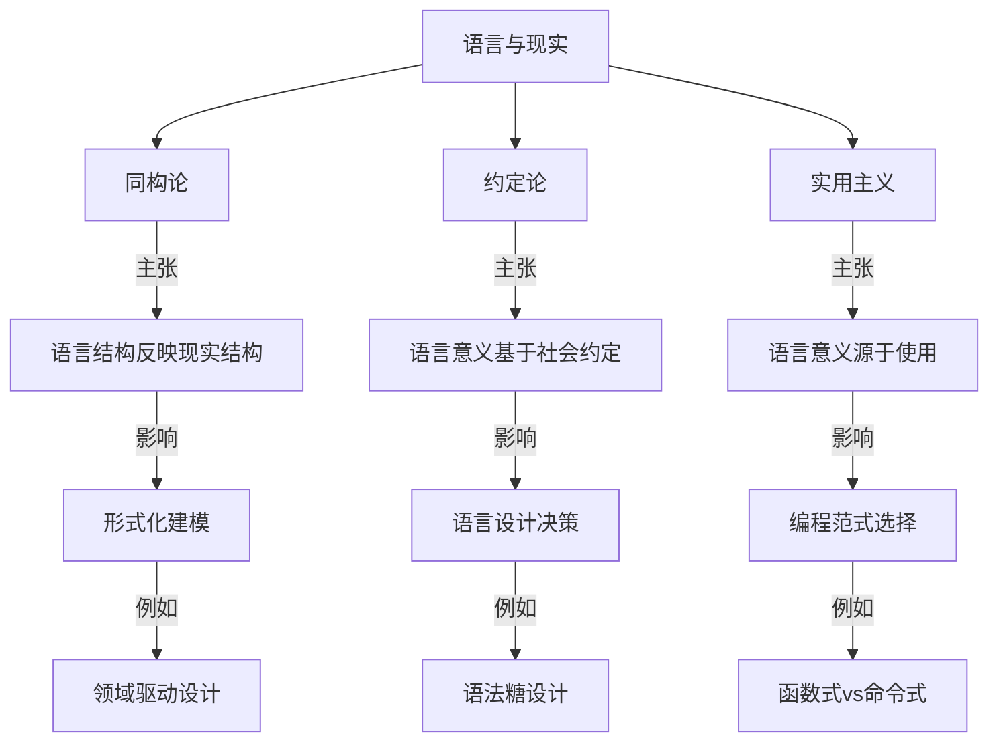

# 形式语言与计算机科学

## 形式语言与计算机科学的深层融合

### 形式语言与程序分析

#### 1. 静态分析的理论基础



静态分析技术在Rust中的应用：

```rust
// 抽象解释：编译器使用抽象域分析值的可能范围
fn abs_interpret_example(x: u32) -> u32 {
    // 编译器可以判断x+1可能溢出
    let y = x + 1; // 可能触发编译器警告
    y
}

// 数据流分析：编译器追踪变量的定义和使用
fn data_flow_example() {
    let x = 10;
    // 编译器可以检测到x未被使用
    // 会生成警告：unused variable `x`
    
    let mut y = 5;
    y = 20;
    // 编译器可以检测到y的第一次赋值被覆盖
    // 可能生成警告：value assigned to `y` is never read
}

// 符号执行：编译器模拟执行路径以验证属性
fn symbolic_exec_example(x: i32) -> bool {
    let y = if x > 0 { x } else { -x };
    // 编译器通过符号执行可以证明y始终非负
    y >= 0 // 这个条件总是为真
}

// 模型检验：验证并发系统的属性
use std::sync::{Arc, Mutex};
use std::thread;

fn model_checking_example() {
    let data = Arc::new(Mutex::new(0));
    
    let data1 = Arc::clone(&data);
    let t1 = thread::spawn(move || {
        let mut d = data1.lock().unwrap();
        *d += 1;
    });
    
    let data2 = Arc::clone(&data);
    let t2 = thread::spawn(move || {
        let mut d = data2.lock().unwrap();
        *d += 1;
    });
    
    t1.join().unwrap();
    t2.join().unwrap();
    
    // 理论上，编译器或分析工具可以验证这里不存在数据竞争
    assert_eq!(*data.lock().unwrap(), 2);
}
```

#### 2. 程序逻辑与验证条件生成

```rust
// 假设的程序验证扩展语法

// 前置条件、后置条件和不变量
#[requires(n >= 0)]
#[ensures(result == n * (n + 1) / 2)]
fn sum_up_to(n: i32) -> i32 {
    let mut sum = 0;
    let mut i = 0;
    
    #[invariant(sum == i * (i + 1) / 2)]
    #[invariant(0 <= i && i <= n)]
    while i <= n {
        sum += i;
        i += 1;
    }
    
    sum
}

// 验证条件生成过程
// 1. 入口处验证前置条件: n >= 0
// 2. 循环入口处验证初始状态满足不变量: 
//    - 0 == 0 * (0 + 1) / 2 (成立)
//    - 0 <= 0 && 0 <= n (成立，因为n >= 0)
// 3. 循环体验证保持不变量:
//    - 假设 sum == i * (i + 1) / 2 且 0 <= i && i <= n
//    - 执行 sum += i; i += 1;
//    - 验证 sum == i * (i + 1) / 2 且 0 <= i && i <= n 仍然成立
// 4. 循环结束时验证后置条件:
//    - 循环结束条件: i > n
//    - 结合不变量: sum == i * (i + 1) / 2 且 i == n + 1
//    - 推导: sum == (n + 1) * (n + 2) / 2 - (n + 1) == n * (n + 1) / 2
```

### 形式语言与类型系统的高级应用

#### 1. 高级类型系统特性

```rust
// 高级类型系统特性及其应用

// 1. 高阶类型多态 (Higher-Kinded Types)
// 目前Rust不直接支持，但可以通过特质关联类型模拟
trait HigherKinded {
    type Applied<T>;
}

struct OptionHKT;
impl HigherKinded for OptionHKT {
    type Applied<T> = Option<T>;
}

struct VecHKT;
impl HigherKinded for VecHKT {
    type Applied<T> = Vec<T>;
}

// 2. 类型级编程 (Type-Level Programming)
// 使用特质和关联类型进行编译时计算
trait Nat {
    const VALUE: usize;
}

struct Zero;
impl Nat for Zero {
    const VALUE: usize = 0;
}

struct Succ<N: Nat>;
impl<N: Nat> Nat for Succ<N> {
    const VALUE: usize = N::VALUE + 1;
}

// 类型级加法
trait Add<B> {
    type Sum;
}

impl<B: Nat> Add<B> for Zero {
    type Sum = B;
}

impl<N: Nat, B: Nat> Add<B> for Succ<N>
where
    N: Add<B>,
{
    type Sum = Succ<N::Sum>;
}

// 3. 会话类型 (Session Types)
// 使用类型系统确保通信协议的正确性
struct Send<T, Cont>(PhantomData<(T, Cont)>);
struct Recv<T, Cont>(PhantomData<(T, Cont)>);
struct End;

// 客户端协议：发送请求，接收响应，结束
type ClientProtocol = Send<Request, Recv<Response, End>>;

// 服务器协议：接收请求，发送响应，结束
type ServerProtocol = Recv<Request, Send<Response, End>>;

// 4. 效果系统 (Effect Systems)
// 在类型级别跟踪函数的副作用
trait Pure<Output> {
    fn run(self) -> Output;
}

trait IOEffect<Output> {
    fn run(self) -> Output;
}

trait StateEffect<S, Output> {
    fn run(self, state: S) -> (Output, S);
}

// 纯函数
fn pure_fn(x: i32) -> impl Pure<i32> {
    struct PureFn(i32);
    impl Pure<i32> for PureFn {
        fn run(self) -> i32 {
            self.0 * 2
        }
    }
    PureFn(x)
}

// IO函数
fn io_fn() -> impl IOEffect<String> {
    struct IoFn;
    impl IOEffect<String> for IoFn {
        fn run(self) -> String {
            std::fs::read_to_string("file.txt").unwrap_or_default()
        }
    }
    IoFn
}
```

#### 2. 类型驱动开发与形式化设计

```rust
// 类型驱动开发：使用类型系统指导程序设计

// 1. 状态机建模
enum ConnectionState {
    Disconnected,
    Connecting,
    Connected,
    Closing,
}

// 使用幻影类型参数表示状态
struct Connection<S> {
    socket: TcpStream,
    _state: PhantomData<S>,
}

// 只在断开状态下允许连接
impl Connection<Disconnected> {
    fn new() -> Self {
        Connection {
            socket: /* 创建未连接的套接字 */,
            _state: PhantomData,
        }
    }
    
    fn connect(self, addr: &str) -> Result<Connection<Connected>, Error> {
        // 连接逻辑
        Ok(Connection {
            socket: self.socket,
            _state: PhantomData,
        })
    }
}

// 只在连接状态下允许发送数据
impl Connection<Connected> {
    fn send(&mut self, data: &[u8]) -> Result<(), Error> {
        // 发送逻辑
        Ok(())
    }
    
    fn close(self) -> Connection<Closing> {
        Connection {
            socket: self.socket,
            _state: PhantomData,
        }
    }
}

// 2. API设计与类型安全
// 使用类型系统防止误用API
struct DatabaseConnection {
    // 内部实现
}

// 查询构建器，确保类型安全的SQL构造
struct QueryBuilder<'a, State> {
    conn: &'a DatabaseConnection,
    query: String,
    _state: PhantomData<State>,
}

// 查询状态标记
struct Initial;
struct Selected;
struct WhereApplied;
struct Finalized;

impl<'a> QueryBuilder<'a, Initial> {
    fn new(conn: &'a DatabaseConnection) -> Self {
        QueryBuilder {
            conn,
            query: String::new(),
            _state: PhantomData,
        }
    }
    
    fn select(self, columns: &str) -> QueryBuilder<'a, Selected> {
        let query = format!("SELECT {} ", columns);
        QueryBuilder {
            conn: self.conn,
            query,
            _state: PhantomData,
        }
    }
}

impl<'a> QueryBuilder<'a, Selected> {
    fn from(mut self, table: &str) -> Self {
        self.query.push_str(&format!("FROM {} ", table));
        self
    }
    
    fn where_clause(self, condition: &str) -> QueryBuilder<'a, WhereApplied> {
        let query = format!("{}WHERE {} ", self.query, condition);
        QueryBuilder {
            conn: self.conn,
            query,
            _state: PhantomData,
        }
    }
    
    fn finalize(self) -> QueryBuilder<'a, Finalized> {
        QueryBuilder {
            conn: self.conn,
            query: self.query,
            _state: PhantomData,
        }
    }
}

impl<'a> QueryBuilder<'a, WhereApplied> {
    fn and(mut self, condition: &str) -> Self {
        self.query.push_str(&format!("AND {} ", condition));
        self
    }
    
    fn finalize(self) -> QueryBuilder<'a, Finalized> {
        QueryBuilder {
            conn: self.conn,
            query: self.query,
            _state: PhantomData,
        }
    }
}

impl<'a> QueryBuilder<'a, Finalized> {
    fn execute(self) -> Result<Vec<Row>, Error> {
        // 执行查询
        // ...
    }
}

// 使用示例
fn query_example(conn: &DatabaseConnection) -> Result<Vec<Row>, Error> {
    QueryBuilder::new(conn)
        .select("id, name")
        .from("users")
        .where_clause("age > 18")
        .and("status = 'active'")
        .finalize()
        .execute()
}
```

### 形式语言与领域特定语言

#### 1. 嵌入式DSL的形式化基础

```rust
// 嵌入式DSL的形式化设计

// 1. 表达式DSL
// 使用代数数据类型表示表达式语法树
enum Expr {
    Lit(i32),
    Add(Box<Expr>, Box<Expr>),
    Sub(Box<Expr>, Box<Expr>),
    Mul(Box<Expr>, Box<Expr>),
    Div(Box<Expr>, Box<Expr>),
    Var(String),
}

// 使用运算符重载提供自然语法
use std::ops::{Add, Sub, Mul, Div};

impl Add for Expr {
    type Output = Expr;
    fn add(self, rhs: Expr) -> Expr {
        Expr::Add(Box::new(self), Box::new(rhs))
    }
}

impl Sub for Expr {
    type Output = Expr;
    fn sub(self, rhs: Expr) -> Expr {
        Expr::Sub(Box::new(self), Box::new(rhs))
    }
}

// 2. 查询DSL
// 使用构建器模式和方法链
struct Query {
    select_clause: Option<String>,
    from_clause: Option<String>,
    where_clauses: Vec<String>,
    order_by: Option<String>,
    limit: Option<usize>,
}

impl Query {
    fn new() -> Self {
        Query {
            select_clause: None,
            from_clause: None,
            where_clauses: Vec::new(),
            order_by: None,
            limit: None,
        }
    }
    
    fn select(mut self, columns: &str) -> Self {
        self.select_clause = Some(columns.to_string());
        self
    }
    
    fn from(mut self, table: &str) -> Self {
        self.from_clause = Some(table.to_string());
        self
    }
    
    fn where_clause(mut self, condition: &str) -> Self {
        self.where_clauses.push(condition.to_string());
        self
    }
    
    fn order_by(mut self, column: &str) -> Self {
        self.order_by = Some(column.to_string());
        self
    }
    
    fn limit(mut self, n: usize) -> Self {
        self.limit = Some(n);
        self
    }
    
    fn build(&self) -> String {
        let mut query = format!("SELECT {} ", self.select_clause.as_ref().unwrap_or(&"*".to_string()));
        
        if let Some(from) = &self.from_clause {
            query.push_str(&format!("FROM {} ", from));
        }
        
        if !self.where_clauses.is_empty() {
            query.push_str("WHERE ");
            query.push_str(&self.where_clauses.join(" AND "));
            query.push(' ');
        }
        
        if let Some(order) = &self.order_by {
            query.push_str(&format!("ORDER BY {} ", order));
        }
        
        if let Some(limit) = self.limit {
            query.push_str(&format!("LIMIT {}", limit));
        }
        
        query
    }
}

// 3. 状态机DSL
// 使用宏系统提供声明式语法
macro_rules! state_machine {
    (
        states: { $($state:ident),* },
        events: { $($event:ident),* },
        transitions: {
            $($from:ident + $event_name:ident => $to:ident),*
        }
    ) => {
        // 生成状态和事件枚举
        #[derive(Debug, PartialEq, Eq, Clone, Copy)]
        enum State { $($state),* }
        
        #[derive(Debug, PartialEq, Eq)]
        enum Event { $($event),* }
        
        // 生成状态机结构
        struct StateMachine {
            current: State,
        }
        
        impl StateMachine {
            fn new(initial: State) -> Self {
                StateMachine { current: initial }
            }
            
            fn process(&mut self, event: Event) -> Result<(), &'static str> {
                match (self.current, event) {
                    $(
                        (State::$from, Event::$event_name) => {
                            self.current = State::$to;
                            Ok(())
                        }
                    ),*
                    _ => Err("Invalid transition")
                }
            }
            
            fn state(&self) -> State {
                self.current
            }
        }
    };
}

// 使用状态机DSL
state_machine! {
    states: { Idle, Active, Paused, Terminated },
    events: { Start, Pause, Resume, Stop },
    transitions: {
        Idle + Start => Active,
        Active + Pause => Paused,
        Paused + Resume => Active,
        Active + Stop => Terminated,
        Paused + Stop => Terminated
    }
}
```

#### 2. DSL语义的形式化定义

```rust
// DSL语义的形式化定义

// 1. 操作语义 (Operational Semantics)
// 定义DSL表达式的求值规则
trait Evaluate {
    type Output;
    fn evaluate(&self, env: &Environment) -> Result<Self::Output, EvalError>;
}

impl Evaluate for Expr {
    type Output = i32;
    
    fn evaluate(&self, env: &Environment) -> Result<i32, EvalError> {
        match self {
            Expr::Lit(n) => Ok(*n),
            Expr::Add(lhs, rhs) => {
                let lval = lhs.evaluate(env)?;
                let rval = rhs.evaluate(env)?;
                Ok(lval + rval)
            },
            Expr::Sub(lhs, rhs) => {
                let lval = lhs.evaluate(env)?;
                let rval = rhs.evaluate(env)?;
                Ok(lval - rval)
            },
            Expr::Mul(lhs, rhs) => {
                let lval = lhs.evaluate(env)?;
                let rval = rhs.evaluate(env)?;
                Ok(lval * rval)
            },
            Expr::Div(lhs, rhs) => {
                let lval = lhs.evaluate(env)?;
                let rval = rhs.evaluate(env)?;
                if rval == 0 {
                    Err(EvalError::DivisionByZero)
                } else {
                    Ok(lval / rval)
                }
            },
            Expr::Var(name) => {
                env.get(name).ok_or(EvalError::UndefinedVariable(name.clone()))
            }
        }
    }
}

// 2. 指称语义 (Denotational Semantics)
// 将DSL表达式映射到语义域
trait Denote {
    type Denotation;
    fn denote(&self) -> Self::Denotation;
}

impl Denote for Expr {
    // 表达式的语义是一个从环境到值的函数
    type Denotation = Box<dyn Fn(&Environment) -> Result<i32, EvalError>>;
    
    fn denote(&self) -> Self::Denotation {
        match self {
            Expr::Lit(n) => {
                let n = *n;
                Box::new(move |_| Ok(n))
            },
            Expr::Add(lhs, rhs) => {
                let lhs_den = lhs.denote();
                let rhs_den = rhs.denote();
                Box::new(move |env| {
                    let lval = lhs_den(env)?;
                    let rval = rhs_den(env)?;
                    Ok(lval + rval)
                })
            },
            // 其他情况类似...
            _ => unimplemented!(),
        }
    }
}

// 3. 公理语义 (Axiomatic Semantics)
// 使用前置条件和后置条件定义DSL语义
trait AxiomaticSemantics {
    // 前置条件：执行前必须满足的条件
    fn precondition(&self) -> Predicate;
    
    // 后置条件：执行后保证满足的条件
    fn postcondition(&self) -> Predicate;
    
    // 最弱前置条件：给定后置条件，计算最弱的前置条件
    fn weakest_precondition(&self, post: Predicate) -> Predicate;
}
```

## 形式语言与人工智能的交叉

### 类型系统与机器学习

```rust
// 类型安全的机器学习框架

// 1. 张量类型
// 使用类型参数表示张量维度和元素类型
struct Tensor<T, Dims> {
    data: Vec<T>,
    shape: PhantomData<Dims>,
}

// 标记类型表示维度
struct Dim<const N: usize>;

// 2D张量
type Matrix<T, const ROWS: usize, const COLS: usize> = 
    Tensor<T, (Dim<ROWS>, Dim<COLS>)>;

// 3D张量
type Volume<T, const DEPTH: usize, const HEIGHT: usize, const WIDTH: usize> = 
    Tensor<T, (Dim<DEPTH>, Dim<HEIGHT>, Dim<WIDTH>)>;

// 2. 类型安全的矩阵乘法
// 只有当维度匹配时才允许乘法
trait MatMul<B> {
    type Output;
    fn matmul(self, other: B) -> Self::Output;
}

impl<T, const M: usize, const N: usize, const K: usize> 
    MatMul<Matrix<T, N, K>> for Matrix<T, M, N>
where
    T: std::ops::Mul<Output = T> + std::ops::AddAssign + Default + Copy,
{
    type Output = Matrix<T, M, K>;
    
    fn matmul(self, other: Matrix<T, N, K>) -> Matrix<T, M, K> {
        // 实现矩阵乘法
        // ...
        unimplemented!()
    }
}

// 3. 神经网络层的类型安全表示
struct Linear<const IN: usize, const OUT: usize> {
    weights: Matrix<f32, IN, OUT>,
    bias: Matrix<f32, 1, OUT>,
}

impl<const IN: usize, const OUT: usize> Linear<IN, OUT> {
    fn new() -> Self {
        // 初始化权重和偏置
        unimplemented!()
    }
    
    fn forward(&self, input: Matrix<f32, 1, IN>) -> Matrix<f32, 1, OUT> {
        // 前向传播
        let output = input.matmul(self.weights);
        // 添加偏置
        // ...
        unimplemented!()
    }
}

// 4. 类型级神经网络架构
trait Layer {
    type Input;
    type Output;
    
    fn forward(&self, input: Self::Input) -> Self::Output;
}

impl<const IN: usize, const OUT: usize> Layer for Linear<IN, OUT> {
    type Input = Matrix<f32, 1, IN>;
    type Output = Matrix<f32, 1, OUT>;
    
    fn forward(&self, input: Self::Input) -> Self::Output {
        self.forward(input)
    }
}

// 序列模型：确保层之间的连接类型安全
struct Sequential<L1, L2>
where
    L1: Layer,
    L2: Layer<Input = L1::Output>,
{
    layer1: L1,
    layer2: L2,
}

impl<L1, L2> Layer for Sequential<L1, L2>
where
    L1: Layer,
    L2: Layer<Input = L1::Output>,
{
    type Input = L1::Input;
    type Output = L2::Output;
    
    fn forward(&self, input: Self::Input) -> Self::Output {
        let intermediate = self.layer1.forward(input);
        self.layer2.forward(intermediate)
    }
}
```

### 形式语言与自然语言处理

```rust
// 形式语言在NLP中的应用

// 1. 上下文无关文法解析器
struct CFGParser {
    rules: HashMap<String, Vec<Vec<String>>>,
}

impl CFGParser {
    fn new() -> Self {
        CFGParser {
            rules: HashMap::new(),
        }
    }
    
    fn add_rule(&mut self, non_terminal: &str, production: Vec<String>) {
        self.rules
            .entry(non_terminal.to_string())
            .or_insert_with(Vec::new)
            .push(production);
    }
    
    fn parse(&self, input: &[String]) -> Option<ParseTree> {
        // 实现CYK算法或Earley算法
        // ...
        unimplemented!()
    }
}

// 2. 类型化的语义分析
// 使用代数数据类型表示语义结构
enum Semantics {
    Entity(String),
    Predicate(Box<Semantics>, Box<Semantics>),
    Quantifier(Quantifier, String, Box<Semantics>),
    Conjunction(Box<Semantics>, Box<Semantics>),
    Disjunction(Box<Semantics>, Box<Semantics>),
    Negation(Box<Semantics>),
}

enum Quantifier {
    Universal,  // ∀
    Existential, // ∃
}

// 3. 形式化的语义组合
trait Compose<T> {
    type Output;
    fn compose(self, other: T) -> Self::Output;
}

// 函数应用组合规则
impl Compose<Semantics> for Semantics {
    type Output = Semantics;
    
    fn compose(self, arg: Semantics) -> Semantics {
        match self {
            Semantics::Predicate(pred, _) => {
                Semantics::Predicate(pred, Box::new(arg))
            },
            // 其他组合规则...
            _ => panic!("Invalid semantic composition"),
        }
    }
}
```

## 形式语言与哲学的深层联系

### 语言与现实的对应理论



#### 1. 维特根斯坦的语言游戏理论与编程语言

```rust
// 维特根斯坦的语言游戏理论应用于编程语言设计

// 1. 不同语言游戏有不同规则
// Rust的所有权语言游戏
fn ownership_game() {
    let s = String::from("hello");
    takes_ownership(s);
    // 在此语言游戏中，s不再有效
    // println!("{}", s); // 编译错误
}

fn takes_ownership(s: String) {
    println!("{}", s);
} // s离开作用域并被丢弃

// JavaScript的引用语言游戏（伪代码）
// function referenceGame() {
//     let s = "hello";
//     takesReference(s);
//     console.log(s); // 仍然有效
// }

// 2. 语言游戏的规则由社区共识决定
// Rust命名约定：蛇形命名法
fn snake_case_function() {
    let some_variable = 5;
    // ...
}

// 类型名称使用大驼峰命名法
struct UserAccount {
    username: String,
    email: String,
}

// 3. 语言游戏的边界与模糊性
// Rust中的"安全"概念
fn safe_code() {
    let mut v = vec![1, 2, 3];
    v.push(4);
    // 安全的边界内
}

fn unsafe_code() {
    let address = 0x012345usize;
    let r = unsafe { 
        // 跨越安全边界
        *(address as *const i32)
    };
}
```

#### 2. 语言相对论与编程范式


```rust
// Sapir-Whorf假说在编程语言中的体现

// 1. 不