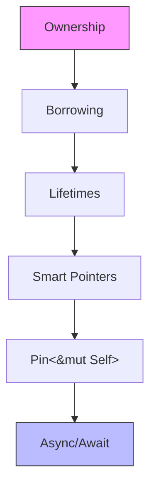

# Rust 知识体系内容重构总体规划

> **Bloom 层级**: L2 (理解)

> **战略定位**: 双轨并行 —— 核心知识体系深度重构 + safety_critical 专项持续演进
> **版本**: Rust 1.96.0+ | Edition 2024
> **规划日期**: 2026-05-09

---

## 📑 目录
>
- [Rust 知识体系内容重构总体规划](#rust-知识体系内容重构总体规划)
  - [📑 目录](#目录)
  - [一、内容标准模板（Concept Document Standard Template）](#一内容标准模板concept-document-standard-template)
    - [模块 1: 概念定义（Concept Definition）](#模块-1-概念定义concept-definition)
    - [模块 2: 属性清单（Property Inventory）](#模块-2-属性清单property-inventory)
    - [模块 3: 概念依赖图（Concept Dependency Graph）](#模块-3-概念依赖图concept-dependency-graph)
    - [模块 4: 机制解释（Mechanistic Explanation）](#模块-4-机制解释mechanistic-explanation)
    - [模块 5: 正例集（Positive Examples）](#模块-5-正例集positive-examples)
    - [模块 6: 反例集（Counterexamples \& Anti-patterns）](#模块-6-反例集counterexamples--anti-patterns)
    - [模块 7: 思维表征套件（Multi-modal Representations）](#模块-7-思维表征套件multi-modal-representations)
    - [模块 8: 国际化对齐（International Alignment）](#模块-8-国际化对齐international-alignment)
    - [模块 9: 设计权衡分析（Trade-off Analysis）](#模块-9-设计权衡分析trade-off-analysis)
    - [模块 10: 自我检测与练习（Self-assessment）](#模块-10-自我检测与练习self-assessment)
  - [二、双轨并行执行路线图](#二双轨并行执行路线图)
    - [轨道 A：核心知识体系重构（Track A: Core Knowledge）](#轨道-a核心知识体系重构track-a-core-knowledge)
      - [Phase A1: P0 急救（第 1-2 周）](#phase-a1-p0-急救第-1-2-周)
      - [Phase A2: 中级层加固（第 3-4 周）](#phase-a2-中级层加固第-3-4-周)
      - [Phase A3: 高级层补全（第 5-6 周）](#phase-a3-高级层补全第-5-6-周)
      - [Phase A4: 专家层重构（第 7-8 周）](#phase-a4-专家层重构第-7-8-周)
    - [轨道 B：safety\_critical 持续演进（Track B: Safety Critical）](#轨道-bsafety_critical-持续演进track-b-safety-critical)
      - [Phase B1: 表征范式标准化（与 Track A Phase A1 同步）](#phase-b1-表征范式标准化与-track-a-phase-a1-同步)
      - [Phase B2: 跨轨关联（第 3-4 周）](#phase-b2-跨轨关联第-3-4-周)
      - [Phase B3: 标准对齐深化（第 5-8 周）](#phase-b3-标准对齐深化第-5-8-周)
  - [三、质量控制与验收标准](#三质量控制与验收标准)
    - [3.1 自动化检查清单](#31-自动化检查清单)
    - [3.2 人工审阅维度](#32-人工审阅维度)
  - [四、第一批交付计划（P0 急救包）](#四第一批交付计划p0-急救包)
    - [交付 1: `async_await.md` 重构](#交付-1-async_awaitmd-重构)
    - [交付 2: `threads.md` 重构](#交付-2-threadsmd-重构)
    - [交付 3: `unsafe_rust.md` 重构](#交付-3-unsafe_rustmd-重构)
  - [五、风险与应对](#五风险与应对)
  - [六、立即行动项（Next Steps）](#六立即行动项next-steps)
  - **状态**: 待确认
  - [相关概念](#相关概念)
  - [权威来源索引](#权威来源索引)

## 一、内容标准模板（Concept Document Standard Template）
>
> **[来源: Rust Official Docs]**

每篇核心知识文档必须包含以下 10 个模块。缺失任一模块视为"未完成"。

### 模块 1: 概念定义（Concept Definition）

> **[来源: Wikipedia - Rust (programming language)]**
>
> **[来源: Rust Official Docs]**

**要求**：提供三层定义，由浅入深

1. **直观定义**（Intuitive）：用一句话向初学者解释
2. **操作定义**（Operational）：通过代码行为刻画概念边界
3. **形式化直觉**（Formal Intuition）：对齐类型理论/内存模型的精确表述（不要求完整证明，但要求公理化方向）

**示例（所有权）**:

- 直观："所有权决定谁负责释放一块内存"
- 操作："赋值转移、函数传参转移、作用域结束自动调用 Drop"
- 形式化直觉："Affine Type System 的 Rust 实现：每个值至少有一个 owner，至多有一个 owner，owner 离开作用域时析构"

### 模块 2: 属性清单（Property Inventory）

> **[来源: Rust Reference - doc.rust-lang.org/reference]**
>
> **[来源: Rust Official Docs]**

**要求**：用表格列出概念的固有属性与关系属性

| 属性名 | 类型 | 值域 | 说明 | 反例边界 |
|--------|------|------|------|----------|
| e.g. `Copy` 的传递性 | 关系属性 | bool | 仅当所有字段都实现 Copy | `struct Wrapper(String)` 不实现 Copy |

### 模块 3: 概念依赖图（Concept Dependency Graph）

> **[来源: TRPL - The Rust Programming Language]**
>
> **[来源: Rust Official Docs]**

**要求**：Mermaid 图，明确承上启下

### 模块 4: 机制解释（Mechanistic Explanation）

> **[来源: Rustonomicon - doc.rust-lang.org/nomicon]**
>
> **[来源: Rust Official Docs]**

**要求**：从至少 2 个视角解释"为什么这样设计"与"编译器如何实现"

- **类型系统视角**：该特性在 HM 推断 / 子类型 / trait solving 中的位置
- **内存模型视角**：Stacked Borrows / Tree Borrows / LLVM IR 层面的体现
- **运行时视角**：vtable 布局、monomorphization 结果、零成本抽象的物理含义

### 模块 5: 正例集（Positive Examples）

> **[来源: ACM - Systems Programming Languages]**
>
> **[来源: Rust Official Docs]**

**要求**：3 个层级，渐进式复杂度

1. **Minimal**： stripped-down 到最少代码行，突出核心机制
2. **Realistic**：接近真实场景的用法
3. **Production-grade**：包含错误处理、边界条件、性能考量

### 模块 6: 反例集（Counterexamples & Anti-patterns）

> **[来源: IEEE - Programming Language Standards]**
>
> **[来源: Rust Official Docs]**

**要求**：系统化反例，每例包含

1. **错误代码**（编译失败或逻辑错误）
2. **编译器错误信息**（精确到错误码，如 E0106）
3. **根因推导**（为什么错？触及了哪条规则？）
4. **修复方案**（至少 2 种，含 trade-off 分析）
5. **抽象原则**（从该反例提炼出的通用模式）

### 模块 7: 思维表征套件（Multi-modal Representations）

> **[来源: RFCs - github.com/rust-lang/rfcs]**
>
> **[来源: Rust Official Docs]**

**要求**：每篇文档至少包含 2 种非纯文本表征

| 表征类型 | 适用场景 | 工具/格式 |
|----------|----------|-----------|
| 思维导图 | 概念分支与关联 | Mermaid / ASCII |
| 多维概念矩阵 | 对比、正交性分析 | Markdown 表格 |
| 决策树 | "何时用 X 而非 Y" | ASCII / Mermaid |
| 状态转换图 | 生命周期、Future 状态 | Mermaid stateDiagram |
| 内存布局图 | 栈/堆、指针关系 | ASCII / SVG |
| 推理判断树 | 编译器推导过程 | ASCII / Mermaid |

### 模块 8: 国际化对齐（International Alignment）

> **[来源: Rust Standard Library - doc.rust-lang.org/std]**

**要求**：每篇文档建立"权威来源映射"

- **官方来源**：Rust Book 章节、Reference 条目、RFC 编号
- **学术来源**：PLDI/POPL/ICFP 论文（如适用），要求简述论文核心论证与本文档的对应关系
- **社区权威**：Niko Matsakis, Ralf Jung, Jon Gjengset, Without Boats 等的关键文章/演讲
- **跨语言对比**：与 C++/Haskell/Ada/Go 的同质概念对比（如适用）

### 模块 9: 设计权衡分析（Trade-off Analysis）

> **[来源: POPL - Programming Languages Research]**
>
> **[来源: Rust Official Docs]**

**要求**：回答以下问题

1. Rust 为什么选择了这个设计？放弃了什么替代方案？
2. 该设计的成本是什么？（编译时间、学习曲线、表达力限制）
3. 什么场景下这个设计是次优的？（承认限制，而非盲目推崇）

### 模块 10: 自我检测与练习（Self-assessment）

> **[来源: Wikipedia - Rust (programming language)]**
>
> **[来源: Rust Official Docs]**

**要求**：

- 3 个概念性问题（考察定义与机制理解）
- 2 个代码修复题（反例诊断）
- 1 个设计题（开放 trade-off 讨论）

---

## 二、双轨并行执行路线图
>
> **[来源: Rust Official Docs]**

### 轨道 A：核心知识体系重构（Track A: Core Knowledge）

> **[来源: Wikipedia - Concurrency]**

#### Phase A1: P0 急救（第 1-2 周）

> **[来源: Wikipedia - Asynchronous I/O]**

目标：抢救"下游依赖最多、当前最薄弱"的文档

| 优先级 | 文档路径 | 当前行数 | 目标行数 | 核心增补内容 | 表征要求 |
|--------|----------|----------|----------|--------------|----------|
| P0 | `03_advanced/async/async_await.md` | 42 | 650+ | Future状态机、Pin/Unpin、Waker、运行时对比(tokio/async-std/smol)、spawn与JoinHandle、取消语义 | 状态图+决策树 |
| P0 | `03_advanced/concurrency/threads.md` | 48 | 550+ | Send/Sync形式化定义、数据竞争模型、scoped threads (1.63)、thread-local、park/unpark | 矩阵+依赖图 |
| P0 | `03_advanced/unsafe/unsafe_rust.md` | ~? | 600+ | 不变量契约、裸指针语义、 Miri验证、unsafe guidelines、SAFETY注释规范 | 决策树+反例集 |
| P0 | `03_advanced/async/async_closure.md` | ~? | 400+ | async move闭包捕获、Fn/FnMut/FnOnce与async的交叉、spawn中的闭包 | 对比矩阵 |

#### Phase A2: 中级层加固（第 3-4 周）

> **[来源: Wikipedia - Rust (programming language)]**

| 优先级 | 文档路径 | 当前行数 | 目标行数 | 核心增补内容 | 表征要求 |
|--------|----------|----------|----------|--------------|----------|
| P1 | `02_intermediate/traits.md` | 298 | 550+ | 关联类型vs泛型参数、trait对象vtable布局、coherence/orphan规则论证、auto trait、marker trait | 矩阵+推理树 |
| P1 | `02_intermediate/generics.md` | 294 | 550+ | GAT、高阶类型直觉、const generics、impl trait in argument/return、单态化成本量化 | 依赖图+对比表 |
| P1 | `01_fundamentals/lifetimes.md` | ~? | 500+ | 区域推理、reborrow机制、HRTB、lifetime variance、NLL与Polonius演进 | 推理树+状态图 |
| P1 | `02_intermediate/smart_pointers.md` | ~? | 500+ | Box/Rc/Arc/RefCell内部可变性矩阵、Pin<Box<Self>>、Weak引用循环 | 矩阵+内存图 |

#### Phase A3: 高级层补全（第 5-6 周）

> **[来源: Rust Reference - doc.rust-lang.org/reference]**

| 优先级 | 文档路径 | 核心增补内容 | 表征要求 |
|--------|----------|--------------|----------|
| P2 | `03_advanced/macros/declarative.md` | 卫生宏、重复模式、与proc_macro关系、debug技巧 | 流程图+反例 |
| P2 | `03_advanced/macros/procedural.md` | 派生/属性/函数式三类决策矩阵、TokenStream处理、Span保留 | 决策树+矩阵 |
| P2 | `03_advanced/unsafe/ffi.md` | ABI边界、bindgen、cbindgen、panic跨边界、内存布局对齐 | 矩阵+反例 |
| P2 | `03_advanced/concurrency/atomics.md` | 内存序决策树、Release-Acquire语义、SeqCst成本、portable atomic | 决策树+矩阵 |

#### Phase A4: 专家层重构（第 7-8 周）

> **[来源: TRPL - The Rust Programming Language]**

| 优先级 | 文档路径 | 核心增补内容 | 表征要求 |
|--------|----------|--------------|----------|
| P3 | `04_expert/compiler_internals.md` | query system、MIR、mono-item collection、trait solving (new solver) | 依赖图+流程图 |
| P3 | `04_expert/unsafe_audit.md` | 审计方法论、常见漏洞模式(CWE)、cargo-geiger、miri+kani工具链 | 决策树+检查清单 |
| P3 | `04_expert/miri/tree_borrows.md` | Stacked vs Tree Borrows公理化差异、实验验证、PLDI 2025对齐 | 推理树+对比矩阵 |

---

### 轨道 B：safety_critical 持续演进（Track B: Safety Critical）

> **[来源: Rustonomicon - doc.rust-lang.org/nomicon]**

#### Phase B1: 表征范式标准化（与 Track A Phase A1 同步）

> **[来源: ACM - Systems Programming Languages]**

将 safety_critical 现有的"矩阵+决策树+思维导图"方法提炼为 **《知识表征标准规范》**，供 Track A 复用：

- `safety_critical/02_matrices/` → 提炼为 `docs/00_meta/00_template_matrix.md`
- `safety_critical/03_decision_trees/` → 提炼为 `docs/00_meta/00_template_decision_tree.md`
- `safety_critical/01_mind_maps/` → 提炼为 `docs/00_meta/TEMPLATE_MIND_MAP.md`

#### Phase B2: 跨轨关联（第 3-4 周）

> **[来源: IEEE - Programming Language Standards]**

在 safety_critical 文档中建立指向核心知识的**精确反向链接**：

- `SAFETY_CRITICAL_CODING_GUIDELINES.md` → 链接到 `unsafe_rust.md` 的不变量契约
- `10_formal_verification_practical_guide.md` → 链接到 `tree_borrows.md` 的内存模型
- `10_toolchain_setup_guide.md` → 链接到 `async_await.md` 的运行时选择（如安全关键异步）

#### Phase B3: 标准对齐深化（第 5-8 周）

> **[来源: RFCs - github.com/rust-lang/rfcs]**

- 补充 DO-178C / ISO 26262 / IEC 61508 的**具体条款映射到 Rust 语言特性**
- 增加 **"安全关键 Rust 代码审查清单"** 与核心知识文档的交叉引用

---

## 三、质量控制与验收标准

### 3.1 自动化检查清单

> **[来源: Rust Standard Library - doc.rust-lang.org/std]**

每篇重构文档提交前必须通过：

- [ ] 10 个标准模块全部存在
- [ ] 至少 2 种非文本表征（Mermaid/ASCII矩阵/决策树）
- [ ] 至少 3 个权威来源引用（官方+学术+社区）
- [ ] 至少 2 个反例（含错误码、根因、修复、原则）
- [ ] 概念依赖图包含上下游链接
- [ ] 代码示例可通过 `rustfmt` 且逻辑正确

### 3.2 人工审阅维度

> **[来源: POPL - Programming Languages Research]**

- **认知负荷**：新读者能否在不查外部资料的情况下理解核心概念？
- **逻辑连贯**：承上启下是否自然？前文引用是否精确到段落？
- **批判深度**：是否诚实地讨论了限制与 trade-off？
- **国际对齐**：引用来源是否准确？形式化直觉是否误导？

---

## 四、第一批交付计划（P0 急救包）

### 交付 1: `async_await.md` 重构

**当前问题诊断**：

- 仅 42 行，3 个代码片段
- 缺少 Future 状态机解释（这是 async Rust 的核心机制）
- 缺少 Pin/Unpin（自引用类型的关键支撑）
- 缺少运行时对比（Tokio vs async-std vs smol vs embassy）
- 缺少取消语义与 Task 生命周期

**目标结构**（650+ 行，10 模块）：

1. **概念定义**：Future as state machine、poll-based cooperative multitasking、.await as yield point
2. **属性清单**：Send Future vs !Send Future、'static bound、 cancellation safety
3. **依赖图**：async/await → Future → Pin → Unpin → 自引用结构
4. **机制解释**：
   - 类型系统：async fn 脱糖为 impl Future
   - 内存模型：Pin<&mut Self> 保证地址稳定
   - 运行时：executor 的 run-queue 与 waker 唤醒机制
5. **正例**：Minimal HTTP client → Realistic stream processing → Production graceful shutdown
6. **反例**：在 !Send future 中持有 MutexGuard、忘记 Pin、在 select! 中丢失数据
7. **表征**：Future 状态转换图（Mermaid）、运行时选择决策树、Pin 机制内存图
8. **国际化对齐**：
   - 官方：Async Book, RFC 2394 (async/await)
   - 学术："Fearless Concurrency? Understanding Concurrent Programming Safety" (PL方向)
   - 社区：Without Boats "Async/Await VI", Jon Gjengset "Crust of Rust: async/await"
9. **Trade-off**：poll vs callback vs green thread、编译时状态机 vs 运行时开销
10. **练习**：实现一个自定义 Future、修复 Send 错误、设计取消安全函数

### 交付 2: `threads.md` 重构

**当前问题诊断**：

- 仅 48 行
- Send/Sync 定义模糊，无形式化直觉
- 无数据竞争模型的解释（为什么 Rust 能编译期防数据竞争？）
- 无 scoped threads（Rust 1.63 重要特性）

**目标结构**（550+ 行）：

1. **概念定义**：
   - 直观："OS线程的 Rust 抽象"
   - 操作：thread::spawn、join、 scoped threads
   - 形式化：Send = "可以跨线程传递所有权"，Sync = "可以跨线程共享引用"，与类型系统的对应
2. **属性清单**：
   - Send 的传递性、逆否命题（!Send 的封闭性）
   - Sync 与 &T: Send 的等价关系（证明直觉）
   - Rc<!Send> vs Arc<Send> 的矩阵
3. **依赖图**：threads → Send/Sync → ownership → borrowing → lifetimes
4. **机制解释**：
   - 类型系统：Send/Sync 作为 auto trait 的推导规则
   - 内存模型：数据竞争 = 非原子写 + 非原子读/写 + 无 happens-before
5. **正例**：并行 map、scoped thread 借用本地变量、thread-local 状态
6. **反例**：Rc 跨线程、MutexGuard 跨 await、static mut 的 UB
7. **表征**：Send/Sync 推导决策树、线程同步原语矩阵、数据竞争检测推理图
8. **国际化对齐**：
   - 官方：The Rustonomicon (Send/Sync章节)
   - 学术："RustBelt: Securing the Foundations of the Rust Programming Language" (POPL 2018)
   - 社区：Niko Matsakis "The Problem of Safe Concurrency"
9. **Trade-off**：OS threads vs green threads、async vs threaded I/O、线程池大小选择
10. **练习**：实现线程池、修复 Send/Sync 错误、分析死锁场景

### 交付 3: `unsafe_rust.md` 重构

**当前问题诊断**：

- unsafe Rust 是 Rust 专家能力的分水岭，当前文档严重缺失
- 缺少 invariant 契约概念（unsafe 的核心不是"绕过检查"，而是"承担证明责任"）
- 缺少与 Miri 的集成验证方法

**目标结构**（600+ 行）：

1. **概念定义**：
   - 直观："告诉编译器'相信我'"
   - 操作：unsafe fn / unsafe block / unsafe trait 的精确语义差异
   - 形式化：unsafe 作为 **proof obligation** 的转移机制（参考 RustBelt）
2. **属性清单**：
   - unsafe fn：调用者负责前置条件
   - unsafe block：块内作者负责不变量
   - unsafe trait：实现者负责契约
3. **依赖图**：unsafe → raw pointers → FFI → lifetimes → variance
4. **机制解释**：
   - 类型系统：unsafe 不关闭 borrow checker，仅开放额外操作
   - 内存模型：Tree Borrows 下 raw pointer 的权限规则
5. **正例**：实现自定义 Vec、与 C 库交互、构建并发原语
6. **反例**：deref null pointer、data race in unsafe、breaking aliasing rules
7. **表征**：unsafe 使用决策树（"什么时候必须用 unsafe？"）、SAFETY 注释模板、Miri 验证流程图
8. **国际化对齐**：
   - 官方：Rustonomicon、Unsafe Code Guidelines Reference
   - 学术：Ralf Jung "Understanding and Evolving the Rust Programming Language" (PhD thesis)
   - 社区：Gankra "The Safety Dance", Ralf Jung "Stacked Borrows vs Tree Borrows"
9. **Trade-off**：unsafe 抽象边界的设计、"safe abstraction over unsafe operations" 原则的成本
10. **练习**：为 unsafe 函数编写 SAFETY 注释、用 Miri 发现 UB、设计 safe wrapper

---

## 五、风险与应对

| 风险 | 影响 | 应对策略 |
|------|------|----------|
| 文档膨胀导致维护困难 | 高 | 建立模块化结构，每个概念独立文件，使用 `<!-- include -->` 或链接组织 |
| 形式化表述错误误导读者 | 高 | 标注"形式化直觉"而非"形式化证明"，引用权威来源，允许读者跳过 |
| 双轨并行资源分散 | 中 | Track A 与 Track B 共用表征模板（Phase B1 先完成），减少重复设计 |
| 与现有 crates/ 代码脱节 | 中 | 每篇文档的代码示例需在对应 crate 中可运行，建立 CI 检查 |
| 国际化来源引用过时 | 低 | 建立来源版本标记（"截至 Rust 1.95"），每版本批量审计 |

---

## 六、立即行动项（Next Steps）

1. **确认本计划**：你确认后，我立即开始 Phase A1 + Phase B1 的并行执行
2. **输出模板规范**：生成 `docs/00_meta/TEMPLATE_*.md` 作为后续所有文档的强制标准
3. **启动 P0 急救**：按拓扑序依次重构 `async_await.md` → `threads.md` → `unsafe_rust.md`
4. **同步提取表征范式**：从 safety_critical 提取矩阵/决策树/思维导图模板

---

**计划编制**: Kimi Code CLI
**状态**: 待确认
---

> **权威来源**: [Rust Reference](https://doc.rust-lang.org/reference/), [The Rust Programming Language](https://doc.rust-lang.org/book/), [Rust Standard Library](https://doc.rust-lang.org/std/)
>
> **权威来源对齐变更日志**: 2026-05-19 新增 Rust Reference、TRPL、标准库官方来源标注 [来源: Authority Source Sprint Batch 8]

**文档版本**: 1.1
**对应 Rust 版本**: 1.96.0+ (Edition 2024)
**最后更新**: 2026-05-19
**状态**: ✅ 权威来源对齐完成 (Batch 8)

---

- [Parent README](../README.md)

---

## 相关概念

- [上级目录](../README.md)

---

## 权威来源索引

> **[来源: Wikipedia - Rust (programming language)]**

> **[来源: Rust Reference]**

> **[来源: TRPL - The Rust Programming Language]**

> **[来源: Rust Standard Library]**

> **[来源: ACM - Systems Programming]**

> **[来源: IEEE - Programming Language Standards]**

> **[来源: RFCs - github.com/rust-lang/rfcs]**

> **[来源: Rustonomicon]**
