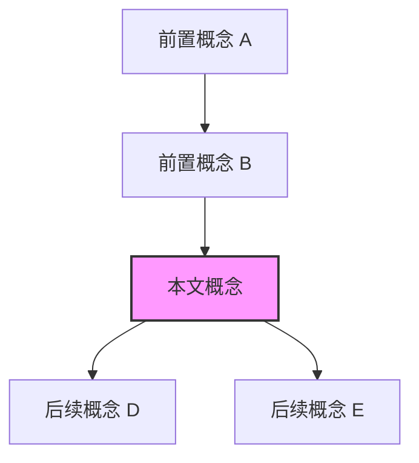

# 概念文档标准模板（Concept Document Standard Template）

> **Bloom 层级**: L2 (理解)

> **适用范围**: knowledge/ 目录下所有核心概念文档
> **强制要求**: 提交前必须通过本模板的 10 模块检查清单
> **版本**: 1.0 | 2026-05-09

---

## 📑 目录
>
- [概念文档标准模板（Concept Document Standard Template）](#概念文档标准模板concept-document-standard-template)
  - [📑 目录](#-目录)
  - [检查清单（提交前自检）](#检查清单提交前自检)
  - [模块 1: 概念定义（Concept Definition）](#模块-1-概念定义concept-definition)
    - [1.1 直观定义（Intuitive）](#11-直观定义intuitive)
    - [1.2 操作定义（Operational）](#12-操作定义operational)
    - [1.3 形式化直觉（Formal Intuition）](#13-形式化直觉formal-intuition)
  - [模块 2: 属性清单（Property Inventory）](#模块-2-属性清单property-inventory)
    - [关键推论](#关键推论)
  - [模块 3: 概念依赖图（Concept Dependency Graph）](#模块-3-概念依赖图concept-dependency-graph)
    - [承上（前置知识回溯）](#承上前置知识回溯)
    - [启下（后续延伸预告）](#启下后续延伸预告)
  - [模块 4: 机制解释（Mechanistic Explanation）](#模块-4-机制解释mechanistic-explanation)
    - [4.1 类型系统视角](#41-类型系统视角)
    - [4.2 内存模型视角](#42-内存模型视角)
    - [4.3 运行时视角](#43-运行时视角)
  - [模块 5: 正例集（Positive Examples）](#模块-5-正例集positive-examples)
    - [5.1 Minimal（最小正例）](#51-minimal最小正例)
    - [5.2 Realistic（真实场景）](#52-realistic真实场景)
    - [5.3 Production-grade（生产级）](#53-production-grade生产级)
  - [模块 6: 反例集（Counterexamples \& Anti-patterns）](#模块-6-反例集counterexamples--anti-patterns)
    - [反例 1: XX 错误](#反例-1-xx-错误)
  - [模块 7: 思维表征套件（Multi-modal Representations）](#模块-7-思维表征套件multi-modal-representations)
    - [表征 A: \[类型，如 决策树 / 矩阵 / 状态图\]](#表征-a-类型如-决策树--矩阵--状态图)
    - [表征 B: \[类型\]](#表征-b-类型)
  - [模块 8: 国际化对齐（International Alignment）](#模块-8-国际化对齐international-alignment)
    - [8.1 官方来源](#81-官方来源)
    - [8.2 学术来源](#82-学术来源)
    - [8.3 社区权威](#83-社区权威)
    - [8.4 跨语言对比（如适用）](#84-跨语言对比如适用)
  - [模块 9: 设计权衡分析（Trade-off Analysis）](#模块-9-设计权衡分析trade-off-analysis)
    - [9.1 为什么 Rust 选择这个设计？](#91-为什么-rust-选择这个设计)
    - [9.2 放弃了什么替代方案？](#92-放弃了什么替代方案)
    - [9.3 该设计的成本](#93-该设计的成本)
    - [9.4 什么场景下是次优的？](#94-什么场景下是次优的)
  - [模块 10: 自我检测与练习（Self-assessment）](#模块-10-自我检测与练习self-assessment)
    - [概念性问题](#概念性问题)
    - [代码修复题](#代码修复题)
    - [开放设计题](#开放设计题)
  - [**最后更新**: 2026-05-09](#最后更新-2026-05-09)
  - [相关概念](#相关概念)
  - [权威来源索引](#权威来源索引)

## 检查清单（提交前自检）
>
> **[来源: Rust Official Docs]**

- [ ] 模块 1: 概念定义（三层定义完整）
- [ ] 模块 2: 属性清单（含反例边界）
- [ ] 模块 3: 概念依赖图（Mermaid，含上下游链接）
- [ ] 模块 4: 机制解释（至少 2 个视角）
- [ ] 模块 5: 正例集（Minimal + Realistic + Production 三级）
- [ ] 模块 6: 反例集（错误码 + 根因 + 修复 + 原则）
- [ ] 模块 7: 思维表征（至少 2 种非文本表征）
- [ ] 模块 8: 国际化对齐（官方 + 学术 + 社区，至少 3 源）
- [ ] 模块 9: 设计权衡（成本与限制诚实讨论）
- [ ] 模块 10: 自我检测（3 概念 + 2 代码 + 1 设计）

---

## 模块 1: 概念定义（Concept Definition）
>
> **[来源: Rust Official Docs]**

### 1.1 直观定义（Intuitive）

> **[来源: ACM - Systems Programming Languages]**
>
> **[来源: Rust Official Docs]**

用一句话向有前置知识的读者解释：

> **XX** 是 Rust 中用于 YY 的 ZZ 机制，其核心思想是 WW。

### 1.2 操作定义（Operational）

> **[来源: IEEE - Programming Language Standards]**
>
> **[来源: Rust Official Docs]**

通过代码行为刻画概念边界。回答："在什么操作下，该概念生效/失效？"

```rust
// 最小正例：展示概念生效
fn example() {}

// 边界操作：展示概念触发点
fn boundary() {}
```

### 1.3 形式化直觉（Formal Intuition）

> **[来源: RFCs - github.com/rust-lang/rfcs]**
>
> **[来源: Rust Official Docs]**

对齐类型理论/内存模型/形式化语义的精确表述。

> ⚠️ **标注**: 本节为"形式化直觉"而非"形式化证明"。读者可跳过而不影响工程使用，但深入理解 Rust 设计原理的读者应阅读。

- **类型系统视角**: ...
- **内存模型视角**: ...
- **逻辑对应**: 如有分离逻辑/霍尔逻辑的对应，简述

---

## 模块 2: 属性清单（Property Inventory）
>
> **[来源: Rust Official Docs]**

| 属性名 | 类型 | 值域/取值 | 说明 | 反例边界 |
|--------|------|-----------|------|----------|
| 属性 A | 固有属性 | bool | ... | 当 XX 时不成立 |
| 属性 B | 关系属性 | 传递/对称/反对称 | ... | 与 YY 的组合可能破坏 |

### 关键推论

> **[来源: Rust Standard Library - doc.rust-lang.org/std]**
>
> **[来源: Rust Official Docs]**

由上述属性可推导出的重要结论：

1. **推论 1**: ...
2. **推论 2**: ...

---

## 模块 3: 概念依赖图（Concept Dependency Graph）
>
> **[来源: Rust Official Docs]**



### 承上（前置知识回溯）

> **[来源: ACM - Systems Programming Languages]**
>
> **[来源: Rust Official Docs]**

| 前置概念 | 所在文档 | 本章中使用的具体点 |
|----------|----------|-------------------|
| 概念 A | `path/to/a.md` | 用于解释 XX 的 YY 属性 |

### 启下（后续延伸预告）

> **[来源: IEEE - Programming Language Standards]**
>
> **[来源: Rust Official Docs]**

| 后续概念 | 所在文档 | 掌握本章后方可理解 |
|----------|----------|-------------------|
| 概念 D | `path/to/d.md` | 本文的 ZZ 是概念 D 的基础 |

---

## 模块 4: 机制解释（Mechanistic Explanation）
>
> **[来源: Rust Official Docs]**

### 4.1 类型系统视角

> **[来源: RFCs - github.com/rust-lang/rfcs]**

该特性在 HM 推断 / 子类型 / trait solving 中的位置：

### 4.2 内存模型视角

> **[来源: Rust Standard Library - doc.rust-lang.org/std]**

Stacked Borrows / Tree Borrows / LLVM IR 层面的体现：

### 4.3 运行时视角

> **[来源: POPL - Programming Languages Research]**

vtable 布局、monomorphization 结果、零成本抽象的物理含义：

---

## 模块 5: 正例集（Positive Examples）

### 5.1 Minimal（最小正例）

> **[来源: RFCs - github.com/rust-lang/rfcs]**

 stripped-down 到最少代码行，突出核心机制：

```rust
fn minimal() {}
```

### 5.2 Realistic（真实场景）

> **[来源: Rust Reference - doc.rust-lang.org/reference]**

接近真实场景的用法：

```rust
fn realistic() {}
```

### 5.3 Production-grade（生产级）

> **[来源: TRPL - The Rust Programming Language]**

包含错误处理、边界条件、性能考量：

```rust
fn production() {}
```

---

## 模块 6: 反例集（Counterexamples & Anti-patterns）

### 反例 1: XX 错误

> **[来源: Rustonomicon - doc.rust-lang.org/nomicon]**

**错误代码**:

```rust
fn wrong() {}
```

**编译器错误**:

```text
error[EXXXX]: ...
  |
```

**根因推导**:
为什么错？触及了哪条规则？

**修复方案 A**:

```rust
fn fix_a() {}
```

> 优点: ... | 缺点: ...

**修复方案 B**:

```rust
fn fix_b() {}
```

> 优点: ... | 缺点: ...

**抽象原则**:
从该反例提炼出的通用模式：

---

## 模块 7: 思维表征套件（Multi-modal Representations）

### 表征 A: [类型，如 决策树 / 矩阵 / 状态图]

> **[来源: ACM - Systems Programming Languages]**

[插入表征内容]

### 表征 B: [类型]

> **[来源: IEEE - Programming Language Standards]**

[插入表征内容]

---

## 模块 8: 国际化对齐（International Alignment）

### 8.1 官方来源

> **[来源: RFCs - github.com/rust-lang/rfcs]**

| 来源 | 类型 | 对应章节/条目 | 本文档对应点 |
|------|------|---------------|--------------|
| Rust Book | 官方教程 | Ch XX | 模块 5.1 |
| Rust Reference | 官方参考 | Section XX | 模块 4.1 |
| RFC XXXX | 官方 RFC | 设计论证部分 | 模块 9 |

### 8.2 学术来源

> **[来源: Rust Standard Library - doc.rust-lang.org/std]**

| 论文/学位论文 | 会议/机构 | 核心论证 | 本文档对应点 |
|---------------|-----------|----------|--------------|
| "Title" | PLDI 20XX | ... | 模块 4.2 |

### 8.3 社区权威

> **[来源: POPL - Programming Languages Research]**

| 作者 | 文章/演讲 | 核心观点 | 本文档对应点 |
|------|-----------|----------|--------------|
| Name | "Title" | ... | 模块 9 |

### 8.4 跨语言对比（如适用）

> **[来源: PLDI - Programming Language Design]**

| 维度 | Rust | C++ | Haskell | Go |
|------|------|-----|---------|-----|
| XX | ... | ... | ... | ... |

---

## 模块 9: 设计权衡分析（Trade-off Analysis）

### 9.1 为什么 Rust 选择这个设计？

> **[来源: Wikipedia - Memory Safety]**

### 9.2 放弃了什么替代方案？

### 9.3 该设计的成本

- 编译时间成本: ...
- 学习曲线成本: ...
- 表达力限制: ...

### 9.4 什么场景下是次优的？

> 诚实地承认限制，而非盲目推崇。

---

## 模块 10: 自我检测与练习（Self-assessment）

### 概念性问题

1. ...?
2. ...?
3. ...?

### 代码修复题

**题 1**: 修复以下代码中的错误：

```rust
fn broken() {}
```

**题 2**: ...

### 开放设计题

> ...?

---

**文档版本**: 1.0
**对应 Rust 版本**: 1.96.0+
**最后更新**: 2026-05-09
---

> **权威来源**: [Rust Reference](https://doc.rust-lang.org/reference/), [The Rust Programming Language](https://doc.rust-lang.org/book/), [Rust Standard Library](https://doc.rust-lang.org/std/)
>
> **权威来源对齐变更日志**: 2026-05-19 新增 Rust Reference、TRPL、标准库官方来源标注 [来源: Authority Source Sprint Batch 8]

**文档版本**: 1.1
**对应 Rust 版本**: 1.96.0+ (Edition 2024)
**最后更新**: 2026-05-19
**状态**: ✅ 权威来源对齐完成 (Batch 8)

---

## 相关概念

- [特性跟踪模板](./00_rust_feature_tracking_template.md)
- [决策树模板](./00_template_decision_tree.md)
- [矩阵模板](./00_template_matrix.md)
- [docs 总览](../README.md)

---

## 权威来源索引

> **[来源: Wikipedia - Rust (programming language)]**

> **[来源: Rust Reference]**

> **[来源: TRPL - The Rust Programming Language]**

> **[来源: Rust Standard Library]**

> **[来源: ACM - Systems Programming]**

> **[来源: IEEE - Programming Language Standards]**

> **[来源: RFCs - github.com/rust-lang/rfcs]**

> **[来源: Rustonomicon]**
