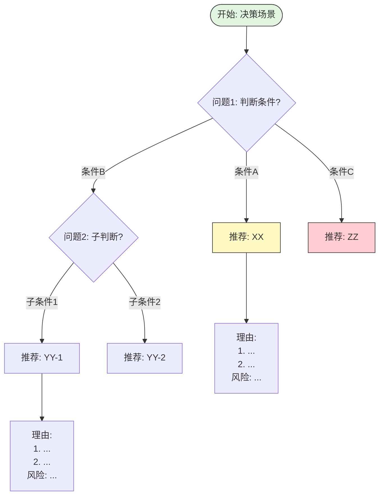

# 决策树/推理树标准模板

> **Bloom 层级**: L2 (理解)

> **用途**: "何时选择 X 而非 Y" 的推理过程可视化
> **格式**: ASCII 艺术树 或 Mermaid graph TD
> **要求**: 每个叶子节点必须有明确的代码/工具/策略推荐

---

## 📑 目录
>
- [决策树/推理树标准模板](#决策树推理树标准模板)
  - [📑 目录](#-目录)
  - [ASCII 模板](#ascii-模板)
  - [Mermaid 模板](#mermaid-模板)
  - [使用示例：选择引用类型](#使用示例选择引用类型)
  - [设计规则](#设计规则)
  - [相关概念](#相关概念)
  - [权威来源索引](#权威来源索引)

## ASCII 模板
>
> **[来源: Rust Official Docs]**

```text
                    ┌─────────────────────────────────────┐
                    │  开始: [决策场景描述]                 │
                    └──────────────┬──────────────────────┘
                                   │
                                   ▼
                    ┌─────────────────────────────────────┐
                    │  问题1: [二元或多元判断条件]          │
                    │  (量化标准或明确边界)                 │
                    └──────────────┬──────────────────────┘
                                   │
            ┌──────────────────────┼──────────────────────┐
            │                      │                      │
            ▼                      ▼                      ▼
    ┌───────────────┐     ┌───────────────────┐  ┌───────────────────┐
    │ 分支A: [条件]  │     │ 分支B: [条件]      │  │ 分支C: [条件]      │
    └───────┬───────┘     └─────────┬─────────┘  └─────────┬─────────┘
            │                       │                      │
            ▼                       ▼                      ▼
    ┌───────────────┐     ┌───────────────────┐  ┌───────────────────┐
    │ **推荐: XX**  │     │ **推荐: YY**       │  │ **推荐: ZZ**       │
    ├───────────────┤     ├───────────────────┤  ├───────────────────┤
    │ • 理由1       │     │ • 理由1           │  │ • 理由1           │
    │ • 理由2       │     │ • 理由2           │  │ • 理由2           │
    │ • 风险: ...   │     │ • 风险: ...       │  │ • 风险: ...       │
    └───────────────┘     └───────────────────┘  └───────────────────┘
```

---

## Mermaid 模板
>
> **[来源: Rust Official Docs]**



---

## 使用示例：选择引用类型
>
> **[来源: Rust Official Docs]**

```text
                    ┌─────────────────────────────────────┐
                    │  开始: 需要访问数据但不获取所有权       │
                    └──────────────┬──────────────────────┘
                                   │
                                   ▼
                    ┌─────────────────────────────────────┐
                    │  问题1: 是否需要修改数据?             │
                    └──────────────┬──────────────────────┘
                                   │
            ┌──────────────────────┴──────────────────────┐
            │否                                         │是
            ▼                                           ▼
    ┌───────────────────────────┐           ┌───────────────────────────┐
    │ 问题2a: 是否需要多个引用?  │           │ 问题2b: 是否独占访问?      │
    │ (只读共享)                 │           │ (无其他活跃引用)           │
    └──────────────┬────────────┘           └──────────────┬────────────┘
                   │                                       │
         ┌─────────┴─────────┐                   ┌─────────┴─────────┐
         │是                │否                 │是                │否
         ▼                 ▼                   ▼                 ▼
    ┌──────────┐    ┌──────────┐        ┌──────────┐    ┌──────────┐
    │ **&T**   │    │ **&T**   │        │ **&mut T**│   │ 编译错误  │
    │ 多个不可变│    │ 单个不可变│       │ 可变引用   │   │ E0499    │
    │ 引用允许  │    │ 引用     │        │           │   │ 无法同时 │
    └──────────┘    └──────────┘        └──────────┘   │ 存在     │
                                                        └──────────┘
```

---

## 设计规则

1. **每个判断节点必须是可回答的**: 条件必须量化或有明确边界
2. **叶子节点必须 actionable**: 不能是"视情况而定"，必须是具体推荐
3. **标注风险**: 每个推荐必须附带主要风险
4. **保持平衡**: 树的深度建议不超过 4 层，过深则拆分为多个子决策树

---

> **权威来源**: [Rust Reference](https://doc.rust-lang.org/reference/), [The Rust Programming Language](https://doc.rust-lang.org/book/), [Rust Standard Library](https://doc.rust-lang.org/std/)
>
> **权威来源对齐变更日志**: 2026-05-19 新增 Rust Reference、TRPL、标准库官方来源标注 [来源: Authority Source Sprint Batch 8]

**文档版本**: 1.1
**对应 Rust 版本**: 1.96.0+ (Edition 2024)
**最后更新**: 2026-05-19
**状态**: ✅ 权威来源对齐完成 (Batch 8)

---

## 相关概念

- [特性跟踪模板](./00_rust_feature_tracking_template.md)
- [概念文档模板](./00_template_concept_doc.md)
- [矩阵模板](./00_template_matrix.md)
- [docs 总览](../README.md)

---

## 权威来源索引

> **[来源: Wikipedia - Rust (programming language)]**

> **[来源: Rust Reference - doc.rust-lang.org/reference]**

> **[来源: TRPL - The Rust Programming Language]**

> **[来源: Rust Standard Library - doc.rust-lang.org/std]**

> **[来源: ACM - Systems Programming Languages]**

> **[来源: IEEE - Programming Language Standards]**

> **[来源: RFCs - github.com/rust-lang/rfcs]**

> **[来源: Rustonomicon - doc.rust-lang.org/nomicon]**
