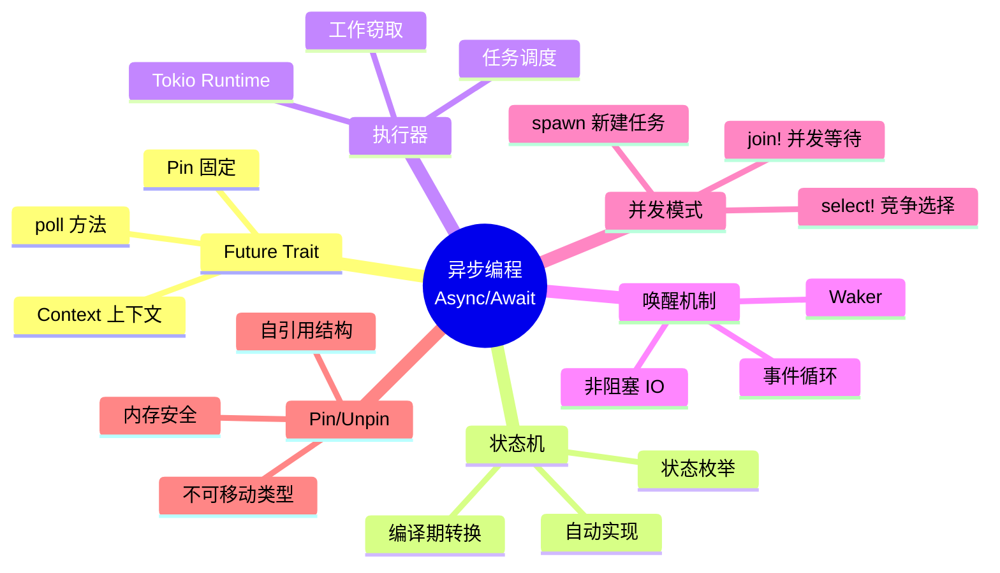
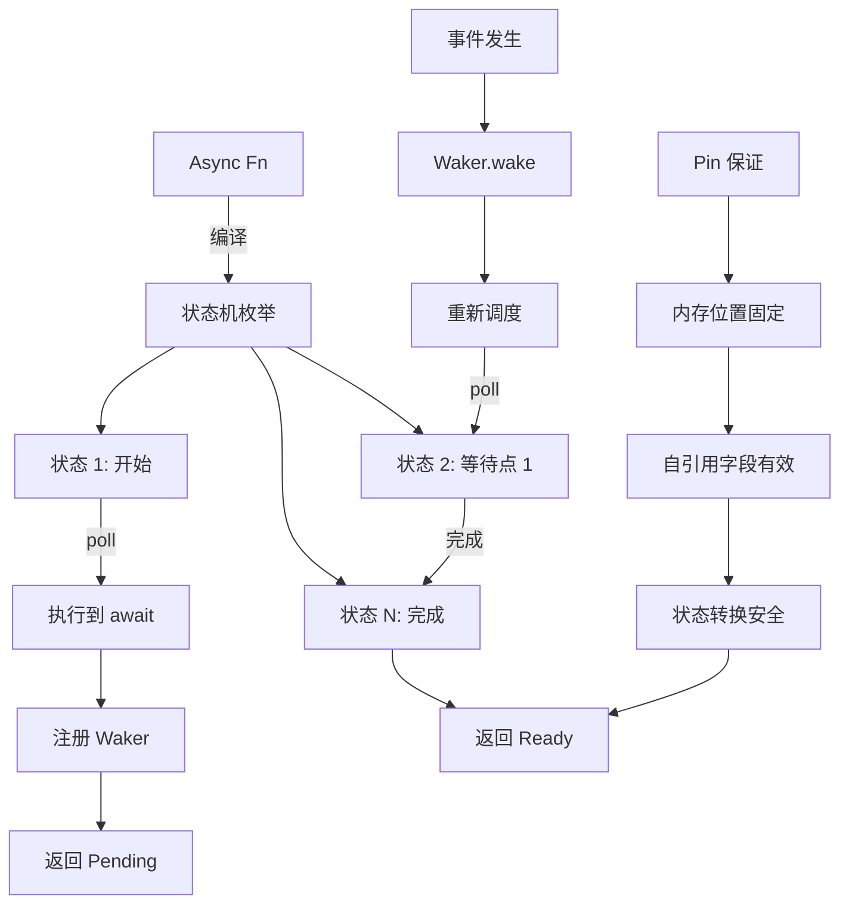
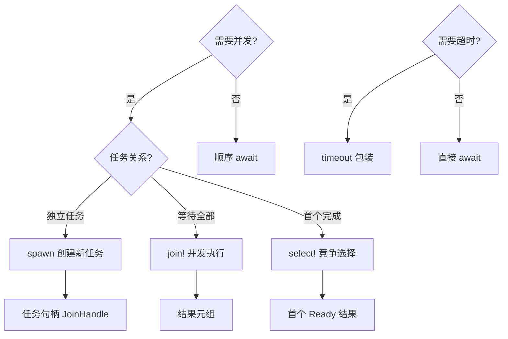

# ⚡ Rust 异步编程速查卡 {#-rust-异步编程速查卡}

> **快速参考** | [完整文档](../../../crates/c06_async/docs/README.md) | [代码示例](../../../crates/c06_async/examples/)
> **创建日期**: 2026-01-27
> **最后更新**: 2026-02-28
> **Rust 版本**: 1.93.1+ (Edition 2024)
> **状态**: ✅ 已完成

---

## 📋 目录

- [⚡ Rust 异步编程速查卡 {#-rust-异步编程速查卡}](#-rust-异步编程速查卡--rust-异步编程速查卡)
  - [📋 目录](#-目录)
  - [🧠 异步状态机思维导图](#-异步状态机思维导图)
  - [📊 概念定义-属性关系-解释论证](#-概念定义-属性关系-解释论证)
  - [🔬 异步状态机证明树](#-异步状态机证明树)
    - [异步执行决策树](#异步执行决策树)
  - [🎯 核心概念 {#-核心概念}](#-核心概念--核心概念)
    - [Future Trait（核心抽象）](#future-trait核心抽象)
  - [🚀 基本模式 {#-基本模式}](#-基本模式--基本模式)
    - [模式 1: async/await 基础](#模式-1-asyncawait-基础)
    - [模式 2: 并发执行](#模式-2-并发执行)
    - [模式 3: 选择第一个完成](#模式-3-选择第一个完成)
    - [模式 4: 超时控制](#模式-4-超时控制)
  - [🏗️ 运行时对比 {#️-运行时对比}](#️-运行时对比-️-运行时对比)
    - [Tokio（推荐，功能最全）](#tokio推荐功能最全)
    - [async-std（类似标准库 API）](#async-std类似标准库-api)
    - [smol（轻量级）](#smol轻量级)
  - [🔄 常见并发模式 {#-常见并发模式}](#-常见并发模式--常见并发模式)
    - [模式 1: Fan-out（任务分发）](#模式-1-fan-out任务分发)
    - [模式 2: Stream 处理](#模式-2-stream-处理)
    - [模式 3: Actor 模式](#模式-3-actor-模式)
    - [模式 4: CSP 模式（Channel）](#模式-4-csp-模式channel)
  - [🔐 共享状态 {#-共享状态}](#-共享状态--共享状态)
    - [模式 1: Arc + Mutex](#模式-1-arc--mutex)
    - [模式 2: Arc + RwLock（读多写少）](#模式-2-arc--rwlock读多写少)
  - [🌐 网络编程模式 {#-网络编程模式}](#-网络编程模式--网络编程模式)
    - [TCP Server](#tcp-server)
    - [HTTP Client](#http-client)
  - [⚡ 性能优化 {#-性能优化}](#-性能优化--性能优化)
    - [1. 批处理](#1-批处理)
    - [2. 连接池](#2-连接池)
    - [3. 取消任务](#3-取消任务)
  - [⚠️ 常见陷阱 {#️-常见陷阱}](#️-常见陷阱-️-常见陷阱)
    - [陷阱 1: 在 async 中使用标准库阻塞 API](#陷阱-1-在-async-中使用标准库阻塞-api)
    - [陷阱 2: 持有 MutexGuard 跨 await](#陷阱-2-持有-mutexguard-跨-await)
    - [陷阱 3: 忘记 spawn 导致串行](#陷阱-3-忘记-spawn-导致串行)
  - [🚫 反例速查 {#-反例速查}](#-反例速查--反例速查)
    - [反例 1–2](#反例-12)
    - [反例 3: 忘记 spawn 导致串行](#反例-3-忘记-spawn-导致串行)
    - [反例 4: 持有锁跨越 await](#反例-4-持有锁跨越-await)
  - [🎯 选择决策树 {#-选择决策树}](#-选择决策树--选择决策树)
  - [📊 Tokio 完整功能 {#-tokio-完整功能}](#-tokio-完整功能--tokio-完整功能)
  - [🔗 快速跳转 {#-快速跳转}](#-快速跳转--快速跳转)
    - [深入学习](#深入学习)
    - [代码示例](#代码示例)
    - [形式化理论](#形式化理论)
  - [💡 使用场景 {#-使用场景}](#-使用场景--使用场景)
    - [场景 1: Web 服务器并发处理](#场景-1-web-服务器并发处理)
    - [场景 2: 批量数据获取](#场景-2-批量数据获取)
    - [场景 3: 生产者-消费者模式](#场景-3-生产者-消费者模式)
  - [⚠️ 边界情况 {#️-边界情况}](#️-边界情况-️-边界情况)
    - [边界 1: 异步递归](#边界-1-异步递归)
    - [边界 2: 异步 Drop](#边界-2-异步-drop)
    - [边界 3: 限流与背压](#边界-3-限流与背压)
  - [🆕 Rust 1.93.0 异步改进 {#-rust-1930-异步改进}](#-rust-1930-异步改进--rust-1930-异步改进)
    - [musl 1.2.5 DNS 解析改进](#musl-125-dns-解析改进)
  - [Rust 1.92.0 异步改进（历史）](#rust-1920-异步改进历史)
    - [异步迭代器性能提升](#异步迭代器性能提升)
    - [JIT 编译器优化](#jit-编译器优化)
  - [📚 相关文档 {#-相关文档}](#-相关文档--相关文档)
  - [🧩 相关示例代码 {#-相关示例代码}](#-相关示例代码--相关示例代码)
  - [📚 相关资源 {#-相关资源}](#-相关资源--相关资源)
    - [官方文档](#官方文档)
    - [项目内部文档](#项目内部文档)
    - [相关速查卡](#相关速查卡)

---

## 🧠 异步状态机思维导图



---

## 📊 概念定义-属性关系-解释论证

| 层次 | 概念定义 | 属性关系 | 解释论证 |
| :--- | :--- | :--- | :--- |
| **L1 基础** | Future：异步计算抽象 | 公理：Future 可轮询至完成 | 定理 A1：poll 契约保证进度 |
| **L2 状态** | 状态机：async fn 编译结果 | 规则：每个 await 点为一个状态 | 定理 A2：状态机正确模拟控制流 |
| **L3 固定** | Pin：内存位置固定 | 公理：Pin<&mut T> ⟹ T 不移动 | 定理 A3：Pin 保证自引用安全 |
| **L4 执行** | Executor：Future 驱动者 | 规则：轮询 Ready/Pending | 定理 A4：执行器公平性保证 |
| **L5 唤醒** | Waker：异步通知机制 | 规则：事件→Waker→poll | 定理 A5：无虚假唤醒 |

> 形式化理论详见：[异步状态机形式化](../../research_notes/formal_methods/async_state_machine.md) | [Pin 和自引用类型形式化](../../research_notes/formal_methods/pin_self_referential.md)

---

## 🔬 异步状态机证明树



### 异步执行决策树



---

## 🎯 核心概念 {#-核心概念}

### Future Trait（核心抽象）

```rust
pub trait Future {
    type Output;
    fn poll(self: Pin<&mut Self>, cx: &mut Context<'_>) -> Poll<Self::Output>;
}

pub enum Poll<T> {
    Ready(T),    // 完成
    Pending,     // 未完成，等待唤醒
}
```

---

## 🚀 基本模式 {#-基本模式}

### 模式 1: async/await 基础

```rust
async fn fetch_data() -> String {
    "data".to_string()
}

#[tokio::main]
async fn main() {
    let data = fetch_data().await;
    println!("{}", data);
}
```

---

### 模式 2: 并发执行

```rust
use tokio::join;

async fn task1() -> u32 { 1 }
async fn task2() -> u32 { 2 }

#[tokio::main]
async fn main() {
    // 并发执行，等待所有完成
    let (r1, r2) = join!(task1(), task2());
    println!("{} {}", r1, r2);
}
```

---

### 模式 3: 选择第一个完成

```rust
use tokio::select;

async fn operation() {
    select! {
        _ = task1() => println!("task1 先完成"),
        _ = task2() => println!("task2 先完成"),
    }
}
```

---

### 模式 4: 超时控制

```rust
use tokio::time::{timeout, Duration};

async fn fetch_with_timeout() -> Result<String, tokio::time::error::Elapsed> {
    timeout(Duration::from_secs(5), fetch_data()).await
}
```

---

## 🏗️ 运行时对比 {#️-运行时对比}

### Tokio（推荐，功能最全）

```rust
// Cargo.toml
[dependencies]
tokio = { version = "1", features = ["full"] }

// main.rs
#[tokio::main]
async fn main() {
    // 多线程运行时
}

// 单线程运行时
#[tokio::main(flavor = "current_thread")]
async fn main() { }
```

**优势**:

- ✅ 功能最全（网络、文件、时间、信号）
- ✅ 生态最好
- ✅ 文档完善

---

### async-std（类似标准库 API）

```rust
[dependencies]
async-std = { version = "1", features = ["attributes"] }

#[async_std::main]
async fn main() {
    // API 接近 std
}
```

**优势**:

- ✅ API 设计简洁
- ✅ 学习曲线平缓

---

### smol（轻量级）

```rust
[dependencies]
smol = "2"

fn main() {
    smol::block_on(async {
        // 轻量级运行时
    });
}
```

**优势**:

- ✅ 小巧精悍
- ✅ 依赖少

---

## 🔄 常见并发模式 {#-常见并发模式}

### 模式 1: Fan-out（任务分发）

```rust
use tokio::task;

async fn fan_out(items: Vec<i32>) -> Vec<i32> {
    let mut tasks = vec![];

    for item in items {
        tasks.push(task::spawn(async move {
            process(item).await
        }));
    }

    let mut results = vec![];
    for task in tasks {
        results.push(task.await.unwrap());
    }
    results
}
```

---

### 模式 2: Stream 处理

```rust
use tokio_stream::StreamExt;

async fn process_stream() {
    let mut stream = tokio_stream::iter(vec![1, 2, 3]);

    while let Some(item) = stream.next().await {
        println!("{}", item);
    }
}
```

---

### 模式 3: Actor 模式

```rust
use tokio::sync::mpsc;

struct Actor {
    receiver: mpsc::Receiver<Message>,
}

impl Actor {
    async fn run(&mut self) {
        while let Some(msg) = self.receiver.recv().await {
            self.handle(msg).await;
        }
    }

    async fn handle(&self, msg: Message) {
        // 处理消息
    }
}
```

---

### 模式 4: CSP 模式（Channel）

```rust
use tokio::sync::mpsc;

async fn csp_pattern() {
    let (tx, mut rx) = mpsc::channel(32);

    // 生产者
    tokio::spawn(async move {
        for i in 0..10 {
            tx.send(i).await.unwrap();
        }
    });

    // 消费者
    while let Some(i) = rx.recv().await {
        println!("{}", i);
    }
}
```

---

## 🔐 共享状态 {#-共享状态}

### 模式 1: Arc + Mutex

```rust
use std::sync::Arc;
use tokio::sync::Mutex;

#[tokio::main]
async fn main() {
    let data = Arc::new(Mutex::new(0));

    let mut handles = vec![];
    for _ in 0..10 {
        let data = Arc::clone(&data);
        let handle = tokio::spawn(async move {
            let mut num = data.lock().await;
            *num += 1;
        });
        handles.push(handle);
    }

    for handle in handles {
        handle.await.unwrap();
    }

    println!("{}", *data.lock().await);  // 10
}
```

---

### 模式 2: Arc + RwLock（读多写少）

```rust
use tokio::sync::RwLock;

let data = Arc::new(RwLock::new(vec![1, 2, 3]));

// 多个读取者
let read1 = data.read().await;
let read2 = data.read().await;

// 写入者（独占）
let mut write = data.write().await;
write.push(4);
```

---

## 🌐 网络编程模式 {#-网络编程模式}

### TCP Server

```rust
use tokio::net::TcpListener;
use tokio::io::{AsyncReadExt, AsyncWriteExt};

#[tokio::main]
async fn main() -> std::io::Result<()> {
    let listener = TcpListener::bind("127.0.0.1:8080").await?;

    loop {
        let (mut socket, _) = listener.accept().await?;

        tokio::spawn(async move {
            let mut buf = [0; 1024];
            match socket.read(&mut buf).await {
                Ok(n) => {
                    socket.write_all(&buf[0..n]).await.unwrap();
                }
                Err(e) => eprintln!("Error: {}", e),
            }
        });
    }
}
```

---

### HTTP Client

```rust
use reqwest;

#[tokio::main]
async fn main() -> Result<(), reqwest::Error> {
    let resp = reqwest::get("https://api.github.com/users/octocat")
        .await?
        .json::<serde_json::Value>()
        .await?;

    println!("{:#?}", resp);
    Ok(())
}
```

---

## ⚡ 性能优化 {#-性能优化}

### 1. 批处理

```rust
use tokio::time::{sleep, Duration};
use std::collections::VecDeque;

async fn batch_processor() {
    let mut queue = VecDeque::new();

    loop {
        // 累积请求
        sleep(Duration::from_millis(100)).await;

        if queue.len() >= 10 {
            // 批量处理
            process_batch(queue.drain(..).collect()).await;
        }
    }
}
```

---

### 2. 连接池

```rust
use deadpool_postgres::{Config, Pool};

async fn with_pool() {
    let cfg = Config::from_env("DATABASE_URL").unwrap();
    let pool = cfg.create_pool(None, tokio_postgres::NoTls).unwrap();

    let conn = pool.get().await.unwrap();
    // 使用连接
}
```

---

### 3. 取消任务

```rust
use tokio_util::sync::CancellationToken;

async fn cancellable_task() {
    let token = CancellationToken::new();
    let token_clone = token.clone();

    let task = tokio::spawn(async move {
        tokio::select! {
            _ = token_clone.cancelled() => {
                println!("Task cancelled");
            }
            _ = long_running_operation() => {
                println!("Task completed");
            }
        }
    });

    // 取消任务
    token.cancel();
    task.await.unwrap();
}
```

---

## ⚠️ 常见陷阱 {#️-常见陷阱}

### 陷阱 1: 在 async 中使用标准库阻塞 API

```rust
// ❌ 错误：阻塞运行时
async fn bad() {
    std::thread::sleep(Duration::from_secs(1));  // 阻塞！
}

// ✅ 正确：使用异步版本
async fn good() {
    tokio::time::sleep(Duration::from_secs(1)).await;
}
```

---

### 陷阱 2: 持有 MutexGuard 跨 await

```rust
// ❌ 错误
async fn bad(mutex: Arc<Mutex<i32>>) {
    let guard = mutex.lock().await;
    some_async_fn().await;  // 持有锁跨 await
    drop(guard);
}

// ✅ 正确：缩小锁的范围
async fn good(mutex: Arc<Mutex<i32>>) {
    let value = {
        let guard = mutex.lock().await;
        *guard
    };  // guard 在这里 drop
    some_async_fn().await;
}
```

---

### 陷阱 3: 忘记 spawn 导致串行

```rust
// ❌ 串行执行
async fn bad() {
    task1().await;
    task2().await;  // 等 task1 完成
}

// ✅ 并发执行
async fn good() {
    let h1 = tokio::spawn(task1());
    let h2 = tokio::spawn(task2());
    let (r1, r2) = tokio::join!(h1, h2);
}
```

---

## 🚫 反例速查 {#-反例速查}

采用统一模板：错误示例 → 原因 → 修正。与「常见陷阱」互补。

### 反例 1–2

见上方「陷阱 1」「陷阱 2」。

### 反例 3: 忘记 spawn 导致串行

**错误示例**: 直接 `task1().await; task2().await` 串行执行。

**原因**: 顺序 await 无并发。

**修正**: 使用 `tokio::join!` 或 `tokio::spawn` 并发执行。

### 反例 4: 持有锁跨越 await

**错误示例**:

```rust
// ❌ 持有 MutexGuard 跨越 await 可能导致死锁
async fn bad(mutex: Arc<Mutex<i32>>) {
    let guard = mutex.lock().unwrap();
    tokio::time::sleep(Duration::from_secs(1)).await;  // 持锁期间 await
    // guard 在 await 点被持有，阻塞其他任务
}
```

**原因**: 异步任务可能在持锁时挂起，阻塞其他等待同一锁的任务，导致死锁或性能退化。

**修正**:

```rust
// ✅ 缩小锁的作用域，在 await 前释放
async fn good(mutex: Arc<Mutex<i32>>) {
    {
        let guard = mutex.lock().unwrap();
        let val = *guard;
        // 在作用域内完成需要持锁的操作
    }
    tokio::time::sleep(Duration::from_secs(1)).await;
}
```

---

## 🎯 选择决策树 {#-选择决策树}

```text
需要异步 I/O？
│
├─ 网络密集？
│  └─ 使用 Tokio（功能最全）
│
├─ 简单任务？
│  └─ 使用 async-std（API 简单）
│
├─ 嵌入式/轻量？
│  └─ 使用 smol（依赖少）
│
└─ CPU 密集？
   └─ 考虑 rayon（并行）或 spawn_blocking
```

---

## 📊 Tokio 完整功能 {#-tokio-完整功能}

```rust
[dependencies]
tokio = { version = "1", features = [
    "macros",      // #[tokio::main]
    "rt-multi-thread",  // 多线程运行时
    "io-util",     // AsyncReadExt, AsyncWriteExt
    "net",         // TcpListener, UdpSocket
    "time",        // sleep, timeout, interval
    "sync",        // mpsc, oneshot, Mutex
    "fs",          // 异步文件 I/O
    "signal",      // Unix 信号处理
    "process",     // 异步进程
] }
```

---

## 🔗 快速跳转 {#-快速跳转}

### 深入学习

- [Future 机制详解](../../../crates/c06_async/docs/tier_02_guides/02_Future与Executor机制.md)
- [Tokio API 参考](../../../crates/c06_async/docs/tier_03_references/02_Tokio完整API参考.md)
- [异步并发模式](../../../crates/c06_async/docs/tier_04_advanced/01_异步并发模式.md)

### 代码示例

- [基础示例](../../../crates/c06_async/examples/comprehensive_async_demo.rs)
- [并发模式](../../../crates/c06_async/examples/comprehensive_async_patterns_2025.rs)
- [Actor 模式](../../../crates/c06_async/src/actix/)

### 形式化理论

- [异步语义理论](../../../crates/c06_async/src/async_semantics_theory.rs)
- [CSP vs Actor](../../../crates/c06_async/src/csp_model_comparison.rs)
- [异步状态机形式化](../../research_notes/formal_methods/async_state_machine.md) — Def 4.1–5.2、定理 T6.1–T6.3
- [Pin 和自引用类型形式化](../../research_notes/formal_methods/pin_self_referential.md) — Def 1.1–2.2、定理 T1–T3

---

## 💡 使用场景 {#-使用场景}

### 场景 1: Web 服务器并发处理

```rust
use tokio::net::TcpListener;
use tokio::io::{AsyncReadExt, AsyncWriteExt};

#[tokio::main]
async fn main() -> std::io::Result<()> {
    let listener = TcpListener::bind("127.0.0.1:8080").await?;
    println!("服务器启动在 127.0.0.1:8080");

    loop {
        let (mut socket, addr) = listener.accept().await?;
        println!("新连接: {:?}", addr);

        // 每个连接在独立任务中处理
        tokio::spawn(async move {
            let mut buf = [0u8; 1024];

            match socket.read(&mut buf).await {
                Ok(n) if n > 0 => {
                    let response = format!(
                        "HTTP/1.1 200 OK\r\nContent-Length: {}\r\n\r\nHello!",
                        n
                    );
                    let _ = socket.write_all(response.as_bytes()).await;
                }
                _ => {}
            }
        });
    }
}
```

### 场景 2: 批量数据获取

```rust
use tokio::time::{sleep, Duration};

async fn fetch_user(id: u32) -> Result<String, &'static str> {
    // 模拟网络请求
    sleep(Duration::from_millis(100)).await;
    Ok(format!("User-{}", id))
}

#[tokio::main]
async fn main() {
    let ids = vec![1, 2, 3, 4, 5];

    // 串行获取（慢）
    let start = std::time::Instant::now();
    for id in &ids {
        let _ = fetch_user(*id).await;
    }
    println!("串行耗时: {:?}", start.elapsed());

    // 并发获取（快）
    let start = std::time::Instant::now();
    let futures: Vec<_> = ids.iter()
        .map(|id| fetch_user(*id))
        .collect();

    let results = futures::future::join_all(futures).await;
    for (i, result) in results.iter().enumerate() {
        match result {
            Ok(user) => println!("用户 {}: {}", ids[i], user),
            Err(e) => println!("获取失败: {}", e),
        }
    }
    println!("并发耗时: {:?}", start.elapsed());
}
```

### 场景 3: 生产者-消费者模式

```rust
use tokio::sync::mpsc;
use tokio::time::{sleep, Duration};

#[tokio::main]
async fn main() {
    let (tx, mut rx) = mpsc::channel(100);

    // 生产者任务
    let producer = tokio::spawn(async move {
        for i in 0..10 {
            tx.send(format!("消息 {}", i)).await.unwrap();
            sleep(Duration::from_millis(50)).await;
        }
    });

    // 消费者任务
    let consumer = tokio::spawn(async move {
        while let Some(msg) = rx.recv().await {
            println!("收到: {}", msg);
            sleep(Duration::from_millis(100)).await; // 模拟处理
        }
        println!("通道关闭");
    });

    let _ = tokio::join!(producer, consumer);
}
```

---

## ⚠️ 边界情况 {#️-边界情况}

### 边界 1: 异步递归

```rust
use std::future::Future;
use std::pin::Pin;

// 异步递归需要 Box::pin
type BoxFuture<'a, T> = Pin<Box<dyn Future<Output = T> + Send + 'a>>;

async fn factorial(n: u64) -> u64 {
    if n <= 1 {
        1
    } else {
        n * async_factorial(n - 1).await
    }
}

fn async_factorial(n: u64) -> BoxFuture<'static, u64> {
    Box::pin(factorial(n))
}

#[tokio::main]
async fn main() {
    println!("10! = {}", async_factorial(10).await);
}
```

### 边界 2: 异步 Drop

```rust
use std::sync::Arc;
use tokio::sync::Mutex;

struct AsyncResource {
    data: Arc<Mutex<Vec<i32>>>,
}

impl AsyncResource {
    async fn cleanup(&self) {
        let mut data = self.data.lock().await;
        data.clear();
        println!("资源已清理");
    }
}

impl Drop for AsyncResource {
    fn drop(&mut self) {
        // ⚠️ 注意：Drop 不能是 async
        // 如果需要异步清理，使用显式的 async cleanup 方法
        println!("同步 Drop（不能 await）");
    }
}

#[tokio::main]
async fn main() {
    let resource = AsyncResource {
        data: Arc::new(Mutex::new(vec![1, 2, 3])),
    };

    // 显式异步清理
    resource.cleanup().await;
    drop(resource);  // 同步 Drop
}
```

### 边界 3: 限流与背压

```rust
use tokio::sync::Semaphore;
use std::sync::Arc;

#[tokio::main]
async fn main() {
    // 最多同时执行 3 个任务
    let semaphore = Arc::new(Semaphore::new(3));
    let mut handles = vec![];

    for i in 0..10 {
        let sem = Arc::clone(&semaphore);
        let handle = tokio::spawn(async move {
            let _permit = sem.acquire().await.unwrap();
            println!("任务 {} 开始执行", i);
            tokio::time::sleep(tokio::time::Duration::from_secs(1)).await;
            println!("任务 {} 完成", i);
        });
        handles.push(handle);
    }

    for handle in handles {
        handle.await.unwrap();
    }
}
```

---

---

## 🆕 Rust 1.93.0 异步改进 {#-rust-1930-异步改进}

### musl 1.2.5 DNS 解析改进

**改进**: 静态链接的 musl 二进制文件在网络操作中更可靠

```rust
// Rust 1.93.0 (musl 1.2.5) 改进
use std::net::TcpStream;

// ✅ 1.93: musl 1.2.5 改进了 DNS 解析，特别是大型 DNS 记录
let stream = TcpStream::connect("example.com:80")?;
```

**影响**:

- 更可靠的 DNS 解析
- 更好地处理大型 DNS 记录
- 改进递归名称服务器支持

---

## Rust 1.92.0 异步改进（历史）

### 异步迭代器性能提升

**改进**: 性能提升 15-20%

```rust
// Rust 1.92.0 优化后的异步迭代器
async fn process_stream() {
    let mut stream = async_stream::stream! {
        for i in 0..10 {
            yield i;
        }
    };

    // ✅ 链式操作性能提升 15-20%
    stream
        .filter(|x| async move { *x > 5 })
        .map(|x| async move { x * 2 })
        .collect::<Vec<_>>()
        .await;
}
```

### JIT 编译器优化

**改进**: 异步代码性能提升，更好的内联优化

**影响**:

- 异步迭代器链式操作优化
- 异步批处理性能提升
- 更好的内联优化

---

## 📚 相关文档 {#-相关文档}

- [异步编程完整文档](../../../crates/c06_async/docs/README.md)
- [异步编程 README](../../../crates/c06_async/README.md)

## 🧩 相关示例代码 {#-相关示例代码}

以下示例位于 `crates/c06_async/examples/`，可直接运行（例如：`cargo run -p c06_async --example async_patterns_demo`）。

- [异步模式与综合演示](../../../crates/c06_async/examples/async_patterns_demo.rs)、[async_comprehensive_demo.rs](../../../crates/c06_async/examples/async_comprehensive_demo.rs)、[comprehensive_async_demo.rs](../../../crates/c06_async/examples/comprehensive_async_demo.rs)
- [Tokio / smol / 运行时对比](../../../crates/c06_async/examples/tokio_patterns.rs)、[smol_patterns.rs](../../../crates/c06_async/examples/smol_patterns.rs)、[runtime_comparison_demo.rs](../../../crates/c06_async/examples/runtime_comparison_demo.rs)
- [Stream、Actor、分布式与微服务](../../../crates/c06_async/examples/stream_processing_backpressure.rs)、[distributed_systems_demo.rs](../../../crates/c06_async/examples/distributed_systems_demo.rs)、[microservices_async_demo.rs](../../../crates/c06_async/examples/microservices_async_demo.rs)
- [Rust 1.91/1.92 特性演示](../../../crates/c06_async/examples/rust_191_features_demo.rs)、[rust_192_features_demo.rs](../../../crates/c06_async/examples/rust_192_features_demo.rs)

---

## 📚 相关资源 {#-相关资源}

### 官方文档

- [Rust 异步编程文档](https://doc.rust-lang.org/book/ch16-00-fearless-concurrency.html)
- [Async Book](https://rust-lang.github.io/async-book/)
- [Tokio 文档](https://tokio.rs/)

### 项目内部文档

- [异步编程完整文档](../../../crates/c06_async/docs/README.md)
- [异步状态机研究](../../research_notes/formal_methods/async_state_machine.md)

### 相关速查卡

- [线程与并发速查卡](./threads_concurrency_cheatsheet.md) - 并发编程对比
- [错误处理速查卡](./error_handling_cheatsheet.md) - 异步错误处理
- [所有权系统速查卡](./ownership_cheatsheet.md) - 异步中的所有权
- [智能指针速查卡](./smart_pointers_cheatsheet.md) - Arc 在异步中的应用

---

**最后更新**: 2026-01-27
**Rust 版本**: 1.93.1+ (Edition 2024)
**运行时版本**: Tokio 1.48.0+

⚡ **Rust 异步，高性能与优雅并存！**
