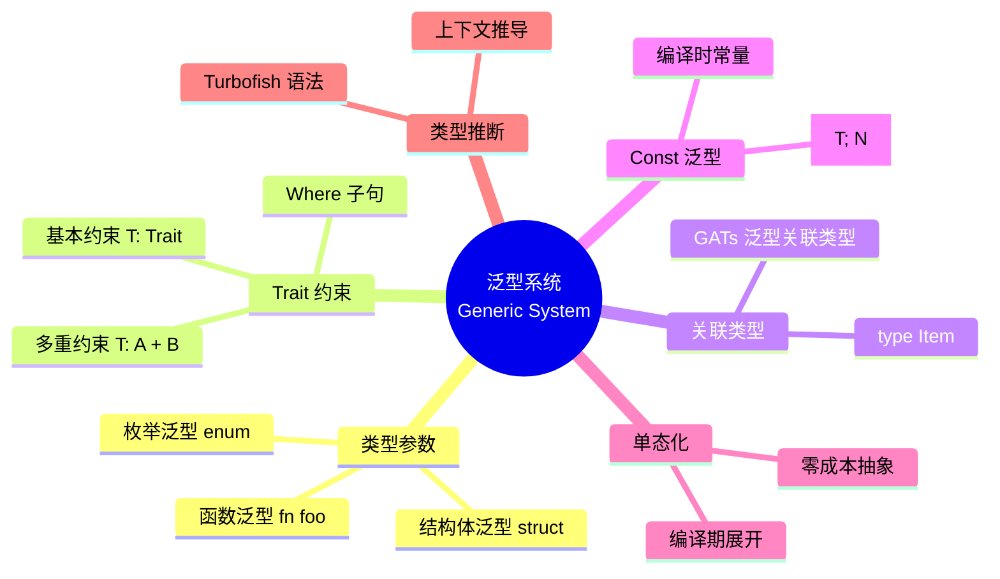
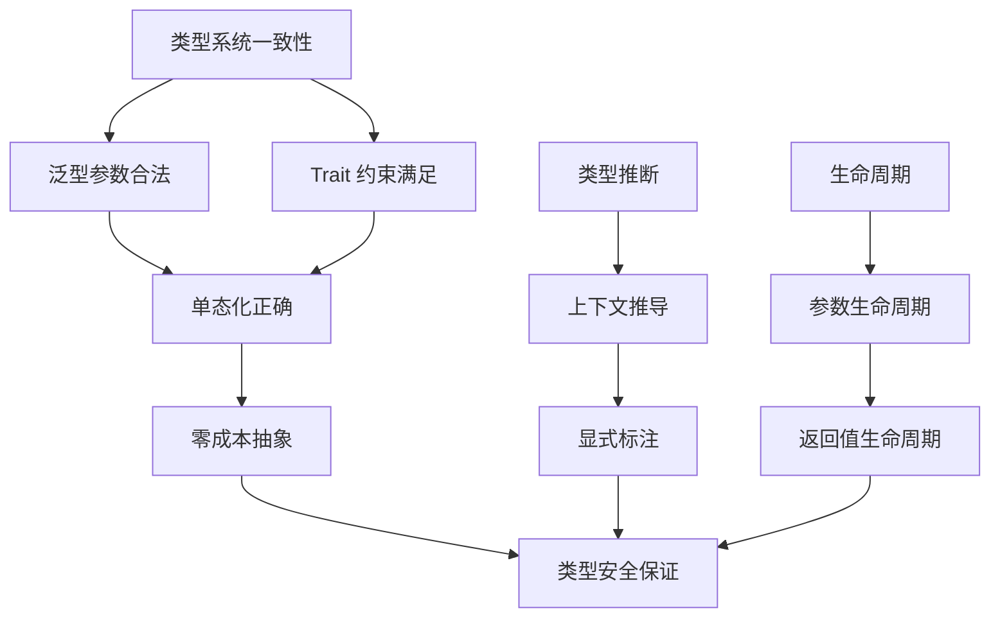

# 🔷 Rust 泛型编程速查卡 {#-rust-泛型编程速查卡}

> **快速参考** | [完整文档](../../../crates/c04_generic/docs/) | [代码示例](../../../crates/c04_generic/examples/)
> **创建日期**: 2026-01-27
> **最后更新**: 2026-01-27
> **Rust 版本**: 1.93.1+ (Edition 2024)
> **状态**: ✅ 已完成

---

## 📋 目录 {#-目录}

- [🔷 Rust 泛型编程速查卡 {#-rust-泛型编程速查卡}](#-rust-泛型编程速查卡--rust-泛型编程速查卡)
  - [📋 目录 {#-目录}](#-目录--目录)
  - [🧠 泛型系统思维导图](#-泛型系统思维导图)
  - [📊 概念定义-属性关系-解释论证](#-概念定义-属性关系-解释论证)
  - [🔬 泛型系统证明树](#-泛型系统证明树)
  - [🎯 核心概念 {#-核心概念}](#-核心概念--核心概念)
    - [泛型函数](#泛型函数)
    - [泛型结构体](#泛型结构体)
    - [泛型枚举](#泛型枚举)
  - [📐 Trait 约束 {#-trait-约束}](#-trait-约束--trait-约束)
    - [基本约束](#基本约束)
    - [常见 Trait 约束](#常见-trait-约束)
  - [🔧 高级特性 {#-高级特性}](#-高级特性--高级特性)
    - [关联类型](#关联类型)
    - [泛型关联类型 (GATs)](#泛型关联类型-gats)
    - [const 泛型](#const-泛型)
  - [🎯 常见模式 {#-常见模式}](#-常见模式--常见模式)
    - [模式 1: 泛型函数](#模式-1-泛型函数)
    - [模式 2: 泛型方法](#模式-2-泛型方法)
    - [模式 3: 泛型 Trait 实现](#模式-3-泛型-trait-实现)
  - [📚 性能考虑 {#-性能考虑}](#-性能考虑--性能考虑)
    - [单态化 (Monomorphization)](#单态化-monomorphization)
  - [🚫 反例速查 {#-反例速查}](#-反例速查--反例速查)
    - [反例 1: 遗漏 Trait 约束](#反例-1-遗漏-trait-约束)
    - [反例 2: 泛型与 trait 对象混用不当](#反例-2-泛型与-trait-对象混用不当)
  - [📚 相关文档 {#-相关文档}](#-相关文档--相关文档)
  - [🧩 相关示例代码 {#-相关示例代码}](#-相关示例代码--相关示例代码)
  - [🔗 相关资源 {#-相关资源}](#-相关资源--相关资源)
  - [🆕 Rust 1.93.0 泛型改进 {#-rust-1930-泛型改进}](#-rust-1930-泛型改进--rust-1930-泛型改进)
    - [MaybeUninit 泛型支持增强](#maybeuninit-泛型支持增强)
  - [Rust 1.92.0 泛型改进（历史）](#rust-1920-泛型改进历史)
    - [const 上下文增强](#const-上下文增强)
  - [📚 相关资源 {#-相关资源-1}](#-相关资源--相关资源-1)
    - [官方文档](#官方文档)
    - [项目内部文档](#项目内部文档)
    - [相关速查卡](#相关速查卡)
  - [💡 使用场景 {#-使用场景}](#-使用场景--使用场景)
    - [场景 1: 通用 Repository 模式](#场景-1-通用-repository-模式)
    - [场景 2: 类型安全的构建器](#场景-2-类型安全的构建器)
    - [场景 3: 泛型事件处理器](#场景-3-泛型事件处理器)
  - [⚠️ 边界情况 {#️-边界情况}](#️-边界情况-️-边界情况)
    - [边界 1: 孤儿规则 (Orphan Rule)](#边界-1-孤儿规则-orphan-rule)
    - [边界 2: 生命周期与泛型的交互](#边界-2-生命周期与泛型的交互)
    - [边界 3: 复杂 Trait 约束](#边界-3-复杂-trait-约束)
    - [形式化理论](#形式化理论)

---

## 🧠 泛型系统思维导图



---

## 📊 概念定义-属性关系-解释论证

| 层次 | 概念定义 | 属性关系 | 解释论证 |
| :--- | :--- | :--- | :--- |
| **L1 基础** | 类型参数 T：占位符类型 | 公理：∀T, T 是具体类型的抽象 | 定理 G1：泛型保证类型安全 |
| **L2 约束** | Trait Bound：能力要求 | 规则：T: Trait ⟹ T 实现 Trait | 定理 G2：约束满足则调用安全 |
| **L3 关联** | Associated Type：输出类型 | 规则：impl 中确定具体类型 | 定理 G3：关联类型唯一性 |
| **L4 单态化** | Monomorphization：代码生成 | 规则：每个 T 生成独立实例 | 定理 G4：零运行时开销 |
| **L5 高阶** | HRTB：高阶 Trait Bound | 规则：∀'a, T: Trait<'a> | 定理 G5：生命周期泛化 |

> 形式化理论详见：[类型构造能力](../../research_notes/type_theory/construction_capability.md) | [Trait 系统形式化](../../research_notes/type_theory/trait_system_formalization.md)

---

## 🔬 泛型系统证明树



---

## 🎯 核心概念 {#-核心概念}

### 泛型函数

```rust
// 基本泛型函数
fn largest<T: PartialOrd>(list: &[T]) -> &T {
    let mut largest = &list[0];
    for item in list {
        if item > largest {
            largest = item;
        }
    }
    largest
}
```

### 泛型结构体

```rust
struct Point<T> {
    x: T,
    y: T,
}

// 使用
let integer = Point { x: 5, y: 10 };
let float = Point { x: 1.0, y: 4.0 };
```

### 泛型枚举

```rust
enum Option<T> {
    Some(T),
    None,
}

enum Result<T, E> {
    Ok(T),
    Err(E),
}
```

---

## 📐 Trait 约束 {#-trait-约束}

### 基本约束

```rust
// 使用 where 子句
fn some_function<T, U>(t: T, u: U) -> i32
where
    T: Display + Clone,
    U: Clone + Debug,
{
    // 函数体
}
```

### 常见 Trait 约束

```rust
// 可比较
fn compare<T: PartialOrd>(a: T, b: T) -> bool {
    a > b
}

// 可克隆
fn duplicate<T: Clone>(item: T) -> (T, T) {
    (item.clone(), item.clone())
}

// 可显示
fn print<T: Display>(item: T) {
    println!("{}", item);
}
```

---

## 🔧 高级特性 {#-高级特性}

### 关联类型

```rust
trait Iterator {
    type Item;  // 关联类型

    fn next(&mut self) -> Option<Self::Item>;
}
```

### 泛型关联类型 (GATs)

```rust
trait StreamingIterator {
    type Item<'a> where Self: 'a;

    fn next<'a>(&'a mut self) -> Option<Self::Item<'a>>;
}
```

### const 泛型

```rust
struct Array<T, const N: usize> {
    data: [T; N],
}

// 使用
let arr: Array<i32, 5> = Array { data: [0; 5] };
```

---

## 🎯 常见模式 {#-常见模式}

### 模式 1: 泛型函数

```rust
fn swap<T>(x: &mut T, y: &mut T) {
    std::mem::swap(x, y);
}
```

### 模式 2: 泛型方法

```rust
impl<T> Point<T> {
    fn x(&self) -> &T {
        &self.x
    }
}

// 特定类型的实现
impl Point<f32> {
    fn distance_from_origin(&self) -> f32 {
        (self.x.powi(2) + self.y.powi(2)).sqrt()
    }
}
```

### 模式 3: 泛型 Trait 实现

```rust
impl<T: Display> ToString for T {
    fn to_string(&self) -> String {
        format!("{}", self)
    }
}
```

---

## 📚 性能考虑 {#-性能考虑}

### 单态化 (Monomorphization)

```rust
// 编译时生成具体类型
let integer = largest(&[1, 2, 3]);  // 生成 largest_i32
let float = largest(&[1.0, 2.0]);   // 生成 largest_f64
```

**优势**:

- ✅ 零运行时开销
- ✅ 编译器可以内联优化
- ✅ 类型安全保证

---

## 🚫 反例速查 {#-反例速查}

### 反例 1: 遗漏 Trait 约束

**错误示例**:

```rust
fn largest<T>(list: &[T]) -> &T {
    let mut largest = &list[0];
    for item in list {
        if item > largest { largest = item; }  // ❌ T 没有实现 PartialOrd
    }
    largest
}
```

**原因**: 泛型 `T` 需约束才能使用 `>` 等操作符。

**修正**:

```rust
fn largest<T: PartialOrd>(list: &[T]) -> &T {
    let mut largest = &list[0];
    for item in list {
        if item > largest { largest = item; }
    }
    largest
}
```

---

### 反例 2: 泛型与 trait 对象混用不当

**错误示例**:

```rust
fn print_all<T: Display>(items: Vec<T>) {
    for i in items { println!("{}", i); }
}
// 调用时需每种 T 单态化，无法动态混合类型
```

**原因**: 需混合不同类型时应用 `dyn Display`。

**修正**:

```rust
fn print_all(items: Vec<Box<dyn Display>>) {
    for i in items { println!("{}", i); }
}
```

---

## 📚 相关文档 {#-相关文档}

- [泛型编程完整文档](../../../crates/c04_generic/docs/)
- [泛型编程 README](../../../crates/c04_generic/README.md)

## 🧩 相关示例代码 {#-相关示例代码}

以下示例位于 `crates/c04_generic/examples/`，可直接运行（例如：`cargo run -p c04_generic --example generic_collections_demo`）。

- [泛型集合与 GAT](../../../crates/c04_generic/examples/generic_collections_demo.rs)、[generic_gat_demo.rs](../../../crates/c04_generic/examples/generic_gat_demo.rs)
- [HRTB、特化与 Trait 对象](../../../crates/c04_generic/examples/generic_hrtb_demo.rs)、[generic_specialization_demo.rs](../../../crates/c04_generic/examples/generic_specialization_demo.rs)、[generic_trait_object_demo.rs](../../../crates/c04_generic/examples/generic_trait_object_demo.rs)
- [类型状态与零成本抽象](../../../crates/c04_generic/examples/generic_type_state_demo.rs)、[generic_zero_cost_demo.rs](../../../crates/c04_generic/examples/generic_zero_cost_demo.rs)
- [Rust 1.91/1.92 特性演示](../../../crates/c04_generic/examples/rust_191_features_demo.rs)、[rust_192_features_demo.rs](../../../crates/c04_generic/examples/rust_192_features_demo.rs)

## 🔗 相关资源 {#-相关资源}

- [类型系统速查卡](./type_system.md)
- [Rust 官方文档 - 泛型](https://doc.rust-lang.org/book/ch10-00-generics.html)

---

## 🆕 Rust 1.93.0 泛型改进 {#-rust-1930-泛型改进}

### MaybeUninit 泛型支持增强

**改进**: MaybeUninit 的新方法支持泛型类型

```rust
// Rust 1.93.0 新特性
use std::mem::MaybeUninit;

fn init_array<T, const N: usize>(init: impl Fn(usize) -> T) -> [T; N] {
    let mut array: [MaybeUninit<T>; N] = unsafe { MaybeUninit::uninit().assume_init() };
    for i in 0..N {
        array[i] = MaybeUninit::new(init(i));
    }
    unsafe { std::mem::transmute(array) }
}
```

**影响**: 更安全的泛型数组初始化

---

## Rust 1.92.0 泛型改进（历史）

### const 上下文增强

**改进**: 支持对非静态常量的引用，应用于泛型配置

```rust
// Rust 1.92.0 新特性
const fn get_config<T>() -> T
where
    T: Copy + Default,
{
    T::default()
}

const CONFIG: i32 = get_config::<i32>();
const REF: &i32 = &CONFIG;  // ✅ 现在支持
```

**影响**: 更灵活的泛型 const 函数和编译时配置

---

## 📚 相关资源 {#-相关资源-1}

### 官方文档

- [Rust 泛型文档](https://doc.rust-lang.org/book/ch10-00-generics.html)
- [Rust Reference - Generics](https://doc.rust-lang.org/reference/items/generics.html)

### 项目内部文档

- [泛型完整文档](../../../crates/c04_generic/docs/)
- [类型系统研究笔记](../../research_notes/type_theory/)

### 相关速查卡

- [类型系统速查卡](./type_system.md) - 类型系统基础
- [Trait 系统速查卡](./type_system.md#trait-系统) - Trait 与泛型
- [生命周期速查卡](./type_system.md#生命周期) - 生命周期参数
- [所有权系统速查卡](./ownership_cheatsheet.md) - 所有权与泛型

---

## 💡 使用场景 {#-使用场景}

### 场景 1: 通用 Repository 模式

```rust
use std::collections::HashMap;
use std::hash::Hash;

trait Entity: Clone {
    type Id: Clone + Eq + Hash;
    fn id(&self) -> &Self::Id;
}

#[derive(Clone)]
struct User {
    id: u64,
    name: String,
}

impl Entity for User {
    type Id = u64;
    fn id(&self) -> &Self::Id {
        &self.id
    }
}

struct Repository<T: Entity> {
    data: HashMap<T::Id, T>,
}

impl<T: Entity> Repository<T> {
    fn new() -> Self {
        Repository { data: HashMap::new() }
    }

    fn insert(&mut self, entity: T) {
        self.data.insert(entity.id().clone(), entity);
    }

    fn get(&self, id: &T::Id) -> Option<&T> {
        self.data.get(id)
    }
}

fn main() {
    let mut repo = Repository::<User>::new();
    repo.insert(User { id: 1, name: "Alice".to_string() });

    if let Some(user) = repo.get(&1) {
        println!("找到用户: {}", user.name);
    }
}
```

### 场景 2: 类型安全的构建器

```rust
struct Unset;
struct Set<T>(T);

struct HttpRequestBuilder<Url, Method> {
    url: Url,
    method: Method,
    headers: Vec<(String, String)>,
}

impl HttpRequestBuilder<Unset, Unset> {
    fn new() -> Self {
        HttpRequestBuilder {
            url: Unset,
            method: Unset,
            headers: vec![],
        }
    }
}

impl<Method> HttpRequestBuilder<Unset, Method> {
    fn url(self, url: String) -> HttpRequestBuilder<Set<String>, Method> {
        HttpRequestBuilder {
            url: Set(url),
            method: self.method,
            headers: self.headers,
        }
    }
}

impl<Url> HttpRequestBuilder<Url, Unset> {
    fn method(self, method: String) -> HttpRequestBuilder<Url, Set<String>> {
        HttpRequestBuilder {
            url: self.url,
            method: Set(method),
            headers: self.headers,
        }
    }
}

impl HttpRequestBuilder<Set<String>, Set<String>> {
    fn build(self) -> String {
        format!("{} {}", self.method.0, self.url.0)
    }
}

fn main() {
    let request = HttpRequestBuilder::new()
        .url("https://api.example.com".to_string())
        .method("GET".to_string())
        .build();

    println!("请求: {}", request);
}
```

### 场景 3: 泛型事件处理器

```rust
trait Event: Clone + Send + 'static {
    fn event_type(&self) -> &'static str;
}

#[derive(Clone)]
struct UserCreated {
    user_id: u64,
    name: String,
}

impl Event for UserCreated {
    fn event_type(&self) -> &'static str {
        "UserCreated"
    }
}

trait EventHandler<E: Event> {
    fn handle(&self, event: &E);
}

struct LoggingHandler;

impl<E: Event> EventHandler<E> for LoggingHandler {
    fn handle(&self, event: &E) {
        println!("[日志] 事件类型: {}", event.event_type());
    }
}

struct EventBus<E: Event> {
    handlers: Vec<Box<dyn EventHandler<E>>>,
}

impl<E: Event> EventBus<E> {
    fn new() -> Self {
        EventBus { handlers: vec![] }
    }

    fn subscribe(&mut self, handler: Box<dyn EventHandler<E>>) {
        self.handlers.push(handler);
    }

    fn publish(&self, event: &E) {
        for handler in &self.handlers {
            handler.handle(event);
        }
    }
}

fn main() {
    let mut bus = EventBus::<UserCreated>::new();
    bus.subscribe(Box::new(LoggingHandler));

    let event = UserCreated {
        user_id: 1,
        name: "Alice".to_string(),
    };

    bus.publish(&event);
}
```

---

## ⚠️ 边界情况 {#️-边界情况}

### 边界 1: 孤儿规则 (Orphan Rule)

```rust,compile_fail
// ❌ 错误：违反孤儿规则
// 不能为外部类型实现外部 trait
// impl serde::Serialize for std::collections::HashMap<String, i32> {
//     // ...
// }

// ✅ 解决：使用 newtype 模式
struct MyMap(std::collections::HashMap<String, i32>);

// 现在可以为 MyMap 实现任何 trait
impl MyMap {
    fn new() -> Self {
        MyMap(std::collections::HashMap::new())
    }
}

fn main() {
    let map = MyMap::new();
    println!("使用 newtype 包装");
}
```

### 边界 2: 生命周期与泛型的交互

```rust
struct Container<'a, T> {
    data: &'a T,
}

impl<'a, T> Container<'a, T> {
    fn new(data: &'a T) -> Self {
        Container { data }
    }

    fn get(&self) -> &'a T {
        self.data
    }
}

fn main() {
    let value = 42;
    let container = Container::new(&value);
    println!("值: {}", container.get());
}
```

### 边界 3: 复杂 Trait 约束

```rust
use std::fmt::Debug;
use std::ops::Add;

fn sum<T>(items: &[T]) -> T
where
    T: Clone + Add<Output = T> + Default + Debug,
{
    items.iter().fold(T::default(), |acc, x| acc + x.clone())
}

fn main() {
    let numbers = vec![1, 2, 3, 4, 5];
    println!("和: {:?}", sum(&numbers));

    let floats = vec![1.0, 2.0, 3.0];
    println!("和: {:?}", sum(&floats));
}
```

### 形式化理论

- [类型系统完备性缺口](../../research_notes/type_theory/00_completeness_gaps.md) — 泛型相关的完备性保证
- [类型构造能力](../../research_notes/type_theory/construction_capability.md) — 泛型类型的构造性分析
- [Trait 系统形式化](../../research_notes/type_theory/trait_system_formalization.md) — Trait 约束的形式化理论

---

**最后更新**: 2026-01-27
**Rust 版本**: 1.93.1+ (Edition 2024)
