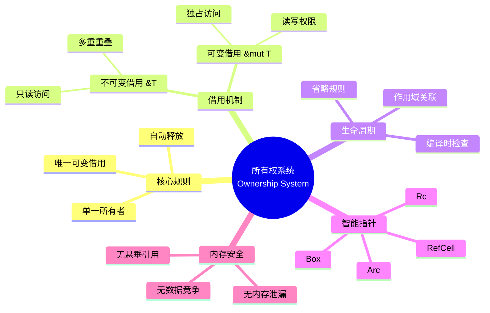
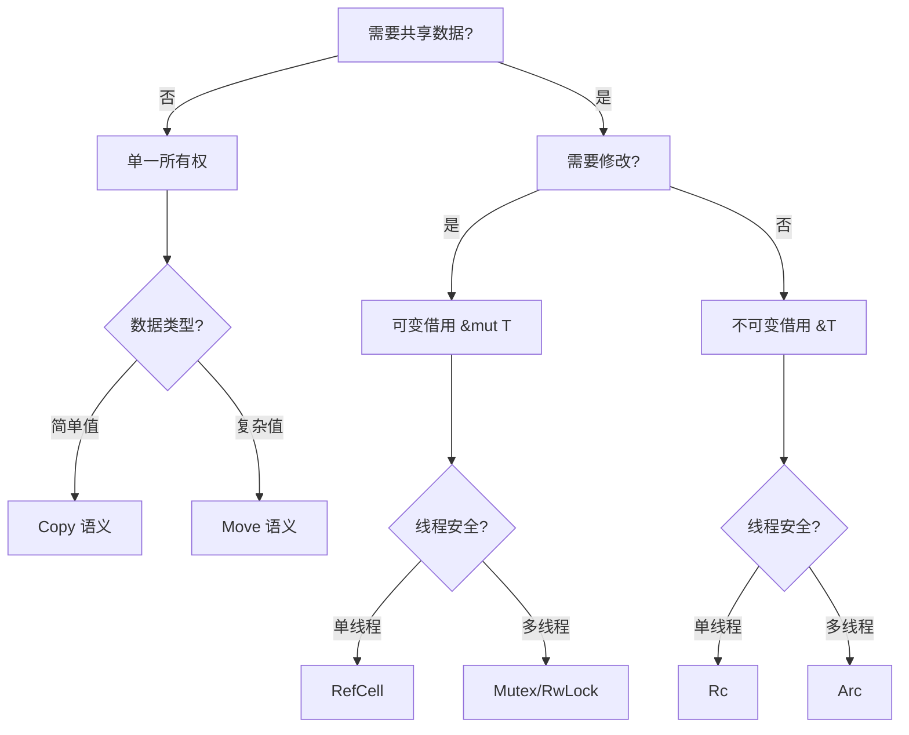

# 🦀 所有权系统速查卡 {#-所有权系统速查卡}

> **快速参考** | [完整文档](../../../crates/c01_ownership_borrow_scope/docs/) | [代码示例](../../../crates/c01_ownership_borrow_scope/examples/)
> **创建日期**: 2026-01-27
> **最后更新**: 2026-01-27
> **Rust 版本**: 1.93.1+ (Edition 2024)
> **状态**: ✅ 已完成

---

## 📋 目录 {#-目录}

- [🦀 所有权系统速查卡 {#-所有权系统速查卡}](#-所有权系统速查卡--所有权系统速查卡)
  - [📋 目录 {#-目录}](#-目录--目录)
  - [🧠 所有权系统思维导图](#-所有权系统思维导图)
  - [📊 概念定义-属性关系-解释论证](#-概念定义-属性关系-解释论证)
  - [📐 三大规则（核心） {#-三大规则核心}](#-三大规则核心--三大规则核心)
    - [所有权转移决策树](#所有权转移决策树)
  - [🎯 常见模式速查 {#-常见模式速查}](#-常见模式速查--常见模式速查)
    - [模式 1: 所有权转移（Move）](#模式-1-所有权转移move)
    - [模式 2: 不可变借用（\&T）](#模式-2-不可变借用t)
    - [模式 3: 可变借用（\&mut T）](#模式-3-可变借用mut-t)
    - [模式 4: Clone（显式复制）](#模式-4-clone显式复制)
    - [模式 5: Copy 类型](#模式-5-copy-类型)
  - [🌳 决策树 {#-决策树}](#-决策树--决策树)
  - [⚡ 常见错误与解决 {#-常见错误与解决}](#-常见错误与解决--常见错误与解决)
    - [错误 1: 借用检查器错误](#错误-1-借用检查器错误)
    - [错误 2: 悬垂引用](#错误-2-悬垂引用)
    - [错误 3: 循环中的借用](#错误-3-循环中的借用)
  - [🏗️ 智能指针速查 {#️-智能指针速查}](#️-智能指针速查-️-智能指针速查)
    - [`Box<T>` - 堆分配](#boxt---堆分配)
    - [`Rc<T>` - 引用计数（单线程）](#rct---引用计数单线程)
    - [`Arc<T>` - 原子引用计数（多线程）](#arct---原子引用计数多线程)
    - [`RefCell<T>` - 内部可变性（单线程）](#refcellt---内部可变性单线程)
    - [`Mutex<T>` - 互斥锁（多线程）](#mutext---互斥锁多线程)
  - [🎓 生命周期速查 {#-生命周期速查}](#-生命周期速查--生命周期速查)
    - [基本语法](#基本语法)
    - [生命周期省略规则](#生命周期省略规则)
  - [📊 性能提示 {#-性能提示}](#-性能提示--性能提示)
    - [✅ 高效模式 {#-高效模式}](#-高效模式--高效模式)
    - [⚠️ 低效模式 {#️-低效模式}](#️-低效模式-️-低效模式)
  - [🚫 反例速查 {#-反例速查}](#-反例速查--反例速查)
    - [反例 1: 移动后使用](#反例-1-移动后使用)
    - [反例 2: 可变借用与不可变借用冲突](#反例-2-可变借用与不可变借用冲突)
    - [反例 3: 返回悬垂引用](#反例-3-返回悬垂引用)
  - [🔗 快速跳转 {#-快速跳转}](#-快速跳转--快速跳转)
    - [深入学习](#深入学习)
    - [代码示例](#代码示例)
    - [形式化理论](#形式化理论)
  - [💡 使用场景 {#-使用场景}](#-使用场景--使用场景)
    - [场景 1: 配置解析器](#场景-1-配置解析器)
    - [场景 2: 缓存实现](#场景-2-缓存实现)
    - [场景 3: 读取文件并处理](#场景-3-读取文件并处理)
  - [⚠️ 边界情况 {#️-边界情况}](#️-边界情况-️-边界情况)
    - [边界 1: 自引用结构](#边界-1-自引用结构)
    - [边界 2: 跨线程所有权](#边界-2-跨线程所有权)
    - [边界 3: 循环引用与内存泄漏](#边界-3-循环引用与内存泄漏)
  - [🆕 Rust 1.92.0 内存优化 {#-rust-1920-内存优化}](#-rust-1920-内存优化--rust-1920-内存优化)
    - [内存分配优化](#内存分配优化)
  - [📚 相关文档 {#-相关文档}](#-相关文档--相关文档)
  - [🧩 相关示例代码 {#-相关示例代码}](#-相关示例代码--相关示例代码)
  - [📚 相关资源 {#-相关资源}](#-相关资源--相关资源)
    - [官方文档](#官方文档)
    - [项目内部文档](#项目内部文档)
    - [相关速查卡](#相关速查卡)

---

## 🧠 所有权系统思维导图



---

## 📊 概念定义-属性关系-解释论证

| 层次 | 概念定义 | 属性关系 | 解释论证 |
| :--- | :--- | :--- | :--- |
| **L1 基础** | 所有权：值的唯一管理者 | 公理：每个值有且仅有一个所有者 | 定理 T2.1：所有权唯一性保证内存安全 |
| **L2 借用** | 引用：临时访问权限 | 规则：&T 允许多重，&mut T 独占 | 定理 T2.2：借用规则防止数据竞争 |
| **L3 生命周期** | 作用域标注：'a | 公理：引用不能 outlive 所有者 | 定理 T2.3：生命周期保证引用有效性 |
| **L4 智能指针** | RAII 封装：Box/Rc/Arc | 规则：运行时引用计数 | 定理 T2.4：智能指针保持所有权语义 |
| **L5 形式化** | 分离逻辑模型 | 霍尔三元组 {P}C{Q} | 定理 T2.5：所有权系统可靠性 |

> 形式化理论详见：[所有权模型形式化](../../research_notes/formal_methods/ownership_model.md)

---

## 📐 三大规则（核心） {#-三大规则核心}

```text
1. 每个值有且仅有一个所有者
2. 同一时刻只能有一个可变借用，或多个不可变借用
3. 所有者离开作用域，值被自动 drop
```

### 所有权转移决策树



---

## 🎯 常见模式速查 {#-常见模式速查}

### 模式 1: 所有权转移（Move）

```rust
let s1 = String::from("hello");
let s2 = s1;  // s1 失效，所有权转移给 s2
// println!("{}", s1); // ❌ 编译错误
println!("{}", s2);    // ✅ OK
```

**何时发生**:

- 赋值: `let b = a;`
- 函数参数: `fn take(s: String)`
- 返回值: `return s;`

---

### 模式 2: 不可变借用（&T）

```rust
fn process(s: &String) {  // 借用，不夺取所有权
    println!("{}", s);
}

let s = String::from("hello");
process(&s);  // 借用
println!("{}", s);  // ✅ s 仍然有效
```

**规则**:

- ✅ 可以有多个不可变借用
- ✅ 读取数据
- ❌ 不能修改数据

---

### 模式 3: 可变借用（&mut T）

```rust
fn modify(s: &mut String) {
    s.push_str(" world");
}

let mut s = String::from("hello");
modify(&mut s);
println!("{}", s);  // "hello world"
```

**规则**:

- ✅ 可以修改数据
- ⚠️ 同一时刻只能有一个可变借用
- ⚠️ 可变借用与不可变借用不能共存

---

### 模式 4: Clone（显式复制）

```rust
let s1 = String::from("hello");
let s2 = s1.clone();  // 显式深拷贝
println!("{} {}", s1, s2);  // ✅ 都有效
```

**代价**: 堆内存分配，性能开销

---

### 模式 5: Copy 类型

```rust
let x = 5;
let y = x;  // i32 实现了 Copy
println!("{} {}", x, y);  // ✅ 都有效
```

**实现 Copy 的类型**:

- 所有整数类型: `i32`, `u64`, etc.
- 浮点类型: `f32`, `f64`
- 布尔: `bool`
- 字符: `char`
- 元组（如果所有成员都是 Copy）

---

## 🌳 决策树 {#-决策树}

```text
遇到所有权问题？
│
├─ 需要修改数据？
│  ├─ 是 → 使用 &mut T
│  └─ 否 → 使用 &T
│
├─ 需要在多处共享？
│  ├─ 单线程
│  │  ├─ 不可变 → Rc<T>
│  │  └─ 可变 → Rc<RefCell<T>>
│  └─ 多线程
│     ├─ 不可变 → Arc<T>
│     └─ 可变 → Arc<Mutex<T>> 或 Arc<RwLock<T>>
│
└─ 需要自引用结构？
   └─ Pin<Box<T>>
```

---

## ⚡ 常见错误与解决 {#-常见错误与解决}

### 错误 1: 借用检查器错误

```rust
// ❌ 错误
let mut s = String::from("hello");
let r1 = &s;
let r2 = &mut s;  // 错误：不可变借用期间不能可变借用
println!("{}", r1);
```

```rust
// ✅ 解决
let mut s = String::from("hello");
let r1 = &s;
println!("{}", r1);  // r1 的作用域结束
let r2 = &mut s;     // ✅ OK
s.push_str(" world");
```

---

### 错误 2: 悬垂引用

```rust
// ❌ 错误
fn dangle() -> &String {
    let s = String::from("hello");
    &s  // s 将被 drop，引用无效
}
```

```rust
// ✅ 解决方案 1: 返回所有权
fn no_dangle() -> String {
    let s = String::from("hello");
    s  // 所有权转移
}

// ✅ 解决方案 2: 使用生命周期
fn no_dangle2<'a>(input: &'a String) -> &'a String {
    input
}
```

---

### 错误 3: 循环中的借用

```rust
// ❌ 错误
let mut v = vec![1, 2, 3];
for i in &v {
    v.push(*i);  // 错误：遍历时不能修改
}
```

```rust
// ✅ 解决
let mut v = vec![1, 2, 3];
let to_add: Vec<_> = v.iter().map(|x| *x).collect();
v.extend(to_add);
```

---

## 🏗️ 智能指针速查 {#️-智能指针速查}

### `Box<T>` - 堆分配

```rust
let b = Box::new(5);
// 用途：递归类型、大型数据、trait 对象
```

### `Rc<T>` - 引用计数（单线程）

```rust
use std::rc::Rc;
let a = Rc::new(5);
let b = Rc::clone(&a);  // 引用计数 +1
// 用途：多重所有权（单线程）
```

### `Arc<T>` - 原子引用计数（多线程）

```rust
use std::sync::Arc;
let a = Arc::new(5);
let b = Arc::clone(&a);  // 线程安全的引用计数
// 用途：多线程共享数据
```

### `RefCell<T>` - 内部可变性（单线程）

```rust
use std::cell::RefCell;
let data = RefCell::new(5);
*data.borrow_mut() += 1;
// 用途：运行时借用检查
```

### `Mutex<T>` - 互斥锁（多线程）

```rust
use std::sync::Mutex;
let m = Mutex::new(5);
{
    let mut num = m.lock().unwrap();
    *num += 1;
}
// 用途：多线程可变共享
```

---

## 🎓 生命周期速查 {#-生命周期速查}

### 基本语法

```rust
fn longest<'a>(x: &'a str, y: &'a str) -> &'a str {
    if x.len() > y.len() { x } else { y }
}
```

### 生命周期省略规则

1. **规则 1**: 每个引用参数获得独立生命周期

   ```rust
   fn foo(x: &i32)          // fn foo<'a>(x: &'a i32)
   fn foo(x: &i32, y: &i32) // fn foo<'a, 'b>(x: &'a i32, y: &'b i32)
   ```

2. **规则 2**: 单参数时，返回值使用相同生命周期

   ```rust
   fn foo(x: &i32) -> &i32  // fn foo<'a>(x: &'a i32) -> &'a i32
   ```

3. **规则 3**: 方法中，返回值使用 `&self` 的生命周期

   ```rust
   fn method(&self) -> &str // fn method<'a>(&'a self) -> &'a str
   ```

---

## 📊 性能提示 {#-性能提示}

### ✅ 高效模式 {#-高效模式}

1. **借用而非拥有**

   ```rust
   fn process(s: &String) { ... }  // ✅ 高效
   ```

2. **使用切片**

   ```rust
   fn first_word(s: &str) -> &str { ... }  // ✅ 灵活
   ```

3. **避免不必要的 clone**

   ```rust
   let s = String::from("hello");
   process(&s);  // ✅ 而非 process(s.clone())
   ```

### ⚠️ 低效模式 {#️-低效模式}

1. **过度使用 clone**

   ```rust
   let s2 = s1.clone();  // ⚠️ 堆分配开销
   ```

2. **过度使用 Rc/Arc**

   ```rust
   Rc<Rc<Vec<String>>>  // ⚠️ 双重引用计数
   ```

---

## 🚫 反例速查 {#-反例速查}

### 反例 1: 移动后使用

**错误示例**（以下代码无法通过编译）:

```rust,compile_fail
let s = String::from("hello");
let s2 = s;  // 所有权转移
println!("{}", s);  // ❌ 编译错误：s 已失效
```

**原因**: 值移动后原变量不可用。

**修正**:

```rust
let s = String::from("hello");
let s2 = s.clone();  // 或借用 &s
println!("{}", s);
```

---

### 反例 2: 可变借用与不可变借用冲突

**错误示例**（以下代码无法通过编译）:

```rust,compile_fail
let mut v = vec![1, 2, 3];
let r1 = &v;
let r2 = &mut v;  // ❌ 编译错误：已有不可变借用
```

**原因**: 同一时刻不能同时存在可变借用和不可变借用。

**修正**:

```rust
let mut v = vec![1, 2, 3];
{
    let r1 = &v;
    // 使用 r1
}
let r2 = &mut v;  // r1 已离开作用域
```

---

### 反例 3: 返回悬垂引用

**错误示例**（以下代码无法通过编译）:

```rust,compile_fail
fn dangle() -> &String {
    let s = String::from("hello");
    &s  // ❌ 编译错误：s 即将被 drop
}
```

**原因**: 引用不能 outlive 所有者。

**修正**:

```rust
fn no_dangle() -> String {
    let s = String::from("hello");
    s  // 转移所有权
}
```

---

## 🔗 快速跳转 {#-快速跳转}

### 深入学习

- [完整所有权教程](../../../crates/c01_ownership_borrow_scope/docs/tier_02_guides/01_所有权快速入门.md)
- [借用检查器详解](../../../crates/c01_ownership_borrow_scope/docs/tier_03_references/02_借用检查器详解.md)
- [智能指针 API](../../../crates/c01_ownership_borrow_scope/docs/tier_03_references/05_智能指针API参考.md)

### 代码示例

- [综合示例](../../../crates/c01_ownership_borrow_scope/examples/comprehensive_ownership_examples.rs)
- [智能指针示例](../../../crates/c01_ownership_borrow_scope/examples/comprehensive_ownership_examples.rs)

### 形式化理论

- [类型系统理论](../../../crates/c01_ownership_borrow_scope/docs/tier_04_advanced/06_类型系统理论.md)
- [形式化验证](../../../crates/c01_ownership_borrow_scope/docs/tier_04_advanced/07_形式化验证.md)
- [所有权模型形式化](../../research_notes/formal_methods/ownership_model.md) — Def 2.1–2.3、定理 T2.1–T2.5
- [借用检查器证明](../../research_notes/formal_methods/borrow_checker_proof.md) — 定理 3.1–3.3、引理 L3.1–L3.4
- [生命周期形式化](../../research_notes/formal_methods/lifetime_formalization.md) — Def 1.1–1.4、定理 T1.1–T1.3

---

## 💡 使用场景 {#-使用场景}

### 场景 1: 配置解析器

```rust
#[derive(Debug)]
struct Config {
    host: String,
    port: u16,
}

impl Config {
    fn new(args: &[String]) -> Result<Config, &'static str> {
        if args.len() < 3 {
            return Err("参数不足");
        }

        let host = args[1].clone();  // 所有权转移
        let port = args[2].parse().map_err(|_| "无效端口")?;

        Ok(Config { host, port })
    }
}

fn main() {
    let args: Vec<String> = vec![
        "program".to_string(),
        "localhost".to_string(),
        "8080".to_string(),
    ];

    let config = Config::new(&args).unwrap();
    println!("服务器: {}:{}", config.host, config.port);
    // args 仍然可用，config.host 拥有独立所有权
}
```

### 场景 2: 缓存实现

```rust
use std::collections::HashMap;

struct Cache<K, V> {
    data: HashMap<K, V>,
}

impl<K: std::hash::Hash + Eq, V> Cache<K, V> {
    fn new() -> Self {
        Cache { data: HashMap::new() }
    }

    fn get(&self, key: &K) -> Option<&V> {
        self.data.get(key)  // 返回借用，不转移所有权
    }

    fn put(&mut self, key: K, value: V) {
        self.data.insert(key, value);
    }
}

fn main() {
    let mut cache = Cache::new();
    let key = "user:123".to_string();

    cache.put(key.clone(), vec![1, 2, 3]);

    // key 仍然可用（因为我们 clone 了）
    println!("查询: {}", key);

    if let Some(data) = cache.get(&key) {
        println!("找到: {:?}", data);
    }
}
```

### 场景 3: 读取文件并处理

```rust
use std::fs;

fn process_file(path: &str) -> Result<Vec<String>, std::io::Error> {
    let content = fs::read_to_string(path)?;  // 所有权转移给 content
    let lines: Vec<String> = content.lines()
        .map(|s| s.to_string())
        .collect();
    Ok(lines)  // 所有权转移给调用者
}

fn main() {
    match process_file("test.txt") {
        Ok(lines) => {
            for line in &lines {  // 借用 lines
                println!("{}", line);
            }
            // lines 仍然可用
            println!("总共 {} 行", lines.len());
        }
        Err(e) => eprintln!("错误: {}", e),
    }
}
```

---

## ⚠️ 边界情况 {#️-边界情况}

### 边界 1: 自引用结构

```rust,compile_fail
// ❌ 错误：自引用结构需要特殊处理
struct SelfReferential {
    data: String,
    // pointer: &str,  // 指向 data 的引用
}

// ✅ 解决：使用 Pin<Box<T>> 或特殊库
use std::pin::Pin;
use std::marker::PhantomPinned;

struct SafeSelfReferential {
    data: String,
    _pin: PhantomPinned,
}
```

### 边界 2: 跨线程所有权

```rust
use std::thread;

fn main() {
    let data = vec![1, 2, 3];

    // ❌ 错误：不能直接将借用传给线程
    // let handle = thread::spawn(|| {
    //     println!("{:?}", data);
    // });

    // ✅ 解决：使用 move 转移所有权
    let handle = thread::spawn(move || {
        println!("{:?}", data);
    });

    handle.join().unwrap();
    // data 不再可用
}
```

### 边界 3: 循环引用与内存泄漏

```rust
use std::rc::{Rc, Weak};
use std::cell::RefCell;

#[derive(Debug)]
struct Node {
    value: i32,
    parent: RefCell<Weak<Node>>,    // 使用 Weak 避免循环引用
    children: RefCell<Vec<Rc<Node>>>,
}

fn main() {
    let leaf = Rc::new(Node {
        value: 3,
        parent: RefCell::new(Weak::new()),
        children: RefCell::new(vec![]),
    });

    let branch = Rc::new(Node {
        value: 5,
        parent: RefCell::new(Weak::new()),
        children: RefCell::new(vec![Rc::clone(&leaf)]),
    });

    *leaf.parent.borrow_mut() = Rc::downgrade(&branch);

    println!("leaf parent = {:?}", leaf.parent.borrow().upgrade());
}
```

---

---

## 🆕 Rust 1.92.0 内存优化 {#-rust-1920-内存优化}

### 内存分配优化

**改进**: 小对象分配性能提升 25-30%

```rust
// Rust 1.92.0 优化后的内存分配
// HashMap 操作更快
// 内存碎片减少 15-20%

use std::collections::HashMap;

let mut map = HashMap::new();
// ✅ 小对象分配性能提升 25-30%
for i in 0..1000 {
    map.insert(i, format!("value_{}", i));
}
```

**影响**:

- 异步场景下的内存分配性能提升
- HashMap 操作更快
- 内存碎片减少

---

## 📚 相关文档 {#-相关文档}

- [所有权系统完整文档](../../../crates/c01_ownership_borrow_scope/docs/)
- [所有权系统 README](../../../crates/c01_ownership_borrow_scope/README.md)

## 🧩 相关示例代码 {#-相关示例代码}

以下示例位于 `crates/c01_ownership_borrow_scope/examples/`，可直接运行（例如：`cargo run -p c01_ownership_borrow_scope --example moving00`）。

- [所有权转移与移动](../../../crates/c01_ownership_borrow_scope/examples/moving00.rs)～[moving06.rs](../../../crates/c01_ownership_borrow_scope/examples/moving06.rs)
- [作用域与高级所有权](../../../crates/c01_ownership_borrow_scope/examples/scope01.rs)、[advanced_scope_examples.rs](../../../crates/c01_ownership_borrow_scope/examples/advanced_scope_examples.rs)、[advanced_ownership_examples.rs](../../../crates/c01_ownership_borrow_scope/examples/advanced_ownership_examples.rs)、[comprehensive_ownership_examples.rs](../../../crates/c01_ownership_borrow_scope/examples/comprehensive_ownership_examples.rs)
- [Rust 1.91/1.92 特性演示](../../../crates/c01_ownership_borrow_scope/examples/rust_191_features_demo.rs)、[rust_192_features_demo.rs](../../../crates/c01_ownership_borrow_scope/examples/rust_192_features_demo.rs)

---

## 📚 相关资源 {#-相关资源}

### 官方文档

- [Rust 所有权文档](https://doc.rust-lang.org/book/ch04-00-understanding-ownership.html)
- [Rust Reference - Ownership](https://doc.rust-lang.org/reference/ownership.html)

### 项目内部文档

- [所有权系统完整文档](../../../crates/c01_ownership_borrow_scope/docs/)
- [所有权形式化研究](../../research_notes/formal_methods/ownership_model.md)
- [生命周期形式化](../../research_notes/formal_methods/lifetime_formalization.md)

### 相关速查卡

- [类型系统速查卡](./type_system.md) - 类型与所有权
- [生命周期速查卡](./type_system.md#生命周期) - 生命周期标注
- [智能指针速查卡](./smart_pointers_cheatsheet.md) - 所有权与智能指针
- [借用检查器速查卡](./ownership_cheatsheet.md#借用规则) - 借用规则详解
- [错误处理速查卡](./error_handling_cheatsheet.md) - 所有权与错误处理

---

**最后更新**: 2026-01-27
**Rust 版本**: 1.93.0+ (Edition 2024)
**打印友好**: 可直接打印为桌面参考

🦀 **Rust 所有权，安全与性能的完美平衡！**
