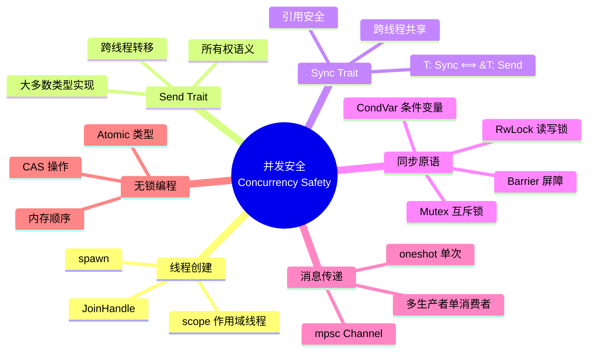
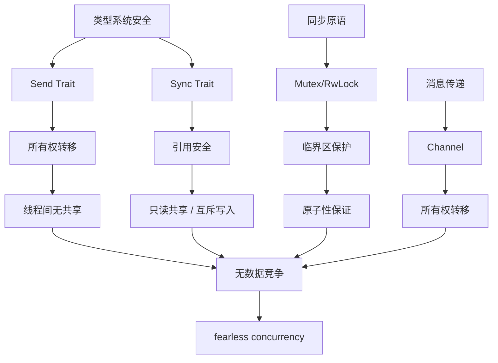

# 🔀 Rust 线程与并发速查卡

> **快速参考** | [完整文档](../../../crates/c05_threads/docs/) | [代码示例](../../../crates/c05_threads/examples/)
> **创建日期**: 2026-01-27
> **最后更新**: 2026-01-27
> **Rust 版本**: 1.93.0+ (Edition 2024)
> **状态**: ✅ 已完成

---

## 📋 目录

- [🔀 Rust 线程与并发速查卡](#-rust-线程与并发速查卡)
  - [📋 目录](#-目录)
  - [🧠 并发安全思维导图](#-并发安全思维导图)
  - [📊 概念定义-属性关系-解释论证](#-概念定义-属性关系-解释论证)
  - [🔬 并发安全证明树](#-并发安全证明树)
  - [🎯 核心概念](#-核心概念)
    - [线程创建](#线程创建)
    - [作用域线程 (Rust 1.93.0+)](#作用域线程-rust-1930)
  - [📐 同步原语](#-同步原语)
    - [Mutex](#mutex)
    - [RwLock](#rwlock)
    - [Arc (原子引用计数)](#arc-原子引用计数)
  - [🎯 消息传递](#-消息传递)
    - [Channel](#channel)
    - [多生产者](#多生产者)
  - [🔧 无锁数据结构](#-无锁数据结构)
    - [Atomic 类型](#atomic-类型)
    - [内存顺序](#内存顺序)
  - [💡 代码示例](#-代码示例)
    - [示例 1: 线程池实现](#示例-1-线程池实现)
    - [示例 2: 条件变量使用](#示例-2-条件变量使用)
    - [示例 3: 屏障同步](#示例-3-屏障同步)
    - [示例 4: Once 初始化](#示例-4-once-初始化)
    - [示例 5: 并发生产者-消费者（多对多）](#示例-5-并发生产者-消费者多对多)
  - [🎯 使用场景](#-使用场景)
    - [场景: 高并发 Web 服务器](#场景-高并发-web-服务器)
  - [🔍 死锁检测与运行时验证](#-死锁检测与运行时验证)
  - [🚫 反例速查](#-反例速查)
    - [反例 1: 将非 Send 类型传入 spawn](#反例-1-将非-send-类型传入-spawn)
    - [反例 2: 死锁 - 重复获取同一 Mutex](#反例-2-死锁---重复获取同一-mutex)
    - [反例 3: 锁顺序不一致导致死锁](#反例-3-锁顺序不一致导致死锁)
    - [反例 4: 在持有锁时进行阻塞操作](#反例-4-在持有锁时进行阻塞操作)
  - [📚 相关文档](#-相关文档)
  - [🧩 相关示例代码](#-相关示例代码)
  - [🔗 相关资源](#-相关资源)
  - [🆕 Rust 1.93.0 并发改进](#-rust-1930-并发改进)
    - [内存分配优化](#内存分配优化)
  - [📚 相关资源](#-相关资源-1)
    - [官方文档](#官方文档)
    - [项目内部文档](#项目内部文档)
    - [形式化理论与决策树](#形式化理论与决策树)
    - [形式化理论与类型系统](#形式化理论与类型系统)
    - [相关速查卡](#相关速查卡)

---

## 🧠 并发安全思维导图



---

## 📊 概念定义-属性关系-解释论证

| 层次 | 概念定义 | 属性关系 | 解释论证 |
|:---|:---|:---|:---|
| **L1 基础** | Send：可跨线程转移所有权 | 公理：T: Send ⟹ 线程间转移安全 | 定理 S1：Send 保证无数据竞争 |
| **L2 共享** | Sync：可跨线程共享引用 | 公理：T: Sync ⟺ &T: Send | 定理 S2：Sync 保证并发读安全 |
| **L3 同步** | Mutex/RwLock：互斥访问 | 规则：锁保护临界区 | 定理 S3：锁顺序一致则无死锁 |
| **L4 通信** | Channel：消息传递 | 规则：所有权随消息转移 | 定理 S4：无共享则无数据竞争 |
| **L5 原子** | Atomic：无锁操作 | 规则：内存顺序保证可见性 | 定理 S5：SeqCst 保证全局顺序 |

> 形式化理论详见：[并发形式化](../../research_notes/formal_methods/send_sync_formalization.md) | [执行模型边界分析](../../research_notes/software_design_theory/03_execution_models/06_boundary_analysis.md)

---

## 🔬 并发安全证明树



---

## 🎯 核心概念

### 线程创建

```rust
use std::thread;

// 基本线程创建
let handle = thread::spawn(|| {
    println!("在新线程中执行");
});

handle.join().unwrap();
```

### 作用域线程 (Rust 1.93.0+)

```rust
use std::thread;

let data = vec![1, 2, 3];

thread::scope(|s| {
    s.spawn(|| {
        println!("数据: {:?}", data);  // 可以借用外部数据
    });
});  // 自动等待所有线程完成
```

---

## 📐 同步原语

### Mutex

```rust
use std::sync::Mutex;

let m = Mutex::new(5);

{
    let mut num = m.lock().unwrap();
    *num = 6;
}  // 锁自动释放
```

### RwLock

```rust
use std::sync::RwLock;

let lock = RwLock::new(5);

// 多个读锁
{
    let r1 = lock.read().unwrap();
    let r2 = lock.read().unwrap();
}

// 单个写锁
{
    let mut w = lock.write().unwrap();
    *w += 1;
}
```

### Arc (原子引用计数)

```rust
use std::sync::Arc;
use std::thread;

let data = Arc::new(vec![1, 2, 3]);

for i in 0..3 {
    let data = Arc::clone(&data);
    thread::spawn(move || {
        println!("线程 {}: {:?}", i, data);
    });
}
```

---

## 🎯 消息传递

### Channel

```rust
use std::sync::mpsc;

let (tx, rx) = mpsc::channel();

thread::spawn(move || {
    tx.send("消息").unwrap();
});

let received = rx.recv().unwrap();
```

### 多生产者

```rust
use std::sync::mpsc;

let (tx, rx) = mpsc::channel();
let tx1 = tx.clone();

thread::spawn(move || {
    tx.send("消息1").unwrap();
});

thread::spawn(move || {
    tx1.send("消息2").unwrap();
});

for received in rx {
    println!("收到: {}", received);
}
```

---

## 🔧 无锁数据结构

### Atomic 类型

```rust
use std::sync::atomic::{AtomicUsize, Ordering};

let counter = AtomicUsize::new(0);

counter.fetch_add(1, Ordering::SeqCst);
let value = counter.load(Ordering::SeqCst);
```

### 内存顺序

```rust
use std::sync::atomic::Ordering;

// 顺序一致性（最强）
Ordering::SeqCst

// 获取-释放
Ordering::Acquire
Ordering::Release
Ordering::AcqRel

// 宽松（最弱）
Ordering::Relaxed
```

**内存顺序选型决策树**（详见 [06_boundary_analysis](../../research_notes/software_design_theory/03_execution_models/06_boundary_analysis.md)）：

| 场景 | 推荐 | 说明 |
| :--- | :--- | :--- |
| 需全局顺序保证 | `SeqCst` | 最强、开销最大；调试/简单场景 |
| 锁/同步点 | `Acquire`/`Release` | 获取-释放语义；Mutex 内部 |
| 纯计数器、无依赖 | `Relaxed` | 最弱、最快；仅需原子性 |

---

## 💡 代码示例

### 示例 1: 线程池实现

```rust
use std::sync::{mpsc, Arc, Mutex};
use std::thread;

pub struct ThreadPool {
    workers: Vec<Worker>,
    sender: mpsc::Sender<Job>,
}

type Job = Box<dyn FnOnce() + Send + 'static>;

impl ThreadPool {
    pub fn new(size: usize) -> ThreadPool {
        let (sender, receiver) = mpsc::channel();
        let receiver = Arc::new(Mutex::new(receiver));

        let mut workers = Vec::with_capacity(size);
        for id in 0..size {
            workers.push(Worker::new(id, Arc::clone(&receiver)));
        }

        ThreadPool { workers, sender }
    }

    pub fn execute<F>(&self, f: F)
    where
        F: FnOnce() + Send + 'static,
    {
        let job = Box::new(f);
        self.sender.send(job).unwrap();
    }
}

struct Worker {
    id: usize,
    thread: thread::JoinHandle<()>,
}

impl Worker {
    fn new(id: usize, receiver: Arc<Mutex<mpsc::Receiver<Job>>>) -> Worker {
        let thread = thread::spawn(move || loop {
            let job = receiver.lock().unwrap().recv().unwrap();
            println!("Worker {} got a job; executing.", id);
            job();
        });
        Worker { id, thread }
    }
}

// 使用
let pool = ThreadPool::new(4);
for i in 0..8 {
    pool.execute(move || {
        println!("Processing task {}", i);
    });
}
```

### 示例 2: 条件变量使用

```rust
use std::sync::{Arc, Condvar, Mutex};
use std::thread;
use std::time::Duration;

struct BoundedBuffer<T> {
    buffer: Mutex<Vec<T>>,
    not_full: Condvar,
    not_empty: Condvar,
    capacity: usize,
}

impl<T> BoundedBuffer<T> {
    fn new(capacity: usize) -> Self {
        Self {
            buffer: Mutex::new(Vec::with_capacity(capacity)),
            not_full: Condvar::new(),
            not_empty: Condvar::new(),
            capacity,
        }
    }

    fn push(&self, item: T) {
        let mut buffer = self.buffer.lock().unwrap();
        while buffer.len() >= self.capacity {
            buffer = self.not_full.wait(buffer).unwrap();
        }
        buffer.push(item);
        self.not_empty.notify_one();
    }

    fn pop(&self) -> T {
        let mut buffer = self.buffer.lock().unwrap();
        while buffer.is_empty() {
            buffer = self.not_empty.wait(buffer).unwrap();
        }
        let item = buffer.remove(0);
        self.not_full.notify_one();
        item
    }
}

// 使用
let buffer = Arc::new(BoundedBuffer::new(10));
let producer = Arc::clone(&buffer);
let consumer = Arc::clone(&buffer);

thread::spawn(move || {
    for i in 0..20 {
        producer.push(i);
        thread::sleep(Duration::from_millis(10));
    }
});

thread::spawn(move || {
    for _ in 0..20 {
        let item = consumer.pop();
        println!("Consumed: {}", item);
        thread::sleep(Duration::from_millis(20));
    }
});
```

### 示例 3: 屏障同步

```rust
use std::sync::Barrier;
use std::thread;

let barrier = Barrier::new(3);
let mut handles = vec![];

for i in 0..3 {
    let b = barrier.clone();
    handles.push(thread::spawn(move || {
        println!("Thread {} before barrier", i);
        b.wait();
        println!("Thread {} after barrier", i);
    }));
}

for h in handles {
    h.join().unwrap();
}
```

### 示例 4: Once 初始化

```rust
use std::sync::Once;
use std::thread;

static INIT: Once = Once::new();
static mut GLOBAL_DATA: Option<String> = None;

fn init_global_data() {
    unsafe {
        GLOBAL_DATA = Some("Initialized".to_string());
    }
}

let mut handles = vec![];
for _ in 0..5 {
    handles.push(thread::spawn(|| {
        INIT.call_once(init_global_data);
        unsafe {
            println!("Data: {:?}", GLOBAL_DATA);
        }
    }));
}

for h in handles {
    h.join().unwrap();
}
```

### 示例 5: 并发生产者-消费者（多对多）

```rust
use std::sync::mpsc;
use std::thread;

let (tx, rx) = mpsc::channel::<i32>();
let num_producers = 3;
let num_consumers = 2;

// 生产者
for i in 0..num_producers {
    let tx = tx.clone();
    thread::spawn(move || {
        for j in 0..5 {
            tx.send(i * 10 + j).unwrap();
        }
    });
}
drop(tx); // 关闭原始 sender

// 消费者
let mut handles = vec![];
for i in 0..num_consumers {
    let rx = rx.clone();
    handles.push(thread::spawn(move || {
        for msg in rx {
            println!("Consumer {} received: {}", i, msg);
        }
    }));
}

for h in handles {
    h.join().unwrap();
}
```

---

## 🎯 使用场景

### 场景: 高并发 Web 服务器

在实际应用中，线程并发模式常用于构建高性能服务器。以下是一个简化的请求处理器：

```rust
use std::sync::{Arc, Mutex, mpsc};
use std::thread;
use std::time::Duration;

// 请求结构
type Request = Box<dyn FnOnce() + Send + 'static>;

// 任务队列
struct TaskQueue {
    sender: mpsc::Sender<Request>,
}

impl TaskQueue {
    fn new(worker_count: usize) -> Self {
        let (sender, receiver) = mpsc::channel::<Request>();
        let receiver = Arc::new(Mutex::new(receiver));

        for id in 0..worker_count {
            let rx = Arc::clone(&receiver);
            thread::spawn(move || {
                loop {
                    let task = rx.lock().unwrap().recv();
                    match task {
                        Ok(job) => {
                            println!("Worker {} processing request", id);
                            job();
                        }
                        Err(_) => break, // 通道关闭
                    }
                }
            });
        }

        TaskQueue { sender }
    }

    fn submit<F>(&self, task: F)
    where
        F: FnOnce() + Send + 'static,
    {
        self.sender.send(Box::new(task)).unwrap();
    }
}

// 使用：Web 服务器处理请求
fn main() {
    let queue = TaskQueue::new(4);

    for i in 0..100 {
        queue.submit(move || {
            // 模拟处理 HTTP 请求
            println!("Handling request #{}", i);
            thread::sleep(Duration::from_millis(10));
        });
    }
}
```

---

## 🔍 死锁检测与运行时验证

**说明**：死锁无法静态判定（见 [06_boundary_analysis](../../research_notes/software_design_theory/03_execution_models/06_boundary_analysis.md) § 静态判定 vs 运行时验证）。需以下工具辅助：

| 工具 | 用途 | 使用方式 |
| :--- | :--- | :--- |
| **Miri** | 未定义行为、数据竞争 | `cargo +nightly miri test` |
| **loom** | 并发调度穷举测试 | 依赖 `loom` crate |
| **cargo-deadlock** | 检测潜在死锁 | `cargo install cargo-deadlock` |
| **ThreadSanitizer** | 数据竞争检测 | `RUSTFLAGS="-Z sanitizer=thread" cargo test` |

**最佳实践**：统一锁顺序、避免嵌套锁、优先消息传递（channel）减少共享可变。

---

## 🚫 反例速查

### 反例 1: 将非 Send 类型传入 spawn

**错误示例**:

```rust
let rc = std::rc::Rc::new(1);
thread::spawn(|| {
    println!("{}", rc);  // ❌ Rc 不是 Send
});
```

**原因**: `thread::spawn` 要求闭包捕获的类型实现 `Send`。

**修正**:

```rust
let arc = std::sync::Arc::new(1);
thread::spawn(move || {
    println!("{}", arc);
});
```

---

### 反例 2: 死锁 - 重复获取同一 Mutex

**错误示例**:

```rust
let m = Mutex::new(1);
let g1 = m.lock().unwrap();
let g2 = m.lock().unwrap();  // ❌ 死锁：同一线程重复获取
```

**原因**: `Mutex` 非递归，同一线程重复 lock 会死锁。

**修正**:

```rust
let g = m.lock().unwrap();
// 使用 g，作用域结束后释放
```

---

### 反例 3: 锁顺序不一致导致死锁

**错误示例**:

```rust
let lock_a = Mutex::new(0);
let lock_b = Mutex::new(0);

// 线程 1
thread::spawn(move || {
    let _a = lock_a.lock().unwrap();
    let _b = lock_b.lock().unwrap();  // 等待线程 2 释放 lock_b
});

// 线程 2
thread::spawn(move || {
    let _b = lock_b.lock().unwrap();
    let _a = lock_a.lock().unwrap();  // 等待线程 1 释放 lock_a
});
// ❌ 死锁：循环等待
```

**原因**: 不同线程以不同顺序获取锁，形成循环等待。

**修正**:

```rust
// 统一锁获取顺序
thread::spawn(move || {
    let _a = lock_a.lock().unwrap();
    let _b = lock_b.lock().unwrap();
});

thread::spawn(move || {
    let _a = lock_a.lock().unwrap();  // 先获取 a
    let _b = lock_b.lock().unwrap();  // 再获取 b
});
```

---

### 反例 4: 在持有锁时进行阻塞操作

**错误示例**:

```rust
let data = Arc::new(Mutex::new(vec![1, 2, 3]));
let data2 = Arc::clone(&data);

thread::spawn(move || {
    let mut vec = data2.lock().unwrap();
    thread::sleep(Duration::from_secs(10));  // ❌ 持有锁时休眠
    vec.push(4);
});

// 其他线程无法获取锁，被阻塞 10 秒
```

**原因**: 长时间持有锁会严重影响并发性能。

**修正**:

```rust
thread::spawn(move || {
    {
        let mut vec = data2.lock().unwrap();
        vec.push(4);
    } // 立即释放锁
    thread::sleep(Duration::from_secs(10));  // 无锁时休眠
});
```

---

## 📚 相关文档

- [线程与并发完整文档](../../../crates/c05_threads/docs/)
- [线程与并发 README](../../../crates/c05_threads/README.md)

## 🧩 相关示例代码

以下示例位于 `crates/c05_threads/examples/`，可直接运行（例如：`cargo run -p c05_threads --example message_passing_demo`）。

- [消息传递与高级并发](../../../crates/c05_threads/examples/message_passing_demo.rs)、[advanced_concurrency_patterns_demo.rs](../../../crates/c05_threads/examples/advanced_concurrency_patterns_demo.rs)
- [背压与流式处理](../../../crates/c05_threads/examples/backpressure_overview_demo.rs)、[stream_backpressure_demo.rs](../../../crates/c05_threads/examples/stream_backpressure_demo.rs)、[stream_rate_batch_demo.rs](../../../crates/c05_threads/examples/stream_rate_batch_demo.rs)
- [优先级通道与实战模式](../../../crates/c05_threads/examples/priority_channels_demo.rs)、[real_world_threading_demo.rs](../../../crates/c05_threads/examples/real_world_threading_demo.rs)、[performance_optimization_demo.rs](../../../crates/c05_threads/examples/performance_optimization_demo.rs)
- [Rust 1.92 特性演示](../../../crates/c05_threads/examples/rust_192_features_demo.rs)、[rust_190_features_demo.rs](../../../crates/c05_threads/examples/rust_190_features_demo.rs)

---

## 🔗 相关资源

- [并发模式速查卡](./async_patterns.md)
- [Rust 官方文档 - 并发](https://doc.rust-lang.org/book/ch16-00-concurrency.html)

---

## 🆕 Rust 1.93.0 并发改进

### 内存分配优化

**改进**: 小对象分配性能提升 25-30%（并发场景）

```rust
// Rust 1.93.0 优化后的并发内存分配（全局分配器支持线程本地存储）
use std::sync::Arc;
use std::collections::HashMap;

// ✅ 并发场景下的内存分配性能提升
let shared_map: Arc<HashMap<i32, String>> = Arc::new(HashMap::new());
```

**影响**:

- 并发场景下的内存分配性能提升
- 同步原语性能优化
- 内存碎片减少

---

## 📚 相关资源

### 官方文档

- [Rust 并发文档](https://doc.rust-lang.org/book/ch16-00-fearless-concurrency.html)
- [std::thread 文档](https://doc.rust-lang.org/std/thread/)
- [std::sync 文档](https://doc.rust-lang.org/std/sync/)

### 项目内部文档

- [线程与并发完整文档](../../../crates/c05_threads/docs/)
- [并发研究笔记](../../research_notes/)

### 形式化理论与决策树

- [执行模型边界分析](../../research_notes/software_design_theory/03_execution_models/06_boundary_analysis.md) — Def EB-DET1、确定性判定、静态 vs 运行时验证
- [执行模型选型决策树](../../research_notes/software_design_theory/03_execution_models/06_boundary_analysis.md#决策树选择执行模型)
- [确定性判定决策树](../../research_notes/software_design_theory/03_execution_models/06_boundary_analysis.md#确定性判定决策树) — 执行顺序→Sync/Async/Concurrent/Parallel 选型

### 形式化理论与类型系统

- [执行模型边界分析](../../research_notes/software_design_theory/03_execution_models/06_boundary_analysis.md) — 确定性判定、静态 vs 运行时验证
- [执行模型选型决策树](../../research_notes/software_design_theory/03_execution_models/06_boundary_analysis.md#决策树选择执行模型)
- [并发形式化](../../research_notes/formal_methods/send_sync_formalization.md) — Send/Sync trait 形式化定义
- [状态机形式化](../../research_notes/formal_methods/async_state_machine.md) — 并发状态机模型
- [生命周期形式化](../../research_notes/formal_methods/lifetime_formalization.md) — 借用与生命周期
- [所有权模型](../../research_notes/formal_methods/ownership_model.md) — 所有权系统形式化基础

### 相关速查卡

- [异步编程速查卡](./async_patterns.md) - 异步并发对比
- [智能指针速查卡](./smart_pointers_cheatsheet.md) - Arc 和 Mutex
- [所有权系统速查卡](./ownership_cheatsheet.md) - 所有权与并发
- [错误处理速查卡](./error_handling_cheatsheet.md) - 并发错误处理

---

**最后更新**: 2026-01-27
**Rust 版本**: 1.93.0+ (Edition 2024)
