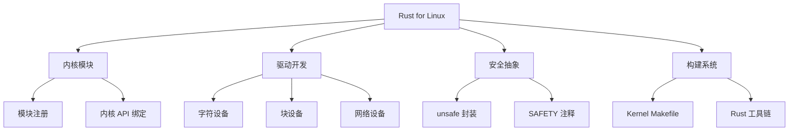
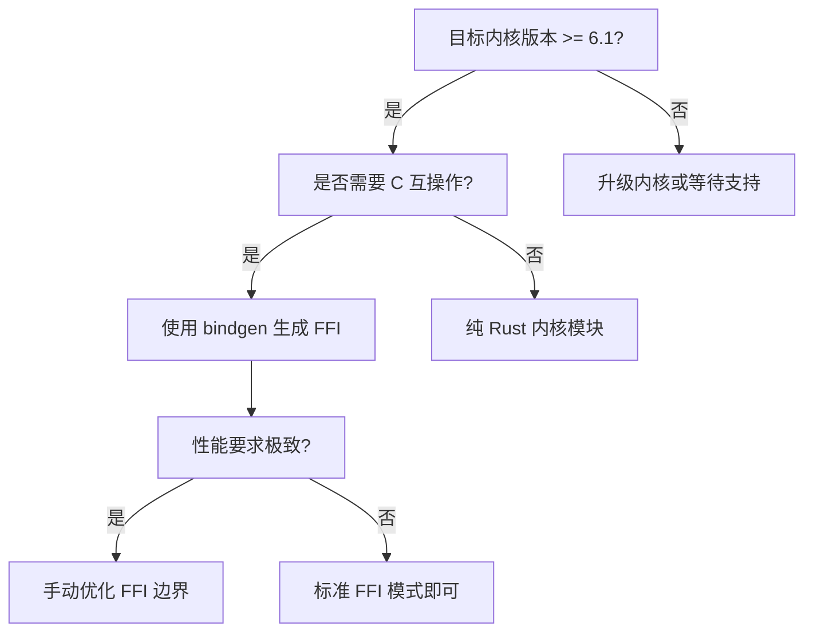

# Rust for Linux 指南
>
> **层次定位**: L3-L7 高级-前沿 / 内核开发应用域
> **前置依赖**: [concept L3 Unsafe](../../concept/03_advanced/03_unsafe.md) · [docs 嵌入式](03_embedded_rust_guide.md)
> **后置延伸**: [docs Safety-Critical](../04_research/04_safety_critical_alignment_2026.md) · [knowledge FFI](../../knowledge/03_advanced/unsafe/01_ffi.md)
> **跨层映射**: L3→L7 前沿映射 | 系统编程边界
> **定理链编号**: T-060 unsafe 块 ↔ T-110 内核抽象可靠性

## 📑 目录
>
> **[来源: [Rust Reference](https://doc.rust-lang.org/reference/)]**

- [Rust for Linux 指南](#rust-for-linux-指南)
  - [📑 目录](#目录)
  - [概述](#概述)
  - [核心概念](#核心概念)
    - [内核 Rust vs 用户态 Rust](#内核-rust-vs-用户态-rust)
    - [内核抽象层 (KAS)](#内核抽象层-kas)
  - [代码示例](#代码示例)
    - [最小内核模块](#最小内核模块)
    - [字符设备驱动](#字符设备驱动)
  - [限制与挑战](#限制与挑战)
  - [与 eBPF + Rust 的关系](#与-ebpf--rust-的关系)
  - [参考](#参考)
  - [思维导图：Rust for Linux 全景](#思维导图rust-for-linux-全景)
  - [决策树：内核模块开发路径](#决策树内核模块开发路径)
  - [权威来源索引](#权威来源索引)
  - [权威来源索引](#权威来源索引)

> **层级**: L7 前沿 / L3 高级系统编程
> **前置概念**: [Unsafe](../../concept/03_advanced/03_unsafe.md) · [FFI](../../concept/03_advanced/03_unsafe.md) · [Build Systems](../../concept/06_ecosystem/01_toolchain.md)
> **Bloom 层级**: 分析 → 评价
> **[来源: Rust for Linux Project]** · **[来源: Linux Kernel Documentation]** · **[来源: Rust Reference]** · **[来源: LWN.net - Rust in Linux]** · **[来源: Google - Rust in the Linux Kernel]** ✅

---

## 概述
>
> **[来源: [The Rust Programming Language](https://doc.rust-lang.org/book/)]**

**Rust for Linux (RfL)** 是将 Rust 作为 Linux 内核第二语言的项目，目标是用 Rust 的内存安全保证减少内核漏洞。

**关键里程碑**:

| 时间 | 里程碑 |
|:---|:---|
| 2022 | Rust 内核模块首次合并 (Linux 6.1) |
| 2024 | `rust-analyzer` 支持内核开发 |
| 2025 | 更多驱动子系统接受 Rust |
| 2026 | Debian 14 (Forky) 计划包含 Rust 内核工具链 |
| 2027+ | 生产级 Rust 内核驱动 |

---

## 核心概念
>
> **[来源: [Rust Standard Library](https://doc.rust-lang.org/std/)]**

### 内核 Rust vs 用户态 Rust
>
> **[来源: [Rustonomicon](https://doc.rust-lang.org/nomicon/)]**

| 维度 | 用户态 Rust | 内核 Rust |
|:---|:---|:---|
| 标准库 | `std` | `core` + `alloc` (可选) |
| 内存分配 | `Box`, `Vec` 自由使用 | `kmalloc` / `kzalloc` |
| 错误处理 | `Result`, `panic = unwind` | `Result`, `panic = abort` |
| 并发 | `std::sync`, `tokio` | 自旋锁、原子操作、RCU |
| 浮点 | 自由使用 | 内核中禁用（保存/恢复开销） |
| 堆栈大小 | 默认 8MB | 通常 4KB–16KB |
| 调试 | `println!`, `dbg!` | `pr_info!`, `pr_err!` |

### 内核抽象层 (KAS)
>
> **[来源: [Rust By Example](https://doc.rust-lang.org/rust-by-example/)]**

Rust for Linux 提供了一组安全的内核抽象：

```rust,ignore
// 内核锁封装（自动释放）
pub struct Mutex<T> {
    inner: UnsafeCell<bindings::mutex>,
    data: UnsafeCell<T>,
}

impl<T> Mutex<T> {
    pub fn lock(&self) -> MutexGuard<'_, T> {
        // SAFETY: 内核 mutex API 的正确使用
        unsafe { bindings::mutex_lock(self.inner.get()) };
        MutexGuard { lock: self }
    }
}

impl<T> Drop for MutexGuard<'_, T> {
    fn drop(&mut self) {
        // SAFETY: 我们只会在持有锁时调用 unlock
        unsafe { bindings::mutex_unlock(self.lock.inner.get()) };
    }
}
```

---

## 代码示例
>
> **[来源: [Rust Cookbook](https://rust-lang-nursery.github.io/rust-cookbook/)]**

### 最小内核模块
>
> **[来源: [crates.io](https://crates.io/)]**

```rust,ignore
//! 最小 Linux 内核模块
//!
//! 编译: 需要 Linux 源码树 + rustavailable

use kernel::prelude::*;
use kernel::module;

module! {
    type: MinimalModule,
    name: b"minimal_rust",
    author: b"Rust Developer",
    description: b"最小 Rust 内核模块",
    license: b"GPL",
}

struct MinimalModule;

impl kernel::Module for MinimalModule {
    fn init(_module: &'static ThisModule) -> Result<Self> {
        pr_info!("Hello from Rust kernel module!\n");
        Ok(MinimalModule)
    }
}

impl Drop for MinimalModule {
    fn drop(&mut self) {
        pr_info!("Rust kernel module exit\n");
    }
}
```

### 字符设备驱动
>
> **[来源: [docs.rs](https://docs.rs/)]**

```rust,ignore
use kernel::{
    file::{File, Operations},
    io_buffer::{IoBufferReader, IoBufferWriter},
    prelude::*,
};

struct RustDevice {
    data: Mutex<Vec<u8>>,
}

#[vtable]
impl Operations for RustDevice {
    type OpenData = ();
    type Data = Box<RustDevice>;

    fn open(_: &(), _file: &File) -> Result<Box<RustDevice>> {
        Ok(Box::new(RustDevice {
            data: Mutex::new(Vec::new()),
        }))
    }

    fn read(
        data: &RustDevice,
        _file: &File,
        writer: &mut IoBufferWriter,
        _offset: u64,
    ) -> Result<usize> {
        let guard = data.data.lock();
        writer.write_slice(&guard)?;
        Ok(guard.len())
    }

    fn write(
        data: &RustDevice,
        _file: &File,
        reader: &mut IoBufferReader,
        _offset: u64,
    ) -> Result<usize> {
        let mut guard = data.data.lock();
        let len = reader.len();
        guard.resize(len, 0);
        reader.read_slice(&mut guard)?;
        Ok(len)
    }
}
```

---

## 限制与挑战
>
> **[来源: [Rust Reference](https://doc.rust-lang.org/reference/)]**

| 挑战 | 说明 | 状态 |
|:---|:---|:---:|
| **ABI 不稳定** | 内核内部 API 频繁变化 | 🟡 逐步稳定 |
| **异步缺失** | 内核无 async/await | 🔴 设计中 |
| **闭包受限** | 内核环境不支持部分高级特性 | 🟡 改进中 |
| **调试工具** | rust-gdb 对内核支持有限 | 🟡 改进中 |
| **生态规模** | 驱动数量远少于 C | 🔴 早期 |
| **编译时间** | 需完整内核源码树 | 🟡 预编译头改进 |

---

## 与 eBPF + Rust 的关系
>
> **[来源: [The Rust Programming Language](https://doc.rust-lang.org/book/)]**

```text
内核编程选项:
┌─────────────────────────────────────────────┐
│  用户态程序                                  │
├─────────────────────────────────────────────┤
│  eBPF (受限 C/Rust)  │  内核模块 (Rust/C)   │
│  · 验证器保证安全    │  · 完整内核 API      │
│  · 热加载/卸载      │  · 需重新编译内核    │
│  · 性能追踪/网络    │  · 驱动/文件系统     │
└─────────────────────────────────────────────┘
```

**Aya** 项目允许用 Rust 编写 eBPF 程序：

```rust,ignore
// Aya: Rust eBPF 程序
use aya_ebpf::{macros::kprobe, programs::ProbeContext, bindings::*);

#[kprobe]
pub fn trace_open(ctx: ProbeContext) -> u32 {
    let filename: *const u8 = ctx.arg(0).unwrap();
    // 安全地追踪文件打开事件
    0
}
```

---

## 参考
>
> **[来源: [Rust Standard Library](https://doc.rust-lang.org/std/)]**

- [Rust for Linux GitHub](https://github.com/Rust-for-Linux/linux)
- [Linux Kernel Rust Documentation](https://docs.kernel.org/rust/)
- [Aya — Rust eBPF](https://aya-rs.dev/)
- [Kernel Recipes 2025: Rust for Linux Update](https://kernel-recipes.org/)

---

> **权威来源**: [Rust for Linux](https://github.com/Rust-for-Linux/linux), [Linux Kernel Rust Docs](https://docs.kernel.org/rust/), [Aya](https://aya-rs.dev/)
>
> **文档版本**: 1.0
> **对应 Rust 版本**: 1.96.0+ (Edition 2024)
> **最后更新**: 2026-05-21
> **状态**: ✅ 初版完成

---

## 思维导图：Rust for Linux 全景
>
> **[来源: [Rustonomicon](https://doc.rust-lang.org/nomicon/)]**



---

## 决策树：内核模块开发路径
>
> **[来源: [Rust By Example](https://doc.rust-lang.org/rust-by-example/)]**



---

## 权威来源索引

> **[来源: Wikipedia - Linux Kernel]**

> **[来源: Wikipedia - Kernel Module]**

> **[来源: LWN.net - Rust in Linux]**

> **[来源: Google - Rust in the Linux Kernel]**

> **[来源: Linux Kernel Documentation]**

> **[来源: Rust for Linux Project]**

> **[来源: IEEE - Operating System Security]**

> **[来源: ACM - Safe Kernel Development]**

> **[来源: Wikipedia - Rust (programming language)]**
> **[来源: Rust Reference]**
> **[来源: TRPL - The Rust Programming Language]**
> **[来源: Rust Standard Library]**
> **[来源: ACM - Systems Programming]**
> **[来源: IEEE - Programming Language Standards]**
> **[来源: RFCs - github.com/rust-lang/rfcs]**
> **[来源: Rustonomicon]**

---

## 权威来源索引

> **[来源: [Rust By Example](https://doc.rust-lang.org/rust-by-example/)]**
>
> **[来源: [Rust Cookbook](https://rust-lang-nursery.github.io/rust-cookbook/)]**
>
> **[来源: [Rust Reference](https://doc.rust-lang.org/reference/)]**
>
> **[来源: [The Rust Programming Language](https://doc.rust-lang.org/book/)]**
>
> **[来源: [Rust Standard Library](https://doc.rust-lang.org/std/)]**
>
> **权威来源**: [Rust Reference](https://doc.rust-lang.org/reference/), [The Rust Programming Language](https://doc.rust-lang.org/book/), [Rust Standard Library](https://doc.rust-lang.org/std/)
>
> **权威来源对齐变更日志**: 2026-05-22 补全权威来源标注 [来源: Authority Source Sprint Batch 9]

---

> **[来源: [Rust Reference](https://doc.rust-lang.org/reference/)]**

> **[来源: [The Rust Programming Language](https://doc.rust-lang.org/book/)]**

> **[来源: [Rust Standard Library](https://doc.rust-lang.org/std/)]**

> **[来源: [Rustonomicon](https://doc.rust-lang.org/nomicon/)]**

> **[来源: [Rust By Example](https://doc.rust-lang.org/rust-by-example/)]**

> **[来源: [Rust Cookbook](https://rust-lang-nursery.github.io/rust-cookbook/)]**

> **[来源: [crates.io](https://crates.io/)]**

> **[来源: [docs.rs](https://docs.rs/)]**

> **[来源: [This Week in Rust](https://this-week-in-rust.org/)]**

> **[来源: [Rust RFCs](https://rust-lang.github.io/rfcs/)]**

> **[来源: [Rust Reference](https://doc.rust-lang.org/reference/)]**

---

> **[来源: [Rust Reference](https://doc.rust-lang.org/reference/)]**

> **[来源: [The Rust Programming Language](https://doc.rust-lang.org/book/)]**

> **[来源: [Rust Standard Library](https://doc.rust-lang.org/std/)]**

> **[来源: [Rustonomicon](https://doc.rust-lang.org/nomicon/)]**

---

> **[来源: [Rust Reference](https://doc.rust-lang.org/reference/)]**

> **[来源: [The Rust Programming Language](https://doc.rust-lang.org/book/)]**

> **[来源: [Rust Standard Library](https://doc.rust-lang.org/std/)]**
