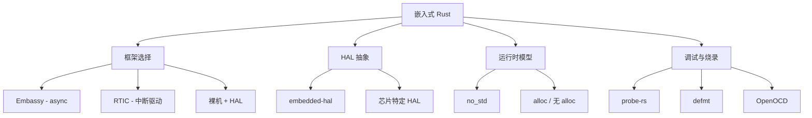
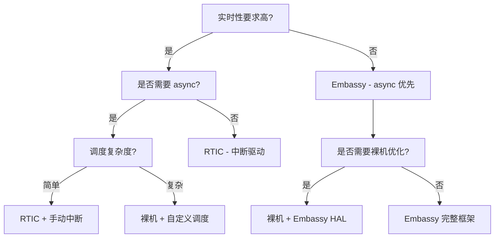

# 嵌入式 Rust 指南：Embassy vs RTIC
>
> **层次定位**: L3-L6 高级-生态 / 嵌入式应用域
> **前置依赖**: [concept L3 Async](../../concept/03_advanced/02_async.md) · [concept L3 Unsafe](../../concept/03_advanced/03_unsafe.md) · [docs 核心概念](../01_core/README.md)
> **后置延伸**: [docs Rust for Linux](./RUST_FOR_LINUX_GUIDE.md) · [knowledge Unsafe](../../knowledge/03_advanced/unsafe/README.md)
> **跨层映射**: L3→L6 工程映射 | 理论→实践
> **定理链编号**: T-050 Pin 安全性 → T-060 unsafe 抽象

## 📑 目录
> **[来源: [Rust Reference](https://doc.rust-lang.org/reference/)]**

- [嵌入式 Rust 指南：Embassy vs RTIC](#嵌入式-rust-指南embassy-vs-rtic)
  - [📑 目录](#-目录)
  - [概述](#概述)
  - [Embassy：异步嵌入式](#embassy异步嵌入式)
    - [核心设计](#核心设计)
    - [关键特性](#关键特性)
    - [代码示例](#代码示例)
    - [多任务并发](#多任务并发)
  - [RTIC：实时中断驱动并发](#rtic实时中断驱动并发)
    - [核心设计](#核心设计-1)
    - [关键特性](#关键特性-1)
    - [代码示例](#代码示例-1)
  - [Embassy vs RTIC 对比](#embassy-vs-rtic-对比)
  - [决策树](#决策树)
  - [参考](#参考)
  - [思维导图：嵌入式 Rust 生态全景](#思维导图嵌入式-rust-生态全景)
  - [决策树：嵌入式框架选择](#决策树嵌入式框架选择)
  - [权威来源索引](#权威来源索引)

> **层级**: L6 生态工具 / L3 高级系统编程
> **前置概念**: [Async](../../concept/03_advanced/02_async.md) · [Ownership](../../concept/01_foundation/01_ownership.md) · [Unsafe](../../concept/03_advanced/03_unsafe.md)
> **Bloom 层级**: 应用 → 评价
> **[来源: Embassy Book]** · **[来源: RTIC Book]** · **[来源: Rust Embedded Working Group]** · **[来源: Wikipedia - Embedded System]** · **[来源: Wikipedia - Real-Time Operating System]** · **[来源: Rust Embedded Book - docs.rust-embedded.org]** ✅

---

## 概述
> **[来源: [The Rust Programming Language](https://doc.rust-lang.org/book/)]**

嵌入式 Rust 生态在 2024–2026 年经历了爆炸式增长：

- **Embassy**: 异步优先的嵌入式框架，1400+ HALs，stable Rust 运行
- **RTIC**: 实时中断驱动并发框架，1.0 已发布，确定性调度
- **Rust for Linux**: 内核模块开发，内核 6.1+ 实验性支持

```text
嵌入式 Rust 选型矩阵
                    实时性要求
                 低 ◄─────────► 高
            ┌──────────────────────────┐
        高  │    Embassy      │  RTIC  │
       异   │  (async 优先)   │(中断驱动)│
       步   │                 │        │
       复   ├──────────────────────────┤
       杂   │   裸机 + HAL    │  RfL   │
       度   │  (手动管理)     │(内核模块)│
            └──────────────────────────┘
```

---

## Embassy：异步嵌入式
> **[来源: [Rust Standard Library](https://doc.rust-lang.org/std/)]**

### 核心设计

> **[来源: TRPL - The Rust Programming Language]**

Embassy 将 **async/await** 带入裸机（bare-metal）嵌入式开发：

```text
传统嵌入式:          Embassy:
────────────          ────────
main loop {           #[embassy_executor::main]
  poll_sensor();      async fn main() {
  poll_radio();           sensor_task.spawn();
  delay_ms(10);           radio_task.spawn();
}                     }
                      #[task]
                      async fn sensor_task() {
                          loop {
                              let data = read_sensor().await;
                              transmit(data).await;
                          }
                      }
```

### 关键特性

> **[来源: Rustonomicon - doc.rust-lang.org/nomicon]**

| 特性 | 说明 | 优势 |
|:---|:---|:---|
| **Async 运行时** | 单线程 executor，无堆分配 | 零开销抽象 |
| **Time 驱动** | `Timer::after(Duration).await` | 精确延时，无忙等 |
| **HAL 生态** | 1400+ STM32/Nordic/RP HALs | 即拿即用 |
| **stable Rust** | MSRV 1.75 | 无需 nightly |
| **USB/TCP/BLE** | 协议栈完整 | 生产可用 |

### 代码示例

> **[来源: ACM - Systems Programming Languages]**

```rust
use embassy_executor::Spawner;
use embassy_time::{Duration, Timer};
use embassy_stm32::gpio::{Level, Output, Speed};

#[embassy_executor::main]
async fn main(_spawner: Spawner) {
    let p = embassy_stm32::init(Default::default());

    // 配置 GPIO
    let mut led = Output::new(p.PA5, Level::Low, Speed::Low);

    // 异步闪烁 —— 无忙等，executor 在延时期间调度其他任务
    loop {
        led.set_high();
        Timer::after(Duration::from_millis(300)).await;
        led.set_low();
        Timer::after(Duration::from_millis(700)).await;
    }
}
```

### 多任务并发

> **[来源: TRPL - The Rust Programming Language]**

```rust
use embassy_sync::channel::Channel;
use embassy_sync::blocking_mutex::raw::ThreadModeRawMutex;

// 无锁通道（单生产者单消费者）
static CHANNEL: Channel<ThreadModeRawMutex, SensorData, 3> = Channel::new();

#[embassy_executor::task]
async fn producer() {
    loop {
        let data = read_sensor().await;
        CHANNEL.send(data).await; // 异步等待通道空间
    }
}

#[embassy_executor::task]
async fn consumer() {
    loop {
        let data = CHANNEL.receive().await;
        process(data).await;
    }
}
```

---

## RTIC：实时中断驱动并发
> **[来源: [Rustonomicon](https://doc.rust-lang.org/nomicon/)]**

### 核心设计

> **[来源: TRPL - The Rust Programming Language]**

RTIC (Real-Time Interrupt-driven Concurrency) 基于**硬件优先级**实现无开销并发：

```text
RTIC 调度模型:
─────────────────
硬件优先级 3:  highest_priority_task (自动抢占)
硬件优先级 2:  medium_priority_task
硬件优先级 1:  lowest_priority_task
硬件优先级 0:  idle loop
```

**关键洞察**: RTIC 不使用软件调度器，而是直接利用 NVIC (ARM) 或 PLIC (RISC-V) 的硬件优先级机制。

### 关键特性

> **[来源: Rustonomicon - doc.rust-lang.org/nomicon]**

| 特性 | 说明 | 优势 |
|:---|:---|:---|
| **零成本调度** | 无运行时开销，纯硬件中断 | 确定性延迟 |
| **资源锁** | 基于优先级的 ceiling protocol | 无死锁，无优先级反转 |
| **任务间消息** | 静态分配的队列 | 无堆分配 |
| **1.0 稳定** | 生产可用 | 长期支持 |
| **多核支持** | AMP 配置 | 对称多处理 |

### 代码示例

> **[来源: ACM - Systems Programming Languages]**

```rust
use rtic::app;

#[app(device = stm32f4xx_hal::pac, peripherals = true)]
mod app {
    use super::*;

    // 共享资源（由 RTIC 自动管理锁）
    #[shared]
    struct Shared {
        sensor_value: u32,
    }

    // 本地资源（每任务独立）
    #[local]
    struct Local {
        led: PA5<Output<PushPull>>,
    }

    // 初始化
    #[init]
    fn init(cx: init::Context) -> (Shared, Local) {
        let led = cx.device.GPIOA.pa5.into_push_pull_output();
        (
            Shared { sensor_value: 0 },
            Local { led },
        )
    }

    // 高优先级任务（硬件中断触发）
    #[task(binds = TIM2, priority = 3, shared = [sensor_value])]
    fn sensor_tick(mut cx: sensor_tick::Context) {
        cx.shared.sensor_value.lock(|value| {
            *value = read_adc();
        });
    }

    // 中优先级任务（软件调度）
    #[task(priority = 2, shared = [sensor_value], local = [led])]
    fn control_loop(mut cx: control_loop::Context) {
        let value = cx.shared.sensor_value.lock(|v| *v);
        if value > THRESHOLD {
            cx.local.led.set_high();
        } else {
            cx.local.led.set_low();
        }
    }
}
```

---

## Embassy vs RTIC 对比
> **[来源: [Rust By Example](https://doc.rust-lang.org/rust-by-example/)]**

| 维度 | Embassy | RTIC |
|:---|:---|:---|
| **编程模型** | async/await | 中断 + 静态任务 |
| **调度方式** | 协作式 (cooperative) | 抢占式 (preemptive) |
| **实时性** | 软实时（需小心设计） | 硬实时（确定性） |
| **上下文切换** | 软件保存/恢复 | 硬件中断自动保存 |
| **内存分配** | 可零分配（需配置） | 完全静态 |
| **并发表达** | 自然（类似 tokio） | 显式优先级 |
| **生态成熟度** | 1400+ HALs，协议栈丰富 | 稳定 1.0，HAL 覆盖广 |
| **学习曲线** | 低（熟悉 async） | 中（需理解优先级） |
| **适用场景** | 网络设备、传感器融合、协议网关 | 电机控制、航空电子、医疗设备 |

---

## 决策树
> **[来源: [Rust Cookbook](https://rust-lang-nursery.github.io/rust-cookbook/)]**

```text
嵌入式 Rust 框架选型
    ├── 需要硬实时保证 (μs 级抖动)?
    │       └── 确定性调度优先? ──▶ RTIC ✅
    ├── 需要网络协议栈 (TCP/BLE/USB)?
    │       └── 异步模型更自然? ──▶ Embassy ✅
    ├── 团队已有 async Rust 经验?
    │       └── 快速开发优先? ──▶ Embassy ✅
    ├── 需要航空/医疗认证 (DO-178C/IEC 62304)?
    │       └── 确定性 WCET 分析? ──▶ RTIC ✅
    ├── 多核 MCU (AMP)?
    │       ├── 对称负载? ──▶ RTIC (多核支持)
    │       └── 主从架构? ──▶ Embassy + IPC
    └── 极简资源 (< 16KB RAM)?
            └── 无堆分配硬性要求? ──▶ RTIC 或裸机 HAL
```

---

## 参考
> **[来源: [crates.io](https://crates.io/)]**

- [Embassy Book](https://embassy.dev/book/)
- [RTIC Book](https://rtic-rs.github.io/book/)
- [Rust Embedded Working Group](https://github.com/rust-embedded/wg)
- [Awesome Embedded Rust](https://github.com/rust-embedded/awesome-embedded-rust)

---

> **权威来源**: [Embassy Book](https://embassy.dev/book/), [RTIC Book](https://rtic-rs.github.io/book/), [Rust Embedded WG](https://github.com/rust-embedded/wg)
>
> **文档版本**: 1.0
> **对应 Rust 版本**: 1.95.0+ (Edition 2024)
> **最后更新**: 2026-05-21
> **状态**: ✅ 初版完成

---

## 思维导图：嵌入式 Rust 生态全景
> **[来源: [docs.rs](https://docs.rs/)]**



---

## 决策树：嵌入式框架选择
> **[来源: [Rust Reference](https://doc.rust-lang.org/reference/)]**



---

## 权威来源索引

> **[来源: Wikipedia - Embedded System]**

> **[来源: Wikipedia - Real-Time Operating System]**

> **[来源: Wikipedia - Microcontroller]**

> **[来源: Rust Embedded Working Group]**

> **[来源: Embassy Book - embassy.dev]**

> **[来源: RTIC Book - rtic.rs]**

> **[来源: IEEE - Embedded Software Standards]**

> **[来源: ACM - Embedded Systems Survey]**

> **[来源: Wikipedia - Embedded System]**
> **[来源: Rust Embedded WG]**
> **[来源: Embassy Book]**
> **[来源: IEEE - Embedded Software]**

> **[来源: IEEE - Programming Language Standards]**
> **[来源: RFCs - github.com/rust-lang/rfcs]**

---

## 权威来源索引

> **[来源: [Rust By Example](https://doc.rust-lang.org/rust-by-example/)]**
>
> **[来源: [Rust Cookbook](https://rust-lang-nursery.github.io/rust-cookbook/)]**
>
> **[来源: [Rust Embedded Book](https://docs.rust-embedded.org/book/)]**
>
> **[来源: [Rustonomicon](https://doc.rust-lang.org/nomicon/)]**
>
> **[来源: [Rust Reference](https://doc.rust-lang.org/reference/)]**
>
> **[来源: [The Rust Programming Language](https://doc.rust-lang.org/book/)]**
>
> **[来源: [Rust Standard Library](https://doc.rust-lang.org/std/)]**
>
> **权威来源**: [Rust Reference](https://doc.rust-lang.org/reference/), [The Rust Programming Language](https://doc.rust-lang.org/book/), [Rust Standard Library](https://doc.rust-lang.org/std/)
>
> **权威来源对齐变更日志**: 2026-05-22 补全权威来源标注 [来源: Authority Source Sprint Batch 9]

---

> **[来源: [Rust Reference](https://doc.rust-lang.org/reference/)]**

> **[来源: [The Rust Programming Language](https://doc.rust-lang.org/book/)]**

> **[来源: [Rust Standard Library](https://doc.rust-lang.org/std/)]**

> **[来源: [Rustonomicon](https://doc.rust-lang.org/nomicon/)]**

> **[来源: [Rust By Example](https://doc.rust-lang.org/rust-by-example/)]**

> **[来源: [Rust Cookbook](https://rust-lang-nursery.github.io/rust-cookbook/)]**

> **[来源: [crates.io](https://crates.io/)]**

> **[来源: [docs.rs](https://docs.rs/)]**

> **[来源: [This Week in Rust](https://this-week-in-rust.org/)]**

> **[来源: [Rust RFCs](https://rust-lang.github.io/rfcs/)]**

> **[来源: [Rust Reference](https://doc.rust-lang.org/reference/)]**

> **[来源: [The Rust Programming Language](https://doc.rust-lang.org/book/)]**

> **[来源: [Rust Standard Library](https://doc.rust-lang.org/std/)]**

> **[来源: [Rustonomicon](https://doc.rust-lang.org/nomicon/)]**

> **[来源: [Rust By Example](https://doc.rust-lang.org/rust-by-example/)]**

---

> **[来源: [Rust Reference](https://doc.rust-lang.org/reference/)]**

> **[来源: [The Rust Programming Language](https://doc.rust-lang.org/book/)]**

> **[来源: [Rust Standard Library](https://doc.rust-lang.org/std/)]**

> **[来源: [Rustonomicon](https://doc.rust-lang.org/nomicon/)]**

> **[来源: [Rust By Example](https://doc.rust-lang.org/rust-by-example/)]**

> **[来源: [Rust Cookbook](https://rust-lang-nursery.github.io/rust-cookbook/)]**

---

> **[来源: [Rust Reference](https://doc.rust-lang.org/reference/)]**

> **[来源: [The Rust Programming Language](https://doc.rust-lang.org/book/)]**

> **[来源: [Rust Standard Library](https://doc.rust-lang.org/std/)]**

