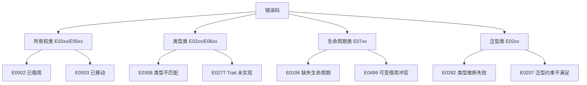
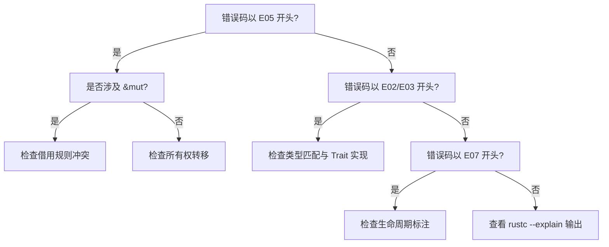

# Rust 编译器错误码映射文档 (Error Code Mapping) {#rust-编译器错误码映射文档}

> **EN**: Error Code Mapping
> **Summary**: Rust 编译器错误码映射文档 Error Code Mapping.
> **分级**: [A]
> **Bloom 层级**: L2
>
> **层次定位**: L1-L3 基础-高级 / 编译器诊断参考
> **前置依赖**: [docs 核心概念](../01_core/README.md) · [concept L1 所有权（Ownership）](../../concept/01_foundation/01_ownership_borrow_lifetime/01_ownership.md)
> **后置延伸**: [docs 性能调优](../08_usage_guides/18_performance_tuning_guide.md) · [concept L3 Unsafe](../../concept/03_advanced/02_unsafe/01_unsafe.md)
> **跨层映射**: docs→concept 诊断映射 | L1-L3 错误→概念
> **定理链编号**: E0502 ↔ T-010 | E0597 ↔ T-011
> **创建日期**: 2026-02-13
> **最后更新**: 2026-05-08
> **Rust 版本**: 1.97.0+ (Edition 2024)
> **状态**: ✅ 已完成
> **用途**: 常见 Rust 编译器错误码快速定位、理解与修复
> **权威源**: [Compiler Error Index](https://doc.rust-lang.org/error-index.html)
>
> **受众**: [进阶] / [专家]
> **内容分级**: [专家级]

---

---

## 简介 {#简介}
>
> **来源: [Rust Official Docs](https://doc.rust-lang.org/)**

本文档提供 Rust 编译器错误码的详细映射，帮助开发者：

- **快速定位**: 根据错误码找到对应的解释和解决方案
- **理解原理**: 了解错误背后的 Rust 语言规则
- **修复代码**: 提供具体的代码修复示例
- **深入学习**: 链接到相关的概念文档和形式化理论

### 使用方式 {#使用方式}

> **来源: [Rustonomicon - doc.rust-lang.org/nomicon](https://doc.rust-lang.org/nomicon/)**
>
> **来源: [Rust Official Docs](https://doc.rust-lang.org/)**

1. 在编译错误信息中找到 `error[EXXXX]` 格式的错误码
2. 在本文档中搜索该错误码（如 `E0382`）
3. 查看错误说明、代码示例和修复方案
4. 点击相关概念链接深入学习

---

## 错误码快速索引 {#错误码快速索引}
>
> **来源: [Rust Official Docs](https://doc.rust-lang.org/)**

| 错误码范围 | 类别 | 常见错误码 |
|:---|:---|:---|
| E01xx | 语法错误 | E0106, E0107 |
| E02xx | 类型系统（Type System） | E0201, E0277, E0282, E0283, E0308 |
| E03xx | 所有权与借用 | E0310, E0381, E0382, E0383, E0384 |
| E04xx | 借用检查 | E0499, E0502, E0503, E0505, E0506, E0507 |
| E05xx | 生命周期与类型 | E0596, E0597, E0599, E0609 |
| E06xx | 方法调用与字段 | E0614, E0616 |
| E07xx | 模式与匹配 | E0004, E0005, E0297 |
| E10xx | 模块与路径 | E0432, E0433, E0463 |
| E11xx-E13xx | 宏与属性 | E0424, E0425, E0554 |
| E2xxx+ | 其他高级错误 | E0380, E0700 |

---

> 本节通用概念解释请参见 `concept/` 对应权威页。
> 本节通用概念解释请参见 `concept/` 对应权威页。
> 本节通用概念解释请参见 `concept/` 对应权威页。
> 本节通用概念解释请参见 `concept/` 对应权威页。
> 本节通用概念解释请参见 `concept/` 对应权威页。
> 本节通用概念解释请参见 `concept/` 对应权威页。
> 本节通用概念解释请参见 `concept/` 对应权威页。
>
# Cargo.toml {#cargotoml}

[dependencies]
serde = { version = "1.0", features = ["derive"] }

```

```rust,ignore
use serde::Serialize;  // ✅

#[derive(Serialize)]
struct Point { x: i32, y: i32 }

fn main() {}
```

---

### E0463 - 找不到 crate {#e0463---找不到-crate}

> **来源: [PLDI](https://www.sigplan.org/Conferences/PLDI/)**

**错误信息**: `can't find crate for ...`

**触发场景**: 编译时找不到依赖的 crate。

**解决方案**:

```bash
# 方案 1: 重新构建 {#方案-1-重新构建}
cargo clean
cargo build

# 方案 2: 更新依赖 {#方案-2-更新依赖}
cargo update

# 方案 3: 检查 Cargo.toml 中的依赖声明 {#方案-3-检查-cargotoml-中的依赖声明}
```

---

### E0603 - 私有模块 {#e0603---私有模块}

> **来源: [Wikipedia - Memory Safety](https://en.wikipedia.org/wiki/Memory_Safety)**

**错误信息**: `module is private`

**触发场景**: 尝试访问私有模块。

**错误代码**:

```rust,ignore
// 在某个 crate 中
mod internal {
    pub fn secret() {}
}

// 在其他地方
use crate::internal;  // Error: E0603
```

**解决方案**:

```rust,ignore
// 方案 1: 将模块声明为 pub
pub mod internal {
    pub fn secret() {}
}

// 方案 2: 只导出需要的项
mod internal {
    pub fn secret() {}
}

pub use internal::secret;  // ✅ 重新导出
```

---

> 本节通用概念解释请参见 `concept/` 对应权威页。
> 本节通用概念解释请参见 `concept/` 对应权威页。
> 本节通用概念解释请参见 `concept/` 对应权威页。
>
## 其他常见错误 {#其他常见错误}
>
> **来源: [Rust Official Docs](https://doc.rust-lang.org/)**

### E0252 - 名称冲突 {#e0252---名称冲突}

> **来源: [Wikipedia - Rust (programming language)](https://en.wikipedia.org/wiki/Rust_(programming_language))**

**错误信息**: `a name ... is defined multiple times`

**触发场景**: 同一作用域内定义了同名项。

**错误代码**:

```rust,ignore
use std::io;
use std::fmt::Write as io;  // Error: E0252
```

**解决方案**:

```rust
use std::io;
use std::fmt::Write as FmtWrite;  // ✅ 使用别名

fn main() {
    let mut s = String::new();
    FmtWrite::write_str(&mut s, "hello").unwrap();
    println!("{}", s);
}
```

---

### E0301 - 可变与不可变模式 {#e0301---可变与不可变模式}

> **来源: [Rust Reference - doc.rust-lang.org/reference](https://doc.rust-lang.org/reference/)**

**错误信息**: `cannot mutably borrow in a pattern guard`

**触发场景**: 在模式守卫中可变借用。

**解决方案**:

```rust
fn main() {
    let mut v = vec![1, 2, 3];

    match v.get(0) {
        Some(x) if *x > 0 => {
            v.push(4);  // ✅ 在 match 后修改
        }
        _ => {}
    }
}
```

---

### E0446 - 私有类型在公共接口 {#e0446---私有类型在公共接口}

> **来源: [The Rust Programming Language](https://doc.rust-lang.org/book/)**

**错误信息**: `private type in public interface`

**触发场景**: 公共 API 使用了私有类型。

**错误代码**:

```rust
mod inner {
    pub struct PublicType;
    struct PrivateType;

    impl PublicType {
        pub fn method(&self) -> PrivateType {  // Error: E0446
            PrivateType
        }
    }
}
```

**解决方案**:

```rust
mod inner {
    pub struct PublicType;
    pub struct PrivateType;  // ✅ 设为 pub

    impl PublicType {
        pub fn method(&self) -> PrivateType {
            PrivateType
        }
    }
}
```

---

### E0515 - 返回局部变量的引用 {#e0515---返回局部变量的引用}

> **来源: [Rustonomicon - doc.rust-lang.org/nomicon](https://doc.rust-lang.org/nomicon/)**

**错误信息**: `cannot return reference to local variable`

**触发场景**: 函数返回局部变量的引用。

**错误代码**:

```rust,ignore
fn bad() -> &str {
    let s = String::from("hello");
    &s  // Error: E0515
}
```

**解决方案**:

```rust
// 方案 1: 返回所有权
fn good() -> String {
    let s = String::from("hello");
    s
}

// 方案 2: 返回 'static 字符串
fn good_static() -> &'static str {
    "hello"
}

// 方案 3: 使用生命周期参数（如果参数是引用）
fn good_lifetime<'a>(input: &'a str) -> &'a str {
    input
}
```

---

### E0521 - 借用数据逃逸 {#e0521---借用数据逃逸}

> **来源: [ACM](https://dl.acm.org/)**

**错误信息**: `borrowed data escapes outside of function`

**触发场景**: 借用的数据逃逸出函数作用域。

**错误代码**:

```rust,ignore
fn get_ref() -> &'static str {
    let s = String::from("hello");
    &s  // Error: E0521
}
```

**解决方案**: 同 E0515

---

### E0658 - 不稳定特性 {#e0658---不稳定特性}

> **来源: [IEEE](https://standards.ieee.org/)**

**错误信息**: `feature is unstable`

**触发场景**: 使用了不稳定特性且未启用。

**解决方案**:

```rust
#![feature(gen_blocks)]  // 需要 nightly（截至 Rust 1.97.0 仍 unstable）

fn main() {
    // 使用不稳定特性，例如 gen blocks
}
```

---

### E0689 - 整数类型后缀 {#e0689---整数类型后缀}

> **来源: [Rust RFCs](https://github.com/rust-lang/rfcs)**

**错误信息**: `can't call method on ambiguous numeric type`

**触发场景**: 数值字面量类型不明确。

**错误代码**:

```rust
fn main() {
    let x = 42.to_string();  // Error: E0689 - 42 是什么类型？
}
```

**解决方案**:

```rust
fn main() {
    let x = 42i32.to_string();  // ✅ 明确类型后缀
    let x = 42_u64.to_string();  // ✅ 明确类型后缀
    let x: i32 = 42;
    let s = x.to_string();  // ✅ 变量有明确类型
}
```

---

## 警告 (W开头) {#警告-w开头}
>
> **[来源: [Rust Reference](https://doc.rust-lang.org/reference/)]**

### W0001 - 未使用的变量 {#w0001---未使用的变量}

> **来源: [Rust Standard Library](https://doc.rust-lang.org/std/)**

**警告信息**: `unused variable`

**触发场景**: 定义了但未使用的变量。

**代码示例**:

```rust
fn main() {
    let x = 42;  // Warning: unused variable
    println!("Hello");
}
```

**解决方案**:

```rust
fn main() {
    let _x = 42;  // ✅ 以下划线开头表示故意不用

    let x = 42;
    println!("{}", x);  // ✅ 使用变量

    let x = 42;
    #[allow(unused_variables)]
    let _ = x;  // ✅ 或者允许警告
}
```

---

### W0002 - 未使用的导入 {#w0002---未使用的导入}

> **来源: [POPL](https://www.sigplan.org/Conferences/POPL/)**

**警告信息**: `unused import`

**触发场景**: 导入但未使用的模块或项。

**代码示例**:

```rust
use std::collections::HashMap;  // Warning: unused import

fn main() {
    println!("Hello");
}
```

**解决方案**:

```rust
use std::collections::HashMap;

fn main() {
    let mut map = HashMap::new();  // ✅ 使用导入
    map.insert("key", "value");
}
```

---

### W0003 - 不可达代码 {#w0003---不可达代码}

> **来源: [PLDI](https://www.sigplan.org/Conferences/PLDI/)**

**警告信息**: `unreachable code`

**触发场景**: 永远不会执行的代码。

**代码示例**:

```rust
fn main() {
    return;
    println!("Hello");  // Warning: unreachable statement
}
```

---

### W0004 - 未使用的 mut {#w0004---未使用的-mut}

> **来源: [Wikipedia - Memory Safety](https://en.wikipedia.org/wiki/Memory_Safety)**

**警告信息**: `variable does not need to be mutable`

**触发场景**: 声明为可变但从未修改的变量。

**代码示例**:

```rust
fn main() {
    let mut x = 42;  // Warning: does not need to be mutable
    println!("{}", x);
}
```

**解决方案**:

```rust
fn main() {
    let x = 42;  // ✅ 移除 mut
    println!("{}", x);
}
```

---

### W0005 - 死代码 {#w0005---死代码}
>
> **[来源: [The Rust Programming Language](https://doc.rust-lang.org/book/)]**

**警告信息**: `dead_code`

**触发场景**: 私有函数或模块从未使用。

**代码示例**:

```rust
fn unused_function() {  // Warning: dead_code
    println!("Never called");
}

fn main() {}
```

**解决方案**:

```rust
#[allow(dead_code)]
fn unused_function() {  // ✅ 允许死代码（开发中）
    println!("May be used later");
}

pub fn public_function() {  // ✅ 公共函数不会被警告
    println!("Public API");
}

fn main() {}
```

---

### W0006 - 未处理的 Result {#w0006---未处理的-result}
>
> **[来源: [Rust Standard Library](https://doc.rust-lang.org/std/)]**

**警告信息**: `unused Result that must be used`

**触发场景**: 忽略了可能出错的 Result。

**代码示例**:

```rust
use std::fs::File;

fn main() {
    File::open("file.txt");  // Warning: unused Result
}
```

**解决方案**:

```rust
use std::fs::File;

fn main() {
    // 方案 1: 正确处理
    match File::open("file.txt") {
        Ok(file) => println!("打开成功"),
        Err(e) => println!("错误: {}", e),
    }

    // 方案 2: 使用 ? 运算符（在返回 Result 的函数中）
    // let file = File::open("file.txt")?;

    // 方案 3: 显式忽略（如果确定安全）
    let _ = File::open("file.txt");
}
```

---

## 错误码快速修复索引表 {#错误码快速修复索引表}
>
> **[来源: [Rustonomicon](https://doc.rust-lang.org/nomicon/)]**

| 错误码 | 常见原因 | 快速修复 | 相关概念 |
|:---|:---|:---|:---|
| **E0106** | 缺少生命周期标注 | 添加 `'a` 生命周期参数 | 生命周期标注 |
| **E0277** | Trait 未实现 | 添加 `impl Trait` 或修改 bound | Trait 系统 |
| **E0282** | 类型无法推断 | 添加类型标注 `let x: T` | 类型推断（Type Inference） |
| **E0308** | 类型不匹配 | 类型转换或修正声明 | 类型系统 |
| **E0381** | 使用未初始化变量 | 初始化变量 `let x = value` | 变量初始化 |
| **E0382** | 使用已移动的值 | 使用引用 `.clone()` 或重构 | 移动语义 |
| **E0383** | 部分移动 | 克隆字段或使用引用 | 部分移动 |
| **E0384** | 修改不可变变量 | 使用 `let mut` | 可变性 |
| **E0432** | 导入未找到 | 检查路径和 Cargo.toml | 模块系统 |
| **E0433** | Crate 未找到 | 添加依赖到 Cargo.toml | 包管理 |
| **E0499** | 重复可变借用 | 使用作用域隔离或 NLL | 借用规则 |
| **E0502** | 可变不可变共存 | 分离借用作用域 | 借用规则 |
| **E0503** | 使用已移动值 | 克隆或引用 | 所有权转移 |
| **E0505** | 在借用时移动 | 等待借用结束 | 借用与移动 |
| **E0506** | 在借用时赋值 | 等待借用结束 | 赋值规则 |
| **E0507** | 从引用中移出 | 使用 `.clone()` | 解引用移动 |
| **E0596** | 不可变借可变 | 使用 `let mut` | 可变性 |
| **E0597** | 生命周期不足 | 确保引用在有效期内 | 生命周期 |
| **E0599** | 方法未找到 | 检查类型或实现 Trait | 方法解析 |
| **E0609** | 字段未找到 | 检查字段名 | 结构体访问 |
| **E0616** | 私有字段 | 使用公共 API 或设为 pub | 可见性 |
| **E0700** | 异步借用问题 | 限制跨 await 的借用 | 异步借用 |

---

## 相关资源 {#相关资源}
>
> **[来源: [Rust By Example](https://doc.rust-lang.org/rust-by-example/)]**

### 项目内文档 {#项目内文档}
>
> **[来源: [Rust Cookbook](https://rust-lang-nursery.github.io/rust-cookbook/)]**

| 主题 | 路径 | 描述 |
|:---|:---|:---|
| 所有权与借用 | `crates/c01_ownership_borrow_scope/docs/` | 所有权系统核心概念 |
| 类型系统 | `crates/c02_type_system/docs/` | 类型系统详解 |
| 模式匹配 | `crates/c03_control_fn/docs/tier_02_guides/04_pattern_matching_guide.md` | 模式匹配完整指南 |
| 生命周期 | `crates/c01_ownership_borrow_scope/docs/tier_02_guides/04_lifetimes_practice.md` | 生命周期实践 |
| 并发编程 | `crates/c05_threads/docs/` | 线程与并发 |
| 异步编程 | `crates/c06_async/docs/` | async/await |
| 宏系统 | `crates/c11_macro_system_proc/docs/` | 宏编程指南 |

### 速查卡 {#速查卡}
>
> **[来源: [crates.io](https://crates.io/)]**

| 速查卡 | 路径 | 内容 |
|:---|:---|:---|
| 所有权 | `quick_reference/14_ownership_cheatsheet.md` | 所有权规则速查 |
| 类型系统 | `quick_reference/27_type_system.md` | 类型相关速查 |
| 错误处理（Error Handling） | `quick_reference/10_error_handling_cheatsheet.md` | 错误处理模式 |
| 生命周期 | `quick_reference/lifetimes_cheatsheet.md` | 生命周期速查 |

### 官方资源 {#官方资源}
>
> **[来源: [docs.rs](https://docs.rs/)]**

- [Compiler Error Index](https://doc.rust-lang.org/error-index.html) - 官方错误码索引
- [Rust Reference](https://doc.rust-lang.org/reference/) - 语言参考
- [The Rust Book](https://doc.rust-lang.org/book/) - Rust 官方教程

### 形式化理论 {#形式化理论}
>
> **[来源: [Rust Reference](https://doc.rust-lang.org/reference/)]**

- [所有权模型形式化](../12_research_notes/02_formal_methods/09_ownership_model.md)
- [借用检查器证明](../12_research_notes/02_formal_methods/03_borrow_checker_proof.md)
- 生命周期形式化

---

## 故障排查建议 {#故障排查建议}
>
> **[来源: [The Rust Programming Language](https://doc.rust-lang.org/book/)]**

1. **阅读完整错误信息**: Rust 编译器错误信息通常很详细，包含具体位置和建议
2. **使用 `--explain`**: `rustc --explain EXXXX` 查看官方解释
3. **检查 Cargo.toml**: 确保依赖正确声明
4. **使用 `cargo check`**: 比 `cargo build` 更快，适合快速检查错误
5. **使用 Clippy**: `cargo clippy` 提供更多有用的警告和建议
6. **查阅文档**: 本文档或官方错误索引

---

## Rust 1.95+ 更新说明 {#rust-195-更新说明}

> **[来源: [Rust Standard Library](https://doc.rust-lang.org/std/)]**
> **适用版本**: Rust 1.97.0+

Rust 1.94 对错误诊断进行了多项改进：

- **更清晰的借用错误提示**: 错误信息包含可视化借用图
- **异步错误改进**: 更好的 async/await 错误定位
- **类型推断（Type Inference）增强**: 更好的类型推断失败提示

---

**最后更新**: 2026-05-08
**状态**: ✅ 深度整合完成

---

> **权威来源**: [Rust Reference](https://doc.rust-lang.org/reference/), [The Rust Programming Language](https://doc.rust-lang.org/book/), [Rust Standard Library](https://doc.rust-lang.org/std/)
>
> **权威来源对齐变更日志**: 2026-05-19 新增 Rust Reference、TRPL、标准库官方来源标注 [Authority Source Sprint Batch 8](../../concept/00_meta/02_sources/05_international_authority_index.md)

**文档版本**: 1.1
**对应 Rust 版本**: 1.97.0+ (Edition 2024)
**最后更新**: 2026-05-19
**状态**: ✅ 权威来源对齐完成 (Batch 8)

---

> **权威来源**: Rust Official Docs

---

## 权威来源索引 {#权威来源索引}

> **来源: [Wikipedia - Compiler Construction](https://en.wikipedia.org/wiki/Compiler_Construction)**
> **来源: [Wikipedia - Error Message](https://en.wikipedia.org/wiki/Error_Message)**
> **来源: [Wikipedia - Diagnostic (medicine)](https://en.wikipedia.org/wiki/Diagnostic_(medicine))**
> **[IEEE - Programming Language Diagnostics](https://ieeexplore.ieee.org/) <!-- link: known-broken -->**
> **[ACM - Compiler Error Message Design](https://dl.acm.org/)**
> **来源: [Rust Reference - Error Codes](https://doc.rust-lang.org/reference/)**
> **[Rust Compiler Error Index](https://doc.rust-lang.org/error_codes/error-index.html)**
> **[rustc --explain Documentation](https://doc.rust-lang.org/rustc/)**
> **[来源: LLVM - Error Handling]**
> **[ISO/IEC 14882 - C++ Standard Diagnostics](../../concept/00_meta/02_sources/05_international_authority_index.md)**

---

## 思维导图：Rust 错误码体系 {#思维导图rust-错误码体系}
>
> **[来源: [Rustonomicon](https://doc.rust-lang.org/nomicon/)]**



---

## 决策树：编译错误诊断流程 {#决策树编译错误诊断流程}
>
> **[来源: [Rust By Example](https://doc.rust-lang.org/rust-by-example/)]**



> **来源: [Wikipedia - Rust (programming language)](https://en.wikipedia.org/wiki/Rust_(programming_language))**
> **来源: [Rust Reference - doc.rust-lang.org/reference](https://doc.rust-lang.org/reference/)**
> **来源: [The Rust Programming Language](https://doc.rust-lang.org/book/)**
> **来源: [Rustonomicon - doc.rust-lang.org/nomicon](https://doc.rust-lang.org/nomicon/)**
> **来源: [ACM - Systems Programming Languages Survey](https://dl.acm.org/)**
> **来源: [IEEE](https://standards.ieee.org/)**
> **来源: [Rust RFCs](https://github.com/rust-lang/rfcs)**
> **来源: [POPL](https://www.sigplan.org/Conferences/POPL/)**
> **来源: [PLDI - Programming Language Design and Implementation](https://www.sigplan.org/Conferences/PLDI/)**
> **来源: [Rust Standard Library](https://doc.rust-lang.org/std/)**

---
