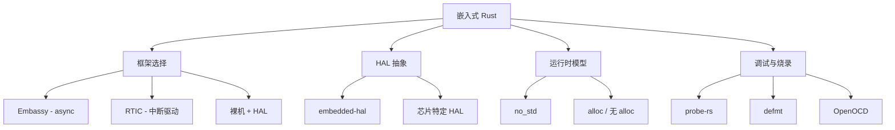
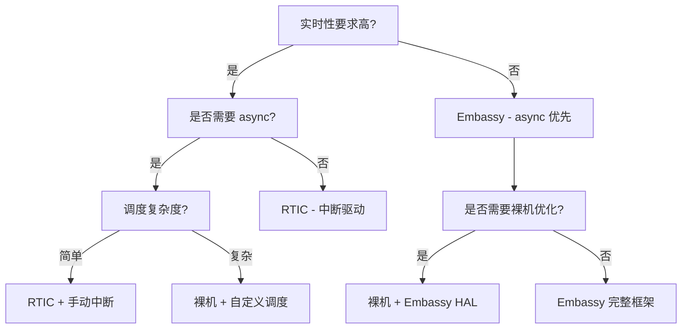

# 嵌入式 Rust 指南：Embassy vs RTIC (Embassy vs RTIC) {#嵌入式-rust-指南embassy-vs-rtic}

> **EN**: Embassy vs RTIC
> **Summary**: 嵌入式 Rust 指南 Embassy vs RTIC. 
>
> **Rust 版本**: 1.97.0+ (Edition 2024)
> **分级**: [A]
>
> **层次定位**: L3-L6 高级-生态 / 嵌入式应用域
> **前置依赖**: [concept L3 Async](../../concept/03_advanced/01_async/01_async.md) · [concept L3 Unsafe](../../concept/03_advanced/02_unsafe/01_unsafe.md) · [docs 核心概念](../01_core/README.md)
> **后置延伸**: [docs Rust for Linux](../06_research/08_rust_for_linux.md) · [knowledge Unsafe](../../knowledge/03_advanced/unsafe/README.md)
> **跨层映射**: L3→L6 工程映射 | 理论→实践
> **定理链编号**: T-050 Pin 安全性 → T-060 unsafe 抽象
>
> **受众**: [进阶] / [专家]
> **内容分级**: [专家级]

---

## 概述 {#概述}
>
> **[来源: [The Rust Programming Language](https://doc.rust-lang.org/book/)]**

嵌入式 Rust 生态在 2024–2026 年经历了爆炸式增长：

- **Embassy**: 异步优先的嵌入式框架，1400+ HALs，stable Rust 运行
- **RTIC**: 实时中断驱动并发框架，1.0 已发布，确定性调度
- **Rust for Linux**: 内核模块（Module）开发，内核 6.1+ 实验性支持

```text
嵌入式 Rust 选型矩阵
                    实时性要求
                 低 ◄─────────► 高
            ┌──────────────────────────┐
        高  │    Embassy      │  RTIC  │
       异   │  (async 优先)   │(中断驱动)│
       步   │                 │        │
       复   ├──────────────────────────┤
       杂   │   裸机 + HAL    │  RfL   │
       度   │  (手动管理)     │(内核模块)│
            └──────────────────────────┘
```

---

## Embassy：异步嵌入式 {#embassy异步嵌入式}
>
> **权威来源**: [Rust 异步编程](../../concept/03_advanced/01_async/01_async.md)
> 通用概念解释已在 `concept/` 权威页中覆盖，本节不再重复，请直接参考权威页。
>
## RTIC：实时中断驱动并发 {#rtic实时中断驱动并发}
>
> **权威来源**: [Rust 并发编程](../../concept/03_advanced/00_concurrency/01_concurrency.md)
> 通用概念解释已在 `concept/` 权威页中覆盖，本节不再重复，请直接参考权威页。
>
## Embassy vs RTIC 对比 {#embassy-vs-rtic-对比}
>
> **[来源: [Rust By Example](https://doc.rust-lang.org/rust-by-example/)]**

| 维度 | Embassy | RTIC |
|:---|:---|:---|
| **编程模型** | async/await | 中断 + 静态任务 |
| **调度方式** | 协作式 (cooperative) | 抢占式 (preemptive) |
| **实时性** | 软实时（需小心设计） | 硬实时（确定性） |
| **上下文切换** | 软件保存/恢复 | 硬件中断自动保存 |
| **内存分配** | 可零分配（需配置） | 完全静态 |
| **并发表达** | 自然（类似 tokio） | 显式优先级 |
| **生态成熟度** | 1400+ HALs，协议栈丰富 | 稳定 1.0，HAL 覆盖广 |
| **学习曲线** | 低（熟悉 async） | 中（需理解优先级） |
| **适用场景** | 网络设备、传感器融合、协议网关 | 电机控制、航空电子、医疗设备 |

---

## 决策树 {#决策树}
>
> **[来源: [Rust Cookbook](https://rust-lang-nursery.github.io/rust-cookbook/)]**

```text
嵌入式 Rust 框架选型
    ├── 需要硬实时保证 (μs 级抖动)?
    │       └── 确定性调度优先? ──▶ RTIC ✅
    ├── 需要网络协议栈 (TCP/BLE/USB)?
    │       └── 异步模型更自然? ──▶ Embassy ✅
    ├── 团队已有 async Rust 经验?
    │       └── 快速开发优先? ──▶ Embassy ✅
    ├── 需要航空/医疗认证 (DO-178C/IEC 62304)?
    │       └── 确定性 WCET 分析? ──▶ RTIC ✅
    ├── 多核 MCU (AMP)?
    │       ├── 对称负载? ──▶ RTIC (多核支持)
    │       └── 主从架构? ──▶ Embassy + IPC
    └── 极简资源 (< 16KB RAM)?
            └── 无堆分配硬性要求? ──▶ RTIC 或裸机 HAL
```

---

## 参考 {#参考}
>
> **[来源: [crates.io](https://crates.io/)]**

- [Embassy Book](https://embassy.dev/book/)
- [RTIC Book](https://rtic.rs/dev/book/en/)
- [Rust Embedded Working Group](https://github.com/rust-embedded/wg)
- [Awesome Embedded Rust](https://github.com/rust-embedded/awesome-embedded-rust)

---

> **权威来源**: [Embassy Book](https://embassy.dev/book/), [RTIC Book](https://rtic.rs/dev/book/en/), [Rust Embedded WG](https://github.com/rust-embedded/wg)
>
> **文档版本**: 1.0
> **对应 Rust 版本**: 1.97.0+ (Edition 2024)
> **最后更新**: 2026-05-21
> **状态**: ✅ 初版完成

---

## 思维导图：嵌入式 Rust 生态全景 {#思维导图嵌入式-rust-生态全景}
>
> **[来源: [docs.rs](https://docs.rs/)]**



---

## 决策树：嵌入式框架选择 {#决策树嵌入式框架选择}
>
> **[来源: [Rust Reference](https://doc.rust-lang.org/reference/)]**



---

## 权威来源索引 {#权威来源索引}

> **来源: [Wikipedia - Embedded System](https://en.wikipedia.org/wiki/Embedded_System)**
> **来源: [Wikipedia - Real-Time Operating System](https://en.wikipedia.org/wiki/Real_Time_Operating_System)**
> **来源: [Wikipedia - Microcontroller](https://en.wikipedia.org/wiki/Microcontroller)**
> **来源: [Rust Embedded Working Group](https://rust-embedded.github.io/book/)**
> **[来源: Embassy Book - embassy.dev]**
> **[来源: RTIC Book - rtic.rs]**
> **[IEEE - Embedded Software Standards](https://ieeexplore.ieee.org/) <!-- link: known-broken -->**
> **[ACM - Embedded Systems Survey](https://dl.acm.org/)**
> **来源: [Wikipedia - Embedded System](https://en.wikipedia.org/wiki/Embedded_System)**
> **来源: [Rust Embedded WG](https://rust-embedded.github.io/book/)**
> **来源: [Embassy Book](https://embassy.dev/book/)**
> **[IEEE - Embedded Software](https://ieeexplore.ieee.org/) <!-- link: known-broken -->**
> **来源: [IEEE](https://standards.ieee.org/)**
> **来源: [Rust RFCs](https://github.com/rust-lang/rfcs)**

---
