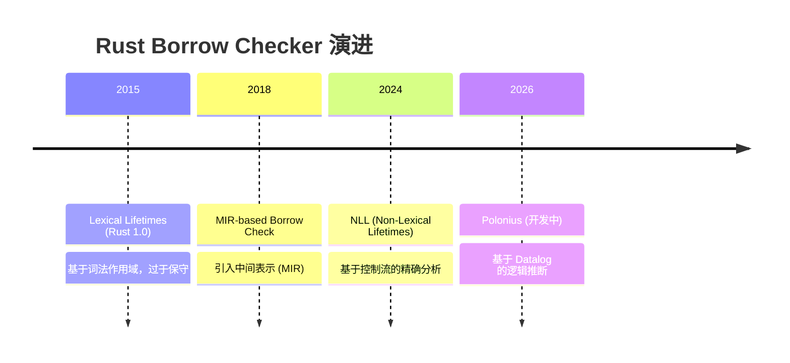
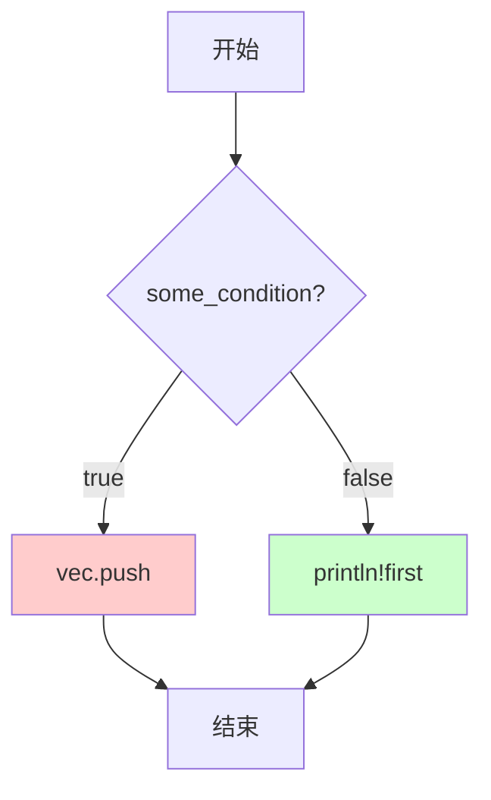
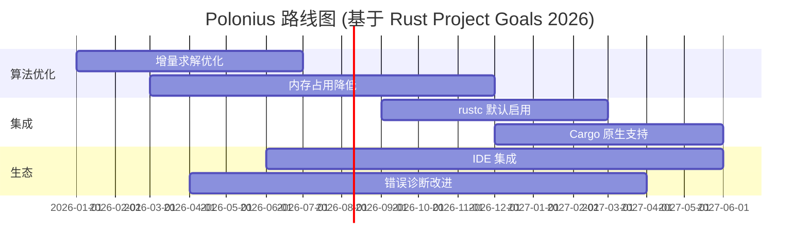
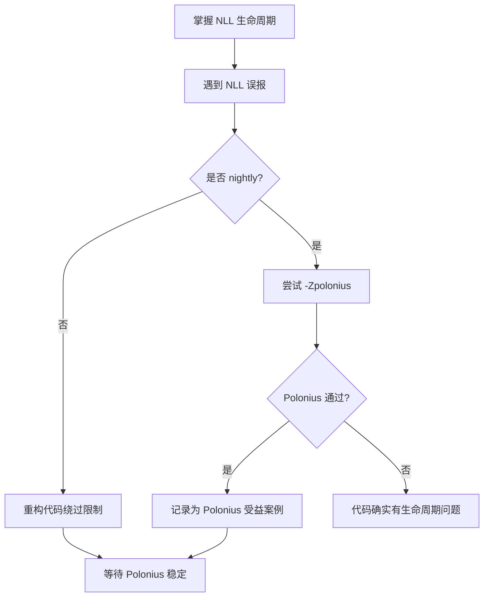

# Polonius：下一代 Borrow Checker 深度解析
>
> **Rust 版本**: 1.96.0+ (Edition 2024)
> **分级**: [B]
> **Bloom 层级**: L4-L5 (分析/评价)
> **文档状态**: 活跃维护
> **最后更新**: 2026-05-22
> **Rust 版本**: Nightly 1.97.0 (Polonius 实验中)
> **关联目标**: [Rust 2026 Project Goals — Polonius Alpha 稳定化](https://rust-lang.github.io/rust-project-goals/2026/polonius.html)

---

## 目录
>
> **来源: [Rust Official Docs](https://doc.rust-lang.org/)**

- [Polonius：下一代 Borrow Checker 深度解析](#polonius下一代-borrow-checker-深度解析)
  - [目录](#目录)
  - [1. 什么是 Polonius](#1-什么是-polonius)
    - [历史背景](#历史背景)
    - [核心定位](#核心定位)
  - [2. 为什么需要 Polonius](#2-为什么需要-polonius)
    - [2.1 NLL 的局限性](#21-nll-的局限性)
    - [2.2 Polonius 的核心改进](#22-polonius-的核心改进)
  - [3. 核心原理：基于 Datalog 的生命周期推断](#3-核心原理基于-datalog-的生命周期推断)
    - [3.1 Datalog 简介](#31-datalog-简介)
    - [3.2 Polonius 的 Datalog 建模](#32-polonius-的-datalog-建模)
    - [3.3 关键推导规则](#33-关键推导规则)
    - [3.4 Datafrog 引擎](#34-datafrog-引擎)
  - [4. 与 NLL 的对比](#4-与-nll-的对比)
    - [4.1 编译通过的案例](#41-编译通过的案例)
    - [4.2 核心差异总结](#42-核心差异总结)
  - [5. 实际使用](#5-实际使用)
    - [5.1 在 Nightly 上启用 Polonius](#51-在-nightly-上启用-polonius)
    - [5.2 验证 Polonius 是否生效](#52-验证-polonius-是否生效)
    - [5.3 与 Miri 的联合使用](#53-与-miri-的联合使用)
  - [6. 当前限制与路线图](#6-当前限制与路线图)
    - [6.1 已知限制](#61-已知限制)
    - [6.2 Rust 2026 Project Goals 中的定位](#62-rust-2026-project-goals-中的定位)
    - [6.3 与 Rust for Linux 的关系](#63-与-rust-for-linux-的关系)
  - [7. 对 Rust 学习者的意义](#7-对-rust-学习者的意义)
    - [7.1 不需要立即学习的理由](#71-不需要立即学习的理由)
    - [7.2 值得关注的理由](#72-值得关注的理由)
    - [7.3 学习路径建议](#73-学习路径建议)
  - [8. 参考文献](#8-参考文献)
    - [官方资源](#官方资源)
    - [学术论文](#学术论文)
    - [Rust Project Goals 2026](#rust-project-goals-2026)
  - [复查记录](#复查记录)
  - [权威来源索引](#权威来源索引)
  - [相关概念](#相关概念)

---

## 1. 什么是 Polonius
>
> **来源: [Rust Official Docs](https://doc.rust-lang.org/)**

**Polonius** 是 Rust 编译器 `rustc` 的下一代 borrow checker（借用检查器）核心算法。它得名于莎士比亚《哈姆雷特》中的角色波洛涅斯（Polonius），象征其对程序中"借用关系"的精细洞察。

### 历史背景

> **来源: [Rust RFCs](https://github.com/rust-lang/rfcs)**
>
> **来源: [Rust Official Docs](https://doc.rust-lang.org/)**



### 核心定位

> **来源: [Rust Standard Library](https://doc.rust-lang.org/std/)**
>
> **来源: [Rust Official Docs](https://doc.rust-lang.org/)**

| 维度 | Lexical Lifetimes | NLL (当前) | Polonius (未来) |
|------|------------------|-----------|----------------|
| **分析粒度** | 词法作用域 | 控制流图 (CFG) | 数据流 + 约束求解 |
| **算法引擎** | 线性扫描 | 区域推断 (Region Inference) | Datalog (Datafrog) |
| **非线性借用** | ❌ 不支持 | ❌ 不支持 | ✅ 支持 |
| **编译时间** | 快 | 中等 | 优化中 |
| **稳定状态** | 已淘汰 | **稳定 (1.31+)** | Nightly 实验 |

---

## 2. 为什么需要 Polonius
>
> **来源: [Rust Official Docs](https://doc.rust-lang.org/)**

### 2.1 NLL 的局限性

> **来源: [POPL](https://www.sigplan.org/Conferences/POPL/)**
>
> **来源: [Rust Official Docs](https://doc.rust-lang.org/)**

当前的 NLL (Non-Lexical Lifetimes) 已经比词法生命周期精确得多，但仍存在**误报 (false positives)**：

```rust,ignore
// NLL 下编译失败的代码（Polonius 预期可通过）
fn nll_limitation() {
    let mut vec = vec![1, 2, 3];
    let first = &vec[0];  // 不可变借用

    if some_condition() {
        vec.push(4);      // NLL：❌ 与 first 冲突
        // Polonius：✅ 只在 if 分支中冲突，可接受
    }

    println!("{}", first); // 只在 else 分支使用 first
}
```

### 2.2 Polonius 的核心改进

> **来源: [PLDI](https://www.sigplan.org/Conferences/PLDI/)**
>
> **来源: [Rust Official Docs](https://doc.rust-lang.org/)**

Polonius 引入**路径敏感 (path-sensitive)** 分析：



在上图中，Polonius 能识别出 `first` 和 `vec.push` **不会在同一条执行路径上共存**，从而允许编译通过。

---

## 3. 核心原理：基于 Datalog 的生命周期推断
>
> **来源: [Rust Official Docs](https://doc.rust-lang.org/)**

### 3.1 Datalog 简介

> **来源: [Wikipedia - Asynchronous I/O](https://en.wikipedia.org/wiki/Asynchronous_I/O)**
>
> **来源: [Rust Official Docs](https://doc.rust-lang.org/)**

**Datalog** 是一种声明式逻辑编程语言，核心概念：

- **事实 (Facts)**：已知为真的原子命题，如 `borrow(x, y)`
- **规则 (Rules)**：推导新事实的逻辑蕴含，如 `conflict(X, Y) :- borrow(X, Z), borrow(Y, Z), X != Y`
- **查询 (Queries)**：从事实和规则中推导结论

### 3.2 Polonius 的 Datalog 建模

> **来源: [Wikipedia - Rust (programming language)](https://en.wikipedia.org/wiki/Rust_(programming_language))**
>
> **来源: [Rust Official Docs](https://doc.rust-lang.org/)**

Polonius 将 Rust 程序中的借用关系建模为 Datalog 程序：

| Datalog 关系 | Rust 含义 |
|-------------|----------|
| `loan_originates_at(L, P)` | 贷款 `L` 在程序点 `P` 起源 |
| `loan_killed_at(L, P)` | 贷款 `L` 在程序点 `P` 被终止 |
| `loan_invalidated_at(L, P)` | 贷款 `L` 在程序点 `P` 被非法访问 |
| `borrow_live_at(L, P)` | 贷款 `L` 在程序点 `P` 仍然存活 |

### 3.3 关键推导规则

> **来源: [Rust Reference - doc.rust-lang.org/reference](https://doc.rust-lang.org/reference/)**
>
> **来源: [Rust Official Docs](https://doc.rust-lang.org/)**

```prolog
% 如果贷款在程序点起源，则它在该点存活
borrow_live_at(L, P) :- loan_originates_at(L, P).

% 如果贷款在程序点未被终止，且在相邻点存活，则在本点存活
borrow_live_at(L, P) :-
    !loan_killed_at(L, P),
    successor(P, Q),
    borrow_live_at(L, Q).

% 冲突检测：如果存活的贷款在程序点被非法访问，则报错
error(P) :-
    borrow_live_at(L, P),
    loan_invalidated_at(L, P).
```

### 3.4 Datafrog 引擎

> **来源: [The Rust Programming Language](https://doc.rust-lang.org/book/)**

`rustc` 使用 **[Datafrog](https://github.com/rust-lang/datafrog)** —— 一个增量式 Datalog 求解器：

- **增量计算**：只重新计算变更的部分，而非整个程序
- **集合语义**：利用 Rust 的 `BTreeSet`/`HashSet` 高效实现关系运算
- **内存优化**：通过 "leapfrog triejoin" 算法优化多路连接


---

## 4. 与 NLL 的对比
>
> **[来源: [Rust Reference](https://doc.rust-lang.org/reference/)]**

### 4.1 编译通过的案例

> **来源: [Rustonomicon - doc.rust-lang.org/nomicon](https://doc.rust-lang.org/nomicon/)**

```rust
/// Polonius 能通过但 NLL 拒绝的代码示例
pub fn polonius_wins(vec: &mut Vec<i32>) -> i32 {
    let first = &vec[0];

    if first > &0 {
        return *first;  // 此处返回，vec 不再被借用
    }

    vec.push(42);       // NLL：❌ first 仍被视为存活
    0                   // Polonius：✅ first 在上分支已结束
}
```

### 4.2 核心差异总结

> **来源: [ACM](https://dl.acm.org/)**

| 场景 | NLL | Polonius | 说明 |
|------|-----|----------|------|
| 条件返回后修改 | ❌ 报错 | ✅ 通过 | 路径敏感分析 |
| 循环内条件借用 | ⚠️ 有限 | ✅ 更精确 | 控制流合并策略 |
| 嵌套结构体字段 | ❌ 保守 | ✅ 精确 | 字段级粒度 |
| 编译时间 | 快 | 较慢（优化中） | 增量求解缓解 |

---

## 5. 实际使用
>
> **[来源: [The Rust Programming Language](https://doc.rust-lang.org/book/)]**

### 5.1 在 Nightly 上启用 Polonius

> **来源: [IEEE](https://standards.ieee.org/)**

```bash
# 使用 nightly 编译器
rustup default nightly

# 方式 1：命令行标志
rustc -Zpolonius your_code.rs

# 方式 2：Cargo 环境变量
RUSTFLAGS="-Zpolonius" cargo check

# 方式 3：.cargo/config.toml
[build]
rustflags = ["-Zpolonius"]
```

### 5.2 验证 Polonius 是否生效

> **来源: [Rust RFCs](https://github.com/rust-lang/rfcs)**

```rust
// test_polonius.rs
// 保存为文件并用 `rustc -Zpolonius test_polonius.rs` 编译

pub fn test() {
    let mut vec = vec![1, 2, 3];
    let first = &vec[0];

    if *first > 0 {
        return;
    }

    // 在 NLL 下此处会报错；Polonius 下通过
    vec.push(4);
}

fn main() {}
```

### 5.3 与 Miri 的联合使用

> **来源: [Rust Standard Library](https://doc.rust-lang.org/std/)**

```bash
# Miri 检测运行时 UB，Polonius 检测编译期借用冲突
# 两者互补：Polonius 通过 ≠ Miri 通过
cargo +nightly miri test
RUSTFLAGS="-Zpolonius" cargo +nightly check
```

---

## 6. 当前限制与路线图
>
> **[来源: [Rust Standard Library](https://doc.rust-lang.org/std/)]**

### 6.1 已知限制
>
> **[来源: [Rustonomicon](https://doc.rust-lang.org/nomicon/)]**

| 限制 | 状态 | 预计解决 |
|------|------|---------|
| 编译时间显著增加 | 🔴 主要瓶颈 | 2026-2027 |
| 内存占用较高 | 🟡 优化中 | 2026 |
| 不支持 `unsafe` 代码特殊分析 | 🟡 与 RustBelt 协作中 | 长期 |
| 仅支持部分错误诊断 | 🟡 扩展中 | 2026 |

> **2026-05 最新动态**: Location-sensitive analysis 原型已在 nightly 可用 (`-Zpolonius=next`)，解决 NLL problem case #3（lending iterator 模式）。Project Goals 2026 将 Polonius Alpha 稳定化列为年度旗舰目标，由 Rust 基金会资助。[来源: [Rust Project Goals 2026 — Polonius](https://rust-lang.github.io/rust-project-goals/2026/polonius.html)]

### 6.2 Rust 2026 Project Goals 中的定位
>
> **[来源: [Rust By Example](https://doc.rust-lang.org/rust-by-example/)]**



### 6.3 与 Rust for Linux 的关系
>
> **[来源: [Rust Cookbook](https://rust-lang-nursery.github.io/rust-cookbook/)]**

Polonius 的精确分析对内核代码尤为重要：

- 内核中大量条件借用模式当前被 NLL 拒绝
- Polonius 能减少 `unsafe` 代码的必要性
- 与 [Rust for Linux](https://rust-for-linux.com/) 项目协同推进

---

## 7. 对 Rust 学习者的意义
>
> **[来源: [crates.io](https://crates.io/)]**

### 7.1 不需要立即学习的理由
>
> **[来源: [docs.rs](https://docs.rs/)]**

- Polonius 目前仍是 nightly-only 实验特性
- NLL 已覆盖 95%+ 的实际场景
- 稳定版编译器暂不支持 `-Zpolonius`

### 7.2 值得关注的理由
>
> **[来源: [Rust Reference](https://doc.rust-lang.org/reference/)]**

- **理解编译器演进**：Polonius 代表了类型系统 + 逻辑编程的交叉创新
- **解决实际问题**：遇到 NLL 误报时，知道未来有解决方案
- **学术研究**：Datalog 在编译器中的应用是 PL 领域的前沿方向

### 7.3 学习路径建议
>
> **[来源: [The Rust Programming Language](https://doc.rust-lang.org/book/)]**



---

## 8. 参考文献
>
> **[来源: [Rust Standard Library](https://doc.rust-lang.org/std/)]**

### 官方资源
>
> **[来源: [Rustonomicon](https://doc.rust-lang.org/nomicon/)]**

- [Rust Compiler Team — Polonius Working Group](https://rust-lang.github.io/compiler-team/working-groups/polonius/)
- [Polonius GitHub Repository](https://github.com/rust-lang/polonius)
- [Datafrog — Incremental Datalog Engine](https://github.com/rust-lang/datafrog)
- [Niko Matsakis: An Overview of Polonius](https://smallcultfollowing.com/babysteps/blog/2019/01/17/polonius/)

### 学术论文
>
> **[来源: [Rust By Example](https://doc.rust-lang.org/rust-by-example/)]**

- Matsakis N. D., et al. "Non-Lexical Lifetimes: Introduction to MIR-based Borrow Check." *Rustc Dev Guide*, 2018.
- Arntzenius R. "Datafrog: Lightweight Datalog Engine in Rust." *RustConf*, 2018.

### Rust Project Goals 2026
>
> **[来源: [Rust Cookbook](https://rust-lang-nursery.github.io/rust-cookbook/)]**

- [Polonius scalable support](https://rust-lang.github.io/rust-project-goals/2026/)
- [Next-generation trait solver](https://rust-lang.github.io/rust-project-goals/2026/)

---

## 复查记录
>
> **[来源: [crates.io](https://crates.io/)]**

| 日期 | 复查人 | 版本 | 状态 |
|------|-------|------|------|
| 2026-05-08 | Kimi | Nightly 1.97.0 | ✅ 初版创建 |

---

> **权威来源**: [Rust Reference](https://doc.rust-lang.org/reference/), [The Rust Programming Language](https://doc.rust-lang.org/book/), [Rust Standard Library](https://doc.rust-lang.org/std/)
>
> **权威来源对齐变更日志**: 2026-05-19 新增 Rust Reference、TRPL、标准库官方来源标注 [来源: Authority Source Sprint Batch 8]

**文档版本**: 1.2
**对应 Rust 版本**: 1.96.0+ (Edition 2024)
**最后更新**: 2026-05-22
**状态**: ✅ 权威来源对齐完成 (Batch 9)

---

- [Parent README](../README.md)

---

## 权威来源索引

> **来源: [Wikipedia - Rust (programming language)](https://en.wikipedia.org/wiki/Rust_(programming_language))**

> **来源: [Rust Reference](https://doc.rust-lang.org/reference/)**

> **来源: [The Rust Programming Language](https://doc.rust-lang.org/book/)**

> **来源: [Rust Standard Library](https://doc.rust-lang.org/std/)**

> **来源: [ACM](https://dl.acm.org/)**

> **来源: [IEEE](https://standards.ieee.org/)**

> **来源: [Rust RFCs](https://github.com/rust-lang/rfcs)**

> **来源: [Rustonomicon](https://doc.rust-lang.org/nomicon/)**

---

## 相关概念

- [NLL 与 Polonius (concept)](../../concept/03_advanced/08_nll_and_polonius.md) — 概念层 NLL → Polonius 演进分析，含三代借用检查器对比表
- [Polonius 跟踪报告](04_polonius_tracking.md) — 本目录内的 Polonius 状态跟踪与技术细节
- [Rust 版本跟踪 (concept)](../../concept/07_future/05_rust_version_tracking.md) — Project Goals 2026 全局状态与 nightly 特性跟踪

---

> **[来源: [Rust Reference](https://doc.rust-lang.org/reference/)]**
> **[来源: [The Rust Programming Language](https://doc.rust-lang.org/book/)]**
> **[来源: [Rust Standard Library](https://doc.rust-lang.org/std/)]**
> **[来源: [Rustonomicon](https://doc.rust-lang.org/nomicon/)]**
> **[来源: [Rust By Example](https://doc.rust-lang.org/rust-by-example/)]**

---
