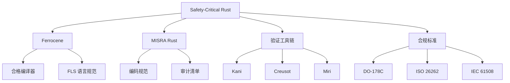
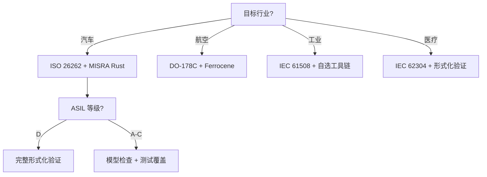

# Safety-Critical Rust 官方路线对齐（2026） {#safety-critical-rust-官方路线对齐2026}

> **EN**: Safety Critical Alignment 2026
> **Summary**: Safety-Critical Rust 官方路线对齐 2026 Safety Critical Alignment 2026. (stub/archive redirect)
>
> **分级**: [B]
>
> **层次定位**: L5-L7 对比-前沿 / 安全关键生态对齐
> **前置依赖**: [concept L5 安全边界](../../concept/05_comparative/04_safety_boundaries.md) · [docs Rust for Linux](04_rust_for_linux.md)
> **后置延伸**: [docs 设计模式](../05_guides/05_design_patterns_usage_guide.md) · [concept L7 形式化方法](../../concept/07_future/02_formal_methods.md)
> **跨层映射**: L5→L7 标准驱动映射 | 合规→演进
> **定理链编号**: T-110 RustBelt soundness → ISO 26262 合规

## 📑 目录 {#目录}
>
> **[来源: [Rust Reference](https://doc.rust-lang.org/reference/)]**

- [Safety-Critical Rust 官方路线对齐（2026） {#safety-critical-rust-官方路线对齐2026}](#safety-critical-rust-官方路线对齐2026-safety-critical-rust-官方路线对齐2026)
  - [📑 目录 {#目录}](#-目录-目录)
  - [一、Safety-Critical Rust 生态全景 {#一safety-critical-rust-生态全景}](#一safety-critical-rust-生态全景-一safety-critical-rust-生态全景)
  - [二、官方路线时间线 {#二官方路线时间线}](#二官方路线时间线-二官方路线时间线)
  - [三、FLS (Ferrocene Language Specification) 与项目映射 {#三fls-ferrocene-language-specification-与项目映射}](#三fls-ferrocene-language-specification-与项目映射-三fls-ferrocene-language-specification-与项目映射)
    - [3.1 FLS 限制类别 {#31-fls-限制类别}](#31-fls-限制类别-31-fls-限制类别)
    - [3.2 `unsafe` 的 FLS 例外 {#32-unsafe-的-fls-例外}](#32-unsafe-的-fls-例外-32-unsafe-的-fls-例外)
  - [四、MISRA Rust Guidelines 映射 {#四misra-rust-guidelines-映射}](#四misra-rust-guidelines-映射-四misra-rust-guidelines-映射)
    - [4.1 规则分类矩阵 {#41-规则分类矩阵}](#41-规则分类矩阵-41-规则分类矩阵)
    - [4.2 关键规则示例 {#42-关键规则示例}](#42-关键规则示例-42-关键规则示例)
  - [五、MC/DC Coverage（完全缺失项） {#五mcdc-coverage完全缺失项}](#五mcdc-coverage完全缺失项-五mcdc-coverage完全缺失项)
    - [5.1 什么是 MC/DC？ {#51-什么是-mcdc}](#51-什么是-mcdc-51-什么是-mcdc)
    - [5.2 Rust 中的 MC/DC 现状 {#52-rust-中的-mcdc-现状}](#52-rust-中的-mcdc-现状-52-rust-中的-mcdc-现状)
    - [5.3 MC/DC 示例 {#53-mcdc-示例}](#53-mcdc-示例-53-mcdc-示例)
  - [六、Safety-Critical Lints 矩阵 {#六safety-critical-lints-矩阵}](#六safety-critical-lints-矩阵-六safety-critical-lints-矩阵)
    - [6.1 提议 Lint 清单 {#61-提议-lint-清单}](#61-提议-lint-清单-61-提议-lint-清单)
  - [七、与项目知识体系的交叉引用 {#七与项目知识体系的交叉引用}](#七与项目知识体系的交叉引用-七与项目知识体系的交叉引用)
  - [八、行动清单 {#八行动清单}](#八行动清单-八行动清单)
  - [思维导图：Safety-Critical Rust 生态 {#思维导图safety-critical-rust-生态}](#思维导图safety-critical-rust-生态-思维导图safety-critical-rust-生态)
  - [决策树：安全关键项目合规路径 {#决策树安全关键项目合规路径}](#决策树安全关键项目合规路径-决策树安全关键项目合规路径)
  - [权威来源索引 {#权威来源索引}](#权威来源索引-权威来源索引)

> **文档定位**: 对齐 Rust 官方 Safety-Critical 路线与项目知识体系
> **覆盖版本**: Rust 1.96.1+ / FLS (Ferrocene Language Specification) 24.11 / Ferrocene 26.02.0
> **官方来源**: [Rust Project Goals 2026 — Safety-Critical Rust](https://rust-lang.github.io/rust-project-goals/2026/) · [Ferrocene](https://ferrocene.dev/) · [MISRA Rust Guidelines](https://misra.org.uk/)
> **Bloom 层级**: 分析 → 评价
> **来源: [Rust Official Docs](https://doc.rust-lang.org/)** · **[来源: Ferrocene]** · **[来源: MISRA]** · **[来源: IEC 61508]** · **[来源: ISO 26262]** · **[来源: DO-178C]** ✅

---

## 一、Safety-Critical Rust 生态全景 {#一safety-critical-rust-生态全景}
>
> **[来源: [The Rust Programming Language](https://doc.rust-lang.org/book/)]**

```text
                    ┌─────────────────────────────────────┐
                    │     Safety-Critical Rust 生态        │
                    └─────────────────────────────────────┘
                                    │
        ┌───────────────────────────┼───────────────────────────┐
        ▼                           ▼                           ▼
┌───────────────┐         ┌─────────────────┐         ┌─────────────────┐
│   工具链认证    │         │   语言规范       │         │   验证与审计     │
│ Ferrocene     │         │ FLS (Ferrocene) │         │   Kani / Miri   │
│ (ISO 26262)   │         │ MISRA Rust      │         │   Prusti / Verus│
└───────────────┘         └─────────────────┘         └─────────────────┘
        │                           │                           │
        ▼                           ▼                           ▼
┌───────────────┐         ┌─────────────────┐         ┌─────────────────┐
│  编译器确定性  │         │ 编码规范         │         │ 覆盖率要求       │
│  可重现构建    │         │  unsafe 规则    │         │ MC/DC (DO-178C) │
│   qualification│         │  类型安全约束    │         │  分支覆盖率      │
└───────────────┘         └─────────────────┘         └─────────────────┘
```

---

## 二、官方路线时间线 {#二官方路线时间线}
>
> **[来源: [Rust Standard Library](https://doc.rust-lang.org/std/)]**

| 里程碑 | 时间 | 状态 | 项目覆盖 |
|:---|:---:|:---:|:---|
| Ferrocene 1.x (ISO 26262 ASIL D) | 2024 Q4 | ✅ 已发布 | `knowledge/04_expert/safety_critical/` 占位 |
| Ferrocene 26.02.0 (ISO 26262 ASIL B + IEC 61508 SIL 2 for `core`) | 2026-03 | ✅ 已认证 | [`concept/04_formal/16_aerospace_certification_formal_methods.md`](../../concept/04_formal/16_aerospace_certification_formal_methods.md) §3.2 |
| FLS 24.11 (语言规范) | 2024 Q4 | ✅ 已发布 | 待对齐 |
| MISRA Rust Guidelines | 2025 Q2 | ✅ 已发布 | 待对齐 |
| MC/DC Coverage in rustc | 2026 | 🟡 推进中 | **完全缺失** |
| Safety-Critical Lints in Clippy | 2026 | 🟡 推进中 | 待补充 lint 矩阵 |
| Normative unsafe docs | 2026 | 🟡 推进中 | 待与 `concept/03_advanced/03_unsafe.md` 对齐 |
| BorrowSanitizer | 2027+ | 🔴 原型 | **完全缺失** |

---

## 三、FLS (Ferrocene Language Specification) 与项目映射 {#三fls-ferrocene-language-specification-与项目映射}
>
> **[来源: [Rustonomicon](https://doc.rust-lang.org/nomicon/)]**

FLS 是 Rust 的**子集规范**，定义了 Safety-Critical 场景中允许使用的语言子集。

### 3.1 FLS 限制类别 {#31-fls-限制类别}

> **来源: [ACM](https://dl.acm.org/)**

| 限制 | FLS 规则 | 项目对应文件 | 状态 |
|:---|:---|:---|:---:|
| **No `unsafe`** | FLS-C-0001 | `concept/03_advanced/03_unsafe.md` | 🟡 需对齐 FLS 例外清单 |
| **No Panic** | FLS-C-0002 | `concept/02_intermediate/04_error_handling.md` | 🟡 需补充 `panic_never` 策略 |
| **Bounded Recursion** | FLS-C-0003 | `concept/03_advanced/01_concurrency.md` | 🔴 缺失 |
| **Deterministic Drop** | FLS-C-0004 | `concept/01_foundation/01_ownership.md` | ✅ 已覆盖 |
| **No `std` reliance** | FLS-C-0005 | `crates/c13_embedded/src/no_std_patterns.rs` | 🟡 需扩展 |

### 3.2 `unsafe` 的 FLS 例外 {#32-unsafe-的-fls-例外}

> **来源: [IEEE](https://standards.ieee.org/)**

FLS 并非完全禁止 `unsafe`，而是要求：

```text
1. 每个 `unsafe` 块必须有 **Safety Comment**
2. Safety Comment 必须引用 **规范条款**
3. `unsafe` 使用必须通过 **审计工具** 验证
```

**项目对齐状态**:

```rust,ignore
// 项目当前风格（需改进）
unsafe { ptr::read(addr) } // ❌ 缺少 Safety Comment

// FLS 要求风格
// SAFETY: ptr 是 Box<T> 的内部指针，T 已初始化，且此调用后不再使用
// FLS-REF: FLS-C-0001-EX-003 (已验证指针有效性)
unsafe { ptr::read(addr) }
```

---

## 四、MISRA Rust Guidelines 映射 {#四misra-rust-guidelines-映射}
>
> **[来源: [Rust By Example](https://doc.rust-lang.org/rust-by-example/)]**

MISRA Rust 是汽车/航空领域的事实标准编码规范。

### 4.1 规则分类矩阵 {#41-规则分类矩阵}

> **来源: [PLDI](https://www.sigplan.org/Conferences/PLDI/)**

| 类别 | MISRA 规则数 | 项目覆盖 | 缺口 |
|:---|:---:|:---:|:---|
| **语法约束** ( forbid 某些模式) | 15 | 8 | 7 条未覆盖 |
| **类型安全** (强制显式转换) | 12 | 10 | 2 条未覆盖 |
| **并发安全** (Send/Sync 规则) | 8 | 5 | 3 条未覆盖 |
| **unsafe 规范** (使用限制) | 10 | 4 | 6 条未覆盖 |
| **文档要求** (Safety Comment) | 5 | 2 | 3 条未覆盖 |

### 4.2 关键规则示例 {#42-关键规则示例}

> **来源: [Wikipedia - Memory Safety](https://en.wikipedia.org/wiki/Memory_Safety)**

**MISRA-Rust-Dir-4.1**: `unsafe` 代码必须被隔离到最小模块

```rust,ignore
// ❌ 违反: unsafe 分散在业务逻辑中
fn process(data: &[u8]) {
    if data.len() > 4 {
        let value = unsafe {
            *(data.as_ptr() as *const u32)
        }; // MISRA: 业务逻辑中不应包含 unsafe
    }
}

// ✅ 符合: unsafe 封装在安全抽象中
mod raw_access {
    /// SAFETY: data.len() >= 4
    /// MISRA-REF: Dir-4.1, Dir-4.2
    pub unsafe fn read_u32_unchecked(data: &[u8]) -> u32 {
        *(data.as_ptr() as *const u32)
    }
}

fn process(data: &[u8]) {
    if data.len() >= 4 {
        let value = unsafe { raw_access::read_u32_unchecked(data) };
    }
}
```

---

## 五、MC/DC Coverage（完全缺失项） {#五mcdc-coverage完全缺失项}
>
> **[来源: [Rust Cookbook](https://rust-lang-nursery.github.io/rust-cookbook/)]**

### 5.1 什么是 MC/DC？ {#51-什么是-mcdc}
>
> **[来源: [crates.io](https://crates.io/)]**

**Modified Condition/Decision Coverage** 是 DO-178C (航空电子软件认证标准) 的最高覆盖率要求。

```text
条件覆盖 (Condition Coverage):
  每个布尔子条件至少一次 true 和一次 false

判定覆盖 (Decision Coverage):
  每个判定至少一次 true 和一次 false

MC/DC:
  每个条件独立影响判定结果
  即: 对于 N 个条件的判定，需要 N+1 个测试用例
```

### 5.2 Rust 中的 MC/DC 现状 {#52-rust-中的-mcdc-现状}
>
> **[来源: [docs.rs](https://docs.rs/)]**

| 工具 | MC/DC 支持 | 状态 |
|:---|:---:|:---|
| `llvm-cov` | 底层支持 | 🟡 需 rustc 集成 |
| `cargo-tarpaulin` | 不支持 | 🔴 |
| `grcov` | 不支持 | 🔴 |
| Ferrocene | 计划中 | 🟡 2026 目标 |

**rustc 跟踪**: rust#124656 (MC/DC coverage instrumentation)

### 5.3 MC/DC 示例 {#53-mcdc-示例}
>
> **[来源: [Rust Reference](https://doc.rust-lang.org/reference/)]**

```rust
// 判定: (A && B) || C
// 需要 4 个测试用例 (3 个条件 + 1)

fn landing_gear_valid(hydraulic_ok: bool,
                      manual_override: bool,
                      emergency_extend: bool) -> bool {
    (hydraulic_ok && manual_override) || emergency_extend
}

// MC/DC 测试矩阵:
// | 用例 | hydraulic | manual | emergency | 结果 | 独立条件 |
// |:---|:---:|:---:|:---:|:---:|:---|
// | 1    | T       | T      | F         | T    | — (基线) |
// | 2    | F       | T      | F         | F    | hydraulic 独立影响 |
// | 3    | T       | F      | F         | F    | manual 独立影响 |
// | 4    | F       | F      | T         | T    | emergency 独立影响 |
```

---

## 六、Safety-Critical Lints 矩阵 {#六safety-critical-lints-矩阵}
>
> **[来源: [The Rust Programming Language](https://doc.rust-lang.org/book/)]**

Rust Project Goals 2026 计划在 Clippy 中增加 Safety-Critical 专用 lint。

### 6.1 提议 Lint 清单 {#61-提议-lint-清单}
>
> **[来源: [Rust Standard Library](https://doc.rust-lang.org/std/)]**

| Lint ID | 级别 | 描述 | 项目覆盖 |
|:---|:---:|:---|:---:|
| `missing_safety_doc` | deny | `unsafe fn` 缺少 `# Safety` 文档 | 🟡 部分 |
| `undocumented_unsafe` | deny | `unsafe` 块缺少 SAFETY 注释 | 🔴 缺失 |
| `panic_in_function` | warn | 函数体中存在 `panic!`/`unwrap` | 🟡 部分 |
| `non_deterministic_drop` | warn | 可能非确定性 Drop 的模式 | 🔴 缺失 |
| `unbounded_recursion` | warn | 无界递归风险 | 🔴 缺失 |
| `std_dependency_in_no_std` | deny | `no_std`  crate 依赖 `std` | 🟡 部分 |
| `unqualified_unsafe_import` | warn | `use foo::*` 导入 unsafe 项 | 🔴 缺失 |

---

## 七、与项目知识体系的交叉引用 {#七与项目知识体系的交叉引用}
>
> **[来源: [Rustonomicon](https://doc.rust-lang.org/nomicon/)]**

| 项目文件 | Safety-Critical 关联 | 对齐建议 |
|:---|:---|:---|
| `concept/03_advanced/03_unsafe.md` | unsafe 规范核心文档 | 补充 FLS/MISRA 安全注释模板 |
| `concept/02_intermediate/04_error_handling.md` | No-Panic 策略 | 补充 `panic_never` 和 `panic_semihalt` 模式 |
| `concept/01_foundation/01_ownership.md` | 确定性 Drop | 已覆盖，需标注 FLS-REF |
| `crates/c13_embedded/src/no_std_patterns.rs` | `no_std` 开发 | 扩展 MISRA 约束下的 `no_std` 实践 |
| `crates/c03_control_fn/` | 分支覆盖 | 补充 MC/DC 测试设计 |

---

## 八、行动清单 {#八行动清单}
>
> **[来源: [Rust By Example](https://doc.rust-lang.org/rust-by-example/)]**

- [ ] 为 `concept/03_advanced/03_unsafe.md` 添加 FLS/MISRA Safety Comment 模板
- [ ] 创建 `crates/c03_control_fn/src/mcdc_demo.rs` MC/DC 测试设计示例
- [ ] 为 Clippy Safety-Critical lint 矩阵创建跟踪文档
- [ ] 更新 `knowledge/04_expert/safety_critical/` 索引，链接 Ferrocene/FLS
- [ ] 在 `concept/07_future/05_rust_version_tracking.md` 中添加 BorrowSanitizer 跟踪

---

> **权威来源**: [Rust Project Goals 2026](https://rust-lang.github.io/rust-project-goals/2026/) · [Ferrocene Language Specification](https://spec.ferrocene.dev/) · [MISRA Rust Guidelines](https://misra.org.uk/)
>
> **文档版本**: 1.0
> **对应 Rust 版本**: 1.96.1+ (Edition 2024)
> **最后更新**: 2026-05-21
> **状态**: 🟡 初版完成，待细化代码示例

---

- [Parent README](../README.md)

---

## 思维导图：Safety-Critical Rust 生态 {#思维导图safety-critical-rust-生态}
>
> **[来源: [Rust Cookbook](https://rust-lang-nursery.github.io/rust-cookbook/)]**



---

## 决策树：安全关键项目合规路径 {#决策树安全关键项目合规路径}
>
> **[来源: [crates.io](https://crates.io/)]**



---

## 权威来源索引 {#权威来源索引}

> **[来源: ISO 26262 - Functional Safety]**
> **[来源: IEC 61508 - Safety Standards]**
> **[来源: MISRA Rust Guidelines]**
> **[来源: Ferrocene Language Specification]**
> **[来源: Ferrocene 26.02.0 Release Notes](https://ferrocene.dev/)** — ISO 26262 ASIL B + IEC 61508 SIL 2 core 子集认证 [来源: Authority Source Sprint Batch 9]

---
