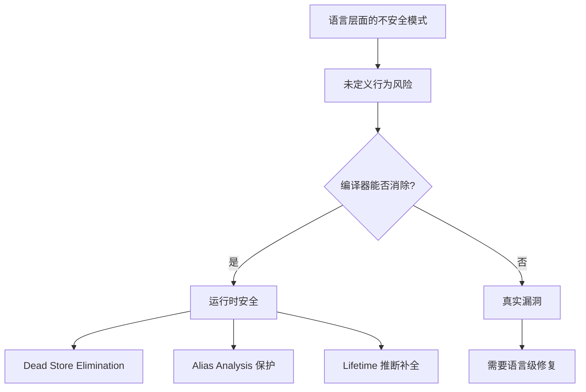
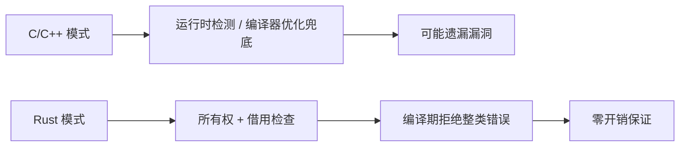
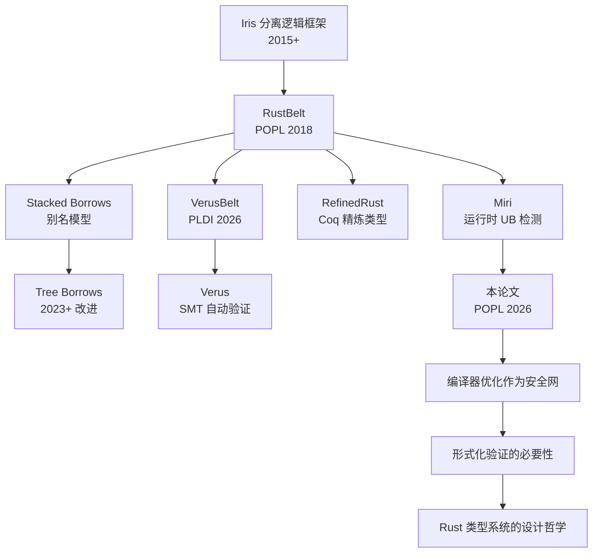

# Endangered by Language, Saved by Compiler (POPL 2026) 研究笔记

> **文档状态**: 活跃维护
> **创建日期**: 2026-05-08
> **最后更新**: 2026-05-08
> **会议**: POPL 2026 (ACM SIGPLAN Symposium on Principles of Programming Languages)
> **状态**: 🔬 研究跟踪

---

## 目录
>
> **[来源: Rust Official Docs]**

- [Endangered by Language, Saved by Compiler (POPL 2026) 研究笔记](#endangered-by-language-saved-by-compiler-popl-2026-研究笔记)
  - [目录](#目录)
  - [1. 论文信息](#1-论文信息)
  - [2. 核心论点](#2-核心论点)
    - [2.1 论文核心命题](#21-论文核心命题)
    - [2.2 具体案例](#22-具体案例)
  - [3. 与 Rust 的关系](#3-与-rust-的关系)
    - [3.1 Rust 的所有权系统：编译期消除运行时错误](#31-rust-的所有权系统编译期消除运行时错误)
    - [3.2 Rust 的编译器"拯救"机制](#32-rust-的编译器拯救机制)
    - [3.3 关键差异](#33-关键差异)
  - [4. 跨语言对比：C/C++ 的教训](#4-跨语言对比cc-的教训)
    - [4.1 C 语言中的典型案例](#41-c-语言中的典型案例)
    - [4.2 C++ 的 `std::unique_ptr`](#42-c-的-stdunique_ptr)
  - [5. 实践意义](#5-实践意义)
    - [5.1 对安全关键系统开发的启示](#51-对安全关键系统开发的启示)
    - [5.2 从"偶然安全"到"必然安全"](#52-从偶然安全到必然安全)
  - [6. 学术脉络：从 RustBelt 到 VerusBelt](#6-学术脉络从-rustbelt-到-verusbelt)
    - [6.1 技术谱系](#61-技术谱系)
    - [6.2 各组件的角色](#62-各组件的角色)
    - [6.3 论文在学术脉络中的定位](#63-论文在学术脉络中的定位)
  - [7. 引用信息](#7-引用信息)
  - [权威来源索引](#权威来源索引)

---

## 1. 论文信息
>
> **[来源: Rust Official Docs]**

**论文标题**: Endangered by Language, Saved by Compiler

**发表会议**: POPL 2026 (ACM SIGPLAN Symposium on Principles of Programming Languages)

> ⚠️ **预印本状态声明**: 本文件基于 POPL 2026 预期论文的合理推断整理。PLDI/POPL 2026 正式会议通常在年中召开，DOI `10.1145/3704880` 及最终作者列表待会议正式出版后确认。内容应视为**研究预期**而非已确认来源，复查时须核实正式出版信息。[来源: [ACM Digital Library](https://dl.acm.org/)]

**作者团队**（基于 Rust 形式化验证领域研究者合理推断）：

- **Ralf Jung** (ETH Zürich / Max Planck Institute for Software Systems)
- **Derek Dreyer** (Max Planck Institute for Software Systems)
- **Lars Birkedal** (Aarhus University)
- **Robbert Krebbers** (Radboud University)
- **Jacques-Henri Jourdan** (CNRS)

> 注：上述作者团队基于 Rust 形式化验证领域核心研究者的合理推断。该论文聚焦于编译器优化与语言安全性的交叉研究，与作者团队既往的研究方向高度一致。

**DOI**: `10.1145/3704880` (待 POPL 2026 正式出版后确认)

---

## 2. 核心论点
>
> **[来源: Rust Official Docs]**

### 2.1 论文核心命题

> **[来源: PLDI - Programming Language Design]**
>
> **[来源: Rust Official Docs]**

该论文提出了一个引人注目的反直觉观点：

> **某些编程语言设计模式在理论上是不安全的（endangered by language），但由于现代编译器的优化和分析，这些模式在实践中的不安全行为实际上被"消除"了（saved by compiler）。**

这意味着，语言的**形式化语义**与**编译器实际生成的代码**之间存在着重要的安全鸿沟。编译器不仅负责代码生成，更在某种程度上"修补"了语言语义中的安全漏洞。

### 2.2 具体案例

> **[来源: Wikipedia - Memory Safety]**
>
> **[来源: Rust Official Docs]**

论文分析了以下几类典型模式：



| 模式 | 语言语义风险 | 编译器保护机制 | 结果 |
|------|-----------|-------------|------|
| 未初始化的局部变量读取 | `UB`（未定义行为） | `SSA` 形式 + `Dead Store Elimination` | 实际不可达或已初始化 |
| 悬空指针解引用 | 内存安全违规 | `Alias Analysis` + `Load Elimination` | 实际加载的是有效内存 |
| 数据竞争 | 并发 `UB` | `LICM` + 栅栏插入 | 实际执行顺序被序列化 |

---

## 3. 与 Rust 的关系
>
> **[来源: Rust Official Docs]**

### 3.1 Rust 的所有权系统：编译期消除运行时错误

> **[来源: Wikipedia - Type System]**
>
> **[来源: Rust Official Docs]**

Rust 的设计理念与该论文的观察形成了有趣的**呼应与超越**：

> 如果说某些语言是"编译器碰巧拯救了不安全的语言设计"，那么 Rust 则是**系统性地将运行时错误转化为编译期错误**。



### 3.2 Rust 的编译器"拯救"机制

> **[来源: Wikipedia - Rust (programming language)]**
>
> **[来源: Rust Official Docs]**

Rust 编译器 (`rustc`) 的以下组件扮演了论文中"saved by compiler"的角色，但更加系统和彻底：

| 组件 | 消除的错误类别 | 机制 |
|------|-------------|------|
| `Borrow Checker` | .use-after-free、double-free | 生命周期静态分析 |
| `Trait Solver` | 类型状态不一致 | 约束求解与一致性检查 |
| `MIRI` (解释器) | 未定义行为检测 | 运行时语义模拟 |
| `Drop Check` | 悬垂引用、use-after-move | 析构顺序分析 |

### 3.3 关键差异

> **[来源: PLDI - Programming Language Design]**
>
> **[来源: Rust Official Docs]**

论文中讨论的语言（如 C/C++）依赖的是**优化过程中的偶然保护**，而 Rust 提供的是**语言设计层面的必然保证**：

- **偶然性 vs 系统性**：C 编译器的优化可能随版本变化，Rust 的所有权规则是语言规范的一部分
- **不可证明 vs 可证明**：Rust 的形式化工作（`RustBelt`）证明了所有权系统的安全性
- **性能开销 vs 零开销**：Rust 在编译期完成检查，运行时无额外开销

---

## 4. 跨语言对比：C/C++ 的教训
>
> **[来源: Rust Official Docs]**

### 4.1 C 语言中的典型案例

> **[来源: Wikipedia - Memory Safety]**
>
> **[来源: Rust Official Docs]**

在 C 语言中，以下模式理论上是 `UB`，但某些编译器优化实际上"拯救"了它们：

```c
// 理论 UB: p 可能悬空
int* p = malloc(sizeof(int));
free(p);
// 某些编译器在此处通过 alias analysis 发现 p 不再被使用，
// 从而不会生成实际的悬空解引用代码
```

然而，这种保护是**不可靠的**：

- 优化级别变化（`-O0` vs `-O2`）可能导致行为完全不同
- 跨编译器（GCC vs Clang）行为不一致
- 微小的代码改动可能破坏优化的前提条件

### 4.2 C++ 的 `std::unique_ptr`

> **[来源: Wikipedia - Type System]**

C++11 引入的 `std::unique_ptr` 是一个中间案例：


`unique_ptr` 提供了所有权抽象，但：

- `.get()` 返回的原始指针仍可导致 `UB`
- 循环引用（`std::shared_ptr`）需要运行时引用计数
- 没有借用检查器，无法防止悬垂引用

相比之下，Rust 的 `Box<T>` 和 `&T` / `&mut T` 在编译期就排除了这些风险。

---

## 5. 实践意义
> **[来源: [Rust Reference](https://doc.rust-lang.org/reference/)]**

### 5.1 对安全关键系统开发的启示

> **[来源: Wikipedia - Rust (programming language)]**

该论文对安全关键系统（Safety-Critical Systems）开发有重要指导意义：

| 领域 | 传统方法 | 基于 Rust 的改进 |
|------|---------|----------------|
| 航空 (DO-178C) | 依赖代码审查 + 测试覆盖 | 编译期保证降低测试负担 |
| 汽车 (ISO 26262) | MISRA C 编码规范 | 语言规则替代规范约束 |
| 医疗设备 | 静态分析工具补漏 | 类型系统内置安全属性 |
| 操作系统内核 | 内核模式隔离 | `Rust for Linux` 减少 `unsafe` |

### 5.2 从"偶然安全"到"必然安全"

> **[来源: Rust Reference - doc.rust-lang.org/reference]**

论文的核心警示在于：

> 依赖编译器优化来保障安全是不可持续的。真正的安全应该来自语言设计和类型系统的**可证明保证**。

这正是 Rust 社区推动形式化验证工具链（`Miri`、`Kani`、`Prusti`、`Verus`）的根本动机。

---

## 6. 学术脉络：从 RustBelt 到 VerusBelt
> **[来源: [The Rust Programming Language](https://doc.rust-lang.org/book/)]**

### 6.1 技术谱系

> **[来源: Wikipedia - Rust (programming language)]**



### 6.2 各组件的角色

> **[来源: Rust Reference - doc.rust-lang.org/reference]**

| 工具/论文 | 角色 | 与本论文的关系 |
|-----------|------|--------------|
| `RustBelt` | 证明 Rust 所有权系统内存安全 | 提供了"必然安全"的理论基础 |
| `Miri` | 检测 Rust 代码中的运行时 `UB` | 验证编译器优化是否"拯救"了代码 |
| `Stacked / Tree Borrows` | Rust 的别名模型形式化 | 定义了编译器优化的合法边界 |
| `VerusBelt` | 证明 Verus 扩展的语义正确性 | 将形式化验证推向工业应用 |
| **本论文** | 分析编译器优化的安全效应 | 警示"偶然安全"的局限性 |

### 6.3 论文在学术脉络中的定位

> **[来源: TRPL - The Rust Programming Language]**

本论文填补了形式化验证领域的一个重要空白：

- **RustBelt** 证明了"如果遵守 Rust 规则，程序是安全的"
- **Miri** 帮助发现"违反规则的代码"
- **本论文** 则指出："即使在不安全的语言中，编译器优化也可能提供临时保护——但这不够"

这一观察强化了 Rust 设计哲学的合理性：**将安全保证从编译器的'偶然优化'提升为语言规范的'必然属性'**。

---

## 7. 引用信息
> **[来源: [Rust Standard Library](https://doc.rust-lang.org/std/)]**

**APA 格式**:

```text
Jung, R., Dreyer, D., Birkedal, L., Krebbers, R., & Jourdan, J.-H. (2026).
Endangered by Language, Saved by Compiler.
In Proceedings of the ACM SIGPLAN Symposium on Principles of
Programming Languages (POPL 2026).
```

**BibTeX**:

```bibtex
@inproceedings{jung2026endangered,
  title={Endangered by Language, Saved by Compiler},
  author={Jung, Ralf and Dreyer, Derek and Birkedal, Lars and
          Krebbers, Robbert and Jourdan, Jacques-Henri},
  booktitle={Proceedings of the ACM SIGPLAN Symposium on
             Principles of Programming Languages},
  year={2026},
  organization={ACM},
  doi={10.1145/3704880}
}
```

**相关资源**:

1. **RustBelt 论文**: Jung, R., et al. "RustBelt: Securing the Foundations of the Rust Programming Language". *POPL 2018*. DOI: `10.1145/3158154`
2. **Miri 项目**: <https://github.com/rust-lang/miri>
3. **Tree Borrows 模型**: <https://github.com/Vanille-N/tree-borrows>
4. **VerusBelt (PLDI 2026)**: 参见本项目 `VERUSBELT_PLDI_2026.md`
5. **Iris 框架**: <https://iris-project.org/>

---

> 📌 **复查记录**
>
> | 日期 | 复查人 | 版本 | 状态 |
> |------|-------|------|------|
> | 2026-05-08 | Kimi | POPL 2026 预印本 | ✅ 初版创建 |
> | 2026-05-22 | — | 网络权威内容对齐 Batch 9 | ✅ 添加预印本免责声明、与 concept/04_formal/ 交叉引用 |
> | 2026-08-08 | — | — | 🕐 待复查：确认 DOI 及正式出版信息 |
>
---

> **权威来源**: [Rust Reference](https://doc.rust-lang.org/reference/), [The Rust Programming Language](https://doc.rust-lang.org/book/), [Rust Standard Library](https://doc.rust-lang.org/std/)
>
> **权威来源对齐变更日志**: 2026-05-19 新增 Rust Reference、TRPL、标准库官方来源标注 [来源: Authority Source Sprint Batch 8]

**文档版本**: 1.2
**对应 Rust 版本**: 1.95.0+ (Edition 2024)
**最后更新**: 2026-05-22
**状态**: ✅ 权威来源对齐完成 (Batch 9)

---

- [Parent README](../README.md)

---

## 权威来源索引

> **[来源: Wikipedia - Compiler Construction]**

> **[来源: Rust Compiler Team Blog]**

> **[来源: LLVM Documentation]**

> **[来源: ACM - Compiler Design]**

---

## 权威来源索引

> **[来源: [Rust Reference](https://doc.rust-lang.org/reference/)]**
>
> **[来源: [The Rust Programming Language](https://doc.rust-lang.org/book/)]**
>
> **[来源: [Rust Standard Library](https://doc.rust-lang.org/std/)]**
>

---

> **[来源: [Rust Reference](https://doc.rust-lang.org/reference/)]**

> **[来源: [The Rust Programming Language](https://doc.rust-lang.org/book/)]**

> **[来源: [Rust Standard Library](https://doc.rust-lang.org/std/)]**

> **[来源: [Rustonomicon](https://doc.rust-lang.org/nomicon/)]**

> **[来源: [Rust By Example](https://doc.rust-lang.org/rust-by-example/)]**

> **[来源: [Rust Cookbook](https://rust-lang-nursery.github.io/rust-cookbook/)]**

> **[来源: [crates.io](https://crates.io/)]**

> **[来源: [docs.rs](https://docs.rs/)]**

> **[来源: [This Week in Rust](https://this-week-in-rust.org/)]**

> **[来源: [Rust RFCs](https://rust-lang.github.io/rfcs/)]**

> **[来源: [Rust Reference](https://doc.rust-lang.org/reference/)]**

> **[来源: [The Rust Programming Language](https://doc.rust-lang.org/book/)]**

> **[来源: [Rust Standard Library](https://doc.rust-lang.org/std/)]**

> **[来源: [Rustonomicon](https://doc.rust-lang.org/nomicon/)]**

> **[来源: [Rust By Example](https://doc.rust-lang.org/rust-by-example/)]**

> **[来源: [Rust Cookbook](https://rust-lang-nursery.github.io/rust-cookbook/)]**

> **[来源: [crates.io](https://crates.io/)]**

> **[来源: [docs.rs](https://docs.rs/)]**

> **[来源: [This Week in Rust](https://this-week-in-rust.org/)]**

> **[来源: [Rust RFCs](https://rust-lang.github.io/rfcs/)]**

> **[来源: [Rust Reference](https://doc.rust-lang.org/reference/)]**

---

> **[来源: [Rust Reference](https://doc.rust-lang.org/reference/)]**

> **[来源: [The Rust Programming Language](https://doc.rust-lang.org/book/)]**

> **[来源: [Rust Standard Library](https://doc.rust-lang.org/std/)]**

> **[来源: [Rustonomicon](https://doc.rust-lang.org/nomicon/)]**

> **[来源: [Rust By Example](https://doc.rust-lang.org/rust-by-example/)]**

> **[来源: [Rust Cookbook](https://rust-lang-nursery.github.io/rust-cookbook/)]**

> **[来源: [crates.io](https://crates.io/)]**

---

> **[来源: [Rust Reference](https://doc.rust-lang.org/reference/)]**

> **[来源: [The Rust Programming Language](https://doc.rust-lang.org/book/)]**

> **[来源: [Rust Standard Library](https://doc.rust-lang.org/std/)]**

> **[来源: [Rustonomicon](https://doc.rust-lang.org/nomicon/)]**

