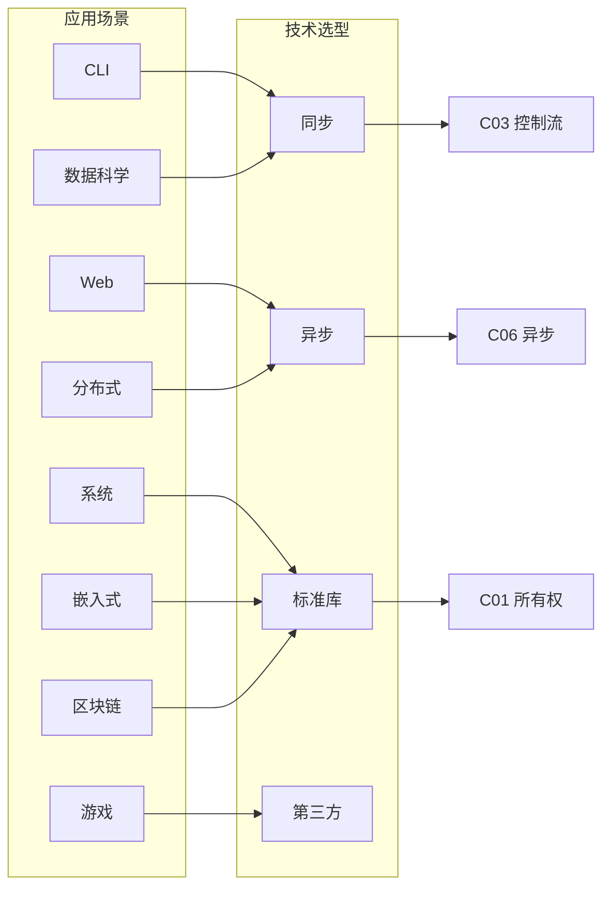

# Rust 应用分析论证视图

> **创建日期**: 2026-02-12
> **最后更新**: 2026-02-15
> **Rust 版本**: 1.93.0+ (Edition 2024)
> **状态**: ✅ 已完成

---

## 目录

- [Rust 应用分析论证视图](#rust-应用分析论证视图)
  - [目录](#目录)
  - [应用场景选型决策树](#应用场景选型决策树)
  - [CLI 工具](#cli-工具)
  - [Web 服务](#web-服务)
  - [系统编程](#系统编程)
  - [嵌入式](#嵌入式)
  - [分布式系统](#分布式系统)
  - [数据科学](#数据科学)
  - [游戏引擎](#游戏引擎)
  - [区块链与智能合约](#区块链与智能合约)
  - [WASM 与跨平台](#wasm-与跨平台)
  - [DevOps 与 CI](#devops-与-ci)
  - [跨场景选型矩阵](#跨场景选型矩阵)
  - [跨场景选型矩阵（表格式）](#跨场景选型矩阵表格式)
  - [选型冲突与化解](#选型冲突与化解)
  - [与形式化体系衔接](#与形式化体系衔接)
  - [相关文档](#相关文档)

---

## 应用场景选型决策树

```text
应用类型？
├── 单体 CLI/脚本 → 同步、std、clap
├── Web/API 服务 → 异步、Tokio、axum/actix
├── 系统底层 → std、nix、unsafe 谨慎
├── 嵌入式/裸机 → no_std、alloc 可选
├── 分布式/微服务 → 异步、tonic、消息队列
├── 数据科学/ML → rayon、ndarray、polars
├── 游戏/实时 → rayon、ECS、wgpu
├── 区块链/合约 → 确定性、无浮点、borsh
├── 前端/跨平台 → WASM、wasm-bindgen
└── 工具链/CI → 同步、std、cargo 生态
```

---

## CLI 工具

| 应用场景 | 技术选型 | 论证依据 |
| :--- | :--- | :--- || 参数解析 | clap | 生态成熟、derive 支持、子命令、补全 |
| I/O 模式 | 同步 (std::io) | CLI 通常非高并发、简单直接 |
| 错误处理 | anyhow (应用) / thiserror (库) | 快速原型用 anyhow、库用 thiserror |
| 相关模块 | C03 控制流、C07 进程、C08 算法 | 控制流、子进程、数据处理 |

**公理 / 定理 → 论证**：CLI 选型遵循「单线程主导」公理——CLI 通常顺序执行、无高并发需求。定理：同步 I/O 在单线程下零额外开销；派生：`std::io` 足以满足，`std::process` 管理子进程。错误类型需满足 `Error + Send + Sync` 以支持 `anyhow`/`thiserror`。

**决策树**：需子命令？→ clap；需补全？→ clap + shell_completion；错误传播？→ anyhow；库边界？→ thiserror。

---

## Web 服务

| 应用场景 | 技术选型 | 论证依据 |
| :--- | :--- | :--- || 异步运行时 | Tokio | 生态最全、生产验证、async-std 备选 |
| Web 框架 | axum / actix-web | axum 与 Tokio 同源、actix 高性能 |
| 相关模块 | C06 异步、C10 网络 | 异步 I/O、TCP/HTTP |

**公理 / 定理 → 论证**：Web 选型遵循「I/O 密集型」公理——大量请求等待网络/磁盘。定理：异步 runtime 在 I/O 等待时复用线程，可支撑更高并发。Tokio 选型依据：M:N 调度、与 async-std 生态对比、生产验证。axum 与 Tokio 同源，减少调度开销。

**决策树**：REST/GraphQL？→ axum；极高 QPS？→ actix-web；gRPC？→ tonic；WebSocket？→ axum/tokio-tungstenite。

**形式化引用**：[async_state_machine](../research_notes/formal_methods/async_state_machine.md)、[03_execution_models/02_async](../research_notes/software_design_theory/03_execution_models/02_async.md)。

---

## 系统编程

| 应用场景 | 技术选型 | 论证依据 |
| :--- | :--- | :--- || 进程与 IPC | std::process、nix/libc | 标准库足矣、底层用 nix |
| 可能 unsafe | 谨慎使用 | 参考 UNSAFE_RUST_GUIDE |
| 相关模块 | C07 进程、C05 线程 | 进程管理、并发 |

**公理 / 定理 → 论证**：系统编程选型遵循「最小依赖」公理——底层系统库应尽量少依赖。定理：`std::process` 提供可移植的进程抽象；`nix` 提供 Unix 特定 API。unsafe 使用需遵守 Rustonomicon 约束：安全抽象边界、不变式文档化。

**决策树**：标准 API 够用？→ std；需 Unix 特定？→ nix；需 Windows 特定？→ windows-sys；FFI？→ 最小化 unsafe 范围。参考 [UNSAFE_RUST_GUIDE](../05_guides/UNSAFE_RUST_GUIDE.md)。

---

## 嵌入式

| 应用场景 | 技术选型 | 论证依据 |
| :--- | :--- | :--- || 标准库 | no_std 可选 | 参考 Embedded Book |
| 并发 | 裸金属/RTOS | 无 OS 时受限 |
| 相关模块 | C01 所有权、C02 类型、C05 线程 | 内存、类型、并发基础 |

**公理 / 定理 → 论证**：嵌入式选型遵循「资源受限」公理——无 OS 或极小运行时。定理：`no_std` 剔除堆分配与标准库；所有权与借用保证无 GC 下内存安全。并发选型：裸金属用临界区/中断；RTOS 用其提供的同步原语。

**决策树**：需堆？→ `extern crate alloc`；需异步？→ embassy；裸金属？→ cortex-m/avr；有 RTOS？→ 用其 API。参考 [supported_unsupported_matrix](../research_notes/software_design_theory/05_boundary_system/supported_unsupported_matrix.md#no_std)。

---

## 分布式系统

| 应用场景 | 技术选型 | 论证依据 |
| :--- | :--- | :--- || 消息传递 | 消息队列、分布式锁 | 跨节点通信 |
| 异步+网络 | Tokio + 网络 crate | 高并发 I/O |
| 相关模块 | C06 异步、C10 网络、C11 宏 | 异步、网络、元编程 |

**公理 / 定理 → 论证**：分布式选型遵循「跨节点通信」公理——网络延迟与故障不可忽视。定理：异步 I/O 适合网络等待；消息传递优于共享状态（避免分布式锁复杂性）。Tokio 与消息队列（如 Kafka、RabbitMQ）配合；宏用于序列化/代码生成。

**决策树**：RPC？→ tonic；Actor？→ actix；消息队列？→ rdkafka/lapin；序列化？→ serde + borsh/prost。参考 [05_distributed](../research_notes/software_design_theory/03_execution_models/05_distributed.md)。

---

## 数据科学

| 应用场景 | 技术选型 | 论证依据 |
| :--- | :--- | :--- || 数值计算 | ndarray / nalgebra | 零成本抽象、SIMD 友好 |
| 并行运算 | rayon | 数据并行、CPU 密集型 |
| 数据管道 | polars / rust-dataframe | 列式存储、内存布局优化 |
| 相关模块 | C02 类型、C05 线程、C08 算法 | 泛型、并行、排序/搜索 |

**公理 / 定理 → 论证**：数据科学选型遵循「数据密集」公理——大量结构化数据在内存中处理。定理：所有权系统保证无 GC 暂停、无数据竞争；rayon 提供数据并行；ndarray 与 SIMD 结合可达到 C/Fortran 级性能。

**决策树**：向量/矩阵？→ ndarray/nalgebra；DataFrame？→ polars；CPU 并行？→ rayon；GPU？→ cust/wgpu。参考 [04_parallel](../research_notes/software_design_theory/03_execution_models/04_parallel.md)。

---

## 游戏引擎

| 应用场景 | 技术选型 | 论证依据 |
| :--- | :--- | :--- || 实体组件 | ECS (bevy / hecs) | 面向数据、缓存友好 |
| 渲染 | wgpu / Vulkan | 跨平台、GPU 抽象 |
| 物理 | Rapier / Parry | 确定性、无 GC |
| 相关模块 | C01 所有权、C05 线程、C08 算法 | 内存、并行走图、空间分割 |

**公理 / 定理 → 论证**：游戏引擎选型遵循「实时性」公理——帧率稳定、无停顿。定理：所有权与借用保证无 GC；ECS 与 Rust 的借用规则天然契合；无数据竞争保证多线程安全。

**决策树**：ECS？→ bevy/hecs；渲染？→ wgpu；物理？→ Rapier；2D？→ macroquad；音频？→ rodio。参考 [practical_applications](../research_notes/practical_applications.md)。

---

## 区块链与智能合约

| 应用场景 | 技术选型 | 论证依据 |
| :--- | :--- | :--- || 智能合约 | Solana (Rust) / NEAR | Rust 确定性、Gas 可控 |
| 密码学 | ring / rust-crypto | 安全、可审计 |
| 序列化 | borsh / scale | 确定性编码、无歧义 |
| 相关模块 | C01 所有权、C02 类型、C11 宏 | 内存安全、类型安全、代码生成 |

**公理 / 定理 → 论证**：区块链选型遵循「确定性」公理——全节点共识须一致。定理：Rust 无 GC、无未定义行为，执行可复现；形式化验证可应用到合约逻辑；宏用于序列化/反序列化代码生成。

**决策树**：Solana？→ anchor/borsh；NEAR？→ near-sdk；通用合约？→ 确定性编码、无浮点、无随机。参考 [LANGUAGE_SEMANTICS_EXPRESSIVENESS](../research_notes/LANGUAGE_SEMANTICS_EXPRESSIVENESS.md) 表达能力边界。

---

## WASM 与跨平台

| 应用场景 | 技术选型 | 论证依据 |
| :--- | :--- | :--- || 前端编译 | wasm-pack、wasm-bindgen | 与 JS 互操作、类型安全 |
| 目标 | wasm32-unknown-unknown | 无 std、可选 alloc |
| 运行时 | wasm-bindgen-futures | 异步与 JS Promise 互操作 |
| 相关模块 | C01 所有权、C02 类型、C11 宏 | 内存、类型、serde |

**公理 / 定理 → 论证**：WASM 选型遵循「无 host 假设」公理——目标环境无 OS、无 std。定理：`no_std` 剔除标准库；所有权保证无 GC；与 JS 互操作需 `wasm-bindgen`。无浮点、无 alloc 可减小体积；确定性重要时避免随机/时间依赖。

**决策树**：需 std？→ wasm32-wasi；纯前端？→ wasm32-unknown-unknown；需 alloc？→ `extern crate alloc`。

---

## DevOps 与 CI

| 应用场景 | 技术选型 | 论证依据 |
| :--- | :--- | :--- || 构建工具 | cargo、build.rs | 标准构建、依赖管理 |
| 测试 | cargo test、criterion | 单元/集成/基准 |
| 格式化 | rustfmt | 风格一致 |
| Lint | clippy | 静态检查 |
| 相关模块 | C07 进程、C08 算法 | 子进程、脚本 |

**公理 / 定理 → 论证**：DevOps 选型遵循「可重复」公理——构建结果可复现。定理：`Cargo.lock` 锁定依赖；`rust-toolchain.toml` 固定版本；MIRI 可检测 UB。CI 流水线通常同步执行；无高并发需求。

---

## 跨场景选型矩阵



---

## 跨场景选型矩阵（表格式）

| 场景 | 执行模型 | 运行时 | 网络 | 数据 | 形式化引用 |
| :--- | :--- | :--- | :--- | :--- | :--- || CLI | 同步 | std | 无 | 可选 | [01_synchronous](../research_notes/software_design_theory/03_execution_models/01_synchronous.md) |
| Web | 异步 | tokio | HTTP/gRPC | 可选 | [02_async](../research_notes/software_design_theory/03_execution_models/02_async.md) |
| 系统 | 同步/并发 | std | std::net | 无 | [03_concurrent](../research_notes/software_design_theory/03_execution_models/03_concurrent.md) |
| 嵌入式 | 同步 | no_std | 无 | 无 | [supported_unsupported](../research_notes/software_design_theory/05_boundary_system/supported_unsupported_matrix.md#no_std) |
| 分布式 | 异步 | tokio | tonic/Kafka | 序列化 | [05_distributed](../research_notes/software_design_theory/03_execution_models/05_distributed.md) |
| 数据科学 | 并行 | rayon | 无 | ndarray/polars | [04_parallel](../research_notes/software_design_theory/03_execution_models/04_parallel.md) |
| 游戏 | 并行/并发 | rayon/std | 可选 | ECS | 同上 |
| WASM | 同步/异步 | wasm | 无 | 可选 | [WASM_USAGE_GUIDE](./WASM_USAGE_GUIDE.md) |

---

## 选型冲突与化解

| 冲突 | 化解 |
| :--- | :--- || 需 async 与 需 no_std | 选 smol/embassy；或 wasm-bindgen-futures |
| 需高并发与 需确定性 | 异步可并发；区块链需确定性时避免异步随机 |
| 需 FFI 与 需纯 Safe | 将 unsafe 封装在最小模块；对外 Safe API |
| 需跨平台与 需特定平台 API | 用 cfg 条件编译；trait 抽象平台差异 |

---

## 与形式化体系衔接

| 应用场景 | 形式化定理 | 文档 |
| :--- | :--- | :--- || 内存安全 | ownership T2/T3、borrow T1 | [ownership_model](../research_notes/formal_methods/ownership_model.md) |
| 并发安全 | async T6.2、Send/Sync | [async_state_machine](../research_notes/formal_methods/async_state_machine.md) |
| 类型安全 | type_system T1–T3 | [type_system_foundations](../research_notes/type_theory/type_system_foundations.md) |
| 设计模式 | CE-T1–T3 | [04_compositional_engineering](../research_notes/software_design_theory/04_compositional_engineering/README.md) |
| 安全边界 | unsafe 契约 | [SAFE_UNSAFE_COMPREHENSIVE_ANALYSIS](../research_notes/SAFE_UNSAFE_COMPREHENSIVE_ANALYSIS.md) |

---

## 相关文档

- [思维表征方式](./THINKING_REPRESENTATION_METHODS.md) - 决策树、转换树
- [多维概念矩阵](./MULTI_DIMENSIONAL_CONCEPT_MATRIX.md) - 技术选型矩阵
- [跨模块集成示例](./CROSS_MODULE_INTEGRATION_EXAMPLES.md)
- [实际应用案例研究](./../research_notes/practical_applications.md) - 案例库
- [执行模型边界分析](./../research_notes/software_design_theory/03_execution_models/06_boundary_analysis.md) - 模型选型
- [WASM 使用指南](./WASM_USAGE_GUIDE.md)
