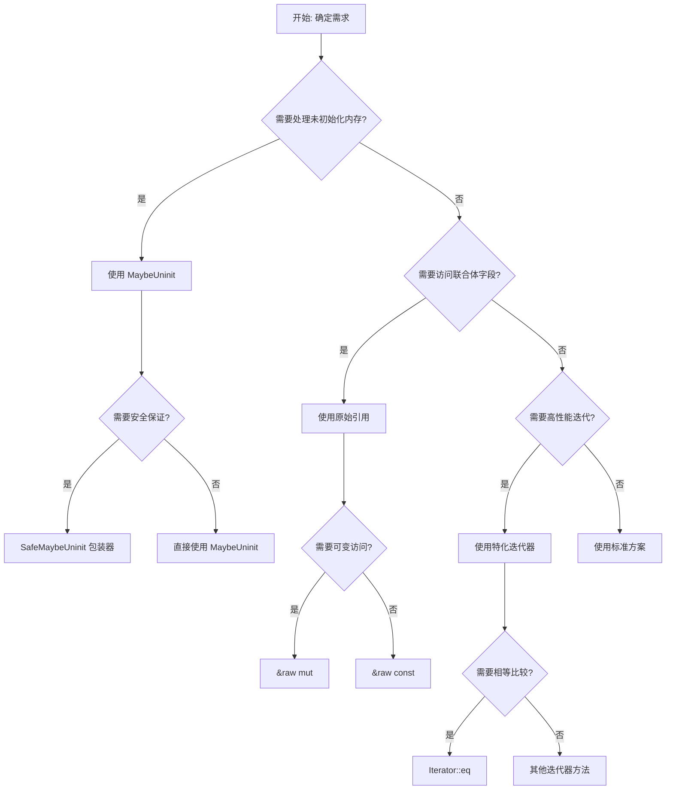

# Rust 1.93.0 决策图网 / Decision Graph Network

> **文档版本**: 1.1
> **Rust 版本**: 1.93.0
> **创建日期**: 2025-12-11
> **用途**: 帮助开发者根据需求选择合适的技术方案

---

## 📋 目录

- [Rust 1.93.0 决策图网 / Decision Graph Network](#rust-1930-决策图网--decision-graph-network)
  - [📋 目录](#-目录)
  - [🎯 决策图网概述](#-决策图网概述)
    - [概念定义](#概念定义)
    - [核心属性](#核心属性)
    - [关系连接](#关系连接)
    - [应用场景](#应用场景)
  - [🚀 核心决策流程](#-核心决策流程)
    - [决策流程总览](#决策流程总览)
  - [📦 模块化决策树](#-模块化决策树)
    - [1. 所有权与借用决策树](#1-所有权与借用决策树)
    - [2. 类型系统决策树](#2-类型系统决策树)
    - [3. 控制流决策树](#3-控制流决策树)
    - [4. 异步编程决策树](#4-异步编程决策树)
    - [5. Pin 使用场景决策树 🆕](#5-pin-使用场景决策树-)
    - [6. 表达能力边界决策树](#6-表达能力边界决策树)
  - [⚡ 特性选择决策](#-特性选择决策)
    - [Rust 1.93.0 特性选择矩阵](#rust-1930-特性选择矩阵)
    - [特性组合决策](#特性组合决策)
  - [🚀 性能优化决策](#-性能优化决策)
    - [性能优化决策树](#性能优化决策树)
    - [性能 vs 安全性权衡](#性能-vs-安全性权衡)
  - [🛡️ 安全保证决策](#️-安全保证决策)
    - [安全保证决策树](#安全保证决策树)
    - [Rust 1.93.0 安全改进](#rust-1930-安全改进)
  - [📊 决策矩阵总结](#-决策矩阵总结)
    - [快速决策参考](#快速决策参考)
  - [🔗 相关文档](#-相关文档)

---

## 🎯 决策图网概述

### 概念定义

**决策图网 (Decision Graph Network)** 是一种结构化的决策支持工具，通过树状结构和图网络展示不同场景下的技术选择路径。

### 核心属性

1. **结构化** - 树状结构组织决策路径
2. **场景化** - 针对不同场景提供决策
3. **可追溯** - 决策路径清晰可追溯
4. **可扩展** - 支持添加新的决策节点

### 关系连接

- **继承关系**: 决策图网 → 决策树 → 决策节点
- **组合关系**: 决策图网 = 多个决策树 + 决策矩阵
- **依赖关系**: 决策图网依赖技术知识库

### 应用场景

决策图网是一种结构化的决策支持工具，通过树状结构展示不同场景下的技术选择路径，帮助开发者：

1. **快速定位** - 根据需求快速找到合适的技术方案
2. **避免错误** - 减少技术选型错误
3. **优化性能** - 选择最优的性能方案
4. **确保安全** - 选择最安全的内存管理方式

---

## 🚀 核心决策流程

### 决策流程总览



---

## 📦 模块化决策树

### 1. 所有权与借用决策树

```text
需要管理资源所有权？
├── 是
│   ├── 需要共享所有权？
│   │   ├── 是 → 使用 Rc<T> (单线程) 或 Arc<T> (多线程)
│   │   └── 否 → 使用 Box<T> 或直接所有权
│   ├── 需要内部可变性？
│   │   ├── 是 → 使用 Cell<T> 或 RefCell<T>
│   │   └── 否 → 使用常规借用
│   └── 需要处理未初始化内存？
│       ├── 是 → 使用 MaybeUninit<T> (Rust 1.92)
│       │   ├── 需要安全保证？ → SafeMaybeUninit 包装器
│       │   └── 需要性能？ → 直接使用 MaybeUninit
│       └── 否 → 使用常规初始化
└── 否 → 使用借用 (&T 或 &mut T)
```

### 2. 类型系统决策树

```text
需要泛型编程？
├── 是
│   ├── 需要关联类型？
│   │   ├── 是 → 使用关联类型 (Rust 1.92: 支持多边界)
│   │   └── 否 → 使用泛型参数
│   ├── 需要自动特征？
│   │   ├── 是 → 利用 Rust 1.92 改进的自动特征处理
│   │   └── 否 → 手动实现特征
│   └── 需要零大小类型？
│       ├── 是 → 利用 Rust 1.92 优化的零大小数组处理
│       └── 否 → 使用常规类型
└── 否 → 使用具体类型
```

### 3. 控制流决策树

```text
需要错误处理？
├── 是
│   ├── 错误可恢复？
│   │   ├── 是 → 使用 Result<T, E>
│   │   │   ├── Rust 1.92: Result<(), !> 不再警告
│   │   │   └── 常规 Result<T, E>
│   │   └── 否 → 使用 panic! 或 abort
│   ├── 需要控制流？
│   │   ├── 是 → 使用 ControlFlow<T, E>
│   │   └── 否 → 使用 Result
│   └── 需要 Never 类型？
│       ├── 是 → 使用 ! (Rust 1.92: 更严格的 Lint)
│       └── 否 → 使用常规类型
└── 否 → 使用常规控制流
```

### 4. 异步编程决策树

```text
需要异步编程？
├── 是
│   ├── 需要并发执行？
│   │   ├── 是 → 使用 tokio::spawn 或 async_std::task::spawn
│   │   └── 否 → 使用单任务异步
│   ├── 需要错误追踪？
│   │   ├── 是 → 使用 #[track_caller] (Rust 1.92: 可与 #[no_mangle] 组合)
│   │   └── 否 → 常规错误处理
│   └── 需要性能优化？
│       ├── 是 → 使用特化迭代器 (Rust 1.92)
│       └── 否 → 使用标准迭代器
└── 否 → 使用同步编程
```

### 5. Pin 使用场景决策树 🆕

> 用于判断何时用栈固定 vs 堆固定。详见 [DESIGN_MECHANISM_RATIONALE](../research_notes/DESIGN_MECHANISM_RATIONALE.md#-pin堆栈区分使用场景的完整论证)。

```text
需要固定 T？
├── T : Unpin？
│   ├── 是 → 栈固定：Pin::new(&mut t)（零开销）
│   └── 否 → 必须堆固定：Box::pin(t)（自引用，移动导致悬垂）
├── 存储位置？
│   ├── 栈上局部变量 → Pin::new（仅 Unpin）
│   ├── 堆上分配 → Box::pin（任意 T）
│   └── 集合/容器内 → Box::pin 或 Pin<Box<T>>
└── 性能考量？
    ├── 零开销优先 → 栈 + Unpin
    └── 必须有自引用 → 堆固定（必要开销）
```

### 6. 表达能力边界决策树

> 用于判断「何者可表达、何者不可表达」。详见 [LANGUAGE_SEMANTICS_EXPRESSIVENESS](../research_notes/LANGUAGE_SEMANTICS_EXPRESSIVENESS.md)。

```text
需要表达 X？
├── 内存管理
│   ├── 单所有者 → ✅ 所有权
│   ├── 共享只读 → ✅ 多不可变借用
│   ├── 共享可变 → ❌ 安全子集不可（需 Mutex/Cell）
│   └── 手动控制 → ⚠️ unsafe
├── 类型多态
│   ├── 编译时 → ✅ 泛型 + Trait
│   ├── 运行时 → ✅ dyn Trait
│   └── 依赖类型 → ⚠️ 受限 GAT
├── 并发
│   ├── 数据竞争自由 → ✅ Send/Sync + 借用
│   └── 共享可变无锁 → ❌ 需 unsafe
└── 异步
    ├── 终将完成 → ✅ 有限 Future
    └── 可能永久挂起 → ⚠️ 需超时/取消
```

---

## ⚡ 特性选择决策

### Rust 1.93.0 特性选择矩阵

| 需求场景 | 推荐特性 | 替代方案 | 性能影响 | 安全影响 |
| --- | --- | --- | --- | --- |
| 未初始化内存管理 | MaybeUninit<T> | unsafe 指针 | 零成本 | ✅ 类型安全 |
| 联合体字段访问 | &raw const/mut | unsafe 转换 | 零成本 | ✅ 安全访问 |
| 关联类型多边界 | type Item: A + B + C | where 子句 | 零成本 | ✅ 类型安全 |
| 零大小数组 | [T; 0] 优化 | PhantomData | 零成本 | ✅ 类型安全 |
| 调用位置追踪 | #[track_caller] | 手动传递 | 运行时开销 | ✅ 调试友好 |
| Never 类型 | ! 类型 | Infallible | 零成本 | ✅ 类型安全 |
| 迭代器比较 | Iterator::eq | 手动循环 | 性能提升 | ✅ 安全 |
| 切片旋转 | rotate_right | 手动实现 | 性能提升 | ✅ 安全 |

### 特性组合决策

```text
需要多个特性组合？
├── 是
│   ├── 未初始化内存 + 调用追踪
│   │   └── → MaybeUninit + #[track_caller]
│   ├── 联合体访问 + 零大小优化
│   │   └── → &raw const + [T; 0]
│   └── 关联类型 + 自动特征
│       └── → type Item: A + B + C (Rust 1.92)
└── 否 → 使用单一特性
```

---

## 🚀 性能优化决策

### 性能优化决策树

```text
需要性能优化？
├── 是
│   ├── 迭代器性能？
│   │   ├── 是 → 使用 TrustedLen 迭代器 + Iterator::eq (Rust 1.92)
│   │   └── 否 → 使用标准迭代器
│   ├── 内存布局优化？
│   │   ├── 是 → 使用零大小数组优化 (Rust 1.92)
│   │   └── 否 → 使用常规布局
│   ├── 元组操作性能？
│   │   ├── 是 → 使用简化的元组扩展 (Rust 1.92)
│   │   └── 否 → 使用常规元组
│   └── 字符串编码性能？
│       ├── 是 → 使用增强的 EncodeWide Debug (Rust 1.92)
│       └── 否 → 使用标准编码
└── 否 → 使用标准实现
```

### 性能 vs 安全性权衡

| 场景 | 高性能方案 | 高安全方案 | 推荐方案 (Rust 1.92) |
| --- | --- | --- | --- |
| 未初始化内存 | unsafe 指针 | SafeMaybeUninit | ✅ MaybeUninit (零成本抽象) |
| 联合体访问 | unsafe 转换 | &raw const/mut | ✅ &raw const/mut (安全且零成本) |
| 迭代器比较 | 手动循环 | Iterator::eq | ✅ Iterator::eq (特化优化) |
| 切片旋转 | 手动实现 | rotate_right | ✅ rotate_right (标准库优化) |

---

## 🛡️ 安全保证决策

### 安全保证决策树

```text
需要内存安全保证？
├── 是
│   ├── 需要防止悬垂指针？
│   │   ├── 是 → 使用生命周期标注 + Rust 1.92 增强的高阶生命周期
│   │   └── 否 → 使用常规引用
│   ├── 需要防止双重释放？
│   │   ├── 是 → 使用所有权系统 + Drop trait
│   │   └── 否 → 使用借用系统
│   ├── 需要防止未初始化访问？
│   │   ├── 是 → 使用 MaybeUninit + 有效性检查 (Rust 1.92)
│   │   └── 否 → 使用常规初始化
│   └── 需要防止数据竞争？
│       ├── 是 → 使用 Send + Sync + Arc/Mutex
│       └── 否 → 使用单线程方案
└── 否 → 使用 unsafe 代码 (需谨慎)
```

### Rust 1.93.0 安全改进

| 安全特性 | Rust 1.90 | Rust 1.91 | Rust 1.92 | 改进说明 |
| --- | --- | --- | --- | --- |
| MaybeUninit 文档化 | ⚠️ 部分 | ⚠️ 部分 | ✅ 完整 | 明确有效性约束 |
| 联合体原始引用 | ❌ | ❌ | ✅ 新增 | 安全访问联合体字段 |
| Never 类型 Lint | ⚠️ 警告 | ⚠️ 警告 | ✅ 拒绝 | 更严格的类型检查 |
| 高阶生命周期 | ⚠️ 基础 | ⚠️ 基础 | ✅ 增强 | 更强的一致性规则 |

---

## 📊 决策矩阵总结

### 快速决策参考

| 需求 | Rust 1.92 推荐方案 | 模块 | 优先级 |
| --- | --- | --- | --- |
| 未初始化内存 | MaybeUninit<T> | c01, c02, c07 | ⭐⭐⭐⭐⭐ |
| 联合体访问 | &raw const/mut | c01, c02 | ⭐⭐⭐⭐ |
| 关联类型多边界 | type Item: A + B + C | c02, c04 | ⭐⭐⭐⭐ |
| 零大小数组 | [T; 0] 优化 | c01, c02, c08 | ⭐⭐⭐ |
| 调用追踪 | #[track_caller] | c01, c03, c11 | ⭐⭐⭐ |
| 迭代器优化 | Iterator::eq 特化 | c03, c08 | ⭐⭐⭐⭐ |
| 切片旋转 | rotate_right | c02, c08 | ⭐⭐⭐ |
| Never 类型 | ! 类型 + 严格 Lint | c01, c03 | ⭐⭐⭐ |

---

## 🔗 相关文档

- [DESIGN_MECHANISM_RATIONALE](../research_notes/DESIGN_MECHANISM_RATIONALE.md) - Pin 堆/栈区分、设计机制论证
- [LANGUAGE_SEMANTICS_EXPRESSIVENESS](../research_notes/LANGUAGE_SEMANTICS_EXPRESSIVENESS.md) - 表达能力边界
- [PROOF_GRAPH_NETWORK.md](./PROOF_GRAPH_NETWORK.md)
- [RUST_192 版本文档](../archive/version_reports/RUST_192_VERIFICATION_SUMMARY.md)

---

**最后更新**: 2025-12-11
**维护者**: Rust 学习项目团队
**状态**: ✅ **决策图网完成**
