# Rust 1.93.0 决策图网 / Decision Graph Network

> **创建日期**: 2025-12-11
> **最后更新**: 2026-02-20
> **Rust 版本**: 1.93.0+ (Edition 2024)
> **状态**: ✅ 已完成

---

## 📋 目录

- [Rust 1.93.0 决策图网 / Decision Graph Network](#rust-1930-决策图网--decision-graph-network)
  - [📋 目录](#-目录)
  - [🎯 决策图网概述](#-决策图网概述)
  - [🚀 核心决策流程](#-核心决策流程)
  - [📦 模块化决策树](#-模块化决策树)
    - [1. 所有权与借用决策树](#1-所有权与借用决策树)
    - [2. 类型系统决策树](#2-类型系统决策树)
    - [3. 控制流决策树](#3-控制流决策树)
    - [4. 异步编程决策树](#4-异步编程决策树)
    - [5. Pin 使用场景决策树](#5-pin-使用场景决策树)
    - [6. 表达能力边界决策树](#6-表达能力边界决策树)
  - [🔧 技术选型决策树](#-技术选型决策树)
    - [集合类型选择](#集合类型选择)
    - [错误处理策略选择](#错误处理策略选择)
    - [并发模型选择](#并发模型选择)
    - [序列化库选择](#序列化库选择)
    - [Web框架选择](#web框架选择)
    - [数据库访问选择](#数据库访问选择)
  - [🐛 调试决策树](#-调试决策树)
    - [编译错误调试](#编译错误调试)
    - [运行时错误调试](#运行时错误调试)
    - [性能问题调试](#性能问题调试)
    - [内存问题调试](#内存问题调试)
  - [⚡ 优化决策树](#-优化决策树)
    - [CPU优化决策树](#cpu优化决策树)
    - [内存优化决策树](#内存优化决策树)
    - [I/O优化决策树](#io优化决策树)
    - [编译优化决策树](#编译优化决策树)
  - [📚 学习路径决策树](#-学习路径决策树)
    - [新手学习路径](#新手学习路径)
    - [有经验开发者路径](#有经验开发者路径)
    - [专项技能提升路径](#专项技能提升路径)
  - [📊 决策矩阵总结](#-决策矩阵总结)
  - [🔗 相关文档](#-相关文档)

---

## 🎯 决策图网概述

**决策图网 (Decision Graph Network)** 是一种结构化的决策支持工具，通过树状结构和图网络展示不同场景下的技术选择路径。

### 核心属性

1. **结构化** - 树状结构组织决策路径
2. **场景化** - 针对不同场景提供决策
3. **可追溯** - 决策路径清晰可追溯
4. **可扩展** - 支持添加新的决策节点

### 应用场景

- 快速定位合适的技术方案
- 避免技术选型错误
- 优化性能和安全性
- 规划学习路径

---

## 🚀 核心决策流程

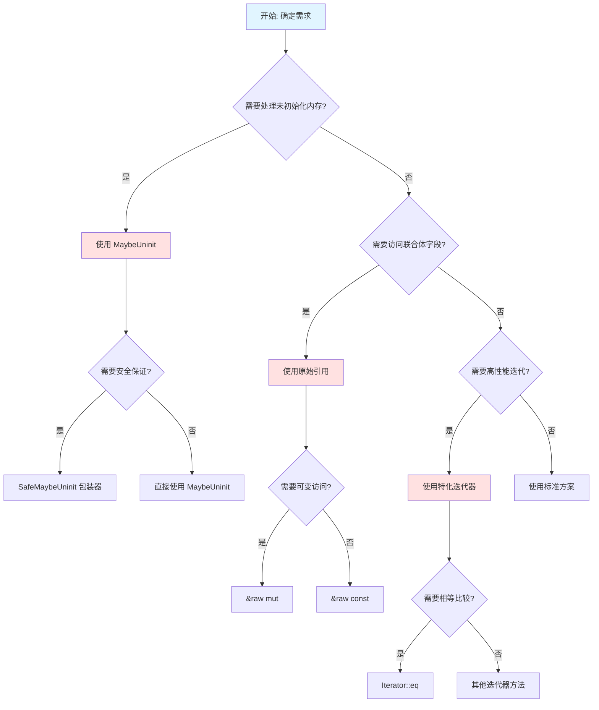

---

## 📦 模块化决策树

### 1. 所有权与借用决策树

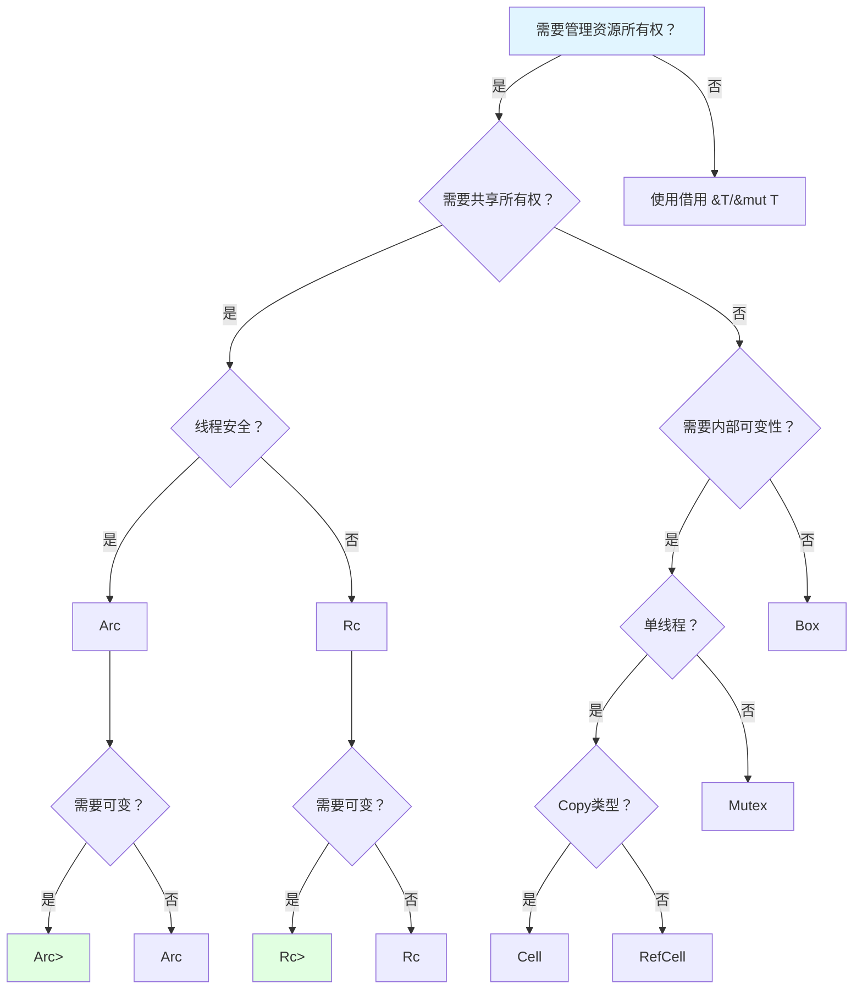

### 2. 类型系统决策树

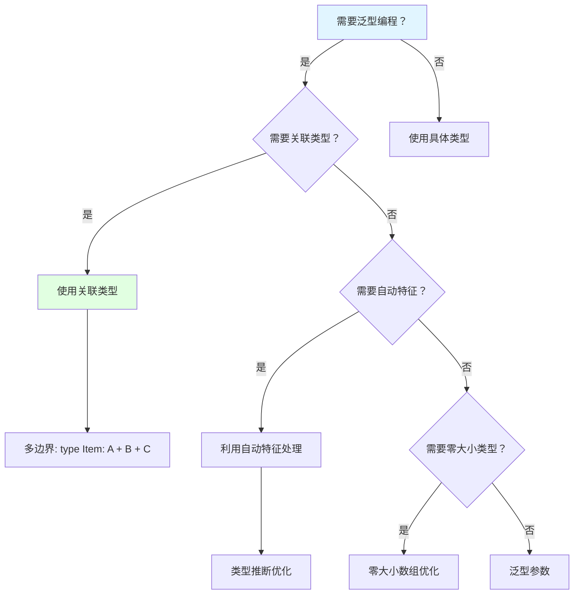

### 3. 控制流决策树

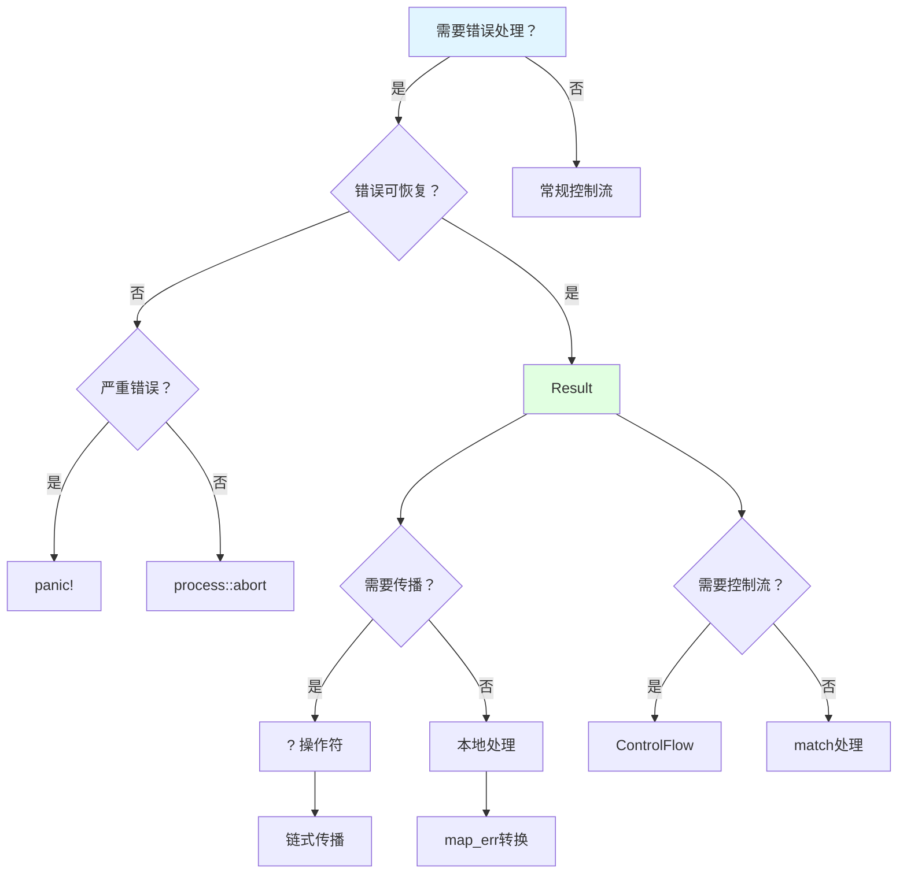

### 4. 异步编程决策树

```mermaid
graph TD
    Start[需要异步编程？] -->|是| Q1{需要并发执行？}
    Start -->|否| Sync[同步编程]
    
    Q1 -->|是| Concurrent[并发执行]
    Q1 -->|否| Sequential[顺序执行]
    
    Concurrent --> Q2{CPU密集型？}
    
    Q2 -->|是| Blocking[spawn_blocking]
    Q2 -->|否| AsyncSpawn[tokio::spawn]
    
    Sequential --> Q3{需要错误追踪？}
    
    Q3 -->|是| TrackCaller[#[track_caller]]
    Q3 -->|否| NormalAsync[常规异步]
    
    TrackCaller --> Location[Location::caller]
    
    Concurrent --> Q4{需要性能优化？}
    
    Q4 -->|是| Specialization[特化迭代器]
    Q4 -->|否| Standard[标准异步]
    
    style Start fill:#e1f5ff
    style Concurrent fill:#e1ffe1
```

### 5. Pin 使用场景决策树

```mermaid
graph TD
    Start[需要固定 T？] --> Q1{T : Unpin？}
    
    Q1 -->|是| StackPin[栈固定]
    Q1 -->|否| HeapPin[堆固定]
    
    StackPin --> StackMethod[Pin::new(&mut t)]
    StackPin --> ZeroCost[零开销]
    
    HeapPin --> BoxPin[Box::pin(t)]
    HeapPin --> SelfRef[自引用结构]
    
    Start --> Q2{存储位置？}
    
    Q2 -->|栈上| StackOnly[仅 Unpin]
    Q2 -->|堆上| HeapAny[任意 T]
    Q2 -->|集合内| PinBox[Pin<Box<T>>]
    
    Start --> Q3{性能考量？}
    
    Q3 -->|零开销| StackPrefer[优先栈固定]
    Q3 -->|必须自引用| AcceptHeap[接受堆分配]
    
    style Start fill:#e1f5ff
    style StackPin fill:#e1ffe1
    style HeapPin fill:#fff5e1
```

### 6. 表达能力边界决策树

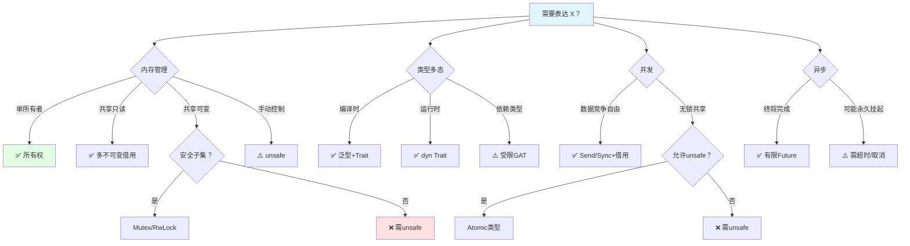

---

## 🔧 技术选型决策树

### 集合类型选择

```mermaid
graph TD
    Start[选择集合类型] --> Q1{有序性要求？}
    
    Q1 -->|需要排序| Sorted{唯一键？}
    Q1 -->|无序| Unsorted{唯一键？}
    
    Sorted -->|是| BTreeSet[BTreeSet<T>]
    Sorted -->|否| BTreeMap[BTreeMap<K, V>]
    
    Unsorted -->|是| HashSet[HashSet<T>]
    Unsorted -->|否| HashMap[HashMap<K, V>]
    
    Start --> Q2{序列类型？}
    
    Q2 -->|固定大小| Array[数组 [T; N]]
    Q2 -->|动态增长| VecType{双端操作？}
    
    VecType -->|频繁| VecDeque[VecDeque<T>]
    VecType -->|偶尔| Vec[Vec<T>]
    
    Start --> Q3{优先级队列？}
    Q3 -->|是| BinaryHeap[BinaryHeap<T>]
    
    Start --> Q4{链表？}
    Q4 -->|频繁插入删除| LinkedList[LinkedList<T>]
    
    style Start fill:#e1f5ff
    style Vec fill:#e1ffe1
    style HashMap fill:#e1ffe1
```

### 错误处理策略选择

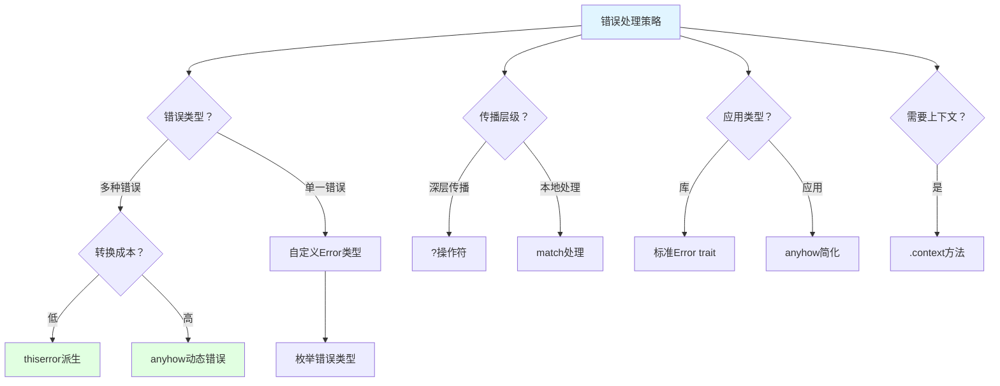

### 并发模型选择

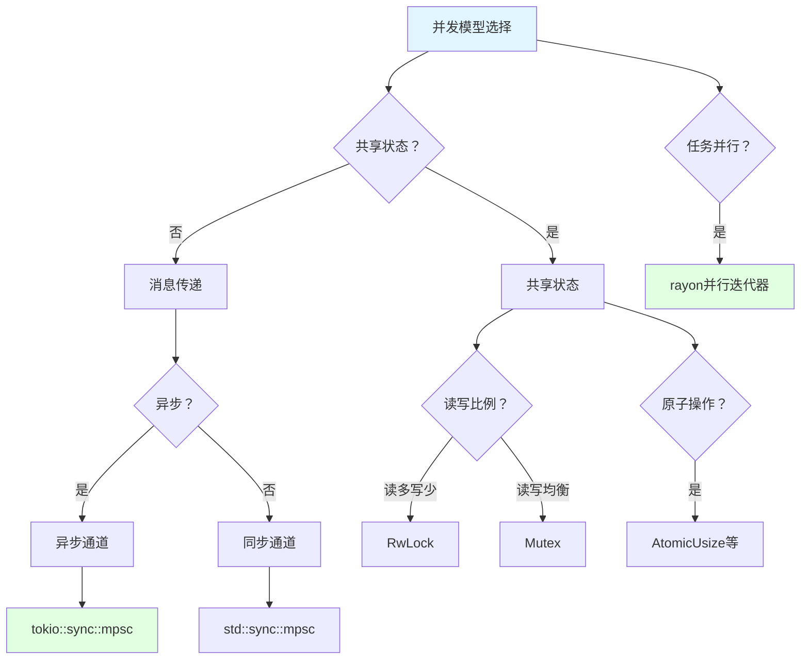

### 序列化库选择

```mermaid
graph TD
    Start[序列化库选择] --> Q1{数据格式？}
    
    Q1 -->|JSON| JsonLib{性能要求？}
    Q1 -->|Binary| BinaryLib{紧凑性？}
    Q1 -->|TOML| TomlLib[toml crate]
    Q1 -->|YAML| YamlLib[serde_yaml]
    
    JsonLib -->|一般| SerdeJson[serde_json]
    JsonLib -->|高性能| SimdJson[simd-json]
    
    BinaryLib -->|紧凑| Bincode[bincode]
    BinaryLib -->|标准| Postcard[postcard]
    BinaryLib -->|跨语言| Protobuf[prost/protobuf]
    
    Start --> Q2{派生宏？}
    Q2 -->|是| SerdeDerive[#[derive(Serialize, Deserialize)]]
    
    Start --> Q3{自定义格式？}
    Q3 -->|是| CustomSer[实现Serializer/Deserializer]
    
    style Start fill:#e1f5ff
    style SerdeJson fill:#e1ffe1
```

### Web框架选择

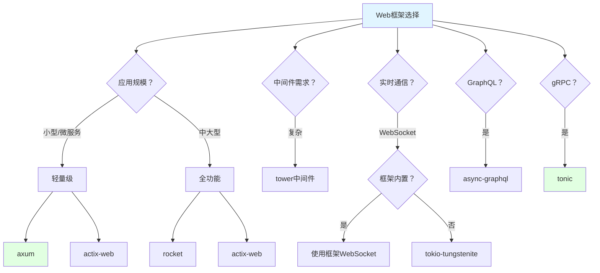

### 数据库访问选择

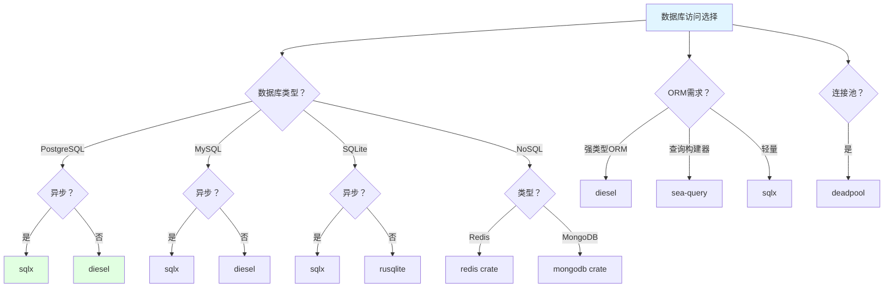

---

## 🐛 调试决策树

### 编译错误调试

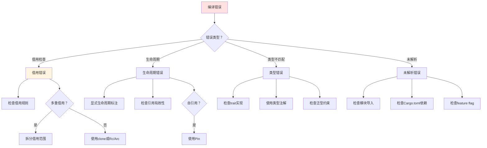

### 运行时错误调试

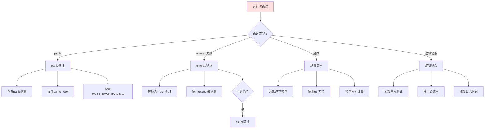

### 性能问题调试

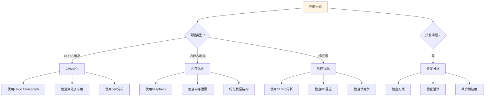

### 内存问题调试

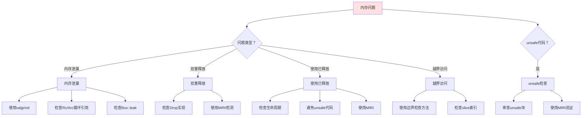

---

## ⚡ 优化决策树

### CPU优化决策树

```mermaid
graph TD
    Start[CPU优化] --> Q1{瓶颈类型？}
    
    Q1 -->|算法| Algorithm[算法优化]
    Q1 -->|并行| Parallel[并行优化]
    Q1 -->|数据布局| Layout[数据布局优化]
    
    Algorithm --> A1[选择更好算法]
    Algorithm --> A2[减少复杂度]
    Algorithm --> A3[使用标准库优化]
    
    Parallel --> P1[使用rayon]
    Parallel --> P2[多线程spawn]
    Parallel --> P3{CPU密集型？}
    P3 -->|是| SpawnBlocking[spawn_blocking]
    
    Layout --> L1[结构体字段重排]
    Layout --> L2[缓存行对齐]
    Layout --> L3[避免false sharing]
    
    Start --> Q2{向量化？}
    Q2 -->|是| Simd[使用SIMD]
    Simd --> Simd1[std::simd]
    Simd --> Simd2[packed_simd]
    
    Start --> Q3{热点函数？}
    Q3 -->|是| Inline[#[inline]]
    
    style Start fill:#e1f5ff
    style Algorithm fill:#e1ffe1
```

### 内存优化决策树

```mermaid
graph TD
    Start[内存优化] --> Q1{优化目标？}
    
    Q1 -->|减少分配| ReduceAlloc[减少分配]
    Q1 -->|减少占用| ReduceSize[减少占用]
    Q1 -->|提高局部性| Locality[缓存局部性]
    
    ReduceAlloc --> RA1[对象池]
    ReduceAlloc --> RA2[arena分配器]
    ReduceAlloc --> RA3[重用缓冲区]
    ReduceAlloc --> RA4[避免clone]
    
    ReduceSize --> RS1[使用&str代替String]
    ReduceSize --> RS2[使用&[T]代替Vec]
    ReduceSize --> RS3[压缩枚举]
    
    Locality --> L1[连续内存布局]
    Locality --> L2[AoS vs SoA]
    Locality --> L3[预取数据]
    
    Start --> Q2{栈vs堆？}
    Q2 -->|尽量栈| StackAlloc[栈分配]
    
    Start --> Q3{大数组？}
    Q3 -->|是| BoxSlice[Box<[T]>]
    
    style Start fill:#e1f5ff
    style ReduceAlloc fill:#e1ffe1
```

### I/O优化决策树

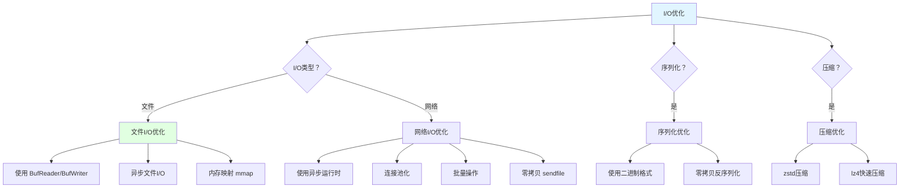

### 编译优化决策树

```mermaid
graph TD
    Start[编译优化] --> Q1{优化目标？}
    
    Q1 -->|发布优化| Release[Release模式]
    Q1 -->|二进制大小| BinarySize[大小优化]
    Q1 -->|编译速度| CompileSpeed[编译速度]
    
    Release --> R1[--release]
    Release --> R2[LTO]
    Release --> R3[codegen-units=1]
    Release --> R4[target-cpu=native]
    
    BinarySize --> B1[opt-level=z]
    BinarySize --> B2[strip symbols]
    BinarySize --> B3[panic=abort]
    BinarySize --> B4[min-sized-rust]
    
    CompileSpeed --> C1[增量编译]
    CompileSpeed --> C2[并行编译]
    CompileSpeed --> C3[sccache]
    
    Start --> Q2{链接优化？}
    Q2 -->|是| LinkOpt[链接优化]
    LinkOpt --> L1[LLD链接器]
    LinkOpt --> L2[mold链接器]
    
    style Start fill:#e1f5ff
    style Release fill:#e1ffe1
```

---

## 📚 学习路径决策树

### 新手学习路径

```mermaid
graph TD
    Start[新手学习Rust] --> Q1{编程基础？}
    
    Q1 -->|完全新手| AbsoluteBeginner[零基础路径]
    Q1 -->|有编程经验| SomeExp[有经验路径]
    
    AbsoluteBeginner --> AB1[学习基础概念]
    AB1 --> AB2[变量和数据类型]
    AB2 --> AB3[控制流]
    AB3 --> AB4[函数]
    AB4 --> AB5[模块系统]
    
    SomeExp --> SE1[所有权和借用]
    SE1 --> SE2[生命周期]
    SE2 --> SE3[结构体和枚举]
    SE3 --> SE4[模式匹配]
    
    AB5 --> CoreConcepts[核心概念]
    SE4 --> CoreConcepts
    
    CoreConcepts --> CC1[深入所有权]
    CoreConcepts --> CC2[泛型]
    CoreConcepts --> CC3[Trait系统]
    
    CC3 --> Advanced[高级主题]
    Advanced --> A1[并发编程]
    Advanced --> A2[异步编程]
    Advanced --> A3[宏和元编程]
    Advanced --> A4[unsafe Rust]
    
    style Start fill:#e1f5ff
    style CoreConcepts fill:#e1ffe1
    style Advanced fill:#fff5e1
```

### 有经验开发者路径

```mermaid
graph TD
    Start[有经验开发者] --> Q1{来自哪种语言？}
    
    Q1 -->|C/C++| FromCpp[C++迁移路径]
    Q1 -->|Java/Go| FromGc[GC语言迁移]
    Q1 -->|Python/JS| FromDynamic[动态语言迁移]
    Q1 -->|Haskell/Scala| FromFp[函数式迁移]
    
    FromCpp --> Cpp1[所有权vs指针]
    FromCpp --> Cpp2[借用vs引用]
    FromCpp --> Cpp3[生命周期vsRAII]
    FromCpp --> Cpp4[无NULL指针]
    
    FromGc --> Gc1[所有权和借用]
    Gc1 --> Gc2[编译时错误处理]
    Gc2 --> Gc3[无GC内存管理]
    
    FromDynamic --> Dyn1[静态类型系统]
    Dyn1 --> Dyn2[所有权和借用]
    Dyn2 --> Dyn3[错误处理差异]
    
    FromFp --> Fp1[模式匹配]
    Fp1 --> Fp2[代数数据类型]
    Fp2 --> Fp3[迭代器和闭包]
    
    Cpp4 --> CommonCore[共同核心]
    Gc3 --> CommonCore
    Dyn3 --> CommonCore
    Fp3 --> CommonCore
    
    CommonCore --> Core1[深入Trait系统]
    CommonCore --> Core2[生命周期高级主题]
    CommonCore --> Core3[并发和异步]
    
    style Start fill:#e1f5ff
    style CommonCore fill:#e1ffe1
```

### 专项技能提升路径

```mermaid
graph TD
    Start[专项技能提升] --> Q1{提升方向？}
    
    Q1 -->|系统编程| Systems[系统编程路径]
    Q1 -->|Web开发| WebDev[Web开发路径]
    Q1 -->|嵌入式| Embedded[嵌入式路径]
    Q1 -->|性能优化| Perf[性能优化路径]
    Q1 -->|形式化方法| Formal[形式化方法路径]
    
    Systems --> Sys1[unsafe Rust]
    Systems --> Sys2[FFI和C互操作]
    Systems --> Sys3[内存布局控制]
    Systems --> Sys4[系统调用]
    
    WebDev --> Web1[Tokio异步运行时]
    WebDev --> Web2[Web框架axum/actix]
    WebDev --> Web3[数据库访问]
    WebDev --> Web4[部署和运维]
    
    Embedded --> Emb1[no_std开发]
    Embedded --> Emb2[嵌入式HAL]
    Embedded --> Emb3[RTIC框架]
    Embedded --> Emb4[裸机编程]
    
    Perf --> Perf1[分析和测量]
    Perf --> Perf2[算法优化]
    Perf --> Perf3[内存布局优化]
    Perf --> Perf4[并发优化]
    
    Formal --> For1[类型系统理论]
    Formal --> For2[分离逻辑]
    Formal --> For3[MIRI验证]
    Formal --> For4[证明工具Coq/Aeneas]
    
    style Start fill:#e1f5ff
    style Systems fill:#e1ffe1
    style WebDev fill:#e1ffe1
```

---

## 📊 决策矩阵总结

### 快速决策参考

| 需求场景 | Rust 1.93 推荐方案 | 替代方案 | 性能影响 | 安全影响 |
| :--- | :--- | :--- | :--- | :--- |
| 未初始化内存管理 | MaybeUninit<T> | unsafe 指针 | 零成本 | ✅ 类型安全 |
| 联合体字段访问 | &raw const/mut | unsafe 转换 | 零成本 | ✅ 安全访问 |
| 关联类型多边界 | type Item: A + B + C | where 子句 | 零成本 | ✅ 类型安全 |
| 零大小数组 | [T; 0] 优化 | PhantomData | 零成本 | ✅ 类型安全 |
| 调用位置追踪 | #[track_caller] | 手动传递 | 运行时开销 | ✅ 调试友好 |
| Never 类型 | ! 类型 | Infallible | 零成本 | ✅ 类型安全 |
| 迭代器比较 | Iterator::eq | 手动循环 | 性能提升 | ✅ 安全 |
| 切片旋转 | rotate_right | 手动实现 | 性能提升 | ✅ 安全 |

---

## 🔗 相关文档

### 设计机制论证

- [DESIGN_MECHANISM_RATIONALE](../research_notes/DESIGN_MECHANISM_RATIONALE.md) - Pin 堆/栈区分、设计机制论证
- [THEORETICAL_AND_ARGUMENTATION_SYSTEM_ARCHITECTURE](../research_notes/THEORETICAL_AND_ARGUMENTATION_SYSTEM_ARCHITECTURE.md) - 理论体系架构

### 表达能力与边界

- [LANGUAGE_SEMANTICS_EXPRESSIVENESS](../research_notes/LANGUAGE_SEMANTICS_EXPRESSIVENESS.md) - 表达能力边界
- [SAFE_DECIDABLE_MECHANISMS_OVERVIEW](../research_notes/SAFE_DECIDABLE_MECHANISMS_OVERVIEW.md) - 安全可判定机制

### 证明与安全

- [PROOF_GRAPH_NETWORK.md](./PROOF_GRAPH_NETWORK.md) - 证明图网详细文档
- [PROOF_INDEX.md](../research_notes/PROOF_INDEX.md) - 形式化证明索引

### 相关文档

- [THINKING_REPRESENTATION_METHODS.md](./THINKING_REPRESENTATION_METHODS.md) - 思维表征方式
- [MIND_MAP_COLLECTION.md](./MIND_MAP_COLLECTION.md) - 思维导图集合

---

**最后更新**: 2026-02-20
**状态**: ✅ 已完成
**决策树总数**: 20个
**覆盖领域**: 技术选型、调试、优化、学习路径、模块化决策
