# Rust 思维导图集合

> **创建日期**: 2025-12-11
> **最后更新**: 2026-02-20
> **Rust 版本**: 1.93.0+ (Edition 2024)
> **状态**: ✅ 已完成

---

## 📋 目录

- [Rust 思维导图集合](#rust-思维导图集合)
  - [📋 目录](#-目录)
  - [🎯 文档概述](#-文档概述)
  - [🗺️ 核心概念思维导图](#️-核心概念思维导图)
    - [1. Rust 语言核心思维导图](#1-rust-语言核心思维导图)
    - [2. 所有权系统思维导图](#2-所有权系统思维导图)
    - [3. 借用系统思维导图](#3-借用系统思维导图)
    - [4. 生命周期系统思维导图](#4-生命周期系统思维导图)
    - [5. 泛型系统思维导图](#5-泛型系统思维导图)
    - [6. Trait 系统思维导图](#6-trait-系统思维导图)
    - [7. 并发编程思维导图](#7-并发编程思维导图)
    - [8. 异步编程思维导图](#8-异步编程思维导图)
    - [9. 系统编程思维导图](#9-系统编程思维导图)
    - [10. 形式化与语义思维导图](#10-形式化与语义思维导图)
    - [11. 理论体系与论证体系结构思维导图](#11-理论体系与论证体系结构思维导图)
    - [12. 设计机制论证思维导图](#12-设计机制论证思维导图)
  - [📊 模块知识思维导图](#-模块知识思维导图)
    - [1. C01 所有权与借用思维导图](#1-c01-所有权与借用思维导图)
    - [2. C02 类型系统思维导图](#2-c02-类型系统思维导图)
    - [3. C05 线程与并发思维导图](#3-c05-线程与并发思维导图)
    - [4. C06 异步编程思维导图](#4-c06-异步编程思维导图)
    - [5. C07 进程管理思维导图](#5-c07-进程管理思维导图)
    - [6. C08 算法与数据结构思维导图](#6-c08-算法与数据结构思维导图)
  - [🔗 知识关联思维导图](#-知识关联思维导图)
  - [📚 相关文档](#-相关文档)

---

## 🎯 文档概述

本文档收集了 Rust 学习项目的各种思维导图，以可视化的方式展示知识结构和概念关系。

---

## 🗺️ 核心概念思维导图

### 1. Rust 语言核心思维导图

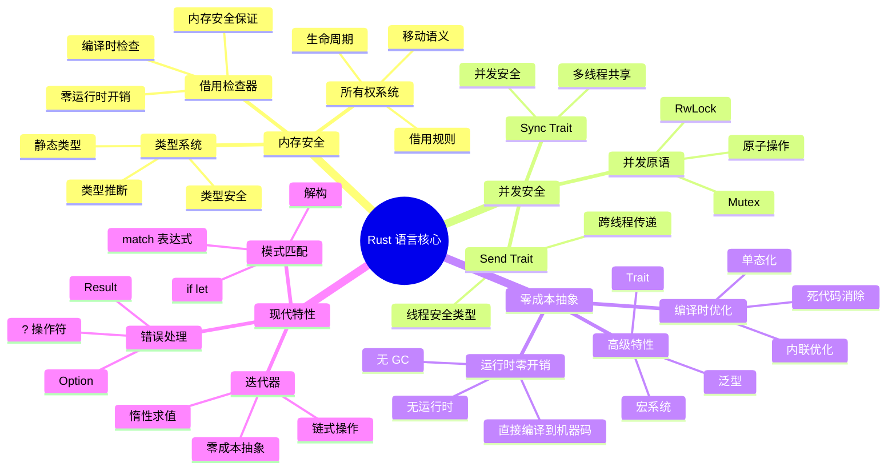

### 2. 所有权系统思维导图

```mermaid
mindmap
  root((所有权系统))
    核心规则
      规则1: 每个值有一个所有者
      规则2: 值在所有者离开作用域时被释放
      规则3: 值只能有一个所有者
    移动语义
      Copy trait
        标量类型
        不可变引用
        函数指针
      Move语义
        堆分配类型
        复合类型
        移动后原变量不可用
      Drop trait
        自定义析构
        资源释放
    所有权转换
      借用 → 所有权
        clone()
        to_owned()
        into()
      所有权 → 借用
        自动解引用
        as_ref()
    应用场景
      资源管理
      内存安全
      RAII模式
    智能指针
      Box<T>
        堆分配
        单一所有权
      Rc<T>
        引用计数
        单线程共享
      Arc<T>
        原子引用计数
        多线程共享
      RefCell<T>
        内部可变性
        运行时借用检查
```

### 3. 借用系统思维导图

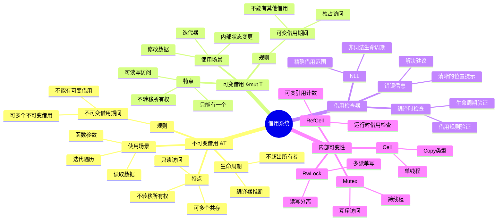

### 4. 生命周期系统思维导图

```mermaid
mindmap
  root((生命周期系统))
    基本概念
      生命周期标注
        语法: 'a
        约束: 'a: 'b
        静态: 'static
      生命周期省略
        三条规则
        输入生命周期
        输出生命周期
      生命周期界限
        T: 'a
        where子句
    高级特性
      高阶生命周期
        for<'a>
        高阶trait界限
      生命周期子类型
        协变
        逆变
        不变
      GAT生命周期
        泛型关联类型
        生命周期参数
    应用场景
      结构体引用
      函数返回值
      Trait对象
      自引用结构
    常见模式
      输入输出同生命周期
        fn foo<'a>(x: &'a T) -> &'a U
      多重生命周期
        fn bar<'a, 'b>(x: &'a T, y: &'b U)
      生命周期界限
        T: 'static
        T: Clone + 'a
```

### 5. 泛型系统思维导图

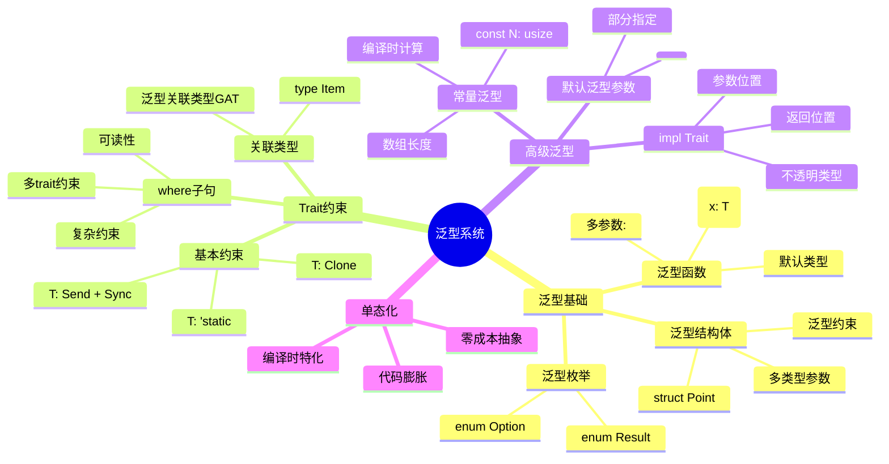

### 6. Trait 系统思维导图

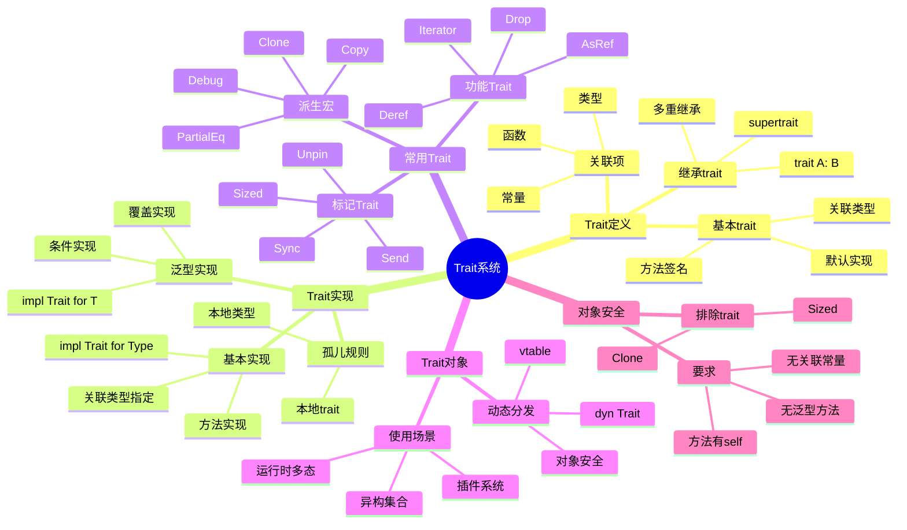

### 7. 并发编程思维导图

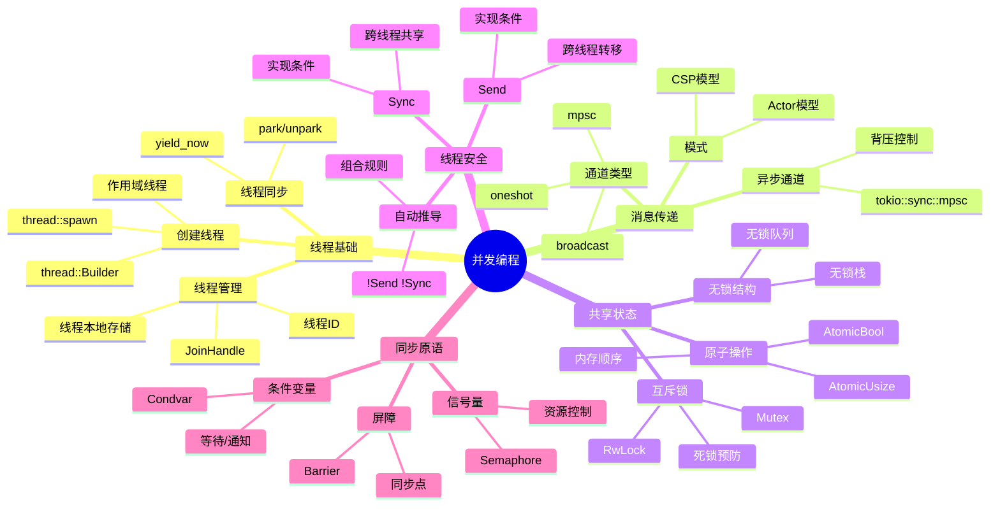

### 8. 异步编程思维导图

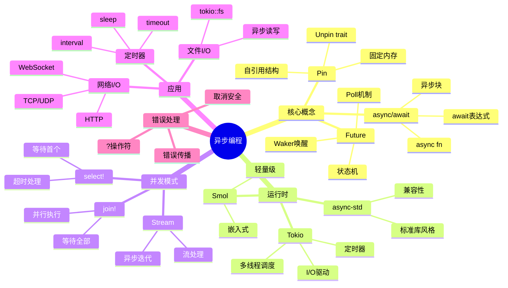

### 9. 系统编程思维导图

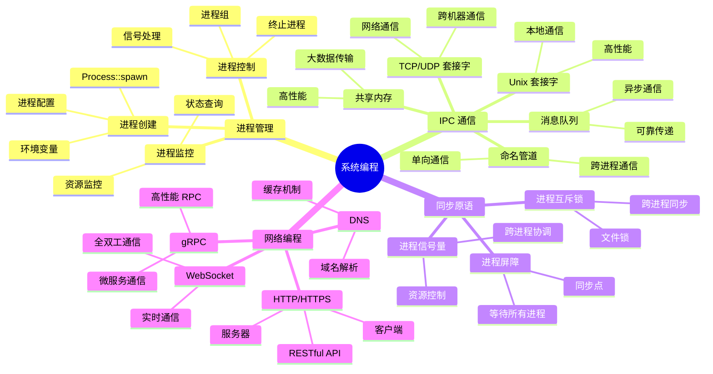

### 10. 形式化与语义思维导图

```mermaid
mindmap
  root((形式化与语义))
    三种语义范式
      操作语义
        小步归约 e → e'
        大步求值 e ⇓ v
        与类型保持性衔接
      指称语义
        类型 = 命题 (Curry-Howard)
        Result = ∨, ! = ⊥
        构造性逻辑
      公理语义
        Hoare 三元组 {P}e{Q}
        unsafe 契约
        分离逻辑 ↔ 所有权
    表达能力边界
      内存
        所有权/借用 ✅
        共享可变 ❌
      类型
        泛型/Trait ✅
        完整依赖类型 ❌
      并发
        Send/Sync ✅
        无同步共享 ❌
      异步
        有限 Future ✅
        无限挂起 ⚠️
      引用
        生命周期/NLL ✅
        无界引用 ❌
    论证结构
      概念定义 → 公理/定义
      属性关系 → 引理/定理
      解释论证 → 推导/引用
      形式化证明 → 证明树/反例
    思维表征选型
      概念关联 → 思维导图
      多维度对比 → 多维矩阵
      证明结构 → 公理-定理证明树
      技术选型 → 决策树
      边界违反 → 反例索引
```

### 11. 理论体系与论证体系结构思维导图

```mermaid
mindmap
  root((理论体系与论证))
    理论体系（四层）
      第 1 层：基础公理层
        所有权规则
        借用规则
        子类型
        型变 Def
        Future Def
        Pin Def
        typing rules
      第 2 层：语义与模型层
        操作语义
        指称语义
        公理语义
        内存模型
      第 3 层：性质定理层
        内存安全 T2,T3
        数据竞争自由 T1
        类型安全 T3
        引用有效性 T2
        型变 T1–T4
        Pin T1–T3
      第 4 层：应用与边界层
        表达能力边界
        安全子集边界
        设计机制论证
    论证体系（五层）
      概念定义
      属性关系
      解释论证
      形式化证明
      思维表征
      一致性问题
        术语
        公理编号
        依赖链
        反例完备性
    安全 vs 非安全
      安全子集
        编译器可验证
        无 UB
      unsafe 边界
        契约 {P} op {Q}
      UB 分类
        内存
        类型
        并发
        FFI
```

### 12. 设计机制论证思维导图

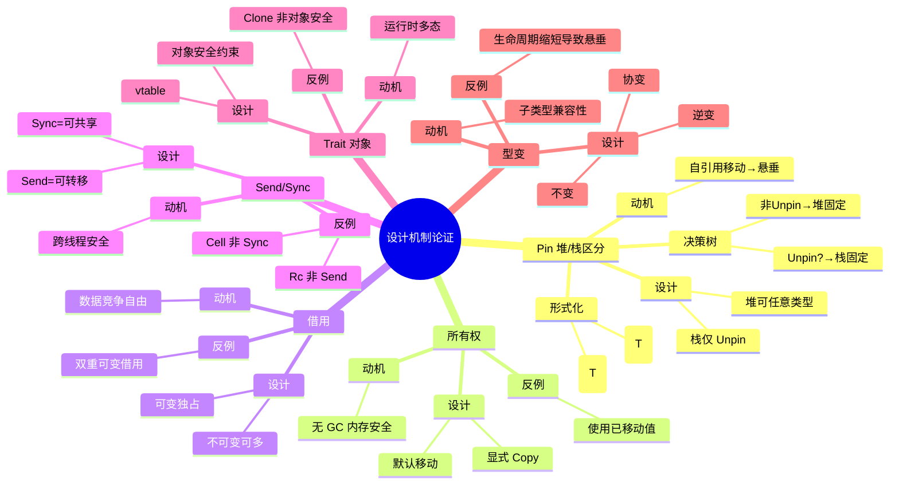

---

## 📊 模块知识思维导图

### 1. C01 所有权与借用思维导图

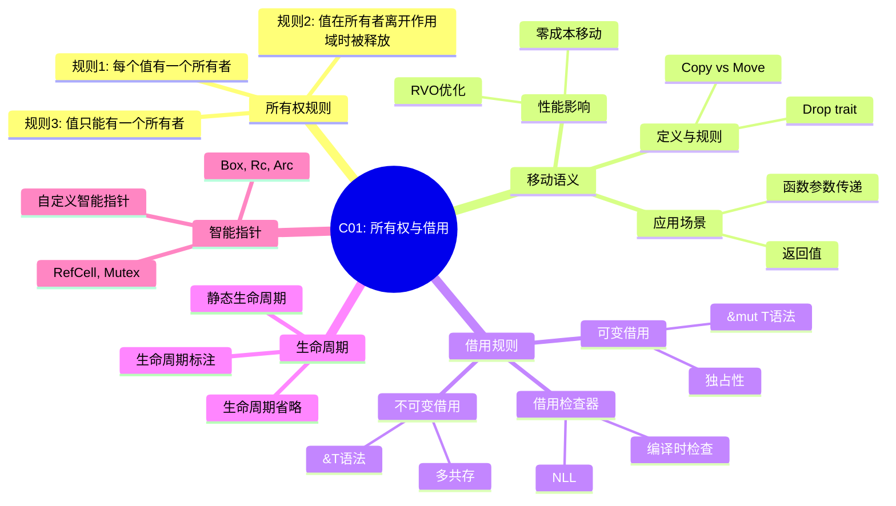

### 2. C02 类型系统思维导图

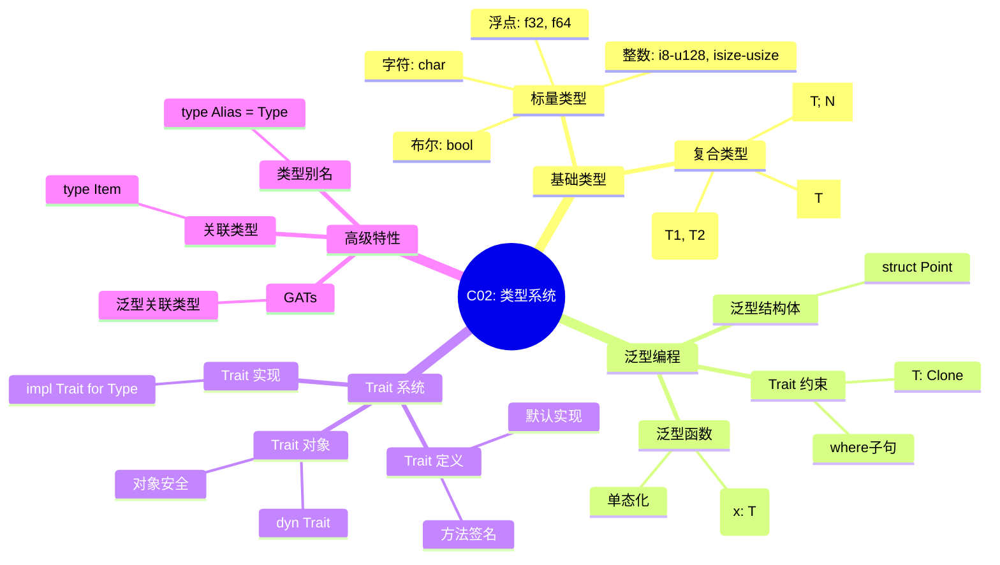

### 3. C05 线程与并发思维导图

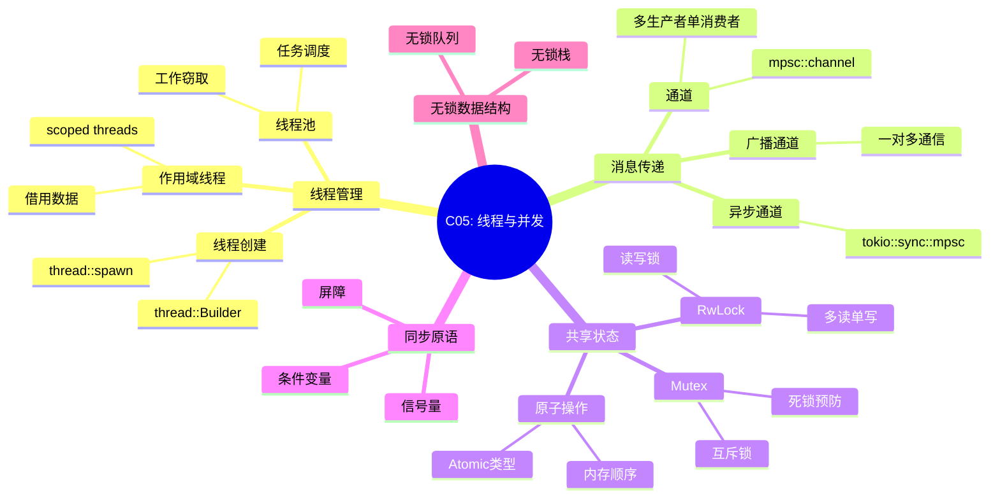

### 4. C06 异步编程思维导图

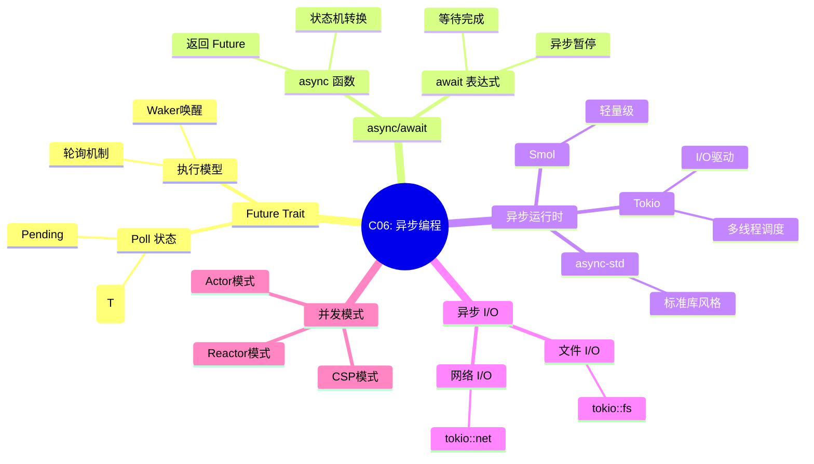

### 5. C07 进程管理思维导图

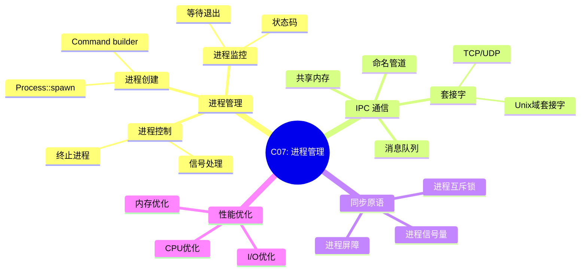

### 6. C08 算法与数据结构思维导图

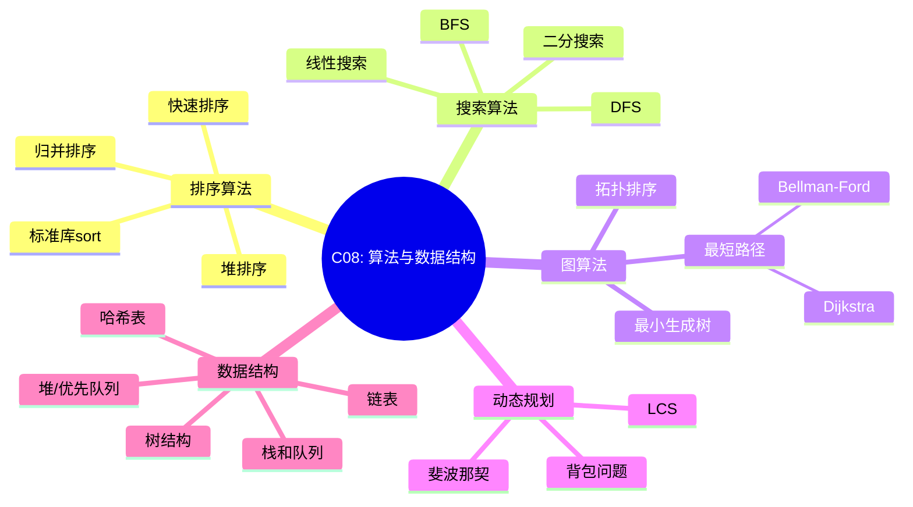

---

## 🔗 知识关联思维导图

```mermaid
mindmap
  root((Rust 知识体系))
    基础层 (C01-C03)
      所有权系统 (C01)
        --[基础]--> 所有其他模块
      类型系统 (C02)
        --[应用]--> 泛型编程 (C04)
      控制流 (C03)
        --[基础]--> 所有编程
    进阶层 (C04-C06)
      泛型编程 (C04)
        --[应用]--> 算法 (C08)
      线程并发 (C05)
        --[扩展]--> 异步编程 (C06)
      异步编程 (C06)
        --[应用]--> 网络编程 (C10)
    应用层 (C07-C10)
      进程管理 (C07)
        --[结合]--> 网络编程 (C10)
      算法数据结构 (C08)
        --[应用]--> 设计模式 (C09)
      设计模式 (C09)
        --[应用]--> 所有模块
      网络编程 (C10)
        --[应用]--> WASM (C12)
    专业层 (C11-C12)
      宏系统 (C11)
        --[应用]--> 所有模块
      WASM (C12)
        --[结合]--> 异步编程 (C06)
```

---

## 📚 相关文档

### 理论基础

- [PROOF_INDEX.md](../research_notes/PROOF_INDEX.md) - 形式化证明索引
- [LANGUAGE_SEMANTICS_EXPRESSIVENESS.md](../research_notes/LANGUAGE_SEMANTICS_EXPRESSIVENESS.md) - 语言语义与表达能力
- [THEORETICAL_AND_ARGUMENTATION_SYSTEM_ARCHITECTURE.md](../research_notes/THEORETICAL_AND_ARGUMENTATION_SYSTEM_ARCHITECTURE.md) - 理论体系架构

### 相关文档

- [THINKING_REPRESENTATION_METHODS.md](./THINKING_REPRESENTATION_METHODS.md) - 思维表征方式
- [DECISION_GRAPH_NETWORK.md](./DECISION_GRAPH_NETWORK.md) - 决策图网
- [PROOF_GRAPH_NETWORK.md](./PROOF_GRAPH_NETWORK.md) - 证明图网
- [MULTI_DIMENSIONAL_CONCEPT_MATRIX.md](./MULTI_DIMENSIONAL_CONCEPT_MATRIX.md) - 多维概念矩阵
- [KNOWLEDGE_STRUCTURE_FRAMEWORK.md](./KNOWLEDGE_STRUCTURE_FRAMEWORK.md) - 知识结构框架

---

**最后更新**: 2026-02-20
**状态**: ✅ 已完成
**思维导图总数**: 18个
**覆盖概念**: 所有权、借用、生命周期、泛型、Trait、并发、异步、系统编程、形式化语义、理论体系
