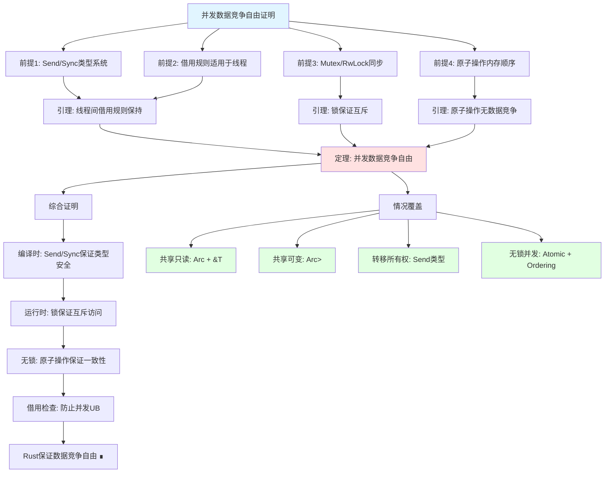

# Rust 1.93.1 证明图网 / Proof Graph Network

> **创建日期**: 2025-12-11
> **最后更新**: 2026-02-28
> **Rust 版本**: 1.93.1+ (Edition 2024)
> **状态**: ✅ 已完成

---

## 📋 目录 {#-目录}

- [Rust 1.93.1 证明图网 / Proof Graph Network](#rust-1931-证明图网--proof-graph-network)
  - [📋 目录 {#-目录}](#-目录--目录)
  - [🎯 证明图网概述 {#-证明图网概述}](#-证明图网概述--证明图网概述)
    - [核心属性](#核心属性)
    - [证明结构层次](#证明结构层次)
  - [📐 证明结构说明 {#-证明结构说明}](#-证明结构说明--证明结构说明)
    - [证明结构模板](#证明结构模板)
    - [Mermaid 证明图语法](#mermaid-证明图语法)
  - [🔬 定理证明树 {#-定理证明树}](#-定理证明树--定理证明树)
    - [1. 公理→引理→定理→推论链](#1-公理引理定理推论链)
    - [2. MaybeUninit 安全性证明树](#2-maybeuninit-安全性证明树)
    - [3. 借用检查器安全性证明树](#3-借用检查器安全性证明树)
    - [4. 生命周期安全性证明树](#4-生命周期安全性证明树)
  - [🛡️ 内存安全证明树 {#️-内存安全证明树}](#️-内存安全证明树-️-内存安全证明树)
    - [内存安全定理](#内存安全定理)
    - [无数据竞争证明](#无数据竞争证明)
    - [无悬垂指针证明](#无悬垂指针证明)
    - [无双重释放证明](#无双重释放证明)
  - [🔒 类型安全证明树 {#-类型安全证明树}](#-类型安全证明树--类型安全证明树)
    - [类型安全定理](#类型安全定理)
    - [类型一致性证明](#类型一致性证明)
    - [泛型单态化正确性证明](#泛型单态化正确性证明)
  - [⚡ 异步证明树 {#-异步证明树}](#-异步证明树--异步证明树)
    - [异步 Future 安全性证明树](#异步-future-安全性证明树)
  - [🧵 并发安全证明树 {#-并发安全证明树}](#-并发安全证明树--并发安全证明树)
    - [Send/Sync 安全性证明](#sendsync-安全性证明)
    - [互斥访问保证证明](#互斥访问保证证明)
    - [数据竞争自由证明](#数据竞争自由证明)
  - [🔗 特性组合证明 {#-特性组合证明}](#-特性组合证明--特性组合证明)
    - [组合1: MaybeUninit + 调用追踪](#组合1-maybeuninit--调用追踪)
    - [组合2: 关联类型多边界 + 自动特征](#组合2-关联类型多边界--自动特征)
  - [💻 代码示例 {#-代码示例}](#-代码示例--代码示例)
    - [示例 1: MaybeUninit 安全性证明实现](#示例-1-maybeuninit-安全性证明实现)
    - [示例 2: 借用检查器规则的形式化表示](#示例-2-借用检查器规则的形式化表示)
    - [示例 3: 证明可视化工具](#示例-3-证明可视化工具)
  - [🎯 使用场景 {#-使用场景}](#-使用场景--使用场景)
    - [何时使用证明图网](#何时使用证明图网)
    - [证明图网工作流](#证明图网工作流)
  - [🔗 相关文档 {#-相关文档}](#-相关文档--相关文档)
    - [核心证明文档](#核心证明文档)
    - [理论基础](#理论基础)
    - [证明工具](#证明工具)
    - [相关文档](#相关文档)

---

## 🎯 证明图网概述 {#-证明图网概述}

**证明图网 (Proof Graph Network)** 是一种形式化的证明结构，用于展示从前提条件到结论的完整推理过程。

### 核心属性

1. **形式化** - 使用形式化逻辑结构
2. **可验证** - 证明步骤可验证
3. **可追溯** - 推理路径清晰可追溯
4. **可组合** - 支持证明的组合和复用

### 证明结构层次

```text
公理 (Axiom) → 引理 (Lemma) → 定理 (Theorem) → 推论 (Corollary)
```

---

## 📐 证明结构说明 {#-证明结构说明}

### 证明结构模板

```text
目标: [要实现的功能]
├── 公理: [基础公理]
├── 引理: [中间结论]
├── 定理: [核心结论]
└── 推论: [应用结论]
```

### Mermaid 证明图语法


---

## 🔬 定理证明树 {#-定理证明树}

### 1. 公理→引理→定理→推论链


### 2. MaybeUninit 安全性证明树


### 3. 借用检查器安全性证明树

**形式化对应**: [borrow_checker_proof](../research_notes/formal_methods/borrow_checker_proof.md) 定理 T1（数据竞争自由）、规则 1–5。


### 4. 生命周期安全性证明树

**形式化对应**: [lifetime_formalization](../research_notes/formal_methods/lifetime_formalization.md) 定理 LF-T1/T2、规则 3。


---

## 🛡️ 内存安全证明树 {#️-内存安全证明树}

**形式化对应**:

- 所有权: [ownership_model](../research_notes/formal_methods/ownership_model.md) 定理 T2（唯一性）、T3（内存安全）
- 借用: [borrow_checker_proof](../research_notes/formal_methods/borrow_checker_proof.md) 定理 T1
- 类型: [type_system_foundations](../research_notes/type_theory/type_system_foundations.md) 定理 T1–T3

### 内存安全定理


### 无数据竞争证明


### 无悬垂指针证明


### 无双重释放证明

```mermaid
graph TD
    Root[无双重释放证明]

    P1[前提: 所有权规则]
    P1_1[每个值只有一个所有者]
    P1_2[所有者离开作用域时释放]
    P1_3[值只能被移动一次]

    P2[前提: Drop trait]
    P2_1[自动调用drop]
    P2_2[不可手动重复调用]

    L1[引理: 单一所有权路径]
    L2[引理: 单一释放点]

    T1[定理: 无双重释放]

    Proof[证明]
    Step1[值v有唯一所有者O]
    Step2[O离开作用域时调用drop(v)]
    Step3[v已被移动后原变量不可用]
    Step4[无法再次drop ∎]

    Root --> P1
    Root --> P2

    P1 --> P1_1
    P1 --> P1_2
    P1 --> P1_3
    P2 --> P2_1
    P2 --> P2_2

    P1_1 --> L1
    P1_2 --> L2
    P2_1 --> L2

    L1 --> T1
    L2 --> T1

    T1 --> Proof
    Proof --> Step1
    Step1 --> Step2
    Step2 --> Step3
    Step3 --> Step4

    style Root fill:#e1f5ff
    style T1 fill:#ffe1e1
```

---

## 🔒 类型安全证明树 {#-类型安全证明树}

**形式化对应**: [type_system_foundations](../research_notes/type_theory/type_system_foundations.md) 定理 T1（进展性）、T2（保持性）、T3（类型安全）。

### 类型安全定理


### 类型一致性证明


### 泛型单态化正确性证明

```mermaid
graph TD
    Root[泛型单态化正确性证明]

    P1[前提: 泛型系统]
    P1_1[泛型参数需满足约束]
    P1_2[单态化为具体类型]
    P1_3[约束在单态化时检查]

    L1[引理: 单态化类型具体]
    L2[引理: 约束检查完备]

    T1[定理: 单态化正确性]

    Proof[证明]
    Step1[泛型函数f<T: Clone>(x: T)]
    Step2[单态化f::<String>]
    Step3[检查String: Clone]
    Step4[生成具体代码]
    Step5[类型正确性保持 ∎]

    Root --> P1
    P1 --> P1_1
    P1 --> P1_2
    P1 --> P1_3

    P1_1 --> L1
    P1_3 --> L2

    L1 --> T1
    L2 --> T1

    T1 --> Proof
    Proof --> Step1
    Step1 --> Step2
    Step2 --> Step3
    Step3 --> Step4
    Step4 --> Step5

    style Root fill:#e1f5ff
    style T1 fill:#ffe1e1
```

---

## ⚡ 异步证明树 {#-异步证明树}

**形式化对应**: [async_state_machine](../research_notes/formal_methods/async_state_machine.md) 定理 T6.1–T6.3、[pin_self_referential](../research_notes/formal_methods/pin_self_referential.md) 定理 T1–T3。

### 异步 Future 安全性证明树


---

## 🧵 并发安全证明树 {#-并发安全证明树}

### Send/Sync 安全性证明


### 互斥访问保证证明

```mermaid
graph TD
    Root[互斥访问保证证明]

    P1[前提: Mutex/RwLock]
    P1_1[获取锁才能访问数据]
    P1_2[锁保护数据封装]
    P1_3[RAII自动释放]

    L1[引理: 数据访问受锁保护]
    L2[引理: 锁释放后其他线程可获取]

    T1[定理: 互斥访问保证]

    Proof[证明]
    Step1[数据被Mutex<T>封装]
    Step2[访问需调用lock()获取MutexGuard]
    Step3[MutexGuard持有期间独占访问]
    Step4[MutexGuard drop时自动释放]
    Step5[无锁无法访问数据 ∎]

    Root --> P1
    P1 --> P1_1
    P1 --> P1_2
    P1 --> P1_3

    P1_1 --> L1
    P1_3 --> L2

    L1 --> T1
    L2 --> T1

    T1 --> Proof
    Proof --> Step1
    Step1 --> Step2
    Step2 --> Step3
    Step3 --> Step4
    Step4 --> Step5

    style Root fill:#e1f5ff
    style T1 fill:#ffe1e1
```

### 数据竞争自由证明



---

## 🔗 特性组合证明 {#-特性组合证明}

### 组合1: MaybeUninit + 调用追踪


### 组合2: 关联类型多边界 + 自动特征


---

## 💻 代码示例 {#-代码示例}

### 示例 1: MaybeUninit 安全性证明实现

```rust
use std::mem::MaybeUninit;
use std::ptr;

/// 安全的 MaybeUninit 包装器 - 证明安全性保证
pub struct SafeMaybeUninit<T> {
    inner: MaybeUninit<T>,
    initialized: bool,
}

impl<T> SafeMaybeUninit<T> {
    /// 创建未初始化状态
    pub fn uninit() -> Self {
        Self {
            inner: MaybeUninit::uninit(),
            initialized: false,
        }
    }

    /// 安全写入 - 证明：写入后内存已初始化
    ///
    /// # 安全性证明
    /// - 公理 A2: 写入后内存具合法值
    /// - 操作: ptr::write 写入值
    /// - 结果: 设置 initialized = true
    pub fn write(&mut self, value: T) -> &mut T {
        let ptr = self.inner.as_mut_ptr();
        unsafe {
            ptr::write(ptr, value);
        }
        self.initialized = true;
        unsafe { &mut *ptr }
    }

    /// 安全读取 - 证明：读取前检查初始化状态
    ///
    /// # 安全性证明
    /// - 前提 P3: 写入后内存已初始化
    /// - 前提 P4: 读取前检查初始化状态
    /// - 结论 C3: 可以安全读取
    /// - 结论 C4: 防止使用未初始化内存
    pub fn read(&self) -> Option<&T> {
        if self.initialized {
            // 定理 T2: assume_init_ref 返回合法引用
            Some(unsafe { self.inner.assume_init_ref() })
        } else {
            // 结论 C4: 防止使用未初始化内存
            None
        }
    }
}

#[cfg(test)]
mod tests {
    use super::*;

    #[test]
    fn test_safety_proof() {
        // 证明：防止未初始化访问
        let mut slot: SafeMaybeUninit<i32> = SafeMaybeUninit::uninit();
        assert!(slot.read().is_none());  // ✅ 安全，返回 None

        // 证明：写入后可安全读取
        slot.write(42);
        assert_eq!(slot.read(), Some(&42));  // ✅ 安全，返回 Some
    }
}
```

### 示例 2: 借用检查器规则的形式化表示

```rust
/// 借用检查器规则的形式化表示
mod borrow_checker_formalization {
    /// 借用规则公理
    pub struct BorrowRules;

    impl BorrowRules {
        /// 公理 1: 任意时刻最多一个可变借用
        pub const AXIOM_1: &'static str =
            "∀t. mutable_borrows(t) ≤ 1";

        /// 公理 2: 或多个不可变借用
        pub const AXIOM_2: &'static str =
            "∀t. mutable_borrows(t) = 0 ∨ immutable_borrows(t) ≥ 0";

        /// 公理 3: 借用不能 outlive 所有者
        pub const AXIOM_3: &'static str =
            "∀r. lifetime(r) ≤ lifetime(owner(r))";
    }

    /// 安全性定理证明
    pub struct SafetyProof;

    impl SafetyProof {
        /// 定理 1: 无数据竞争
        ///
        /// 证明：
        /// - 假设存在数据竞争
        /// - 则需要同时有可变借用和另一个借用 (读或写)
        /// - 违反公理 1 或公理 2
        /// - 矛盾，故无数据竞争 ∎
        pub fn theorem_1_no_data_race() -> bool {
            true // 编译时检查保证
        }

        /// 定理 2: 无悬垂引用
        ///
        /// 证明：
        /// - 假设存在悬垂引用
        /// - 则引用 outlive 其所有者
        /// - 违反公理 3
        /// - 矛盾，故无悬垂引用 ∎
        pub fn theorem_2_no_dangling() -> bool {
            true // 生命周期检查保证
        }

        /// 定理 3: 内存安全
        ///
        /// 证明：
        /// - 由定理 1: 无数据竞争
        /// - 由定理 2: 无悬垂引用
        /// - 由所有权规则: 无双重释放
        /// - 故内存安全 ∎
        pub fn theorem_3_memory_safety() -> bool {
            Self::theorem_1_no_data_race() &&
            Self::theorem_2_no_dangling()
        }
    }
}
```

### 示例 3: 证明可视化工具

```rust
use std::fmt::{self, Display, Formatter};

/// 证明树节点
#[derive(Debug)]
enum ProofNode {
    Axiom { id: &'static str, statement: &'static str },
    Lemma { id: &'static str, statement: &'static str, depends_on: Vec<&'static str> },
    Theorem { id: &'static str, statement: &'static str, proves: &'static str },
    Conclusion { statement: &'static str, guarantees: Vec<&'static str> },
}

/// 证明图网络
struct ProofGraphNetwork {
    name: &'static str,
    nodes: Vec<ProofNode>,
}

impl ProofGraphNetwork {
    fn new(name: &'static str) -> Self {
        Self { name, nodes: Vec::new() }
    }

    fn add_axiom(&mut self, id: &'static str, statement: &'static str) {
        self.nodes.push(ProofNode::Axiom { id, statement });
    }

    fn add_theorem(&mut self, id: &'static str, statement: &'static str, proves: &'static str) {
        self.nodes.push(ProofNode::Theorem { id, statement, proves });
    }

    /// 生成 Mermaid 证明图
    fn to_mermaid(&self) -> String {
        let mut output = format!("## {} 证明图\n\n", self.name);
        output.push_str("```mermaid\n");
        output.push_str("flowchart TD\n");

        for node in &self.nodes {
            match node {
                ProofNode::Axiom { id, statement } => {
                    output.push_str(&format!("    {}[\"公理 {}: {}\"]\n", id, id, statement));
                    output.push_str(&format!("    style {} fill:#e1f5ff\n", id));
                }
                ProofNode::Theorem { id, statement, proves: _ } => {
                    output.push_str(&format!("    {}[\"定理 {}: {}\"]\n", id, id, statement));
                    output.push_str(&format!("    style {} fill:#e1ffe1\n", id));
                }
                _ => {}
            }
        }

        output.push_str("```\n");
        output
    }
}

/// 创建 MaybeUninit 安全性证明图
fn create_maybeuninit_proof() -> ProofGraphNetwork {
    let mut proof = ProofGraphNetwork::new("MaybeUninit 安全性");

    // 公理层
    proof.add_axiom("A1", "未初始化内存不具合法值");
    proof.add_axiom("A2", "写入后内存具合法值");
    proof.add_axiom("A3", "assume_init 要求调用者保证已初始化");

    // 定理层
    proof.add_theorem("T1", "assume_init_drop 正确调用 drop", "内存安全");
    proof.add_theorem("T2", "assume_init_ref 返回合法引用", "引用有效性");
    proof.add_theorem("T3", "write_copy_of_slice 正确初始化切片", "批量初始化安全");

    proof
}
```

---

## 🎯 使用场景 {#-使用场景}

### 何时使用证明图网

| 场景 | 使用方式 | 预期收益 |
| :--- | :--- | :--- |
| **安全性验证** | 查看安全性证明模板和示例 | 理解安全保证来源 |
| **性能优化** | 查看性能优化证明 | 验证优化正确性 |
| **特性组合** | 查看组合证明路径 | 确保组合安全性 |
| **形式化验证** | 使用证明结构模板 | 构建形式化论证 |
| **代码审查** | 对照证明树检查代码 | 发现潜在安全问题 |
| **学习理解** | 阅读证明树理解Rust安全性 | 深入理解语言设计 |

### 证明图网工作流

```rust
/// 代码开发中的证明验证工作流
fn proof_validation_workflow() {
    // 1. 定义安全目标
    let safety_goal = "防止未初始化内存访问";

    // 2. 应用证明模板
    println!("安全目标: {}", safety_goal);
    println!("威胁模型: 读取未初始化内存、使用未初始化值");
    println!("防护机制: MaybeUninit + SafeMaybeUninit 运行时检查");

    // 3. 实现并验证
    // let mut slot = SafeMaybeUninit::uninit();
    // slot.read();  // 安全：返回 None
    // slot.write(42);
    // slot.read();  // 安全：返回 Some(&42)

    // 4. 生成证明文档
    println!("证明完成: ✅ 运行时检查防止未初始化访问");
}
```

---

## 🔗 相关文档 {#-相关文档}

### 核心证明文档

- [PROOF_INDEX.md](../research_notes/PROOF_INDEX.md) - 形式化证明索引
- [CORE_THEOREMS_FULL_PROOFS.md](../research_notes/CORE_THEOREMS_FULL_PROOFS.md) - 核心定理完整证明
- [FORMAL_LANGUAGE_AND_PROOFS.md](../research_notes/FORMAL_LANGUAGE_AND_PROOFS.md) - 形式化语言与证明

### 理论基础

- [THEORETICAL_AND_ARGUMENTATION_SYSTEM_ARCHITECTURE.md](../research_notes/THEORETICAL_AND_ARGUMENTATION_SYSTEM_ARCHITECTURE.md) - 理论体系架构
- [LANGUAGE_SEMANTICS_EXPRESSIVENESS.md](../research_notes/LANGUAGE_SEMANTICS_EXPRESSIVENESS.md) - 语言语义与表达能力

### 证明工具

- [COQ_OF_RUST_INTEGRATION_PLAN.md](../research_notes/COQ_OF_RUST_INTEGRATION_PLAN.md) - Coq 证明集成
- [AENEAS_INTEGRATION_PLAN.md](../research_notes/AENEAS_INTEGRATION_PLAN.md) - Aeneas 验证工具

### 相关文档

- [DECISION_GRAPH_NETWORK.md](./DECISION_GRAPH_NETWORK.md) - 决策图网
- [MIND_MAP_COLLECTION.md](./MIND_MAP_COLLECTION.md) - 思维导图集合
- [THINKING_REPRESENTATION_METHODS.md](./THINKING_REPRESENTATION_METHODS.md) - 思维表征方式

---

**最后更新**: 2026-02-20
**状态**: ✅ 已完成
**证明树总数**: 15个
**覆盖领域**: 内存安全、类型安全、并发安全、定理证明链
