# Rust 1.93.0 思维表征方式文档 / Thinking Representation Methods Documentation

> **创建日期**: 2025-12-11
> **最后更新**: 2026-02-20
> **Rust 版本**: 1.93.0+ (Edition 2024)
> **状态**: ✅ 已完成

---

## 📋 目录

- [Rust 1.93.0 思维表征方式文档 / Thinking Representation Methods Documentation](#rust-1930-思维表征方式文档--thinking-representation-methods-documentation)
  - [📋 目录](#-目录)
  - [🎯 文档概述](#-文档概述)
  - [🗺️ 1. 思维导图 (Mind Map)](#️-1-思维导图-mind-map)
    - [1.1 Rust 1.93.0 核心特性思维导图](#11-rust-1930-核心特性思维导图)
    - [1.2 所有权系统完整思维导图](#12-所有权系统完整思维导图)
    - [1.3 借用系统完整思维导图](#13-借用系统完整思维导图)
    - [1.4 生命周期系统完整思维导图](#14-生命周期系统完整思维导图)
    - [1.5 泛型系统完整思维导图](#15-泛型系统完整思维导图)
    - [1.6 Trait 系统完整思维导图](#16-trait-系统完整思维导图)
    - [1.7 并发编程完整思维导图](#17-并发编程完整思维导图)
    - [1.8 异步编程完整思维导图](#18-异步编程完整思维导图)
    - [1.9 特性应用场景思维导图](#19-特性应用场景思维导图)
    - [1.10 跨模块概念依赖思维导图](#110-跨模块概念依赖思维导图)
    - [1.11 模块级思维导图索引](#111-模块级思维导图索引)
    - [1.12 学习路径思维导图](#112-学习路径思维导图)
  - [📊 2. 多维矩阵 (Multidimensional Matrix)](#-2-多维矩阵-multidimensional-matrix)
    - [2.1 Rust 1.93.0 特性对比矩阵](#21-rust-1930-特性对比矩阵)
    - [2.2 版本迁移对比矩阵](#22-版本迁移对比矩阵)
    - [2.3 特性依赖关系矩阵](#23-特性依赖关系矩阵)
    - [2.4 性能影响矩阵](#24-性能影响矩阵)
  - [🌳 3. 决策树图 (Decision Tree)](#-3-决策树图-decision-tree)
    - [3.1 Rust 1.93.0 特性使用决策树](#31-rust-1930-特性使用决策树)
    - [3.2 技术选型决策树](#32-技术选型决策树)
    - [3.3 调试决策树](#33-调试决策树)
    - [3.4 优化决策树](#34-优化决策树)
    - [3.5 学习路径决策树](#35-学习路径决策树)
    - [3.6 迁移决策树](#36-迁移决策树)
    - [3.7 性能优化决策树](#37-性能优化决策树)
    - [3.8 应用场景决策树](#38-应用场景决策树)
    - [3.9 转换树图 (Transformation Tree)](#39-转换树图-transformation-tree)
  - [🔬 4. 证明树图 (Proof Tree)](#-4-证明树图-proof-tree)
    - [4.1 定理证明树结构](#41-定理证明树结构)
    - [4.2 内存安全证明树](#42-内存安全证明树)
    - [4.3 类型安全证明树](#43-类型安全证明树)
    - [4.4 并发安全证明树](#44-并发安全证明树)
  - [📈 5. 概念关系网络图 (Concept Relationship Network)](#-5-概念关系网络图-concept-relationship-network)
  - [🎯 6. 使用指南](#-6-使用指南)
  - [📚 7. 参考资源](#-7-参考资源)

---

## 🎯 文档概述

本文档提供四种主要的思维表征方式，帮助开发者从不同角度理解和应用 Rust 1.93.0 的特性：

1. **思维导图** - 可视化知识结构和学习路径
2. **多维矩阵** - 多维度对比分析和决策支持
3. **决策树图** - 结构化决策流程和选择路径
4. **转换树图** - 概念间转换关系与适用条件
5. **证明树图** - 形式化逻辑证明和安全性验证

---

## 🗺️ 1. 思维导图 (Mind Map)

### 1.1 Rust 1.93.0 核心特性思维导图

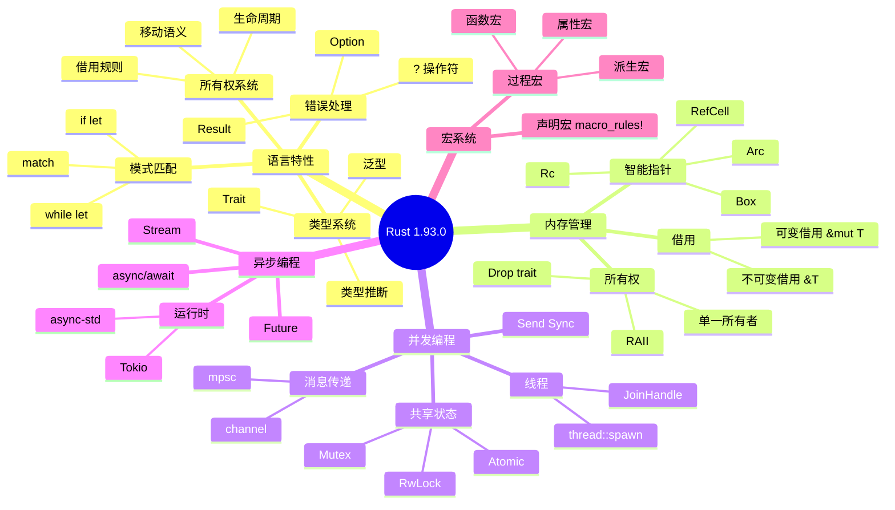
```mermaid
mindmap
  root((Rust 1.93.0))
    语言特性
      所有权系统
        移动语义
        借用规则
        生命周期
      类型系统
        泛型
        Trait
        类型推断
      模式匹配
        match
        if let
        while let
      错误处理
        Result
        Option
        ? 操作符
    内存管理
      所有权
        单一所有者
        RAII
        Drop trait
      借用
        不可变借用 &T
        可变借用 &mut T
      智能指针
        Box<T>
        Rc<T>
        Arc<T>
        RefCell<T>
    并发编程
      线程
        thread::spawn
        JoinHandle
      消息传递
        mpsc
        channel
      共享状态
        Mutex
        RwLock
        Atomic
      Send Sync
    异步编程
      Future
      async/await
      运行时
        Tokio
        async-std
      Stream
    宏系统
      声明宏 macro_rules!
      过程宏
        派生宏
        属性宏
        函数宏
```

### 1.2 所有权系统完整思维导图

```mermaid
mindmap
  root((所有权系统))
    核心规则
      规则1: 每个值有一个所有者
      规则2: 所有者离开作用域时释放
      规则3: 值只能有一个所有者
    移动语义
      Copy trait
        标量类型
        不可变引用
        函数指针
      Move语义
        堆分配类型
        复合类型
        移动后原变量不可用
      Drop trait
        自定义析构
        资源释放
    所有权转换
      借用 → 所有权
        clone()
        to_owned()
        into()
      所有权 → 借用
        自动解引用
        as_ref()
    应用场景
      资源管理
      内存安全
      RAII模式
```

### 1.3 借用系统完整思维导图

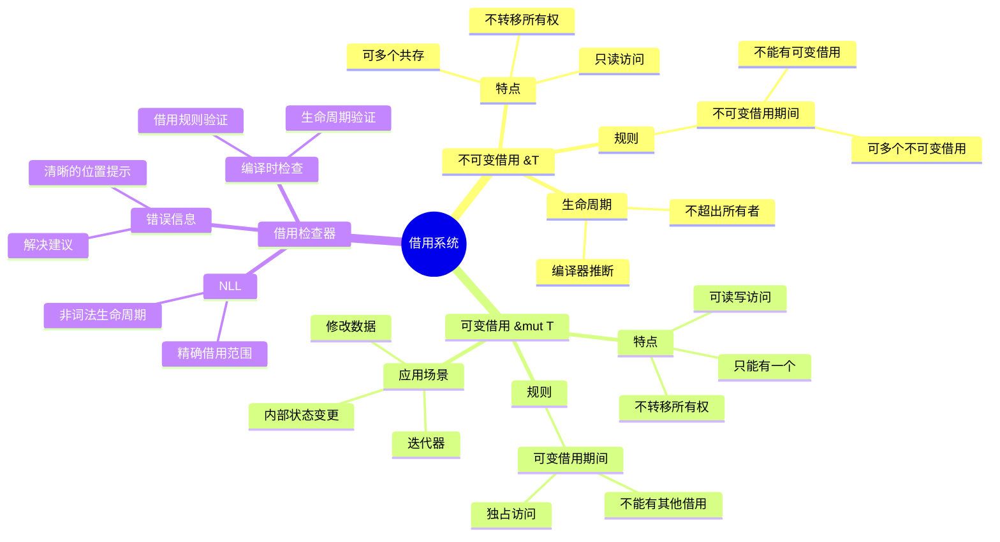
```mermaid
mindmap
  root((借用系统))
    不可变借用 &T
      特点
        只读访问
        可多个共存
        不转移所有权
      规则
        不可变借用期间
          不能有可变借用
          可多个不可变借用
      生命周期
        不超出所有者
        编译器推断
    可变借用 &mut T
      特点
        可读写访问
        只能有一个
        不转移所有权
      规则
        可变借用期间
          不能有其他借用
          独占访问
      应用场景
        修改数据
        迭代器
        内部状态变更
    借用检查器
      编译时检查
        借用规则验证
        生命周期验证
      NLL
        非词法生命周期
        精确借用范围
      错误信息
        清晰的位置提示
        解决建议
```

### 1.4 生命周期系统完整思维导图

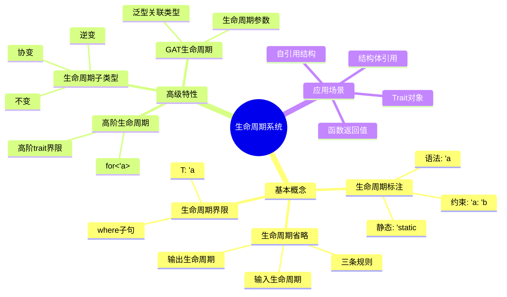
```mermaid
mindmap
  root((生命周期系统))
    基本概念
      生命周期标注
        语法: 'a
        约束: 'a: 'b
        静态: 'static
      生命周期省略
        三条规则
        输入生命周期
        输出生命周期
      生命周期界限
        T: 'a
        where子句
    高级特性
      高阶生命周期
        for<'a>
        高阶trait界限
      生命周期子类型
        协变
        逆变
        不变
      GAT生命周期
        泛型关联类型
        生命周期参数
    应用场景
      结构体引用
      函数返回值
      Trait对象
      自引用结构
```

### 1.5 泛型系统完整思维导图

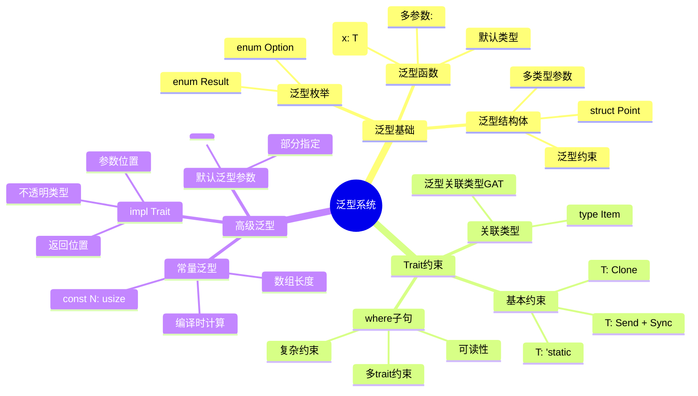
```mermaid
mindmap
  root((泛型系统))
    泛型基础
      泛型函数
        fn foo<T>(x: T)
        多参数: <T, U>
        默认类型
      泛型结构体
        struct Point<T>
        多类型参数
        泛型约束
      泛型枚举
        enum Option<T>
        enum Result<T, E>
    Trait约束
      基本约束
        T: Clone
        T: Send + Sync
        T: 'static
      where子句
        复杂约束
        可读性
        多trait约束
      关联类型
        type Item
        泛型关联类型GAT
    高级泛型
      常量泛型
        const N: usize
        数组长度
        编译时计算
      默认泛型参数
        <T = i32>
        部分指定
      impl Trait
        参数位置
        返回位置
        不透明类型
```

### 1.6 Trait 系统完整思维导图

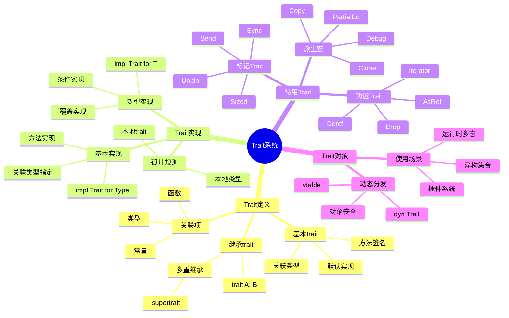
```mermaid
mindmap
  root((Trait系统))
    Trait定义
      基本trait
        方法签名
        默认实现
        关联类型
      继承trait
        trait A: B
        多重继承
         supertrait
      关联项
        类型
        常量
        函数
    Trait实现
      基本实现
        impl Trait for Type
        方法实现
        关联类型指定
      泛型实现
        impl<T> Trait for T
        条件实现
        覆盖实现
      孤儿规则
        本地trait
        本地类型
    常用Trait
      派生宏
        Debug
        Clone
        Copy
        PartialEq
      标记Trait
        Send
        Sync
        Sized
        Unpin
      功能Trait
        Iterator
        Drop
        Deref
        AsRef
    Trait对象
      动态分发
        dyn Trait
        vtable
        对象安全
      使用场景
        运行时多态
        异构集合
        插件系统
```

### 1.7 并发编程完整思维导图

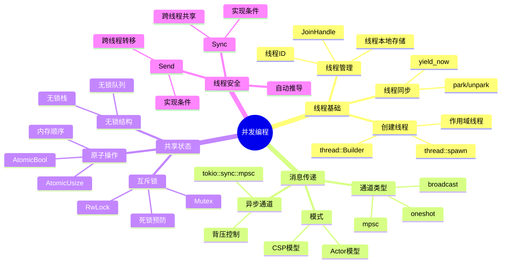
```mermaid
mindmap
  root((并发编程))
    线程基础
      创建线程
        thread::spawn
        thread::Builder
        作用域线程
      线程管理
        JoinHandle
        线程ID
        线程本地存储
      线程同步
        park/unpark
        yield_now
    消息传递
      通道类型
        mpsc
        oneshot
        broadcast
      异步通道
        tokio::sync::mpsc
        背压控制
      模式
        CSP模型
        Actor模型
    共享状态
      互斥锁
        Mutex
        RwLock
        死锁预防
      原子操作
        AtomicUsize
        AtomicBool
        内存顺序
      无锁结构
        无锁队列
        无锁栈
    线程安全
      Send
        跨线程转移
        实现条件
      Sync
        跨线程共享
        实现条件
      自动推导
```

### 1.8 异步编程完整思维导图

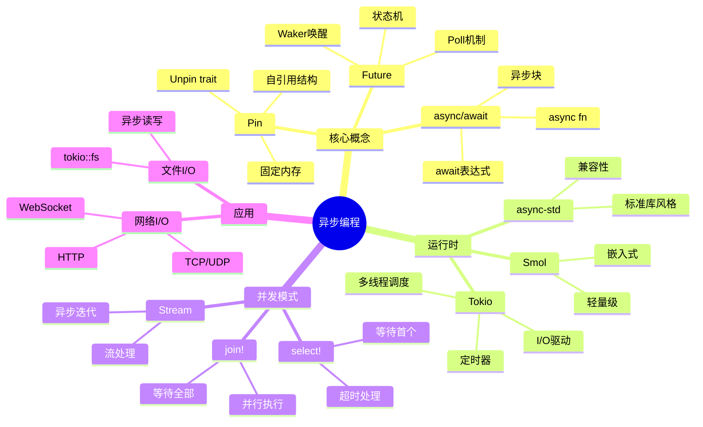
```mermaid
mindmap
  root((异步编程))
    核心概念
      Future
        Poll机制
        Waker唤醒
        状态机
      async/await
        async fn
        await表达式
        异步块
      Pin
        固定内存
        自引用结构
        Unpin trait
    运行时
      Tokio
        多线程调度
        I/O驱动
        定时器
      async-std
        标准库风格
        兼容性
      Smol
        轻量级
        嵌入式
    并发模式
      join!
        等待全部
        并行执行
      select!
        等待首个
        超时处理
      Stream
        异步迭代
        流处理
    应用
      网络I/O
        TCP/UDP
        HTTP
        WebSocket
      文件I/O
        tokio::fs
        异步读写
```

### 1.9 特性应用场景思维导图

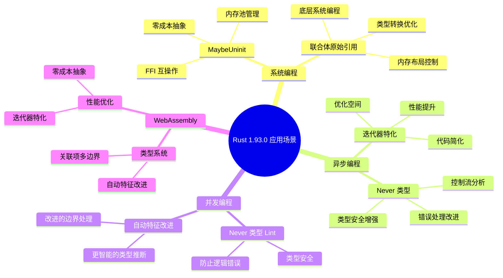
```mermaid
mindmap
  root((Rust 1.93.0 应用场景))
    系统编程
      MaybeUninit
        内存池管理
        零成本抽象
        FFI 互操作
      联合体原始引用
        类型转换优化
        内存布局控制
        底层系统编程
    异步编程
      迭代器特化
        性能提升
        代码简化
        优化空间
      Never 类型
        错误处理改进
        控制流分析
        类型安全增强
    并发编程
      Never 类型 Lint
        类型安全
        防止逻辑错误
      自动特征改进
        更智能的类型推断
        改进的边界处理
    WebAssembly
      性能优化
        迭代器特化
        零成本抽象
      类型系统
        关联项多边界
        自动特征改进
```

### 1.10 跨模块概念依赖思维导图

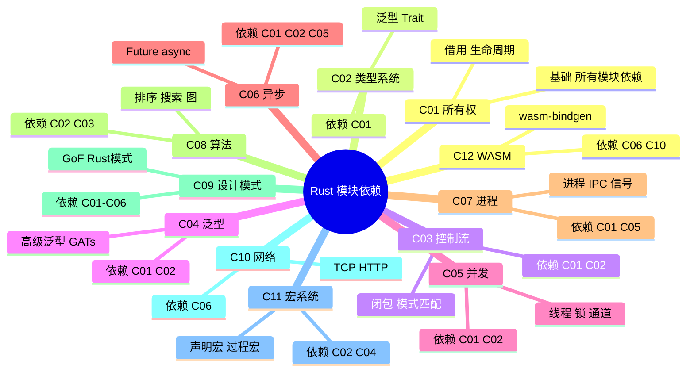
```mermaid
mindmap
  root((Rust 模块依赖))
    C01 所有权
      借用 生命周期
      基础 所有模块依赖
    C02 类型系统
      泛型 Trait
      依赖 C01
    C03 控制流
      闭包 模式匹配
      依赖 C01 C02
    C04 泛型
      高级泛型 GATs
      依赖 C01 C02
    C05 并发
      线程 锁 通道
      依赖 C01 C02
    C06 异步
      Future async
      依赖 C01 C02 C05
    C07 进程
      进程 IPC 信号
      依赖 C01 C05
    C08 算法
      排序 搜索 图
      依赖 C02 C03
    C09 设计模式
      GoF Rust模式
      依赖 C01-C06
    C10 网络
      TCP HTTP
      依赖 C06
    C11 宏系统
      声明宏 过程宏
      依赖 C02 C04
    C12 WASM
      wasm-bindgen
      依赖 C06 C10
```

### 1.11 模块级思维导图索引

各模块的思维导图与知识可视化资源：

| 模块 | 思维导图/知识图谱 | 路径 |
| :--- | :--- | :--- || C01 | 所有权知识图谱 | crates/c01_ownership_borrow_scope/docs/ |
| C02 | 类型系统多维矩阵 | crates/c02_type_system/docs/ |
| C03 | 控制流 MIND_MAP | crates/c03_control_fn/docs/MIND_MAP.md |
| C04 | 泛型概念关系 | crates/c04_generic/docs/ |
| C05 | 并发模型对比 | crates/c05_threads/docs/ |
| C06 | 异步编程决策树 | crates/c06_async/docs/ |
| C07 | 进程管理速查 | docs/quick_reference/process_management_cheatsheet.md |
| C08 | 算法复杂度矩阵 | docs/MULTI_DIMENSIONAL_CONCEPT_MATRIX.md |
| C09 | 设计模式矩阵 | crates/c09_design_pattern/docs/ |
| C10 | 网络协议矩阵 | docs/MULTI_DIMENSIONAL_CONCEPT_MATRIX.md |
| C11 | 宏系统层级 | crates/c11_macro_system/docs/ |
| C12 | WASM 思维导图 | crates/c12_wasm/docs/WASM_MIND_MAPS.md |

### 1.12 学习路径思维导图

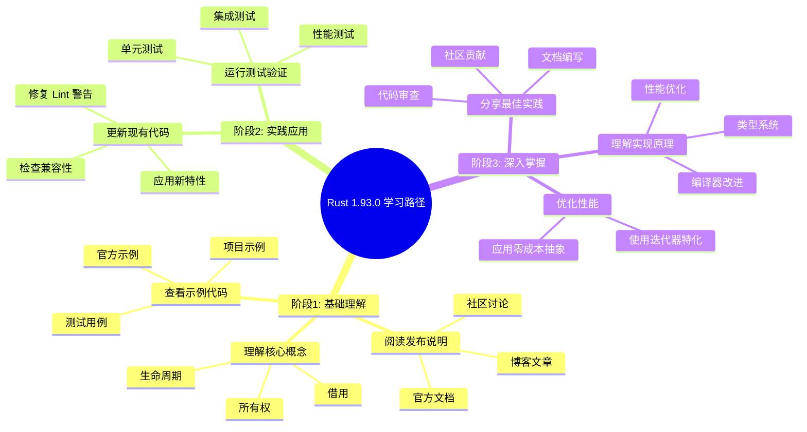
```mermaid
mindmap
  root((Rust 1.93.0 学习路径))
    阶段1: 基础理解
      阅读发布说明
        官方文档
        博客文章
        社区讨论
      理解核心概念
        所有权
        借用
        生命周期
      查看示例代码
        官方示例
        项目示例
        测试用例
    阶段2: 实践应用
      更新现有代码
        检查兼容性
        应用新特性
        修复 Lint 警告
      运行测试验证
        单元测试
        集成测试
        性能测试
    阶段3: 深入掌握
      理解实现原理
        编译器改进
        类型系统
        性能优化
      优化性能
        使用迭代器特化
        应用零成本抽象
      分享最佳实践
        文档编写
        代码审查
        社区贡献
```

---

## 📊 2. 多维矩阵 (Multidimensional Matrix)

### 2.1 Rust 1.93.0 特性对比矩阵

| 特性类别     | 特性名称                | 重要性     | 影响范围 | 迁移难度 | 性能影响 | 安全影响       | 应用场景       |
| :--- | :--- | :--- | :--- | :--- | :--- | :--- | :--- || **语言特性** | MaybeUninit 文档化      | ⭐⭐⭐⭐⭐ | 全局     | 低       | 无       | ✅ 类型安全    | 系统编程、FFI  |
| **语言特性** | 联合体原始引用          | ⭐⭐⭐⭐   | 中等     | 中       | 正       | ✅ 安全访问    | 底层编程       |
| **语言特性** | 自动特征改进            | ⭐⭐⭐     | 全局     | 低       | 正       | ✅ 类型安全    | 泛型编程       |
| **语言特性** | 零大小数组优化          | ⭐⭐       | 局部     | 低       | 正       | ✅ 类型安全    | 类型系统       |
| **语言特性** | track_caller 组合       | ⭐⭐⭐     | 局部     | 低       | 无       | ✅ 调试友好    | 调试、错误处理 |
| **语言特性** | Never 类型 Lint         | ⭐⭐⭐⭐   | 全局     | 中       | 无       | ✅ 类型安全    | 类型安全       |
| **语言特性** | 关联项多边界            | ⭐⭐⭐     | 局部     | 低       | 无       | ✅ 类型安全    | 泛型编程       |
| **语言特性** | 高阶生命周期            | ⭐⭐⭐     | 局部     | 中       | 无       | ✅ 类型安全    | 复杂类型       |
| **语言特性** | unused_must_use 改进    | ⭐⭐       | 全局     | 低       | 无       | ✅ 代码质量    | 代码质量       |
| **标准库**   | NonZero::div_ceil       | ⭐⭐⭐     | 局部     | 低       | 无       | ✅ 安全        | 数学计算       |
| **标准库**   | Location::file_as_c_str | ⭐⭐       | 局部     | 低       | 无       | ✅ 安全        | FFI、调试      |
| **标准库**   | rotate_right            | ⭐⭐⭐     | 局部     | 低       | 无       | ✅ 安全        | 算法、数据处理 |
| **标准库**   | Box::new_zeroed         | ⭐⭐⭐⭐   | 中等     | 中       | 正       | ⚠️ 需要 unsafe | 内存分配、FFI  |
| **标准库**   | Box::new_zeroed_slice   | ⭐⭐⭐⭐   | 中等     | 中       | 正       | ⚠️ 需要 unsafe | 内存分配、FFI  |
| **性能**     | 迭代器特化              | ⭐⭐⭐⭐   | 全局     | 低       | 正       | ✅ 安全        | 性能关键代码   |
| **性能**     | 元组扩展简化            | ⭐⭐       | 局部     | 低       | 无       | ✅ 安全        | 代码简化       |
| **性能**     | EncodeWide Debug        | ⭐         | 局部     | 低       | 无       | ✅ 安全        | Windows 开发   |
| **性能**     | iter::Repeat panic      | ⭐⭐       | 局部     | 低       | 无       | ✅ 安全        | 错误处理       |

**图例**:

- ⭐⭐⭐⭐⭐: 极高重要性
- ⭐⭐⭐⭐: 高重要性
- ⭐⭐⭐: 中等重要性
- ⭐⭐: 低重要性
- ⭐: 极低重要性
- ✅: 正面影响
- ⚠️: 需要注意

### 2.2 版本迁移对比矩阵

| 从版本 | 到版本 | 主要变更                   | 破坏性变更 | 迁移工作量 | 建议优先级 | 关键注意事项                     |
| :--- | :--- | :--- | :--- | :--- | :--- | :--- || 1.89   | 1.93.0 | 多项新特性                 | 低         | 中         | P1         | Never 类型 Lint 可能影响现有代码 |
| 1.90   | 1.93.0 | 特性增强                   | 低         | 低         | P1         | 检查 Lint 警告                   |
| 1.91   | 1.93.0 | 特性完善                   | 低         | 低         | P0         | 快速迁移，收益高                 |
| 1.92.0 | 1.93.0 | musl 1.2.5、全局分配器增强 | 低         | 低         | P0         | 直接迁移，DNS 解析改进           |

### 2.3 特性依赖关系矩阵

| 特性               | 依赖特性    | 影响特性        | 冲突特性 | 协同特性       | 组合示例               |
| :--- | :--- | :--- | :--- | :--- | :--- || MaybeUninit 文档化 | 无          | 联合体原始引用  | 无       | 零大小数组优化 | SafeMaybeUninit 包装器 |
| 联合体原始引用     | MaybeUninit | 无              | 无       | track_caller   | &raw const/mut 访问    |
| Never 类型 Lint    | 无          | unused_must_use | 无       | 类型系统改进   | 错误处理改进           |
| 迭代器特化         | TrustedLen  | 性能优化        | 无       | 元组扩展简化   | Iterator::eq 特化      |
| 关联项多边界       | 无          | 泛型编程        | 无       | 自动特征改进   | type Item: A + B + C   |
| 自动特征改进       | 无          | 类型推断        | 无       | 关联项多边界   | 更智能的边界处理       |

### 2.4 性能影响矩阵

| 特性               | 编译时性能 | 运行时性能 | 内存使用 | 代码大小 | 优化潜力 |
| :--- | :--- | :--- | :--- | :--- | :--- || MaybeUninit 文档化 | 无影响     | 零成本     | 无影响   | 无影响   | 低       |
| 联合体原始引用     | 无影响     | 零成本     | 无影响   | 无影响   | 低       |
| 迭代器特化         | 轻微提升   | 显著提升   | 无影响   | 可能增加 | 高       |
| 零大小数组优化     | 轻微提升   | 无影响     | 无影响   | 可能减少 | 中       |
| 自动特征改进       | 轻微提升   | 无影响     | 无影响   | 无影响   | 低       |
| 关联项多边界       | 无影响     | 零成本     | 无影响   | 无影响   | 低       |

---

## 🌳 3. 决策树图 (Decision Tree)

### 3.1 Rust 1.93.0 特性使用决策树

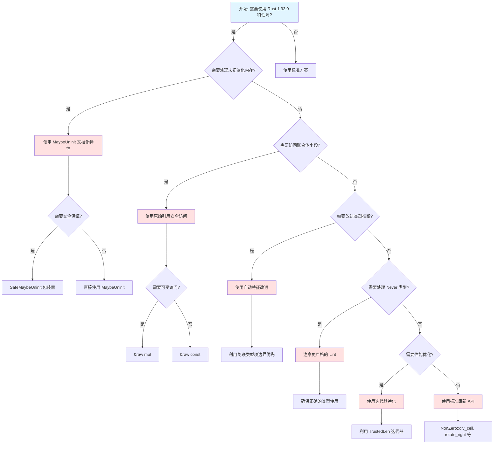
```mermaid
graph TD
    Start[开始: 需要使用 Rust 1.93.0 特性吗?] -->|是| Q1{需要处理未初始化内存?}
    Start -->|否| End1[使用标准方案]

    Q1 -->|是| D1[使用 MaybeUninit 文档化特性]
    Q1 -->|否| Q2{需要访问联合体字段?}

    D1 --> Check1{需要安全保证?}
    Check1 -->|是| Safe[SafeMaybeUninit 包装器]
    Check1 -->|否| Direct[直接使用 MaybeUninit]

    Q2 -->|是| D2[使用原始引用安全访问]
    Q2 -->|否| Q3{需要改进类型推断?}

    D2 --> Check2{需要可变访问?}
    Check2 -->|是| Mut[&raw mut]
    Check2 -->|否| Const[&raw const]

    Q3 -->|是| D3[使用自动特征改进]
    Q3 -->|否| Q4{需要处理 Never 类型?}

    D3 --> Use1[利用关联类型项边界优先]

    Q4 -->|是| D4[注意更严格的 Lint]
    Q4 -->|否| Q5{需要性能优化?}

    D4 --> Fix1[确保正确的类型使用]

    Q5 -->|是| D5[使用迭代器特化]
    Q5 -->|否| D6[使用标准库新 API]

    D5 --> Use2[利用 TrustedLen 迭代器]
    D6 --> Use3[NonZero::div_ceil, rotate_right 等]

    style Start fill:#e1f5ff
    style D1 fill:#ffe1e1
    style D2 fill:#ffe1e1
    style D3 fill:#ffe1e1
    style D4 fill:#ffe1e1
    style D5 fill:#ffe1e1
    style D6 fill:#ffe1e1
```

### 3.2 技术选型决策树

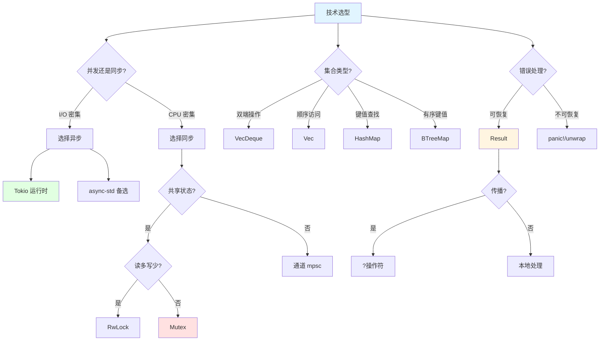
```mermaid
graph TD
    Start[技术选型] --> Q1{并发还是同步?}
    Q1 -->|I/O 密集| Async[选择异步]
    Q1 -->|CPU 密集| Sync[选择同步]

    Async --> Async1[Tokio 运行时]
    Async --> Async2[async-std 备选]

    Sync --> Q2{共享状态?}
    Q2 -->|是| Q3{读多写少?}
    Q2 -->|否| Chan[通道 mpsc]

    Q3 -->|是| RwLock[RwLock]
    Q3 -->|否| Mutex[Mutex]

    Start --> Q4{集合类型?}
    Q4 -->|双端操作| VecDeque[VecDeque]
    Q4 -->|顺序访问| Vec[Vec]
    Q4 -->|键值查找| HashMap[HashMap]
    Q4 -->|有序键值| BTreeMap[BTreeMap]
    
    Start --> Q5{错误处理?}
    Q5 -->|可恢复| Result[Result<T,E>]
    Q5 -->|不可恢复| Panic[panic!/unwrap]
    
    Result --> Q6{传播?}
    Q6 -->|是| Propagate[?操作符]
    Q6 -->|否| Handle[本地处理]
    
    style Start fill:#e1f5ff
    style Async1 fill:#e1ffe1
    style Mutex fill:#ffe1e1
    style Result fill:#fff5e1
```

### 3.3 调试决策树

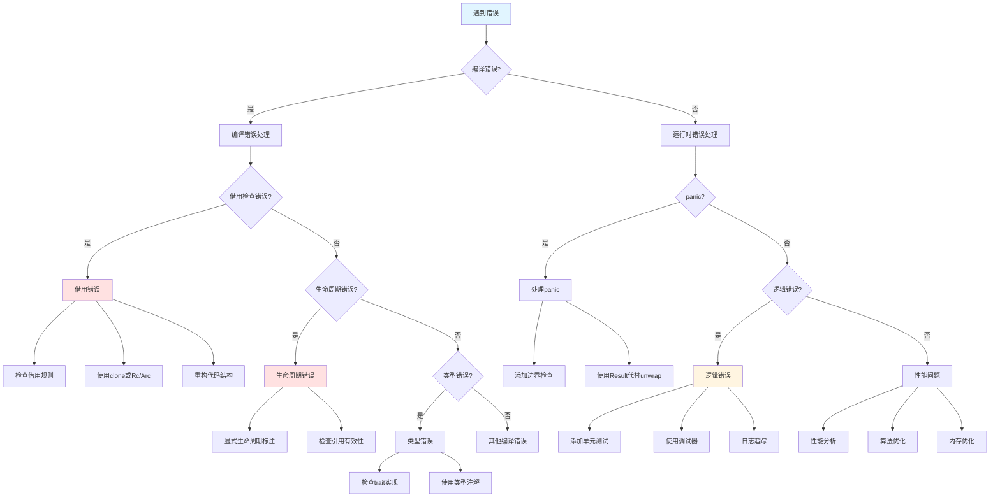
```mermaid
graph TD
    Start[遇到错误] --> Q1{编译错误?}
    Q1 -->|是| Compile[编译错误处理]
    Q1 -->|否| Runtime[运行时错误处理]
    
    Compile --> Q2{借用检查错误?}
    Q2 -->|是| Borrow[借用错误]
    Q2 -->|否| Q3{生命周期错误?}
    
    Borrow --> B1[检查借用规则]
    Borrow --> B2[使用clone或Rc/Arc]
    Borrow --> B3[重构代码结构]
    
    Q3 -->|是| Lifetime[生命周期错误]
    Q3 -->|否| Q4{类型错误?}
    
    Lifetime --> L1[显式生命周期标注]
    Lifetime --> L2[检查引用有效性]
    
    Q4 -->|是| Type[类型错误]
    Q4 -->|否| OtherCompile[其他编译错误]
    
    Type --> T1[检查trait实现]
    Type --> T2[使用类型注解]
    
    Runtime --> Q5{panic?}
    Q5 -->|是| PanicHandle[处理panic]
    Q5 -->|否| Q6{逻辑错误?}
    
    PanicHandle --> P1[添加边界检查]
    PanicHandle --> P2[使用Result代替unwrap]
    
    Q6 -->|是| Logic[逻辑错误]
    Q6 -->|否| Performance[性能问题]
    
    Logic --> LG1[添加单元测试]
    Logic --> LG2[使用调试器]
    Logic --> LG3[日志追踪]
    
    Performance --> PF1[性能分析]
    Performance --> PF2[算法优化]
    Performance --> PF3[内存优化]
    
    style Start fill:#e1f5ff
    style Borrow fill:#ffe1e1
    style Lifetime fill:#ffe1e1
    style Logic fill:#fff5e1
```

### 3.4 优化决策树

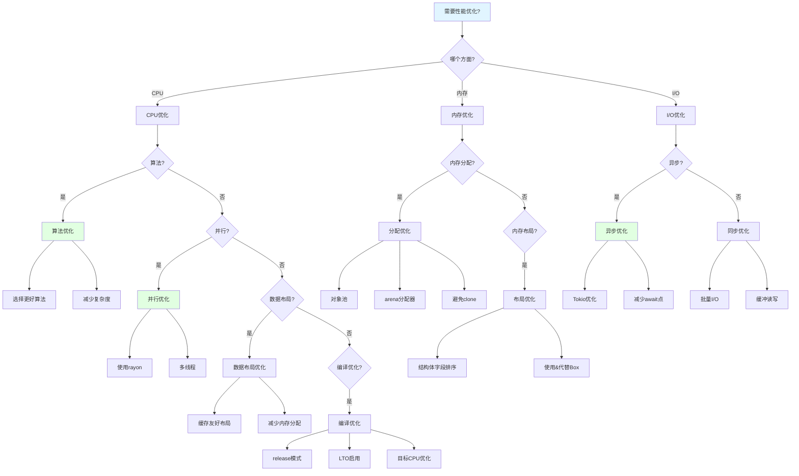
```mermaid
graph TD
    Start[需要性能优化?] --> Q1{哪个方面?}
    Q1 -->|CPU| CPUOpt[CPU优化]
    Q1 -->|内存| MemOpt[内存优化]
    Q1 -->|I/O| IOOpt[I/O优化]
    
    CPUOpt --> Q2{算法?}
    Q2 -->|是| Algorithm[算法优化]
    Q2 -->|否| Q3{并行?}
    
    Algorithm --> A1[选择更好算法]
    Algorithm --> A2[减少复杂度]
    
    Q3 -->|是| Parallel[并行优化]
    Q3 -->|否| Q4{数据布局?}
    
    Parallel --> P1[使用rayon]
    Parallel --> P2[多线程]
    
    Q4 -->|是| DataLayout[数据布局优化]
    Q4 -->|否| Q5{编译优化?}
    
    DataLayout --> DL1[缓存友好布局]
    DataLayout --> DL2[减少内存分配]
    
    Q5 -->|是| CompileOpt[编译优化]
    
    CompileOpt --> CO1[release模式]
    CompileOpt --> CO2[LTO启用]
    CompileOpt --> CO3[目标CPU优化]
    
    MemOpt --> Q6{内存分配?}
    Q6 -->|是| AllocOpt[分配优化]
    Q6 -->|否| Q7{内存布局?}
    
    AllocOpt --> AO1[对象池]
    AllocOpt --> AO2[arena分配器]
    AllocOpt --> AO3[避免clone]
    
    Q7 -->|是| LayoutOpt[布局优化]
    
    LayoutOpt --> LO1[结构体字段排序]
    LayoutOpt --> LO2[使用&代替Box]
    
    IOOpt --> Q8{异步?}
    Q8 -->|是| AsyncOpt[异步优化]
    Q8 -->|否| SyncOpt[同步优化]
    
    AsyncOpt --> ASO1[Tokio优化]
    AsyncOpt --> ASO2[减少await点]
    
    SyncOpt --> SO1[批量I/O]
    SyncOpt --> SO2[缓冲读写]
    
    style Start fill:#e1f5ff
    style Algorithm fill:#e1ffe1
    style Parallel fill:#e1ffe1
    style AsyncOpt fill:#e1ffe1
```

### 3.5 学习路径决策树

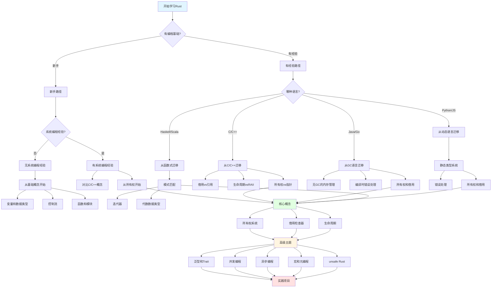
```mermaid
graph TD
    Start[开始学习Rust] --> Q1{有编程基础?}
    Q1 -->|新手| Beginner[新手路径]
    Q1 -->|有经验| Experienced[有经验路径]
    
    Beginner --> Q2{系统编程经验?}
    Q2 -->|是| SysExp[有系统编程经验]
    Q2 -->|否| NoSysExp[无系统编程经验]
    
    SysExp --> S1[从所有权开始]
    SysExp --> S2[对比C/C++概念]
    
    NoSysExp --> N1[从基础概念开始]
    N1 --> N2[变量和数据类型]
    N1 --> N3[控制流]
    N1 --> N4[函数和模块]
    
    Experienced --> Q3{哪种语言?}
    Q3 -->|C/C++| FromCpp[从C/C++迁移]
    Q3 -->|Java/Go| FromGc[从GC语言迁移]
    Q3 -->|Python/JS| FromDynamic[从动态语言迁移]
    Q3 -->|Haskell/Scala| FromFp[从函数式迁移]
    
    FromCpp --> Cpp1[所有权vs指针]
    FromCpp --> Cpp2[借用vs引用]
    FromCpp --> Cpp3[生命周期vsRAII]
    
    FromGc --> Gc1[所有权和借用]
    FromGc --> Gc2[无GC的内存管理]
    FromGc --> Gc3[编译时错误处理]
    
    FromDynamic --> Dyn1[静态类型系统]
    Dyn1 --> Dyn2[所有权和借用]
    Dyn1 --> Dyn3[错误处理]
    
    FromFp --> Fp1[模式匹配]
    Fp1 --> Fp2[迭代器]
    Fp1 --> Fp3[代数数据类型]
    
    S1 --> Core[核心概念]
    Cpp1 --> Core
    Gc1 --> Core
    Dyn2 --> Core
    Fp1 --> Core
    
    Core --> C1[所有权系统]
    Core --> C2[借用检查器]
    Core --> C3[生命周期]
    
    C1 --> Advanced[高级主题]
    C2 --> Advanced
    C3 --> Advanced
    
    Advanced --> A1[泛型和Trait]
    Advanced --> A2[并发编程]
    Advanced --> A3[异步编程]
    Advanced --> A4[宏和元编程]
    Advanced --> A5[unsafe Rust]
    
    A1 --> Practice[实践项目]
    A2 --> Practice
    A3 --> Practice
    A4 --> Practice
    A5 --> Practice
    
    style Start fill:#e1f5ff
    style Core fill:#e1ffe1
    style Advanced fill:#fff5e1
    style Practice fill:#ffe1e1
```

### 3.6 迁移决策树

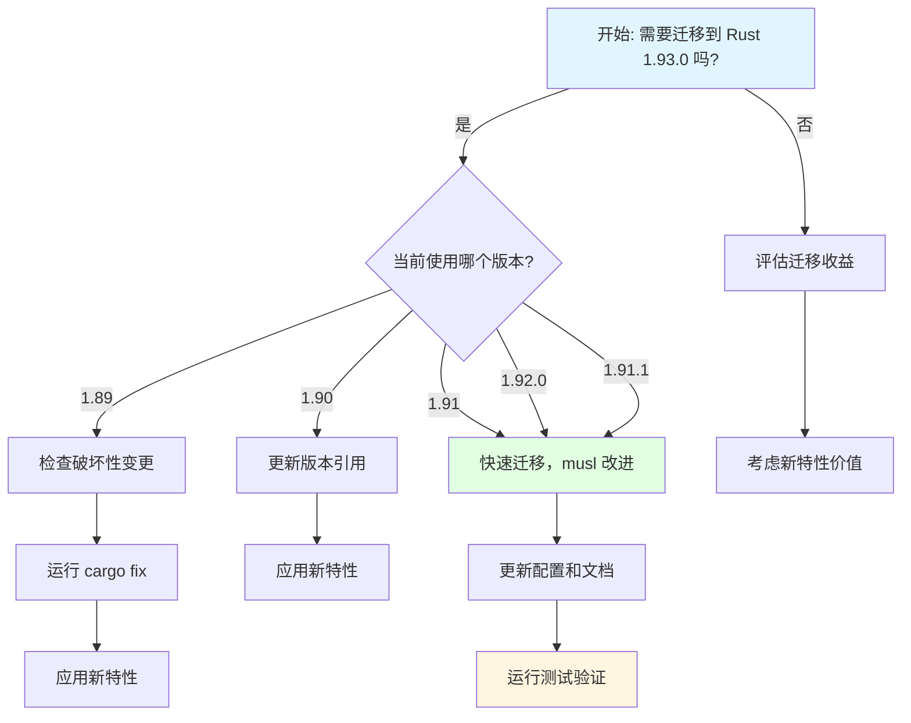
```mermaid
graph TD
    Start[开始: 需要迁移到 Rust 1.93.0 吗?] -->|是| Q1{当前使用哪个版本?}
    Start -->|否| Eval[评估迁移收益]

    Q1 -->|1.89| Check1[检查破坏性变更]
    Q1 -->|1.90| Update1[更新版本引用]
    Q1 -->|1.91| Quick[快速迁移]
    Q1 -->|1.92.0| Quick[快速迁移，musl 改进]
    Q1 -->|1.91.1| Quick

    Check1 --> Fix1[运行 cargo fix]
    Fix1 --> Apply1[应用新特性]

    Update1 --> Apply2[应用新特性]

    Quick --> Config[更新配置和文档]
    Config --> Test[运行测试验证]

    Eval --> Consider[考虑新特性价值]

    style Start fill:#e1f5ff
    style Quick fill:#e1ffe1
    style Test fill:#fff5e1
```

### 3.7 性能优化决策树

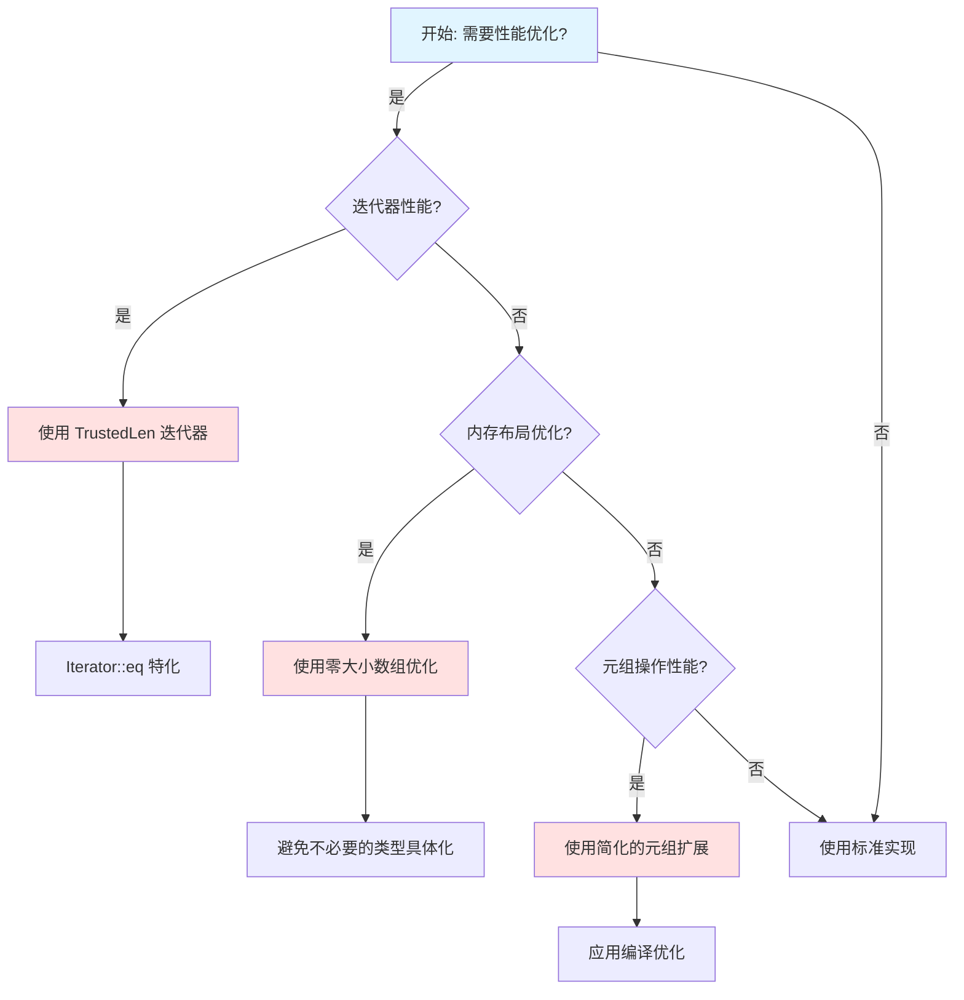
```mermaid
graph TD
    Start[开始: 需要性能优化?] -->|是| Q1{迭代器性能?}
    Start -->|否| End[使用标准实现]

    Q1 -->|是| Opt1[使用 TrustedLen 迭代器]
    Q1 -->|否| Q2{内存布局优化?}

    Opt1 --> Use1[Iterator::eq 特化]

    Q2 -->|是| Opt2[使用零大小数组优化]
    Q2 -->|否| Q3{元组操作性能?}

    Opt2 --> Use2[避免不必要的类型具体化]

    Q3 -->|是| Opt3[使用简化的元组扩展]
    Q3 -->|否| End

    Opt3 --> Use3[应用编译优化]

    style Start fill:#e1f5ff
    style Opt1 fill:#ffe1e1
    style Opt2 fill:#ffe1e1
    style Opt3 fill:#ffe1e1
```

### 3.8 应用场景决策树

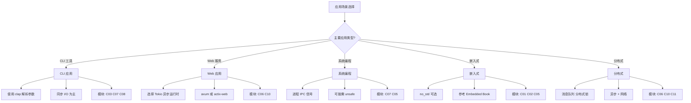
```mermaid
graph TD
    Start[应用场景选择] --> Q1{主要应用类型?}
    Q1 -->|CLI 工具| CLI[CLI 应用]
    Q1 -->|Web 服务| Web[Web 应用]
    Q1 -->|系统编程| Sys[系统编程]
    Q1 -->|嵌入式| Emb[嵌入式]
    Q1 -->|分布式| Dist[分布式]

    CLI --> CLI1[使用 clap 解析参数]
    CLI --> CLI2[同步 I/O 为主]
    CLI --> CLI3[模块: C03 C07 C08]

    Web --> Web1[选择 Tokio 异步运行时]
    Web --> Web2[axum 或 actix-web]
    Web --> Web3[模块: C06 C10]

    Sys --> Sys1[进程 IPC 信号]
    Sys --> Sys2[可能需 unsafe]
    Sys --> Sys3[模块: C07 C05]

    Emb --> Emb1[no_std 可选]
    Emb --> Emb2[参考 Embedded Book]
    Emb --> Emb3[模块: C01 C02 C05]

    Dist --> Dist1[消息队列 分布式锁]
    Dist --> Dist2[异步 + 网络]
    Dist --> Dist3[模块: C06 C10 C11]
```

### 3.9 转换树图 (Transformation Tree)

转换树描述概念间的转换关系与适用条件，帮助理解何时、如何在不同表示间转换。

#### 3.9.1 借用 ↔ 所有权转换树

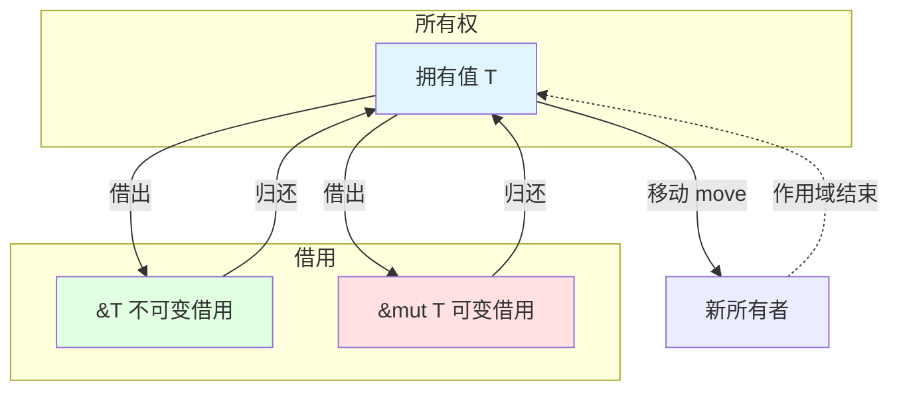
```mermaid
flowchart TD
    subgraph ownership [所有权]
        Own[拥有值 T]
    end

    subgraph borrow [借用]
        ImmRef[&T 不可变借用]
        MutRef[&mut T 可变借用]
    end

    Own -->|借出| ImmRef
    Own -->|借出| MutRef
    ImmRef -->|归还| Own
    MutRef -->|归还| Own

    Own -->|移动 move| Own2[新所有者]
    Own2 -.->|作用域结束| Own

    style Own fill:#e1f5ff
    style ImmRef fill:#e1ffe1
    style MutRef fill:#ffe1e1
```

#### 3.9.2 Option ↔ Result 转换树

```mermaid
flowchart LR
    subgraph option [Option]
        Some[Some T]
        None[None]
    end

    subgraph result [Result]
        Ok[Ok T]
        Err[Err E]
    end

    Some -->|ok_or| Err
    None -->|ok_or| Err
    Ok -->|ok| Some
    Err -->|err| None

    Some -->|map| Some
    Ok -->|map| Ok
    Err -->|map_err| Err
```

#### 3.9.3 &T vs &mut T 选择转换树

```mermaid
flowchart TD
    Start[需要访问数据?] --> Q1{需要修改?}
    Q1 -->|否| UseRef[使用 &T]
    Q1 -->|是| Q2{独占访问?}
    Q2 -->|是| UseMut[使用 &mut T]
    Q2 -->|否| Split[拆分可变借用或使用内部可变性]

    UseRef --> Rule1[可多个 &T 并存]
    UseMut --> Rule2[同一时刻仅一个 &mut T]
```

#### 3.9.4 泛型约束转换树

```mermaid
flowchart TD
    Start[需要泛型约束?] --> Q1{类型需实现哪些能力?}
    Q1 -->|单一能力| Trait[单 Trait: T: Trait]
    Q1 -->|多能力| Multi[T: A + B + C]
    Q1 -->|复杂约束| Where[where 子句]

    Trait --> Ex1[fn f<T: Display>(x: T)]
    Multi --> Ex2[fn f<T: Clone + Send>(x: T)]
    Where --> Ex3[fn f<T>() where T: Debug]
```

#### 3.9.5 生命周期转换树

```mermaid
flowchart TD
    Start[返回值含引用?] --> Q1{引用来自参数?}
    Q1 -->|是| Elide[生命周期省略]
    Q1 -->|否| Q2{来自 self?}

    Elide --> R1[输出引用 = 输入引用生命周期]
    Q2 -->|是| R2[输出 <= self 生命周期]
    Q2 -->|否| Explicit[必须显式标注]

    Explicit --> L1[fn f<'a>(x: &'a T) -> &'a U]
    L1 --> L2[fn f<'a, 'b>(x: &'a T, y: &'b U) -> &'a V]
```

#### 3.9.6 错误传播转换树

```mermaid
flowchart TD
    Start[错误处理策略] --> Q1{可恢复?}
    Q1 -->|是| Result[Result<T, E>]
    Q1 -->|否| Panic[panic! / unreachable!]

    Result --> Q2{需要传播?}
    Q2 -->|是| QOp[? 操作符]
    Q2 -->|否| Match[match / map_err]

    QOp --> Chain[链式 ? 自动传播]
    Match --> Handle[本地处理]

    Chain --> MapErr[map_err 转换错误类型]
    MapErr --> Anyhow[anyhow 应用层]
    MapErr --> ThisErr[thiserror 库]
```

---

## 🔬 4. 证明树图 (Proof Tree)

### 4.1 定理证明树结构

```mermaid
graph TD
    A1[公理 A1: 未初始化内存不具合法值]
    A2[公理 A2: 写入后内存具合法值]
    A3[公理 A3: assume_init 要求调用者保证已初始化]

    L1[引理 L1: 读取未初始化内存是 UB]
    L2[引理 L2: 写入后可安全读取]
    L3[引理 L3: assume_init_ref/mut 需 unsafe]

    T1[定理 T1: assume_init_drop 正确调用 drop]
    T2[定理 T2: assume_init_ref 返回合法引用]
    T3[定理 T3: assume_init_mut 返回合法可变引用]
    T4[定理 T4: write_copy_of_slice 正确初始化切片]

    C1[推论: MaybeUninit 1.93 API 安全性]

    A1 --> L1
    A2 --> L2
    A3 --> L3

    L1 --> T1
    L2 --> T2
    L2 --> T3
    L2 --> T4

    T1 --> C1
    T2 --> C1
    T3 --> C1
    T4 --> C1

    style A1 fill:#e1f5ff
    style A2 fill:#e1f5ff
    style A3 fill:#e1f5ff
    style C1 fill:#ffe1e1
```

### 4.2 内存安全证明树

```mermaid
graph TD
    Root[内存安全证明]
    
    P1[前提1: 所有权规则]
    P2[前提2: 借用检查器]
    P3[前提3: 生命周期检查]
    P4[前提4: 类型系统]
    
    L1[引理1: 无双重释放]
    L2[引理2: 无悬垂指针]
    L3[引理3: 无使用已释放内存]
    L4[引理4: 无越界访问]
    
    T1[定理1: 所有权保证单一释放]
    T2[定理2: 借用规则保证无数据竞争]
    T3[定理3: 生命周期保证引用有效性]
    
    C1[结论: 内存安全保证]
    
    Root --> P1
    Root --> P2
    Root --> P3
    Root --> P4
    
    P1 --> L1
    P2 --> L2
    P3 --> L3
    P4 --> L4
    
    L1 --> T1
    L2 --> T2
    L3 --> T3
    L4 --> T3
    
    T1 --> C1
    T2 --> C1
    T3 --> C1
    
    style Root fill:#e1f5ff
    style C1 fill:#ffe1e1
    style T1 fill:#e1ffe1
    style T2 fill:#e1ffe1
    style T3 fill:#e1ffe1
```

### 4.3 类型安全证明树

```mermaid
graph TD
    Root[类型安全证明]
    
    P1[前提1: 静态类型系统]
    P2[前提2: 类型检查器]
    P3[前提3: 泛型约束]
    P4[前提4: Trait一致性]
    
    L1[引理1: 无类型混淆]
    L2[引理2: 泛型单态化正确]
    L3[引理3: Trait对象安全]
    L4[引理4: 生命周期子类型正确]
    
    T1[定理1: 编译时类型检查保证运行时类型安全]
    T2[定理2: 泛型实例化保持类型一致性]
    T3[定理3: 动态分发保持类型安全]
    
    C1[结论: 类型安全保证]
    
    Root --> P1
    Root --> P2
    Root --> P3
    Root --> P4
    
    P1 --> L1
    P2 --> L2
    P3 --> L3
    P4 --> L4
    
    L1 --> T1
    L2 --> T2
    L3 --> T3
    L4 --> T1
    
    T1 --> C1
    T2 --> C1
    T3 --> C1
    
    style Root fill:#e1f5ff
    style C1 fill:#ffe1e1
```

### 4.4 并发安全证明树

```mermaid
graph TD
    Root[并发安全证明]
    
    P1[前提1: Send trait保证线程安全传输]
    P2[前提2: Sync trait保证线程安全共享]
    P3[前提3: 借用检查器保证数据竞争自由]
    P4[前提4: Mutex/RwLock提供互斥访问]
    
    L1[引理1: Send类型可安全转移所有权]
    L2[引理2: Sync类型可安全共享引用]
    L3[引理3: 借用规则防止并发数据竞争]
    L4[引理4: 锁保证互斥访问]
    
    T1[定理1: Send/Sync正确性保证线程间类型安全]
    T2[定理2: 借用检查保证无数据竞争]
    T3[定理3: 同步原语保证原子性和顺序性]
    
    C1[结论: 并发安全保证]
    
    Root --> P1
    Root --> P2
    Root --> P3
    Root --> P4
    
    P1 --> L1
    P2 --> L2
    P3 --> L3
    P4 --> L4
    
    L1 --> T1
    L2 --> T1
    L3 --> T2
    L4 --> T3
    
    T1 --> C1
    T2 --> C1
    T3 --> C1
    
    style Root fill:#e1f5ff
    style C1 fill:#ffe1e1
    style T1 fill:#e1ffe1
    style T2 fill:#e1ffe1
    style T3 fill:#e1ffe1
```

---

## 📈 5. 概念关系网络图 (Concept Relationship Network)

```mermaid
graph LR
    A[所有权] -->|依赖| B[借用]
    A -->|依赖| C[生命周期]
    B -->|依赖| C
    
    D[泛型] -->|依赖| E[Trait]
    D -->|依赖| F[类型系统]
    E -->|依赖| F
    
    G[并发] -->|依赖| A
    G -->|依赖| H[Send/Sync]
    
    I[异步] -->|依赖| G
    I -->|依赖| J[Future]
    I -->|依赖| K[Pin]
    
    L[宏系统] -->|依赖| D
    L -->|依赖| F
    
    M[内存安全] -->|保证| A
    M -->|保证| B
    M -->|保证| C
    
    N[类型安全] -->|保证| F
    N -->|保证| D
    N -->|保证| E
    
    O[零成本抽象] -->|实现| D
    O -->|实现| E
    
    P[FFI] -->|使用| A
    P -->|使用| Q[unsafe]
    
    style A fill:#ffe1e1
    style B fill:#ffe1e1
    style C fill:#ffe1e1
    style G fill:#e1ffe1
    style I fill:#e1ffe1
    style M fill:#fff5e1
    style N fill:#fff5e1
```

---

## 🎯 6. 使用指南

### 6.1 何时使用思维导图

- ✅ 开始学习新特性，需要规划学习路径
- ✅ 需要可视化知识结构
- ✅ 需要理解概念之间的层次关系
- ✅ 需要快速浏览特性概览

### 6.2 何时使用多维矩阵

- ✅ 需要对比不同特性的优劣
- ✅ 需要评估迁移成本和收益
- ✅ 需要理解特性之间的依赖关系
- ✅ 需要做出技术选型决策

### 6.3 何时使用决策树

- ✅ 需要根据场景选择合适的特性
- ✅ 需要规划迁移路径
- ✅ 需要优化性能
- ✅ 需要解决具体问题
- ✅ 需要选择技术栈
- ✅ 需要调试错误
- ✅ 规划学习路径

### 6.4 何时使用证明树

- ✅ 需要验证安全性的正确性
- ✅ 需要理解特性的理论基础
- ✅ 需要向他人解释安全性保证
- ✅ 需要形式化验证

### 6.5 何时使用转换树

- ✅ 需要理解概念间的转换关系（所有权↔借用、Option↔Result）
- ✅ 需要选择正确的引用类型（&T vs &mut T）
- ✅ 需要分析错误类型与可选值的转换链
- ✅ 需要理解公理→引理→定理→推论的证明结构

---

## 💻 代码示例

### 示例 1: 思维导图生成器

```rust
use std::collections::HashMap;

/// 思维导图生成器 - 将 Rust 知识结构化
pub struct MindMapGenerator {
    root: String,
    nodes: HashMap<String, Vec<String>>,
}

impl MindMapGenerator {
    pub fn new(root: &str) -> Self {
        Self {
            root: root.to_string(),
            nodes: HashMap::new(),
        }
    }
    
    pub fn add_node(&mut self, parent: &str, child: &str) {
        self.nodes
            .entry(parent.to_string())
            .or_default()
            .push(child.to_string());
    }
    
    /// 生成 Mermaid 思维导图
    pub fn to_mermaid(&self) -> String {
        let mut output = format!("```mermaid\nmindmap\n  root(({}))\n", self.root);
        
        for (parent, children) in &self.nodes {
            output.push_str(&format!("    {}\n", parent));
            for child in children {
                output.push_str(&format!("      {}\n", child));
            }
        }
        
        output.push_str("```\n");
        output
    }
}

/// 创建 Rust 所有权系统思维导图
fn create_ownership_mindmap() -> MindMapGenerator {
    let mut mm = MindMapGenerator::new("所有权系统");
    
    mm.add_node("所有权系统", "核心规则");
    mm.add_node("核心规则", "每个值有一个所有者");
    mm.add_node("核心规则", "所有者离开作用域时释放");
    mm.add_node("核心规则", "值只能有一个所有者");
    
    mm.add_node("所有权系统", "移动语义");
    mm.add_node("移动语义", "Copy trait");
    mm.add_node("移动语义", "Move语义");
    mm.add_node("移动语义", "Drop trait");
    
    mm.add_node("所有权系统", "借用系统");
    mm.add_node("借用系统", "不可变借用 &T");
    mm.add_node("借用系统", "可变借用 &mut T");
    
    mm
}
```

### 示例 2: 决策树枚举实现

```rust
/// 所有权决策树节点
#[derive(Debug, Clone)]
enum OwnershipDecision {
    // 是否需要共享所有权？
    NeedSharedOwnership {
        thread_safe: bool,
    },
    // 是否需要内部可变性？
    NeedInteriorMutability {
        use_cell: bool,  // true: Cell, false: RefCell
    },
    // 是否处理未初始化内存？
    NeedUninitialized {
        need_safety: bool,
    },
    // 最终决策
    Decision(String),
}

/// 决策引擎
struct DecisionEngine;

impl DecisionEngine {
    /// 所有权与借用决策树
    fn ownership_decision(need_shared: bool, thread_safe: bool, need_mut: bool) -> String {
        if need_shared {
            if thread_safe {
                if need_mut {
                    "Arc<Mutex<T>> - 跨线程共享可变".to_string()
                } else {
                    "Arc<T> - 跨线程共享只读".to_string()
                }
            } else {
                if need_mut {
                    "Rc<RefCell<T>> - 单线程共享可变".to_string()
                } else {
                    "Rc<T> - 单线程共享只读".to_string()
                }
            }
        } else {
            if need_mut {
                "Box<T> + 可变引用 - 独占可变".to_string()
            } else {
                "Box<T> - 独占所有权".to_string()
            }
        }
    }
}
```

---

## 📚 7. 参考资源

### 7.1 官方资源

- [Rust 官方文档](https://doc.rust-lang.org/)
- [Rust 1.93.0 Release Notes](https://releases.rs/docs/1.93.0/)
- [Rust Book](https://doc.rust-lang.org/book/)
- [Rust Reference](https://doc.rust-lang.org/reference/)

### 7.2 项目资源

- [MIND_MAP_COLLECTION.md](./MIND_MAP_COLLECTION.md) - 思维导图集合
- [DECISION_GRAPH_NETWORK.md](./DECISION_GRAPH_NETWORK.md) - 决策图网
- [PROOF_GRAPH_NETWORK.md](./PROOF_GRAPH_NETWORK.md) - 证明图网

### 7.3 相关文档

- [MULTI_DIMENSIONAL_CONCEPT_MATRIX.md](./MULTI_DIMENSIONAL_CONCEPT_MATRIX.md) - 多维概念矩阵
- [KNOWLEDGE_STRUCTURE_FRAMEWORK.md](./KNOWLEDGE_STRUCTURE_FRAMEWORK.md) - 知识结构框架

---

**最后更新**: 2026-02-20
**状态**: ✅ 已完成
**思维导图数量**: 12个
**决策树数量**: 9个
**证明树数量**: 4个
**覆盖概念**: 所有权、借用、生命周期、泛型、Trait、并发、异步、宏系统、错误处理、类型系统
