# Rust 1.93.0 思维表征方式文档 / Thinking Representation Methods Documentation

> **创建日期**: 2025-12-11
> **最后更新**: 2026-02-15
> **Rust 版本**: 1.93.0+ (Edition 2024)
> **状态**: ✅ 已完成

---

## 📋 目录

- [Rust 1.93.0 思维表征方式文档 / Thinking Representation Methods Documentation](#rust-1930-思维表征方式文档--thinking-representation-methods-documentation)
  - [📋 目录](#-目录)
  - [🎯 文档概述](#-文档概述)
  - [🗺️ 1. 思维导图 (Mind Map)](#️-1-思维导图-mind-map)
    - [1.1 Rust 1.93.0 核心特性思维导图](#11-rust-1930-核心特性思维导图)
      - [1.1a Rust 1.93 官方特性（对齐 releases.rs）](#11a-rust-193-官方特性对齐-releasesrs)
      - [1.1b 累积特性（含 1.91/1.92 常用特性）](#11b-累积特性含-191192-常用特性)
    - [1.2 特性应用场景思维导图](#12-特性应用场景思维导图)
    - [1.3 跨模块概念依赖思维导图](#13-跨模块概念依赖思维导图)
    - [1.4 模块级思维导图索引](#14-模块级思维导图索引)
    - [1.5 学习路径思维导图](#15-学习路径思维导图)
  - [📊 2. 多维矩阵 (Multidimensional Matrix)](#-2-多维矩阵-multidimensional-matrix)
    - [2.1 Rust 1.93.0 特性对比矩阵](#21-rust-1930-特性对比矩阵)
    - [2.2 版本迁移对比矩阵](#22-版本迁移对比矩阵)
    - [2.3 特性依赖关系矩阵](#23-特性依赖关系矩阵)
    - [2.4 性能影响矩阵](#24-性能影响矩阵)
  - [🌳 3. 决策树图 (Decision Tree)](#-3-决策树图-decision-tree)
    - [3.1 Rust 1.93.0 特性使用决策树](#31-rust-1930-特性使用决策树)
    - [3.2 迁移决策树](#32-迁移决策树)
    - [3.3 性能优化决策树](#33-性能优化决策树)
    - [3.4 应用场景决策树](#34-应用场景决策树)
    - [3.5 技术选型决策树](#35-技术选型决策树)
    - [3.6 转换树图 (Transformation Tree)](#36-转换树图-transformation-tree)
      - [3.6.1 借用 ↔ 所有权转换树](#361-借用--所有权转换树)
      - [3.6.2 Option ↔ Result 转换树](#362-option--result-转换树)
      - [3.6.3 \&T vs \&mut T 选择转换树](#363-t-vs-mut-t-选择转换树)
      - [3.6.4 泛型约束转换树](#364-泛型约束转换树)
      - [3.6.5 生命周期转换树](#365-生命周期转换树)
      - [3.6.6 错误传播转换树](#366-错误传播转换树)
      - [3.6.7 何时使用转换树](#367-何时使用转换树)
      - [3.6.8 Rust 1.93 转换树：MaybeUninit 与 raw parts](#368-rust-193-转换树maybeuninit-与-raw-parts)
  - [🔬 4. 证明树图 (Proof Tree)](#-4-证明树图-proof-tree)
    - [4.1 MaybeUninit 安全性证明树](#41-maybeuninit-安全性证明树)
      - [公理→定理链（Rust 1.93 API 扩展）](#公理定理链rust-193-api-扩展)
      - [前提→结论证明](#前提结论证明)
    - [4.2 Never 类型 Lint 严格化证明树](#42-never-类型-lint-严格化证明树)
    - [4.3 联合体原始引用安全性证明树](#43-联合体原始引用安全性证明树)
    - [4.4 借用检查器安全性证明树](#44-借用检查器安全性证明树)
    - [4.5 生命周期安全性证明树](#45-生命周期安全性证明树)
    - [4.6 Send/Sync 安全性证明树](#46-sendsync-安全性证明树)
  - [📈 5. 概念关系网络图 (Concept Relationship Network)](#-5-概念关系网络图-concept-relationship-network)
  - [🎯 6. 使用指南](#-6-使用指南)
    - [6.1 何时使用思维导图](#61-何时使用思维导图)
    - [6.2 何时使用多维矩阵](#62-何时使用多维矩阵)
    - [6.3 何时使用决策树](#63-何时使用决策树)
    - [6.4 何时使用证明树](#64-何时使用证明树)
    - [6.5 何时使用转换树](#65-何时使用转换树)
  - [📚 7. 参考资源](#-7-参考资源)
    - [7.1 官方资源](#71-官方资源)
    - [7.2 项目资源](#72-项目资源)
    - [7.3 相关文档](#73-相关文档)

---

## 🎯 文档概述

本文档提供四种主要的思维表征方式，帮助开发者从不同角度理解和应用 Rust 1.93.0 的特性：

1. **思维导图** - 可视化知识结构和学习路径
2. **多维矩阵** - 多维度对比分析和决策支持
3. **决策树图** - 结构化决策流程和选择路径
4. **转换树图** - 概念间转换关系与适用条件
5. **证明树图** - 形式化逻辑证明和安全性验证

---

## 🗺️ 1. 思维导图 (Mind Map)

### 1.1 Rust 1.93.0 核心特性思维导图

> **说明**: 以下思维导图以 [Rust 1.93 官方发布说明](https://releases.rs/docs/1.93.0/) 为准，聚焦 1.93 新增/变更特性。

#### 1.1a Rust 1.93 官方特性（对齐 releases.rs）

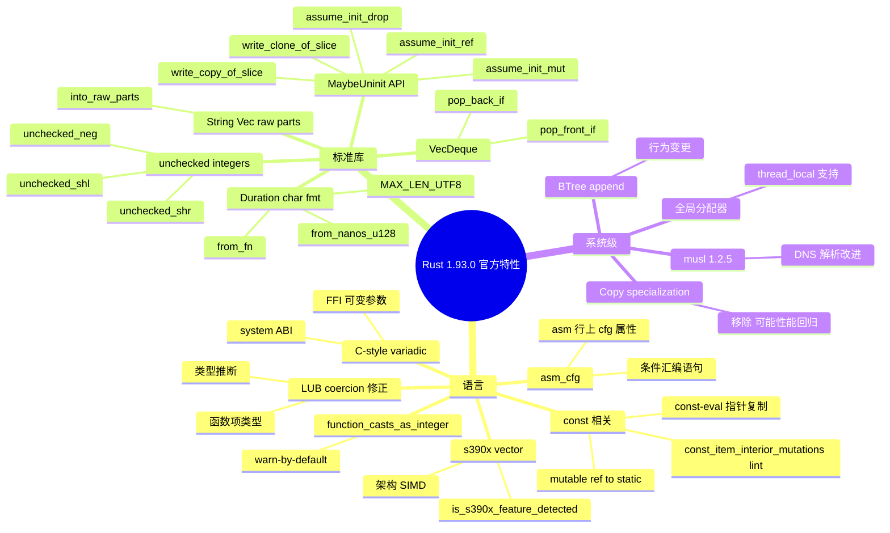

#### 1.1b 累积特性（含 1.91/1.92 常用特性）

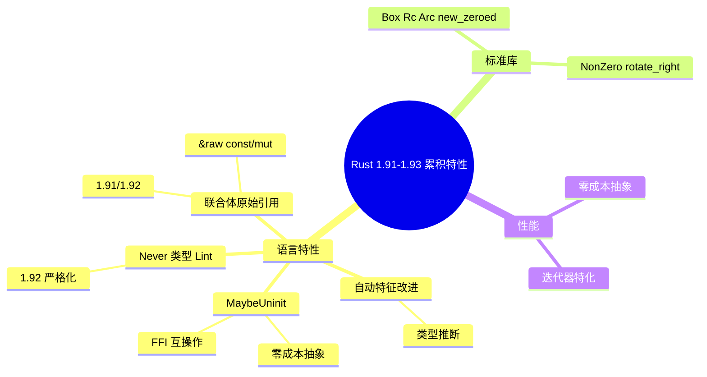

### 1.2 特性应用场景思维导图

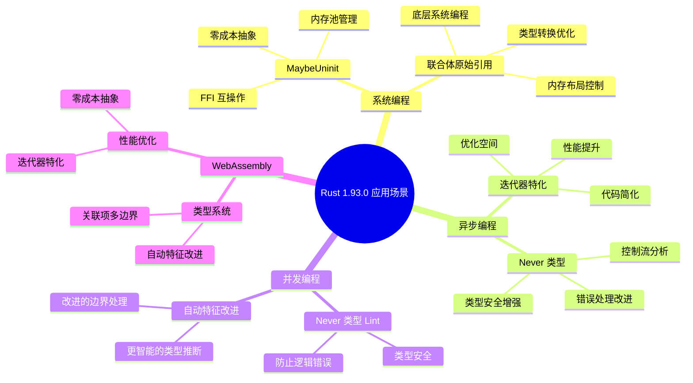

### 1.3 跨模块概念依赖思维导图

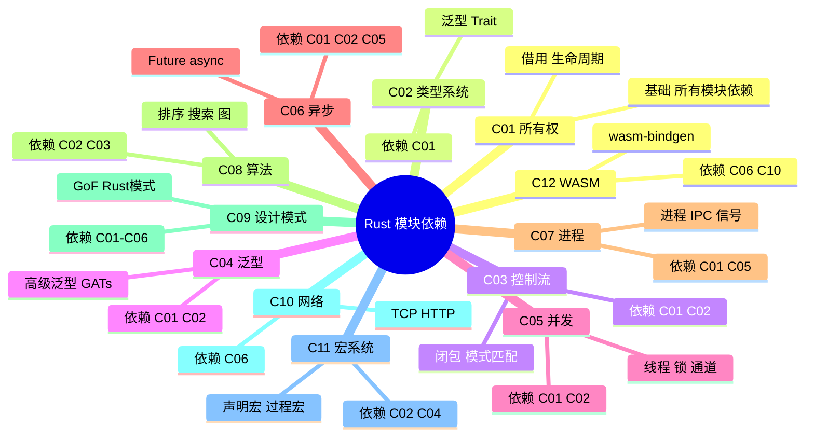

### 1.4 模块级思维导图索引

各模块的思维导图与知识可视化资源：

| 模块 | 思维导图/知识图谱 | 路径 |
| :--- | :--- | :--- || C01 | 所有权知识图谱 | crates/c01_ownership_borrow_scope/docs/ |
| C02 | 类型系统多维矩阵 | crates/c02_type_system/docs/ |
| C03 | 控制流 MIND_MAP | crates/c03_control_fn/docs/MIND_MAP.md |
| C04 | 泛型概念关系 | crates/c04_generic/docs/ |
| C05 | 并发模型对比 | crates/c05_threads/docs/ |
| C06 | 异步编程决策树 | crates/c06_async/docs/ |
| C07 | 进程管理速查 | docs/quick_reference/process_management_cheatsheet.md |
| C08 | 算法复杂度矩阵 | docs/MULTI_DIMENSIONAL_CONCEPT_MATRIX.md |
| C09 | 设计模式矩阵 | crates/c09_design_pattern/docs/ |
| C10 | 网络协议矩阵 | docs/MULTI_DIMENSIONAL_CONCEPT_MATRIX.md |
| C11 | 宏系统层级 | crates/c11_macro_system/docs/ |
| C12 | WASM 思维导图 | crates/c12_wasm/docs/WASM_MIND_MAPS.md |

### 1.5 学习路径思维导图

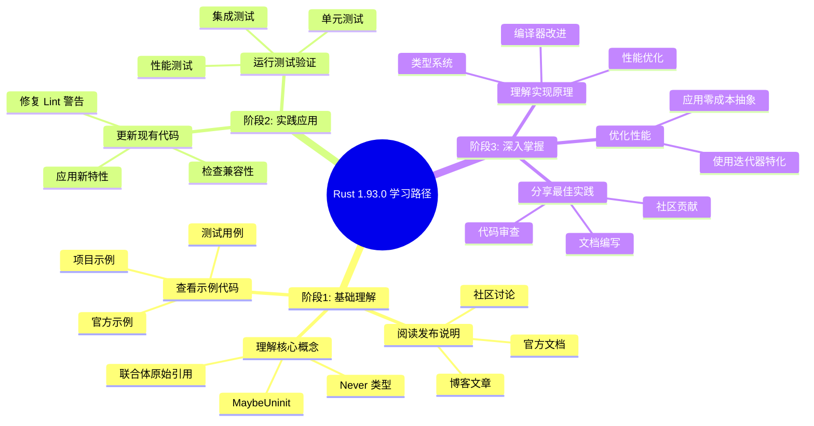

---

## 📊 2. 多维矩阵 (Multidimensional Matrix)

### 2.1 Rust 1.93.0 特性对比矩阵

| 特性类别     | 特性名称                | 重要性     | 影响范围 | 迁移难度 | 性能影响 | 安全影响       | 应用场景       |
| :--- | :--- | :--- | :--- | :--- | :--- | :--- | :--- || **语言特性** | MaybeUninit 文档化      | ⭐⭐⭐⭐⭐ | 全局     | 低       | 无       | ✅ 类型安全    | 系统编程、FFI  |
| **语言特性** | 联合体原始引用          | ⭐⭐⭐⭐   | 中等     | 中       | 正       | ✅ 安全访问    | 底层编程       |
| **语言特性** | 自动特征改进            | ⭐⭐⭐     | 全局     | 低       | 正       | ✅ 类型安全    | 泛型编程       |
| **语言特性** | 零大小数组优化          | ⭐⭐       | 局部     | 低       | 正       | ✅ 类型安全    | 类型系统       |
| **语言特性** | track_caller 组合       | ⭐⭐⭐     | 局部     | 低       | 无       | ✅ 调试友好    | 调试、错误处理 |
| **语言特性** | Never 类型 Lint         | ⭐⭐⭐⭐   | 全局     | 中       | 无       | ✅ 类型安全    | 类型安全       |
| **语言特性** | 关联项多边界            | ⭐⭐⭐     | 局部     | 低       | 无       | ✅ 类型安全    | 泛型编程       |
| **语言特性** | 高阶生命周期            | ⭐⭐⭐     | 局部     | 中       | 无       | ✅ 类型安全    | 复杂类型       |
| **语言特性** | unused_must_use 改进    | ⭐⭐       | 全局     | 低       | 无       | ✅ 代码质量    | 代码质量       |
| **标准库**   | NonZero::div_ceil       | ⭐⭐⭐     | 局部     | 低       | 无       | ✅ 安全        | 数学计算       |
| **标准库**   | Location::file_as_c_str | ⭐⭐       | 局部     | 低       | 无       | ✅ 安全        | FFI、调试      |
| **标准库**   | rotate_right            | ⭐⭐⭐     | 局部     | 低       | 无       | ✅ 安全        | 算法、数据处理 |
| **标准库**   | Box::new_zeroed         | ⭐⭐⭐⭐   | 中等     | 中       | 正       | ⚠️ 需要 unsafe | 内存分配、FFI  |
| **标准库**   | Box::new_zeroed_slice   | ⭐⭐⭐⭐   | 中等     | 中       | 正       | ⚠️ 需要 unsafe | 内存分配、FFI  |
| **性能**     | 迭代器特化              | ⭐⭐⭐⭐   | 全局     | 低       | 正       | ✅ 安全        | 性能关键代码   |
| **性能**     | 元组扩展简化            | ⭐⭐       | 局部     | 低       | 无       | ✅ 安全        | 代码简化       |
| **性能**     | EncodeWide Debug        | ⭐         | 局部     | 低       | 无       | ✅ 安全        | Windows 开发   |
| **性能**     | iter::Repeat panic      | ⭐⭐       | 局部     | 低       | 无       | ✅ 安全        | 错误处理       |

**图例**:

- ⭐⭐⭐⭐⭐: 极高重要性
- ⭐⭐⭐⭐: 高重要性
- ⭐⭐⭐: 中等重要性
- ⭐⭐: 低重要性
- ⭐: 极低重要性
- ✅: 正面影响
- ⚠️: 需要注意

### 2.2 版本迁移对比矩阵

| 从版本 | 到版本 | 主要变更                   | 破坏性变更 | 迁移工作量 | 建议优先级 | 关键注意事项                     |
| :--- | :--- | :--- | :--- | :--- | :--- | :--- || 1.89   | 1.93.0 | 多项新特性                 | 低         | 中         | P1         | Never 类型 Lint 可能影响现有代码 |
| 1.90   | 1.93.0 | 特性增强                   | 低         | 低         | P1         | 检查 Lint 警告                   |
| 1.91   | 1.93.0 | 特性完善                   | 低         | 低         | P0         | 快速迁移，收益高                 |
| 1.92.0 | 1.93.0 | musl 1.2.5、全局分配器增强 | 低         | 低         | P0         | 直接迁移，DNS 解析改进           |

### 2.3 特性依赖关系矩阵

| 特性               | 依赖特性    | 影响特性        | 冲突特性 | 协同特性       | 组合示例               |
| :--- | :--- | :--- | :--- | :--- | :--- || MaybeUninit 文档化 | 无          | 联合体原始引用  | 无       | 零大小数组优化 | SafeMaybeUninit 包装器 |
| 联合体原始引用     | MaybeUninit | 无              | 无       | track_caller   | &raw const/mut 访问    |
| Never 类型 Lint    | 无          | unused_must_use | 无       | 类型系统改进   | 错误处理改进           |
| 迭代器特化         | TrustedLen  | 性能优化        | 无       | 元组扩展简化   | Iterator::eq 特化      |
| 关联项多边界       | 无          | 泛型编程        | 无       | 自动特征改进   | type Item: A + B + C   |
| 自动特征改进       | 无          | 类型推断        | 无       | 关联项多边界   | 更智能的边界处理       |

### 2.4 性能影响矩阵

| 特性               | 编译时性能 | 运行时性能 | 内存使用 | 代码大小 | 优化潜力 |
| :--- | :--- | :--- | :--- | :--- | :--- || MaybeUninit 文档化 | 无影响     | 零成本     | 无影响   | 无影响   | 低       |
| 联合体原始引用     | 无影响     | 零成本     | 无影响   | 无影响   | 低       |
| 迭代器特化         | 轻微提升   | 显著提升   | 无影响   | 可能增加 | 高       |
| 零大小数组优化     | 轻微提升   | 无影响     | 无影响   | 可能减少 | 中       |
| 自动特征改进       | 轻微提升   | 无影响     | 无影响   | 无影响   | 低       |
| 关联项多边界       | 无影响     | 零成本     | 无影响   | 无影响   | 低       |

---

## 🌳 3. 决策树图 (Decision Tree)

### 3.1 Rust 1.93.0 特性使用决策树

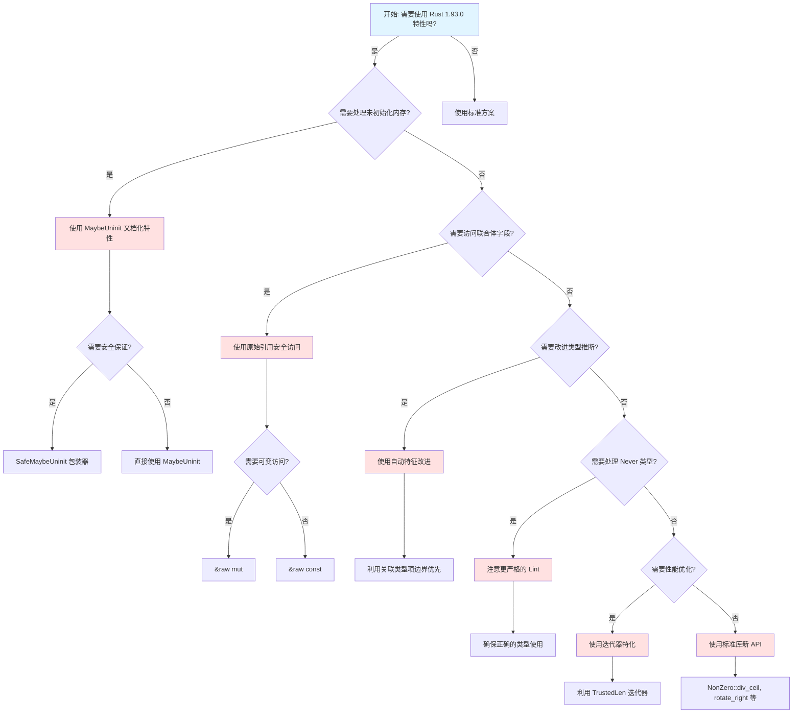

### 3.2 迁移决策树

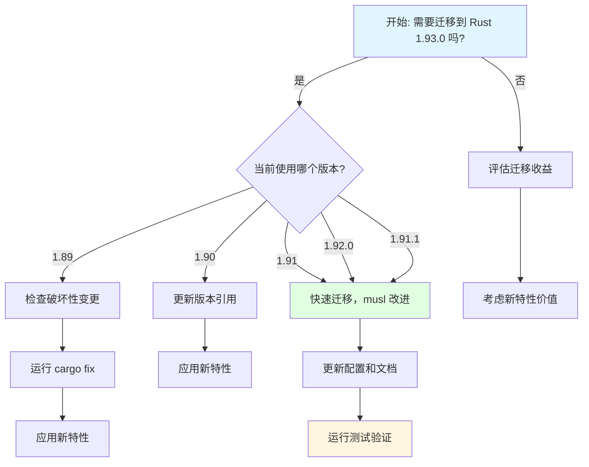

### 3.3 性能优化决策树

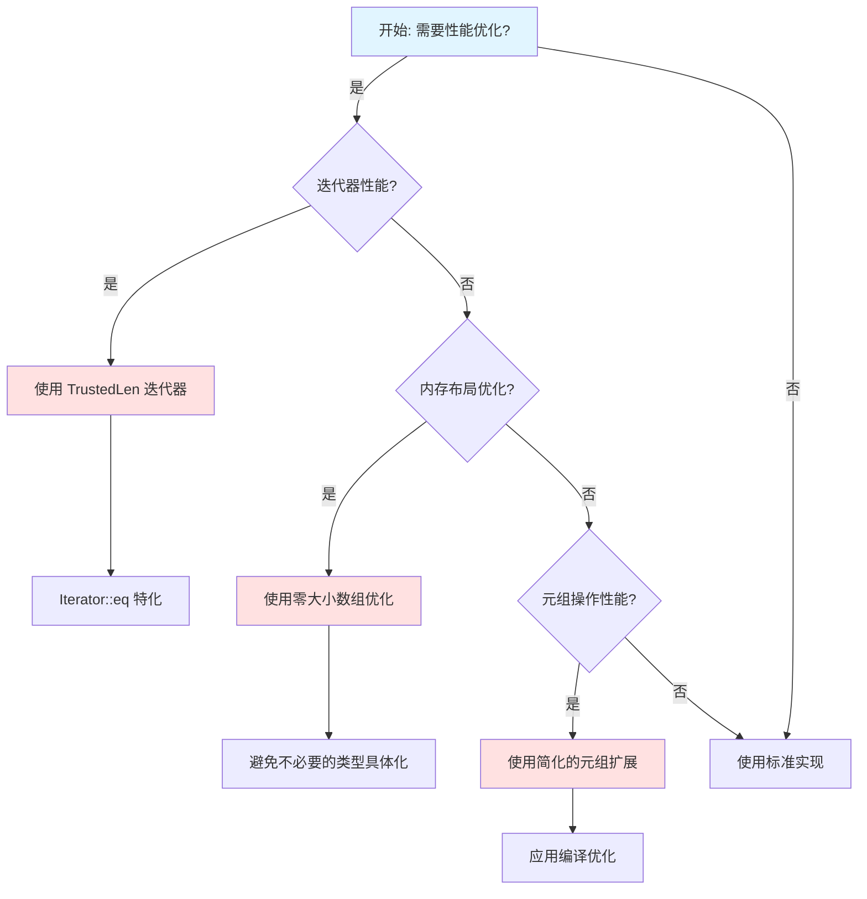

### 3.4 应用场景决策树

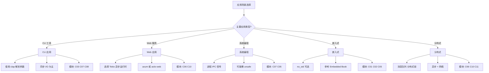

### 3.5 技术选型决策树

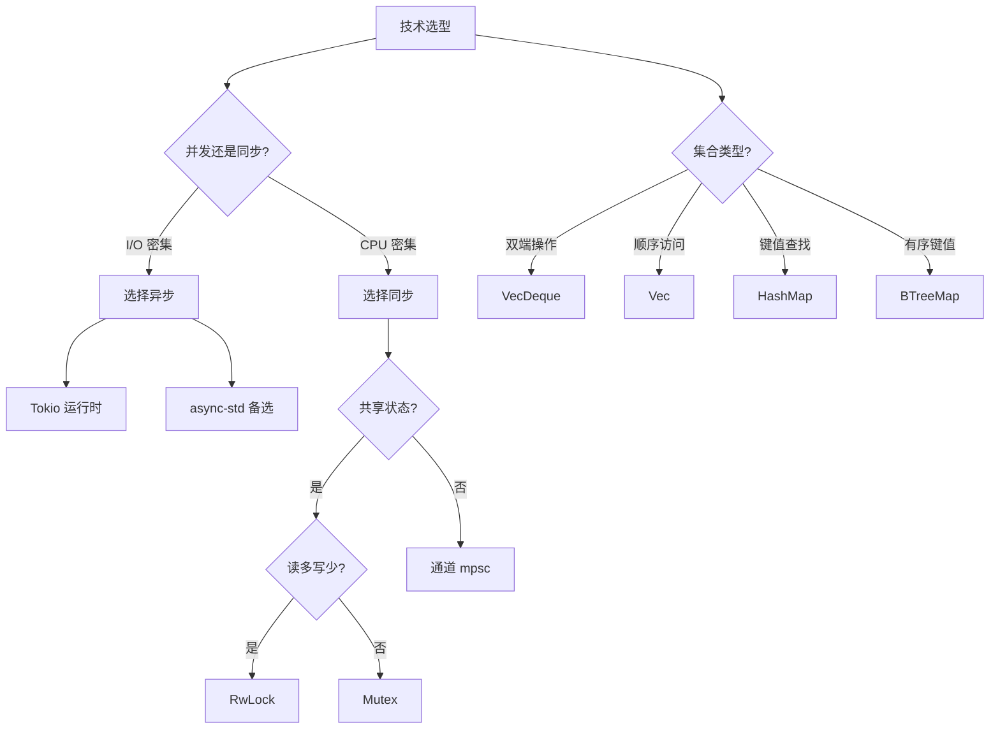

---

### 3.6 转换树图 (Transformation Tree)

转换树描述概念间的转换关系与适用条件，帮助理解何时、如何在不同表示间转换。

#### 3.6.1 借用 ↔ 所有权转换树

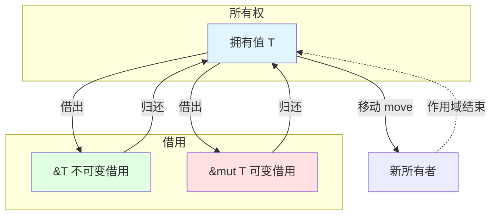

#### 3.6.2 Option ↔ Result 转换树

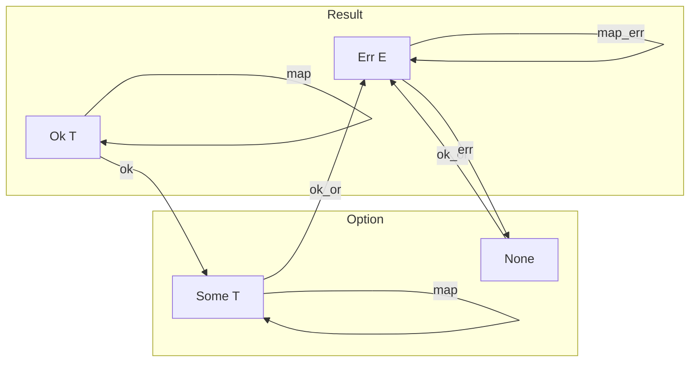

#### 3.6.3 &T vs &mut T 选择转换树

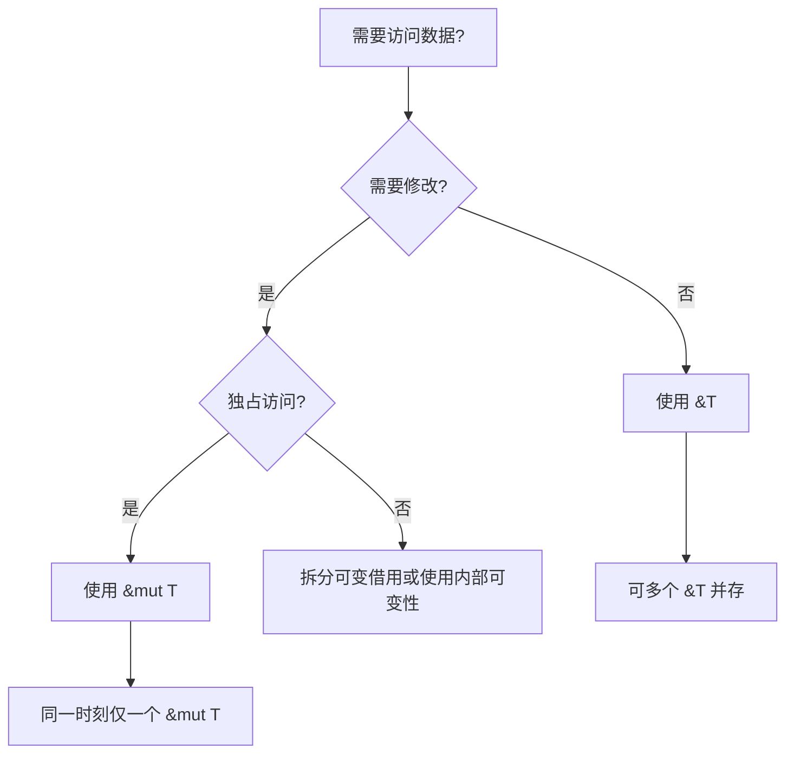

#### 3.6.4 泛型约束转换树

```mermaid
flowchart TD
    Start[需要泛型约束?] --> Q1{类型需实现哪些能力?}
    Q1 -->|单一能力| Trait[单 Trait: T: Trait]
    Q1 -->|多能力| Multi[T: A + B + C]
    Q1 -->|复杂约束| Where[where 子句]

    Trait --> Ex1[fn f<T: Display>(x: T)]
    Multi --> Ex2[fn f<T: Clone + Send>(x: T)]
    Where --> Ex3[fn f<T>() where T: Debug]
```

#### 3.6.5 生命周期转换树

```mermaid
flowchart TD
    Start[返回值含引用?] --> Q1{引用来自参数?}
    Q1 -->|是| Elide[生命周期省略]
    Q1 -->|否| Q2{来自 self?}

    Elide --> R1[输出引用 = 输入引用生命周期]
    Q2 -->|是| R2[输出 <= self 生命周期]
    Q2 -->|否| Explicit[必须显式标注]

    Explicit --> L1[fn f<'a>(x: &'a T) -> &'a U]
    L1 --> L2[fn f<'a, 'b>(x: &'a T, y: &'b U) -> &'a V]
```

#### 3.6.6 错误传播转换树

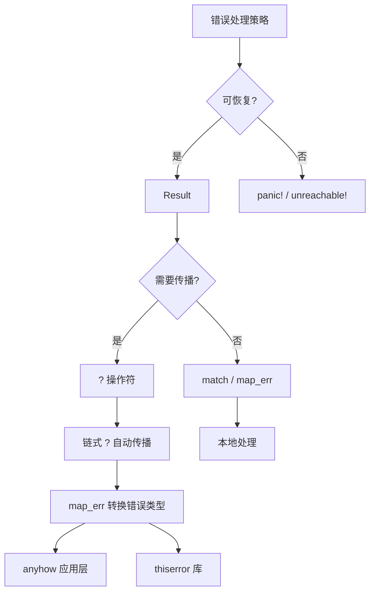

#### 3.6.7 何时使用转换树

- 理解借用与所有权的关系
- 选择 Option 与 Result 的转换方法
- 决定何时用 `&T` 何时用 `&mut T`
- 分析错误类型与可选值的转换链
- 泛型约束选择：单 Trait、多 Trait、where 子句
- 生命周期标注与省略规则
- 错误传播：`?`、`map_err`、anyhow/thiserror

#### 3.6.8 Rust 1.93 转换树：MaybeUninit 与 raw parts

```mermaid
flowchart TD
    subgraph raw [Rust 1.93 内存/集合转换]
        Mu[MaybeUninit&lt;T&gt;] -->|write_copy_of_slice| Init[已初始化切片]
        Mu -->|assume_init_ref/mut| Ref[&T / &mut T]
        S[String] -->|into_raw_parts| R1[ptr, len, cap]
        V[Vec&lt;T&gt;] -->|into_raw_parts| R2[ptr, len, cap]
        R1 -->|from_raw_parts| S
        R2 -->|from_raw_parts| V
        Slice[&[T]] -->|as_array&lt;N&gt;| Arr[Option&lt;&[T; N]&gt;]
    end
```

---

## 🔬 4. 证明树图 (Proof Tree)

### 4.1 MaybeUninit 安全性证明树

#### 公理→定理链（Rust 1.93 API 扩展）

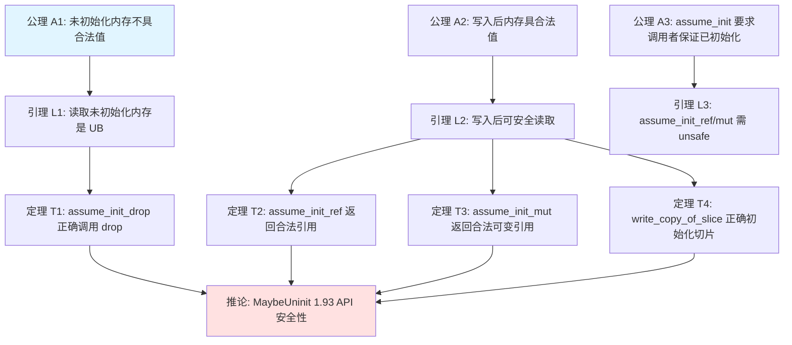

#### 前提→结论证明

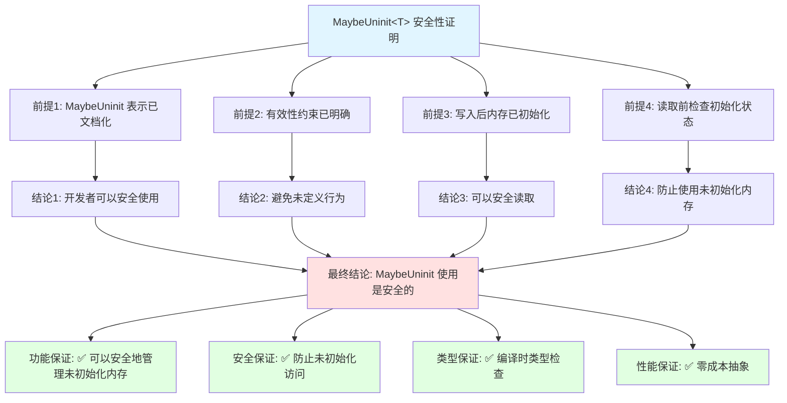

### 4.2 Never 类型 Lint 严格化证明树

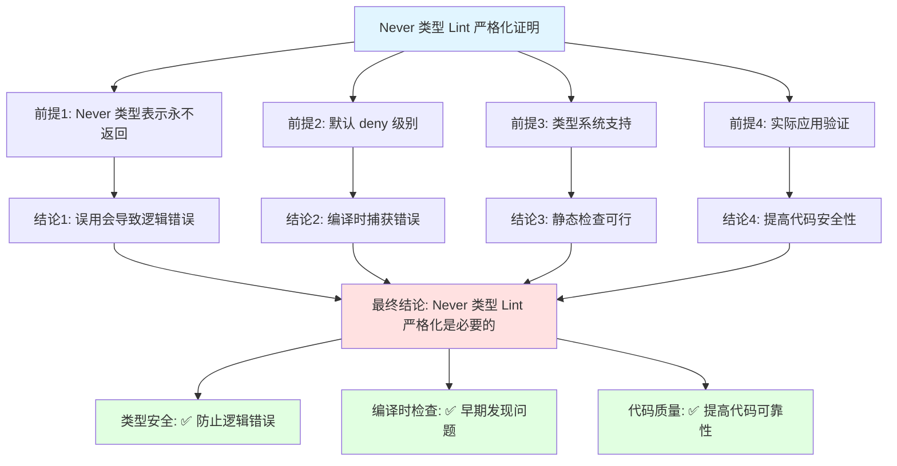

### 4.3 联合体原始引用安全性证明树

```mermaid
graph TD
    Root[联合体原始引用安全性证明]

    Root --> P1[前提1: 原始引用语法已稳定]
    Root --> P2[前提2: 联合体字段访问规则已明确]
    Root --> P3[前提3: 原始引用不触发借用检查]

    P1 --> C1[结论1: &raw const/mut 可在安全代码中使用]
    P2 --> C2[结论2: 明确的访问规则]
    P3 --> C3[结论3: 不违反借用规则]

    C1 --> Final[最终结论: 联合体原始引用使用是安全的]
    C2 --> Final
    C3 --> Final

    Final --> G1[功能保证: ✅ 可以在安全代码中获取联合体字段的原始引用]
    Final --> G2[安全保证: ✅ 不违反借用规则]
    Final --> G3[类型保证: ✅ 编译时类型检查]
    Final --> G4[性能保证: ✅ 零成本直接内存访问]

    style Root fill:#e1f5ff
    style Final fill:#ffe1e1
    style G1 fill:#e1ffe1
    style G2 fill:#e1ffe1
    style G3 fill:#e1ffe1
    style G4 fill:#e1ffe1
```

### 4.4 借用检查器安全性证明树

```mermaid
graph TD
    Root[借用检查器安全性证明]
    Root --> P1[前提1: 任意时刻最多一个可变借用]
    Root --> P2[前提2: 或多个不可变借用]
    Root --> P3[前提3: 借用不能outlive所有者]
    P1 --> C1[结论1: 无数据竞争]
    P2 --> C2[结论2: 读写互斥保证]
    P3 --> C3[结论3: 无悬垂引用]
    C1 --> Final[最终结论: 内存安全]
    C2 --> Final
    C3 --> Final
```

### 4.5 生命周期安全性证明树

```mermaid
graph TD
    Root[生命周期安全性证明]
    Root --> P1[前提1: 生命周期标注约束引用有效期]
    Root --> P2[前提2: 输出引用不能outlive输入引用]
    Root --> P3[前提3: 编译器静态验证]
    P1 --> C1[结论1: 无悬垂引用]
    P2 --> C2[结论2: 引用有效性保证]
    P3 --> C3[结论3: 零运行时开销]
    C1 --> Final[最终结论: 生命周期保障内存安全]
    C2 --> Final
    C3 --> Final
```

### 4.6 Send/Sync 安全性证明树

```mermaid
graph TD
    Root[Send Sync 安全性证明]
    Root --> P1[前提1: Send 允许跨线程传输所有权]
    Root --> P2[前提2: Sync 允许跨线程共享借用]
    Root --> P3[前提3: 编译器自动推导]
    P1 --> C1[结论1: 线程间安全传递]
    P2 --> C2[结论2: 共享引用线程安全]
    P3 --> C3[结论3: 误用导致编译错误]
    C1 --> Final[最终结论: Send Sync 保障并发安全]
    C2 --> Final
    C3 --> Final
```

---

## 📈 5. 概念关系网络图 (Concept Relationship Network)

```mermaid
graph LR
    A[MaybeUninit 文档化] -->|依赖| B[内存安全]
    C[联合体原始引用] -->|依赖| A
    D[自动特征改进] -->|影响| E[类型推断]
    F[零大小数组优化] -->|协同| A
    G[Never 类型 Lint] -->|影响| H[类型安全]
    I[关联项多边界] -->|影响| J[泛型编程]
    K[高阶生命周期] -->|影响| L[类型系统]
    M[迭代器特化] -->|影响| N[性能优化]
    O[track_caller] -->|影响| P[调试支持]
    Q[unused_must_use] -->|影响| R[代码质量]

    S[系统编程] -->|使用| A
    S -->|使用| C
    T[异步编程] -->|使用| M
    T -->|使用| L
    U[并发编程] -->|使用| G
    U -->|使用| H
    V[WebAssembly] -->|使用| N
    V -->|使用| L
    W[FFI 互操作] -->|使用| A
    W -->|使用| X[Location::file_as_c_str]

    style A fill:#ffe1e1
    style C fill:#ffe1e1
    style G fill:#ffe1e1
    style M fill:#ffe1e1
    style S fill:#e1ffe1
    style T fill:#e1ffe1
    style U fill:#e1ffe1
```

---

## 🎯 6. 使用指南

### 6.1 何时使用思维导图

- ✅ 开始学习新特性，需要规划学习路径
- ✅ 需要可视化知识结构
- ✅ 需要理解概念之间的层次关系
- ✅ 需要快速浏览特性概览

### 6.2 何时使用多维矩阵

- ✅ 需要对比不同特性的优劣
- ✅ 需要评估迁移成本和收益
- ✅ 需要理解特性之间的依赖关系
- ✅ 需要做出技术选型决策

### 6.3 何时使用决策树

- ✅ 需要根据场景选择合适的特性
- ✅ 需要规划迁移路径
- ✅ 需要优化性能
- ✅ 需要解决具体问题

### 6.4 何时使用证明树

- ✅ 需要验证安全性的正确性
- ✅ 需要理解特性的理论基础
- ✅ 需要向他人解释安全性保证
- ✅ 需要形式化验证

### 6.5 何时使用转换树

- ✅ 需要理解概念间的转换关系（所有权↔借用、Option↔Result）
- ✅ 需要选择正确的引用类型（&T vs &mut T）
- ✅ 需要分析错误类型与可选值的转换链
- ✅ 需要理解公理→引理→定理→推论的证明结构

---

## 💻 代码示例

### 示例 1: 思维导图生成器

```rust
use std::collections::HashMap;

/// 思维导图生成器 - 将 Rust 知识结构化
pub struct MindMapGenerator {
    root: String,
    nodes: HashMap<String, Vec<String>>,
}

impl MindMapGenerator {
    pub fn new(root: &str) -> Self {
        Self {
            root: root.to_string(),
            nodes: HashMap::new(),
        }
    }
    
    pub fn add_node(&mut self, parent: &str, child: &str) {
        self.nodes
            .entry(parent.to_string())
            .or_default()
            .push(child.to_string());
    }
    
    /// 生成 Mermaid 思维导图
    pub fn to_mermaid(&self) -> String {
        let mut output = format!("```mermaid\nmindmap\n  root(({}))\n", self.root);
        
        for (parent, children) in &self.nodes {
            output.push_str(&format!("    {}\n", parent));
            for child in children {
                output.push_str(&format!("      {}\n", child));
            }
        }
        
        output.push_str("```\n");
        output
    }
}

/// 创建 Rust 1.93 特性思维导图
fn create_rust193_mindmap() -> MindMapGenerator {
    let mut mm = MindMapGenerator::new("Rust 1.93.0");
    
    // 语言特性分支
    mm.add_node("语言特性", "MaybeUninit API");
    mm.add_node("语言特性", "联合体原始引用");
    mm.add_node("语言特性", "Never 类型 Lint");
    
    // 标准库分支
    mm.add_node("标准库", "String::into_raw_parts");
    mm.add_node("标准库", "Vec::into_raw_parts");
    mm.add_node("标准库", "VecDeque 条件弹出");
    
    mm
}
```

### 示例 2: 决策矩阵工具

```rust
/// 多维决策矩阵 - 用于特性对比分析
#[derive(Debug)]
struct DecisionMatrix {
    features: Vec<String>,
    criteria: Vec<String>,
    scores: HashMap<(usize, usize), Score>,
}

#[derive(Debug, Clone, Copy)]
enum Score {
    Stars(u8),        // ⭐⭐⭐⭐⭐
    Impact(&'static str), // ✅ 正面 / ⚠️ 注意
    Level(&'static str),  // 高/中/低
}

impl DecisionMatrix {
    fn new(criteria: Vec<String>) -> Self {
        Self {
            features: Vec::new(),
            criteria,
            scores: HashMap::new(),
        }
    }
    
    fn add_feature(&mut self, name: &str, scores: Vec<Score>) {
        let idx = self.features.len();
        self.features.push(name.to_string());
        
        for (c_idx, score) in scores.iter().enumerate() {
            self.scores.insert((idx, c_idx), *score);
        }
    }
    
    /// 生成 Markdown 表格
    fn to_markdown(&self) -> String {
        let mut output = String::new();
        
        // 表头
        output.push_str("| 特性 | ");
        for c in &self.criteria {
            output.push_str(&format!("{} | ", c));
        }
        output.push_str("\n| :--- | ");
        for _ in &self.criteria {
            output.push_str(":--- | ");
        }
        output.push('\n');
        
        // 数据行
        for (f_idx, feature) in self.features.iter().enumerate() {
            output.push_str(&format!("| {} | ", feature));
            for c_idx in 0..self.criteria.len() {
                let score = self.scores.get(&(f_idx, c_idx));
                let text = match score {
                    Some(Score::Stars(n)) => "⭐".repeat(*n as usize),
                    Some(Score::Impact(s)) => s.to_string(),
                    Some(Score::Level(s)) => s.to_string(),
                    None => "-".to_string(),
                };
                output.push_str(&format!("{} | ", text));
            }
            output.push('\n');
        }
        
        output
    }
}

/// 创建 Rust 1.93 特性决策矩阵
fn create_rust193_matrix() -> DecisionMatrix {
    let criteria = vec![
        "重要性".to_string(),
        "影响范围".to_string(),
        "迁移难度".to_string(),
        "性能影响".to_string(),
    ];
    
    let mut matrix = DecisionMatrix::new(criteria);
    
    matrix.add_feature(
        "MaybeUninit API",
        vec![
            Score::Stars(5),
            Score::Level("全局"),
            Score::Level("低"),
            Score::Impact("✅ 零成本"),
        ],
    );
    
    matrix.add_feature(
        "联合体原始引用",
        vec![
            Score::Stars(4),
            Score::Level("中等"),
            Score::Level("中"),
            Score::Impact("✅ 零成本"),
        ],
    );
    
    matrix
}
```

### 示例 3: 证明树生成器

```rust
/// 证明树节点类型
#[derive(Debug)]
enum ProofNodeType {
    Axiom,      // 公理 - 基础真理
    Lemma,      // 引理 - 中间结论
    Theorem,    // 定理 - 重要结论
    Corollary,  // 推论 - 从定理导出
}

/// 证明树节点
#[derive(Debug)]
struct ProofNode {
    id: String,
    node_type: ProofNodeType,
    statement: String,
    dependencies: Vec<String>,
}

/// 证明树构建器
struct ProofTreeBuilder {
    nodes: Vec<ProofNode>,
}

impl ProofTreeBuilder {
    fn new() -> Self {
        Self { nodes: Vec::new() }
    }
    
    fn add_axiom(&mut self, id: &str, statement: &str) -> &mut Self {
        self.nodes.push(ProofNode {
            id: id.to_string(),
            node_type: ProofNodeType::Axiom,
            statement: statement.to_string(),
            dependencies: Vec::new(),
        });
        self
    }
    
    fn add_theorem(&mut self, id: &str, statement: &str, deps: Vec<&str>) -> &mut Self {
        self.nodes.push(ProofNode {
            id: id.to_string(),
            node_type: ProofNodeType::Theorem,
            statement: statement.to_string(),
            dependencies: deps.iter().map(|s| s.to_string()).collect(),
        });
        self
    }
    
    /// 生成公理→定理链
    fn generate_axiom_theorem_chain(&self) -> String {
        let mut output = String::new();
        output.push_str("```mermaid\n");
        output.push_str("flowchart TD\n");
        
        // 添加节点
        for node in &self.nodes {
            let style = match node.node_type {
                ProofNodeType::Axiom => "fill:#e1f5ff",
                ProofNodeType::Theorem => "fill:#ffe1e1",
                _ => "fill:#fff5e1",
            };
            output.push_str(&format!(
                "    {}[\"{}: {}\"]\n",
                node.id, node.id, node.statement
            ));
            output.push_str(&format!("    style {} {}\n", node.id, style));
        }
        
        // 添加依赖边
        for node in &self.nodes {
            for dep in &node.dependencies {
                output.push_str(&format!("    {} --> {}\n", dep, node.id));
            }
        }
        
        output.push_str("```\n");
        output
    }
}

/// 创建 MaybeUninit 安全性证明树
fn create_maybeuninit_proof_tree() -> ProofTreeBuilder {
    let mut tree = ProofTreeBuilder::new();
    
    tree
        .add_axiom("A1", "未初始化内存不具合法值")
        .add_axiom("A2", "写入后内存具合法值")
        .add_axiom("A3", "assume_init 要求调用者保证已初始化")
        .add_theorem("T1", "assume_init_drop 正确调用 drop", vec!["A2"])
        .add_theorem("T2", "assume_init_ref 返回合法引用", vec!["A2"])
        .add_theorem("T3", "assume_init_mut 返回合法可变引用", vec!["A2"])
        .add_theorem("C1", "MaybeUninit 1.93 API 安全性", vec!["T1", "T2", "T3"]);
    
    tree
}
```

## 🎯 使用场景指南

### 场景矩阵：何时使用哪种表征

| 你的目标 | 推荐表征 | 代码示例 | 形式化链接 |
| :--- | :--- | :--- | :--- |
| **学习新概念** | 思维导图 | `create_rust193_mindmap()` | [MIND_MAP_COLLECTION.md](./MIND_MAP_COLLECTION.md) |
| **对比选择** | 多维矩阵 | `create_rust193_matrix()` | [MULTI_DIMENSIONAL_CONCEPT_MATRIX.md](./MULTI_DIMENSIONAL_CONCEPT_MATRIX.md) |
| **技术决策** | 决策树 | [DECISION_GRAPH_NETWORK.md](./DECISION_GRAPH_NETWORK.md) | [DESIGN_MECHANISM_RATIONALE](../research_notes/DESIGN_MECHANISM_RATIONALE.md) |
| **验证安全性** | 证明树 | `create_maybeuninit_proof_tree()` | [PROOF_INDEX.md](../research_notes/PROOF_INDEX.md) |
| **理解转换** | 转换树 | [DECISION_GRAPH_NETWORK.md#转换树](./DECISION_GRAPH_NETWORK.md#转换树图-transformation-tree) | [LANGUAGE_SEMANTICS_EXPRESSIVENESS](../research_notes/LANGUAGE_SEMANTICS_EXPRESSIVENESS.md) |
| **查看关系** | 概念网络 | [PROOF_GRAPH_NETWORK.md](./PROOF_GRAPH_NETWORK.md) | [THEORETICAL_AND_ARGUMENTATION_SYSTEM_ARCHITECTURE](../research_notes/THEORETICAL_AND_ARGUMENTATION_SYSTEM_ARCHITECTURE.md) |

### 工作流集成示例

```rust
/// 完整的思维表征工作流
fn thinking_representation_workflow() {
    // 1. 学习阶段 - 使用思维导图
    println!("=== 阶段 1: 学习 ===");
    let mindmap = create_rust193_mindmap();
    println!("{}", mindmap.to_mermaid());
    
    // 2. 对比阶段 - 使用决策矩阵
    println!("\n=== 阶段 2: 对比 ===");
    let matrix = create_rust193_matrix();
    println!("{}", matrix.to_markdown());
    
    // 3. 决策阶段 - 使用决策树
    println!("\n=== 阶段 3: 决策 ===");
    let need_thread_safe = true;
    let choice = if need_thread_safe {
        "Arc<T> - 跨线程共享"
    } else {
        "Rc<T> - 单线程共享"
    };
    println!("决策结果: {}", choice);
    
    // 4. 验证阶段 - 使用证明树
    println!("\n=== 阶段 4: 验证 ===");
    let proof = create_maybeuninit_proof_tree();
    println!("{}", proof.generate_axiom_theorem_chain());
}
```

## 🔗 形式化链接

### 证明与理论基础

- [PROOF_INDEX.md](../research_notes/PROOF_INDEX.md) - 形式化证明索引（与本节证明树交叉引用）
- [CORE_THEOREMS_FULL_PROOFS.md](../research_notes/CORE_THEOREMS_FULL_PROOFS.md) - 核心定理完整证明
- [FORMAL_LANGUAGE_AND_PROOFS.md](../research_notes/FORMAL_LANGUAGE_AND_PROOFS.md) - 形式化语言与证明
- [DESIGN_MECHANISM_RATIONALE](../research_notes/DESIGN_MECHANISM_RATIONALE.md) - 设计机制论证

### 语义与表达能力

- [LANGUAGE_SEMANTICS_EXPRESSIVENESS](../research_notes/LANGUAGE_SEMANTICS_EXPRESSIVENESS.md) - 语言语义与表达能力
- [THEORETICAL_AND_ARGUMENTATION_SYSTEM_ARCHITECTURE](../research_notes/THEORETICAL_AND_ARGUMENTATION_SYSTEM_ARCHITECTURE.md) - 理论体系架构

### 相关文档

- [DECISION_GRAPH_NETWORK.md](./DECISION_GRAPH_NETWORK.md) - 决策图网详细文档
- [PROOF_GRAPH_NETWORK.md](./PROOF_GRAPH_NETWORK.md) - 证明图网详细文档
- [MIND_MAP_COLLECTION.md](./MIND_MAP_COLLECTION.md) - 思维导图集合
- [MULTI_DIMENSIONAL_CONCEPT_MATRIX.md](./MULTI_DIMENSIONAL_CONCEPT_MATRIX.md) - 多维概念矩阵
- [RUST_192 综合思维表征](../archive/version_reports/RUST_192_COMPREHENSIVE_MIND_REPRESENTATIONS.md) - 综合思维表征文档

## 📚 7. 参考资源

### 7.1 官方资源

- [Rust 1.93.0 Release Notes](https://blog.rust-lang.org/2026/01/22/Rust-1.93.0) 🆕
- [Rust 1.92.0 Release Notes](https://releases.rs/docs/1.92.0/)
- [Rust Blog](https://blog.rust-lang.org/)
- [Rust Reference](https://doc.rust-lang.org/reference/)

### 7.2 项目资源

- `RUST_192_UPDATE_SUMMARY.md` - 更新总结
- [DECISION_GRAPH_NETWORK.md](./DECISION_GRAPH_NETWORK.md) - 决策图网
- [PROOF_GRAPH_NETWORK.md](./PROOF_GRAPH_NETWORK.md) - 证明图网
- [MIND_MAP_COLLECTION.md](./MIND_MAP_COLLECTION.md) - 思维导图集合

---

**最后更新**: 2026-02-15
**状态**: ✅ 已完成
