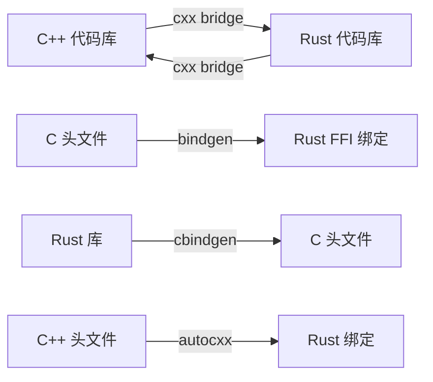
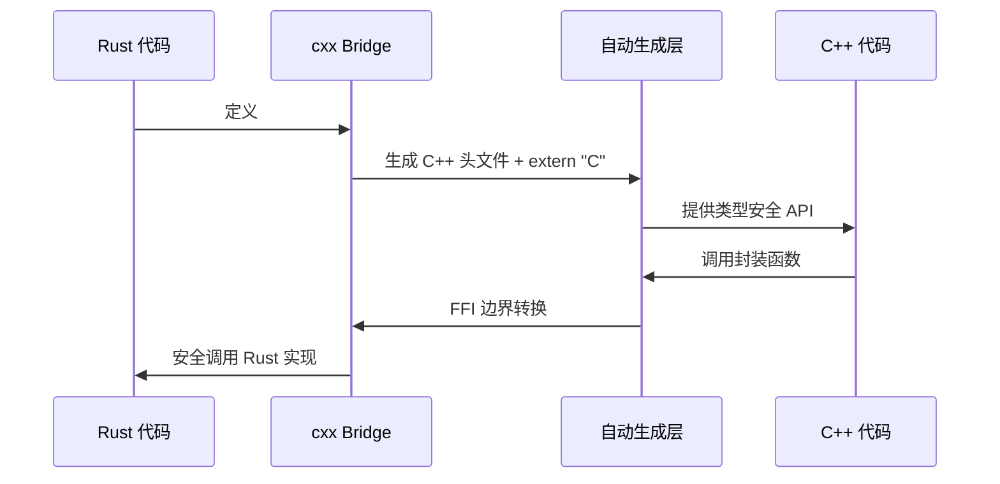

# C++ ↔ Rust 互操作评估 (Cxx Rust Interop Evaluation) {#c-rust-互操作评估}

> **EN**: Cxx Rust Interop Evaluation
> **Summary**: C++ ↔ Rust 互操作评估 Cxx Rust Interop Evaluation. (stub/archive redirect)
>
> **Rust 版本**: 1.97.0+ (Edition 2024)
> **分级**: [A]
> **Bloom 层级**: L3-L4
> **创建日期**: 2026-05-08
> **最后更新**: 2026-05-08
> **Rust 版本**: 1.97.0+ (Edition 2024)
> **状态**: 📝 评估草案
> **相关目标**: Rust 2026 Project Goal — C++ ↔ Rust Interoperability
>
> **受众**: [进阶]
> **内容分级**: [专家级]

---

---

## 2. 现有方案对比 {#2-现有方案对比}
>
> **来源: [Rust Official Docs](https://doc.rust-lang.org/)**

| 方案 | 方向 | 自动化程度 | 安全性 | 适用场景 |
| :--- | :--- | :--- | :--- | :--- |
| `cxx` | 双向 | 中（需手写 `bridge`） | ✅ 高（编译期检查） | 新模块互调、结构化数据 |
| `bindgen` | C/C++ → Rust | 高（自动生成） | ⚠️ 低（原始 FFI） | 调用现有 C 库 |
| `cbindgen` | Rust → C/C++ | 高（自动生成头文件） | ⚠️ 中（需手动审计） | 将 Rust 库导出为 C API |
| `autocxx` | C++ → Rust | 极高（解析 C++ 头文件） | ⚠️ 中（依赖 `bindgen`） | 大规模 C++ 代码库迁移 |



**选型建议**：

- 新项目或需要**双向安全保证**时，优先使用 `cxx`。
- 仅需单向调用遗留 C 库时，`bindgen` 仍是标准工具。
- 需要批量自动化生成绑定且接受一定 `unsafe` 审计成本时，考虑 `autocxx`。

---

## 3. `cxx` 的安全绑定原理 {#3-cxx-的安全绑定原理}
>
> **来源: [Rust Official Docs](https://doc.rust-lang.org/)**

`cxx` 的核心创新在于引入了**共享类型系统（Type System）**和**编译期验证**：

1. **`bridge` 宏（Macro）**：在 Rust 侧定义 `#[cxx::bridge]` 模块（Module），声明双方共享的函数和类型。
2. **自动生成 FFI 层**：`cxx` 的构建脚本（`cxx-build`）自动生成对应的 C++ 头文件和 `extern "C"` 封装函数。
3. **类型安全检查**：只有满足 `cxx` 白名单的类型（如 `String`、`Vec<T>`、`Box<T>`、自定义 `struct`）才能跨边界传递，杜绝原始指针（Raw Pointer）的随意使用。
4. **生命周期（Lifetimes）隔离**：`cxx` 不允许在 C++ 中持有 Rust 引用（Reference）的同时调用 Rust 代码，避免悬垂引用。



---

## 4. 场景：将 Rust 库集成到 C++ {#4-场景将-rust-库集成到-c}
>
> **来源: [Rust Official Docs](https://doc.rust-lang.org/)**

**典型用例**：用 Rust 重写 C++ 项目中的安全关键模块（如加密、序列化），然后在现有 C++ 代码中调用。

**流程**：

1. 在 Rust 侧创建 `lib.rs`，暴露 `#[cxx::bridge]`。
2. 使用 `cxx-build` 在 `build.rs` 中编译并链接 C++ 代码。
3. C++ 侧包含生成的头文件，直接调用 Rust 函数。

**优势**：

- C++ 开发者无需了解 Rust 所有权（Ownership）模型，只需调用生成的安全 API。
- Rust 侧的错误处理（Error Handling）可以通过 `Result<T>` 自动转换为 C++ 异常或错误码（取决于配置）。

---

## 5. 场景：将 C++ 库暴露给 Rust {#5-场景将-c-库暴露给-rust}
>
> **来源: [Rust Official Docs](https://doc.rust-lang.org/)**

**典型用例**：在 Rust 项目中使用成熟的 C++ 库（如 `OpenCV`、`Protocol Buffers`、游戏引擎核心）。

**流程**：

1. 在 Rust 侧定义 `#[cxx::bridge]`，声明需要使用的 C++ 类和方法。
2. `cxx-build` 编译对应的 C++ 源文件，并生成 Rust FFI 绑定。
3. Rust 代码通过生成的模块调用 C++ 函数。

**注意事项**：

- `cxx` 不支持直接映射 C++ 类继承和虚函数，需要手动编写 C++ 侧的 "shim" 层进行封装。
- 对于模板类（如 `std::vector<T>`），`cxx` 只支持显式实例化后的具体类型（如 `std::vector<uint8_t>`）。

---

## 6. 限制与边界 {#6-限制与边界}
>
> **来源: [Rust Official Docs](https://doc.rust-lang.org/)**

尽管 `cxx` 大幅提升了互操作的安全性，但以下 C++ 特性目前仍难以直接跨越边界：

| 特性 | `cxx` 支持 | 说明 |
| :--- | :--- | :--- |
| 异常处理 (`throw`/`catch`) | ❌ 不支持 | C++ 异常无法安全地传播到 Rust；需在 C++ 侧捕获并转为错误码 |
| 模板 (`template<T>`) | ⚠️ 有限 | 仅支持显式实例化后的具体类型，无法泛型（Generics）传递 |
| 虚函数 / 多态 | ❌ 不支持 | 需手动编写 C++ 封装层暴露纯函数接口 |
| `std::` 容器 | ⚠️ 有限 | 仅支持 `std::string`、`std::vector<uint8_t>` 等少数类型 |
| 原始指针 (`*const T`) | ⚠️ 受限 | 不推荐直接使用；应使用 `Box<T>` 或 `UniquePtr<T>` |
| 回调 / 闭包（Closures） | ⚠️ 有限 | 支持函数指针，但不支持捕获环境的 Rust 闭包传递到 C++ |

> **版本标注**: `cxx` 1.0+ 承诺保持 API 稳定，但上述限制短期内无完全消除的计划，属于设计层面的权衡。

---

> 本节通用概念解释请参见 `concept/` 对应权威页。
> 本节通用概念解释请参见 `concept/` 对应权威页。
>
## 9. 代码示例 {#9-代码示例}
>
> **来源: [Rust Official Docs](https://doc.rust-lang.org/)**

以下示例为概念性代码，展示 `cxx` 的典型用法，无需编译即可理解其结构。

### 9.1 Rust 调用 C++ {#91-rust-调用-c}

> **来源: [Rust Standard Library](https://doc.rust-lang.org/std/)**
>
> **来源: [Rust Official Docs](https://doc.rust-lang.org/)**

```rust,ignore
// rust/src/main.rs
#[cxx::bridge]
mod ffi {
    // C++ 命名空间与头文件
    unsafe extern "C++" {
        include!("demo/include/blob_store.h");

        type BlobStoreClient;

        fn new_blob_store_client() -> UniquePtr<BlobStoreClient>;
        fn put(self: Pin<&mut BlobStoreClient>, parts: &Vec<u8>) -> u64;
        fn tag(self: &BlobStoreClient, blobid: u64, tag: &str);
        fn metadata(self: &BlobStoreClient, blobid: u64) -> &str;
    }
}

fn main() {
    let mut client = ffi::new_blob_store_client();
    let blobid = client.pin_mut().put(&vec![0, 1, 2, 3]);
    client.tag(blobid, "important");
    println!("metadata: {}", client.metadata(blobid));
}
```

```cpp
// cpp/include/blob_store.h
#pragma once
#include <cstdint>
#include <string>
#include <vector>

class BlobStoreClient {
public:
    uint64_t put(const std::vector<uint8_t>& parts);
    void tag(uint64_t blobid, const std::string& tag);
    std::string metadata(uint64_t blobid) const;
};

std::unique_ptr<BlobStoreClient> new_blob_store_client();
```

### 9.2 C++ 调用 Rust {#92-c-调用-rust}

> **来源: [Rustonomicon - doc.rust-lang.org/nomicon](https://doc.rust-lang.org/nomicon/)**

```rust,ignore
// rust/src/lib.rs
#[cxx::bridge]
mod ffi {
    extern "Rust" {
        type Multiplier;

        fn new_multiplier(factor: i32) -> Box<Multiplier>;
        fn multiply(self: &Multiplier, input: i32) -> i32;
    }
}

pub struct Multiplier {
    factor: i32,
}

fn new_multiplier(factor: i32) -> Box<Multiplier> {
    Box::new(Multiplier { factor })
}

impl Multiplier {
    fn multiply(&self, input: i32) -> i32 {
        self.factor * input
    }
}
```

```cpp
// cpp/src/main.cpp
#include "rust/cxx.h"
#include "rust_project/src/lib.rs.h"

int main() {
    rust::Box<Multiplier> mul = new_multiplier(7);
    int result = mul->multiply(6);  // 42
    return 0;
}
```

---

## 10. 总结 {#10-总结}
>
> **[来源: [The Rust Programming Language](https://doc.rust-lang.org/book/)]**

C++ ↔ Rust 互操作是 Rust 2026 的核心目标之一。当前社区以 `cxx` 为首选方案，它在自动化程度、类型安全性和开发体验之间取得了最佳平衡。对于需要直接操作 C API 的场景，`bindgen` 和 `cbindgen` 仍是不可或缺的工具。

开发者在实践中应注意：

- 优先使用 `cxx` 的共享类型系统，避免手动传递原始指针。
- 明确界定 `unsafe` 边界，将 C++ 侧视为不可信输入源。
- 关注 `autocxx` 的演进，它可能在大型 C++ 代码库迁移中进一步降低人工成本。

---

## 📋 复查记录 {#复查记录}
>
> **[来源: [Rust Standard Library](https://doc.rust-lang.org/std/)]**

| 日期 | 复查人 | 内容 | 状态 |
| :--- | :--- | :--- | :--- |
| 2026-05-08 | 项目团队 | 初稿创建，涵盖方案对比、`cxx` 原理、场景与限制 | ✅ 完成 |

---

**维护者**: Rust 学习项目团队
**下次审查**: 2026-06-08
**相关文档**: [Rust for Linux 工具链指南](../../concept/07_future/19_rust_for_linux.md)

---

> **权威来源**: [Rust Reference](https://doc.rust-lang.org/reference/), [The Rust Programming Language](https://doc.rust-lang.org/book/), [Rust Standard Library](https://doc.rust-lang.org/std/)
>
> **权威来源对齐变更日志**: 2026-05-19 新增 Rust Reference、TRPL、标准库官方来源标注 [Authority Source Sprint Batch 8](../../concept/00_meta/02_sources/international_authority_index.md)

**文档版本**: 1.1
**对应 Rust 版本**: 1.97.0+ (Edition 2024)
**最后更新**: 2026-05-19
**状态**: ✅ 权威来源对齐完成 (Batch 8)

---

## 相关概念 {#相关概念}
>
> **[来源: [Rustonomicon](https://doc.rust-lang.org/nomicon/)]**

- [05_guides 目录](README.md)
- [docs 索引](../README.md)

---

## 权威来源索引 {#权威来源索引}

> **来源: [Wikipedia - Rust (programming language)](https://en.wikipedia.org/wiki/Rust_(programming_language))**
> **来源: [Rust Reference](https://doc.rust-lang.org/reference/)**
> **来源: [The Rust Programming Language](https://doc.rust-lang.org/book/)**
> **来源: [Rust Standard Library](https://doc.rust-lang.org/std/)**
> **来源: [ACM](https://dl.acm.org/)**
> **来源: [IEEE](https://standards.ieee.org/)**
> **来源: [Rust RFCs](https://github.com/rust-lang/rfcs)**
> **来源: [Rustonomicon](https://doc.rust-lang.org/nomicon/)**
> **来源: [ACM](https://dl.acm.org/)**
> **来源: [IEEE](https://standards.ieee.org/)**
> **来源: [Rust RFCs](https://github.com/rust-lang/rfcs)**
> **来源: [Rust Standard Library](https://doc.rust-lang.org/std/)**
> **来源: [POPL](https://www.sigplan.org/Conferences/POPL/)**
> **来源: [PLDI](https://www.sigplan.org/Conferences/PLDI/)**
> **来源: [Wikipedia - Memory Safety](https://en.wikipedia.org/wiki/Memory_Safety)**

---
