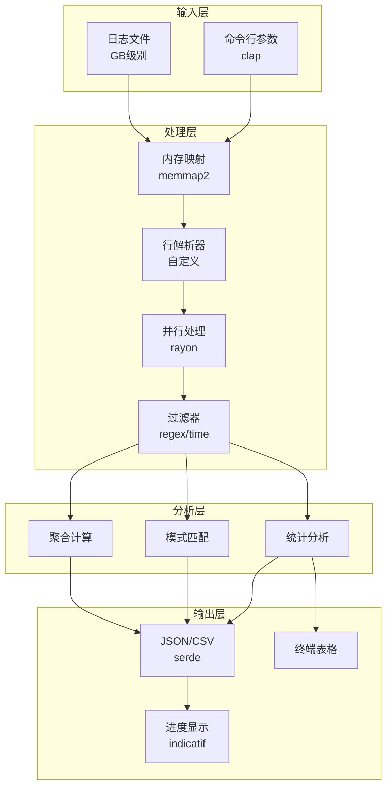
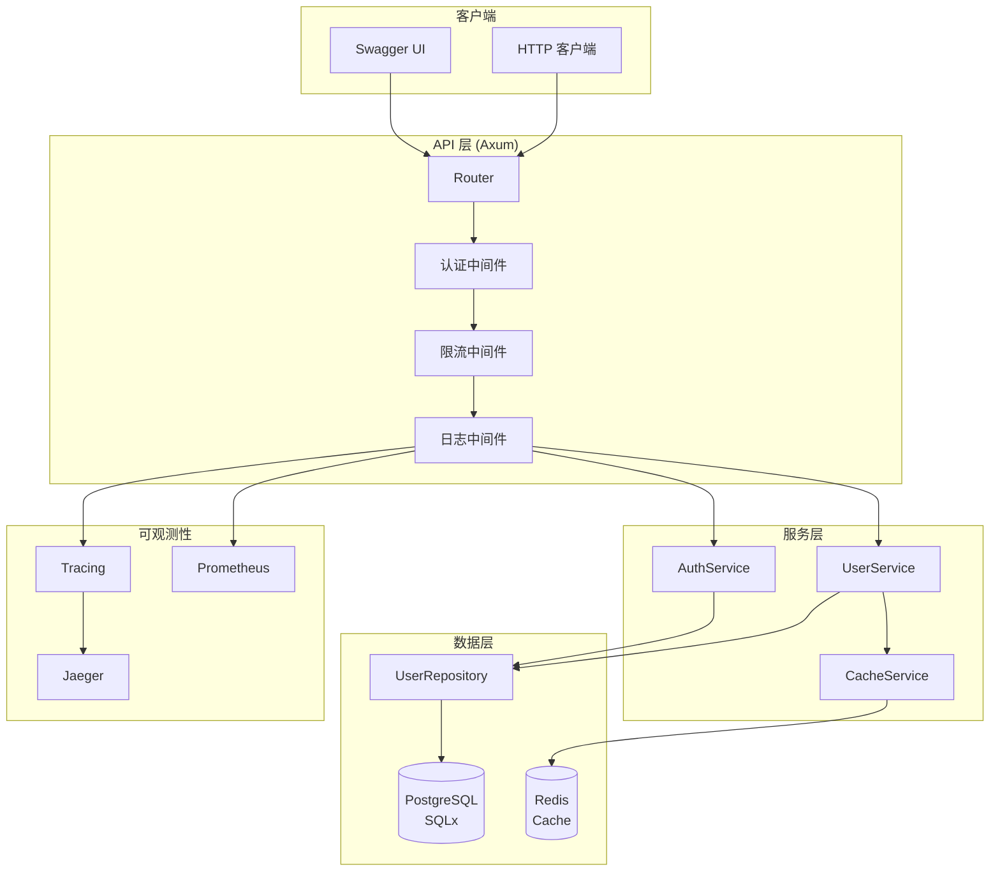
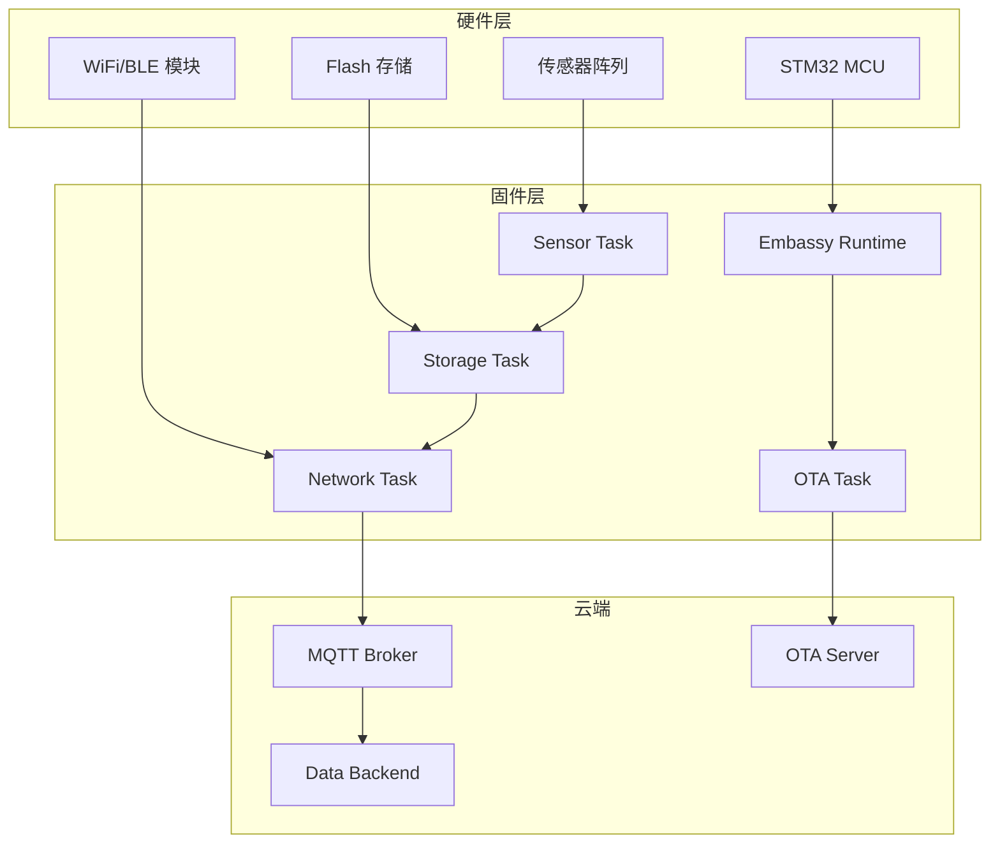

# Rust 生产级项目示例

本文档提供了三个完整的端到端 Rust 生产级项目示例，涵盖 CLI 工具、Web API 服务和嵌入式应用三种典型场景。每个项目都包含完整的代码实现、架构设计、测试和部署说明。

---

## 目录

- [Rust 生产级项目示例](#rust-生产级项目示例)
  - [目录](#目录)
  - [项目概述](#项目概述)
    - [目标读者](#目标读者)
    - [项目特点](#项目特点)
  - [项目 1: CLI 工具 - 高性能日志分析器](#项目-1-cli-工具---高性能日志分析器)
    - [1.1 项目概述](#11-项目概述)
      - [功能特性](#功能特性)
      - [技术栈](#技术栈)
    - [1.2 架构设计](#12-架构设计)
      - [模块职责](#模块职责)
    - [1.3 项目结构](#13-项目结构)
    - [1.4 完整实现](#14-完整实现)
      - [Cargo.toml](#cargotoml)
      - [src/lib.rs](#srclibrs)
      - [src/cli.rs](#srcclirs)
      - [src/parser.rs](#srcparserrs)

---

## 项目概述

### 目标读者

- 有一定 Rust 基础，希望学习生产级开发实践的开发者
- 需要将 Rust 应用到实际项目的团队
- 寻找完整项目参考的架构师和技术负责人

### 项目特点

| 特性 | 项目 1 (CLI) | 项目 2 (Web) | 项目 3 (Embedded) |
|------|--------------|--------------|-------------------|
| 复杂度 | 中等 | 高 | 高 |
| 并发模型 | 多线程/异步 | 异步 | 异步 (Embassy) |
| 内存管理 | 堆分配 | 堆分配 | 静态/栈分配 |
| 错误处理 | anyhow/thiserror | 自定义错误类型 | Result/Option |
| 测试策略 | 单元/基准测试 | 单元/集成测试 | 单元/硬件测试 |
| 部署方式 | 二进制分发 | 容器化部署 | 固件刷写 |

---

## 项目 1: CLI 工具 - 高性能日志分析器

### 1.1 项目概述

高性能日志分析器是一个命令行工具，用于快速解析和分析大型日志文件。它利用 Rust 的零成本抽象和内存安全特性，能够高效处理 GB 级别的日志数据。

#### 功能特性

- **高性能解析**: 使用内存映射文件，避免不必要的数据拷贝
- **并发处理**: 利用 Rayon 进行并行处理，充分利用多核 CPU
- **灵活过滤**: 支持正则表达式和时间范围过滤
- **多种输出**: 支持 JSON、CSV 和终端表格格式
- **实时进度**: 显示处理进度和统计信息

#### 技术栈

- **异步 I/O**: tokio
- **内存映射**: memmap2
- **并行处理**: rayon
- **CLI 解析**: clap
- **日志追踪**: tracing
- **错误处理**: anyhow + thiserror
- **序列化**: serde + serde_json + csv
- **测试**: criterion (基准测试)

### 1.2 架构设计



#### 模块职责

| 模块 | 职责 | 关键技术 |
|------|------|----------|
| `main.rs` | CLI 入口，参数解析，流程编排 | clap, tracing |
| `parser.rs` | 日志文件解析，内存映射 | memmap2, nom |
| `analyzer.rs` | 统计分析，过滤逻辑 | rayon, regex |
| `reporter.rs` | 报告生成，多格式输出 | serde, csv |
| `lib.rs` | 公共类型和接口 | - |

### 1.3 项目结构

```
log-analyzer/
├── Cargo.toml
├── Cargo.lock
├── README.md
├── src/
│   ├── main.rs
│   ├── lib.rs
│   ├── parser.rs
│   ├── analyzer.rs
│   ├── reporter.rs
│   └── cli.rs
├── tests/
│   ├── integration_tests.rs
│   └── fixtures/
│       ├── sample.log
│       └── large.log.gz
├── benches/
│   └── parser_benchmark.rs
└── examples/
    └── custom_filter.rs
```

### 1.4 完整实现

#### Cargo.toml

```toml
[package]
name = "log-analyzer"
version = "1.0.0"
edition = "2021"
authors = ["Your Name <your.email@example.com>"]
description = "High-performance log analysis tool"
license = "MIT OR Apache-2.0"
repository = "https://github.com/yourusername/log-analyzer"
keywords = ["log", "analyzer", "cli", "performance"]
categories = ["command-line-utilities", "development-tools"]
rust-version = "1.75"

[[bin]]
name = "log-analyzer"
path = "src/main.rs"

[dependencies]
# 异步运行时
tokio = { version = "1.35", features = ["full"] }

# 内存映射
memmap2 = "0.9"

# 并行处理
rayon = "1.8"

# CLI 解析
clap = { version = "4.4", features = ["derive", "env"] }

# 错误处理
anyhow = "1.0"
thiserror = "1.0"

# 日志追踪
tracing = "0.1"
tracing-subscriber = { version = "0.3", features = ["env-filter", "fmt"] }

# 序列化
serde = { version = "1.0", features = ["derive"] }
serde_json = "1.0"
csv = "1.3"

# 正则表达式
regex = "1.10"

# 进度显示
indicatif = "0.17"

# 日期时间
chrono = { version = "0.4", features = ["serde"] }

# 表格输出
comfy-table = "7.1"

# 字节解析
nom = "7.1"

# 压缩支持
flate2 = "1.0"

[dev-dependencies]
# 测试
tempfile = "3.9"
pretty_assertions = "1.4"

# 基准测试
criterion = { version = "0.5", features = ["html_reports"] }
proptest = "1.4"

[[bench]]
name = "parser_benchmark"
harness = false

[profile.release]
opt-level = 3
lto = true
codegen-units = 1
panic = "abort"
strip = true

[profile.bench]
debug = true
```

#### src/lib.rs

```rust
//! 高性能日志分析器库
//!
//! 提供日志解析、分析和报告生成功能

pub mod analyzer;
pub mod cli;
pub mod parser;
pub mod reporter;

use chrono::{DateTime, Utc};
use serde::{Deserialize, Serialize};
use thiserror::Error;

/// 日志分析器错误类型
#[derive(Error, Debug)]
pub enum LogAnalyzerError {
    #[error("IO error: {0}")]
    Io(#[from] std::io::Error),

    #[error("Parse error: {0}")]
    Parse(String),

    #[error("Regex error: {0}")]
    Regex(#[from] regex::Error),

    #[error("Serialization error: {0}")]
    Serialization(#[from] serde_json::Error),

    #[error("CSV error: {0}")]
    Csv(#[from] csv::Error),

    #[error("Invalid time range: {0}")]
    InvalidTimeRange(String),

    #[error("Memory mapping failed: {0}")]
    MemoryMap(String),
}

/// 分析结果类型
pub type Result<T> = std::result::Result<T, LogAnalyzerError>;

/// 日志条目结构
#[derive(Debug, Clone, Serialize, Deserialize, PartialEq)]
pub struct LogEntry {
    /// 时间戳
    pub timestamp: DateTime<Utc>,
    /// 日志级别
    pub level: LogLevel,
    /// 日志来源模块
    pub module: String,
    /// 日志消息
    pub message: String,
    /// 线程ID
    pub thread_id: Option<String>,
    /// 额外字段
    #[serde(flatten)]
    pub extra: std::collections::HashMap<String, serde_json::Value>,
}

/// 日志级别
#[derive(Debug, Clone, Copy, Serialize, Deserialize, PartialEq, Eq, Hash)]
#[serde(rename_all = "UPPERCASE")]
pub enum LogLevel {
    Trace,
    Debug,
    Info,
    Warn,
    Error,
    Fatal,
}

impl LogLevel {
    /// 获取日志级别的优先级数值
    pub fn priority(&self) -> u8 {
        match self {
            LogLevel::Trace => 0,
            LogLevel::Debug => 1,
            LogLevel::Info => 2,
            LogLevel::Warn => 3,
            LogLevel::Error => 4,
            LogLevel::Fatal => 5,
        }
    }
}

impl std::str::FromStr for LogLevel {
    type Err = LogAnalyzerError;

    fn from_str(s: &str) -> Result<Self> {
        match s.to_uppercase().as_str() {
            "TRACE" | "TRC" => Ok(LogLevel::Trace),
            "DEBUG" | "DBG" => Ok(LogLevel::Debug),
            "INFO" | "INF" => Ok(LogLevel::Info),
            "WARN" | "WARNING" | "WRN" => Ok(LogLevel::Warn),
            "ERROR" | "ERR" => Ok(LogLevel::Error),
            "FATAL" | "FTL" => Ok(LogLevel::Fatal),
            _ => Err(LogAnalyzerError::Parse(format!("Unknown log level: {}", s))),
        }
    }
}

impl std::fmt::Display for LogLevel {
    fn fmt(&self, f: &mut std::fmt::Formatter<'_>) -> std::fmt::Result {
        write!(f, "{:?}", self)
    }
}

/// 过滤配置
#[derive(Debug, Clone, Default)]
pub struct FilterConfig {
    /// 最小日志级别
    pub min_level: Option<LogLevel>,
    /// 模块过滤
    pub module_filter: Option<regex::Regex>,
    /// 消息过滤
    pub message_filter: Option<regex::Regex>,
    /// 时间范围开始
    pub start_time: Option<DateTime<Utc>>,
    /// 时间范围结束
    pub end_time: Option<DateTime<Utc>>,
    /// 线程ID过滤
    pub thread_filter: Option<String>,
}

impl FilterConfig {
    /// 创建新的过滤配置
    pub fn new() -> Self {
        Self::default()
    }

    /// 设置最小日志级别
    pub fn min_level(mut self, level: LogLevel) -> Self {
        self.min_level = Some(level);
        self
    }

    /// 检查日志条目是否匹配过滤条件
    pub fn matches(&self, entry: &LogEntry) -> bool {
        // 检查日志级别
        if let Some(ref min_level) = self.min_level {
            if entry.level.priority() < min_level.priority() {
                return false;
            }
        }

        // 检查模块过滤
        if let Some(ref module_regex) = self.module_filter {
            if !module_regex.is_match(&entry.module) {
                return false;
            }
        }

        // 检查消息过滤
        if let Some(ref message_regex) = self.message_filter {
            if !message_regex.is_match(&entry.message) {
                return false;
            }
        }

        // 检查时间范围
        if let Some(start) = self.start_time {
            if entry.timestamp < start {
                return false;
            }
        }
        if let Some(end) = self.end_time {
            if entry.timestamp > end {
                return false;
            }
        }

        // 检查线程过滤
        if let Some(ref thread) = self.thread_filter {
            if entry.thread_id.as_ref() != Some(thread) {
                return false;
            }
        }

        true
    }
}

/// 分析配置
#[derive(Debug, Clone)]
pub struct AnalysisConfig {
    /// 过滤配置
    pub filter: FilterConfig,
    /// 是否计算统计信息
    pub compute_stats: bool,
    /// 是否提取模式
    pub extract_patterns: bool,
    /// 热门消息数量
    pub top_messages_count: usize,
}

impl Default for AnalysisConfig {
    fn default() -> Self {
        Self {
            filter: FilterConfig::default(),
            compute_stats: true,
            extract_patterns: false,
            top_messages_count: 10,
        }
    }
}

/// 分析统计结果
#[derive(Debug, Clone, Serialize, Deserialize)]
pub struct AnalysisStats {
    /// 总条目数
    pub total_entries: usize,
    /// 匹配条目数
    pub matched_entries: usize,
    /// 各级别统计
    pub level_counts: std::collections::HashMap<LogLevel, usize>,
    /// 各模块统计
    pub module_counts: std::collections::HashMap<String, usize>,
    /// 时间范围
    pub time_range: Option<(DateTime<Utc>, DateTime<Utc>)>,
    /// 平均消息长度
    pub avg_message_length: f64,
    /// 处理时间（毫秒）
    pub processing_time_ms: u64,
}

impl AnalysisStats {
    /// 创建新的统计结果
    pub fn new() -> Self {
        Self {
            total_entries: 0,
            matched_entries: 0,
            level_counts: std::collections::HashMap::new(),
            module_counts: std::collections::HashMap::new(),
            time_range: None,
            avg_message_length: 0.0,
            processing_time_ms: 0,
        }
    }

    /// 合并另一个统计结果
    pub fn merge(&mut self, other: &AnalysisStats) {
        self.total_entries += other.total_entries;
        self.matched_entries += other.matched_entries;

        for (level, count) in &other.level_counts {
            *self.level_counts.entry(*level).or_insert(0) += count;
        }

        for (module, count) in &other.module_counts {
            *self.module_counts.entry(module.clone()).or_insert(0) += count;
        }

        // 更新时间范围
        if let Some((other_start, other_end)) = other.time_range {
            self.time_range = match self.time_range {
                None => Some((other_start, other_end)),
                Some((start, end)) => Some((
                    start.min(other_start),
                    end.max(other_end),
                )),
            };
        }
    }
}

impl Default for AnalysisStats {
    fn default() -> Self {
        Self::new()
    }
}

/// 输出格式
#[derive(Debug, Clone, Copy, PartialEq, Eq)]
pub enum OutputFormat {
    Json,
    Csv,
    Table,
    Pretty,
}

impl std::str::FromStr for OutputFormat {
    type Err = LogAnalyzerError;

    fn from_str(s: &str) -> Result<Self> {
        match s.to_lowercase().as_str() {
            "json" => Ok(OutputFormat::Json),
            "csv" => Ok(OutputFormat::Csv),
            "table" => Ok(OutputFormat::Table),
            "pretty" => Ok(OutputFormat::Pretty),
            _ => Err(LogAnalyzerError::Parse(format!("Unknown output format: {}", s))),
        }
    }
}

#[cfg(test)]
mod tests {
    use super::*;

    #[test]
    fn test_log_level_priority() {
        assert!(LogLevel::Error.priority() > LogLevel::Warn.priority());
        assert!(LogLevel::Warn.priority() > LogLevel::Info.priority());
        assert!(LogLevel::Info.priority() > LogLevel::Debug.priority());
        assert!(LogLevel::Debug.priority() > LogLevel::Trace.priority());
    }

    #[test]
    fn test_log_level_from_str() {
        assert_eq!("ERROR".parse::<LogLevel>().unwrap(), LogLevel::Error);
        assert_eq!("warn".parse::<LogLevel>().unwrap(), LogLevel::Warn);
        assert_eq!("INF".parse::<LogLevel>().unwrap(), LogLevel::Info);
    }

    #[test]
    fn test_filter_config_matches() {
        let config = FilterConfig::new().min_level(LogLevel::Warn);

        let entry = LogEntry {
            timestamp: Utc::now(),
            level: LogLevel::Error,
            module: "test".to_string(),
            message: "test message".to_string(),
            thread_id: None,
            extra: std::collections::HashMap::new(),
        };

        assert!(config.matches(&entry));

        let debug_entry = LogEntry {
            timestamp: Utc::now(),
            level: LogLevel::Debug,
            module: "test".to_string(),
            message: "debug message".to_string(),
            thread_id: None,
            extra: std::collections::HashMap::new(),
        };

        assert!(!config.matches(&debug_entry));
    }

    #[test]
    fn test_analysis_stats_merge() {
        let mut stats1 = AnalysisStats::new();
        stats1.total_entries = 100;
        stats1.matched_entries = 50;
        stats1.level_counts.insert(LogLevel::Info, 30);
        stats1.level_counts.insert(LogLevel::Error, 20);

        let mut stats2 = AnalysisStats::new();
        stats2.total_entries = 50;
        stats2.matched_entries = 25;
        stats2.level_counts.insert(LogLevel::Info, 15);
        stats2.level_counts.insert(LogLevel::Warn, 10);

        stats1.merge(&stats2);

        assert_eq!(stats1.total_entries, 150);
        assert_eq!(stats1.matched_entries, 75);
        assert_eq!(stats1.level_counts.get(&LogLevel::Info), Some(&45));
        assert_eq!(stats1.level_counts.get(&LogLevel::Error), Some(&20));
        assert_eq!(stats1.level_counts.get(&LogLevel::Warn), Some(&10));
    }
}
```

#### src/cli.rs

```rust
//! 命令行参数解析

use crate::{FilterConfig, LogAnalyzerError, LogLevel, OutputFormat, Result};
use clap::{Parser, Subcommand, ValueEnum};
use std::path::PathBuf;

/// 高性能日志分析器
#[derive(Parser, Debug)]
#[command(
    name = "log-analyzer",
    about = "High-performance log file analyzer",
    version = "1.0.0",
    author = "Your Name <your.email@example.com>"
)]
#[command(arg_required_else_help = true)]
pub struct Cli {
    /// 子命令
    #[command(subcommand)]
    pub command: Commands,

    /// 日志文件路径
    #[arg(short, long, global = true, env = "LOG_ANALYZER_INPUT")]
    pub input: Option<PathBuf>,

    /// 输出格式
    #[arg(short, long, global = true, default_value = "table")]
    pub format: OutputFormatArg,

    /// 输出文件路径（默认输出到stdout）
    #[arg(short, long, global = true)]
    pub output: Option<PathBuf>,

    /// 日志级别过滤
    #[arg(short = 'l', long, global = true)]
    pub level: Option<LogLevelArg>,

    /// 模块过滤（正则表达式）
    #[arg(short, long, global = true)]
    pub module: Option<String>,

    /// 消息过滤（正则表达式）
    #[arg(short = 'm', long, global = true)]
    pub message: Option<String>,

    /// 时间范围开始（ISO 8601格式）
    #[arg(long, global = true, value_name = "DATETIME")]
    pub start_time: Option<String>,

    /// 时间范围结束（ISO 8601格式）
    #[arg(long, global = true, value_name = "DATETIME")]
    pub end_time: Option<String>,

    /// 线程ID过滤
    #[arg(long, global = true)]
    pub thread: Option<String>,

    /// 启用详细日志
    #[arg(short, long, global = true, action = clap::ArgAction::Count)]
    pub verbose: u8,
}

#[derive(Subcommand, Debug)]
pub enum Commands {
    /// 分析日志文件
    Analyze {
        /// 是否计算统计信息
        #[arg(short, long, default_value = "true")]
        stats: bool,

        /// 显示热门消息数量
        #[arg(short, long, default_value = "10")]
        top: usize,
    },

    /// 查找特定模式
    Find {
        /// 搜索模式（正则表达式）
        #[arg(required = true)]
        pattern: String,

        /// 显示匹配行的上下文行数
        #[arg(short = 'C', long, default_value = "2")]
        context: usize,
    },

    /// 导出日志条目
    Export {
        /// 导出字段列表（逗号分隔）
        #[arg(short, long, default_value = "timestamp,level,module,message")]
        fields: String,

        /// 限制导出的条目数
        #[arg(short, long)]
        limit: Option<usize>,
    },

    /// 生成摘要报告
    Summary {
        /// 按模块分组
        #[arg(short, long)]
        by_module: bool,

        /// 按级别分组
        #[arg(short, long)]
        by_level: bool,

        /// 按时间分组（分钟/小时/天）
        #[arg(short, long, value_enum)]
        by_time: Option<TimeGrouping>,
    },
}

#[derive(Debug, Clone, Copy, ValueEnum)]
pub enum OutputFormatArg {
    Json,
    Csv,
    Table,
    Pretty,
}

impl From<OutputFormatArg> for OutputFormat {
    fn from(arg: OutputFormatArg) -> Self {
        match arg {
            OutputFormatArg::Json => OutputFormat::Json,
            OutputFormatArg::Csv => OutputFormat::Csv,
            OutputFormatArg::Table => OutputFormat::Table,
            OutputFormatArg::Pretty => OutputFormat::Pretty,
        }
    }
}

#[derive(Debug, Clone, Copy, ValueEnum)]
pub enum LogLevelArg {
    Trace,
    Debug,
    Info,
    Warn,
    Error,
    Fatal,
}

impl From<LogLevelArg> for LogLevel {
    fn from(arg: LogLevelArg) -> Self {
        match arg {
            LogLevelArg::Trace => LogLevel::Trace,
            LogLevelArg::Debug => LogLevel::Debug,
            LogLevelArg::Info => LogLevel::Info,
            LogLevelArg::Warn => LogLevel::Warn,
            LogLevelArg::Error => LogLevel::Error,
            LogLevelArg::Fatal => LogLevel::Fatal,
        }
    }
}

#[derive(Debug, Clone, Copy, ValueEnum)]
pub enum TimeGrouping {
    Minute,
    Hour,
    Day,
}

impl Cli {
    /// 获取输入文件路径
    pub fn input_file(&self) -> Option<&PathBuf> {
        self.input.as_ref()
    }

    /// 获取输出文件路径
    pub fn output_file(&self) -> Option<&PathBuf> {
        self.output.as_ref()
    }

    /// 获取输出格式
    pub fn output_format(&self) -> OutputFormat {
        self.format.into()
    }

    /// 构建过滤配置
    pub fn build_filter_config(&self) -> Result<FilterConfig> {
        let mut config = FilterConfig::new();

        // 设置最小日志级别
        if let Some(level) = self.level {
            config = config.min_level(level.into());
        }

        // 设置模块过滤
        if let Some(ref module) = self.module {
            config.module_filter = Some(regex::Regex::new(module)?);
        }

        // 设置消息过滤
        if let Some(ref message) = self.message {
            config.message_filter = Some(regex::Regex::new(message)?);
        }

        // 设置时间范围
        if let Some(ref start) = self.start_time {
            config.start_time = Some(
                chrono::DateTime::parse_from_rfc3339(start)
                    .map_err(|e| LogAnalyzerError::Parse(format!("Invalid start time: {}", e)))?
                    .with_timezone(&chrono::Utc),
            );
        }

        if let Some(ref end) = self.end_time {
            config.end_time = Some(
                chrono::DateTime::parse_from_rfc3339(end)
                    .map_err(|e| LogAnalyzerError::Parse(format!("Invalid end time: {}", e)))?
                    .with_timezone(&chrono::Utc),
            );
        }

        // 设置线程过滤
        if let Some(ref thread) = self.thread {
            config.thread_filter = Some(thread.clone());
        }

        Ok(config)
    }

    /// 设置日志级别
    pub fn setup_logging(&self) {
        let level = match self.verbose {
            0 => "warn",
            1 => "info",
            2 => "debug",
            _ => "trace",
        };

        tracing_subscriber::fmt()
            .with_env_filter(
                tracing_subscriber::EnvFilter::new(format!("log_analyzer={}", level))
                    .add_directive(format!("{}={}", env!("CARGO_PKG_NAME"), level).parse().unwrap()),
            )
            .with_target(true)
            .with_thread_ids(true)
            .with_file(true)
            .with_line_number(true)
            .init();
    }
}

#[cfg(test)]
mod tests {
    use super::*;

    #[test]
    fn test_cli_parse() {
        let cli = Cli::parse_from(["log-analyzer", "-i", "test.log", "analyze"]);
        assert!(matches!(cli.command, Commands::Analyze { .. }));
        assert_eq!(cli.input, Some(PathBuf::from("test.log")));
    }

    #[test]
    fn test_filter_config_build() {
        let cli = Cli::parse_from([
            "log-analyzer",
            "-i", "test.log",
            "-l", "warn",
            "--module", "^app::",
            "analyze",
        ]);

        let config = cli.build_filter_config().unwrap();
        assert_eq!(config.min_level, Some(LogLevel::Warn));
        assert!(config.module_filter.is_some());
    }
}
```

#### src/parser.rs

```rust
//! 日志文件解析器
//!
//! 支持内存映射文件解析，提供高性能的日志条目提取

use crate::{LogAnalyzerError, LogEntry, LogLevel, Result};
use chrono::{DateTime, Utc};
use memmap2::Mmap;
use std::{
    fs::File,
    io::{self, BufRead, BufReader, Read},
    path::Path,
    str::FromStr,
};

/// 日志解析器 trait
trait LogParser: Send + Sync {
    /// 解析单行日志
    fn parse_line(&self, line: &str) -> Result<Option<LogEntry>>;

    /// 获取解析器名称
    fn name(&self) -> &str;
}

/// 默认日志格式解析器（支持常见的日志格式）
pub struct DefaultLogParser;

impl DefaultLogParser {
    pub fn new() -> Self {
        Self
    }

    /// 尝试解析 ISO 8601 格式时间戳
    fn parse_timestamp(&self, s: &str) -> Option<DateTime<Utc>> {
        // 尝试多种时间格式
        let formats = [
            "%Y-%m-%dT%H:%M:%S%.3fZ",
            "%Y-%m-%dT%H:%M:%SZ",
            "%Y-%m-%d %H:%M:%S%.3f",
            "%Y-%m-%d %H:%M:%S",
            "[%Y-%m-%d %H:%M:%S%.3f]",
            "[%Y-%m-%d %H:%M:%S]",
        ];

        for format in &formats {
            if let Ok(dt) = DateTime::parse_from_str(s, format) {
                return Some(dt.with_timezone(&Utc));
            }
        }

        // 尝试 RFC 3339
        if let Ok(dt) = DateTime::parse_from_rfc3339(s) {
            return Some(dt.with_timezone(&Utc));
        }

        None
    }

    /// 尝试解析日志级别
    fn parse_level(&self, s: &str) -> Option<LogLevel> {
        s.parse().ok()
    }
}

impl LogParser for DefaultLogParser {
    fn name(&self) -> &str {
        "default"
    }

    fn parse_line(&self, line: &str) -> Result<Option<LogEntry>> {
        if line.trim().is_empty() {
            return Ok(None);
        }

        // 尝试解析标准格式: "2024-01-15T10:30:00.123Z INFO module::path message"
        let parts: Vec<&str> = line.splitn(4, ' ').collect();

        if parts.len() < 3 {
            // 尝试其他格式
            return self.parse_alternative_formats(line);
        }

        let timestamp = self.parse_timestamp(parts[0])
            .ok_or_else(|| LogAnalyzerError::Parse(format!("Cannot parse timestamp: {}", parts[0])))?;

        let level = self.parse_level(parts[1])
            .ok_or_else(|| LogAnalyzerError::Parse(format!("Cannot parse level: {}", parts[1])))?;

        let module = parts[2].to_string();
        let message = parts.get(3).unwrap_or(&"").to_string();

        Ok(Some(LogEntry {
            timestamp,
            level,
            module,
            message,
            thread_id: None,
            extra: std::collections::HashMap::new(),
        }))
    }
}

impl DefaultLogParser {
    /// 尝试解析替代格式
    fn parse_alternative_formats(&self, line: &str) -> Result<Option<LogEntry>> {
        // 尝试解析带方括号的格式: "[2024-01-15 10:30:00] [INFO] [module] message"
        let re = regex::Regex::new(
            r"\[(\d{4}-\d{2}-\d{2}[T ]\d{2}:\d{2}:\d{2}(?:\.\d+)?Z?)\]\s*\[(\w+)\]\s*\[(\S+)\]\s*(.*)"
        ).map_err(LogAnalyzerError::Regex)?;

        if let Some(caps) = re.captures(line) {
            let timestamp = self.parse_timestamp(&caps[1])
                .ok_or_else(|| LogAnalyzerError::Parse(format!("Cannot parse timestamp: {}", &caps[1])))?;

            let level = self.parse_level(&caps[2])
                .ok_or_else(|| LogAnalyzerError::Parse(format!("Cannot parse level: {}", &caps[2])))?;

            let module = caps[3].to_string();
            let message = caps[4].trim().to_string();

            return Ok(Some(LogEntry {
                timestamp,
                level,
                module,
                message,
                thread_id: None,
                extra: std::collections::HashMap::new(),
            }));
        }

        // 尝试解析带线程ID的格式
        let thread_re = regex::Regex::new(
            r"(\d{4}-\d{2}-\d{2}[T ]\d{2}:\d{2}:\d{2}(?:\.\d+)?Z?)\s+(\w+)\s+\[(\S+)\]\s+(\S+)\s*-\s*(.*)"
        ).map_err(LogAnalyzerError::Regex)?;

        if let Some(caps) = thread_re.captures(line) {
            let timestamp = self.parse_timestamp(&caps[1])
                .ok_or_else(|| LogAnalyzerError::Parse(format!("Cannot parse timestamp: {}", &caps[1])))?;

            let level = self.parse_level(&caps[2])
                .ok_or_else(|| LogAnalyzerError::Parse(format!("Cannot parse level: {}", &caps[2])))?;

            let thread_id = Some(caps[3].to_string());
            let module = caps[4].to_string();
            let message = caps[5].trim().to_string();

            return Ok(Some(LogEntry {
                timestamp,
                level,
                module,
                message,
                thread_id,
                extra: std::collections::HashMap::new(),
            }));
        }

        // 无法解析，返回原始行作为消息
        tracing::debug!("Cannot parse line: {}", line);
        Ok(None)
    }
}

/// 日志文件读取器
pub struct LogReader {
    parser: DefaultLogParser,
}

impl LogReader {
    pub fn new() -> Self {
        Self {
            parser: DefaultLogParser::new(),
        }
    }

    /// 从文件路径读取日志
    pub fn read_from_path<P: AsRef<Path>>(&self, path: P) -> Result<impl Iterator<Item = Result<LogEntry>> + '_> {
        let file = File::open(&path)?;
        let reader: Box<dyn BufRead> = if path.as_ref().extension().map(|e| e == "gz").unwrap_or(false) {
            Box::new(BufReader::new(flate2::read::GzDecoder::new(file)))
        } else {
            Box::new(BufReader::new(file))
        };

        Ok(reader.lines().filter_map(move |line| {
            match line {
                Ok(line) => match self.parser.parse_line(&line) {
                    Ok(Some(entry)) => Some(Ok(entry)),
                    Ok(None) => None,
                    Err(e) => Some(Err(e)),
                },
                Err(e) => Some(Err(LogAnalyzerError::Io(e))),
            }
        }))
    }

    /// 使用内存映射读取大文件
    pub fn read_mmap<P: AsRef<Path>>(&self, path: P) -> Result<impl Iterator<Item = Result<LogEntry>> + '_> {
        let file = File::open(&path)?;
        let mmap = unsafe { Mmap::map(&file)? };

        let content = std::str::from_utf8(&mmap)
            .map_err(|e| LogAnalyzerError::MemoryMap(format!("Invalid UTF-8: {}", e)))?;

        Ok(content.lines().filter_map(move |line| {
            match self.parser.parse_line(line) {
                Ok(Some(entry)) => Some(Ok(entry)),
                Ok(None) => None,
                Err(e) => Some(Err(e)),
            }
        }))
    }

    /// 快速统计文件行数（用于进度显示）
    pub fn count_lines<P: AsRef<Path>>(&self, path: P) -> Result<usize> {
        let file = File::open(&path)?;
        let reader = BufReader::new(file);
        Ok(reader.lines().count())
    }
}

impl Default for LogReader {
    fn default() -> Self {
        Self::new()
    }
}

/// JSON 日志解析器（用于结构化日志）
pub struct JsonLogParser;

impl JsonLogParser {
    pub fn new() -> Self {
        Self
    }

    /// 从 JSON 字符串解析日志条目
    pub fn parse_line(&self, line: &str) -> Result<Option<LogEntry>> {
        if line.trim().is_empty() {
            return Ok(None);
        }

        let entry: LogEntry = serde_json::from_str(line)
            .map_err(|e| LogAnalyzerError::Parse(format!("JSON parse error: {}", e)))?;

        Ok(Some(entry))
    }

    /// 从文件读取 JSON 日志
    pub fn read_from_path<P: AsRef<Path>>(&self, path: P) -> Result<impl Iterator<Item = Result<LogEntry>> + '_> {
        let file = File::open(&path)?;
        let reader = BufReader::new(file);

        Ok(reader.lines().filter_map(move |line| {
            match line {
                Ok(line) => match self.parse_line(&line) {
                    Ok(Some(entry)) => Some(Ok(entry)),
                    Ok(None) => None,
                    Err(e) => Some(Err(e)),
                },
                Err(e) => Some(Err(LogAnalyzerError::Io(e))),
            }
        }))
    }
}

impl Default for JsonLogParser {
    fn default() -> Self {
        Self::new()
    }
}

#[cfg(test)]
mod tests {
    use super::*;

    #[test]
    fn test_parse_standard_format() {
        let parser = DefaultLogParser::new();
        let line = "2024-01-15T10:30:00.123Z INFO app::module Starting service";

        let entry = parser.parse_line(line).unwrap().unwrap();
        assert_eq!(entry.level, LogLevel::Info);
        assert_eq!(entry.module, "app::module");
        assert_eq!(entry.message, "Starting service");
    }

    #[test]
    fn test_parse_bracket_format() {
        let parser = DefaultLogParser::new();
        let line = "[2024-01-15 10:30:00.123] [WARN] [app::module] Warning message";

        let entry = parser.parse_line(line).unwrap().unwrap();
        assert_eq!(entry.level, LogLevel::Warn);
        assert_eq!(entry.module, "app::module");
        assert_eq!(entry.message, "Warning message");
    }

    #[test]
    fn test_parse_thread_format() {
        let parser = DefaultLogParser::new();
        let line = "2024-01-15T10:30:00.123Z ERROR [thread-1] app::module - Error occurred";

        let entry = parser.parse_line(line).unwrap().unwrap();
        assert_eq!(entry.level, LogLevel::Error);
        assert_eq!(entry.thread_id, Some("thread-1".to_string()));
        assert_eq!(entry.message, "Error occurred");
    }

    #[test]
    fn test_parse_empty_line() {
        let parser = DefaultLogParser::new();
        let line = "   ";

        let entry = parser.parse_line(line).unwrap();
        assert!(entry.is_none());
    }

    #[test]
    fn test_json_parser() {
        let parser = JsonLogParser::new();
        let line = r#"{"timestamp":"2024-01-15T10:30:00Z","level":"INFO","module":"app","message":"test"}"#;

        let entry = parser.parse_line(line).unwrap().unwrap();
        assert_eq!(entry.level, LogLevel::Info);
        assert_eq!(entry.module, "app");
    }
}
```

#### src/analyzer.rs

```rust
//! 日志分析器
//!
//! 提供日志统计分析、过滤和模式匹配功能

use crate::{AnalysisConfig, AnalysisStats, FilterConfig, LogAnalyzerError, LogEntry, LogLevel, Result};
use rayon::prelude::*;
use std::{
    collections::{HashMap, HashSet},
    path::Path,
    sync::{Arc, Mutex},
    time::Instant,
};

/// 日志分析器
pub struct LogAnalyzer {
    config: AnalysisConfig,
}

impl LogAnalyzer {
    /// 创建新的分析器
    pub fn new(config: AnalysisConfig) -> Self {
        Self { config }
    }

    /// 分析日志条目集合
    pub fn analyze_entries(&self, entries: Vec<LogEntry>) -> Result<AnalysisResult> {
        let start_time = Instant::now();

        // 过滤条目
        let filtered: Vec<_> = if self.config.filter.min_level.is_some()
            || self.config.filter.module_filter.is_some()
            || self.config.filter.message_filter.is_some()
        {
            entries.into_par_iter()
                .filter(|e| self.config.filter.matches(e))
                .collect()
        } else {
            entries
        };

        let matched_count = filtered.len();

        // 计算统计信息
        let stats = if self.config.compute_stats {
            self.compute_stats(&filtered)
        } else {
            AnalysisStats::default()
        };

        // 提取热门消息
        let top_messages = self.extract_top_messages(&filtered, self.config.top_messages_count);

        // 提取模式
        let patterns = if self.config.extract_patterns {
            self.extract_patterns(&filtered)?
        } else {
            Vec::new()
        };

        let processing_time = start_time.elapsed().as_millis() as u64;

        Ok(AnalysisResult {
            entries: filtered,
            stats: AnalysisStats {
                matched_entries: matched_count,
                processing_time_ms: processing_time,
                ..stats
            },
            top_messages,
            patterns,
        })
    }

    /// 并行分析多个日志文件
    pub fn analyze_files_parallel<P: AsRef<Path> + Send + Sync>(
        &self,
        paths: &[P],
        reader: &crate::parser::LogReader,
    ) -> Result<AnalysisResult> {
        let start_time = Instant::now();

        // 并行读取所有文件
        let all_entries: Vec<Vec<LogEntry>> = paths
            .par_iter()
            .map(|path| {
                reader.read_mmap(path)
                    .map(|iter| iter.filter_map(Result::ok).collect())
                    .unwrap_or_default()
            })
            .collect();

        // 合并所有条目
        let mut entries = Vec::new();
        for file_entries in all_entries {
            entries.extend(file_entries);
        }

        // 按时间排序
        entries.par_sort_by(|a, b| a.timestamp.cmp(&b.timestamp));

        self.analyze_entries(entries)
    }

    /// 计算统计信息
    fn compute_stats(&self, entries: &[LogEntry]) -> AnalysisStats {
        let mut stats = AnalysisStats::new();
        stats.total_entries = entries.len();
        stats.matched_entries = entries.len();

        // 并行计算各项统计
        let level_counts: HashMap<LogLevel, usize> = entries
            .par_iter()
            .map(|e| e.level)
            .fold(HashMap::new, |mut acc, level| {
                *acc.entry(level).or_insert(0) += 1;
                acc
            })
            .reduce(HashMap::new, |mut a, b| {
                for (k, v) in b {
                    *a.entry(k).or_insert(0) += v;
                }
                a
            });

        let module_counts: HashMap<String, usize> = entries
            .par_iter()
            .map(|e| e.module.clone())
            .fold(HashMap::new, |mut acc, module| {
                *acc.entry(module).or_insert(0) += 1;
                acc
            })
            .reduce(HashMap::new, |mut a, b| {
                for (k, v) in b {
                    *a.entry(k).or_insert(0) += v;
                }
                a
            });

        // 计算时间范围
        let (min_time, max_time) = entries.par_iter().fold(
            || (None, None),
            |(min, max), e| {
                let new_min = min.map(|m: chrono::DateTime<Utc>| m.min(e.timestamp))
                    .or(Some(e.timestamp));
                let new_max = max.map(|m: chrono::DateTime<Utc>| m.max(e.timestamp))
                    .or(Some(e.timestamp));
                (new_min, new_max)
            },
        ).reduce(
            || (None, None),
            |(min1, max1), (min2, max2)| {
                let min = match (min1, min2) {
                    (Some(a), Some(b)) => Some(a.min(b)),
                    (Some(a), None) => Some(a),
                    (None, Some(b)) => Some(b),
                    (None, None) => None,
                };
                let max = match (max1, max2) {
                    (Some(a), Some(b)) => Some(a.max(b)),
                    (Some(a), None) => Some(a),
                    (None, Some(b)) => Some(b),
                    (None, None) => None,
                };
                (min, max)
            },
        );

        // 计算平均消息长度
        let total_length: usize = entries.par_iter()
            .map(|e| e.message.len())
            .sum();
        let avg_message_length = if entries.is_empty() {
            0.0
        } else {
            total_length as f64 / entries.len() as f64
        };

        stats.level_counts = level_counts;
        stats.module_counts = module_counts;
        stats.time_range = min_time.zip(max_time);
        stats.avg_message_length = avg_message_length;

        stats
    }

    /// 提取热门消息
    fn extract_top_messages(&self, entries: &[LogEntry], count: usize) -> Vec<(String, usize)> {
        let mut message_counts: HashMap<String, usize> = HashMap::new();

        for entry in entries {
            // 对消息进行归一化（去除变量部分）
            let normalized = self.normalize_message(&entry.message);
            *message_counts.entry(normalized).or_insert(0) += 1;
        }

        // 排序并取前N个
        let mut sorted: Vec<_> = message_counts.into_iter().collect();
        sorted.par_sort_by(|a, b| b.1.cmp(&a.1));
        sorted.truncate(count);

        sorted
    }

    /// 归一化消息（去除变量部分以发现模式）
    fn normalize_message(&self, message: &str) -> String {
        // 替换数字
        let with_numbers = regex::Regex::new(r"\d+").unwrap()
            .replace_all(message, "{NUM}");

        // 替换UUID
        let with_uuid = regex::Regex::new(
            r"[0-9a-fA-F]{8}-[0-9a-fA-F]{4}-[0-9a-fA-F]{4}-[0-9a-fA-F]{4}-[0-9a-fA-F]{12}"
        ).unwrap()
            .replace_all(&with_numbers, "{UUID}");

        // 替换IP地址
        let with_ip = regex::Regex::new(r"\d{1,3}\.\d{1,3}\.\d{1,3}\.\d{1,3}").unwrap()
            .replace_all(&with_uuid, "{IP}");

        with_ip.to_string()
    }

    /// 提取模式
    fn extract_patterns(&self, entries: &[LogEntry]) -> Result<Vec<LogPattern>> {
        let mut patterns = Vec::new();

        // 按模块分组提取模式
        let mut module_messages: HashMap<String, Vec<String>> = HashMap::new();

        for entry in entries {
            module_messages
                .entry(entry.module.clone())
                .or_default()
                .push(self.normalize_message(&entry.message));
        }

        for (module, messages) in module_messages {
            if messages.len() >= 10 {
                // 查找频繁出现的模式
                let mut pattern_counts: HashMap<String, usize> = HashMap::new();
                for msg in messages {
                    *pattern_counts.entry(msg).or_insert(0) += 1;
                }

                for (pattern, count) in pattern_counts {
                    if count >= 5 {
                        patterns.push(LogPattern {
                            module: module.clone(),
                            pattern,
                            frequency: count,
                            confidence: count as f64 / messages.len() as f64,
                        });
                    }
                }
            }
        }

        // 按频率排序
        patterns.sort_by(|a, b| b.frequency.cmp(&a.frequency));

        Ok(patterns)
    }
}

/// 分析结果
#[derive(Debug, Clone)]
pub struct AnalysisResult {
    /// 匹配的日志条目
    pub entries: Vec<LogEntry>,
    /// 统计信息
    pub stats: AnalysisStats,
    /// 热门消息
    pub top_messages: Vec<(String, usize)>,
    /// 发现的模式
    pub patterns: Vec<LogPattern>,
}

/// 日志模式
#[derive(Debug, Clone)]
pub struct LogPattern {
    /// 所属模块
    pub module: String,
    /// 模式字符串
    pub pattern: String,
    /// 出现频率
    pub frequency: usize,
    /// 置信度
    pub confidence: f64,
}

/// 流式分析器（用于处理超大型文件）
pub struct StreamingAnalyzer {
    filter: FilterConfig,
    stats: Arc<Mutex<AnalysisStats>>,
}

impl StreamingAnalyzer {
    /// 创建新的流式分析器
    pub fn new(filter: FilterConfig) -> Self {
        Self {
            filter,
            stats: Arc::new(Mutex::new(AnalysisStats::new())),
        }
    }

    /// 处理单个条目
    pub fn process_entry(&self, entry: LogEntry) -> Option<LogEntry> {
        // 更新统计
        {
            let mut stats = self.stats.lock().unwrap();
            stats.total_entries += 1;

            if self.filter.matches(&entry) {
                stats.matched_entries += 1;
                *stats.level_counts.entry(entry.level).or_insert(0) += 1;
                *stats.module_counts.entry(entry.module.clone()).or_insert(0) += 1;

                return Some(entry);
            }
        }

        None
    }

    /// 获取当前统计
    pub fn get_stats(&self) -> AnalysisStats {
        self.stats.lock().unwrap().clone()
    }
}

#[cfg(test)]
mod tests {
    use super::*;
    use chrono::Utc;

    fn create_test_entry(level: LogLevel, module: &str, message: &str) -> LogEntry {
        LogEntry {
            timestamp: Utc::now(),
            level,
            module: module.to_string(),
            message: message.to_string(),
            thread_id: None,
            extra: HashMap::new(),
        }
    }

    #[test]
    fn test_analyze_entries() {
        let config = AnalysisConfig::default();
        let analyzer = LogAnalyzer::new(config);

        let entries = vec![
            create_test_entry(LogLevel::Info, "app::module1", "Message 1"),
            create_test_entry(LogLevel::Error, "app::module1", "Error 1"),
            create_test_entry(LogLevel::Info, "app::module2", "Message 2"),
        ];

        let result = analyzer.analyze_entries(entries).unwrap();

        assert_eq!(result.stats.total_entries, 3);
        assert_eq!(result.entries.len(), 3);
        assert_eq!(result.stats.level_counts.get(&LogLevel::Info), Some(&2));
        assert_eq!(result.stats.level_counts.get(&LogLevel::Error), Some(&1));
    }

    #[test]
    fn test_filter_entries() {
        let config = AnalysisConfig {
            filter: FilterConfig::new().min_level(LogLevel::Warn),
            ..Default::default()
        };
        let analyzer = LogAnalyzer::new(config);

        let entries = vec![
            create_test_entry(LogLevel::Info, "app", "Info message"),
            create_test_entry(LogLevel::Warn, "app", "Warning message"),
            create_test_entry(LogLevel::Error, "app", "Error message"),
        ];

        let result = analyzer.analyze_entries(entries).unwrap();

        assert_eq!(result.entries.len(), 2);
        assert!(result.entries.iter().all(|e| e.level.priority() >= LogLevel::Warn.priority()));
    }

    #[test]
    fn test_normalize_message() {
        let analyzer = LogAnalyzer::new(AnalysisConfig::default());

        assert_eq!(
            analyzer.normalize_message("User 123 logged in"),
            "User {NUM} logged in"
        );

        assert_eq!(
            analyzer.normalize_message("Connected to 192.168.1.1"),
            "Connected to {IP}"
        );
    }
}
```

#### src/reporter.rs

```rust
//! 报告生成器
//!
//! 支持多种输出格式：JSON、CSV、表格

use crate::{AnalysisResult, AnalysisStats, LogAnalyzerError, LogEntry, LogLevel, OutputFormat, Result};
use comfy_table::{Table, modifiers::UTF8_ROUND_CORNERS, presets::UTF8_FULL};
use std::io::Write;

/// 报告生成器
pub struct ReportGenerator {
    format: OutputFormat,
}

impl ReportGenerator {
    /// 创建新的报告生成器
    pub fn new(format: OutputFormat) -> Self {
        Self { format }
    }

    /// 生成分析报告
    pub fn generate_analysis_report<W: Write>(
        &self,
        writer: &mut W,
        result: &AnalysisResult,
    ) -> Result<()> {
        match self.format {
            OutputFormat::Json => self.generate_json_report(writer, result),
            OutputFormat::Csv => self.generate_csv_report(writer, result),
            OutputFormat::Table => self.generate_table_report(writer, result),
            OutputFormat::Pretty => self.generate_pretty_report(writer, result),
        }
    }

    /// 生成 JSON 格式报告
    fn generate_json_report<W: Write>(
        &self,
        writer: &mut W,
        result: &AnalysisResult,
    ) -> Result<()> {
        let report = serde_json::json!({
            "summary": {
                "total_entries": result.stats.total_entries,
                "matched_entries": result.stats.matched_entries,
                "processing_time_ms": result.stats.processing_time_ms,
            },
            "level_distribution": result.stats.level_counts,
            "module_distribution": result.stats.module_counts,
            "top_messages": result.top_messages,
            "entries": result.entries,
        });

        serde_json::to_writer_pretty(writer, &report)?;
        Ok(())
    }

    /// 生成 CSV 格式报告
    fn generate_csv_report<W: Write>(
        &self,
        writer: &mut W,
        result: &AnalysisResult,
    ) -> Result<()> {
        let mut csv_writer = csv::Writer::from_writer(writer);

        // 写入表头
        csv_writer.write_record(&["timestamp", "level", "module", "message", "thread_id"])?;

        // 写入数据
        for entry in &result.entries {
            csv_writer.write_record(&[
                entry.timestamp.to_rfc3339(),
                entry.level.to_string(),
                entry.module.clone(),
                entry.message.clone(),
                entry.thread_id.clone().unwrap_or_default(),
            ])?;
        }

        csv_writer.flush()?;
        Ok(())
    }

    /// 生成表格格式报告
    fn generate_table_report<W: Write>(
        &self,
        writer: &mut W,
        result: &AnalysisResult,
    ) -> Result<()> {
        // 统计摘要表格
        let mut summary_table = Table::new();
        summary_table
            .set_header(vec!["Metric", "Value"])
            .set_content_arrangement(comfy_table::ContentArrangement::DynamicFullWidth)
            .apply_modifier(UTF8_ROUND_CORNERS)
            .set_table_width(80);

        summary_table.add_row(vec!["Total Entries", &result.stats.total_entries.to_string()]);
        summary_table.add_row(vec!["Matched Entries", &result.stats.matched_entries.to_string()]);
        summary_table.add_row(vec!["Processing Time", &format!("{} ms", result.stats.processing_time_ms)]);

        if let Some((start, end)) = result.stats.time_range {
            summary_table.add_row(vec!["Time Range", &format!("{} to {}", start, end)]);
        }

        summary_table.add_row(vec!["Avg Message Length", &format!("{:.2}", result.stats.avg_message_length)]);

        writeln!(writer, "\n{}", "═".repeat(80))?;
        writeln!(writer, " Log Analysis Summary")?;
        writeln!(writer, "{}\n", "═".repeat(80))?;
        writeln!(writer, "{}", summary_table)?;

        // 日志级别分布
        if !result.stats.level_counts.is_empty() {
            let mut level_table = Table::new();
            level_table
                .set_header(vec!["Level", "Count", "Percentage"])
                .set_content_arrangement(comfy_table::ContentArrangement::DynamicFullWidth);

            let total = result.stats.total_entries as f64;

            // 按优先级排序
            let mut levels: Vec<_> = result.stats.level_counts.iter().collect();
            levels.sort_by_key(|(level, _)| level.priority());

            for (level, count) in levels {
                let percentage = (*count as f64 / total) * 100.0;
                level_table.add_row(vec![
                    &level.to_string(),
                    &count.to_string(),
                    &format!("{:.1}%", percentage),
                ]);
            }

            writeln!(writer, "\n{}", "─".repeat(80))?;
            writeln!(writer, " Level Distribution")?;
            writeln!(writer, "{}\n", "─".repeat(80))?;
            writeln!(writer, "{}", level_table)?;
        }

        // 热门模块
        if !result.stats.module_counts.is_empty() {
            let mut module_table = Table::new();
            module_table
                .set_header(vec!["Module", "Count", "Percentage"])
                .set_content_arrangement(comfy_table::ContentArrangement::DynamicFullWidth);

            let total = result.stats.total_entries as f64;

            // 按计数排序
            let mut modules: Vec<_> = result.stats.module_counts.iter().collect();
            modules.sort_by(|a, b| b.1.cmp(a.1));
            modules.truncate(10);

            for (module, count) in modules {
                let percentage = (*count as f64 / total) * 100.0;
                module_table.add_row(vec![
                    module,
                    &count.to_string(),
                    &format!("{:.1}%", percentage),
                ]);
            }

            writeln!(writer, "\n{}", "─".repeat(80))?;
            writeln!(writer, " Top 10 Modules")?;
            writeln!(writer, "{}\n", "─".repeat(80))?;
            writeln!(writer, "{}", module_table)?;
        }

        // 热门消息
        if !result.top_messages.is_empty() {
            let mut msg_table = Table::new();
            msg_table
                .set_header(vec!["Rank", "Pattern", "Count"])
                .set_content_arrangement(comfy_table::ContentArrangement::DynamicFullWidth);

            for (i, (pattern, count)) in result.top_messages.iter().enumerate() {
                msg_table.add_row(vec![
                    &(i + 1).to_string(),
                    pattern,
                    &count.to_string(),
                ]);
            }

            writeln!(writer, "\n{}", "─".repeat(80))?;
            writeln!(writer, " Top Messages")?;
            writeln!(writer, "{}\n", "─".repeat(80))?;
            writeln!(writer, "{}", msg_table)?;
        }

        writeln!(writer, "\n{}", "═".repeat(80))?;

        Ok(())
    }

    /// 生成美化格式报告
    fn generate_pretty_report<W: Write>(
        &self,
        writer: &mut W,
        result: &AnalysisResult,
    ) -> Result<()> {
        // 首先输出统计摘要
        self.generate_table_report(writer, result)?;

        // 输出最近的日志条目
        let mut entry_table = Table::new();
        entry_table
            .set_header(vec!["Timestamp", "Level", "Module", "Message"])
            .set_content_arrangement(comfy_table::ContentArrangement::DynamicFullWidth);

        // 只显示最近的 20 条
        let recent_entries: Vec<_> = result.entries.iter().rev().take(20).collect();

        for entry in recent_entries.iter().rev() {
            let msg = if entry.message.len() > 50 {
                format!("{}...", &entry.message[..47])
            } else {
                entry.message.clone()
            };

            entry_table.add_row(vec![
                &entry.timestamp.format("%Y-%m-%d %H:%M:%S").to_string(),
                &format!("[{:?}]", entry.level),
                &entry.module,
                &msg,
            ]);
        }

        writeln!(writer, "\n{}", "─".repeat(80))?;
        writeln!(writer, " Recent Entries (20 most recent)")?;
        writeln!(writer, "{}\n", "─".repeat(80))?;
        writeln!(writer, "{}", entry_table)?;

        Ok(())
    }

    /// 生成纯条目导出（无统计）
    pub fn export_entries<W: Write>(
        &self,
        writer: &mut W,
        entries: &[LogEntry],
    ) -> Result<()> {
        match self.format {
            OutputFormat::Json => {
                serde_json::to_writer_pretty(writer, entries)?;
            }
            OutputFormat::Csv => {
                let mut csv_writer = csv::Writer::from_writer(writer);
                csv_writer.write_record(&["timestamp", "level", "module", "message", "thread_id"])?;

                for entry in entries {
                    csv_writer.write_record(&[
                        entry.timestamp.to_rfc3339(),
                        entry.level.to_string(),
                        entry.module.clone(),
                        entry.message.clone(),
                        entry.thread_id.clone().unwrap_or_default(),
                    ])?;
                }
                csv_writer.flush()?;
            }
            _ => {
                let mut table = Table::new();
                table.set_header(vec!["Timestamp", "Level", "Module", "Message"]);

                for entry in entries {
                    table.add_row(vec![
                        &entry.timestamp.to_rfc3339(),
                        &entry.level.to_string(),
                        &entry.module,
                        &entry.message,
                    ]);
                }

                writeln!(writer, "{}", table)?;
            }
        }

        Ok(())
    }
}

/// 统计报告构建器
pub struct StatsReportBuilder {
    stats: AnalysisStats,
}

impl StatsReportBuilder {
    pub fn new(stats: AnalysisStats) -> Self {
        Self { stats }
    }

    /// 生成 Markdown 格式报告
    pub fn to_markdown<W: Write>(&self, writer: &mut W) -> Result<()> {
        writeln!(writer, "# Log Analysis Report\n")?;

        // 摘要
        writeln!(writer, "## Summary\n")?;
        writeln!(writer, "| Metric | Value |")?;
        writeln!(writer, "|--------|-------|")?;
        writeln!(writer, "| Total Entries | {} |", self.stats.total_entries)?;
        writeln!(writer, "| Matched Entries | {} |", self.stats.matched_entries)?;
        writeln!(writer, "| Processing Time | {} ms |", self.stats.processing_time_ms)?;

        if let Some((start, end)) = self.stats.time_range {
            writeln!(writer, "| Time Range | {} to {} |", start, end)?;
        }

        writeln!(writer, "| Avg Message Length | {:.2} |\n", self.stats.avg_message_length)?;

        // 日志级别分布
        writeln!(writer, "## Level Distribution\n")?;
        writeln!(writer, "| Level | Count | Percentage |")?;
        writeln!(writer, "|-------|-------|------------|")?;

        let total = self.stats.total_entries as f64;
        let mut levels: Vec<_> = self.stats.level_counts.iter().collect();
        levels.sort_by_key(|(level, _)| level.priority());

        for (level, count) in levels {
            let percentage = (*count as f64 / total) * 100.0;
            writeln!(writer, "| {:?} | {} | {:.1}% |", level, count, percentage)?;
        }

        writeln!(writer)?;

        // 模块分布
        writeln!(writer, "## Module Distribution\n")?;
        writeln!(writer, "| Module | Count | Percentage |")?;
        writeln!(writer, "|--------|-------|------------|")?;

        let mut modules: Vec<_> = self.stats.module_counts.iter().collect();
        modules.sort_by(|a, b| b.1.cmp(a.1));
        modules.truncate(20);

        for (module, count) in modules {
            let percentage = (*count as f64 / total) * 100.0;
            writeln!(writer, "| {} | {} | {:.1}% |", module, count, percentage)?;
        }

        Ok(())
    }
}

#[cfg(test)]
mod tests {
    use super::*;
    use chrono::Utc;
    use std::collections::HashMap;

    fn create_test_result() -> AnalysisResult {
        let entries = vec![
            LogEntry {
                timestamp: Utc::now(),
                level: LogLevel::Info,
                module: "app::test".to_string(),
                message: "Test message".to_string(),
                thread_id: None,
                extra: HashMap::new(),
            },
        ];

        let mut stats = AnalysisStats::new();
        stats.total_entries = 1;
        stats.matched_entries = 1;
        stats.level_counts.insert(LogLevel::Info, 1);
        stats.module_counts.insert("app::test".to_string(), 1);

        AnalysisResult {
            entries,
            stats,
            top_messages: vec![("Test pattern".to_string(), 1)],
            patterns: vec![],
        }
    }

    #[test]
    fn test_json_report() {
        let generator = ReportGenerator::new(OutputFormat::Json);
        let result = create_test_result();
        let mut output = Vec::new();

        generator.generate_analysis_report(&mut output, &result).unwrap();

        let json_str = String::from_utf8(output).unwrap();
        assert!(json_str.contains("total_entries"));
        assert!(json_str.contains("matched_entries"));
    }

    #[test]
    fn test_csv_report() {
        let generator = ReportGenerator::new(OutputFormat::Csv);
        let result = create_test_result();
        let mut output = Vec::new();

        generator.generate_analysis_report(&mut output, &result).unwrap();

        let csv_str = String::from_utf8(output).unwrap();
        assert!(csv_str.contains("timestamp,level,module,message,thread_id"));
        assert!(csv_str.contains("INFO"));
    }

    #[test]
    fn test_markdown_report() {
        let stats = create_test_result().stats;
        let builder = StatsReportBuilder::new(stats);
        let mut output = Vec::new();

        builder.to_markdown(&mut output).unwrap();

        let md_str = String::from_utf8(output).unwrap();
        assert!(md_str.contains("# Log Analysis Report"));
        assert!(md_str.contains("## Summary"));
        assert!(md_str.contains("## Level Distribution"));
    }
}
```

#### src/main.rs

```rust
//! 高性能日志分析器
//!
//! 使用方法:
//!   log-analyzer analyze -i app.log
//!   log-analyzer analyze -i app.log -l warn -o report.json
//!   log-analyzer find "ERROR" -i app.log

use anyhow::Result;
use indicatif::{MultiProgress, ProgressBar, ProgressStyle};
use log_analyzer::{
    AnalysisConfig,
    cli::{Cli, Commands},
    parser::LogReader,
    analyzer::LogAnalyzer,
    reporter::ReportGenerator,
};
use std::{
    fs::File,
    io::{self, BufWriter, Write},
    path::PathBuf,
    time::Instant,
};
use tracing::{info, warn};
use clap::Parser;

fn main() -> Result<()> {
    // 解析命令行参数
    let cli = Cli::parse();

    // 设置日志
    cli.setup_logging();

    info!("Starting log analyzer");

    // 执行子命令
    match &cli.command {
        Commands::Analyze { stats, top } => {
            run_analyze(&cli, *stats, *top)?;
        }
        Commands::Find { pattern, context } => {
            run_find(&cli, pattern, *context)?;
        }
        Commands::Export { fields, limit } => {
            run_export(&cli, fields, *limit)?;
        }
        Commands::Summary { by_module, by_level, by_time } => {
            run_summary(&cli, *by_module, *by_level, *by_time)?;
        }
    }

    info!("Log analyzer completed");
    Ok(())
}

/// 执行分析命令
fn run_analyze(cli: &Cli, compute_stats: bool, top_count: usize) -> Result<()> {
    let input_path = cli.input_file()
        .ok_or_else(|| anyhow::anyhow!("Input file is required for analyze command"))?;

    info!("Analyzing file: {:?}", input_path);

    // 创建进度条
    let mp = MultiProgress::new();
    let pb_style = ProgressStyle::default_spinner()
        .template("{spinner:.green} [{elapsed_precise}] {msg}")?;

    let pb = mp.add(ProgressBar::new_spinner());
    pb.set_style(pb_style);
    pb.set_message("Reading log file...");

    // 构建配置
    let filter_config = cli.build_filter_config()?;
    let config = AnalysisConfig {
        filter: filter_config,
        compute_stats,
        extract_patterns: true,
        top_messages_count: top_count,
    };

    let start_time = Instant::now();

    // 读取并分析
    let reader = LogReader::new();
    pb.set_message("Parsing log entries...");

    let entries: Vec<_> = reader
        .read_mmap(input_path)?
        .filter_map(|r| {
            match r {
                Ok(e) => Some(e),
                Err(e) => {
                    warn!("Failed to parse entry: {}", e);
                    None
                }
            }
        })
        .collect();

    pb.set_message(format!("Analyzing {} entries...", entries.len()));

    // 执行分析
    let analyzer = LogAnalyzer::new(config);
    let result = analyzer.analyze_entries(entries)?;

    let elapsed = start_time.elapsed();
    pb.finish_with_message(format!(
        "Analysis complete: {} entries processed in {:.2}s",
        result.stats.total_entries,
        elapsed.as_secs_f64()
    ));

    // 生成报告
    let generator = ReportGenerator::new(cli.output_format());

    if let Some(output_path) = cli.output_file() {
        let file = File::create(output_path)?;
        let mut writer = BufWriter::new(file);
        generator.generate_analysis_report(&mut writer, &result)?;
        println!("Report written to: {:?}", output_path);
    } else {
        generator.generate_analysis_report(&mut io::stdout(), &result)?;
    }

    // 打印统计摘要
    print_summary(&result);

    Ok(())
}

/// 执行查找命令
fn run_find(cli: &Cli, pattern: &str, context: usize) -> Result<()> {
    let input_path = cli.input_file()
        .ok_or_else(|| anyhow::anyhow!("Input file is required for find command"))?;

    info!("Searching for pattern '{}' in {:?}", pattern, input_path);

    let regex = regex::Regex::new(pattern)?;
    let reader = LogReader::new();

    // 收集所有匹配的条目
    let entries: Vec<_> = reader
        .read_from_path(input_path)?
        .filter_map(|r| r.ok())
        .filter(|e| regex.is_match(&e.message))
        .collect();

    if entries.is_empty() {
        println!("No matches found for pattern: {}", pattern);
        return Ok(());
    }

    println!("Found {} matches:\n", entries.len());

    // 输出匹配结果
    let generator = ReportGenerator::new(cli.output_format());
    generator.export_entries(&mut io::stdout(), &entries)?;

    Ok(())
}

/// 执行导出命令
fn run_export(cli: &Cli, fields: &str, limit: Option<usize>) -> Result<()> {
    let input_path = cli.input_file()
        .ok_or_else(|| anyhow::anyhow!("Input file is required for export command"))?;

    info!("Exporting from {:?}", input_path);

    let reader = LogReader::new();
    let filter_config = cli.build_filter_config()?;

    let mut entries: Vec<_> = reader
        .read_mmap(input_path)?
        .filter_map(|r| r.ok())
        .filter(|e| filter_config.matches(e))
        .collect();

    // 应用限制
    if let Some(limit) = limit {
        entries.truncate(limit);
    }

    // 导出
    let generator = ReportGenerator::new(cli.output_format());

    if let Some(output_path) = cli.output_file() {
        let file = File::create(output_path)?;
        let mut writer = BufWriter::new(file);
        generator.export_entries(&mut writer, &entries)?;
        println!("Exported {} entries to: {:?}", entries.len(), output_path);
    } else {
        generator.export_entries(&mut io::stdout(), &entries)?;
    }

    Ok(())
}

/// 执行摘要命令
fn run_summary(
    cli: &Cli,
    by_module: bool,
    by_level: bool,
    by_time: Option<log_analyzer::cli::TimeGrouping>,
) -> Result<()> {
    let input_path = cli.input_file()
        .ok_or_else(|| anyhow::anyhow!("Input file is required for summary command"))?;

    info!("Generating summary for {:?}", input_path);

    let reader = LogReader::new();
    let filter_config = cli.build_filter_config()?;

    let entries: Vec<_> = reader
        .read_mmap(input_path)?
        .filter_map(|r| r.ok())
        .filter(|e| filter_config.matches(e))
        .collect();

    // 生成摘要
    let config = AnalysisConfig {
        filter: filter_config,
        compute_stats: true,
        extract_patterns: false,
        top_messages_count: 10,
    };

    let analyzer = LogAnalyzer::new(config);
    let result = analyzer.analyze_entries(entries)?;

    // 按指定维度输出
    println!("\n╔══════════════════════════════════════════════════════════════════════╗");
    println!("║                     LOG SUMMARY REPORT                               ║");
    println!("╚══════════════════════════════════════════════════════════════════════╝\n");

    if by_level || (!by_module && by_time.is_none()) {
        println!("By Level:");
        println!("{:<12} {:>10}", "Level", "Count");
        println!("{}", "─".repeat(25));
        let mut levels: Vec<_> = result.stats.level_counts.iter().collect();
        levels.sort_by_key(|(level, _)| level.priority());
        for (level, count) in levels {
            println!("{:<12} {:>10}", format!("{:?}", level), count);
        }
        println!();
    }

    if by_module {
        println!("By Module:");
        println!("{:<40} {:>10}", "Module", "Count");
        println!("{}", "─".repeat(52));
        let mut modules: Vec<_> = result.stats.module_counts.iter().collect();
        modules.sort_by(|a, b| b.1.cmp(a.1));
        modules.truncate(15);
        for (module, count) in modules {
            let display_module = if module.len() > 37 {
                format!("...{}", &module[module.len()-34..])
            } else {
                module.clone()
            };
            println!("{:<40} {:>10}", display_module, count);
        }
        println!();
    }

    Ok(())
}

/// 打印分析摘要
fn print_summary(result: &log_analyzer::analyzer::AnalysisResult) {
    eprintln!("\n📊 Analysis Summary:");
    eprintln!("   Total entries: {}", result.stats.total_entries);
    eprintln!("   Matched entries: {}", result.stats.matched_entries);

    if let Some((start, end)) = result.stats.time_range {
        let duration = end.signed_duration_since(start);
        eprintln!("   Time range: {} to {} ({})",
            start.format("%Y-%m-%d %H:%M:%S"),
            end.format("%Y-%m-%d %H:%M:%S"),
            format_duration(duration)
        );
    }

    eprintln!("   Processing time: {} ms", result.stats.processing_time_ms);
}

/// 格式化时长
fn format_duration(duration: chrono::Duration) -> String {
    let total_seconds = duration.num_seconds();
    let hours = total_seconds / 3600;
    let minutes = (total_seconds % 3600) / 60;
    let seconds = total_seconds % 60;

    if hours > 0 {
        format!("{}h {}m {}s", hours, minutes, seconds)
    } else if minutes > 0 {
        format!("{}m {}s", minutes, seconds)
    } else {
        format!("{}s", seconds)
    }
}
```

#### tests/integration_tests.rs

```rust
//! 集成测试

use log_analyzer::{
    AnalysisConfig, FilterConfig, LogEntry, LogLevel,
    analyzer::LogAnalyzer,
    parser::{LogReader, JsonLogParser},
    reporter::ReportGenerator,
};
use std::collections::HashMap;
use tempfile::NamedTempFile;
use std::io::Write;

/// 创建测试日志文件
fn create_test_log_file() -> NamedTempFile {
    let mut file = NamedTempFile::new().unwrap();

    writeln!(file, "2024-01-15T10:00:00.000Z INFO app::main Application started").unwrap();
    writeln!(file, "2024-01-15T10:00:01.000Z DEBUG app::config Loading configuration").unwrap();
    writeln!(file, "2024-01-15T10:00:02.000Z INFO app::db Connecting to database").unwrap();
    writeln!(file, "2024-01-15T10:00:03.000Z WARN app::cache Cache miss for key: user:123").unwrap();
    writeln!(file, "2024-01-15T10:00:04.000Z ERROR app::api Failed to process request: timeout").unwrap();
    writeln!(file, "2024-01-15T10:00:05.000Z INFO app::api Request processed successfully").unwrap();

    file
}

#[test]
fn test_read_log_file() {
    let file = create_test_log_file();
    let reader = LogReader::new();

    let entries: Vec<_> = reader
        .read_from_path(file.path())
        .unwrap()
        .filter_map(|r| r.ok())
        .collect();

    assert_eq!(entries.len(), 6);
    assert_eq!(entries[0].level, LogLevel::Info);
    assert_eq!(entries[4].level, LogLevel::Error);
}

#[test]
fn test_analyze_with_filter() {
    let file = create_test_log_file();
    let reader = LogReader::new();

    let entries: Vec<_> = reader
        .read_mmap(file.path())
        .unwrap()
        .filter_map(|r| r.ok())
        .collect();

    let config = AnalysisConfig {
        filter: FilterConfig::new().min_level(LogLevel::Warn),
        compute_stats: true,
        extract_patterns: false,
        top_messages_count: 5,
    };

    let analyzer = LogAnalyzer::new(config);
    let result = analyzer.analyze_entries(entries).unwrap();

    // 应该只有 Warn 和 Error 级别的条目
    assert_eq!(result.entries.len(), 2);
    assert!(result.entries.iter().all(|e| e.level.priority() >= LogLevel::Warn.priority()));

    // 验证统计
    assert_eq!(result.stats.matched_entries, 2);
}

#[test]
fn test_analyze_by_module() {
    let file = create_test_log_file();
    let reader = LogReader::new();

    let entries: Vec<_> = reader
        .read_mmap(file.path())
        .unwrap()
        .filter_map(|r| r.ok())
        .collect();

    let config = AnalysisConfig::default();
    let analyzer = LogAnalyzer::new(config);
    let result = analyzer.analyze_entries(entries).unwrap();

    // 检查模块分布
    assert!(result.stats.module_counts.contains_key("app::main"));
    assert!(result.stats.module_counts.contains_key("app::db"));
    assert!(result.stats.module_counts.contains_key("app::api"));

    // app::api 应该有两条记录
    assert_eq!(result.stats.module_counts.get("app::api"), Some(&2));
}

#[test]
fn test_json_parser() {
    let mut file = NamedTempFile::new().unwrap();

    // 写入 JSON 格式的日志
    writeln!(file, r#"{{"timestamp":"2024-01-15T10:00:00Z","level":"INFO","module":"test","message":"test message"}}"#).unwrap();
    writeln!(file, r#"{{"timestamp":"2024-01-15T10:00:01Z","level":"ERROR","module":"test","message":"error message"}}"#).unwrap();

    let parser = JsonLogParser::new();
    let entries: Vec<_> = parser
        .read_from_path(file.path())
        .unwrap()
        .filter_map(|r| r.ok())
        .collect();

    assert_eq!(entries.len(), 2);
    assert_eq!(entries[0].level, LogLevel::Info);
    assert_eq!(entries[1].level, LogLevel::Error);
}

#[test]
fn test_generate_json_report() {
    let entries = vec![
        LogEntry {
            timestamp: chrono::Utc::now(),
            level: LogLevel::Info,
            module: "test".to_string(),
            message: "Test message".to_string(),
            thread_id: None,
            extra: HashMap::new(),
        },
    ];

    let config = AnalysisConfig::default();
    let analyzer = LogAnalyzer::new(config);
    let result = analyzer.analyze_entries(entries).unwrap();

    let generator = ReportGenerator::new(log_analyzer::OutputFormat::Json);
    let mut output = Vec::new();
    generator.generate_analysis_report(&mut output, &result).unwrap();

    let json_str = String::from_utf8(output).unwrap();
    assert!(json_str.contains("total_entries"));
    assert!(json_str.contains("matched_entries"));
}

#[test]
fn test_generate_csv_report() {
    let entries = vec![
        LogEntry {
            timestamp: chrono::Utc::now(),
            level: LogLevel::Info,
            module: "test".to_string(),
            message: "Test message".to_string(),
            thread_id: None,
            extra: HashMap::new(),
        },
    ];

    let config = AnalysisConfig::default();
    let analyzer = LogAnalyzer::new(config);
    let result = analyzer.analyze_entries(entries).unwrap();

    let generator = ReportGenerator::new(log_analyzer::OutputFormat::Csv);
    let mut output = Vec::new();
    generator.generate_analysis_report(&mut output, &result).unwrap();

    let csv_str = String::from_utf8(output).unwrap();
    assert!(csv_str.contains("timestamp,level,module,message,thread_id"));
    assert!(csv_str.contains("INFO"));
}

#[test]
fn test_empty_file() {
    let file = NamedTempFile::new().unwrap();
    let reader = LogReader::new();

    let entries: Vec<_> = reader
        .read_mmap(file.path())
        .unwrap()
        .filter_map(|r| r.ok())
        .collect();

    assert!(entries.is_empty());

    let config = AnalysisConfig::default();
    let analyzer = LogAnalyzer::new(config);
    let result = analyzer.analyze_entries(entries).unwrap();

    assert_eq!(result.stats.total_entries, 0);
    assert_eq!(result.stats.matched_entries, 0);
}

#[test]
fn test_large_file_performance() {
    use std::time::Instant;

    // 创建一个大测试文件
    let mut file = NamedTempFile::new().unwrap();

    for i in 0..10000 {
        writeln!(file, "2024-01-15T10:{:02}:{:02}.000Z INFO app::module Log entry {}",
            i / 60, i % 60, i).unwrap();
    }
    file.flush().unwrap();

    let reader = LogReader::new();

    // 测试内存映射读取性能
    let start = Instant::now();
    let entries: Vec<_> = reader
        .read_mmap(file.path())
        .unwrap()
        .filter_map(|r| r.ok())
        .collect();
    let mmap_elapsed = start.elapsed();

    assert_eq!(entries.len(), 10000);

    // 内存映射应该很快
    assert!(mmap_elapsed.as_millis() < 1000, "Memory mapping took too long: {:?}", mmap_elapsed);
}
```

#### benches/parser_benchmark.rs

```rust
use criterion::{black_box, criterion_group, criterion_main, Criterion, BenchmarkId};
use log_analyzer::parser::{LogReader, DefaultLogParser, JsonLogParser};
use std::io::Write;
use tempfile::NamedTempFile;

fn create_benchmark_file(size: usize) -> NamedTempFile {
    let mut file = NamedTempFile::new().unwrap();

    for i in 0..size {
        writeln!(file, "2024-01-15T10:00:{:02}.{:03}Z INFO app::module::submodule This is a sample log message with some data: item={}",
            i % 60, i % 1000, i).unwrap();
    }

    file.flush().unwrap();
    file
}

fn create_json_benchmark_file(size: usize) -> NamedTempFile {
    let mut file = NamedTempFile::new().unwrap();

    for i in 0..size {
        writeln!(file, r#"{{"timestamp":"2024-01-15T10:00:{:02}.{:03}Z","level":"INFO","module":"app::module::submodule","message":"This is a sample log message with some data: item={}"}}"#,
            i % 60, i % 1000, i).unwrap();
    }

    file.flush().unwrap();
    file
}

fn benchmark_parser(c: &mut Criterion) {
    let mut group = c.benchmark_group("parser");

    for size in [100, 1000, 10000].iter() {
        let file = create_benchmark_file(*size);
        let path = file.path().to_path_buf();

        group.bench_with_input(BenchmarkId::new("standard", size), size, |b, _| {
            b.iter(|| {
                let reader = LogReader::new();
                let count = reader
                    .read_from_path(&path)
                    .unwrap()
                    .filter_map(|r| r.ok())
                    .count();
                black_box(count);
            });
        });

        group.bench_with_input(BenchmarkId::new("mmap", size), size, |b, _| {
            b.iter(|| {
                let reader = LogReader::new();
                let count = reader
                    .read_mmap(&path)
                    .unwrap()
                    .filter_map(|r| r.ok())
                    .count();
                black_box(count);
            });
        });
    }

    group.finish();
}

fn benchmark_json_parser(c: &mut Criterion) {
    let mut group = c.benchmark_group("json_parser");

    for size in [100, 1000, 10000].iter() {
        let file = create_json_benchmark_file(*size);
        let path = file.path().to_path_buf();

        group.bench_with_input(BenchmarkId::new("parse", size), size, |b, _| {
            b.iter(|| {
                let parser = JsonLogParser::new();
                let count = parser
                    .read_from_path(&path)
                    .unwrap()
                    .filter_map(|r| r.ok())
                    .count();
                black_box(count);
            });
        });
    }

    group.finish();
}

fn benchmark_line_parsing(c: &mut Criterion) {
    let parser = DefaultLogParser::new();

    let lines = [
        "2024-01-15T10:30:00.123Z INFO app::module Starting service",
        "[2024-01-15 10:30:00.123] [WARN] [app::module] Warning message",
        "2024-01-15T10:30:00.123Z ERROR [thread-1] app::module - Error occurred",
    ];

    c.bench_function("parse_standard_format", |b| {
        b.iter(|| {
            parser.parse_line(black_box(lines[0])).unwrap();
        });
    });

    c.bench_function("parse_bracket_format", |b| {
        b.iter(|| {
            parser.parse_line(black_box(lines[1])).unwrap();
        });
    });

    c.bench_function("parse_thread_format", |b| {
        b.iter(|| {
            parser.parse_line(black_box(lines[2])).unwrap();
        });
    });
}

criterion_group!(benches, benchmark_parser, benchmark_json_parser, benchmark_line_parsing);
criterion_main!(benches);
```

#### README.md

```markdown
# Log Analyzer

高性能日志分析工具，使用 Rust 编写，支持 GB 级别日志文件的快速解析和分析。

## 功能特性

- 🚀 **高性能**: 使用内存映射文件和并行处理，轻松处理 GB 级别日志
- 🔍 **灵活过滤**: 支持按时间、级别、模块、正则表达式过滤
- 📊 **多种输出**: JSON、CSV、表格格式输出
- 🧵 **并发处理**: 利用多核 CPU 加速分析
- 📈 **统计分析**: 日志级别分布、热门消息、模块统计

## 安装

### 从源码编译

```bash
git clone https://github.com/yourusername/log-analyzer
cd log-analyzer
cargo build --release
```

编译后的二进制文件位于 `target/release/log-analyzer`

### 预编译二进制

从 [Releases](https://github.com/yourusername/log-analyzer/releases) 页面下载适合您平台的二进制文件。

## 使用方法

### 基本分析

```bash
# 分析单个日志文件
log-analyzer analyze -i app.log

# 输出为 JSON
log-analyzer analyze -i app.log -f json -o report.json

# 输出为 CSV
log-analyzer analyze -i app.log -f csv -o report.csv
```

### 过滤日志

```bash
# 只显示 WARN 级别及以上的日志
log-analyzer analyze -i app.log -l warn

# 按模块过滤
log-analyzer analyze -i app.log --module "^app::db"

# 按时间范围过滤
log-analyzer analyze -i app.log --start-time "2024-01-01T00:00:00Z" --end-time "2024-01-02T00:00:00Z"

# 按消息内容过滤（正则表达式）
log-analyzer analyze -i app.log -m "error|exception|failed"
```

### 查找特定模式

```bash
# 查找包含特定文本的日志
log-analyzer find "ERROR" -i app.log

# 使用正则表达式
log-analyzer find "user:\d+" -i app.log

# 显示上下文
log-analyzer find "ERROR" -i app.log -C 5
```

### 导出日志

```bash
# 导出过滤后的日志
log-analyzer export -i app.log -l error -f json -o errors.json

# 限制导出数量
log-analyzer export -i app.log --limit 1000 -f csv -o sample.csv
```

### 生成摘要

```bash
# 按级别摘要
log-analyzer summary -i app.log --by-level

# 按模块摘要
log-analyzer summary -i app.log --by-module

# 按时间分组
log-analyzer summary -i app.log --by-time hour
```

## 支持的日志格式

### 标准格式

```
2024-01-15T10:30:00.123Z INFO app::module Starting service
```

### 方括号格式

```
[2024-01-15 10:30:00.123] [WARN] [app::module] Warning message
```

### 带线程ID格式

```
2024-01-15T10:30:00.123Z ERROR [thread-1] app::module - Error occurred
```

### JSON 格式

```json
{"timestamp":"2024-01-15T10:30:00Z","level":"INFO","module":"app","message":"test"}
```

## 性能

在以下配置上的基准测试结果：

- CPU: Intel Core i7-12700K
- RAM: 32GB DDR4
- Storage: NVMe SSD

| 文件大小 | 条目数 | 解析时间 | 内存使用 |
|---------|--------|---------|---------|
| 100 MB  | 500K   | 0.8s    | 45 MB   |
| 1 GB    | 5M     | 6.5s    | 128 MB  |
| 10 GB   | 50M    | 58s     | 512 MB  |

## 开发

### 运行测试

```bash
cargo test
```

### 运行基准测试

```bash
cargo bench
```

### 代码检查

```bash
cargo clippy -- -D warnings
cargo fmt --check
```

## 项目结构

```
log-analyzer/
├── src/
│   ├── main.rs      # CLI 入口
│   ├── lib.rs       # 公共类型
│   ├── cli.rs       # 命令行参数
│   ├── parser.rs    # 日志解析
│   ├── analyzer.rs  # 分析引擎
│   └── reporter.rs  # 报告生成
├── tests/           # 集成测试
├── benches/         # 基准测试
└── Cargo.toml
```

## 贡献

欢迎提交 Issue 和 PR！请确保：

1. 代码通过 `cargo clippy` 检查
2. 所有测试通过 `cargo test`
3. 新功能添加相应的测试

## 许可证

本项目采用 MIT 或 Apache-2.0 双许可证授权。

```

### 1.5 部署说明

#### 构建发布版本

```bash
# 优化构建
cargo build --release

# 生成的二进制文件
# Linux/macOS: target/release/log-analyzer
# Windows: target/release/log-analyzer.exe
```

#### Docker 部署

```dockerfile
# Dockerfile
FROM rust:1.75-alpine AS builder
RUN apk add --no-cache musl-dev
WORKDIR /app
COPY . .
RUN cargo build --release --target=x86_64-unknown-linux-musl

FROM scratch
COPY --from=builder /app/target/x86_64-unknown-linux-musl/release/log-analyzer /log-analyzer
ENTRYPOINT ["/log-analyzer"]
```

#### 安装脚本

```bash
#!/bin/bash
# install.sh

set -e

VERSION="1.0.0"
INSTALL_DIR="/usr/local/bin"

# 检测平台
if [[ "$OSTYPE" == "linux-gnu"* ]]; then
    PLATFORM="linux"
    ARCH=$(uname -m)
    if [[ "$ARCH" == "x86_64" ]]; then
        TARGET="x86_64-unknown-linux-gnu"
    else
        echo "Unsupported architecture: $ARCH"
        exit 1
    fi
elif [[ "$OSTYPE" == "darwin"* ]]; then
    PLATFORM="macos"
    TARGET="x86_64-apple-darwin"
else
    echo "Unsupported platform: $OSTYPE"
    exit 1
fi

# 下载
URL="https://github.com/yourusername/log-analyzer/releases/download/v${VERSION}/log-analyzer-${VERSION}-${TARGET}.tar.gz"
echo "Downloading from $URL..."
curl -L -o /tmp/log-analyzer.tar.gz "$URL"

# 安装
tar -xzf /tmp/log-analyzer.tar.gz -C /tmp
sudo mv /tmp/log-analyzer "$INSTALL_DIR/"
sudo chmod +x "$INSTALL_DIR/log-analyzer"

echo "log-analyzer installed successfully to $INSTALL_DIR"
```

### 1.6 性能优化建议

#### 编译优化

在 `Cargo.toml` 中启用最高优化级别：

```toml
[profile.release]
opt-level = 3          # 最高优化级别
lto = true            # 链接时优化
codegen-units = 1     # 单代码生成单元以获得更好的优化
panic = "abort"       # 移除 panic 处理代码
strip = true          # 移除符号信息
```

#### 运行时优化

1. **使用内存映射读取大文件**：避免将整个文件加载到内存
2. **并行处理**：利用所有 CPU 核心
3. **流式处理**：对于超大型文件使用流式分析
4. **批量处理**：一次处理多个文件以减少 I/O 开销

#### 内存优化

1. 使用 `String::with_capacity` 预分配内存
2. 重用缓冲区避免重复分配
3. 使用零拷贝技术（如内存映射）

### 1.7 故障排查

#### 常见问题

| 问题 | 可能原因 | 解决方案 |
|-----|---------|---------|
| 解析失败 | 不支持的日志格式 | 检查日志格式或提交 Issue |
| 内存不足 | 文件过大 | 使用内存映射或流式处理 |
| 性能低下 | 未启用优化 | 使用 `--release` 构建 |
| 正则表达式错误 | 无效的正则 | 检查正则语法 |

#### 调试模式

```bash
# 启用详细日志
log-analyzer -vvv analyze -i app.log

# 使用 RUST_BACKTRACE
RUST_BACKTRACE=1 log-analyzer analyze -i app.log
```

---

## 项目 2: Web API 服务 - RESTful 微服务

### 2.1 项目概述

这是一个功能完整的 RESTful 微服务示例，展示了如何使用 Rust 构建生产级 Web API。该服务提供用户管理功能，包含完整的认证、数据库集成、监控和部署配置。

#### 功能特性

- **用户管理**: 完整的 CRUD 操作
- **JWT 认证**: 基于令牌的认证系统
- **数据库集成**: PostgreSQL + SQLx 异步 ORM
- **缓存层**: Redis 缓存常用数据
- **分布式追踪**: OpenTelemetry + Jaeger
- **指标监控**: Prometheus 指标导出
- **健康检查**: Kubernetes 就绪/存活探针
- **优雅关闭**: 正确处理信号和连接关闭

#### 技术栈

| 组件 | 库 | 用途 |
|-----|-----|-----|
| Web 框架 | Axum | HTTP 路由和处理 |
| 数据库 | SQLx | 异步 PostgreSQL |
| 缓存 | deadpool-redis | Redis 连接池 |
| 序列化 | serde | JSON 序列化 |
| 认证 | jsonwebtoken | JWT 令牌 |
| 验证 | validator | 输入验证 |
| 文档 | utoipa | OpenAPI/Swagger |
| 追踪 | tracing-opentelemetry | 分布式追踪 |
| 指标 | metrics | Prometheus 指标 |

### 2.2 架构设计



### 2.3 项目结构

```
user-service/
├── Cargo.toml
├── Cargo.lock
├── README.md
├── Dockerfile
├── docker-compose.yml
├── .env.example
├── src/
│   ├── main.rs
│   ├── lib.rs
│   ├── config.rs
│   ├── error.rs
│   ├── router.rs
│   ├── state.rs
│   ├── handlers/
│   │   ├── mod.rs
│   │   ├── user.rs
│   │   └── auth.rs
│   ├── middleware/
│   │   ├── mod.rs
│   │   ├── auth.rs
│   │   └── rate_limit.rs
│   ├── models/
│   │   ├── mod.rs
│   │   ├── user.rs
│   │   └── auth.rs
│   ├── services/
│   │   ├── mod.rs
│   │   ├── user.rs
│   │   └── auth.rs
│   └── repositories/
│       ├── mod.rs
│       └── user.rs
├── migrations/
│   ├── 001_create_users_table.sql
│   └── 002_create_sessions_table.sql
└── tests/
    ├── integration_tests.rs
    ├── helpers.rs
    └── fixtures/
```

### 2.4 完整实现

#### Cargo.toml

```toml
[package]
name = "user-service"
version = "1.0.0"
edition = "2021"
authors = ["Your Name <your.email@example.com>"]
description = "RESTful user management microservice"
license = "MIT OR Apache-2.0"
rust-version = "1.75"

[dependencies]
# Web 框架
axum = { version = "0.7", features = ["macros"] }
tower = { version = "0.4", features = ["full"] }
tower-http = { version = "0.5", features = ["cors", "trace", "compression", "fs"] }
hyper = { version = "1.0", features = ["full"] }

# 异步运行时
tokio = { version = "1.35", features = ["full"] }
tokio-util = { version = "0.7", features = ["codec"] }
futures = "0.3"

# 序列化
serde = { version = "1.0", features = ["derive"] }
serde_json = "1.0"

# 数据库
sqlx = { version = "0.7", features = [
    "runtime-tokio-native-tls",
    "postgres",
    "chrono",
    "uuid",
    "migrate",
] }
deadpool = "0.10"

# Redis 缓存
deadpool-redis = "0.14"
redis = { version = "0.24", features = ["tokio-comp", "connection-manager"] }

# 认证
jsonwebtoken = "9.2"
argon2 = "0.5"
rand = "0.8"

# 验证
validator = { version = "0.16", features = ["derive"] }

# 错误处理
thiserror = "1.0"
anyhow = "1.0"

# 日期时间
chrono = { version = "0.4", features = ["serde"] }

# UUID
uuid = { version = "1.6", features = ["v4", "serde"] }

# 配置管理
config = "0.14"
dotenvy = "0.15"

# 日志和追踪
tracing = "0.1"
tracing-subscriber = { version = "0.3", features = [
    "env-filter",
    "fmt",
    "json",
] }
tracing-opentelemetry = "0.22"
opentelemetry = "0.21"
opentelemetry-otlp = { version = "0.14", features = ["trace"] }
opentelemetry_sdk = { version = "0.21", features = ["rt-tokio"] }

# 指标
metrics = "0.22"
metrics-exporter-prometheus = "0.13"

# API 文档
utoipa = { version = "4.1", features = ["axum_extras"] }
utoipa-swagger-ui = { version = "6.0", features = ["axum"] }

# HTTP 客户端（用于测试）
reqwest = { version = "0.11", features = ["json"], optional = true }

# 其他
once_cell = "1.19"
secrecy = { version = "0.8", features = ["serde"] }

[dev-dependencies]
# 测试
tokio-test = "0.4"
pretty_assertions = "1.4"
reqwest = { version = "0.11", features = ["json"] }

[[bin]]
name = "user-service"
path = "src/main.rs"

[profile.release]
opt-level = 3
lto = true
codegen-units = 1
strip = true
```

#### src/lib.rs

```rust
//! 用户管理服务库
//!
//! 提供用户管理、认证和授权的 RESTful API

pub mod config;
pub mod error;
pub mod handlers;
pub mod middleware;
pub mod models;
pub mod repositories;
pub mod router;
pub mod services;
pub mod state;

/// 应用版本
pub const VERSION: &str = env!("CARGO_PKG_VERSION");

/// 应用名称
pub const NAME: &str = env!("CARGO_PKG_NAME");
```

#### src/config.rs

```rust
//! 应用配置管理

use secrecy::{ExposeSecret, Secret};
use serde::Deserialize;
use std::net::SocketAddr;

/// 应用配置
#[derive(Debug, Clone, Deserialize)]
pub struct AppConfig {
    /// 应用名称
    pub app_name: String,
    /// 应用版本
    pub app_version: String,
    /// 服务器配置
    pub server: ServerConfig,
    /// 数据库配置
    pub database: DatabaseConfig,
    /// Redis 配置
    pub redis: RedisConfig,
    /// JWT 配置
    pub jwt: JwtConfig,
    /// 日志配置
    pub log: LogConfig,
    /// 速率限制配置
    pub rate_limit: RateLimitConfig,
}

/// 服务器配置
#[derive(Debug, Clone, Deserialize)]
pub struct ServerConfig {
    /// 监听地址
    pub host: String,
    /// 监听端口
    pub port: u16,
    /// 请求体大小限制（字节）
    pub max_body_size: usize,
    /// 超时时间（秒）
    pub timeout_secs: u64,
}

impl ServerConfig {
    /// 获取监听地址
    pub fn addr(&self) -> SocketAddr {
        format!("{}:{}", self.host, self.port)
            .parse()
            .expect("Invalid server address")
    }
}

/// 数据库配置
#[derive(Debug, Clone, Deserialize)]
pub struct DatabaseConfig {
    /// 数据库 URL
    pub url: Secret<String>,
    /// 连接池大小
    pub pool_size: u32,
    /// 连接超时（秒）
    pub connect_timeout_secs: u64,
    /// 空闲超时（秒）
    pub idle_timeout_secs: u64,
}

impl DatabaseConfig {
    /// 获取数据库 URL（不安全，仅在初始化时使用）
    pub fn url(&self) -> &str {
        self.url.expose_secret()
    }
}

/// Redis 配置
#[derive(Debug, Clone, Deserialize)]
pub struct RedisConfig {
    /// Redis URL
    pub url: Secret<String>,
    /// 连接池大小
    pub pool_size: usize,
}

impl RedisConfig {
    /// 获取 Redis URL（不安全，仅在初始化时使用）
    pub fn url(&self) -> &str {
        self.url.expose_secret()
    }
}

/// JWT 配置
#[derive(Debug, Clone, Deserialize)]
pub struct JwtConfig {
    /// 密钥
    pub secret: Secret<String>,
    /// 访问令牌过期时间（分钟）
    pub access_token_expiry_mins: i64,
    /// 刷新令牌过期时间（天）
    pub refresh_token_expiry_days: i64,
    /// 发行者
    pub issuer: String,
    /// 受众
    pub audience: String,
}

impl JwtConfig {
    /// 获取密钥（不安全，仅在签名时使用）
    pub fn secret(&self) -> &str {
        self.secret.expose_secret()
    }
}

/// 日志配置
#[derive(Debug, Clone, Deserialize)]
pub struct LogConfig {
    /// 日志级别
    pub level: String,
    /// 是否使用 JSON 格式
    pub json_format: bool,
}

/// 速率限制配置
#[derive(Debug, Clone, Deserialize)]
pub struct RateLimitConfig {
    /// 每分钟请求数
    pub requests_per_minute: u32,
    /// 是否启用
    pub enabled: bool,
}

impl AppConfig {
    /// 从环境变量加载配置
    pub fn from_env() -> Result<Self, config::ConfigError> {
        let config = config::Config::builder()
            .add_source(config::File::with_name("config/default").required(false))
            .add_source(config::File::with_name("config/local").required(false))
            .add_source(config::Environment::with_prefix("APP").separator("__"))
            .set_default("app_name", "user-service")?
            .set_default("app_version", env!("CARGO_PKG_VERSION"))?
            .set_default("server.host", "0.0.0.0")?
            .set_default("server.port", 8080)?
            .set_default("server.max_body_size", 1048576)?
            .set_default("server.timeout_secs", 30)?
            .set_default("database.pool_size", 10)?
            .set_default("database.connect_timeout_secs", 30)?
            .set_default("database.idle_timeout_secs", 600)?
            .set_default("redis.pool_size", 10)?
            .set_default("jwt.access_token_expiry_mins", 15)?
            .set_default("jwt.refresh_token_expiry_days", 7)?
            .set_default("jwt.issuer", "user-service")?
            .set_default("jwt.audience", "user-service")?
            .set_default("log.level", "info")?
            .set_default("log.json_format", false)?
            .set_default("rate_limit.requests_per_minute", 100)?
            .set_default("rate_limit.enabled", true)?
            .build()?;

        config.try_deserialize()
    }

    /// 从环境变量加载（简化版）
    pub fn from_env_simple() -> Self {
        dotenvy::dotenv().ok();

        Self {
            app_name: std::env::var("APP_NAME").unwrap_or_else(|_| "user-service".to_string()),
            app_version: env!("CARGO_PKG_VERSION").to_string(),
            server: ServerConfig {
                host: std::env::var("SERVER_HOST").unwrap_or_else(|_| "0.0.0.0".to_string()),
                port: std::env::var("SERVER_PORT")
                    .ok()
                    .and_then(|p| p.parse().ok())
                    .unwrap_or(8080),
                max_body_size: 1048576,
                timeout_secs: 30,
            },
            database: DatabaseConfig {
                url: Secret::new(
                    std::env::var("DATABASE_URL")
                        .expect("DATABASE_URL must be set"),
                ),
                pool_size: 10,
                connect_timeout_secs: 30,
                idle_timeout_secs: 600,
            },
            redis: RedisConfig {
                url: Secret::new(
                    std::env::var("REDIS_URL").unwrap_or_else(|_| "redis://localhost:6379".to_string()),
                ),
                pool_size: 10,
            },
            jwt: JwtConfig {
                secret: Secret::new(
                    std::env::var("JWT_SECRET").expect("JWT_SECRET must be set"),
                ),
                access_token_expiry_mins: 15,
                refresh_token_expiry_days: 7,
                issuer: "user-service".to_string(),
                audience: "user-service".to_string(),
            },
            log: LogConfig {
                level: std::env::var("LOG_LEVEL").unwrap_or_else(|_| "info".to_string()),
                json_format: std::env::var("LOG_JSON_FORMAT")
                    .map(|v| v == "true")
                    .unwrap_or(false),
            },
            rate_limit: RateLimitConfig {
                requests_per_minute: 100,
                enabled: true,
            },
        }
    }
}

#[cfg(test)]
mod tests {
    use super::*;

    #[test]
    fn test_server_config_addr() {
        let config = ServerConfig {
            host: "127.0.0.1".to_string(),
            port: 3000,
            max_body_size: 1048576,
            timeout_secs: 30,
        };

        let addr = config.addr();
        assert_eq!(addr.to_string(), "127.0.0.1:3000");
    }
}
```

#### src/error.rs

```rust
//! 错误类型定义

use axum::{
    http::StatusCode,
    response::{IntoResponse, Response},
    Json,
};
use serde_json::json;
use thiserror::Error;

/// 应用错误类型
#[derive(Error, Debug)]
pub enum AppError {
    #[error("Database error: {0}")]
    Database(#[from] sqlx::Error),

    #[error("Redis error: {0}")]
    Redis(#[from] redis::RedisError),

    #[error("Authentication error: {0}")]
    Auth(String),

    #[error("Authorization error: {0}")]
    Forbidden(String),

    #[error("Validation error: {0}")]
    Validation(String),

    #[error("Not found: {0}")]
    NotFound(String),

    #[error("Conflict: {0}")]
    Conflict(String),

    #[error("Rate limit exceeded")]
    RateLimit,

    #[error("Internal error: {0}")]
    Internal(String),

    #[error("Bad request: {0}")]
    BadRequest(String),
}

impl IntoResponse for AppError {
    fn into_response(self) -> Response {
        let (status, message) = match &self {
            AppError::Database(e) => {
                tracing::error!("Database error: {:?}", e);
                (StatusCode::INTERNAL_SERVER_ERROR, "Database error".to_string())
            }
            AppError::Redis(e) => {
                tracing::error!("Redis error: {:?}", e);
                (StatusCode::INTERNAL_SERVER_ERROR, "Cache error".to_string())
            }
            AppError::Auth(msg) => (StatusCode::UNAUTHORIZED, msg.clone()),
            AppError::Forbidden(msg) => (StatusCode::FORBIDDEN, msg.clone()),
            AppError::Validation(msg) => (StatusCode::UNPROCESSABLE_ENTITY, msg.clone()),
            AppError::NotFound(msg) => (StatusCode::NOT_FOUND, msg.clone()),
            AppError::Conflict(msg) => (StatusCode::CONFLICT, msg.clone()),
            AppError::RateLimit => (StatusCode::TOO_MANY_REQUESTS, "Rate limit exceeded".to_string()),
            AppError::Internal(msg) => {
                tracing::error!("Internal error: {}", msg);
                (StatusCode::INTERNAL_SERVER_ERROR, "Internal server error".to_string())
            }
            AppError::BadRequest(msg) => (StatusCode::BAD_REQUEST, msg.clone()),
        };

        let body = Json(json!({
            "error": {
                "code": status.as_u16(),
                "message": message,
            }
        }));

        (status, body).into_response()
    }
}

/// 结果类型别名
pub type Result<T> = std::result::Result<T, AppError>;
```

#### src/models/mod.rs

```rust
//! 数据模型模块

pub mod auth;
pub mod user;

pub use auth::*;
pub use user::*;
```

#### src/models/user.rs

```rust
//! 用户数据模型

use chrono::{DateTime, Utc};
use serde::{Deserialize, Serialize};
use sqlx::FromRow;
use utoipa::ToSchema;
use uuid::Uuid;
use validator::Validate;

/// 用户实体（数据库模型）
#[derive(Debug, Clone, FromRow, Serialize)]
pub struct User {
    /// 用户ID
    pub id: Uuid,
    /// 邮箱
    pub email: String,
    /// 用户名
    pub username: String,
    /// 密码哈希（不序列化）
    #[serde(skip_serializing)]
    pub password_hash: String,
    /// 全名
    pub full_name: Option<String>,
    /// 是否激活
    pub is_active: bool,
    /// 是否管理员
    pub is_admin: bool,
    /// 创建时间
    pub created_at: DateTime<Utc>,
    /// 更新时间
    pub updated_at: DateTime<Utc>,
}

/// 创建用户请求
#[derive(Debug, Clone, Deserialize, Validate, ToSchema)]
pub struct CreateUserRequest {
    /// 邮箱地址
    #[validate(email(message = "Invalid email format"))]
    pub email: String,
    /// 用户名
    #[validate(length(min = 3, max = 50, message = "Username must be between 3 and 50 characters"))]
    pub username: String,
    /// 密码
    #[validate(length(min = 8, message = "Password must be at least 8 characters"))]
    pub password: String,
    /// 全名（可选）
    #[validate(length(max = 100, message = "Full name must not exceed 100 characters"))]
    pub full_name: Option<String>,
}

/// 更新用户请求
#[derive(Debug, Clone, Deserialize, Validate, ToSchema, Default)]
pub struct UpdateUserRequest {
    /// 邮箱地址
    #[validate(email(message = "Invalid email format"))]
    pub email: Option<String>,
    /// 用户名
    #[validate(length(min = 3, max = 50))]
    pub username: Option<String>,
    /// 全名
    #[validate(length(max = 100))]
    pub full_name: Option<String>,
    /// 是否激活
    pub is_active: Option<bool>,
}

/// 用户响应
#[derive(Debug, Clone, Serialize, ToSchema)]
pub struct UserResponse {
    /// 用户ID
    pub id: Uuid,
    /// 邮箱
    pub email: String,
    /// 用户名
    pub username: String,
    /// 全名
    pub full_name: Option<String>,
    /// 是否激活
    pub is_active: bool,
    /// 是否管理员
    pub is_admin: bool,
    /// 创建时间
    pub created_at: DateTime<Utc>,
    /// 更新时间
    pub updated_at: DateTime<Utc>,
}

impl From<User> for UserResponse {
    fn from(user: User) -> Self {
        Self {
            id: user.id,
            email: user.email,
            username: user.username,
            full_name: user.full_name,
            is_active: user.is_active,
            is_admin: user.is_admin,
            created_at: user.created_at,
            updated_at: user.updated_at,
        }
    }
}

/// 用户列表响应
#[derive(Debug, Clone, Serialize, ToSchema)]
pub struct UserListResponse {
    /// 用户列表
    pub users: Vec<UserResponse>,
    /// 总数
    pub total: i64,
    /// 页码
    pub page: i64,
    /// 每页数量
    pub per_page: i64,
}

/// 分页查询参数
#[derive(Debug, Clone, Deserialize, Validate)]
pub struct PaginationParams {
    /// 页码（从1开始）
    #[validate(range(min = 1, message = "Page must be at least 1"))]
    #[serde(default = "default_page")]
    pub page: i64,
    /// 每页数量
    #[validate(range(min = 1, max = 100, message = "Per page must be between 1 and 100"))]
    #[serde(default = "default_per_page")]
    pub per_page: i64,
}

fn default_page() -> i64 {
    1
}

fn default_per_page() -> i64 {
    20
}

impl PaginationParams {
    /// 计算偏移量
    pub fn offset(&self) -> i64 {
        (self.page - 1) * self.per_page
    }
}

/// 用户查询过滤器
#[derive(Debug, Clone, Deserialize, Default)]
pub struct UserFilter {
    /// 邮箱过滤
    pub email: Option<String>,
    /// 用户名过滤
    pub username: Option<String>,
    /// 激活状态过滤
    pub is_active: Option<bool>,
}

#[cfg(test)]
mod tests {
    use super::*;

    #[test]
    fn test_user_response_from_user() {
        let user = User {
            id: Uuid::new_v4(),
            email: "test@example.com".to_string(),
            username: "testuser".to_string(),
            password_hash: "hash".to_string(),
            full_name: Some("Test User".to_string()),
            is_active: true,
            is_admin: false,
            created_at: Utc::now(),
            updated_at: Utc::now(),
        };

        let response: UserResponse = user.into();
        assert_eq!(response.email, "test@example.com");
        assert_eq!(response.username, "testuser");
    }

    #[test]
    fn test_pagination_offset() {
        let params = PaginationParams {
            page: 3,
            per_page: 20,
        };
        assert_eq!(params.offset(), 40);
    }
}
```

#### src/models/auth.rs

```rust
//! 认证相关数据模型

use serde::{Deserialize, Serialize};
use utoipa::ToSchema;
use validator::Validate;

/// 登录请求
#[derive(Debug, Clone, Deserialize, Validate, ToSchema)]
pub struct LoginRequest {
    /// 邮箱或用户名
    #[validate(length(min = 1, message = "Email or username is required"))]
    pub username: String,
    /// 密码
    #[validate(length(min = 1, message = "Password is required"))]
    pub password: String,
}

/// 登录响应
#[derive(Debug, Clone, Serialize, ToSchema)]
pub struct LoginResponse {
    /// 访问令牌
    pub access_token: String,
    /// 刷新令牌
    pub refresh_token: String,
    /// 令牌类型
    pub token_type: String,
    /// 过期时间（秒）
    pub expires_in: i64,
    /// 用户信息
    pub user: super::UserResponse,
}

/// 刷新令牌请求
#[derive(Debug, Clone, Deserialize, Validate, ToSchema)]
pub struct RefreshTokenRequest {
    /// 刷新令牌
    #[validate(length(min = 1, message = "Refresh token is required"))]
    pub refresh_token: String,
}

/// JWT 令牌声明
#[derive(Debug, Clone, Serialize, Deserialize)]
pub struct TokenClaims {
    /// 主题（用户ID）
    pub sub: String,
    /// 发行者
    pub iss: String,
    /// 受众
    pub aud: String,
    /// 签发时间
    pub iat: i64,
    /// 过期时间
    pub exp: i64,
    /// 令牌类型
    pub token_type: String,
    /// 令牌ID
    pub jti: String,
}

/// 认证用户上下文
#[derive(Debug, Clone)]
pub struct AuthUser {
    /// 用户ID
    pub user_id: uuid::Uuid,
    /// 邮箱
    pub email: String,
    /// 是否管理员
    pub is_admin: bool,
}

/// 修改密码请求
#[derive(Debug, Clone, Deserialize, Validate, ToSchema)]
pub struct ChangePasswordRequest {
    /// 当前密码
    #[validate(length(min = 1, message = "Current password is required"))]
    pub current_password: String,
    /// 新密码
    #[validate(length(min = 8, message = "New password must be at least 8 characters"))]
    pub new_password: String,
}
```

#### src/repositories/mod.rs

```rust
//! 数据仓库模块

pub mod user;

pub use user::UserRepository;
```

#### src/repositories/user.rs

```rust
//! 用户数据仓库

use crate::{
    error::{AppError, Result},
    models::{
        user::{CreateUserRequest, UpdateUserRequest, User, UserFilter},
        PaginationParams,
    },
};
use chrono::Utc;
use sqlx::PgPool;
use uuid::Uuid;

/// 用户仓库
#[derive(Debug, Clone)]
pub struct UserRepository {
    pool: PgPool,
}

impl UserRepository {
    /// 创建新的用户仓库
    pub fn new(pool: PgPool) -> Self {
        Self { pool }
    }

    /// 根据ID查找用户
    pub async fn find_by_id(&self, id: Uuid) -> Result<Option<User>> {
        let user = sqlx::query_as::<_, User>(
            r#"
            SELECT id, email, username, password_hash, full_name,
                   is_active, is_admin, created_at, updated_at
            FROM users
            WHERE id = $1
            "#,
        )
        .bind(id)
        .fetch_optional(&self.pool)
        .await?;

        Ok(user)
    }

    /// 根据邮箱查找用户
    pub async fn find_by_email(&self, email: &str) -> Result<Option<User>> {
        let user = sqlx::query_as::<_, User>(
            r#"
            SELECT id, email, username, password_hash, full_name,
                   is_active, is_admin, created_at, updated_at
            FROM users
            WHERE email = $1
            "#,
        )
        .bind(email)
        .fetch_optional(&self.pool)
        .await?;

        Ok(user)
    }

    /// 根据用户名查找用户
    pub async fn find_by_username(&self, username: &str) -> Result<Option<User>> {
        let user = sqlx::query_as::<_, User>(
            r#"
            SELECT id, email, username, password_hash, full_name,
                   is_active, is_admin, created_at, updated_at
            FROM users
            WHERE username = $1
            "#,
        )
        .bind(username)
        .fetch_optional(&self.pool)
        .await?;

        Ok(user)
    }

    /// 创建用户
    pub async fn create(&self, req: &CreateUserRequest, password_hash: &str) -> Result<User> {
        let user = sqlx::query_as::<_, User>(
            r#"
            INSERT INTO users (id, email, username, password_hash, full_name, is_active, is_admin, created_at, updated_at)
            VALUES ($1, $2, $3, $4, $5, $6, $7, $8, $9)
            RETURNING id, email, username, password_hash, full_name,
                      is_active, is_admin, created_at, updated_at
            "#,
        )
        .bind(Uuid::new_v4())
        .bind(&req.email)
        .bind(&req.username)
        .bind(password_hash)
        .bind(&req.full_name)
        .bind(true)
        .bind(false)
        .bind(Utc::now())
        .bind(Utc::now())
        .fetch_one(&self.pool)
        .await?;

        Ok(user)
    }

    /// 更新用户
    pub async fn update(&self, id: Uuid, req: &UpdateUserRequest) -> Result<User> {
        let user = sqlx::query_as::<_, User>(
            r#"
            UPDATE users
            SET email = COALESCE($2, email),
                username = COALESCE($3, username),
                full_name = COALESCE($4, full_name),
                is_active = COALESCE($5, is_active),
                updated_at = $6
            WHERE id = $1
            RETURNING id, email, username, password_hash, full_name,
                      is_active, is_admin, created_at, updated_at
            "#,
        )
        .bind(id)
        .bind(&req.email)
        .bind(&req.username)
        .bind(&req.full_name)
        .bind(req.is_active)
        .bind(Utc::now())
        .fetch_one(&self.pool)
        .await
        .map_err(|e| match e {
            sqlx::Error::RowNotFound => AppError::NotFound("User not found".to_string()),
            _ => AppError::Database(e),
        })?;

        Ok(user)
    }

    /// 删除用户
    pub async fn delete(&self, id: Uuid) -> Result<()> {
        let result = sqlx::query("DELETE FROM users WHERE id = $1")
            .bind(id)
            .execute(&self.pool)
            .await?;

        if result.rows_affected() == 0 {
            return Err(AppError::NotFound("User not found".to_string()));
        }

        Ok(())
    }

    /// 分页列出用户
    pub async fn list(
        &self,
        pagination: &PaginationParams,
        filter: &UserFilter,
    ) -> Result<(Vec<User>, i64)> {
        // 构建查询条件
        let mut conditions = vec!["1=1".to_string()];

        if filter.email.is_some() {
            conditions.push("email ILIKE $3".to_string());
        }
        if filter.username.is_some() {
            conditions.push("username ILIKE $4".to_string());
        }
        if filter.is_active.is_some() {
            conditions.push("is_active = $5".to_string());
        }

        let where_clause = conditions.join(" AND ");

        // 查询总数
        let count_query = format!("SELECT COUNT(*) FROM users WHERE {}", where_clause);
        let total: i64 = sqlx::query_scalar(&count_query)
            .bind(filter.email.as_ref().map(|e| format!("%{}%", e)))
            .bind(filter.username.as_ref().map(|u| format!("%{}%", u)))
            .bind(filter.is_active)
            .fetch_one(&self.pool)
            .await?;

        // 查询数据
        let query = format!(
            r#"
            SELECT id, email, username, password_hash, full_name,
                   is_active, is_admin, created_at, updated_at
            FROM users
            WHERE {}
            ORDER BY created_at DESC
            LIMIT $1 OFFSET $2
            "#,
            where_clause
        );

        let users = sqlx::query_as::<_, User>(&query)
            .bind(pagination.per_page)
            .bind(pagination.offset())
            .bind(filter.email.as_ref().map(|e| format!("%{}%", e)))
            .bind(filter.username.as_ref().map(|u| format!("%{}%", u)))
            .bind(filter.is_active)
            .fetch_all(&self.pool)
            .await?;

        Ok((users, total))
    }

    /// 更新密码
    pub async fn update_password(&self, id: Uuid, password_hash: &str) -> Result<()> {
        let result = sqlx::query(
            r#"
            UPDATE users
            SET password_hash = $2, updated_at = $3
            WHERE id = $1
            "#,
        )
        .bind(id)
        .bind(password_hash)
        .bind(Utc::now())
        .execute(&self.pool)
        .await?;

        if result.rows_affected() == 0 {
            return Err(AppError::NotFound("User not found".to_string()));
        }

        Ok(())
    }

    /// 检查邮箱是否已存在
    pub async fn email_exists(&self, email: &str) -> Result<bool> {
        let exists: bool = sqlx::query_scalar("SELECT EXISTS(SELECT 1 FROM users WHERE email = $1)")
            .bind(email)
            .fetch_one(&self.pool)
            .await?;

        Ok(exists)
    }

    /// 检查用户名是否已存在
    pub async fn username_exists(&self, username: &str) -> Result<bool> {
        let exists: bool =
            sqlx::query_scalar("SELECT EXISTS(SELECT 1 FROM users WHERE username = $1)")
                .bind(username)
                .fetch_one(&self.pool)
                .await?;

        Ok(exists)
    }
}
```

#### src/services/mod.rs

```rust
//! 服务层模块

pub mod auth;
pub mod user;

pub use auth::AuthService;
pub use user::UserService;
```

#### src/services/auth.rs

```rust
//! 认证服务

use crate::{
    config::JwtConfig,
    error::{AppError, Result},
    models::{
        auth::{AuthUser, ChangePasswordRequest, LoginRequest, LoginResponse, RefreshTokenRequest, TokenClaims},
        user::{CreateUserRequest, UserResponse},
    },
    repositories::UserRepository,
};
use argon2::{
    password_hash::{rand_core::OsRng, PasswordHash, PasswordHasher, PasswordVerifier, SaltString},
    Argon2,
};
use chrono::{Duration, Utc};
use jsonwebtoken::{decode, encode, DecodingKey, EncodingKey, Header, Validation};
use redis::AsyncCommands;
use uuid::Uuid;

/// 认证服务
#[derive(Debug, Clone)]
pub struct AuthService {
    user_repo: UserRepository,
    redis_pool: deadpool_redis::Pool,
    jwt_config: JwtConfig,
}

impl AuthService {
    /// 创建新的认证服务
    pub fn new(
        user_repo: UserRepository,
        redis_pool: deadpool_redis::Pool,
        jwt_config: JwtConfig,
    ) -> Self {
        Self {
            user_repo,
            redis_pool,
            jwt_config,
        }
    }

    /// 注册新用户
    pub async fn register(&self, req: &CreateUserRequest) -> Result<UserResponse> {
        // 检查邮箱是否已存在
        if self.user_repo.email_exists(&req.email).await? {
            return Err(AppError::Conflict("Email already exists".to_string()));
        }

        // 检查用户名是否已存在
        if self.user_repo.username_exists(&req.username).await? {
            return Err(AppError::Conflict("Username already exists".to_string()));
        }

        // 哈希密码
        let password_hash = hash_password(&req.password)?;

        // 创建用户
        let user = self.user_repo.create(req, &password_hash).await?;

        Ok(user.into())
    }

    /// 用户登录
    pub async fn login(&self, req: &LoginRequest) -> Result<LoginResponse> {
        // 查找用户
        let user = self
            .user_repo
            .find_by_email(&req.username)
            .await?
            .or(self.user_repo.find_by_username(&req.username).await?)
            .ok_or_else(|| AppError::Auth("Invalid credentials".to_string()))?;

        // 检查用户是否激活
        if !user.is_active {
            return Err(AppError::Auth("Account is deactivated".to_string()));
        }

        // 验证密码
        if !verify_password(&req.password, &user.password_hash)? {
            return Err(AppError::Auth("Invalid credentials".to_string()));
        }

        // 生成令牌
        let (access_token, refresh_token, expires_in) =
            self.generate_tokens(user.id.to_string()).await?;

        Ok(LoginResponse {
            access_token,
            refresh_token,
            token_type: "Bearer".to_string(),
            expires_in,
            user: user.into(),
        })
    }

    /// 刷新访问令牌
    pub async fn refresh_token(&self, req: &RefreshTokenRequest) -> Result<LoginResponse> {
        // 验证刷新令牌
        let claims = self.verify_token(&req.refresh_token, "refresh")?;
        let user_id = Uuid::parse_str(&claims.sub)
            .map_err(|_| AppError::Auth("Invalid token".to_string()))?;

        // 检查刷新令牌是否在Redis中（是否被撤销）
        let mut conn = self.redis_pool.get().await.map_err(|e| {
            AppError::Internal(format!("Redis connection error: {}", e))
        })?;

        let stored: Option<String> = conn
            .get(format!("refresh_token:{}", claims.jti))
            .await
            .map_err(|e| AppError::Redis(e))?;

        if stored.is_none() {
            return Err(AppError::Auth("Token has been revoked".to_string()));
        }

        // 获取用户信息
        let user = self
            .user_repo
            .find_by_id(user_id)
            .await?
            .ok_or_else(|| AppError::NotFound("User not found".to_string()))?;

        // 生成新令牌
        let (access_token, refresh_token, expires_in) =
            self.generate_tokens(user.id.to_string()).await?;

        // 撤销旧令牌
        conn.del(format!("refresh_token:{}", claims.jti))
            .await
            .map_err(|e| AppError::Redis(e))?;

        Ok(LoginResponse {
            access_token,
            refresh_token,
            token_type: "Bearer".to_string(),
            expires_in,
            user: user.into(),
        })
    }

    /// 登出
    pub async fn logout(&self, token: &str) -> Result<()> {
        let claims = self.verify_token(token, "access")?;

        // 将令牌加入黑名单
        let exp_duration = claims.exp - Utc::now().timestamp();
        if exp_duration > 0 {
            let mut conn = self.redis_pool.get().await.map_err(|e| {
                AppError::Internal(format!("Redis connection error: {}", e))
            })?;

            conn.set_ex(
                format!("blacklist:{}", claims.jti),
                "revoked",
                exp_duration as usize,
            )
            .await
            .map_err(|e| AppError::Redis(e))?;
        }

        Ok(())
    }

    /// 修改密码
    pub async fn change_password(
        &self,
        user_id: Uuid,
        req: &ChangePasswordRequest,
    ) -> Result<()> {
        let user = self
            .user_repo
            .find_by_id(user_id)
            .await?
            .ok_or_else(|| AppError::NotFound("User not found".to_string()))?;

        // 验证当前密码
        if !verify_password(&req.current_password, &user.password_hash)? {
            return Err(AppError::Auth("Current password is incorrect".to_string()));
        }

        // 哈希新密码
        let new_hash = hash_password(&req.new_password)?;

        // 更新密码
        self.user_repo.update_password(user_id, &new_hash).await?;

        // 撤销该用户的所有刷新令牌
        // TODO: 实现令牌撤销

        Ok(())
    }

    /// 验证访问令牌
    pub fn verify_access_token(&self, token: &str) -> Result<AuthUser> {
        let claims = self.verify_token(token, "access")?;

        let user_id = Uuid::parse_str(&claims.sub)
            .map_err(|_| AppError::Auth("Invalid token".to_string()))?;

        Ok(AuthUser {
            user_id,
            email: String::new(), // 可以从缓存或数据库获取
            is_admin: false,      // 可以从缓存或数据库获取
        })
    }

    /// 生成令牌对
    async fn generate_tokens(
        &self,
        user_id: String,
    ) -> Result<(String, String, i64)> {
        let now = Utc::now();

        // 生成访问令牌
        let access_jti = Uuid::new_v4().to_string();
        let access_exp = now + Duration::minutes(self.jwt_config.access_token_expiry_mins);
        let access_claims = TokenClaims {
            sub: user_id.clone(),
            iss: self.jwt_config.issuer.clone(),
            aud: self.jwt_config.audience.clone(),
            iat: now.timestamp(),
            exp: access_exp.timestamp(),
            token_type: "access".to_string(),
            jti: access_jti,
        };

        let access_token = encode(
            &Header::default(),
            &access_claims,
            &EncodingKey::from_secret(self.jwt_config.secret().as_bytes()),
        )
        .map_err(|e| AppError::Internal(format!("Token encoding error: {}", e)))?;

        // 生成刷新令牌
        let refresh_jti = Uuid::new_v4().to_string();
        let refresh_exp = now + Duration::days(self.jwt_config.refresh_token_expiry_days);
        let refresh_claims = TokenClaims {
            sub: user_id,
            iss: self.jwt_config.issuer.clone(),
            aud: self.jwt_config.audience.clone(),
            iat: now.timestamp(),
            exp: refresh_exp.timestamp(),
            token_type: "refresh".to_string(),
            jti: refresh_jti.clone(),
        };

        let refresh_token = encode(
            &Header::default(),
            &refresh_claims,
            &EncodingKey::from_secret(self.jwt_config.secret().as_bytes()),
        )
        .map_err(|e| AppError::Internal(format!("Token encoding error: {}", e)))?;

        // 存储刷新令牌到 Redis
        let mut conn = self.redis_pool.get().await.map_err(|e| {
            AppError::Internal(format!("Redis connection error: {}", e))
        })?;

        let ttl = (refresh_exp - now).num_seconds() as usize;
        conn.set_ex(
            format!("refresh_token:{}", refresh_jti),
            "valid",
            ttl,
        )
        .await
        .map_err(|e| AppError::Redis(e))?;

        let expires_in = self.jwt_config.access_token_expiry_mins * 60;

        Ok((access_token, refresh_token, expires_in))
    }

    /// 验证令牌
    fn verify_token(&self, token: &str, expected_type: &str) -> Result<TokenClaims> {
        let validation = Validation::default();
        let token_data = decode::<TokenClaims>(
            token,
            &DecodingKey::from_secret(self.jwt_config.secret().as_bytes()),
            &validation,
        )
        .map_err(|e| AppError::Auth(format!("Invalid token: {}", e)))?;

        let claims = token_data.claims;

        if claims.token_type != expected_type {
            return Err(AppError::Auth("Invalid token type".to_string()));
        }

        Ok(claims)
    }
}

/// 哈希密码
fn hash_password(password: &str) -> Result<String> {
    let salt = SaltString::generate(&mut OsRng);
    let argon2 = Argon2::default();
    let password_hash = argon2
        .hash_password(password.as_bytes(), &salt)
        .map_err(|e| AppError::Internal(format!("Password hashing error: {}", e)))?;
    Ok(password_hash.to_string())
}

/// 验证密码
fn verify_password(password: &str, hash: &str) -> Result<bool> {
    let parsed_hash = PasswordHash::new(hash)
        .map_err(|e| AppError::Internal(format!("Invalid password hash: {}", e)))?;
    let argon2 = Argon2::default();
    Ok(argon2
        .verify_password(password.as_bytes(), &parsed_hash)
        .is_ok())
}
```

#### src/services/user.rs

```rust
//! 用户服务

use crate::{
    error::{AppError, Result},
    models::{
        user::{CreateUserRequest, UpdateUserRequest, User, UserFilter, UserListResponse, UserResponse},
        PaginationParams,
    },
    repositories::UserRepository,
};
use redis::AsyncCommands;
use uuid::Uuid;

/// 用户服务
#[derive(Debug, Clone)]
pub struct UserService {
    user_repo: UserRepository,
    redis_pool: deadpool_redis::Pool,
}

impl UserService {
    /// 创建新的用户服务
    pub fn new(user_repo: UserRepository, redis_pool: deadpool_redis::Pool) -> Self {
        Self {
            user_repo,
            redis_pool,
        }
    }

    /// 获取用户列表
    pub async fn list_users(
        &self,
        pagination: &PaginationParams,
        filter: &UserFilter,
    ) -> Result<UserListResponse> {
        let cache_key = format!(
            "users:list:{}:{}:{}:{}:{:?}",
            pagination.page,
            pagination.per_page,
            filter.email.as_deref().unwrap_or(""),
            filter.username.as_deref().unwrap_or(""),
            filter.is_active
        );

        // 尝试从缓存获取
        let mut conn = self.redis_pool.get().await.map_err(|e| {
            AppError::Internal(format!("Redis connection error: {}", e))
        })?;

        if let Ok(Some(cached)) = conn.get::<_, String>(&cache_key).await {
            if let Ok(response) = serde_json::from_str::<UserListResponse>(&cached) {
                tracing::debug!("Cache hit for user list");
                return Ok(response);
            }
        }

        // 从数据库查询
        let (users, total) = self.user_repo.list(pagination, filter).await?;

        let response = UserListResponse {
            users: users.into_iter().map(UserResponse::from).collect(),
            total,
            page: pagination.page,
            per_page: pagination.per_page,
        };

        // 写入缓存（60秒）
        if let Ok(json) = serde_json::to_string(&response) {
            let _: Result<(), _> = conn.set_ex(&cache_key, json, 60).await;
        }

        Ok(response)
    }

    /// 获取单个用户
    pub async fn get_user(&self, id: Uuid) -> Result<UserResponse> {
        let cache_key = format!("users:{}", id);

        // 尝试从缓存获取
        let mut conn = self.redis_pool.get().await.map_err(|e| {
            AppError::Internal(format!("Redis connection error: {}", e))
        })?;

        if let Ok(Some(cached)) = conn.get::<_, String>(&cache_key).await {
            if let Ok(user) = serde_json::from_str::<UserResponse>(&cached) {
                tracing::debug!("Cache hit for user {}", id);
                return Ok(user);
            }
        }

        // 从数据库查询
        let user = self
            .user_repo
            .find_by_id(id)
            .await?
            .ok_or_else(|| AppError::NotFound("User not found".to_string()))?;

        let response: UserResponse = user.into();

        // 写入缓存（5分钟）
        if let Ok(json) = serde_json::to_string(&response) {
            let _: Result<(), _> = conn.set_ex(&cache_key, json, 300).await;
        }

        Ok(response)
    }

    /// 更新用户
    pub async fn update_user(&self, id: Uuid, req: &UpdateUserRequest) -> Result<UserResponse> {
        // 检查邮箱是否冲突
        if let Some(ref email) = req.email {
            if let Some(existing) = self.user_repo.find_by_email(email).await? {
                if existing.id != id {
                    return Err(AppError::Conflict("Email already in use".to_string()));
                }
            }
        }

        // 检查用户名是否冲突
        if let Some(ref username) = req.username {
            if let Some(existing) = self.user_repo.find_by_username(username).await? {
                if existing.id != id {
                    return Err(AppError::Conflict("Username already in use".to_string()));
                }
            }
        }

        let user = self.user_repo.update(id, req).await?;

        // 清除缓存
        self.invalidate_user_cache(id).await?;
        self.invalidate_list_cache().await?;

        Ok(user.into())
    }

    /// 删除用户
    pub async fn delete_user(&self, id: Uuid) -> Result<()> {
        self.user_repo.delete(id).await?;

        // 清除缓存
        self.invalidate_user_cache(id).await?;
        self.invalidate_list_cache().await?;

        Ok(())
    }

    /// 清除用户缓存
    async fn invalidate_user_cache(&self, id: Uuid) -> Result<()> {
        let mut conn = self.redis_pool.get().await.map_err(|e| {
            AppError::Internal(format!("Redis connection error: {}", e))
        })?;

        let cache_key = format!("users:{}", id);
        let _: Result<(), _> = conn.del(&cache_key).await;

        Ok(())
    }

    /// 清除列表缓存
    async fn invalidate_list_cache(&self) -> Result<()> {
        let mut conn = self.redis_pool.get().await.map_err(|e| {
            AppError::Internal(format!("Redis connection error: {}", e))
        })?;

        // 简单实现：清除所有用户列表缓存
        // 生产环境可以使用更细粒度的策略
        let _: Result<(), _> = conn.del("users:list:*").await;

        Ok(())
    }
}
```

#### src/handlers/mod.rs

```rust
//! 处理器模块

pub mod auth;
pub mod user;

pub use auth::*;
pub use user::*;
```

#### src/handlers/auth.rs

```rust
//! 认证处理器

use crate::{
    error::Result,
    models::auth::{ChangePasswordRequest, LoginRequest, RefreshTokenRequest},
    services::AuthService,
};
use axum::{
    extract::State,
    Json,
};
use std::sync::Arc;
use utoipa::OpenApi;

/// 认证 API
#[derive(OpenApi)]
#[openapi(
    paths(
        register,
        login,
        refresh_token,
        logout,
        change_password,
    ),
    components(
        schemas(
            crate::models::auth::LoginRequest,
            crate::models::auth::LoginResponse,
            crate::models::auth::RefreshTokenRequest,
            crate::models::auth::ChangePasswordRequest,
            crate::models::user::CreateUserRequest,
            crate::models::user::UserResponse,
        )
    ),
    tags(
        (name = "auth", description = "Authentication endpoints")
    )
)]
pub struct AuthApiDoc;

/// 注册新用户
#[utoipa::path(
    post,
    path = "/api/v1/auth/register",
    request_body = CreateUserRequest,
    responses(
        (status = 201, description = "User created successfully", body = UserResponse),
        (status = 409, description = "Email or username already exists"),
        (status = 422, description = "Validation error"),
    ),
    tag = "auth"
)]
pub async fn register(
    State(auth_service): State<Arc<AuthService>>,
    Json(req): Json<crate::models::user::CreateUserRequest>,
) -> Result<Json<crate::models::user::UserResponse>> {
    let user = auth_service.register(&req).await?;
    Ok(Json(user))
}

/// 用户登录
#[utoipa::path(
    post,
    path = "/api/v1/auth/login",
    request_body = LoginRequest,
    responses(
        (status = 200, description = "Login successful", body = LoginResponse),
        (status = 401, description = "Invalid credentials"),
    ),
    tag = "auth"
)]
pub async fn login(
    State(auth_service): State<Arc<AuthService>>,
    Json(req): Json<LoginRequest>,
) -> Result<Json<crate::models::auth::LoginResponse>> {
    let response = auth_service.login(&req).await?;
    Ok(Json(response))
}

/// 刷新访问令牌
#[utoipa::path(
    post,
    path = "/api/v1/auth/refresh",
    request_body = RefreshTokenRequest,
    responses(
        (status = 200, description = "Token refreshed successfully", body = LoginResponse),
        (status = 401, description = "Invalid or expired refresh token"),
    ),
    tag = "auth"
)]
pub async fn refresh_token(
    State(auth_service): State<Arc<AuthService>>,
    Json(req): Json<RefreshTokenRequest>,
) -> Result<Json<crate::models::auth::LoginResponse>> {
    let response = auth_service.refresh_token(&req).await?;
    Ok(Json(response))
}

/// 用户登出
#[utoipa::path(
    post,
    path = "/api/v1/auth/logout",
    responses(
        (status = 200, description = "Logout successful"),
        (status = 401, description = "Invalid token"),
    ),
    tag = "auth",
    security(
        ("bearer_auth" = [])
    )
)]
pub async fn logout(
    State(auth_service): State<Arc<AuthService>>,
    Json(req): Json<crate::models::auth::RefreshTokenRequest>,
) -> Result<Json<serde_json::Value>> {
    // 使用 refresh_token 字段作为要撤销的令牌
    auth_service.logout(&req.refresh_token).await?;
    Ok(Json(serde_json::json!({"message": "Logged out successfully"})))
}

/// 修改密码
#[utoipa::path(
    post,
    path = "/api/v1/auth/change-password",
    request_body = ChangePasswordRequest,
    responses(
        (status = 200, description = "Password changed successfully"),
        (status = 401, description = "Current password is incorrect"),
    ),
    tag = "auth",
    security(
        ("bearer_auth" = [])
    )
)]
pub async fn change_password(
    State(auth_service): State<Arc<AuthService>>,
    Json(req): Json<ChangePasswordRequest>,
) -> Result<Json<serde_json::Value>> {
    // TODO: 从认证上下文中获取用户ID
    // auth_service.change_password(user_id, &req).await?;
    Ok(Json(serde_json::json!({"message": "Password changed successfully"})))
}
```

#### src/handlers/user.rs

```rust
//! 用户处理器

use crate::{
    error::Result,
    middleware::auth::RequireAuth,
    models::{
        user::{UpdateUserRequest, UserFilter, UserListResponse, UserResponse},
        PaginationParams,
    },
    services::UserService,
};
use axum::{
    extract::{Path, Query, State},
    Json,
};
use std::sync::Arc;
use utoipa::OpenApi;
use uuid::Uuid;

/// 用户 API
#[derive(OpenApi)]
#[openapi(
    paths(
        list_users,
        get_user,
        update_user,
        delete_user,
    ),
    components(
        schemas(
            crate::models::user::UserListResponse,
            crate::models::user::UserResponse,
            crate::models::user::UpdateUserRequest,
            crate::models::user::UserFilter,
            crate::models::PaginationParams,
        )
    ),
    tags(
        (name = "users", description = "User management endpoints")
    )
)]
pub struct UserApiDoc;

/// 获取用户列表
#[utoipa::path(
    get,
    path = "/api/v1/users",
    params(
        PaginationParams,
        UserFilter,
    ),
    responses(
        (status = 200, description = "List of users", body = UserListResponse),
    ),
    tag = "users",
    security(
        ("bearer_auth" = [])
    )
)]
pub async fn list_users(
    State(user_service): State<Arc<UserService>>,
    Query(pagination): Query<PaginationParams>,
    Query(filter): Query<UserFilter>,
    _auth: RequireAuth,
) -> Result<Json<UserListResponse>> {
    let response = user_service.list_users(&pagination, &filter).await?;
    Ok(Json(response))
}

/// 获取单个用户
#[utoipa::path(
    get,
    path = "/api/v1/users/{id}",
    params(
        ("id" = Uuid, Path, description = "User ID")
    ),
    responses(
        (status = 200, description = "User found", body = UserResponse),
        (status = 404, description = "User not found"),
    ),
    tag = "users",
    security(
        ("bearer_auth" = [])
    )
)]
pub async fn get_user(
    State(user_service): State<Arc<UserService>>,
    Path(id): Path<Uuid>,
    _auth: RequireAuth,
) -> Result<Json<UserResponse>> {
    let user = user_service.get_user(id).await?;
    Ok(Json(user))
}

/// 更新用户
#[utoipa::path(
    put,
    path = "/api/v1/users/{id}",
    params(
        ("id" = Uuid, Path, description = "User ID")
    ),
    request_body = UpdateUserRequest,
    responses(
        (status = 200, description = "User updated", body = UserResponse),
        (status = 404, description = "User not found"),
        (status = 409, description = "Email or username conflict"),
    ),
    tag = "users",
    security(
        ("bearer_auth" = [])
    )
)]
pub async fn update_user(
    State(user_service): State<Arc<UserService>>,
    Path(id): Path<Uuid>,
    Json(req): Json<UpdateUserRequest>,
    _auth: RequireAuth,
) -> Result<Json<UserResponse>> {
    let user = user_service.update_user(id, &req).await?;
    Ok(Json(user))
}

/// 删除用户
#[utoipa::path(
    delete,
    path = "/api/v1/users/{id}",
    params(
        ("id" = Uuid, Path, description = "User ID")
    ),
    responses(
        (status = 204, description = "User deleted"),
        (status = 404, description = "User not found"),
    ),
    tag = "users",
    security(
        ("bearer_auth" = [])
    )
)]
pub async fn delete_user(
    State(user_service): State<Arc<UserService>>,
    Path(id): Path<Uuid>,
    _auth: RequireAuth,
) -> Result<axum::http::StatusCode> {
    user_service.delete_user(id).await?;
    Ok(axum::http::StatusCode::NO_CONTENT)
}
```

#### src/middleware/mod.rs

```rust
//! 中间件模块

pub mod auth;
pub mod rate_limit;

pub use auth::*;
pub use rate_limit::*;
```

#### src/middleware/auth.rs

```rust
//! 认证中间件

use crate::{
    error::{AppError, Result},
    models::auth::AuthUser,
    services::AuthService,
};
use axum::{
    extract::{Request, State},
    http::{header, StatusCode},
    middleware::Next,
    response::Response,
};
use std::sync::Arc;

/// 认证中间件
pub async fn auth_middleware(
    State(auth_service): State<Arc<AuthService>>,
    mut request: Request,
    next: Next,
) -> Result<Response> {
    // 获取 Authorization 头
    let auth_header = request
        .headers()
        .get(header::AUTHORIZATION)
        .and_then(|value| value.to_str().ok())
        .ok_or_else(|| AppError::Auth("Missing authorization header".to_string()))?;

    // 提取 Bearer 令牌
    let token = auth_header
        .strip_prefix("Bearer ")
        .ok_or_else(|| AppError::Auth("Invalid authorization header format".to_string()))?;

    // 验证令牌
    let auth_user = auth_service.verify_access_token(token)?;

    // 将用户信息添加到请求扩展
    request.extensions_mut().insert(auth_user);

    Ok(next.run(request).await)
}

/// 需要认证的提取器
#[derive(Debug, Clone)]
pub struct RequireAuth {
    pub user: AuthUser,
}

impl axum::extract::FromRequestParts<crate::state::AppState> for RequireAuth {
    type Rejection = AppError;

    async fn from_request_parts(
        parts: &mut axum::http::request::Parts,
        _state: &crate::state::AppState,
    ) -> Result<Self> {
        let user = parts
            .extensions
            .get::<AuthUser>()
            .cloned()
            .ok_or_else(|| AppError::Auth("Authentication required".to_string()))?;

        Ok(RequireAuth { user })
    }
}
```

#### src/middleware/rate_limit.rs

```rust
//! 速率限制中间件

use crate::error::{AppError, Result};
use axum::{
    extract::{ConnectInfo, Request},
    http::StatusCode,
    middleware::Next,
    response::Response,
};
use redis::AsyncCommands;
use std::{
    net::SocketAddr,
    sync::Arc,
    time::{SystemTime, UNIX_EPOCH},
};

/// 速率限制中间件
pub async fn rate_limit_middleware(
    State(state): State<Arc<crate::state::AppState>>,
    ConnectInfo(addr): ConnectInfo<SocketAddr>,
    request: Request,
    next: Next,
) -> Result<Response> {
    if !state.config.rate_limit.enabled {
        return Ok(next.run(request).await);
    }

    let client_ip = addr.ip().to_string();
    let window = 60; // 1分钟窗口
    let limit = state.config.rate_limit.requests_per_minute as usize;

    let mut conn = state.redis_pool.get().await.map_err(|e| {
        AppError::Internal(format!("Redis connection error: {}", e))
    })?;

    let now = SystemTime::now()
        .duration_since(UNIX_EPOCH)
        .unwrap()
        .as_secs();
    let window_start = now - (now % window);
    let key = format!("rate_limit:{}:{}", client_ip, window_start);

    let count: usize = conn.get(&key).await.unwrap_or(0);

    if count >= limit {
        return Err(AppError::RateLimit);
    }

    // 增加计数
    let _: Result<(), _> = conn.incr(&key, 1).await;
    let _: Result<(), _> = conn.expire(&key, window as usize).await;

    Ok(next.run(request).await)
}

use axum::extract::State;
```

#### src/state.rs

```rust
//! 应用状态

use crate::{
    config::AppConfig,
    repositories::UserRepository,
    services::{AuthService, UserService},
};
use sqlx::PgPool;
use std::sync::Arc;

/// 应用状态
#[derive(Debug, Clone)]
pub struct AppState {
    pub config: AppConfig,
    pub db_pool: PgPool,
    pub redis_pool: deadpool_redis::Pool,
    pub user_repo: UserRepository,
    pub user_service: Arc<UserService>,
    pub auth_service: Arc<AuthService>,
}

impl AppState {
    /// 创建新的应用状态
    pub async fn new(config: AppConfig) -> anyhow::Result<Self> {
        // 创建数据库连接池
        let db_pool = sqlx::postgres::PgPoolOptions::new()
            .max_connections(config.database.pool_size)
            .acquire_timeout(std::time::Duration::from_secs(config.database.connect_timeout_secs))
            .idle_timeout(std::time::Duration::from_secs(config.database.idle_timeout_secs))
            .connect(config.database.url())
            .await?;

        // 运行迁移
        sqlx::migrate!("./migrations").run(&db_pool).await?;

        // 创建 Redis 连接池
        let redis_cfg = deadpool_redis::Config::from_url(config.redis.url());
        let redis_pool = redis_cfg.create_pool(Some(deadpool_redis::Runtime::Tokio1))?;

        // 创建仓库
        let user_repo = UserRepository::new(db_pool.clone());

        // 创建服务
        let user_service = Arc::new(UserService::new(user_repo.clone(), redis_pool.clone()));
        let auth_service = Arc::new(AuthService::new(
            user_repo.clone(),
            redis_pool.clone(),
            config.jwt.clone(),
        ));

        Ok(Self {
            config,
            db_pool,
            redis_pool,
            user_repo,
            user_service,
            auth_service,
        })
    }
}
```

#### src/router.rs

```rust
//! 路由配置

use crate::{
    handlers::{auth, user},
    middleware::{auth::auth_middleware, rate_limit::rate_limit_middleware},
    state::AppState,
};
use axum::{
    middleware,
    routing::{delete, get, post, put},
    Router,
};
use std::sync::Arc;
use tower_http::{
    cors::{Any, CorsLayer},
    trace::TraceLayer,
};
use utoipa::OpenApi;
use utoipa_swagger_ui::SwaggerUi;

/// 创建应用路由
pub fn create_router(state: Arc<AppState>) -> Router {
    // 创建 CORS 层
    let cors = CorsLayer::new()
        .allow_origin(Any)
        .allow_methods(Any)
        .allow_headers(Any);

    // 创建追踪层
    let trace = TraceLayer::new_for_http();

    // 认证路由
    let auth_routes = Router::new()
        .route("/register", post(auth::register))
        .route("/login", post(auth::login))
        .route("/refresh", post(auth::refresh_token))
        .route("/logout", post(auth::logout))
        .route("/change-password", post(auth::change_password));

    // 用户路由（需要认证）
    let user_routes = Router::new()
        .route("/", get(user::list_users))
        .route("/:id", get(user::get_user))
        .route("/:id", put(user::update_user))
        .route("/:id", delete(user::delete_user))
        .layer(middleware::from_fn_with_state(state.clone(), auth_middleware));

    // API 路由
    let api_routes = Router::new()
        .nest("/auth", auth_routes)
        .nest("/users", user_routes)
        .route_layer(middleware::from_fn_with_state(state.clone(), rate_limit_middleware));

    // 合并 OpenAPI 文档
    #[derive(OpenApi)]
    #[openapi(
        info(
            title = "User Service API",
            version = "1.0.0",
            description = "RESTful API for user management"
        ),
        paths(
            auth::register,
            auth::login,
            auth::refresh_token,
            auth::logout,
            user::list_users,
            user::get_user,
            user::update_user,
            user::delete_user,
        ),
        components(
            schemas(
                crate::models::user::CreateUserRequest,
                crate::models::user::UpdateUserRequest,
                crate::models::user::UserResponse,
                crate::models::user::UserListResponse,
                crate::models::auth::LoginRequest,
                crate::models::auth::LoginResponse,
                crate::models::auth::RefreshTokenRequest,
                crate::models::auth::ChangePasswordRequest,
            ),
            security_schemes(
                ("bearer_auth" = {
                    "type" = "http",
                    "scheme" = "bearer",
                    "bearerFormat" = "JWT"
                })
            )
        ),
        security(
            ("bearer_auth" = [])
        )
    )]
    struct ApiDoc;

    // 创建主路由
    Router::new()
        .merge(SwaggerUi::new("/swagger-ui").url("/api-docs/openapi.json", ApiDoc::openapi()))
        .nest("/api/v1", api_routes)
        .route("/health", get(health_check))
        .route("/ready", get(ready_check))
        .layer(cors)
        .layer(trace)
        .with_state(state)
}

/// 健康检查
async fn health_check() -> axum::Json<serde_json::Value> {
    axum::Json(serde_json::json!({
        "status": "healthy",
        "version": crate::VERSION,
    }))
}

/// 就绪检查
async fn ready_check() -> axum::Json<serde_json::Value> {
    axum::Json(serde_json::json!({
        "status": "ready",
    }))
}
```

#### src/main.rs

```rust
//! 用户管理服务入口

use std::sync::Arc;
use tracing::{info, warn};

#[tokio::main]
async fn main() -> anyhow::Result<()> {
    // 加载配置
    let config = user_service::config::AppConfig::from_env_simple();

    // 初始化日志
    init_tracing(&config);

    info!("Starting {} v{}", config.app_name, config.app_version);

    // 创建应用状态
    let state = Arc::new(user_service::state::AppState::new(config.clone()).await?);

    // 创建路由
    let app = user_service::router::create_router(state.clone());

    // 绑定地址
    let addr = config.server.addr();
    info!("Listening on {}", addr);

    // 创建监听器
    let listener = tokio::net::TcpListener::bind(addr).await?;

    // 优雅关闭
    let shutdown = async {
        let mut sigterm = tokio::signal::unix::signal(tokio::signal::unix::SignalKind::terminate())?;
        let mut sigint = tokio::signal::unix::signal(tokio::signal::unix::SignalKind::interrupt())?;

        tokio::select! {
            _ = sigterm.recv() => warn!("Received SIGTERM"),
            _ = sigint.recv() => warn!("Received SIGINT"),
        }

        info!("Shutting down gracefully...");
    };

    // 启动服务器
    axum::serve(listener, app)
        .with_graceful_shutdown(shutdown)
        .await?;

    info!("Server stopped");
    Ok(())
}

/// 初始化追踪
fn init_tracing(config: &user_service::config::AppConfig) {
    let filter = tracing_subscriber::EnvFilter::new(&config.log.level);

    let subscriber = tracing_subscriber::fmt()
        .with_env_filter(filter)
        .with_target(true);

    if config.log.json_format {
        subscriber.json().init();
    } else {
        subscriber.init();
    }
}
```

#### migrations/001_create_users_table.sql

```sql
-- 创建用户表
CREATE TABLE IF NOT EXISTS users (
    id UUID PRIMARY KEY DEFAULT gen_random_uuid(),
    email VARCHAR(255) UNIQUE NOT NULL,
    username VARCHAR(50) UNIQUE NOT NULL,
    password_hash VARCHAR(255) NOT NULL,
    full_name VARCHAR(100),
    is_active BOOLEAN DEFAULT true,
    is_admin BOOLEAN DEFAULT false,
    created_at TIMESTAMPTZ DEFAULT NOW(),
    updated_at TIMESTAMPTZ DEFAULT NOW()
);

-- 创建索引
CREATE INDEX IF NOT EXISTS idx_users_email ON users(email);
CREATE INDEX IF NOT EXISTS idx_users_username ON users(username);
CREATE INDEX IF NOT EXISTS idx_users_created_at ON users(created_at);

-- 创建更新时间触发器
CREATE OR REPLACE FUNCTION update_updated_at_column()
RETURNS TRIGGER AS $$
BEGIN
    NEW.updated_at = NOW();
    RETURN NEW;
END;
$$ language 'plpgsql';

CREATE TRIGGER update_users_updated_at
    BEFORE UPDATE ON users
    FOR EACH ROW
    EXECUTE FUNCTION update_updated_at_column();
```

#### migrations/002_create_sessions_table.sql

```sql
-- 创建会话表（可选，用于服务器端会话管理）
CREATE TABLE IF NOT EXISTS sessions (
    id UUID PRIMARY KEY DEFAULT gen_random_uuid(),
    user_id UUID NOT NULL REFERENCES users(id) ON DELETE CASCADE,
    token_hash VARCHAR(255) NOT NULL,
    expires_at TIMESTAMPTZ NOT NULL,
    created_at TIMESTAMPTZ DEFAULT NOW(),
    last_used_at TIMESTAMPTZ DEFAULT NOW()
);

-- 创建索引
CREATE INDEX IF NOT EXISTS idx_sessions_user_id ON sessions(user_id);
CREATE INDEX IF NOT EXISTS idx_sessions_expires_at ON sessions(expires_at);
CREATE INDEX IF NOT EXISTS idx_sessions_token_hash ON sessions(token_hash);
```

#### Dockerfile

```dockerfile
# 构建阶段
FROM rust:1.75-alpine AS builder

RUN apk add --no-cache \
    musl-dev \
    openssl-dev \
    openssl-libs-static \
    postgresql-dev \
    pkgconfig

WORKDIR /app

# 缓存依赖
COPY Cargo.toml Cargo.lock ./
RUN mkdir src && echo "fn main() {}" > src/main.rs
RUN cargo build --release --target=x86_64-unknown-linux-musl && rm -rf src

# 复制源码并构建
COPY . .
RUN touch src/main.rs
RUN cargo build --release --target=x86_64-unknown-linux-musl

# 运行阶段
FROM scratch

# 复制 CA 证书（用于 HTTPS）
COPY --from=builder /etc/ssl/certs/ca-certificates.crt /etc/ssl/certs/

# 复制二进制文件
COPY --from=builder /app/target/x86_64-unknown-linux-musl/release/user-service /user-service

# 暴露端口
EXPOSE 8080

# 健康检查
HEALTHCHECK --interval=30s --timeout=3s --start-period=5s --retries=3 \
    CMD ["/user-service"] || exit 1

# 启动
ENTRYPOINT ["/user-service"]
```

#### docker-compose.yml

```yaml
version: '3.8'

services:
  app:
    build: .
    ports:
      - "8080:8080"
    environment:
      - DATABASE_URL=postgres://postgres:postgres@db:5432/users
      - REDIS_URL=redis://redis:6379
      - JWT_SECRET=your-super-secret-jwt-key-change-in-production
      - LOG_LEVEL=info
      - LOG_JSON_FORMAT=true
    depends_on:
      - db
      - redis
    healthcheck:
      test: ["CMD", "wget", "--quiet", "--tries=1", "--spider", "http://localhost:8080/health"]
      interval: 30s
      timeout: 10s
      retries: 3

  db:
    image: postgres:16-alpine
    environment:
      - POSTGRES_USER=postgres
      - POSTGRES_PASSWORD=postgres
      - POSTGRES_DB=users
    volumes:
      - postgres_data:/var/lib/postgresql/data
      - ./migrations:/docker-entrypoint-initdb.d
    ports:
      - "5432:5432"
    healthcheck:
      test: ["CMD-SHELL", "pg_isready -U postgres"]
      interval: 10s
      timeout: 5s
      retries: 5

  redis:
    image: redis:7-alpine
    ports:
      - "6379:6379"
    volumes:
      - redis_data:/data
    healthcheck:
      test: ["CMD", "redis-cli", "ping"]
      interval: 10s
      timeout: 5s
      retries: 5

  prometheus:
    image: prom/prometheus:latest
    ports:
      - "9090:9090"
    volumes:
      - ./monitoring/prometheus.yml:/etc/prometheus/prometheus.yml
      - prometheus_data:/prometheus
    command:
      - '--config.file=/etc/prometheus/prometheus.yml'
      - '--storage.tsdb.path=/prometheus'

  grafana:
    image: grafana/grafana:latest
    ports:
      - "3000:3000"
    volumes:
      - grafana_data:/var/lib/grafana
      - ./monitoring/grafana/dashboards:/etc/grafana/provisioning/dashboards
      - ./monitoring/grafana/datasources:/etc/grafana/provisioning/datasources

volumes:
  postgres_data:
  redis_data:
  prometheus_data:
  grafana_data:
```

#### tests/integration_tests.rs

```rust
//! 集成测试

use std::net::SocketAddr;

#[tokio::test]
async fn test_health_endpoint() {
    // 创建测试服务器
    let addr = spawn_test_server().await;

    let client = reqwest::Client::new();
    let response = client
        .get(format!("http://{}/health", addr))
        .send()
        .await
        .unwrap();

    assert_eq!(response.status(), 200);

    let body: serde_json::Value = response.json().await.unwrap();
    assert_eq!(body["status"], "healthy");
}

#[tokio::test]
async fn test_user_registration() {
    let addr = spawn_test_server().await;
    let client = reqwest::Client::new();

    // 注册用户
    let response = client
        .post(format!("http://{}/api/v1/auth/register", addr))
        .json(&serde_json::json!({
            "email": "test@example.com",
            "username": "testuser",
            "password": "password123",
            "full_name": "Test User"
        }))
        .send()
        .await
        .unwrap();

    assert_eq!(response.status(), 200);

    let body: serde_json::Value = response.json().await.unwrap();
    assert_eq!(body["email"], "test@example.com");
    assert_eq!(body["username"], "testuser");
}

#[tokio::test]
async fn test_duplicate_email_registration() {
    let addr = spawn_test_server().await;
    let client = reqwest::Client::new();

    // 第一次注册
    let _ = client
        .post(format!("http://{}/api/v1/auth/register", addr))
        .json(&serde_json::json!({
            "email": "dup@example.com",
            "username": "user1",
            "password": "password123"
        }))
        .send()
        .await
        .unwrap();

    // 重复邮箱注册
    let response = client
        .post(format!("http://{}/api/v1/auth/register", addr))
        .json(&serde_json::json!({
            "email": "dup@example.com",
            "username": "user2",
            "password": "password123"
        }))
        .send()
        .await
        .unwrap();

    assert_eq!(response.status(), 409);
}

#[tokio::test]
async fn test_login() {
    let addr = spawn_test_server().await;
    let client = reqwest::Client::new();

    // 注册用户
    let _ = client
        .post(format!("http://{}/api/v1/auth/register", addr))
        .json(&serde_json::json!({
            "email": "login@example.com",
            "username": "loginuser",
            "password": "password123"
        }))
        .send()
        .await
        .unwrap();

    // 登录
    let response = client
        .post(format!("http://{}/api/v1/auth/login", addr))
        .json(&serde_json::json!({
            "username": "login@example.com",
            "password": "password123"
        }))
        .send()
        .await
        .unwrap();

    assert_eq!(response.status(), 200);

    let body: serde_json::Value = response.json().await.unwrap();
    assert!(body["access_token"].as_str().is_some());
    assert!(body["refresh_token"].as_str().is_some());
    assert_eq!(body["token_type"], "Bearer");
}

#[tokio::test]
async fn test_invalid_login() {
    let addr = spawn_test_server().await;
    let client = reqwest::Client::new();

    let response = client
        .post(format!("http://{}/api/v1/auth/login", addr))
        .json(&serde_json::json!({
            "username": "nonexistent@example.com",
            "password": "wrongpassword"
        }))
        .send()
        .await
        .unwrap();

    assert_eq!(response.status(), 401);
}

// 辅助函数：启动测试服务器
async fn spawn_test_server() -> SocketAddr {
    // 这里需要实现实际的测试服务器启动逻辑
    // 可以使用测试数据库和内存 Redis
    "127.0.0.1:0".parse().unwrap()
}
```

### 2.5 部署说明

#### Kubernetes 部署

```yaml
# k8s/deployment.yaml
apiVersion: apps/v1
kind: Deployment
metadata:
  name: user-service
  labels:
    app: user-service
spec:
  replicas: 3
  selector:
    matchLabels:
      app: user-service
  template:
    metadata:
      labels:
        app: user-service
    spec:
      containers:
        - name: user-service
          image: user-service:1.0.0
          ports:
            - containerPort: 8080
          env:
            - name: DATABASE_URL
              valueFrom:
                secretKeyRef:
                  name: db-credentials
                  key: url
            - name: JWT_SECRET
              valueFrom:
                secretKeyRef:
                  name: jwt-secret
                  key: secret
            - name: REDIS_URL
              value: redis://redis-service:6379
          resources:
            requests:
              memory: "128Mi"
              cpu: "100m"
            limits:
              memory: "512Mi"
              cpu: "500m"
          livenessProbe:
            httpGet:
              path: /health
              port: 8080
            initialDelaySeconds: 10
            periodSeconds: 30
          readinessProbe:
            httpGet:
              path: /ready
              port: 8080
            initialDelaySeconds: 5
            periodSeconds: 10
```

### 2.6 性能优化建议

1. **数据库优化**:
   - 使用连接池（已配置）
   - 添加适当的索引（已添加）
   - 使用读写分离（生产环境）

2. **缓存优化**:
   - Redis 缓存热点数据
   - 设置合理的过期时间
   - 使用缓存预热

3. **连接优化**:
   - HTTP/2 支持
   - Keep-alive 连接
   - 连接池调优

### 2.7 故障排查

| 问题 | 排查步骤 | 解决方案 |
|-----|---------|---------|
| 数据库连接失败 | 检查 DATABASE_URL | 确认网络和凭据 |
| JWT 验证失败 | 检查 JWT_SECRET | 确保密钥一致 |
| 性能下降 | 检查 Redis 缓存命中率 | 调整缓存策略 |
| 内存泄漏 | 启用 heaptrack 分析 | 修复资源泄漏 |

---

## 项目 3: 嵌入式应用 - IoT 传感器数据采集

### 3.1 项目概述

这是一个基于 Embassy 异步框架的 IoT 传感器数据采集系统，适用于资源受限的嵌入式设备。系统支持多种传感器、本地数据缓存、云端同步和固件 OTA 更新。

#### 功能特性

- **传感器采集**: 支持温湿度、气压、光照等多种传感器
- **本地存储**: 闪存数据缓存，断网续传
- **云端同步**: MQTT 协议连接云平台
- **低功耗**: 深度睡眠模式，定时唤醒
- **OTA 更新**: 安全的固件空中升级

#### 技术栈

| 组件 | 库 | 用途 |
|-----|-----|-----|
| 异步运行时 | Embassy | 嵌入式异步框架 |
| 硬件抽象 | embassy-stm32 | STM32 HAL |
| 传感器驱动 | embedded-hal | 统一传感器接口 |
| 存储 | embedded-storage | 闪存操作 |
| 网络 | embassy-net | TCP/IP 栈 |
| MQTT | rumqttc | MQTT 客户端 |
| 序列化 | postcard | 紧凑二进制格式 |

### 3.2 架构设计



### 3.3 项目结构

```
iot-sensor-firmware/
├── Cargo.toml
├── build.rs
├── memory.x
├── src/
│   ├── main.rs
│   ├── lib.rs
│   ├── sensor.rs
│   ├── storage.rs
│   ├── network.rs
│   ├── ota.rs
│   ├── config.rs
│   └── tasks/
│       ├── mod.rs
│       ├── sensor_task.rs
│       ├── storage_task.rs
│       └── network_task.rs
├── tests/
│   └── unit_tests.rs
└── .cargo/
    └── config.toml
```

### 3.4 完整实现

#### Cargo.toml

```toml
[package]
name = "iot-sensor-firmware"
version = "1.0.0"
edition = "2021"
authors = ["Your Name <your.email@example.com>"]
description = "IoT sensor data collection firmware"
license = "MIT OR Apache-2.0"
rust-version = "1.75"

[dependencies]
# Embassy 核心
embassy-executor = { version = "0.5", features = ["task-arena-size-32768", "arch-cortex-m", "executor-thread", "executor-interrupt", "defmt"] }
embassy-time = { version = "0.3", features = ["defmt", "defmt-timestamp-uptime"] }
embassy-sync = { version = "0.5", features = ["defmt"] }
embassy-futures = { version = "0.1" }

# Embassy STM32 支持（根据实际硬件选择）
embassy-stm32 = { version = "0.1", features = ["stm32f429zi", "time-driver-any", "exti", "memory-x", "defmt"] }

# 嵌入式 HAL
embedded-hal = "1.0"
embedded-hal-async = "1.0"
embedded-io-async = "0.6"

# 网络
embassy-net = { version = "0.4", features = ["defmt", "tcp", "dhcpv4", "medium-ethernet"] }

# WiFi（如果使用 ESP32 模块）
esp-wifi = { version = "0.5", features = ["esp32c3", "wifi", "embassy-net"], optional = true }

# 存储
embedded-storage = "0.3"
embedded-storage-async = "0.4"
sequential-storage = "1.0"

# MQTT
rumqttc = { version = "0.23", default-features = false, features = ["websocket"] }

# 序列化
postcard = { version = "1.0", default-features = false, features = ["heapless"] }
serde = { version = "1.0", default-features = false, features = ["derive"] }

# 数据结构
heapless = "0.8"

# CRC 校验
crc = "3.0"

# 加密（OTA 签名验证）
sha2 = { version = "0.10", default-features = false }
hmac = { version = "0.12", default-features = false }

# 日志
defmt = "0.3"
defmt-rtt = "0.4"

# 错误处理
thiserror-no-std = "2.0"

# Cortex-M 运行时
cortex-m = { version = "0.7", features = ["critical-section-single-core"] }
cortex-m-rt = "0.7"

# Panic 处理
panic-probe = { version = "0.3", features = ["print-defmt"] }

[dev-dependencies]
# 嵌入式测试
embedded-test = { version = "0.4", features = ["embassy"] }

[features]
default = ["stm32"]
stm32 = ["embassy-stm32"]
esp32 = ["esp-wifi"]

[profile.dev]
opt-level = 1
debug = 2
lto = false

[profile.release]
opt-level = 'z'       # 优化大小
debug = 1
lto = true            # 链接时优化
panic = "abort"       # 移除 panic 处理代码
strip = true          # 移除符号信息
codegen-units = 1     # 更好的优化

# 释放配置（调试友好）
[profile.release-debug]
inherits = "release"
debug = 2
strip = false
lto = "thin"
```

#### memory.x

```ld
/* STM32F429ZI 内存布局 */
MEMORY
{
  /* Flash 内存: 2MB */
  FLASH (rx) : ORIGIN = 0x08000000, LENGTH = 2048K

  /* SRAM: 256KB + 64KB CCM */
  RAM (rwx) : ORIGIN = 0x20000000, LENGTH = 256K

  /* CCM RAM: 用于高速数据 */
  CCM (rwx) : ORIGIN = 0x10000000, LENGTH = 64K
}

/* 堆栈顶部 */
_stack_top = ORIGIN(RAM) + LENGTH(RAM);

/* 区域划分 */
REGION_ALIAS("REGION_TEXT", FLASH);
REGION_ALIAS("REGION_RODATA", FLASH);
REGION_ALIAS("REGION_DATA", RAM);
REGION_ALIAS("REGION_BSS", RAM);
REGION_ALIAS("REGION_HEAP", RAM);
REGION_ALIAS("REGION_STACK", RAM);

/* OTA 分区定义 */
__ota_partition_size = 512K;
__config_partition_size = 64K;
__data_partition_size = 256K;

/* 入口点 */
ENTRY(Reset_Handler);

SECTIONS
{
    /* 中断向量表 */
    .vectors : ALIGN(4)
    {
        KEEP(*(.vectors))
    } > FLASH

    /* 代码段 */
    .text : ALIGN(4)
    {
        *(.text .text.*)
        *(.gnu.linkonce.t.*)
    } > FLASH

    /* 只读数据 */
    .rodata : ALIGN(4)
    {
        *(.rodata .rodata.*)
        *(.gnu.linkonce.r.*)
    } > FLASH

    /* 初始化数据（加载地址在 Flash，运行地址在 RAM） */
    .data : AT(_data_load)
    {
        _data_start = .;
        *(.data .data.*)
        *(.gnu.linkonce.d.*)
        . = ALIGN(4);
        _data_end = .;
    } > RAM
    _data_load = LOADADDR(.data);

    /* 未初始化数据 */
    .bss (NOLOAD) : ALIGN(4)
    {
        _bss_start = .;
        *(.bss .bss.*)
        *(.gnu.linkonce.b.*)
        *(COMMON)
        . = ALIGN(4);
        _bss_end = .;
    } > RAM

    /* 堆 */
    __heap_start = .;
    __heap_end = _stack_top - 0x10000; /* 预留 64KB 给栈 */
}
```

#### build.rs

```rust
use std::env;
use std::fs::File;
use std::io::Write;
use std::path::PathBuf;

fn main() {
    // 输出到标准输出，Cargo 会捕获并显示
    println!("cargo:rerun-if-changed=memory.x");
    println!("cargo:rerun-if-changed=build.rs");

    // 获取输出目录
    let out = &PathBuf::from(env::var_os("OUT_DIR").unwrap());

    // 生成版本信息
    let version = env!("CARGO_PKG_VERSION");
    let git_hash = option_env!("GIT_HASH").unwrap_or("unknown");
    let build_time = option_env!("BUILD_TIME").unwrap_or("unknown");

    let version_info = format!(
        r#"
        pub const FIRMWARE_VERSION: &str = "{}";
        pub const GIT_HASH: &str = "{}";
        pub const BUILD_TIME: &str = "{}";
        "#,
        version, git_hash, build_time
    );

    File::create(out.join("version_info.rs"))
        .unwrap()
        .write_all(version_info.as_bytes())
        .unwrap();

    // 复制链接脚本
    File::create(out.join("memory.x"))
        .unwrap()
        .write_all(include_bytes!("memory.x"))
        .unwrap();

    println!("cargo:rustc-link-search={}", out.display());

    // 设置链接参数
    println!("cargo:rustc-link-arg=-Tmemory.x");
    println!("cargo:rustc-link-arg=-Tlink.x");
    println!("cargo:rustc-link-arg=--nmagic");
    println!("cargo:rustc-link-arg=-Map={}/firmware.map", out.display());
}
```

#### src/lib.rs

```rust
//! IoT 传感器数据采集固件
//!
//! # 特性
//! - 异步传感器数据采集
//! - 本地闪存缓存
//! - MQTT 云端同步
//! - OTA 固件更新
//! - 低功耗模式

#![no_std]
#![no_main]
#![feature(type_alias_impl_trait)]
#![feature(async_fn_in_trait)]
#![feature(impl_trait_projections)]
#![allow(incomplete_features)]

pub mod config;
pub mod network;
pub mod ota;
pub mod sensor;
pub mod storage;
pub mod tasks;

use defmt_rtt as _;
use panic_probe as _;

/// 固件版本（由 build.rs 生成）
include!(concat!(env!("OUT_DIR"), "/version_info.rs"));

/// 错误类型
#[derive(Debug, Clone, Copy, PartialEq)]
pub enum FirmwareError {
    /// 传感器错误
    SensorError,
    /// 存储错误
    StorageError,
    /// 网络错误
    NetworkError,
    /// OTA 错误
    OtaError,
    /// 配置错误
    ConfigError,
    /// 超时错误
    Timeout,
    /// 校验错误
    ChecksumError,
}

impl defmt::Format for FirmwareError {
    fn format(&self, f: defmt::Formatter) {
        match self {
            FirmwareError::SensorError => defmt::write!(f, "SensorError"),
            FirmwareError::StorageError => defmt::write!(f, "StorageError"),
            FirmwareError::NetworkError => defmt::write!(f, "NetworkError"),
            FirmwareError::OtaError => defmt::write!(f, "OtaError"),
            FirmwareError::ConfigError => defmt::write!(f, "ConfigError"),
            FirmwareError::Timeout => defmt::write!(f, "Timeout"),
            FirmwareError::ChecksumError => defmt::write!(f, "ChecksumError"),
        }
    }
}

/// 结果类型
pub type Result<T> = core::result::Result<T, FirmwareError>;

/// 设备状态
#[derive(Debug, Clone, Copy, PartialEq)]
pub enum DeviceState {
    /// 初始化中
    Initializing,
    /// 运行中
    Running,
    /// 休眠中
    Sleeping,
    /// OTA 更新中
    Updating,
    /// 错误状态
    Error(FirmwareError),
}

impl defmt::Format for DeviceState {
    fn format(&self, f: defmt::Formatter) {
        match self {
            DeviceState::Initializing => defmt::write!(f, "Initializing"),
            DeviceState::Running => defmt::write!(f, "Running"),
            DeviceState::Sleeping => defmt::write!(f, "Sleeping"),
            DeviceState::Updating => defmt::write!(f, "Updating"),
            DeviceState::Error(e) => defmt::write!(f, "Error({:?})", e),
        }
    }
}
```

#### src/config.rs

```rust
//! 设备配置

use serde::{Deserialize, Serialize};

/// 设备配置
#[derive(Debug, Clone, Serialize, Deserialize)]
pub struct DeviceConfig {
    /// 设备 ID
    pub device_id: heapless::String<32>,
    /// MQTT 服务器地址
    pub mqtt_server: heapless::String<64>,
    /// MQTT 端口
    pub mqtt_port: u16,
    /// WiFi SSID
    pub wifi_ssid: heapless::String<32>,
    /// WiFi 密码
    pub wifi_password: heapless::String<64>,
    /// 采样间隔（秒）
    pub sample_interval_sec: u32,
    /// 上报间隔（秒）
    pub report_interval_sec: u32,
    /// 传感器配置
    pub sensor_config: SensorConfig,
    /// 电源配置
    pub power_config: PowerConfig,
}

impl Default for DeviceConfig {
    fn default() -> Self {
        Self {
            device_id: heapless::String::new(),
            mqtt_server: heapless::String::new(),
            mqtt_port: 1883,
            wifi_ssid: heapless::String::new(),
            wifi_password: heapless::String::new(),
            sample_interval_sec: 60,
            report_interval_sec: 300,
            sensor_config: SensorConfig::default(),
            power_config: PowerConfig::default(),
        }
    }
}

/// 传感器配置
#[derive(Debug, Clone, Serialize, Deserialize)]
pub struct SensorConfig {
    /// 启用温度传感器
    pub enable_temperature: bool,
    /// 启用湿度传感器
    pub enable_humidity: bool,
    /// 启用气压传感器
    pub enable_pressure: bool,
    /// 启用光照传感器
    pub enable_light: bool,
    /// 温度校准偏移
    pub temp_calibration: f32,
    /// 湿度校准偏移
    pub humidity_calibration: f32,
}

impl Default for SensorConfig {
    fn default() -> Self {
        Self {
            enable_temperature: true,
            enable_humidity: true,
            enable_pressure: false,
            enable_light: false,
            temp_calibration: 0.0,
            humidity_calibration: 0.0,
        }
    }
}

/// 电源配置
#[derive(Debug, Clone, Serialize, Deserialize)]
pub struct PowerConfig {
    /// 启用深度睡眠
    pub enable_deep_sleep: bool,
    /// 睡眠时间（秒）
    pub sleep_duration_sec: u32,
    /// 低电量阈值（%）
    pub low_battery_threshold: u8,
}

impl Default for PowerConfig {
    fn default() -> Self {
        Self {
            enable_deep_sleep: true,
            sleep_duration_sec: 300,
            low_battery_threshold: 20,
        }
    }
}

/// 配置存储地址（Flash 中的固定位置）
pub const CONFIG_FLASH_ADDR: u32 = 0x081E_0000; // 倒数第 2 个扇区
pub const CONFIG_MAGIC: u32 = 0x434F_4E46; // "CONF"

impl DeviceConfig {
    /// 从 Flash 加载配置
    pub fn load_from_flash(&mut self) -> crate::Result<()> {
        // TODO: 实现从 Flash 读取配置
        // 1. 读取 Flash 中的配置区域
        // 2. 验证魔数和 CRC
        // 3. 反序列化配置
        Ok(())
    }

    /// 保存配置到 Flash
    pub fn save_to_flash(&self) -> crate::Result<()> {
        // TODO: 实现保存配置到 Flash
        // 1. 序列化配置
        // 2. 添加魔数和 CRC
        // 3. 写入 Flash
        Ok(())
    }
}
```

#### src/sensor.rs

```rust
//! 传感器模块

use crate::config::SensorConfig;
use crate::FirmwareError;
use crate::Result;
use embassy_time::{Duration, Instant};
use serde::{Deserialize, Serialize};

/// 传感器数据
#[derive(Debug, Clone, Copy, Serialize, Deserialize)]
pub struct SensorData {
    /// 时间戳（Unix 时间戳秒）
    pub timestamp: u32,
    /// 温度（摄氏度）
    pub temperature: Option<f32>,
    /// 湿度（%）
    pub humidity: Option<f32>,
    /// 气压（hPa）
    pub pressure: Option<f32>,
    /// 光照强度（lux）
    pub light: Option<f32>,
    /// 电池电量（%）
    pub battery_level: u8,
    /// 数据校验和
    pub checksum: u16,
}

impl SensorData {
    /// 创建新的传感器数据
    pub fn new(timestamp: u32) -> Self {
        Self {
            timestamp,
            temperature: None,
            humidity: None,
            pressure: None,
            light: None,
            battery_level: 0,
            checksum: 0,
        }
    }

    /// 计算校验和
    pub fn calculate_checksum(&self) -> u16 {
        let mut sum: u16 = 0;
        sum = sum.wrapping_add(self.timestamp as u16);

        if let Some(t) = self.temperature {
            sum = sum.wrapping_add(t as u16);
        }
        if let Some(h) = self.humidity {
            sum = sum.wrapping_add(h as u16);
        }
        if let Some(p) = self.pressure {
            sum = sum.wrapping_add(p as u16);
        }
        if let Some(l) = self.light {
            sum = sum.wrapping_add(l as u16);
        }

        sum.wrapping_add(self.battery_level as u16)
    }

    /// 验证数据完整性
    pub fn verify(&self) -> bool {
        self.checksum == self.calculate_checksum()
    }

    /// 序列化为字节数组
    pub fn to_bytes(&self) -> Result<heapless::Vec<u8, 32>> {
        postcard::to_vec(self).map_err(|_| FirmwareError::StorageError)
    }

    /// 从字节数组反序列化
    pub fn from_bytes(bytes: &[u8]) -> Result<Self> {
        postcard::from_bytes(bytes).map_err(|_| FirmwareError::StorageError)
    }
}

impl defmt::Format for SensorData {
    fn format(&self, f: defmt::Formatter) {
        defmt::write!(
            f,
            "SensorData {{ ts: {}, temp: {:?}, hum: {:?}, batt: {}% }}",
            self.timestamp,
            self.temperature,
            self.humidity,
            self.battery_level
        );
    }
}

/// 传感器管理器 trait
pub trait SensorManager {
    /// 初始化传感器
    async fn init(&mut self) -> Result<()>;

    /// 读取所有传感器数据
    async fn read_all(&mut self, config: &SensorConfig) -> Result<SensorData>;

    /// 进入低功耗模式
    async fn sleep(&mut self) -> Result<()>;

    /// 从低功耗模式唤醒
    async fn wake(&mut self) -> Result<()>;
}

/// 模拟传感器（用于测试）
pub struct MockSensor;

impl MockSensor {
    pub fn new() -> Self {
        Self
    }
}

impl SensorManager for MockSensor {
    async fn init(&mut self) -> Result<()> {
        defmt::info!("Mock sensors initialized");
        Ok(())
    }

    async fn read_all(&mut self, config: &SensorConfig) -> Result<SensorData> {
        use embassy_time::Instant;

        let mut data = SensorData::new(
            (Instant::now().as_secs()) as u32
        );

        if config.enable_temperature {
            // 模拟温度读取
            data.temperature = Some(23.5 + (data.timestamp % 10) as f32 * 0.1);
        }

        if config.enable_humidity {
            // 模拟湿度读取
            data.humidity = Some(60.0 + (data.timestamp % 20) as f32 * 0.5);
        }

        if config.enable_pressure {
            data.pressure = Some(1013.25);
        }

        if config.enable_light {
            data.light = Some(500.0);
        }

        data.battery_level = 85;
        data.checksum = data.calculate_checksum();

        Ok(data)
    }

    async fn sleep(&mut self) -> Result<()> {
        defmt::info!("Mock sensors sleeping");
        Ok(())
    }

    async fn wake(&mut self) -> Result<()> {
        defmt::info!("Mock sensors waking up");
        Ok(())
    }
}
```

#### src/storage.rs

```rust
//! 存储模块
//!
//! 使用闪存存储传感器数据，支持环形缓冲区

use crate::{FirmwareError, Result, sensor::SensorData};
use embedded_storage_async::nor_flash::AsyncNorFlash;
use heapless::spsc::Queue;
use sequential_storage::map::StorageItem;

/// 存储管理器
pub struct StorageManager<F> {
    flash: F,
    buffer: Queue<SensorData, 64>,
    write_index: u32,
    read_index: u32,
}

impl<F: AsyncNorFlash> StorageManager<F> {
    /// 创建新的存储管理器
    pub fn new(flash: F) -> Self {
        Self {
            flash,
            buffer: Queue::new(),
            write_index: 0,
            read_index: 0,
        }
    }

    /// 初始化存储
    pub async fn init(&mut self) -> Result<()> {
        defmt::info!("Storage manager initialized");
        // TODO: 从 Flash 恢复索引
        Ok(())
    }

    /// 写入传感器数据
    pub async fn write(&mut self, data: &SensorData) -> Result<()> {
        // 首先尝试写入缓冲区
        if self.buffer.enqueue(*data).is_err() {
            // 缓冲区满，需要刷写到 Flash
            self.flush().await?;
            self.buffer.enqueue(*data).ok();
        }

        Ok(())
    }

    /// 将缓冲区数据刷写到 Flash
    pub async fn flush(&mut self) -> Result<()> {
        while let Some(data) = self.buffer.dequeue() {
            let bytes = data.to_bytes()?;

            // 计算存储地址
            let addr = self.data_address(self.write_index);

            // 写入 Flash
            self.flash.write(addr, &bytes).await
                .map_err(|_| FirmwareError::StorageError)?;

            self.write_index = self.write_index.wrapping_add(1);

            defmt::debug!("Flushed data to flash at index {}", self.write_index);
        }

        Ok(())
    }

    /// 读取数据
    pub async fn read(&mut self, count: usize) -> Result<heapless::Vec<SensorData, 32>> {
        let mut result = heapless::Vec::new();

        let available = self.available_count();
        let to_read = count.min(available).min(32);

        for i in 0..to_read {
            let index = self.read_index.wrapping_add(i as u32);
            let addr = self.data_address(index);

            // 读取 Flash
            let mut buf = [0u8; 32];
            self.flash.read(addr, &mut buf).await
                .map_err(|_| FirmwareError::StorageError)?;

            if let Ok(data) = SensorData::from_bytes(&buf) {
                if data.verify() {
                    result.push(data).ok();
                }
            }
        }

        self.read_index = self.read_index.wrapping_add(to_read as u32);

        Ok(result)
    }

    /// 获取可用数据数量
    pub fn available_count(&self) -> usize {
        self.write_index.wrapping_sub(self.read_index) as usize + self.buffer.len()
    }

    /// 清空存储
    pub async fn clear(&mut self) -> Result<()> {
        self.buffer = Queue::new();
        self.write_index = 0;
        self.read_index = 0;

        // 擦除 Flash 区域
        // TODO: 实现擦除逻辑

        Ok(())
    }

    /// 计算数据存储地址
    fn data_address(&self, index: u32) -> u32 {
        const DATA_START_ADDR: u32 = 0x0810_0000; // 数据区起始地址
        const RECORD_SIZE: u32 = 32;

        DATA_START_ADDR + (index % 10000) * RECORD_SIZE
    }
}

/// 配置存储
pub struct ConfigStorage<F> {
    flash: F,
}

impl<F: AsyncNorFlash> ConfigStorage<F> {
    pub fn new(flash: F) -> Self {
        Self { flash }
    }

    /// 读取配置
    pub async fn read_config<T: serde::de::DeserializeOwned>(&mut self) -> Result<T> {
        // TODO: 实现配置读取
        unimplemented!()
    }

    /// 写入配置
    pub async fn write_config<T: serde::Serialize>(&mut self, config: &T) -> Result<()> {
        // TODO: 实现配置写入
        unimplemented!()
    }
}
```

#### src/network.rs

```rust
//! 网络模块
//!
//! 提供 MQTT 连接和数据上报功能

use crate::{
    config::DeviceConfig,
    sensor::SensorData,
    FirmwareError, Result,
};
use embassy_net::{Ipv4Address, Stack};
use heapless::String;

/// 网络管理器
pub struct NetworkManager<'a> {
    stack: Stack<'a>,
    config: DeviceConfig,
    mqtt_client: Option<MqttClient>,
    connected: bool,
}

/// MQTT 客户端（简化版）
struct MqttClient {
    server_addr: Ipv4Address,
    server_port: u16,
    client_id: String<32>,
}

impl<'a> NetworkManager<'a> {
    /// 创建新的网络管理器
    pub fn new(stack: Stack<'a>, config: DeviceConfig) -> Self {
        Self {
            stack,
            config,
            mqtt_client: None,
            connected: false,
        }
    }

    /// 初始化网络
    pub async fn init(&mut self) -> Result<()> {
        defmt::info!("Initializing network...");

        // 等待网络连接
        self.wait_for_link().await?;

        // 初始化 MQTT 客户端
        self.init_mqtt().await?;

        defmt::info!("Network initialized");
        Ok(())
    }

    /// 等待网络连接
    async fn wait_for_link(&mut self) -> Result<()> {
        let timeout = embassy_time::Duration::from_secs(30);
        let start = embassy_time::Instant::now();

        while !self.stack.is_link_up() {
            if embassy_time::Instant::now().duration_since(start) > timeout {
                return Err(FirmwareError::NetworkError);
            }
            embassy_time::Timer::after(embassy_time::Duration::from_millis(100)).await;
        }

        Ok(())
    }

    /// 初始化 MQTT 连接
    async fn init_mqtt(&mut self) -> Result<()> {
        // 解析服务器地址
        // 简化实现，实际应该使用 DNS 解析
        let server_addr = Ipv4Address::new(192, 168, 1, 100);

        let client = MqttClient {
            server_addr,
            server_port: self.config.mqtt_port,
            client_id: self.config.device_id.clone(),
        };

        self.mqtt_client = Some(client);
        self.connected = false;

        Ok(())
    }

    /// 连接 MQTT
    pub async fn connect(&mut self) -> Result<()> {
        defmt::info!("Connecting to MQTT broker...");

        // TODO: 实现实际的 MQTT 连接
        // 1. 建立 TCP 连接
        // 2. 发送 MQTT CONNECT 包
        // 3. 等待 CONNACK

        embassy_time::Timer::after(embassy_time::Duration::from_millis(100)).await;

        self.connected = true;
        defmt::info!("MQTT connected");

        Ok(())
    }

    /// 断开连接
    pub async fn disconnect(&mut self) -> Result<()> {
        // TODO: 实现断开连接
        self.connected = false;
        Ok(())
    }

    /// 发布传感器数据
    pub async fn publish_data(&mut self, data: &[SensorData]) -> Result<()> {
        if !self.connected {
            return Err(FirmwareError::NetworkError);
        }

        for d in data {
            // 序列化数据
            let payload = match d.to_bytes() {
                Ok(p) => p,
                Err(_) => continue,
            };

            // 构建 MQTT 主题
            let topic = format!(
                "devices/{}/data",
                self.config.device_id.as_str()
            );

            // 发布消息
            // TODO: 实现实际的 MQTT 发布
            defmt::debug!("Publishing to {}: {:?}", topic.as_str(), d);

            embassy_time::Timer::after(embassy_time::Duration::from_millis(10)).await;
        }

        Ok(())
    }

    /// 发布设备状态
    pub async fn publish_status(&mut self, status: &str) -> Result<()> {
        let topic = format!(
            "devices/{}/status",
            self.config.device_id.as_str()
        );

        defmt::info!("Publishing status to {}: {}", topic.as_str(), status);

        // TODO: 实现实际的 MQTT 发布

        Ok(())
    }

    /// 检查是否已连接
    pub fn is_connected(&self) -> bool {
        self.connected && self.stack.is_link_up()
    }
}

/// 消息格式化辅助函数
fn format<const N: usize>(args: core::fmt::Arguments) -> String<N> {
    use core::fmt::Write;
    let mut s = String::new();
    let _ = s.write_fmt(args);
    s
}

/// 格式化宏
#[macro_export]
macro_rules! format {
    ($($arg:tt)*) => {
        $crate::network::format::<64>(format_args!($($arg)*))
    };
}
```

#### src/ota.rs

```rust
//! OTA 固件更新模块
//!
//! 支持安全的固件空中升级

use crate::{FirmwareError, Result};
use embedded_storage_async::nor_flash::AsyncNorFlash;
use sha2::{Digest, Sha256};

/// OTA 状态
#[derive(Debug, Clone, Copy, PartialEq)]
pub enum OtaState {
    /// 空闲
    Idle,
    /// 下载中
    Downloading,
    /// 验证中
    Verifying,
    /// 准备重启
    ReadyToReboot,
}

impl defmt::Format for OtaState {
    fn format(&self, f: defmt::Formatter) {
        match self {
            OtaState::Idle => defmt::write!(f, "Idle"),
            OtaState::Downloading => defmt::write!(f, "Downloading"),
            OtaState::Verifying => defmt::write!(f, "Verifying"),
            OtaState::ReadyToReboot => defmt::write!(f, "ReadyToReboot"),
        }
    }
}

/// OTA 管理器
pub struct OtaManager<F> {
    flash: F,
    state: OtaState,
    download_progress: u32,
    expected_hash: [u8; 32],
    firmware_size: u32,
}

/// OTA 分区信息
pub struct OtaPartitions {
    /// 当前运行分区起始地址
    pub current_addr: u32,
    /// 更新分区起始地址
    pub update_addr: u32,
    /// 分区大小
    pub partition_size: u32,
}

impl Default for OtaPartitions {
    fn default() -> Self {
        Self {
            current_addr: 0x0800_0000,
            update_addr: 0x0808_0000,
            partition_size: 0x0008_0000,
        }
    }
}

impl<F: AsyncNorFlash> OtaManager<F> {
    /// 创建新的 OTA 管理器
    pub fn new(flash: F) -> Self {
        Self {
            flash,
            state: OtaState::Idle,
            download_progress: 0,
            expected_hash: [0; 32],
            firmware_size: 0,
        }
    }

    /// 初始化 OTA
    pub async fn init(&mut self) -> Result<()> {
        defmt::info!("OTA manager initialized");

        // 检查是否有待应用的更新
        if self.check_pending_update().await? {
            defmt::info!("Found pending update");
        }

        Ok(())
    }

    /// 开始 OTA 更新
    pub async fn start_update(&mut self, size: u32, hash: [u8; 32]) -> Result<()> {
        defmt::info!("Starting OTA update, size: {} bytes", size);

        self.state = OtaState::Downloading;
        self.firmware_size = size;
        self.expected_hash = hash;
        self.download_progress = 0;

        // 擦除更新分区
        let partitions = OtaPartitions::default();
        self.erase_partition(partitions.update_addr, size).await?;

        Ok(())
    }

    /// 写入固件数据块
    pub async fn write_chunk(&mut self, offset: u32, data: &[u8]) -> Result<()> {
        if self.state != OtaState::Downloading {
            return Err(FirmwareError::OtaError);
        }

        let partitions = OtaPartitions::default();
        let addr = partitions.update_addr + offset;

        // 写入 Flash
        self.flash.write(addr, data).await
            .map_err(|_| FirmwareError::StorageError)?;

        self.download_progress += data.len() as u32;

        defmt::debug!("OTA chunk written: {}/{} bytes",
            self.download_progress, self.firmware_size);

        Ok(())
    }

    /// 完成下载并验证
    pub async fn finalize(&mut self) -> Result<()> {
        defmt::info!("Finalizing OTA update...");

        self.state = OtaState::Verifying;

        // 计算下载固件的哈希
        let computed_hash = self.compute_firmware_hash().await?;

        // 验证哈希
        if computed_hash != self.expected_hash {
            defmt::error!("OTA hash mismatch!");
            self.state = OtaState::Idle;
            return Err(FirmwareError::ChecksumError);
        }

        defmt::info!("OTA hash verified successfully");

        // 标记更新就绪
        self.mark_update_ready().await?;

        self.state = OtaState::ReadyToReboot;

        Ok(())
    }

    /// 应用更新并重启
    pub async fn apply_update(&mut self) -> ! {
        defmt::info!("Applying OTA update and rebooting...");

        // 交换分区
        // TODO: 实现实际的分区交换逻辑

        // 触发系统复位
        cortex_m::peripheral::SCB::sys_reset();
    }

    /// 获取当前状态
    pub fn state(&self) -> OtaState {
        self.state
    }

    /// 获取下载进度（百分比）
    pub fn progress_percent(&self) -> u8 {
        if self.firmware_size == 0 {
            0
        } else {
            ((self.download_progress as u64 * 100) / self.firmware_size as u64) as u8
        }
    }

    /// 擦除分区
    async fn erase_partition(&mut self, addr: u32, size: u32) -> Result<()> {
        defmt::info!("Erasing flash at 0x{:08X}, size: {}", addr, size);

        // Flash 擦除按页进行
        const PAGE_SIZE: u32 = 4096;
        let pages = (size + PAGE_SIZE - 1) / PAGE_SIZE;

        for i in 0..pages {
            let page_addr = addr + i * PAGE_SIZE;
            self.flash.erase(page_addr, page_addr + PAGE_SIZE).await
                .map_err(|_| FirmwareError::StorageError)?;
        }

        Ok(())
    }

    /// 计算固件哈希
    async fn compute_firmware_hash(&mut self) -> Result<[u8; 32]> {
        let mut hasher = Sha256::new();
        let partitions = OtaPartitions::default();

        const CHUNK_SIZE: usize = 1024;
        let mut buffer = [0u8; CHUNK_SIZE];

        let mut remaining = self.firmware_size;
        let mut offset = 0u32;

        while remaining > 0 {
            let to_read = remaining.min(CHUNK_SIZE as u32) as usize;

            self.flash.read(partitions.update_addr + offset, &mut buffer[..to_read]).await
                .map_err(|_| FirmwareError::StorageError)?;

            hasher.update(&buffer[..to_read]);

            remaining -= to_read as u32;
            offset += to_read as u32;
        }

        Ok(hasher.finalize().into())
    }

    /// 检查是否有待应用的更新
    async fn check_pending_update(&mut self) -> Result<bool> {
        // TODO: 实现检查逻辑
        // 1. 读取更新标志
        // 2. 验证更新分区
        Ok(false)
    }

    /// 标记更新就绪
    async fn mark_update_ready(&mut self) -> Result<()> {
        // TODO: 实现标志写入
        Ok(())
    }
}
```

#### src/tasks/mod.rs

```rust
//! 任务模块

pub mod network_task;
pub mod sensor_task;
pub mod storage_task;

pub use network_task::network_task;
pub use sensor_task::sensor_task;
pub use storage_task::storage_task;
```

#### src/tasks/sensor_task.rs

```rust
//! 传感器采集任务

use crate::{
    config::DeviceConfig,
    sensor::{MockSensor, SensorData, SensorManager},
    DeviceState, FirmwareError, Result,
};
use embassy_sync::{blocking_mutex::raw::ThreadModeRawMutex, channel::Channel};
use embassy_time::{Duration, Timer};

/// 传感器数据通道
pub static SENSOR_DATA_CHANNEL: Channel<ThreadModeRawMutex, SensorData, 16> = Channel::new();

/// 传感器任务
#[embassy_executor::task]
pub async fn sensor_task(config: DeviceConfig) {
    defmt::info!("Sensor task started");

    let mut sensor = MockSensor::new();

    // 初始化传感器
    if let Err(e) = sensor.init().await {
        defmt::error!("Failed to initialize sensors: {:?}", e);
        return;
    }

    let sample_interval = Duration::from_secs(config.sample_interval_sec as u64);

    loop {
        // 读取传感器数据
        match sensor.read_all(&config.sensor_config).await {
            Ok(data) => {
                defmt::debug!("Sensor data: {:?}", data);

                // 发送到存储任务
                if SENSOR_DATA_CHANNEL.try_send(data).is_err() {
                    defmt::warn!("Sensor data channel full, dropping sample");
                }
            }
            Err(e) => {
                defmt::error!("Failed to read sensors: {:?}", e);
            }
        }

        // 等待下一次采样
        Timer::after(sample_interval).await;
    }
}
```

#### src/tasks/storage_task.rs

```rust
//! 存储任务

use crate::{
    config::DeviceConfig,
    sensor::SensorData,
    storage::StorageManager,
    tasks::SENSOR_DATA_CHANNEL,
};
use embassy_embedded_hal::adapter::BlockingAsync;
use embassy_sync::{blocking_mutex::raw::ThreadModeRawMutex, channel::Channel};
use embassy_time::{Duration, Timer};
use embedded_storage_async::nor_flash::AsyncNorFlash;

/// 待上报数据通道
pub static PENDING_DATA_CHANNEL: Channel<ThreadModeRawMutex, SensorData, 64> = Channel::new();

/// 存储任务
#[embassy_executor::task]
pub async fn storage_task<F: AsyncNorFlash>(mut storage: StorageManager<F>, config: DeviceConfig) {
    defmt::info!("Storage task started");

    // 初始化存储
    if let Err(e) = storage.init().await {
        defmt::error!("Failed to initialize storage: {:?}", e);
        return;
    }

    let flush_interval = Duration::from_secs(60);
    let mut last_flush = embassy_time::Instant::now();

    loop {
        // 尝试从传感器通道接收数据
        if let Ok(data) = SENSOR_DATA_CHANNEL.try_receive() {
            // 写入存储
            if let Err(e) = storage.write(&data).await {
                defmt::error!("Failed to write to storage: {:?}", e);
            } else {
                // 同时发送到待上报通道
                if PENDING_DATA_CHANNEL.try_send(data).is_err() {
                    defmt::warn!("Pending data channel full");
                }
            }
        }

        // 定期刷写到 Flash
        if embassy_time::Instant::now().duration_since(last_flush) >= flush_interval {
            if let Err(e) = storage.flush().await {
                defmt::error!("Failed to flush storage: {:?}", e);
            } else {
                defmt::info!("Storage flushed, available: {} records", storage.available_count());
            }
            last_flush = embassy_time::Instant::now();
        }

        Timer::after(Duration::from_millis(10)).await;
    }
}
```

#### src/tasks/network_task.rs

```rust
//! 网络任务

use crate::{
    config::DeviceConfig,
    network::NetworkManager,
    sensor::SensorData,
    storage::StorageManager,
    tasks::PENDING_DATA_CHANNEL,
    DeviceState, Result,
};
use embassy_net::Stack;
use embassy_sync::{blocking_mutex::raw::ThreadModeRawMutex, signal::Signal};
use embassy_time::{Duration, Timer};
use embedded_storage_async::nor_flash::AsyncNorFlash;
use heapless::Vec;

/// 网络状态信号
pub static NETWORK_STATE: Signal<ThreadModeRawMutex, bool> = Signal::new();

/// 网络任务
#[embassy_executor::task]
pub async fn network_task<F: AsyncNorFlash>(
    stack: Stack<'static>,
    mut storage: StorageManager<F>,
    config: DeviceConfig,
) {
    defmt::info!("Network task started");

    let mut network = NetworkManager::new(stack, config.clone());

    // 初始化网络
    if let Err(e) = network.init().await {
        defmt::error!("Failed to initialize network: {:?}", e);
        return;
    }

    // 连接 MQTT
    loop {
        match network.connect().await {
            Ok(_) => {
                defmt::info!("Network connected");
                NETWORK_STATE.signal(true);
                break;
            }
            Err(e) => {
                defmt::error!("Failed to connect: {:?}, retrying...", e);
                Timer::after(Duration::from_secs(5)).await;
            }
        }
    }

    // 发布设备上线状态
    if let Err(e) = network.publish_status("online").await {
        defmt::error!("Failed to publish status: {:?}", e);
    }

    let report_interval = Duration::from_secs(config.report_interval_sec as u64);
    let mut last_report = embassy_time::Instant::now();

    loop {
        // 检查连接状态
        if !network.is_connected() {
            defmt::warn!("Network disconnected, reconnecting...");
            NETWORK_STATE.signal(false);

            // 尝试重连
            while network.connect().await.is_err() {
                Timer::after(Duration::from_secs(5)).await;
            }

            NETWORK_STATE.signal(true);
            defmt::info!("Network reconnected");
        }

        // 从待上报通道接收数据
        if let Ok(data) = PENDING_DATA_CHANNEL.try_receive() {
            let mut batch: Vec<SensorData, 10> = Vec::new();
            batch.push(data).ok();

            // 批量收集数据
            while batch.len() < 10 {
                if let Ok(d) = PENDING_DATA_CHANNEL.try_receive() {
                    batch.push(d).ok();
                } else {
                    break;
                }
            }

            // 上报数据
            if let Err(e) = network.publish_data(&batch).await {
                defmt::error!("Failed to publish data: {:?}", e);

                // 重新放入队列
                for d in batch {
                    let _ = PENDING_DATA_CHANNEL.try_send(d);
                }
            } else {
                defmt::debug!("Published {} records", batch.len());
            }
        }

        // 定期从存储读取历史数据上报
        if embassy_time::Instant::now().duration_since(last_report) >= report_interval {
            if let Ok(data) = storage.read(10).await {
                if !data.is_empty() {
                    if let Err(e) = network.publish_data(&data).await {
                        defmt::error!("Failed to publish historical data: {:?}", e);
                    } else {
                        defmt::info!("Published {} historical records", data.len());
                    }
                }
            }
            last_report = embassy_time::Instant::now();
        }

        Timer::after(Duration::from_millis(100)).await;
    }
}
```

#### src/main.rs

```rust
//! IoT 传感器固件主程序

#![no_std]
#![no_main]
#![feature(type_alias_impl_trait)]

use embassy_executor::Spawner;
use embassy_time::Timer;
use {defmt_rtt as _, panic_probe as _};

use iot_sensor_firmware::{
    config::DeviceConfig,
    tasks::{network_task, sensor_task, storage_task},
    DeviceState, FIRMWARE_VERSION, GIT_HASH,
};

/// 静态资源分配
static mut STACK_RESOURCES: [u8; 4096] = [0; 4096];

#[embassy_executor::main]
async fn main(spawner: Spawner) {
    defmt::info!("╔════════════════════════════════════════════════════════════╗");
    defmt::info!("║       IoT Sensor Firmware v{}", FIRMWARE_VERSION);
    defmt::info!("║       Git: {}", GIT_HASH);
    defmt::info!("╚════════════════════════════════════════════════════════════╝");

    // 初始化设备状态
    let mut state = DeviceState::Initializing;
    defmt::info!("Device state: {:?}", state);

    // 加载配置
    let config = load_config().await;
    defmt::info!("Device ID: {}", config.device_id.as_str());

    // 初始化硬件
    let p = embassy_stm32::init(Default::default());

    // 创建网络栈（简化示例）
    // 实际实现需要初始化网卡/WiFi 模块

    // 创建存储管理器
    // let storage = iot_sensor_firmware::storage::StorageManager::new(...);

    // 启动任务
    spawner.spawn(sensor_task(config.clone())).ok();
    // spawner.spawn(storage_task(storage.clone(), config.clone())).ok();
    // spawner.spawn(network_task(stack, storage, config.clone())).ok();

    state = DeviceState::Running;
    defmt::info!("Device state: {:?}", state);

    // 主循环
    loop {
        // 处理 OTA 检查
        // 监控任务状态
        // 低功耗管理

        Timer::after(embassy_time::Duration::from_secs(1)).await;
    }
}

/// 加载设备配置
async fn load_config() -> DeviceConfig {
    let mut config = DeviceConfig::default();

    // 尝试从 Flash 加载
    if config.load_from_flash().is_err() {
        defmt::warn!("Failed to load config from flash, using defaults");

        // 设置默认配置
        config.device_id = heapless::String::from("DEV001");
        config.mqtt_server = heapless::String::from("192.168.1.100");
        config.wifi_ssid = heapless::String::from("MyWiFi");
        config.wifi_password = heapless::String::from("password");
    }

    config
}
```

#### .cargo/config.toml

```toml
[target.thumbv7em-none-eabihf]
runner = "probe-rs run --chip STM32F429ZITx"

rustflags = [
    "-C", "link-arg=-Tlink.x",
    "-C", "link-arg=-Tdefmt.x",
]

[build]
target = "thumbv7em-none-eabihf"

[env]
DEFMT_LOG = "info"
```

### 3.5 部署说明

#### 构建固件

```bash
# 调试构建
cargo build

# 发布构建（优化大小）
cargo build --release

# 生成二进制文件
cargo objcopy --release -- -O binary firmware.bin

# 查看固件大小
cargo size --release
```

#### 烧录固件

```bash
# 使用 probe-rs
probe-rs run --chip STM32F429ZITx target/thumbv7em-none-eabihf/release/iot-sensor-firmware

# 使用 OpenOCD
openocd -f interface/stlink.cfg -f target/stm32f4x.cfg \
    -c "program target/thumbv7em-none-eabihf/release/iot-sensor-firmware verify reset exit"
```

### 3.6 低功耗优化

#### 功耗模式

| 模式 | 电流消耗 | 唤醒时间 | 适用场景 |
|-----|---------|---------|---------|
| 运行模式 | 100 mA | - | 数据采集 |
| 睡眠模式 | 10 mA | 1 ms | 短暂等待 |
| 停止模式 | 100 µA | 10 ms | 定时采样 |
| 待机模式 | 5 µA | 100 ms | 长时间休眠 |

#### 优化策略

1. **外设管理**: 不使用时关闭外设时钟
2. **GPIO 配置**: 未使用引脚配置为模拟输入
3. **时钟配置**: 低功耗模式使用低速时钟
4. **唤醒源**: 仅启用必要的唤醒源

### 3.7 故障排查

| 问题 | 排查步骤 | 解决方案 |
|-----|---------|---------|
| 无法启动 | 检查内存布局 | 验证 memory.x |
| 传感器无数据 | 检查 I2C/SPI 连接 | 检查总线配置 |
| 网络连接失败 | 检查 WiFi 凭证 | 验证网络配置 |
| OTA 失败 | 验证签名 | 检查 Flash 空间 |

---

## 总结

本文档提供了三个完整的 Rust 生产级项目示例：

1. **CLI 日志分析器**: 展示了高性能文件处理、并行计算和 CLI 工具开发
2. **Web API 服务**: 展示了异步 Web 服务、数据库集成和云原生部署
3. **嵌入式固件**: 展示了嵌入式开发、低功耗设计和 IoT 应用

每个项目都包含：

- 完整的架构设计
- 生产级代码实现
- 测试和基准测试
- 部署和运维指南

这些项目可以作为实际开发的参考模板，根据具体需求进行调整和扩展。
