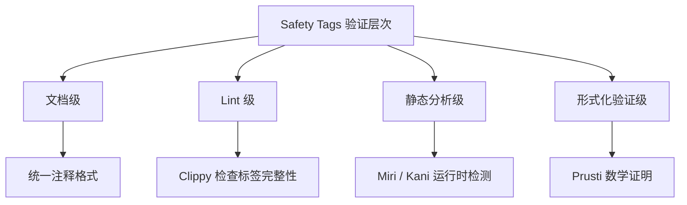

# Safety Tags 预研指南

> **状态**: RFC 讨论阶段（2026 年初提交）
> **目标**: 为 `unsafe` API 提供标准化的安全契约标注机制
> **最后更新**: 2026-05-08

---

## 目录

- [Safety Tags 预研指南](#safety-tags-预研指南)
  - [目录](#目录)
  - [1. 什么是 Safety Tags？](#1-什么是-safety-tags)
  - [2. 动机与背景](#2-动机与背景)
    - [当前问题](#当前问题)
    - [相关项目](#相关项目)
  - [3. 设计提案概览](#3-设计提案概览)
    - [可能的语法方向（基于社区讨论）](#可能的语法方向基于社区讨论)
    - [验证层次](#验证层次)
  - [4. 与现有实践的关系](#4-与现有实践的关系)
    - [Rust 标准库的 Safety 注释规范](#rust-标准库的-safety-注释规范)
    - [Safety Tags 的演进路径](#safety-tags-的演进路径)
  - [5. 对本项目的影响](#5-对本项目的影响)
    - [建议行动](#建议行动)
  - [参考资源](#参考资源)

---

## 1. 什么是 Safety Tags？

**Safety Tags** 是 Rust 社区正在讨论的一种机制，用于**标准化 `unsafe` 函数的安全前提条件（safety preconditions）的声明和验证**。

当前 Rust 中的 `unsafe` 函数通常使用文档注释来说明调用者需要保证的安全条件：

```rust
/// # Safety
/// - `ptr` 必须是非 null 且对齐的
/// - `ptr` 必须指向有效的 `T` 实例
/// - 调用后 `ptr` 不得再被使用
pub unsafe fn take_ownership<T>(ptr: *mut T) -> T {
    // ...
}
```

Safety Tags 的目标是将这些**非结构化的文档注释**转化为**可机器解析、可验证的标注**。

---

## 2. 动机与背景

### 当前问题

| 问题 | 示例 | 后果 |
|------|------|------|
| 文档注释不一致 | 有的写 `# Safety`，有的写 `SAFETY:` | 工具难以统一处理 |
| 条件表达不精确 | "指针必须有效" — 什么叫"有效"？ | 模糊契约导致 UB |
| 无法静态检查 | 编译器不验证 safety 注释 | 违反契约只能在运行时发现 |
| 新人理解困难 | 需要阅读大量文档才能正确使用 unsafe API | 学习曲线陡峭 |

### 相关项目

- **Rust-for-Linux**: 内核编程对 safety 契约有极高要求
- **Miri**: 已在运行时检测部分 UB，但无法验证 safety 契约
- **Kani**: 形式化验证工具，可以证明某些 safety 属性
- **Prusti**: 基于 Viper 的 Rust 验证器

---

## 3. 设计提案概览

### 可能的语法方向（基于社区讨论）

```rust
// 方向 1：属性标注
#[safety(
    precondition = "ptr.is_non_null()",
    precondition = "ptr.is_aligned_for::<T>()",
    precondition = "ptr.is_valid_for_read()",
)]
pub unsafe fn read<T>(ptr: *const T) -> T {
    // ...
}

// 方向 2：Doc comment 结构化
/// # Safety
/// @safety.ptr: non_null
/// @safety.ptr: aligned
/// @safety.ptr: valid_for_read
pub unsafe fn read<T>(ptr: *const T) -> T {
    // ...
}

// 方向 3：类型系统编码（长期愿景）
pub unsafe fn read<T>(ptr: NonNull<T>) -> T {
    // NonNull 类型本身编码了 non-null 条件
}
```

### 验证层次



---

## 4. 与现有实践的关系

### Rust 标准库的 Safety 注释规范

Rust 标准库已建立了相对统一的 `# Safety` 文档格式：

```rust
/// # Safety
///
/// - The pointer must be properly aligned.
/// - It must be "dereferencable" in the sense defined in [the module documentation].
/// - The pointer must point to an initialized instance of `T`.
///
/// [the module documentation]: pointer#safety
pub unsafe fn as_ref<'a>(&self) -> Option<&'a T> {
    // ...
}
```

### Safety Tags 的演进路径

```
当前：非结构化文档注释
  → 短期：结构化 doc comment（@safety 标签）
    → 中期：Clippy lint 检查完整性
      → 长期：属性标注 + 静态验证
        → 愿景：类型系统编码安全条件
```

---

## 5. 对本项目的影响

### 建议行动

1. **统一现有 unsafe 代码的 safety 注释格式**
   - 所有 `unsafe fn` 必须包含 `# Safety` 文档块
   - 使用标准库风格的 bullet list 格式

2. **建立项目级的 safety 注释规范**

   ```markdown
   ### Safety 注释模板

   ```rust
   /// # Safety
   ///
   /// ## 前提条件
   /// - 条件 1：...
   /// - 条件 2：...
   ///
   /// ## 违反后果
   /// - UB 类型 1：...
   /// - UB 类型 2：...
   ///
   /// ## 示例（正确用法）
   /// ```rust
   /// // 展示如何安全调用
   /// ```
   pub unsafe fn foo(...) { ... }
   ```

3. **跟踪 Safety Tags RFC 进展**
   - 监控 rust-lang/rfcs 仓库
   - 在 Safety Tags 稳定后及时更新项目代码

---

## 参考资源

- [Rust Unsafe Code Guidelines](https://rust-lang.github.io/unsafe-code-guidelines/)
- [Rust-for-Linux Safety Requirements](https://docs.kernel.org/rust/index.html)
- [Miri: Undefined Behavior Detection](https://github.com/rust-lang/miri)
- [Kani: Rust Verifier](https://github.com/model-checking/kani)
