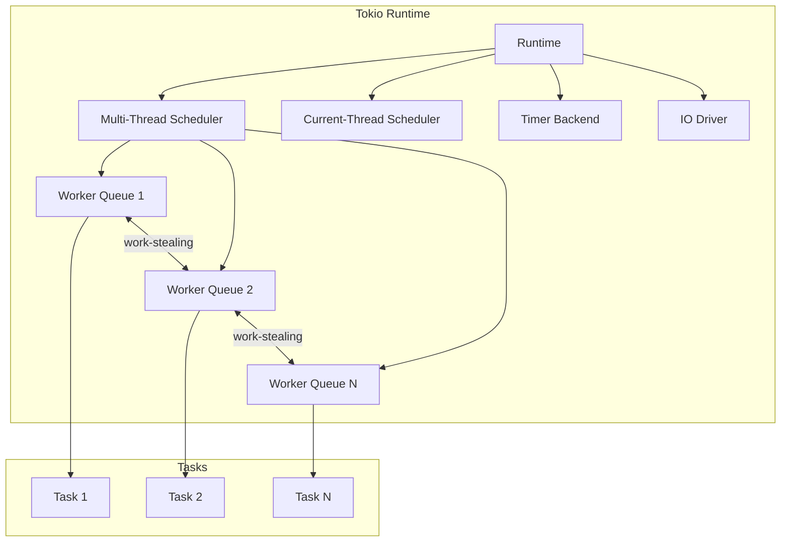
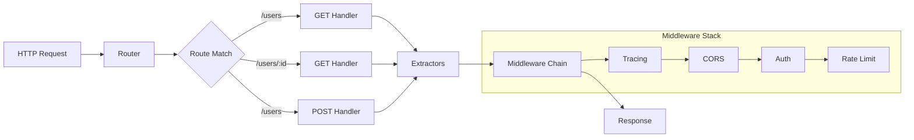
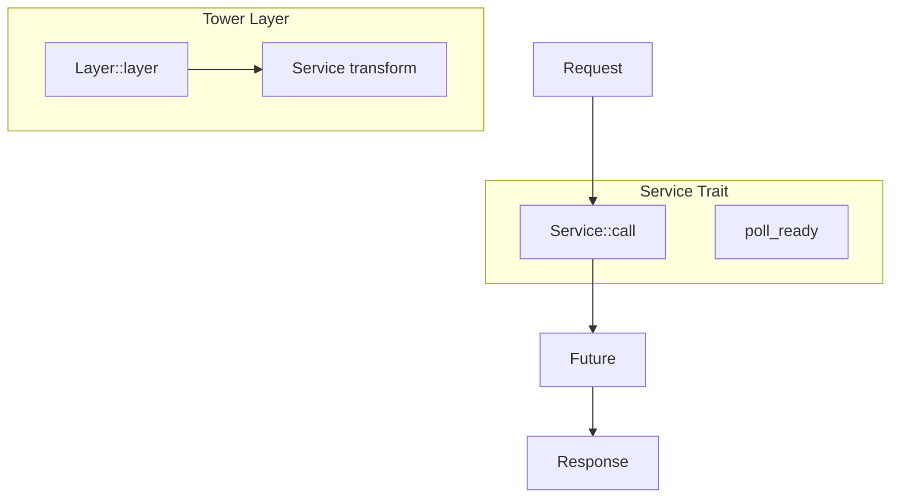
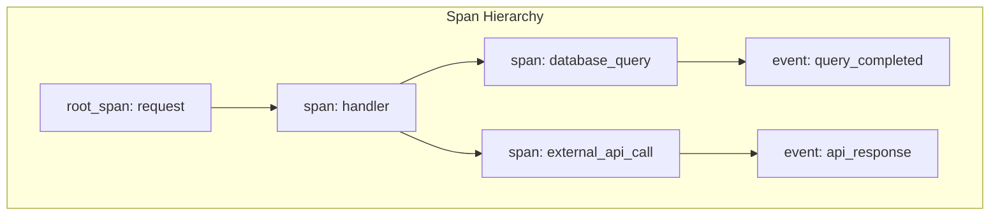

# Tokio 生态系统深度指南

> **创建日期**: 2026-02-28  
> **Rust 版本**: 1.92.0-nightly  
> **Tokio 版本**: 1.43+  
> **文档状态**: 🟢 已完成  
> **维护者**: Rust 学习项目团队

---

## 📋 目录导航

1. [Tokio 运行时架构](#1-tokio-运行时架构)
2. [Axum Web 框架](#2-axum-web-框架)
3. [Tonic gRPC](#3-tonic-grpc)
4. [Tower 服务抽象](#4-tower-服务抽象)
5. [Tracing 可观测性](#5-tracing-可观测性)
6. [生产级模式](#6-生产级模式)
7. [性能优化](#7-性能优化)
8. [实战案例](#8-实战案例)
9. [附录](#9-附录)

---

## 1. Tokio 运行时架构

### 1.1 架构概览



### 1.2 调度器对比

| 特性 | `multi_thread` | `current_thread` |
|------|----------------|------------------|
| **适用场景** | CPU 密集型、高并发 | 单线程、资源受限 |
| **工作线程数** | 多线程 (默认 CPU 核心数) | 1 个线程 |
| **任务调度** | 工作窃取 (work-stealing) | 当前线程轮询 |
| `spawn_blocking` | 独立线程池 | 同一线程 (阻塞!) |
| **典型应用** | Web 服务器、API 服务 | 嵌入式、测试、CLI |
| **内存占用** | 较高 | 较低 |

### 1.3 多线程调度器详解

```rust
use tokio::runtime::{Builder, Runtime};
use std::time::Duration;

/// 创建生产级多线程 Runtime
fn create_production_runtime() -> Runtime {
    Builder::new_multi_thread()
        .worker_threads(8)              // 工作线程数，默认 = CPU 核心数
        .max_blocking_threads(512)      // 阻塞线程池上限
        .thread_stack_size(2 * 1024 * 1024)  // 2MB 栈大小
        .thread_name("tokio-worker")    // 线程命名，便于调试
        .enable_all()                   // 启用 IO + Time 驱动
        .event_interval(61)             // 每 61 次轮询检查一次事件
        .global_queue_interval(61)      // 全局队列轮询间隔
        .max_io_events_per_tick(1024)   // 每 tick 最大 IO 事件数
        .build()
        .expect("Failed to create runtime")
}

/// 使用示例
fn main() {
    let rt = create_production_runtime();
    
    rt.block_on(async {
        // 启动多个并发任务
        let handles: Vec<_> = (0..100)
            .map(|i| {
                tokio::spawn(async move {
                    println!("Task {} running on {:?}", i, std::thread::current().id());
                    tokio::time::sleep(Duration::from_millis(100)).await;
                    i * 2
                })
            })
            .collect();
        
        let results: Vec<_> = futures::future::join_all(handles).await;
        println!("Completed {} tasks", results.len());
    });
}
```

### 1.4 工作窃取机制

```rust
use tokio::task::JoinHandle;

/// 工作窃取调度器优化示例
/// 
/// Tokio 使用两级队列系统：
/// 1. 全局队列：所有线程可访问，需要锁
/// 2. 本地队列：每个工作线程独有，无锁操作
/// 
/// 当本地队列为空时，工作线程会尝试从其他线程"窃取"任务
async fn work_stealing_demo() {
    // 大量小任务最能体现 work-stealing 的优势
    let handles: Vec<JoinHandle<u64>> = (0..10_000)
        .map(|i| {
            tokio::spawn(async move {
                // 模拟不同执行时间的任务
                let work = fibonacci(i % 20);
                work
            })
        })
        .collect();
    
    let total: u64 = futures::future::join_all(handles)
        .await
        .into_iter()
        .filter_map(Result::ok)
        .sum();
    
    println!("Total: {}", total);
}

fn fibonacci(n: u32) -> u64 {
    match n {
        0 => 0,
        1 => 1,
        _ => fibonacci(n - 1) + fibonacci(n - 2),
    }
}
```

### 1.5 当前线程调度器

```rust
use tokio::runtime::Builder;

/// 当前线程调度器适用于：
/// - 测试环境（确定性执行）
/// - 资源受限的嵌入式环境
/// - 需要精确控制执行顺序的场景
fn create_current_thread_runtime() {
    let rt = Builder::new_current_thread()
        .enable_all()
        .build()
        .unwrap();
    
    rt.block_on(async {
        // 在当前线程调度器中，spawn_blocking 会阻塞整个运行时！
        // 以下代码会导致死锁，不要这样做：
        // let result = tokio::task::spawn_blocking(|| {
        //     std::thread::sleep(Duration::from_secs(1));
        //     42
        // }).await;
        
        // 正确的做法：使用 spawn_local 或避免阻塞操作
        let result = async { 42 }.await;
        println!("Result: {}", result);
    });
}
```

### 1.6 任务队列和调度策略

```rust
use tokio::task::{self, JoinSet};

/// 任务调度最佳实践
async fn task_scheduling_best_practices() {
    // 1. 使用 JoinSet 管理动态任务集合
    let mut set = JoinSet::new();
    
    for i in 0..100 {
        set.spawn(async move {
            tokio::time::sleep(Duration::from_millis(i as u64 * 10)).await;
            format!("Task {} complete", i)
        });
    }
    
    // 按完成顺序处理结果
    while let Some(result) = set.join_next().await {
        match result {
            Ok(msg) => println!("{}", msg),
            Err(e) => eprintln!("Task panicked: {}", e),
        }
    }
    
    // 2. 优先级任务调度（使用不同 spawn 策略）
    // 高优先级：直接 spawn
    let high_priority = task::spawn(high_priority_work());
    
    // 低优先级：使用 spawn_blocking 的线程池
    let low_priority = task::spawn_blocking(low_priority_work);
    
    let (h, l) = tokio::join!(high_priority, low_priority);
    let _ = (h, l);
}

async fn high_priority_work() -> String {
    "High priority done".to_string()
}

fn low_priority_work() -> String {
    std::thread::sleep(Duration::from_secs(1));
    "Low priority done".to_string()
}
```

### 常见陷阱

| 陷阱 | 症状 | 解决方案 |
|------|------|----------|
| 阻塞运行时 | 整个应用无响应 | 使用 `spawn_blocking` |
| 线程饥饿 | 任务无法及时执行 | 增加 worker_threads |
| 内存泄漏 | 内存持续增长 | 限制并发任务数量 |
| 任务优先级错乱 | 重要任务延迟 | 使用优先级队列 |

---

## 2. Axum Web 框架

### 2.1 核心架构



### 2.2 路由系统

```rust
use axum::{
    routing::{get, post, put, delete, Router},
    extract::{Path, Query, State},
    Json, http::StatusCode,
};
use serde::{Deserialize, Serialize};
use std::sync::Arc;

/// 应用程序状态
#[derive(Clone)]
struct AppState {
    db_pool: sqlx::PgPool,
    redis: redis::aio::ConnectionManager,
}

/// 创建路由
fn create_router(state: Arc<AppState>) -> Router {
    Router::new()
        // 基础路由
        .route("/", get(root))
        .route("/health", get(health_check))
        
        // RESTful API 路由组
        .route("/api/v1/users", get(list_users).post(create_user))
        .route(
            "/api/v1/users/:id",
            get(get_user)
                .put(update_user)
                .delete(delete_user),
        )
        
        // 嵌套路由（模块化组织）
        .nest("/api/v1/posts", posts_routes())
        
        // 合并子路由
        .merge(admin_routes())
        
        // 静态文件服务
        .nest_service("/static", tower_http::services::ServeDir::new("static"))
        
        // 全局状态
        .with_state(state)
        
        // 全局中间件
        .layer(tower_http::trace::TraceLayer::new_for_http())
        .layer(tower_http::cors::CorsLayer::permissive())
}

/// 路由合并示例
fn posts_routes() -> Router<Arc<AppState>> {
    Router::new()
        .route("/", get(list_posts).post(create_post))
        .route("/:id", get(get_post))
        .route("/:id/comments", get(list_comments).post(add_comment))
}

fn admin_routes() -> Router<Arc<AppState>> {
    Router::new()
        .route("/admin/dashboard", get(dashboard))
        .route("/admin/users", get(admin_list_users))
        .layer(axum::middleware::from_fn(auth_middleware))
}

// ========== 处理器实现 ==========

async fn root() -> &'static str {
    "Hello, Axum!"
}

async fn health_check(State(state): State<Arc<AppState>>) -> StatusCode {
    // 检查数据库连接等
    StatusCode::OK
}

#[derive(Debug, Deserialize)]
struct ListUsersQuery {
    page: Option<u32>,
    per_page: Option<u32>,
}

async fn list_users(
    State(state): State<Arc<AppState>>,
    Query(params): Query<ListUsersQuery>,
) -> Result<Json<Vec<User>>, StatusCode> {
    let users = vec![]; // 从数据库查询
    Ok(Json(users))
}

#[derive(Debug, Serialize)]
struct User {
    id: i64,
    name: String,
    email: String,
}

#[derive(Debug, Deserialize)]
struct CreateUserRequest {
    name: String,
    email: String,
}

async fn create_user(
    State(state): State<Arc<AppState>>,
    Json(req): Json<CreateUserRequest>,
) -> Result<(StatusCode, Json<User>), StatusCode> {
    let user = User {
        id: 1,
        name: req.name,
        email: req.email,
    };
    Ok((StatusCode::CREATED, Json(user)))
}

async fn get_user(
    Path(id): Path<i64>,
    State(state): State<Arc<AppState>>,
) -> Result<Json<User>, StatusCode> {
    let user = User {
        id,
        name: "Test".to_string(),
        email: "test@example.com".to_string(),
    };
    Ok(Json(user))
}

async fn update_user(
    Path(id): Path<i64>,
    State(state): State<Arc<AppState>>,
    Json(req): Json<CreateUserRequest>,
) -> Result<Json<User>, StatusCode> {
    Ok(Json(User {
        id,
        name: req.name,
        email: req.email,
    }))
}

async fn delete_user(
    Path(id): Path<i64>,
    State(state): State<Arc<AppState>>,
) -> StatusCode {
    StatusCode::NO_CONTENT
}

// 占位符函数
async fn list_posts() -> &'static str { "Posts list" }
async fn create_post() -> &'static str { "Create post" }
async fn get_post() -> &'static str { "Get post" }
async fn list_comments() -> &'static str { "Comments" }
async fn add_comment() -> &'static str { "Add comment" }
async fn dashboard() -> &'static str { "Admin dashboard" }
async fn admin_list_users() -> &'static str { "Admin users" }
async fn auth_middleware<B>(req: axum::extract::Request<B>, next: axum::middleware::Next<B>) -> axum::response::Response {
    next.run(req).await
}
```

### 2.3 提取器 (Extractors)

```rust
use axum::{
    extract::{Path, Query, State, Extension, FromRequestParts, TypedHeader},
    headers::{authorization::Bearer, Authorization},
    async_trait,
    http::{request::Parts, StatusCode},
    Json,
};
use serde::Deserialize;

// ========== 自定义提取器 ==========

/// 分页参数提取器
#[derive(Debug, Deserialize)]
struct Pagination {
    #[serde(default = "default_page")]
    page: u32,
    #[serde(default = "default_per_page")]
    per_page: u32,
}

fn default_page() -> u32 { 1 }
fn default_per_page() -> u32 { 20 }

impl Pagination {
    fn offset(&self) -> i64 {
        ((self.page - 1) * self.per_page) as i64
    }
    
    fn limit(&self) -> i64 {
        self.per_page as i64
    }
}

/// 当前用户提取器
#[derive(Debug, Clone)]
struct CurrentUser {
    id: i64,
    username: String,
    roles: Vec<String>,
}

#[async_trait]
impl<S> FromRequestParts<S> for CurrentUser
where
    S: Send + Sync,
{
    type Rejection = (StatusCode, &'static str);
    
    async fn from_request_parts(parts: &mut Parts, _state: &S) -> Result<Self, Self::Rejection> {
        // 从 Authorization header 提取 JWT 并解析
        let auth_header = parts
            .headers
            .get("authorization")
            .and_then(|h| h.to_str().ok())
            .ok_or((StatusCode::UNAUTHORIZED, "Missing authorization header"))?;
        
        // 解析 JWT token（简化示例）
        let token = auth_header.strip_prefix("Bearer ")
            .ok_or((StatusCode::UNAUTHORIZED, "Invalid authorization format"))?;
        
        Ok(CurrentUser {
            id: 1,
            username: "user".to_string(),
            roles: vec!["user".to_string()],
        })
    }
}

// ========== 使用示例 ==========

use validator::Validate;

#[derive(Debug, Deserialize, Validate)]
struct CreatePostRequest {
    #[validate(length(min = 1, max = 200))]
    title: String,
    #[validate(length(min = 10))]
    content: String,
    #[validate(email)]
    author_email: String,
}

async fn create_post_with_validation(
    current_user: CurrentUser,
) -> Result<String, (StatusCode, &'static str)> {
    println!("User {:?} creating post", current_user);
    Ok("Post created".to_string())
}

/// 组合多个提取器
async fn complex_handler(
    Path(id): Path<i64>,
    Query(pagination): Query<Pagination>,
    TypedHeader(auth): TypedHeader<Authorization<Bearer>>,
    State(state): State<Arc<AppState>>,
    Extension(config): Extension<AppConfig>,
) -> String {
    format!(
        "id={}, page={}, per_page={}, token={}, config={:?}",
        id, pagination.page, pagination.per_page, auth.token(), config
    )
}

#[derive(Debug, Clone)]
struct AppConfig {
    name: String,
}
```


### 2.4 中间件系统

```rust
use axum::{
    middleware::{self, Next},
    response::{IntoResponse, Response},
    extract::{Request, State},
    body::Body,
    http::{header, StatusCode, HeaderValue},
};
use std::time::Instant;
use tower::{Layer, Service};
use std::task::{Context, Poll};
use std::future::Future;
use std::pin::Pin;

/// 日志中间件
async fn logging_middleware(
    req: Request,
    next: Next,
) -> Response {
    let start = Instant::now();
    let method = req.method().clone();
    let uri = req.uri().clone();
    let request_id = uuid::Uuid::new_v4().to_string();
    
    println!(
        "[{}] {} {} - Started",
        request_id, method, uri
    );
    
    let response = next.run(req).await;
    
    let duration = start.elapsed();
    let status = response.status();
    
    println!(
        "[{}] {} {} - {} ({:?})",
        request_id, method, uri, status, duration
    );
    
    response
}

/// 认证中间件
async fn auth_middleware<B>(
    TypedHeader(auth): TypedHeader<Authorization<Bearer>>,
    req: Request<B>,
    next: Next<B>,
) -> Result<Response, StatusCode> {
    let token = auth.token();
    if !validate_token(token).await {
        return Err(StatusCode::UNAUTHORIZED);
    }
    
    Ok(next.run(req).await)
}

async fn validate_token(token: &str) -> bool {
    !token.is_empty()
}

/// 限流中间件（基于 Tower）
use tower::limit::RateLimitLayer;
use std::time::Duration;

fn create_rate_limited_router() -> Router {
    Router::new()
        .route("/api/limited", get(limited_endpoint))
        .layer(RateLimitLayer::new(100, Duration::from_secs(60)))
}

async fn limited_endpoint() -> &'static str {
    "Rate limited endpoint"
}

/// 自定义 Tower 中间件层
#[derive(Clone)]
struct RequestTimingLayer;

impl<S> Layer<S> for RequestTimingLayer {
    type Service = RequestTimingService<S>;
    
    fn layer(&self, inner: S) -> Self::Service {
        RequestTimingService { inner }
    }
}

#[derive(Clone)]
struct RequestTimingService<S> {
    inner: S,
}

impl<S> Service<Request<Body>> for RequestTimingService<S>
where
    S: Service<Request<Body>, Response = Response<Body>> + Send + Clone + 'static,
    S::Future: Send + 'static,
{
    type Response = S::Response;
    type Error = S::Error;
    type Future = Pin<Box<dyn Future<Output = Result<Self::Response, Self::Error>> + Send>>;
    
    fn poll_ready(&mut self, cx: &mut Context<'_>) -> Poll<Result<(), Self::Error>> {
        self.inner.poll_ready(cx)
    }
    
    fn call(&mut self, req: Request<Body>) -> Self::Future {
        let start = Instant::now();
        let method = req.method().clone();
        let uri = req.uri().clone();
        let mut inner = self.inner.clone();
        
        Box::pin(async move {
            let response = inner.call(req).await?;
            let duration = start.elapsed();
            println!("[TIMING] {} {} took {:?}", method, uri, duration);
            Ok(response)
        })
    }
}
```

### 2.5 错误处理

```rust
use axum::{
    response::{IntoResponse, Response},
    Json,
    http::StatusCode,
};
use serde_json::json;
use thiserror::Error;

/// 应用错误类型
#[derive(Debug, Error)]
pub enum AppError {
    #[error("数据库错误: {0}")]
    Database(#[from] sqlx::Error),
    
    #[error("验证错误: {0}")]
    Validation(String),
    
    #[error("未找到资源")]
    NotFound,
    
    #[error("未授权")]
    Unauthorized,
    
    #[error("禁止访问")]
    Forbidden,
    
    #[error("内部服务器错误")]
    Internal,
}

/// 错误响应结构
#[derive(Debug, Serialize)]
struct ErrorResponse {
    error: ErrorDetail,
}

#[derive(Debug, Serialize)]
struct ErrorDetail {
    code: String,
    message: String,
}

impl IntoResponse for AppError {
    fn into_response(self) -> Response {
        let (status, error_code, message) = match &self {
            AppError::Database(_) => (
                StatusCode::INTERNAL_SERVER_ERROR,
                "DATABASE_ERROR",
                "数据库操作失败".to_string(),
            ),
            AppError::Validation(msg) => (
                StatusCode::BAD_REQUEST,
                "VALIDATION_ERROR",
                msg.clone(),
            ),
            AppError::NotFound => (
                StatusCode::NOT_FOUND,
                "NOT_FOUND",
                "请求的资源不存在".to_string(),
            ),
            AppError::Unauthorized => (
                StatusCode::UNAUTHORIZED,
                "UNAUTHORIZED",
                "请先登录".to_string(),
            ),
            AppError::Forbidden => (
                StatusCode::FORBIDDEN,
                "FORBIDDEN",
                "没有权限执行此操作".to_string(),
            ),
            AppError::Internal => (
                StatusCode::INTERNAL_SERVER_ERROR,
                "INTERNAL_ERROR",
                "服务器内部错误".to_string(),
            ),
        };
        
        let body = Json(ErrorResponse {
            error: ErrorDetail {
                code: error_code.to_string(),
                message,
            },
        });
        
        (status, body).into_response()
    }
}

/// 结果类型别名
pub type Result<T> = std::result::Result<T, AppError>;

/// 使用示例
async fn user_handler(id: i64) -> Result<Json<User>> {
    if id <= 0 {
        return Err(AppError::Validation("无效的用户ID".to_string()));
    }
    
    let user = fetch_user(id).await?;
    
    match user {
        Some(u) => Ok(Json(u)),
        None => Err(AppError::NotFound),
    }
}

async fn fetch_user(id: i64) -> std::result::Result<Option<User>, sqlx::Error> {
    Ok(Some(User {
        id,
        name: "Test".to_string(),
        email: "test@example.com".to_string(),
    }))
}
```

---

## 3. Tonic gRPC

### 3.1 服务定义 (Protobuf)

```protobuf
// proto/helloworld.proto
syntax = "proto3";
package helloworld;

service Greeter {
    rpc SayHello (HelloRequest) returns (HelloReply);
    rpc SayHelloStream (stream HelloRequest) returns (stream HelloReply);
}

message HelloRequest { string name = 1; }
message HelloReply { string message = 1; }

// proto/user.proto
syntax = "proto3";
package user;

service UserService {
    rpc GetUser (GetUserRequest) returns (User);
    rpc ListUsers (ListUsersRequest) returns (ListUsersResponse);
    rpc CreateUser (CreateUserRequest) returns (User);
    rpc StreamUsers (StreamUsersRequest) returns (stream User);
    rpc Chat (stream ChatMessage) returns (stream ChatMessage);
}

message GetUserRequest { int64 id = 1; }
message ListUsersRequest { int32 page = 1; int32 per_page = 2; }
message ListUsersResponse { repeated User users = 1; int32 total = 2; }
message CreateUserRequest { string name = 1; string email = 2; }
message StreamUsersRequest { string filter = 1; }
message ChatMessage { string user = 1; string content = 2; int64 timestamp = 3; }

message User {
    int64 id = 1;
    string name = 2;
    string email = 3;
    string created_at = 4;
}
```

### 3.2 服务端实现

```rust
// build.rs
fn main() {
    tonic_build::configure()
        .build_server(true)
        .build_client(true)
        .compile(
            &["proto/helloworld.proto", "proto/user.proto"],
            &["proto"],
        )
        .expect("Failed to compile protos");
}

// src/server.rs
use tonic::{transport::Server, Request, Response, Status};
use tokio_stream::wrappers::ReceiverStream;
use tokio::sync::mpsc;

pub mod pb {
    tonic::include_proto!("helloworld");
    tonic::include_proto!("user");
}

use pb::{
    greeter_server::{Greeter, GreeterServer},
    user_service_server::{UserService, UserServiceServer},
    *,
};

#[derive(Debug, Default)]
pub struct GreeterService;

#[tonic::async_trait]
impl Greeter for GreeterService {
    async fn say_hello(
        &self,
        request: Request<HelloRequest>,
    ) -> Result<Response<HelloReply>, Status> {
        let reply = HelloReply {
            message: format!("Hello {}!", request.into_inner().name),
        };
        Ok(Response::new(reply))
    }
    
    type SayHelloStreamStream = ReceiverStream<Result<HelloReply, Status>>;
    
    async fn say_hello_stream(
        &self,
        request: Request<tonic::Streaming<HelloRequest>>,
    ) -> Result<Response<Self::SayHelloStreamStream>, Status> {
        let mut stream = request.into_inner();
        let (tx, rx) = mpsc::channel(128);
        
        tokio::spawn(async move {
            while let Some(req) = stream.message().await.unwrap_or(None) {
                let reply = HelloReply {
                    message: format!("Hello {}!", req.name),
                };
                if tx.send(Ok(reply)).await.is_err() {
                    break;
                }
            }
        });
        
        Ok(Response::new(ReceiverStream::new(rx)))
    }
}

#[derive(Debug)]
pub struct UserServiceImpl;

#[tonic::async_trait]
impl UserService for UserServiceImpl {
    async fn get_user(
        &self,
        request: Request<GetUserRequest>,
    ) -> Result<Response<User>, Status> {
        let user = User {
            id: request.into_inner().id,
            name: "Test".to_string(),
            email: "test@example.com".to_string(),
            created_at: chrono::Utc::now().to_rfc3339(),
        };
        Ok(Response::new(user))
    }
    
    async fn list_users(
        &self,
        _request: Request<ListUsersRequest>,
    ) -> Result<Response<ListUsersResponse>, Status> {
        Ok(Response::new(ListUsersResponse {
            users: vec![],
            total: 0,
        }))
    }
    
    async fn create_user(
        &self,
        request: Request<CreateUserRequest>,
    ) -> Result<Response<User>, Status> {
        let req = request.into_inner();
        let user = User {
            id: 1,
            name: req.name,
            email: req.email,
            created_at: chrono::Utc::now().to_rfc3339(),
        };
        Ok(Response::new(user))
    }
    
    type StreamUsersStream = ReceiverStream<Result<User, Status>>;
    
    async fn stream_users(
        &self,
        _request: Request<StreamUsersRequest>,
    ) -> Result<Response<Self::StreamUsersStream>, Status> {
        let (tx, rx) = mpsc::channel(128);
        
        tokio::spawn(async move {
            for i in 0..10 {
                let user = User {
                    id: i,
                    name: format!("User {}", i),
                    email: format!("user{}@example.com", i),
                    created_at: chrono::Utc::now().to_rfc3339(),
                };
                if tx.send(Ok(user)).await.is_err() {
                    break;
                }
                tokio::time::sleep(Duration::from_millis(100)).await;
            }
        });
        
        Ok(Response::new(ReceiverStream::new(rx)))
    }
    
    type ChatStream = ReceiverStream<Result<ChatMessage, Status>>;
    
    async fn chat(
        &self,
        request: Request<tonic::Streaming<ChatMessage>>,
    ) -> Result<Response<Self::ChatStream>, Status> {
        let mut inbound = request.into_inner();
        let (tx, rx) = mpsc::channel(128);
        
        tokio::spawn(async move {
            while let Some(msg) = inbound.message().await.unwrap_or(None) {
                let reply = ChatMessage {
                    user: "Server".to_string(),
                    content: format!("Echo: {}", msg.content),
                    timestamp: chrono::Utc::now().timestamp(),
                };
                if tx.send(Ok(reply)).await.is_err() {
                    break;
                }
            }
        });
        
        Ok(Response::new(ReceiverStream::new(rx)))
    }
}

pub async fn start_server(addr: &str) -> Result<(), Box<dyn std::error::Error>> {
    let addr = addr.parse()?;
    
    let greeter = GreeterService::default();
    let user_service = UserServiceImpl;
    
    Server::builder()
        .add_service(GreeterServer::new(greeter))
        .add_service(UserServiceServer::new(user_service))
        .serve(addr)
        .await?;
    
    Ok(())
}
```

### 3.3 客户端实现

```rust
// src/client.rs
use tonic::{transport::Channel, Request};
use std::time::Duration;

use crate::pb::{
    greeter_client::GreeterClient,
    user_service_client::UserServiceClient,
    *,
};

pub struct AppClient {
    greeter: GreeterClient<Channel>,
    user: UserServiceClient<Channel>,
}

impl AppClient {
    pub async fn connect(endpoint: &str) -> Result<Self, Box<dyn std::error::Error>> {
        let endpoint = Channel::from_shared(endpoint.to_string())?
            .timeout(Duration::from_secs(30))
            .connect_timeout(Duration::from_secs(10))
            .keep_alive_while_idle(true);
        
        let channel = endpoint.connect().await?;
        
        Ok(Self {
            greeter: GreeterClient::new(channel.clone()),
            user: UserServiceClient::new(channel),
        })
    }
    
    pub async fn say_hello(&mut self, name: &str) -> Result<String, tonic::Status> {
        let request = Request::new(HelloRequest {
            name: name.to_string(),
        });
        
        let response = self.greeter.say_hello(request).await?;
        Ok(response.into_inner().message)
    }
    
    pub async fn get_user(&mut self, id: i64) -> Result<User, tonic::Status> {
        let request = Request::new(GetUserRequest { id });
        let response = self.user.get_user(request).await?;
        Ok(response.into_inner())
    }
    
    pub async fn chat_stream(&mut self) -> Result<(), Box<dyn std::error::Error>> {
        let (mut tx, rx) = tokio::sync::mpsc::channel(128);
        
        tokio::spawn(async move {
            for i in 0..5 {
                tx.send(ChatMessage {
                    user: "Client".to_string(),
                    content: format!("Message {}", i),
                    timestamp: chrono::Utc::now().timestamp(),
                }).await.unwrap();
                tokio::time::sleep(Duration::from_secs(1)).await;
            }
        });
        
        let stream = tokio_stream::wrappers::ReceiverStream::new(rx);
        let request = Request::new(stream);
        
        let mut response = self.user.chat(request).await?.into_inner();
        
        while let Some(msg) = response.message().await? {
            println!("Received: {:?}", msg);
        }
        
        Ok(())
    }
}
```

### 3.4 拦截器

```rust
use tonic::{Request, Status, service::Interceptor};

/// 日志拦截器
#[derive(Clone, Debug)]
pub struct LoggingInterceptor;

impl Interceptor for LoggingInterceptor {
    fn call(&mut self, req: Request<()>) -> Result<Request<()>, Status> {
        println!("[gRPC] {} {}", req.method(), req.uri());
        Ok(req)
    }
}

/// 认证拦截器
#[derive(Clone, Debug)]
pub struct AuthInterceptor {
    token: String,
}

impl AuthInterceptor {
    pub fn new(token: String) -> Self {
        Self { token }
    }
}

impl Interceptor for AuthInterceptor {
    fn call(&mut self, mut req: Request<()>) -> Result<Request<()>, Status> {
        req.metadata_mut().insert(
            "authorization",
            format!("Bearer {}", self.token).parse()
                .map_err(|_| Status::internal("Invalid token"))?,
        );
        Ok(req)
    }
}

/// 组合拦截器
pub fn create_interceptor_stack(token: String) -> impl Fn(Request<()>) -> Result<Request<()>, Status> + Clone {
    move |mut req| {
        println!("[Interceptor] Request: {}", req.uri());
        
        req.metadata_mut().insert(
            "authorization",
            format!("Bearer {}", token).parse().unwrap(),
        );
        
        Ok(req)
    }
}
```

---

## 4. Tower 服务抽象

### 4.1 Service Trait 核心概念



```rust
use tower::{Service, Layer};
use std::{
    future::Future,
    pin::Pin,
    task::{Context, Poll},
};

/// 自定义 Service 实现：计数器服务
#[derive(Clone, Debug)]
pub struct CounterService {
    count: std::sync::Arc<std::sync::atomic::AtomicU64>,
}

impl CounterService {
    pub fn new() -> Self {
        Self {
            count: std::sync::Arc::new(std::sync::atomic::AtomicU64::new(0)),
        }
    }
}

impl Service<()> for CounterService {
    type Response = u64;
    type Error = std::convert::Infallible;
    type Future = Pin<Box<dyn Future<Output = Result<Self::Response, Self::Error>> + Send>>;
    
    fn poll_ready(&mut self, _cx: &mut Context<'_>) -> Poll<Result<(), Self::Error>> {
        Poll::Ready(Ok(()))
    }
    
    fn call(&mut self, _req: ()) -> Self::Future {
        let count = self.count.fetch_add(1, std::sync::atomic::Ordering::SeqCst);
        Box::pin(async move { Ok(count) })
    }
}
```

### 4.2 Layer 和中间件链

```rust
use tower::{ServiceBuilder, ServiceExt, Layer};
use tower::limit::{RateLimitLayer, ConcurrencyLimitLayer};
use tower::timeout::TimeoutLayer;
use tower::retry::RetryLayer;
use std::time::Duration;

/// Tower Layer 组合示例
pub fn create_service_stack<S, Req>(inner: S) -> impl Service<Req>
where
    S: Service<Req> + Clone + Send + 'static,
    S::Future: Send,
    Req: Send + 'static,
{
    ServiceBuilder::new()
        .layer(TraceLayer::new_for_http())
        .layer(TimeoutLayer::new(Duration::from_secs(30)))
        .layer(RateLimitLayer::new(100, Duration::from_secs(1)))
        .layer(ConcurrencyLimitLayer::new(50))
        .layer(CompressionLayer::new())
        .service(inner)
}

use tower_http::{
    trace::TraceLayer,
    compression::CompressionLayer,
};

/// 自定义 Layer
#[derive(Clone, Debug)]
pub struct AddHeaderLayer {
    header_name: String,
    header_value: String,
}

impl AddHeaderLayer {
    pub fn new(name: impl Into<String>, value: impl Into<String>) -> Self {
        Self {
            header_name: name.into(),
            header_value: value.into(),
        }
    }
}

impl<S> Layer<S> for AddHeaderLayer {
    type Service = AddHeaderService<S>;
    
    fn layer(&self, inner: S) -> Self::Service {
        AddHeaderService {
            inner,
            header_name: self.header_name.clone(),
            header_value: self.header_value.clone(),
        }
    }
}

#[derive(Clone, Debug)]
pub struct AddHeaderService<S> {
    inner: S,
    header_name: String,
    header_value: String,
}
```

### 4.3 Rate Limiting、Timeout 和 Retry

```rust
use tower::timeout::Timeout;
use tower::retry::Policy;
use std::future::Future;

/// 自定义重试策略
#[derive(Clone, Debug)]
pub struct MyRetryPolicy {
    max_retries: usize,
    current_attempt: usize,
}

impl MyRetryPolicy {
    pub fn new(max_retries: usize) -> Self {
        Self {
            max_retries,
            current_attempt: 0,
        }
    }
}

impl<Req, Res, E> Policy<Req, Res, E> for MyRetryPolicy
where
    Req: Clone,
{
    type Future = Pin<Box<dyn Future<Output = Self> + Send>>;
    
    fn retry(&self, _req: &Req, result: Result<&Res, &E>) -> Option<Self::Future> {
        if self.current_attempt >= self.max_retries {
            return None;
        }
        
        match result {
            Ok(_) => None,
            Err(_) => {
                let mut new_policy = self.clone();
                new_policy.current_attempt += 1;
                
                let delay = Duration::from_millis(100 * (1 << self.current_attempt));
                Some(Box::pin(async move {
                    tokio::time::sleep(delay).await;
                    new_policy
                }))
            }
        }
    }
    
    fn clone_request(&self, req: &Req) -> Option<Req> {
        Some(req.clone())
    }
}

/// 熔断器状态
#[derive(Debug, Clone, Copy, PartialEq)]
pub enum CircuitState {
    Closed,
    Open,
    HalfOpen,
}

/// 简单熔断器实现
pub struct CircuitBreaker {
    state: CircuitState,
    failure_count: u32,
    success_count: u32,
    threshold: u32,
    timeout: Duration,
    last_failure: Option<Instant>,
}

impl CircuitBreaker {
    pub fn new(threshold: u32, timeout: Duration) -> Self {
        Self {
            state: CircuitState::Closed,
            failure_count: 0,
            success_count: 0,
            threshold,
            timeout,
            last_failure: None,
        }
    }
    
    pub fn can_execute(&mut self) -> bool {
        match self.state {
            CircuitState::Closed => true,
            CircuitState::Open => {
                if let Some(last) = self.last_failure {
                    if last.elapsed() >= self.timeout {
                        self.state = CircuitState::HalfOpen;
                        self.success_count = 0;
                        true
                    } else {
                        false
                    }
                } else {
                    false
                }
            }
            CircuitState::HalfOpen => true,
        }
    }
    
    pub fn record_success(&mut self) {
        match self.state {
            CircuitState::HalfOpen => {
                self.success_count += 1;
                if self.success_count >= 3 {
                    self.state = CircuitState::Closed;
                    self.failure_count = 0;
                }
            }
            _ => {
                self.failure_count = 0;
            }
        }
    }
    
    pub fn record_failure(&mut self) {
        self.failure_count += 1;
        self.last_failure = Some(Instant::now());
        
        if self.state == CircuitState::HalfOpen || self.failure_count >= self.threshold {
            self.state = CircuitState::Open;
        }
    }
}
```

---

## 5. Tracing 可观测性

### 5.1 Span 和 Event 基础



```rust
use tracing::{info, debug, error, warn, span, Level, Instrument};
use tracing_subscriber::{layer::SubscriberExt, util::SubscriberInitExt};

/// 初始化 tracing
pub fn init_tracing() {
    tracing_subscriber::registry()
        .with(
            tracing_subscriber::EnvFilter::try_from_default_env()
                .unwrap_or_else(|_| "info".into()),
        )
        .with(tracing_subscriber::fmt::layer().json())
        .init();
}

/// Span 使用示例
#[tracing::instrument(
    name = "process_order",
    skip(db),
    fields(
        order_id = %order.id,
        user_id = order.user_id
    ),
    level = "info"
)]
pub async fn process_order(order: Order, db: &Database) -> Result<Receipt, Error> {
    debug!("Validating order");
    validate_order(&order)?;
    
    // 创建嵌套 span
    let payment_span = span!(Level::DEBUG, "process_payment", method = "credit_card");
    let result = async {
        debug!("Charging payment");
        charge_payment(&order).await
    }
    .instrument(payment_span)
    .await?;
    
    info!(payment_id = %result.id, "Payment processed successfully");
    
    Ok(Receipt {
        order_id: order.id,
        payment_id: result.id,
    })
}

#[derive(Debug)]
struct Order { id: String, user_id: u64 }
#[derive(Debug)]
struct Database;
#[derive(Debug)]
struct Receipt { order_id: String, payment_id: String }
#[derive(Debug)]
struct Error;
#[derive(Debug)]
struct PaymentResult { id: String }

fn validate_order(_order: &Order) -> Result<(), Error> { Ok(()) }
async fn charge_payment(_order: &Order) -> Result<PaymentResult, Error> {
    Ok(PaymentResult { id: "pay_123".to_string() })
}
```

### 5.2 与 OpenTelemetry 集成

```rust
use opentelemetry::{
    global,
    trace::{TracerProvider},
    KeyValue,
};
use opentelemetry_sdk::{
    propagation::TraceContextPropagator,
    trace::TracerProvider,
    Resource,
};
use tracing_opentelemetry::OpenTelemetryLayer;
use tracing_subscriber::layer::SubscriberExt;

/// 初始化 OpenTelemetry
pub fn init_otel(service_name: &str, otlp_endpoint: &str) -> TracerProvider {
    global::set_text_map_propagator(TraceContextPropagator::new());
    
    let resource = Resource::new(vec![
        KeyValue::new("service.name", service_name.to_string()),
        KeyValue::new("service.version", env!("CARGO_PKG_VERSION")),
    ]);
    
    let otlp_exporter = opentelemetry_otlp::new_exporter()
        .tonic()
        .with_endpoint(otlp_endpoint);
    
    let tracer_provider = opentelemetry_otlp::new_pipeline()
        .tracing()
        .with_exporter(otlp_exporter)
        .with_trace_config(
            opentelemetry_sdk::trace::Config::default()
                .with_resource(resource),
        )
        .install_batch(opentelemetry_sdk::runtime::Tokio)
        .expect("Failed to install OpenTelemetry pipeline");
    
    let tracer = tracer_provider.tracer(service_name);
    
    tracing_subscriber::registry()
        .with(tracing_subscriber::fmt::layer())
        .with(OpenTelemetryLayer::new(tracer))
        .init();
    
    tracer_provider
}

/// 在请求中传递 trace context
pub async fn otel_middleware(
    request: axum::extract::Request,
    next: axum::middleware::Next,
) -> axum::response::Response {
    let span = tracing::info_span!(
        "http_request",
        http.method = %request.method(),
        http.route = request.uri().path(),
    );
    
    let response = next.run(request).instrument(span).await;
    
    tracing::info!(
        http.status_code = response.status().as_u16(),
        "Request completed"
    );
    
    response
}
```

### 5.3 分布式追踪

```rust
use tracing::{info_span, Instrument};
use reqwest::Client;

/// 在 HTTP 客户端中注入 trace context
pub async fn traced_http_request(
    client: &Client,
    method: &str,
    url: &str,
) -> Result<String, reqwest::Error> {
    let span = info_span!("http_request", 
        http.method = method,
        http.url = url,
    );
    
    async {
        let response = client
            .request(method.parse().unwrap(), url)
            .send()
            .await?;
        
        tracing::info!(http.status_code = response.status().as_u16(), "Response received");
        
        response.text().await
    }
    .instrument(span)
    .await
}
```


---

## 6. 生产级模式

### 6.1 Graceful Shutdown

```rust
use tokio::signal;
use tokio::sync::mpsc;
use std::time::Duration;

/// 优雅关闭管理器
pub struct GracefulShutdown {
    shutdown_tx: mpsc::Sender<()>,
    shutdown_rx: mpsc::Receiver<()>,
}

impl GracefulShutdown {
    pub fn new() -> Self {
        let (shutdown_tx, shutdown_rx) = mpsc::channel(1);
        Self {
            shutdown_tx,
            shutdown_rx,
        }
    }
    
    pub async fn listen_for_signals(&self) {
        let shutdown_tx = self.shutdown_tx.clone();
        
        tokio::spawn(async move {
            let mut sigterm = signal::unix::signal(signal::unix::SignalKind::terminate())
                .expect("Failed to create SIGTERM handler");
            let mut sigint = signal::unix::signal(signal::unix::SignalKind::interrupt())
                .expect("Failed to create SIGINT handler");
            
            tokio::select! {
                _ = sigterm.recv() => {
                    tracing::info!("Received SIGTERM, starting graceful shutdown");
                }
                _ = sigint.recv() => {
                    tracing::info!("Received SIGINT, starting graceful shutdown");
                }
            }
            
            let _ = shutdown_tx.send(()).await;
        });
    }
    
    pub async fn wait_for_shutdown(&mut self) {
        let _ = self.shutdown_rx.recv().await;
    }
}

/// 应用服务器启动与关闭
pub async fn run_server_with_graceful_shutdown(
    addr: &str,
    router: axum::Router,
) -> Result<(), Box<dyn std::error::Error>> {
    let listener = tokio::net::TcpListener::bind(addr).await?;
    
    let mut shutdown = GracefulShutdown::new();
    shutdown.listen_for_signals().await;
    
    tracing::info!("Server starting on {}", addr);
    
    axum::serve(listener, router)
        .with_graceful_shutdown(async move {
            shutdown.wait_for_shutdown().await;
        })
        .await?;
    
    tracing::info!("Server stopped, performing cleanup...");
    cleanup_resources().await;
    
    Ok(())
}

async fn cleanup_resources() {
    tracing::info!("Cleanup completed");
}
```

### 6.2 Backpressure 处理

```rust
use tokio::sync::Semaphore;
use std::sync::Arc;

/// 带背压控制的处理器
pub struct BackpressureHandler {
    semaphore: Arc<Semaphore>,
}

impl BackpressureHandler {
    pub fn new(max_concurrent: usize) -> Self {
        Self {
            semaphore: Arc::new(Semaphore::new(max_concurrent)),
        }
    }
    
    pub async fn execute<F, Fut, R>(&self, f: F) -> Result<R, BackpressureError>
    where
        F: FnOnce() -> Fut,
        Fut: Future<Output = R>,
    {
        let permit = self.semaphore.try_acquire();
        
        match permit {
            Ok(_permit) => {
                let result = f().await;
                Ok(result)
            }
            Err(_) => {
                Err(BackpressureError::LoadShedding)
            }
        }
    }
}

#[derive(Debug)]
pub enum BackpressureError {
    LoadShedding,
    QueueFull,
}

/// 自适应限流
pub struct AdaptiveLimiter {
    current_limit: std::sync::atomic::AtomicUsize,
    min_limit: usize,
    max_limit: usize,
}

impl AdaptiveLimiter {
    pub fn new(min_limit: usize, max_limit: usize) -> Self {
        Self {
            current_limit: std::sync::atomic::AtomicUsize::new(min_limit),
            min_limit,
            max_limit,
        }
    }
    
    pub fn adjust(&self, error_rate: f64, latency_ms: f64) {
        let current = self.current_limit.load(std::sync::atomic::Ordering::Relaxed);
        
        let new_limit = if error_rate > 0.1 {
            (current as f64 * 0.9) as usize
        } else if latency_ms < 100.0 {
            (current as f64 * 1.1) as usize
        } else {
            current
        };
        
        let clamped = new_limit.clamp(self.min_limit, self.max_limit);
        self.current_limit.store(clamped, std::sync::atomic::Ordering::Relaxed);
    }
}
```

### 6.3 Connection Pooling

```rust
/// 数据库连接池配置
pub fn create_db_pool(database_url: &str) -> Result<sqlx::PgPool, sqlx::Error> {
    let pool = sqlx::postgres::PgPoolOptions::new()
        .max_connections(20)
        .min_connections(5)
        .acquire_timeout(Duration::from_secs(10))
        .idle_timeout(Duration::from_secs(300))
        .max_lifetime(Duration::from_secs(1800))
        .test_before_acquire(true)
        .connect(database_url)?;
    
    Ok(pool)
}

/// HTTP 客户端连接池
pub fn create_http_client() -> reqwest::Client {
    reqwest::Client::builder()
        .pool_max_idle_per_host(10)
        .pool_idle_timeout(Duration::from_secs(90))
        .connect_timeout(Duration::from_secs(10))
        .timeout(Duration::from_secs(30))
        .tcp_keepalive(Duration::from_secs(60))
        .build()
        .expect("Failed to build HTTP client")
}

/// Redis 连接池
pub async fn create_redis_pool(redis_url: &str) -> Result<redis::aio::ConnectionManager, redis::RedisError> {
    let client = redis::Client::open(redis_url)?;
    let manager = redis::aio::ConnectionManager::new(client).await?;
    Ok(manager)
}
```

### 6.4 Health Checks

```rust
use axum::{routing::get, Json, Router};
use serde::Serialize;
use std::sync::Arc;
use tokio::sync::RwLock;

#[derive(Debug, Serialize)]
pub struct HealthResponse {
    pub status: HealthStatus,
    pub version: String,
    pub checks: Vec<HealthCheck>,
}

#[derive(Debug, Serialize)]
#[serde(rename_all = "lowercase")]
pub enum HealthStatus {
    Healthy,
    Degraded,
    Unhealthy,
}

#[derive(Debug, Serialize)]
pub struct HealthCheck {
    pub name: String,
    pub status: HealthStatus,
    #[serde(skip_serializing_if = "Option::is_none")]
    pub message: Option<String>,
}

#[async_trait::async_trait]
pub trait HealthChecker {
    fn name(&self) -> &str;
    async fn check(&self) -> HealthCheck;
}

/// 数据库健康检查
pub struct DatabaseHealthCheck {
    pool: sqlx::PgPool,
}

#[async_trait::async_trait]
impl HealthChecker for DatabaseHealthCheck {
    fn name(&self) -> &str {
        "database"
    }
    
    async fn check(&self) -> HealthCheck {
        match sqlx::query("SELECT 1").fetch_one(&self.pool).await {
            Ok(_) => HealthCheck {
                name: self.name().to_string(),
                status: HealthStatus::Healthy,
                message: None,
            },
            Err(e) => HealthCheck {
                name: self.name().to_string(),
                status: HealthStatus::Unhealthy,
                message: Some(e.to_string()),
            },
        }
    }
}

/// 健康检查路由
pub fn health_routes() -> Router {
    Router::new()
        .route("/health", get(|| async { 
            Json(HealthResponse {
                status: HealthStatus::Healthy,
                version: env!("CARGO_PKG_VERSION").to_string(),
                checks: vec![],
            })
        }))
        .route("/health/ready", get(|| async { "ready" }))
        .route("/health/live", get(|| async { "alive" }))
}
```

---

## 7. 性能优化

### 7.1 任务 Spawn 策略

```rust
use tokio::task::{self, JoinSet};

/// 任务生成最佳实践

/// 1. CPU 密集型任务 - 使用 spawn_blocking
pub async fn cpu_intensive_work(data: Vec<u8>) -> Result<Vec<u8>, Box<dyn std::error::Error>> {
    task::spawn_blocking(move || {
        let mut result = data;
        result.sort();
        result
    })
    .await
    .map_err(|e| Box::new(e) as Box<dyn std::error::Error>)
}

/// 2. IO 密集型任务 - 使用普通 spawn
pub async fn io_intensive_work(urls: Vec<String>) -> Vec<Result<String, reqwest::Error>> {
    let mut set = JoinSet::new();
    
    for url in urls {
        set.spawn(async move {
            reqwest::get(&url).await?.text().await
        });
    }
    
    let mut results = Vec::new();
    while let Some(result) = set.join_next().await {
        results.push(result.unwrap_or_else(|e| Err(reqwest::Error::from(e))));
    }
    
    results
}

/// 3. 批量任务处理
pub async fn batch_process<T, F, Fut>(
    items: Vec<T>,
    batch_size: usize,
    concurrency: usize,
    processor: F,
) -> Vec<Fut::Output>
where
    T: Send + 'static,
    F: Fn(T) -> Fut + Send + Sync + Clone + 'static,
    Fut: Future + Send + 'static,
    Fut::Output: Send,
{
    let semaphore = Arc::new(tokio::sync::Semaphore::new(concurrency));
    let processor = Arc::new(processor);
    
    let mut results = Vec::new();
    
    for chunk in items.chunks(batch_size) {
        let mut batch_futures = Vec::new();
        
        for item in chunk {
            let permit = semaphore.clone().acquire_owned().await.unwrap();
            let processor = processor.clone();
            let item = unsafe { std::ptr::read(item) };
            
            batch_futures.push(task::spawn(async move {
                let _permit = permit;
                processor(item).await
            }));
        }
        
        for future in batch_futures {
            if let Ok(result) = future.await {
                results.push(result);
            }
        }
    }
    
    results
}
```

### 7.2 Buffer 和 Channel 调优

```rust
use tokio::sync::mpsc;

/// Channel 配置指南
/// 
/// | 场景 | Channel 类型 | Buffer 大小 |
/// |------|--------------|-------------|
/// | 高吞吐生产者 | bounded | 10K-100K |
/// | 低延迟通信 | bounded | 0-10 |
/// | 广播消息 | broadcast | 100-1000 |
/// | 请求响应 | oneshot | N/A |

pub fn create_optimized_channels() {
    // 1. bounded channel
    let (tx, _rx) = mpsc::channel::<Message>(10_000);
    
    // 2. unbounded channel - 仅在特殊场景使用
    let (_unbounded_tx, _unbounded_rx) = mpsc::unbounded_channel::<Message>();
    
    // 3. broadcast channel
    let (broadcast_tx, _broadcast_rx1) = tokio::sync::broadcast::channel::<Event>(100);
    let _broadcast_rx2 = broadcast_tx.subscribe();
    
    // 4. watch channel
    let (_watch_tx, _watch_rx) = tokio::sync::watch::channel::<State>(State::default());
}

#[derive(Debug, Clone)]
struct Message;
#[derive(Debug, Clone)]
struct Event;
#[derive(Debug, Clone, Default)]
struct State;
```

### 7.3 内存分配优化

```rust
use std::alloc::{GlobalAlloc, Layout, System};

/// 对象池模式
pub struct ObjectPool<T> {
    pool: crossbeam::queue::SegQueue<T>,
    creator: Box<dyn Fn() -> T + Send + Sync>,
}

impl<T> ObjectPool<T> {
    pub fn new(
        capacity: usize,
        creator: impl Fn() -> T + Send + Sync + 'static,
    ) -> Self {
        let pool = crossbeam::queue::SegQueue::new();
        
        for _ in 0..capacity {
            pool.push(creator());
        }
        
        Self {
            pool,
            creator: Box::new(creator),
        }
    }
    
    pub fn acquire(&self) -> PooledObject<T> {
        let obj = self.pool.pop().unwrap_or_else(|| (self.creator)());
        
        PooledObject {
            pool: self,
            obj: Some(obj),
        }
    }
    
    fn release(&self, obj: T) {
        self.pool.push(obj);
    }
}

pub struct PooledObject<'a, T> {
    pool: &'a ObjectPool<T>,
    obj: Option<T>,
}

impl<'a, T> std::ops::Deref for PooledObject<'a, T> {
    type Target = T;
    
    fn deref(&self) -> &Self::Target {
        self.obj.as_ref().unwrap()
    }
}

impl<'a, T> Drop for PooledObject<'a, T> {
    fn drop(&mut self) {
        if let Some(obj) = self.obj.take() {
            self.pool.release(obj);
        }
    }
}

/// 零拷贝序列化
pub fn zero_copy_serialization() {
    use bytes::{Bytes, BytesMut, BufMut};
    
    let mut buf = BytesMut::with_capacity(1024);
    buf.put_slice(b"Hello, World!");
    
    // split_off 和 freeze 实现零拷贝
    let bytes: Bytes = buf.freeze();
}
```

---

## 8. 实战案例

### 8.1 REST API 服务器完整示例

```rust
// main.rs
use axum::{
    routing::{get, post, Router},
    extract::{Path, Query, State, Json},
    http::StatusCode,
    middleware,
    response::IntoResponse,
};
use serde::{Deserialize, Serialize};
use std::sync::Arc;
use tower_http::{trace::TraceLayer, cors::CorsLayer, compression::CompressionLayer};
use tracing_subscriber::{layer::SubscriberExt, util::SubscriberInitExt};

#[derive(Clone)]
pub struct AppState {
    pub db: sqlx::PgPool,
}

#[tokio::main]
async fn main() -> Result<(), Box<dyn std::error::Error>> {
    tracing_subscriber::registry()
        .with(tracing_subscriber::EnvFilter::new("info"))
        .with(tracing_subscriber::fmt::layer())
        .init();
    
    let db = sqlx::PgPool::connect("postgres://localhost/db").await?;
    let state = Arc::new(AppState { db });
    
    let app = create_app(state);
    
    let addr = "0.0.0.0:3000";
    let listener = tokio::net::TcpListener::bind(addr).await?;
    
    tracing::info!("Server starting on {}", addr);
    
    axum::serve(listener, app)
        .with_graceful_shutdown(shutdown_signal())
        .await?;
    
    Ok(())
}

fn create_app(state: Arc<AppState>) -> Router {
    Router::new()
        .route("/health", get(health_check))
        .route("/api/users", get(list_users).post(create_user))
        .route("/api/users/:id", get(get_user))
        .with_state(state)
        .layer(CompressionLayer::new())
        .layer(CorsLayer::permissive())
        .layer(TraceLayer::new_for_http())
}

async fn health_check() -> impl IntoResponse {
    Json(serde_json::json!({
        "status": "healthy",
        "version": env!("CARGO_PKG_VERSION"),
    }))
}

#[derive(Debug, Serialize, FromRow)]
struct User {
    id: i64,
    name: String,
    email: String,
}

#[derive(Debug, Deserialize)]
struct CreateUserRequest {
    name: String,
    email: String,
}

#[derive(Debug, Deserialize)]
struct ListUsersQuery {
    page: Option<u32>,
    per_page: Option<u32>,
}

async fn list_users(
    State(state): State<Arc<AppState>>,
    Query(query): Query<ListUsersQuery>,
) -> Result<Json<Vec<User>>, StatusCode> {
    let users = sqlx::query_as::<_, User>(
        "SELECT id, name, email FROM users LIMIT $1 OFFSET $2"
    )
    .bind(query.per_page.unwrap_or(20) as i64)
    .bind(((query.page.unwrap_or(1) - 1) * query.per_page.unwrap_or(20)) as i64)
    .fetch_all(&state.db)
    .await
    .map_err(|_| StatusCode::INTERNAL_SERVER_ERROR)?;
    
    Ok(Json(users))
}

async fn create_user(
    State(state): State<Arc<AppState>>,
    Json(req): Json<CreateUserRequest>,
) -> Result<(StatusCode, Json<User>), StatusCode> {
    let user = sqlx::query_as::<_, User>(
        "INSERT INTO users (name, email) VALUES ($1, $2) RETURNING id, name, email"
    )
    .bind(&req.name)
    .bind(&req.email)
    .fetch_one(&state.db)
    .await
    .map_err(|_| StatusCode::INTERNAL_SERVER_ERROR)?;
    
    Ok((StatusCode::CREATED, Json(user)))
}

async fn get_user(
    State(state): State<Arc<AppState>>,
    Path(id): Path<i64>,
) -> Result<Json<User>, StatusCode> {
    let user = sqlx::query_as::<_, User>(
        "SELECT id, name, email FROM users WHERE id = $1"
    )
    .bind(id)
    .fetch_optional(&state.db)
    .await
    .map_err(|_| StatusCode::INTERNAL_SERVER_ERROR)?;
    
    match user {
        Some(u) => Ok(Json(u)),
        None => Err(StatusCode::NOT_FOUND),
    }
}

async fn shutdown_signal() {
    let ctrl_c = async {
        tokio::signal::ctrl_c()
            .await
            .expect("failed to install Ctrl+C handler");
    };

    #[cfg(unix)]
    let terminate = async {
        tokio::signal::unix::signal(tokio::signal::unix::SignalKind::terminate())
            .expect("failed to install signal handler")
            .recv()
            .await;
    };

    #[cfg(not(unix))]
    let terminate = std::future::pending::<()>();

    tokio::select! {
        _ = ctrl_c => {},
        _ = terminate => {},
    }

    tracing::info!("signal received, starting graceful shutdown");
}
```

### 8.2 WebSocket 实时应用

```rust
use axum::{
    extract::{
        ws::{Message, WebSocket, WebSocketUpgrade},
        State,
    },
    response::IntoResponse,
    routing::get,
    Router,
};
use futures::{sink::SinkExt, stream::StreamExt};
use std::sync::Arc;
use tokio::sync::{broadcast, RwLock};
use serde::{Deserialize, Serialize};

#[derive(Clone)]
pub struct WsState {
    tx: broadcast::Sender<ChatMessage>,
    users: Arc<RwLock<Vec<String>>>,
}

impl WsState {
    pub fn new() -> Self {
        let (tx, _rx) = broadcast::channel(1000);
        Self {
            tx,
            users: Arc::new(RwLock::new(Vec::new())),
        }
    }
}

#[derive(Debug, Clone, Serialize, Deserialize)]
pub struct ChatMessage {
    pub user: String,
    pub content: String,
    pub timestamp: i64,
}

pub async fn ws_handler(
    ws: WebSocketUpgrade,
    State(state): State<Arc<WsState>>,
) -> impl IntoResponse {
    ws.on_upgrade(move |socket| handle_socket(socket, state))
}

async fn handle_socket(socket: WebSocket, state: Arc<WsState>) {
    let (mut sender, mut receiver) = socket.split();
    
    // 获取用户名
    let username = match receiver.next().await {
        Some(Ok(Message::Text(name))) => {
            let name = name.trim().to_string();
            state.users.write().await.push(name.clone());
            
            let join_msg = ChatMessage {
                user: "System".to_string(),
                content: format!("{} joined the chat", name),
                timestamp: chrono::Utc::now().timestamp(),
            };
            let _ = state.tx.send(join_msg);
            
            name
        }
        _ => return,
    };
    
    let mut rx = state.tx.subscribe();
    
    // 发送任务
    let send_task = tokio::spawn({
        let username = username.clone();
        async move {
            while let Ok(msg) = rx.recv().await {
                if msg.user != username {
                    if sender.send(Message::Text(serde_json::to_string(&msg).unwrap())).await.is_err() {
                        break;
                    }
                }
            }
        }
    });
    
    // 接收任务
    let recv_task = tokio::spawn({
        let username = username.clone();
        let tx = state.tx.clone();
        async move {
            while let Some(Ok(msg)) = receiver.next().await {
                match msg {
                    Message::Text(text) => {
                        let chat_msg = ChatMessage {
                            user: username.clone(),
                            content: text,
                            timestamp: chrono::Utc::now().timestamp(),
                        };
                        let _ = tx.send(chat_msg);
                    }
                    Message::Close(_) => break,
                    _ => {}
                }
            }
        }
    });
    
    tokio::select! {
        _ = send_task => {},
        _ = recv_task => {},
    }
    
    // 清理
    state.users.write().await.retain(|u| u != &username);
    
    let leave_msg = ChatMessage {
        user: "System".to_string(),
        content: format!("{} left the chat", username),
        timestamp: chrono::Utc::now().timestamp(),
    };
    let _ = state.tx.send(leave_msg);
}

pub fn create_ws_app() -> Router {
    let state = Arc::new(WsState::new());
    
    Router::new()
        .route("/ws", get(ws_handler))
        .with_state(state)
}
```

### 8.3 并发数据处理器

```rust
use tokio::sync::{mpsc, Semaphore};
use std::sync::Arc;

/// 并发数据处理管道
pub struct DataProcessor<T, R> {
    input_tx: mpsc::Sender<T>,
    output_rx: mpsc::Receiver<R>,
}

impl<T, R> DataProcessor<T, R>
where
    T: Send + 'static,
    R: Send + 'static,
{
    pub fn new<F, Fut>(
        concurrency: usize,
        buffer_size: usize,
        processor: F,
    ) -> Self
    where
        F: Fn(T) -> Fut + Send + Sync + Clone + 'static,
        Fut: std::future::Future<Output = R> + Send + 'static,
    {
        let (input_tx, mut input_rx) = mpsc::channel::<T>(buffer_size);
        let (output_tx, output_rx) = mpsc::channel::<R>(buffer_size);
        let semaphore = Arc::new(Semaphore::new(concurrency));
        let processor = Arc::new(processor);
        
        for _ in 0..concurrency {
            let permit = semaphore.clone();
            let input = input_rx.clone();
            let output = output_tx.clone();
            let proc = processor.clone();
            
            tokio::spawn(async move {
                loop {
                    let _permit = permit.acquire().await.unwrap();
                    
                    if let Some(item) = input.recv().await {
                        let result = proc(item).await;
                        if output.send(result).await.is_err() {
                            break;
                        }
                    } else {
                        break;
                    }
                }
            });
        }
        
        Self {
            input_tx,
            output_rx,
        }
    }
    
    pub async fn send(&self, item: T) -> Result<(), mpsc::error::SendError<T>> {
        self.input_tx.send(item).await
    }
    
    pub async fn recv(&mut self) -> Option<R> {
        self.output_rx.recv().await
    }
}

#[derive(Debug, Clone)]
struct ImageTask { id: u64, data: Vec<u8> }

#[derive(Debug, Clone)]
struct ProcessedImage { id: u64, thumbnail: Vec<u8> }

async fn process_image_batch(images: Vec<ImageTask>) -> Vec<ProcessedImage> {
    let mut processor = DataProcessor::new(
        8,  // 8 并发
        100, // 100 缓冲
        |task: ImageTask| async move {
            tokio::time::sleep(Duration::from_millis(100)).await;
            ProcessedImage {
                id: task.id,
                thumbnail: vec![],
            }
        },
    );
    
    for image in images {
        let _ = processor.send(image).await;
    }
    
    let mut results = Vec::new();
    while let Some(result) = processor.recv().await {
        results.push(result);
    }
    
    results
}
```


---

## 9. 附录

### 9.1 官方文档交叉引用

| 组件 | 官方文档 | crates.io |
|------|----------|-----------|
| Tokio | https://tokio.rs/tokio/tutorial | https://crates.io/crates/tokio |
| Axum | https://docs.rs/axum/ | https://crates.io/crates/axum |
| Tonic | https://docs.rs/tonic/ | https://crates.io/crates/tonic |
| Tower | https://docs.rs/tower/ | https://crates.io/crates/tower |
| Tracing | https://docs.rs/tracing/ | https://crates.io/crates/tracing |
| Hyper | https://hyper.rs/ | https://crates.io/crates/hyper |
| Serde | https://serde.rs/ | https://crates.io/crates/serde |
| SQLx | https://docs.rs/sqlx/ | https://crates.io/crates/sqlx |

### 9.2 推荐依赖版本 (Cargo.toml)

```toml
[dependencies]
# 异步运行时
tokio = { version = "1.43", features = ["full"] }
tokio-stream = "0.1"

# Web 框架
axum = "0.8"
tower = "0.5"
tower-http = { version = "0.6", features = ["full"] }

# gRPC
tonic = "0.13"
prost = "0.13"

# 可观测性
tracing = "0.1"
tracing-subscriber = { version = "0.3", features = ["env-filter", "json"] }
tracing-opentelemetry = "0.29"
opentelemetry = "0.28"
opentelemetry-otlp = "0.28"

# HTTP 客户端
reqwest = { version = "0.12", features = ["json", "rustls-tls"] }

# 序列化
serde = { version = "1.0", features = ["derive"] }
serde_json = "1.0"

# 数据库
sqlx = { version = "0.8", features = ["runtime-tokio", "postgres"] }

# Redis
redis = { version = "0.29", features = ["tokio-comp"] }

# 其他工具
chrono = { version = "0.4", features = ["serde"] }
uuid = { version = "1.15", features = ["v4", "serde"] }
thiserror = "2.0"
anyhow = "1.0"
validator = { version = "0.20", features = ["derive"] }
futures = "0.3"
bytes = "1.10"

[dev-dependencies]
tokio-test = "0.4"
reqwest = { version = "0.12", features = ["json"] }
```

### 9.3 项目结构最佳实践

```
project/
├── Cargo.toml
├── build.rs                    # Protobuf 编译
├── .env                        # 环境变量
├── src/
│   ├── main.rs                 # 应用入口
│   ├── lib.rs                  # 库入口
│   ├── config/                 # 配置管理
│   │   ├── mod.rs
│   │   └── app_config.rs
│   ├── routes/                 # 路由定义
│   │   ├── mod.rs
│   │   ├── users.rs
│   │   └── health.rs
│   ├── handlers/               # 请求处理器
│   │   ├── mod.rs
│   │   └── user_handler.rs
│   ├── models/                 # 数据模型
│   │   ├── mod.rs
│   │   └── user.rs
│   ├── services/               # 业务逻辑
│   │   ├── mod.rs
│   │   └── user_service.rs
│   ├── repositories/           # 数据访问
│   │   ├── mod.rs
│   │   └── user_repository.rs
│   ├── middleware/             # 中间件
│   │   ├── mod.rs
│   │   ├── auth.rs
│   │   └── logging.rs
│   ├── error/                  # 错误处理
│   │   ├── mod.rs
│   │   └── app_error.rs
│   ├── utils/                  # 工具函数
│   │   └── mod.rs
│   └── proto/                  # 生成的 protobuf 代码
│       └── mod.rs
├── proto/                      # Protobuf 定义
│   ├── helloworld.proto
│   └── user.proto
├── migrations/                 # 数据库迁移
│   └── *.sql
├── tests/                      # 集成测试
│   └── integration_tests.rs
└── benches/                    # 基准测试
    └── benchmark.rs
```

### 9.4 性能调优检查清单

| 检查项 | 说明 | 优先级 |
|--------|------|--------|
| ✅ 使用 `spawn_blocking` 处理 CPU 密集型任务 | 避免阻塞运行时 | P0 |
| ✅ 限制并发任务数量 | 防止内存溢出 | P0 |
| ✅ 配置合适的线程池大小 | worker_threads = CPU 核心数 | P0 |
| ✅ 使用连接池 | 数据库、Redis、HTTP 客户端 | P0 |
| ✅ 启用压缩 | Gzip/Brotli 减少传输大小 | P1 |
| ✅ 配置合理的超时 | 避免长时间等待 | P1 |
| ✅ 使用 buffer 预分配 | 减少内存分配开销 | P1 |
| ✅ 启用 HTTP/2 | 多路复用提高效率 | P2 |
| ✅ 使用 jemalloc | 更好的内存分配器 | P2 |
| ✅ 开启编译优化 | LTO, codegen-units=1 | P2 |

### 9.5 生产环境部署检查清单

```markdown
## 部署前检查

### 配置
- [ ] 配置了正确的日志级别 (INFO/WARN)
- [ ] 配置了分布式追踪 (OpenTelemetry)
- [ ] 配置了健康检查端点
- [ ] 配置了指标收集 (Prometheus)
- [ ] 配置了优雅关闭处理

### 安全
- [ ] 启用了 HTTPS/TLS
- [ ] 配置了 CORS 白名单
- [ ] 配置了请求大小限制
- [ ] 配置了速率限制
- [ ] 敏感信息使用环境变量

### 可观测性
- [ ] 配置了结构化日志 (JSON)
- [ ] 配置了错误追踪 (Sentry)
- [ ] 配置了性能监控
- [ ] 配置了告警规则

### 高可用
- [ ] 配置了多个实例
- [ ] 配置了负载均衡
- [ ] 配置了数据库连接池
- [ ] 配置了熔断器
- [ ] 配置了重试策略
```

### 9.6 常见问题 FAQ

**Q: 如何选择 Tokio 调度器？**

| 场景 | 推荐调度器 | 说明 |
|------|-----------|------|
| Web 服务器 | multi_thread | 高并发、多核利用 |
| CLI 工具 | current_thread | 简单、确定性 |
| 嵌入式 | current_thread | 资源受限 |
| 测试 | current_thread | 可预测执行顺序 |

**Q: 如何处理大量并发连接？**

```rust
// 1. 增加文件描述符限制
ulimit -n 100000

// 2. 配置足够的 worker 线程
let rt = tokio::runtime::Builder::new_multi_thread()
    .worker_threads(16)
    .max_blocking_threads(512)
    .build()?;

// 3. 使用连接池
let pool = sqlx::postgres::PgPoolOptions::new()
    .max_connections(100)
    .connect(database_url).await?;
```

**Q: 如何调试异步代码？**

```rust
// 启用 tokio 的 tracing 功能
tokio = { version = "1", features = ["full", "tracing"] }

// 使用 tokio-console
console-subscriber = "0.4"

// 初始化
tokio::runtime::Builder::new_multi_thread()
    .enable_all()
    .build()?
    .block_on(async {
        console_subscriber::init();
        // ...
    })
```

**Q: 如何处理内存泄漏？**

```rust
// 1. 使用 jemalloc 并启用分析
#[cfg(feature = "jemalloc")]
#[global_allocator]
static GLOBAL: jemallocator::Jemalloc = jemallocator::Jemalloc;

// 2. 限制 channel 大小
let (tx, rx) = mpsc::channel::<Message>(1000);

// 3. 使用 weak 引用避免循环引用
use std::sync::Weak;

// 4. 定期清理缓存
let cache = Arc::new(RwLock::new(LruCache::new(1000)));
```

### 9.7 相关学习资源

| 资源 | 链接 | 类型 |
|------|------|------|
| Tokio 官方教程 | https://tokio.rs/tokio/tutorial | 教程 |
| Rust Async Book | https://rust-lang.github.io/async-book/ | 书籍 |
| Tower 文档 | https://docs.rs/tower/ | 文档 |
| Tracing 文档 | https://docs.rs/tracing/ | 文档 |
| Rust 性能手册 | https://nnethercote.github.io/perf-book/ | 书籍 |
| This Week in Rust | https://this-week-in-rust.org/ | 周刊 |
| Rust 中文社区 | https://rustcc.cn/ | 社区 |

### 9.8 版本更新日志

| 日期 | 版本 | 变更内容 |
|------|------|----------|
| 2026-02-28 | 1.0.0 | 初始版本，覆盖 Tokio 1.43, Axum 0.8, Tonic 0.13 |

---

## 参考代码仓库

以下开源项目提供了优秀的 Tokio 生态实践参考：

1. **tokio-rs/axum** - Axum 官方示例
   https://github.com/tokio-rs/axum/tree/main/examples

2. **tokio-rs/tracing** - Tracing 官方示例
   https://github.com/tokio-rs/tracing/tree/master/examples

3. **hyperium/tonic** - Tonic 官方示例
   https://github.com/hyperium/tonic/tree/master/examples

4. **tokio-rs/mini-redis** - Tokio 官方教程项目
   https://github.com/tokio-rs/mini-redis

5. **tokio-rs/tokio** - Tokio 官方示例
   https://github.com/tokio-rs/tokio/tree/master/examples

---

> **文档结束**
> 
> 本指南由 Rust 学习项目团队维护，如有问题或建议，欢迎提交 Issue。
> 
> 最后更新: 2026-02-28
