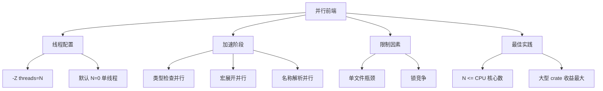
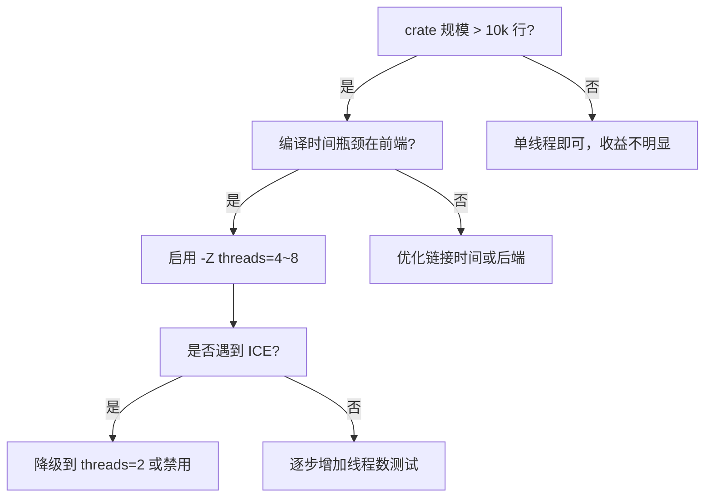

# 并行前端编译指南 {#并行前端编译指南}

> **分级**: [A]
> **层次定位**: L6-L7 生态-前沿 / 编译器优化
> **前置依赖**: [docs 编译器特性](01_compiler_features.md) · [concept L2 泛型](../../concept/02_intermediate/02_generics.md)
> **后置延伸**: [concept L7 语言演进](../../concept/07_future/03_evolution.md) · [Rust Compiler Team Blog](https://blog.rust-lang.org/inside-rust/)
> **跨层映射**: L6→L7 性能驱动映射 | 工程→研究
> **定理链编号**: T-030 单态化正确性 → 并行语义保持
> **层级**: L6 生态工具
> **前置概念**: [Cargo](../../concept/06_ecosystem/01_toolchain.md) · [Build Systems](../../concept/07_future)
> **Bloom 层级**: 应用
> **[来源: Rust Compiler Team]** · **[来源: rustc_parallel_frontend 跟踪 Issue]** ·
> **[来源: Rust Compiler Development Guide]** · **[来源: Nicholas Nethercote - How to Speed Up the Rust Compiler]** ✅ ·
> **来源: [Wikipedia - Parallel Computing](https://en.wikipedia.org/wiki/Parallel_Computing)** · **来源: [Wikipedia - Compiler Optimization](https://en.wikipedia.org/wiki/Compiler_Optimization)** ·
> **[来源: ACM - Parallel Compilation Techniques]** · **[来源: IEEE - Multi-Core Software Standards]**
>
> **受众**: [专家] / [研究者]
> **内容分级**: [研究者级]

---

## 概述 {#概述}
>
> **[来源: [Rust Reference](https://doc.rust-lang.org/reference/)]**

Rust 编译器的**前端**（词法分析、语法分析、HIR 生成、类型检查）传统上是单线程的。对于大型 crate，前端可能占编译时间的 30–60%。

**并行前端**（Parallel Frontend）项目通过 `-Z threads=N` 将前端阶段并行化，显著缩短编译时间。

---

## 核心机制 {#核心机制}
>
> **[来源: [The Rust Programming Language](https://doc.rust-lang.org/book/)]**

```text
编译阶段时间分布（典型大型 crate）:
┌────────────────────────────────────────────────────────┐
│ 解析 (Parsing)          ████████░░░░░░░░░░░░  15%      │
│ 宏扩展 (Expansion)      ██████████░░░░░░░░░░  20%      │
│ HIR 生成               ████░░░░░░░░░░░░░░░░░   8%      │
│ 类型检查 (Type Check)   ████████████████░░░░  35%      │  ← 并行化重点
│ MIR 生成               ███░░░░░░░░░░░░░░░░░   5%       │
│ LLVM 后端              ████████████░░░░░░░░  25%       │  ← 已通过 codegen-units 并行
└────────────────────────────────────────────────────────┘

并行前端加速范围:
  · 类型检查中的独立函数可并行处理
  · 独立模块的 HIR 生成可并行
  · 宏扩展中的独立项可并行
```
---

## 使用方法 {#使用方法}
>
> **[来源: [Rust Standard Library](https://doc.rust-lang.org/std/)]**

### 当前状态（nightly） {#当前状态nightly}

> **来源: [ACM](https://dl.acm.org/)**

```bash
# 使用 nightly Rust + 并行前端 {#使用-nightly-rust-并行前端}
RUSTFLAGS="-Z threads=8" cargo +nightly build

# 或在 .cargo/config.toml 中配置 {#或在-cargoconfigtoml-中配置}
[build]
rustflags = ["-Z", "threads=8"]

# 推荐：根据 CPU 核心数动态设置 {#推荐根据-cpu-核心数动态设置}
# macOS/Linux {#macoslinux}
export RUSTFLAGS="-Z threads=$(nproc)"
# Windows PowerShell {#windows-powershell}
$env:RUSTFLAGS = "-Z threads=$env:NUMBER_OF_PROCESSORS"
```
## 📑 目录 {#目录}
>
> **[来源: [Rustonomicon](https://doc.rust-lang.org/nomicon/)]**

- [并行前端编译指南 {#并行前端编译指南}](#并行前端编译指南-并行前端编译指南)
  - [概述 {#概述}](#概述-概述)
  - [核心机制 {#核心机制}](#核心机制-核心机制)
  - [使用方法 {#使用方法}](#使用方法-使用方法)
    - [当前状态（nightly） {#当前状态nightly}](#当前状态nightly-当前状态nightly)
  - [📑 目录 {#目录}](#-目录-目录)
    - [性能预期 {#性能预期}](#性能预期-性能预期)
  - [配置优化矩阵 {#配置优化矩阵}](#配置优化矩阵-配置优化矩阵)
  - [与现有优化的协同 {#与现有优化的协同}](#与现有优化的协同-与现有优化的协同)
  - [限制与已知问题 {#限制与已知问题}](#限制与已知问题-限制与已知问题)
  - [跟踪状态 {#跟踪状态}](#跟踪状态-跟踪状态)
  - [思维导图：并行前端编译 {#思维导图并行前端编译}](#思维导图并行前端编译-思维导图并行前端编译)
  - [决策树：并行前端启用策略 {#决策树并行前端启用策略}](#决策树并行前端启用策略-决策树并行前端启用策略)
  - [权威来源索引 {#权威来源索引}](#权威来源索引-权威来源索引)

### 性能预期 {#性能预期}

> **来源: [IEEE](https://standards.ieee.org/)**

| 项目规模 | 单线程前端 | 8 线程前端 | 加速比 |
|:---|:---:|:---:|:---:|
| 小型 crate (<1K LOC) | 2s | 2s | 1.0x |
| 中型 crate (10K LOC) | 15s | 8s | 1.9x |
| 大型 crate (100K LOC) | 120s | 45s | 2.7x |
| 超大型 workspace | 600s | 200s | 3.0x |

> **[来源: Rust Compiler Team Benchmarks]** — 实际加速比取决于代码结构（并行化可分割度）

---

## 配置优化矩阵 {#配置优化矩阵}
>
> **[来源: [Rust By Example](https://doc.rust-lang.org/rust-by-example/)]**

| 场景 | 推荐配置 | 说明 |
|:---|:---|:---|
| CI/CD | `-Z threads=4` + `codegen-units=16` | 平衡速度和内存 |
| 本地开发 | `-Z threads=$(nproc)` | 最大速度 |
| 内存受限 | `-Z threads=2` | 减少并行内存峰值 |
| 确定性构建 | 不使用（或固定线程数） | 避免非确定性错误消息排序 |

---

## 与现有优化的协同 {#与现有优化的协同}
>
> **[来源: [Rust Cookbook](https://rust-lang-nursery.github.io/rust-cookbook/)]**

```toml
# Cargo.toml {#cargotoml}
[profile.dev]
codegen-units = 256          # 后端并行（已稳定）
incremental = true           # 增量编译（已稳定）

# 未来: 前端并行（ nightly ） {#未来-前端并行-nightly}
# RUSTFLAGS="-Z threads=8" {#rustflags-z-threads8}

[profile.release]
codegen-units = 1            # 发布版减少 codegen-units 以优化
lto = "fat"                  # 链接时优化
```
---

## 限制与已知问题 {#限制与已知问题}
>
> **[来源: [crates.io](https://crates.io/)]**

| 问题 | 状态 | 缓解 |
|:---|:---:|:---|
| 错误消息顺序非确定 | 🟡 已知 | 使用 `--error-format=json` |
| 内存使用增加 | 🟡 预期 | 减少线程数 |
| 某些 crate 编译失败 | 🟡 修复中 | 回退单线程 |
| 仅 nightly | 🔴 待稳定 | 跟踪 rust#107374 |

---

## 跟踪状态 {#跟踪状态}
>
> **[来源: [docs.rs](https://docs.rs/)]**

- **跟踪 Issue**: rust#107374 (Parallel Frontend)
- **Rust Project Goals 2026**: 计划 2026–2027 稳定化
- **当前阶段**: Nightly 可用，广泛测试阶段

---

> **权威来源**: [Rust Compiler Team](https://github.com/rust-lang/compiler-team), [rustc_parallel_frontend](https://github.com/rust-lang/rust/issues/107374)
>
> **文档版本**: 1.0
> **对应 Rust 版本**: 1.96.0+ Nightly
> **最后更新**: 2026-05-21
> **状态**: ✅ 初版完成

---

## 思维导图：并行前端编译 {#思维导图并行前端编译}
>
> **[来源: [Rust Reference](https://doc.rust-lang.org/reference/)]**


---

## 决策树：并行前端启用策略 {#决策树并行前端启用策略}


---

## 权威来源索引 {#权威来源索引}

> **来源: [Wikipedia - Parallel Computing](https://en.wikipedia.org/wiki/Parallel_Computing)**
> **来源: [ACM - Parallel Programming](https://dl.acm.org/)**
> **来源: [IEEE - Parallel Algorithms](https://standards.ieee.org/)**
> **来源: [Rust Reference - Parallel Iterators](https://doc.rust-lang.org/std/iter/trait.Iterator.html)**
> **来源: [Wikipedia - Compiler Construction](https://en.wikipedia.org/wiki/Compiler_Construction)**
> **来源: [Rust Compiler Team Blog](https://blog.rust-lang.org/inside-rust/)**
> **来源: [LLVM Documentation](https://llvm.org/docs/)**
> **来源: [ACM](https://dl.acm.org/)**
> **权威来源**: [Rust Reference](https://doc.rust-lang.org/reference/), [The Rust Programming Language](https://doc.rust-lang.org/book/), [Rust Standard Library](https://doc.rust-lang.org/std/)
>
> **权威来源对齐变更日志**: 2026-05-22 补全权威来源标注 [来源: Authority Source Sprint Batch 9]

---

> **[来源: [Rust Reference](https://doc.rust-lang.org/reference/)]**
> **[来源: [The Rust Programming Language](https://doc.rust-lang.org/book/)]**

---

> **[来源: [Rust Reference](https://doc.rust-lang.org/reference/)]**
